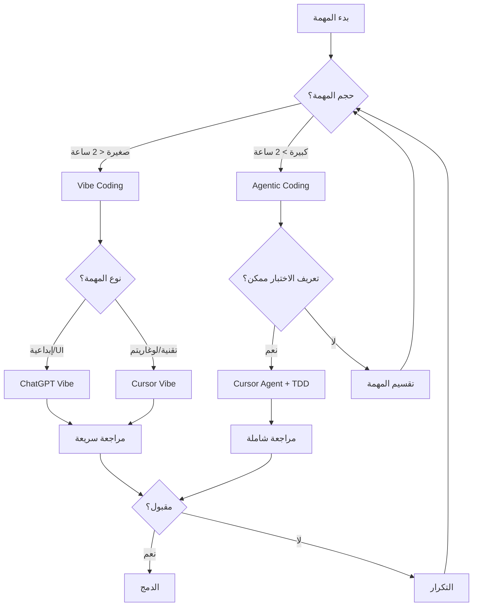

## نظرة عامة: نموذجان جديدان للتطوير

تُقدّم ورقة بحثية من جامعة كورنيل بعنوان "Vibe Coding vs. Agentic Coding in Software Engineering" نموذجين جديدين للتطوير بمساعدة الذكاء الاصطناعي يُحدّدان اتجاه الصناعة.

**Vibe Coding**: تطوير بالإحساس التعاوني، حيث يقود المطور النتيجة ويوجّه الذكاء الاصطناعي. دور المطور هنا هو **المدير الإبداعي (Creative Director)**.

**Agentic Coding**: تطوير بالوكيل المستقل، حيث يعمل الذكاء الاصطناعي باستقلالية ضمن قيود مُحدَّدة. دور المطور هنا هو **المشرف الاستراتيجي (Strategic Supervisor)**.

هذا الدليل يشرح كيفية تطبيق كلا النموذجين باستخدام ChatGPT وCursor AI في مشاريع حقيقية.

---

## الجزء الأول: فهم النموذجين

### Vibe Coding: أنت المدير الإبداعي

```
المطور (المدير الإبداعي)
    |
    | يُحدد الهدف والإحساس العام
    v
[ChatGPT / Cursor AI]
    |
    | يُنتج الشيفرة
    v
المطور يراجع ويُوجّه
    |
    | يُعدّل ويُحسّن
    v
النتيجة النهائية
```

**متى تستخدم Vibe Coding؟**
- النماذج الأولية السريعة
- استكشاف أفكار جديدة
- تطوير الواجهات الأمامية الإبداعية
- مشاريع الفرد الواحد

### Agentic Coding: أنت المشرف الاستراتيجي

```
المطور (المشرف الاستراتيجي)
    |
    | يُحدد القيود والأهداف والمعايير
    v
[Cursor AI Agent / Claude Code]
    |
    | يُحلل، يُخطط، يُنفّذ، يختبر
    v
المطور يراجع النتائج
    |
    | يُقرر القبول أو التعديل
    v
الدورة التالية
```

**متى تستخدم Agentic Coding؟**
- الميزات المعقدة التي تمتد على ملفات متعددة
- إعادة هيكلة قاعدة الشيفرة
- أتمتة المهام المتكررة
- التطوير في المشاريع الكبيرة

---

## الجزء الثاني: Vibe Coding مع ChatGPT

### استراتيجية 1: بناء النموذج الأولي بسرعة

```
# نموذج Vibe Coding الأساسي مع ChatGPT

أريد بناء [وصف التطبيق] بالإحساس الآتي:
- التصميم العام: [عصري / بسيط / جريء / رقيق]
- الألوان الرئيسية: [بالوصف، لا الـ hex]
- التجربة المرغوبة: [ما يشعر به المستخدم]

ابدأ بمكون [اسم المكون] وأضف الشعور الذي وصفته.
```

### مثال عملي: لوح معلومات تحليلي

```
أريد بناء لوح معلومات تحليلي لتطبيق SaaS.

الإحساس المطلوب:
- احترافي مثل Stripe Dashboard  
- بساطة Apple + قوة Notion
- بيانات كثيرة لكن لا إرباك

ابدأ بمكون KPI Cards يعرض:
- إيرادات الشهر الحالي
- عدد المستخدمين النشطين
- معدل التحويل
- النمو مقارنة بالشهر السابق

استخدم React مع TypeScript وTailwind CSS
```

**استجابة ChatGPT التقريبية:**

```tsx
// KPICards.tsx
// مكون بطاقات مؤشرات الأداء الرئيسية بتصميم Stripe

import { ArrowUpIcon, ArrowDownIcon } from '@heroicons/react/24/solid';

interface KPICardProps {
  title: string;
  value: string;
  change: number;
  icon: React.ComponentType<{ className?: string }>;
}

const KPICard: React.FC<KPICardProps> = ({ title, value, change, icon: Icon }) => {
  const isPositive = change >= 0;
  
  return (
    <div className="bg-white rounded-2xl p-6 shadow-sm border border-gray-100 hover:shadow-md transition-shadow duration-200">
      <div className="flex items-center justify-between mb-4">
        <div className="p-2 bg-blue-50 rounded-xl">
          <Icon className="w-5 h-5 text-blue-600" />
        </div>
        <span className={`flex items-center gap-1 text-sm font-medium ${
          isPositive ? 'text-emerald-600' : 'text-red-500'
        }`}>
          {isPositive ? (
            <ArrowUpIcon className="w-4 h-4" />
          ) : (
            <ArrowDownIcon className="w-4 h-4" />
          )}
          {Math.abs(change)}%
        </span>
      </div>
      <p className="text-gray-500 text-sm font-medium mb-1">{title}</p>
      <p className="text-gray-900 text-2xl font-bold">{value}</p>
    </div>
  );
};

export const KPICards: React.FC = () => {
  const metrics = [
    {
      title: "الإيرادات الشهرية",
      value: "$48,295",
      change: 12.5,
      icon: CurrencyDollarIcon,
    },
    // ... بقية البيانات
  ];
  
  return (
    <div className="grid grid-cols-1 sm:grid-cols-2 lg:grid-cols-4 gap-4">
      {metrics.map((metric) => (
        <KPICard key={metric.title} {...metric} />
      ))}
    </div>
  );
};
```

### استراتيجية 2: التكرار السريع مع Vibe Coding

```
# جولة التحسين في Vibe Coding

الكود السابق جيد لكنه يحتاج:
1. الرسوم المتحركة تبدو بطيئة - أريد حيوية أكثر (مثل Linear.app)
2. الأرقام تحتاج تحريكًا عند التحديث
3. أضف حالة skeleton loading

حافظ على نفس البنية لكن أضف الحياة
```

---

## الجزء الثالث: Agentic Coding مع Cursor AI

### استراتيجية 3: تكليف الوكيل بمهمة محددة

```
# نموذج Agentic Coding مع Cursor

@codebase 
لديّ مهمة محددة ومُقيّدة:

الهدف: [وصف دقيق للوظيفة]

القيود:
- لا تُعدّل الملفات: [قائمة الملفات المحمية]
- يجب الحفاظ على: [السلوك الحالي X]
- المتطلبات الصارمة: [قائمة المتطلبات]

خطوات التنفيذ:
1. حلل [الملفات المحددة] أولًا
2. خطّط التعديلات قبل التنفيذ
3. نفّذ مع اختبارات وحدة
4. تحقق من عدم كسر الاختبارات الحالية

ابدأ بتحليل البنية الحالية وأخبرني بخطتك قبل أي تغيير.
```

### استراتيجية 4: دورة TDD مع Agentic Coding

```
# نمط TDD مع وكيل Cursor

المرحلة 1 (أكتبها أنا):
- أحتاج اختبارات لوظيفة تحقق من صحة البريد الإلكتروني
- يجب أن تفشل في: عناوين بدون @ وبدون نقطة ومكررة
- يجب أن تنجح في: عناوين صالحة ومع نطاقات فرعية

المرحلة 2 (ينفذها الوكيل):
@cursor اكتب الاختبارات أولًا (TDD)، ثم نفّذ الوظيفة حتى تنجح جميعها.
استخدم Jest مع TypeScript. أخبرني إذا احتجت قراراتي في أي مفترق.
```

---

## الجزء الرابع: سير العمل الهجين

### مخطط تدفق القرار



---

## الجزء الخامس: تتبع الأداء

### نظام تتبع مقارن

```python
# scripts/ai_productivity_tracker.py
# نظام تتبع إنتاجية برمجة الذكاء الاصطناعي

import json
import time
import datetime
from dataclasses import dataclass, asdict
from pathlib import Path
from typing import Literal

@dataclass
class CodingSession:
    """جلسة برمجة واحدة"""
    session_id: str
    date: str
    paradigm: Literal["vibe", "agentic", "hybrid"]
    tool: Literal["chatgpt", "cursor", "claude", "gemini"]
    task_type: str
    duration_minutes: int
    lines_written: int
    lines_reviewed: int
    tests_added: int
    bugs_introduced: int
    bugs_caught_in_review: int
    subjective_quality: int  # 1-10
    notes: str

class AIProductivityTracker:
    def __init__(self, data_file: str = "ai_productivity_data.json"):
        self.data_file = Path(data_file)
        self.sessions = self._load_sessions()
    
    def _load_sessions(self) -> list:
        """تحميل الجلسات المحفوظة"""
        if self.data_file.exists():
            with open(self.data_file) as f:
                return json.load(f)
        return []
    
    def add_session(self, session: CodingSession) -> None:
        """إضافة جلسة جديدة"""
        self.sessions.append(asdict(session))
        self._save()
    
    def _save(self) -> None:
        """حفظ البيانات"""
        with open(self.data_file, "w", encoding="utf-8") as f:
            json.dump(self.sessions, f, ensure_ascii=False, indent=2)
    
    def compare_paradigms(self) -> dict:
        """مقارنة الأداء بين النموذجين"""
        vibe_sessions = [s for s in self.sessions if s["paradigm"] == "vibe"]
        agentic_sessions = [s for s in self.sessions if s["paradigm"] == "agentic"]
        
        def calc_metrics(sessions):
            if not sessions:
                return {}
            return {
                "متوسط_الجودة": sum(s["subjective_quality"] for s in sessions) / len(sessions),
                "متوسط_الإنتاجية_سطر_دقيقة": sum(
                    s["lines_written"] / max(s["duration_minutes"], 1) 
                    for s in sessions
                ) / len(sessions),
                "معدل_الأخطاء": sum(s["bugs_introduced"] for s in sessions) / 
                               max(sum(s["lines_written"] for s in sessions), 1) * 100,
                "عدد_الجلسات": len(sessions)
            }
        
        return {
            "vibe_coding": calc_metrics(vibe_sessions),
            "agentic_coding": calc_metrics(agentic_sessions),
            "التوصية": self._recommend_paradigm(vibe_sessions, agentic_sessions)
        }
    
    def _recommend_paradigm(self, vibe: list, agentic: list) -> str:
        """توصية مبنية على البيانات"""
        if not vibe or not agentic:
            return "بيانات غير كافية لتوصية موثوقة"
        
        vibe_quality = sum(s["subjective_quality"] for s in vibe) / len(vibe)
        agentic_quality = sum(s["subjective_quality"] for s in agentic) / len(agentic)
        
        if agentic_quality > vibe_quality + 1:
            return "Agentic Coding يُنتج جودة أعلى لديك"
        elif vibe_quality > agentic_quality + 1:
            return "Vibe Coding يناسبك أكثر"
        else:
            return "استخدام هجين مثالي لك"

# مثال على الاستخدام
tracker = AIProductivityTracker()

# تسجيل جلسة Vibe Coding
tracker.add_session(CodingSession(
    session_id="s001",
    date=datetime.date.today().isoformat(),
    paradigm="vibe",
    tool="chatgpt",
    task_type="ui_component",
    duration_minutes=45,
    lines_written=120,
    lines_reviewed=120,
    tests_added=0,
    bugs_introduced=2,
    bugs_caught_in_review=2,
    subjective_quality=8,
    notes="مكون جميل ولكن يحتاج اختبارات"
))

# عرض مقارنة الأداء
print(json.dumps(tracker.compare_paradigms(), ensure_ascii=False, indent=2))
```

---

## الجزء السادس: استخدام Cursor للميزات المتقدمة

### ميزة Cursor Composer للمشاريع الكبيرة

```
# نموذج Cursor Composer متقدم

@workspace أحتاج إضافة نظام إشعارات كامل للتطبيق.

المتطلبات الوظيفية:
1. إشعارات في التطبيق (in-app)
2. إشعارات البريد الإلكتروني
3. إشعارات Slack (اختيارية)
4. تفضيلات المستخدم للإشعارات

القيود التقنية:
- يجب استخدام البنية الحالية: @src/services/
- لا تُعدّل: @src/auth/ (هيكل المصادقة ثابت)
- استخدم نمط Observer الموجود في: @src/core/events.ts

خطة التنفيذ المطلوبة:
1. تحليل الهيكل الحالي
2. تصميم NotificationService
3. ربطه بالأحداث الموجودة
4. إضافة اختبارات تكاملية

وافقني على الخطة قبل التنفيذ.
```

---

## الجزء السابع: سيناريوهات عملية

### سيناريو 1: شركة ناشئة في مرحلة مبكرة

```yaml
# .cursor/startup-rules.yaml
# قواعد للشركات الناشئة (السرعة أولًا)

paradigm: vibe-first
workflow:
  mvp_phase:
    primary_tool: chatgpt
    approach: vibe-coding
    goal: إثبات المفهوم في 48 ساعة
    
  growth_phase:
    primary_tool: cursor
    approach: hybrid
    goal: جودة مع سرعة

quality_gates:
  pre_launch:
    - "اختبار يدوي للمسار الحرج"
    - "مراجعة أمان سريعة"
  post_launch:
    - "إضافة اختبارات للأخطاء المُبلَّغ عنها"
```

### سيناريو 2: مؤسسة تُهاجر إلى الذكاء الاصطناعي

```yaml
# .cursor/enterprise-migration-rules.yaml
# قواعد الهجرة المؤسسية (الأمان أولًا)

paradigm: agentic-first
approach:
  phase_1_analysis:
    tool: gemini-cli
    task: "تحليل شامل لقاعدة الشيفرة القديمة"
    
  phase_2_planning:
    tool: claude-code
    task: "خطة هجرة مفصلة مع اختبارات رجعية"
    
  phase_3_implementation:
    tool: cursor-agent
    task: "تنفيذ تدريجي مع gates جودة"
    
security_requirements:
  - "مراجعة بشرية لكل تغيير في قاعدة البيانات"
  - "اختبارات تكاملية قبل كل دمج"
  - "فحص أمان تلقائي في CI/CD"
```

---

## الجزء الثامن: قائمة مراجعة الأمان

### أمان Vibe Coding

```markdown
## قائمة مراجعة Vibe Coding الأمنية

### قبل استخدام الشيفرة المُولَّدة:

[ ] لا توجد مفاتيح API مُضمَّنة في الشيفرة
[ ] التحقق من المدخلات (Input Validation) موجود
[ ] معالجة الأخطاء لا تكشف معلومات حساسة
[ ] استعلامات قاعدة البيانات محمية من SQL Injection
[ ] المصادقة والتفويض صحيحان

### للشيفرة في الإنتاج إضافيًا:

[ ] اختبارات أمان OWASP الأساسية
[ ] مراجعة بشرية من مطور آخر
[ ] فحص التبعيات بحثًا عن ثغرات معروفة
[ ] تسجيل (Logging) مناسب بدون بيانات حساسة
```

### أمان Agentic Coding

```markdown
## قائمة مراجعة Agentic Coding الأمنية

### قبل تشغيل الوكيل:

[ ] تحديد ملفات "للقراءة فقط" يُمنع تعديلها
[ ] تقييد صلاحيات الوكيل بالحد الأدنى اللازم
[ ] إعداد نقطة استعادة (Git checkpoint) قبل البدء
[ ] تحديد ما يمكن وما لا يمكن للوكيل فعله

### بعد تنفيذ الوكيل:

[ ] مراجعة كل ملف تم تعديله
[ ] تشغيل الاختبارات الكاملة
[ ] التحقق من عدم كسر واجهات API
[ ] فحص أي استدعاءات خارجية مُضافة
```

---

## الجزء التاسع: إرشادات العمل الجماعي

### إعداد معايير الفريق

```markdown
# CONTRIBUTING.md - معايير برمجة الذكاء الاصطناعي

## متى نستخدم كل نموذج

### Vibe Coding مسموح به:
- المكونات المرئية الجديدة
- النماذج الأولية للعروض التقديمية
- الصفحات الترويجية والتسويقية

### Agentic Coding مطلوب:
- أي تغيير في طبقة البيانات
- منطق الأعمال الأساسي
- تعديلات على APIs العامة
- أي شيء يؤثر على الأمان

### المراجعة المطلوبة دائمًا:
- مطور آخر يراجع الشيفرة المُولَّدة
- اختبارات تُغطي المسارات الحرجة
- توثيق يوضح ما فعله الذكاء الاصطناعي وما عدّله المطور
```

---

## الجزء العاشر: خارطة طريق التطور

### مؤشرات الإتقان

```markdown
## مستوى المبتدئ (0-3 أشهر)
- [ ] يستخدم Vibe Coding لمهام UI بسيطة
- [ ] يراجع الشيفرة المُولَّدة قبل الاستخدام
- [ ] يُضيف اختبارات للشيفرة المُولَّدة

## مستوى المتوسط (3-6 أشهر)
- [ ] يُحدد متى يستخدم Vibe مقابل Agentic
- [ ] يكتب طلبات (prompts) فعّالة ومحددة
- [ ] يُدمج الذكاء الاصطناعي في سير CI/CD

## مستوى المتقدم (6-12 شهرًا)
- [ ] يُصمم سير عمل هجين مُحسَّن
- [ ] يُنشئ قواعد مخصصة لفريقه
- [ ] يقيس ويُحسّن الإنتاجية بالبيانات

## مستوى الخبير (12+ شهرًا)
- [ ] يُدرّب الفريق على النموذجين
- [ ] يُساهم في أدوات ومكتبات مفتوحة المصدر
- [ ] يُطوّر أدوات مخصصة للشركة
```

---

## الخلاصة: حدد مسارك الشخصي

جدول مقارنة ROI:

| المعيار | Vibe Coding | Agentic Coding | الهجين |
|---------|-------------|----------------|--------|
| سرعة التعلم | سريعة جدًا | متوسطة | تدريجية |
| جودة الكود النهائية | متوسطة | عالية | عالية جدًا |
| الإنتاجية قصيرة المدى | عالية جدًا | متوسطة | عالية |
| الإنتاجية طويلة المدى | متوسطة | عالية جدًا | عالية جدًا |
| متطلبات الخبرة | منخفضة | متوسطة | متوسطة |
| المناسب لـ | المبتدئين / الشركات الناشئة | المحترفين / المؤسسات | الجميع |

**التوصية العملية**: ابدأ بـ Vibe Coding لتسريع التعلم، ثم أضف Agentic Coding تدريجيًا مع نضوجك كمطور. الهدف النهائي هو سير عمل هجين يأخذ أفضل ما في النموذجين.
