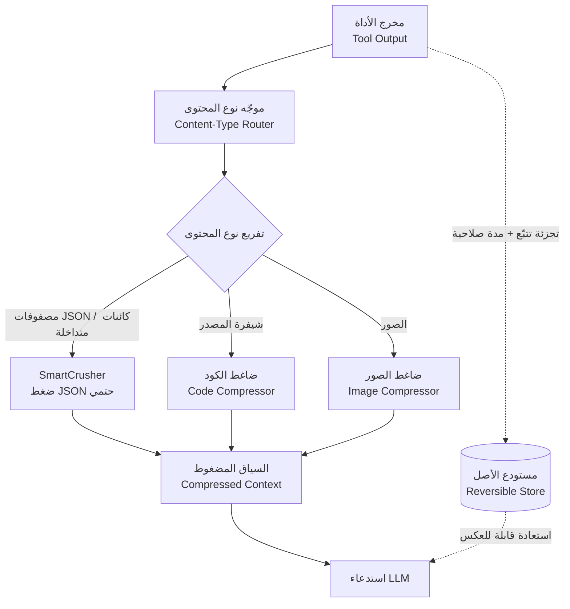

*السياق ليس مجانيًا. تكثيف الرموز المبعثرة بلا فقدان هو ما يفعله Headroom.*

## نظرة عامة

أي فريق يشغّل وكلاء برمجة بالذكاء الاصطناعي يوميًا يعرف من أين تأتي أكبر تكلفة خفية. إنها السياق. تتراكم مخرجات الأدوات ونتائج RAG والسجلات والملفات وتاريخ المحادثة في كل دور، وتتحول تلك الرموز إلى الفاتورة. في سير العمل متعدد الوكلاء تنمو هذه التكلفة لا خطيًا بل تضاعفيًا، لأنه في كل مرة يُسقط فيها وكيل فرعي مخرَج JSON كبيرًا في السياق، تنمو رموز قراءة الذاكرة المؤقتة معه.

هذه المقالة ليست مجرد تعريف بأداة. تشغّل ThakiCloud بالفعل Headroom ضمن سلسلة أدواتها الإنتاجية، وهذه المرة سحبنا ثلاثة مخرجات أدوات JSON حقيقية من مستودعنا وشغّلنا Headroom عليها مباشرةً. نوثّق أمر التثبيت وكود الدمج والأرقام المقاسة لخفض الرموز بصيغة قابلة لإعادة الإنتاج. الخلاصة المختصرة: كلما زاد التكرار في بنية JSON زاد التوفير، وعلى بياناتنا بلغ خفض الرموز 71.2%. كل رقم قِيس في بيئة معزولة حقيقية دون خلط أي تقديرات.

## ما هو Headroom

Headroom (اسم الحزمة على PyPI هو `headroom-ai`، وعلى GitHub `chopratejas/headroom`) أداة ضغط سياق فتح مصدرها المهندس السابق في Netflix، Tejas Chopra. هدفها المعلن واضح: ضغط مخرجات الأدوات والسجلات والملفات وأجزاء RAG قبل وصولها إلى نموذج LLM، لخفض الرموز مع الإبقاء على الإجابة كما هي.

معظم أدوات تقليل السياق الحالية غير قابلة للعكس. بمجرد القطع لا يمكنك استعادة الأصل. ميزة Headroom الجوهرية أنها تعمل محليًا وتغطي أنواع محتوى متعددة وقابلة للعكس. يمكن استعادة الأصل ضمن مدة صلاحية (TTL) محددة عبر تجزئات تتبّع. هذا يمنع بنيويًا الفشل التقليدي: "ضغطنا فضاع التفصيل لدى الوكيل." يمكنك العمل على النسخة المضغوطة افتراضيًا واستعادة الأصل فقط عند الحاجة لقسم محدد.

هناك ثلاث طرق للربط: كمكتبة تستدعيها مباشرة، أو كوكيل (proxy)، أو كخادم MCP. تتعرف على نوع المحتوى وتضغط انتقائيًا، فتبقي على القيم الشاذة فقط في JSON أو على أسطر الفشل فقط في السجلات.

### البنية الداخلية: SmartCrusher هو الجوهر

يوجّه Headroom إلى ضاغط مختلف لكل نوع محتوى. في هذه التجربة ظهرت التحويلات الفعلية في سجل الموجّه على هيئة `router:protected:user_message` و`router:mixed:...`، أي أنه يحمي رسالة المستخدم ويضغط فقط حمولة JSON في رسائل الأدوات.

- **SmartCrusher**: ضاغط JSON عام يتعامل مع مصفوفات القواميس والكائنات المتداخلة والأنواع المختلطة. لمخرجات أدوات JSON المتكررة (نتائج البحث، صفوف السجلات، قوائم السجلات) يطوي المفاتيح المكررة ويستنتج المخطط ليختصر بشكل حتمي. وقد تحمّل معظم التوفير في قياسنا.
- **ضاغط الكود**: ضغط شيفرة المصدر بوعي بنيوي.
- **ضغط الصور**: حمولات الصور تُختصر أيضًا.

المخطط أدناه هو تدفق البيانات الذي رصدناه. يمر مخرج الأداة عبر الموجّه إلى SmartCrusher، وبينما يذهب السياق المضغوط إلى استدعاء LLM، يُحفظ الأصل منفصلًا للاستعادة القابلة للعكس عند الحاجة.


*تدفق بيانات Headroom: يمر مخرج الأداة عبر موجّه نوع المحتوى، يُضغط بواسطة SmartCrusher، ثم يُرسل إلى LLM — بينما يُحفظ الأصل في مستودع قابل للعكس بمدة صلاحية محددة. انقر المخطط لتكبيره.*

## التثبيت والدمج

وقت تشغيل Python لدينا موحّد في مفسّر واحد (3.12.8) داخل `.venv`. التثبيت سطر واحد.

```bash
VIRTUAL_ENV="$PWD/.venv" uv pip install "headroom-ai[code,relevance]"
```

تُفعّل الإضافة `[code,relevance]` الضغط الواعي ببنية الكود والترشيح المبني على الصلة. الضغط الدلالي للنص العادي يحتاج نموذجًا إضافيًا (نحو 261 ميجابايت)، لكن مسار JSON الأعلى تأثيرًا يعمل بهذا التثبيت الأساسي وحده.

أبسط دمج هو تمرير قائمة رسائل مباشرة. جوهر الغلاف الذي نستخدمه فعليًا (`scripts/headroom_compress.py`) أدناه. ضع مخرج الأداة محتوى لرسالة بدور `tool` واستدعِ `compress`.

```python
from headroom import compress

messages = [
    {"role": "user", "content": "Summarize this tool output"},
    {"role": "assistant", "content": None,
     "tool_calls": [{"id": "c1", "type": "function",
                     "function": {"name": "tool", "arguments": "{}"}}]},
    {"role": "tool", "tool_call_id": "c1", "content": raw_json_string},
]

result = compress(messages, model="claude-sonnet-4-5-20250929")
compressed = result.messages[-1]["content"]
print(result.tokens_before, "->", result.tokens_after, result.transforms_applied)
```

يحمل الكائن الذي يعيده `compress` الحقول `tokens_before` و`tokens_after` و`transforms_applied`، فيتحقق الكود لاحقًا مما فعله الضغط فعليًا. الجوهر أن هذه قيم قاستها المكتبة لا أرقام أبلغ عنها النموذج ذاتيًا. وفوق ذلك تحققنا مرة أخرى بمُرمِّز منفصل (tiktoken).

## نتائج التجربة الفعلية

جرت التجربة في بيئة معزولة عبر git worktree. لا تمس هذه البنية شجرة العمل الرئيسية وتبقي النتائج فقط في دليل أدلة. بيانات الاختبار ثلاثة من مخرجات مستودعنا الحقيقية ذات بنية JSON متكررة بوضوح.

1. **skill_index.json**: فهرس BM25 لبحث المهارات. تتكرر سجلات بمخطط متطابق على نطاق واسع.
2. **seedance-prompts/raw-prompts.json**: كتالوج من 605 موجّهات. نص اللغة الطبيعية هو الحصة الغالبة.
3. **أرشيف خط زمني twitter**: 1385 سجلًا زمنيًا. مصفوفة كائنات ببنية مفاتيح متطابقة.

قِيست أعداد الرموز بمُرمِّز `cl100k_base`. سجّلنا البايتات والرموز معًا لأن الضغط يُحكم عليه لا بتوفير البايتات الخام بل بمقدار فائدته في وحدة الفوترة الفعلية، أي الرمز. النتائج أدناه.

| بيانات الاختبار | الرموز الأصلية | الرموز بعد الضغط | خفض الرموز | خفض البايتات | الزمن |
|---|---|---|---|---|---|
| skill_index (فهرس BM25) | 1,618,287 | 465,445 | **71.2%** | 64.9% | 2.08s |
| twitter-timeline (مصفوفة سجلات) | 399,926 | 192,465 | **51.9%** | 57.0% | 0.24s |
| seedance-prompts (كتالوج موجّهات) | 1,085,592 | 713,210 | **34.3%** | 38.5% | 0.57s |


*نسب الخفض المقاسة لثلاثة مخرجات أدوات JSON من مستودع ThakiCloud. البايتات والرموز معروضة معًا.*

طريقة قراءة الأرقام مهمة. **كلما زاد تكرار البنية زاد التوفير.** skill_index فهرس لسجلات متطابقة المخطط مكتظة، فبلغ طي المفاتيح في SmartCrusher ذروته وخفض الرموز 71.2% كاملة. وخط twitter الزمني، وهو أيضًا مصفوفة كائنات منتظمة، اختُصر بأكثر من النصف. في المقابل seedance-prompts، حيث يشكّل نص الموجّهات الطبيعي معظم كل سجل، لم يكن أمامه إلا مجال ضيق للاختصار البنيوي فاستقر عند 34.3%. هذا الفرق يبرهن مباشرةً على نية التصميم بأن "JSON هو حيث يعمل أفضل ما يكون."

التوقيت جدير بالملاحظة أيضًا. عالج فهرسًا من 1.6 مليون رمز في ثانيتين، والبقية في أقل من ثانية. هذا سريع بما يكفي لإدراجه قبل دخول مخرج الأداة إلى السياق مباشرةً دون تأخّر محسوس تقريبًا. ولأن الضغط حتمي، يعطي المدخل نفسه دائمًا المخرج نفسه، وهو أيضًا صديق للذاكرة المؤقتة.

تنويه أمين واحد. الأرقام أعلاه قياسات لتشغيل مفرد على ثلاث مجموعات بيانات. على أنواع JSON أخرى، خاصةً البيانات ذات القيم الفريدة غالبًا والمفاتيح المكررة القليلة، قد يكون الخفض أقل. ومع ذلك، ضمن نطاق قياسنا، يُعد مدى خفض رموز من 34 إلى 71% نتيجة ذات معنى واضح، على الأقل لمخرجات الأدوات ذات البنية المتكررة.

## التطبيق على منصة ThakiCloud لخدمات AI/ML على K8s

النقطة التي اعتمدنا فيها Headroom هي بالضبط ما تُظهره التجربة أعلاه: **مخرجات أدوات JSON الكبيرة ذات البنية المتكررة.** قاعدة نظافة السياق لدينا (`ecc-token-strategy`) تنص على ذلك: مخرجات مصفوفات JSON المتكررة تُضغط حتميًا بـ SmartCrusher قبل دخول السياق، والنص العادي ليس هدفًا بل JSON هو الهدف، والأولوية تلخيص الوكيل الفرعي أولًا ثم ضغط headroom.

سبب أهمية هذا الشديدة في تنسيق وكلاء متعدد على K8s هو بنية التكلفة. في سير عمل تعمل فيه وكلاء فرعيون كثر، تعني نظافة السياق ثلاثة أمور دفعة واحدة. الأول التحكم في تكلفة الرموز. الثاني إدارة معدل إصابة الذاكرة المؤقتة؛ فالضغط الحتمي يضمن مخرجًا متطابقًا لمدخل متطابق فلا يكسر ذاكرة الموجّهات المؤقتة. الثالث إدارة زمن الاستجابة؛ فكلما صغر السياق أسرع النموذج في الرد.

تجدول خدمة LLM لدينا أعباء GPU عبر Kueue فوق K8s، وتتدفق طلبات استدلال كثيرة بالتوازي. في هذه البيئة، السياق المتضخم يكلّف أكثر من طلب واحد؛ فهو يلتهم الإنتاجية الكلية. يتيح Headroom إدراج هذه الطبقة دون أي تغيير في الكود تقريبًا. نضغط مصفوفة نتائج بحث أو سجلات بسطر واحد قبل دخولها السياق مباشرةً، ونستعيد بشكل قابل للعكس فقط عند الحاجة لقسم محدد.

وهو عملي من منظور عالِم البيانات أيضًا. في مسار RAG حيث تأتي الأجزاء المسترجعة محمّلة ببيانات وصفية متكررة (مفاتيح متطابقة مثل عنوان المصدر والطابع الزمني والدرجة)، فإن تلك البيانات الوصفية هي تحديدًا المنطقة التي يختصرها SmartCrusher أفضل اختصار. ولأنه يحفظ المتن ويختصر العبء البنيوي فقط، تؤمّن ميزانية سياق دون التضحية بدقة الاسترجاع.

## القيود والاعتراضات

لا نوصي بهذه الأداة دون نقد. إليك القيود والاعتراضات بأمانة.

**أولًا، التنفيذ المحلي شرط مسبق.** يحتاج Headroom إلى تشغيل عملية محلية، فلا يصلح في بيئات تنفيذ معزولة بالكامل. هناك أشكال نشر لا يلائمها هذا القيد.

**ثانيًا، التأثير على النص العادي محدود.** كما تُظهر نتيجة seedance-prompts، فالبيانات ذات الحصة العالية من نص اللغة الطبيعية أمامها مجال ضيق للاختصار البنيوي. اختصار النص العادي دلاليًا يتطلب نموذجًا إضافيًا، وذلك المسار يتنازل عن بعض الحتمية والسرعة.

**ثالثًا، قد يكون مبالغًا فيه للفرق ذات المزوّد الواحد.** إن كفى ضغط المزوّد الأصلي لنموذج واحد ولم تحتج ذاكرة عبر الوكلاء، فقد يفوق عبء تشغيل طبقة ضغط منفصلة المكسب.

**رابعًا، أقوى اعتراض هو "ألا يكفي التلخيص بوكيل فرعي؟"** في الواقع قاعدتنا نفسها تقدّم تلخيص الوكيل الفرعي على ضغط headroom. التلخيص غير قابل للعكس لكنه يختصر أكثر بكثير ويضغط بالمعنى. فأين يقع Headroom إذن؟ الجواب "حين يفقد التلخيص تفاصيل قد تُحتاج لاحقًا." القابلية للعكس تسد هذه الفجوة تحديدًا. تعمل على النسخة المضغوطة عادةً، وفي لحظة احتياجك لأصل سجل محدد، تستعيده بدقة ضمن مدة الصلاحية. التلخيص والضغط ليسا متنافسين بل متكاملين.

باختصار، يجسّد Headroom مبدأ "السياق ليس مجانيًا" بتصميم ملموس هو الضغط القابل للعكس. ضمن نطاق قياسنا خفض الرموز 34-71% على JSON المتكرر البنية، وبفضل الحتمية والقابلية للعكس لم يكسر الذاكرة المؤقتة ولم يفقد التفاصيل. إن كنت مهندسًا يهتم بكيفية تعامل ThakiCloud مع نظافة السياق كمشكلة تكلفة وموثوقية، فنحن المكان الذي يشغّل هذه الطبقة في الإنتاج.

---

المصادر: Headroom (headroom-ai)، PyPI https://pypi.org/project/headroom-ai/ · GitHub https://github.com/chopratejas/headroom (المؤلف Tejas Chopra). الأرقام في هذه المقالة مقاسة مباشرةً على بيانات مستودع ThakiCloud.
