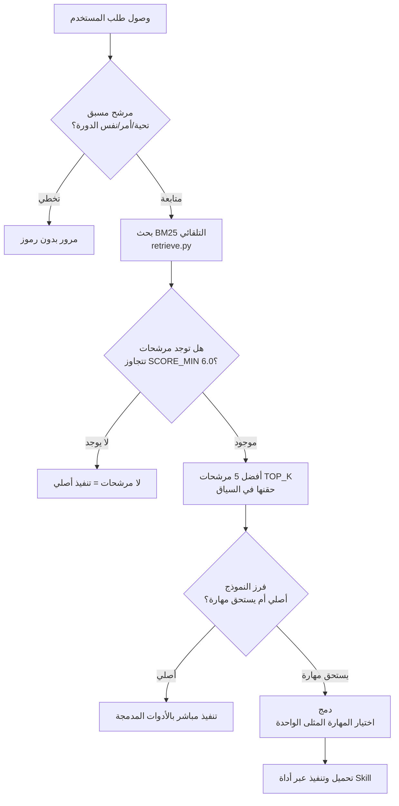

## نظرة عامة: المشكلة التي خلقها تكاثر المهارات

عندما تشغّل نظام وكيل ذكاء اصطناعي لفترة طويلة، تتراكم المهارات بشكل طبيعي. في البداية عشرات، ثم مئات، وذات يوم تفتح الكتالوج لتجد 1,620 مهارة. هذا هو الوضع الحالي للبنية التحتية لوكيل ThakiCloud القائم على Claude Code. نحو 1,620 مهارة محلية، و55 وكيلاً فرعياً، و36 قاعدة دائمة التشغيل، و22 أمر شريط مائل، و12 خطافاً تعمل معاً.

أول حدس يواجهك هنا هو "كلما زادت المهارات، كان الوكيل أقوى." هذا خطأ. مع تضاعف المهارات، يصبح الوكيل في الواقع أبطأ، ويختار مهارة خاطئة، أو يبدأ في الإجابة خاماً دون استخدام أي مهارة على الإطلاق. المشكلة لم تكن في عدد المهارات، بل كانت في التوجيه.

تسجّل هذه المقالة مبادئ تصميم التوجيه المكتسبة من تشغيل منظومة مهارات تضم أكثر من 1,600 مهارة بمفردي. تتناول كيف طُبّق تعزيز استرجاع المهارات (SRA, arXiv:2604.24594) في بيئة تشغيل حقيقية، وما الذي تقوم به بوابة BM25، ولماذا تحدد جودة الوصف دقة البحث، وبصدق، ما الذي لا يزال ناقصاً.

## لماذا تُبطّئك المهارات الكثيرة: ضريبة الضوضاء

نافذة السياق في Claude Code محدودة. وضع قائمة المهارات كاملة في السياق في كل دورة يقلل الرموز المتاحة للعمل الفعلي. هذه هي "ضريبة الضوضاء." مجرد سرد أسماء وأوصاف مختصرة لـ1,620 مهارة يصل إلى عشرات الآلاف من الرموز. حقن هذا في كل دورة يُفجّر التكاليف ويُضيّع النموذج بين أسماء مهارات غير ذات صلة.

المشكلة الأشد خطورة هي "المطابقة القسرية." وهي ظاهرة التقاط النموذج للمهارة الخاطئة لأن اسمها يتداخل جزئياً مع شيء في قائمة المهارات. على سبيل المثال، تحميل مهارة `4phase-debugging` لطلب بسيط مثل "صحّح هذه الخطأ" وتشغيل سير عمل معقد، أو استخراج مهارة `technical-writer` لتعديل ملف بسيط. مع تضاعف المهارات، تزداد احتمالية هذه الضوضاء.

تُعرّف ورقة SRA (arXiv:2604.24594) هذه المشكلة بأن "ضوضاء المشتتات هي الخطر الأساسي للدقة في بيئات تضم أكثر من 1,000 مهارة." اتجاه الحل واضح: بدلاً من إظهار جميع المهارات للوكيل، يتم تصفية المرشحين القليلين المرتبطين فعلاً بالطلب الحالي فقط.

## بوابة SRA + BM25 ذات المرحلتين

الهيكل الذي اعتمدته ThakiCloud يجمع بين بروتوكول SRA المكون من ثلاث مراحل وبوابة تلقائية قائمة على BM25.



### المرحلة 1: الاسترجاع - البحث التلقائي BM25

خطاف `skill-router-gate.py` مُوصَّل بحدث `UserPromptSubmit`. في اللحظة التي يُرسل فيها المستخدم الموجّه، يُشغَّل هذا الخطاف أولاً.

الخطوة الأولى للخطاف هي المرشح المسبق. التحيات ("مرحباً")، والتأكيدات البسيطة ("فهمت")، والأوامر الصرفة (تعديل مسار الملف مباشرة) تمر فوراً بدون بحث BM25. إذا كانت هناك كلمة مفتاحية لتشغيل مهارة صريحة (`/review`، `/debug`، إلخ)، تُوجَّه قسراً إلى تلك المهارة.

الخطوة الثانية هي بحث BM25. يُفهرس `retrieve.py` المقدمة الأمامية لـ SKILL.md وتعريفات الوكيل وكتالوج المهارات بـ BM25، ثم يحسب الصلة بالاستعلام الحالي. مستعيناً بالترجيح IDF وقاموس مرادفات كوري-إنجليزي عبر اللغتين (25+ زوجاً من المفردات)، يُضيّق نطاق 1,200+ مهارة في الوقت الفعلي. يتم تصفية المرشحين الحاصلين على SCORE_MIN (6.0) أو أعلى فقط، بحد أقصى TOP_K (5)، وحقنهم في السياق. إذا كان الطلب مطابقاً للدورة السابقة، يُتجاوز إعادة الحقن. تُسجَّل جميع نتائج التوجيه في `state/skill-router.jsonl`.

### المرحلة 2: الفرز - أصلي مقابل يستحق مهارة

ينظر النموذج إلى قائمة المرشحين المحقونة ويحكم على طبيعة المهمة الحالية.

- المهام الأصلية: تعديل الملفات، وأوامر git، والأسئلة والأجوبة البسيطة، وتعديل سطر واحد من الكود، وgrep. المهام التي تكفيها الأدوات المدمجة. تُنفَّذ مباشرة بدون تحميل مهارة.
- المهام التي تستحق مهارة: الكتابة المنظمة، ومراجعة الكود متعددة النطاقات، وتنسيق خطوط الأنابيب، والتحليل المتخصص في النطاق، وتوليد الوثائق. المهام التي تستفيد من مهارة تحتوي على قائمة تحقق أو سير عمل.

عندما يكون الحكم غامضاً، الأصلي هو القيمة الافتراضية. المعيار هو ما إذا كانت تكلفة سير العمل المنظم تستحق العناء.

### المرحلة 3: الدمج - اختيار المهارة المثلى الواحدة

بمجرد تصنيفها كمهمة تستحق مهارة، يُختار مرشح واحد من قائمة BM25، ويُذكر سبب الاختيار في جملة واحدة، ويُحمَّل عبر أداة Skill. إذا كان هناك مرشحان أو أكثر بنفس المستوى تقريباً، يُسأل المستخدم. إذا لم يكن هناك مرشحون، يُعاد إلى الأصلي. المطابقة القسرية لا تُمارَس.

تُدار أيضاً مجموعة وكلاء منفصلة. يتم البحث عن الـ55 وكيلاً فرعياً في فهرس منفصل عن مجموعة المهارات العامة، بحيث تسير المهارات الموجهة للمستخدم ووكلاء التنسيق بدون تشويش.

## انضباط جودة الوصف

دقة BM25 تعتمد في نهاية المطاف على جودة وصف كل مهارة. BM25 يقرأ النص. إذا كانت الأوصاف مبهمة، تحصل المهارات المتشابهة على درجات متقاربة للاستعلام ذاته وتظهر مرشحات خاطئة.

صيغة الوصف التي تُفرضها ThakiCloud تتكون من ثلاثة عناصر.

```yaml
description: >-
  [ما تفعله المهارة - جملة واحدة، بضمير الغائب].
  Use when [كلمات مفتاحية للتشغيل بالإنجليزية والكورية].
  Do NOT use for [الحالات التي لا تناسب هذه المهارة] (use [اسم المهارة المجاورة]).
```

الجملة الأولى هي القدرة. تُعرّف "ما تفعله" بفعل واحد. الجملة الثانية هي مشغّل التعبير. يجب أن تتضمن الإنجليزية والكورية معاً. طلبات الكورية تطابق المشغلات الكورية؛ طلبات الإنجليزية تطابق المشغلات الإنجليزية. وجود جانب واحد فقط يُضيّع نصف الاستعلامات. الجملة الثالثة هي الحدود. تُحدد "الأنماط التي لا ينبغي أن تأتي إلى هذه المهارة" و"المهارة المجاورة التي ينبغي استخدامها بدلاً منها." هذا هو جوهر إزالة الغموض.

يجب أن تكون الأوصاف في حدود 1,024 حرفاً. هذا الحد الأقصى يراعي كفاءة فهرسة BM25 وتكلفة حقن السياق.

انضباط إضافي أُدخل في 2026-06-22 هو Skill IR (مخطط النية-المشغّل). قبل إنشاء مهارة جديدة معقدة، تُملأ ستة حقول أولاً: intent (أي مشكلة واحدة تحلها)، وtriggers (كلمات مفتاحية للتعبير بالإنجليزية والكورية)، وinputs (ما تستقبله)، وoutputs (ما تُنتجه)، وboundaries (ما لا تفعله + المهارات المجاورة)، وreferences (السكريبتات/القواعد المعتمدة). يُقلل تثبيت هذا المخطط أولاً من تعارض المشغلات والمهارات المكررة في مرحلة كتابة الوصف. لا يُطبَّق على المهارات البسيطة.

هناك درس واحد مستخرج من الإخفاق. "إذا كان اسم المهارة يبدو معقولاً، فبالتأكيد ستُعثر عليها حتى لو كان الوصف تقريبياً" وهم. BM25 يقرأ الوصف الكامل، ليس الاسم. حتى لو كان الاسم رائعاً، إذا لم تكن هناك مشغلات في الوصف، لن يظهر في نتائج البحث.

## القياس: ما الذي تحسّن

تُعلَن منهجية المعيار أولاً. الأرقام أدناه هي نتائج من معيار مجموعة ذهبية مكونة من 63 حالة. إنها ليست قيماً مقاسة في كل دورة في بيئة التشغيل الفعلية. إنها تقيس الدقة المحتملة للمحرك؛ قد تختلف دقة التشغيل.

مقارنة قبل/بعد إصلاح الموجّه (sra-bench، 63 حالة):

| المقياس | قبل الإصلاح | بعد الإصلاح |
|---------|------------|------------|
| Recall@5 | 44.0% | 73.3% |
| Gated (معدل اجتياز البوابة) | - | 53.3% |
| دقة Top-1 | - | 31.1% |
| الهلوسة (تحميل مهارة خاطئة) | 10.0% | 0.0% |

قبل الإصلاح، Recall@5 بنسبة 44% يعني أن المهارة ذات الصلة كانت موجودة في أفضل 5 مرشحين أقل من نصف الوقت. في هذه الحالة، حتى لو اختار النموذج بشكل مثالي، كانت الإجابة الصحيحة غائبة في نصف الأحيان. بعد الإصلاح ارتفع إلى 73.3%، وانخفضت الهلوسة (تحميل مهارة غير موجودة أو غير ذات صلة تماماً) إلى 0%.

الأسباب الرئيسية الثلاثة للتحسين كانت: أولاً، المهارات التي تفتقر إلى مشغلات كورية في أوصافها جُدّدت دفعة واحدة. ثانياً، الحالات التي تتداخل فيها أوصاف المهارات المجاورة وتُسبب تعارض الدرجات فُصلت بجمل "لا تستخدم لـ". ثالثاً، تم ضبط عتبة SCORE_MIN لـ BM25 بحيث لا تدخل المرشحات الضوضائية ذات الدرجات المنخفضة إلى السياق.

دقة Top-1 بنسبة 31.1% لا تزال منخفضة. الفجوة بين 73% (الإجابة الصحيحة في أفضل 5) و31.1% تمثل "قدرة النموذج على اختيار الأمثل من بين المرشحين." هذا مجال يمكن الاستمرار في تحسينه من خلال تحسين الوصف، لكن السقف الحالي [تقديري] في حدود 50%.

أُجريت أيضاً تجربة منفصلة على الطلبات المركبة (مثل: "ابحث في هذا، وتحقق من الحقائق، واصنع ملف docx، وانشره على Slack"). لـ12 حالة، كان step_coverage لاستراتيجية الاسترجاع بالاستعلام الواحد (SINGLE) 32.8%. تجميع خطوات متعددة في استعلام واحد يُسبّب إهمال مهارات الخطوات اللاحقة. هذه المشكلة لم تُحلّ بالكامل بعد؛ الطلبات المركبة تُعالَج جزئياً عبر تحليل الوكيل إلى مهام فرعية واسترجاع كل منها بشكل منفصل.

## المنتجة في Paxis

يُعمَّم هيكل التوجيه هذا على نفس المبادئ في منتج SaaS الخاص بـ ThakiCloud، Paxis. يحتوي موجّه مهارات Paxis على هيكل ثنائي المرحلة. المرحلة 1 تُضيّق المرشحين المتعلقين بالنطاق من مجموعة مهارات كبيرة. المرحلة 2 تُقيّم سبعة عوامل (تطابق النية، وتغطية المشغّل، وانتهاك الحد، وكفاية المدخلات، وملاءمة المخرجات، وتبعيات المرجع، وتكلفة السياق) لاختيار المهارة المثلى.

الاختلاف الجوهري هو تنويع الحجم. في تشغيل Claude Code المحلي، يرى وكيل واحد 1,600 مهارة، لكن في Paxis تنفصل مجموعة المهارات لكل مستأجر ويُعيد الموجّه الضبط وفقاً لسياق كل مستأجر. انضباط BM25 + البوابة + الوصف المُتحقق منه في التشغيل الفردي يُطبَّق مباشرة على المنتج متعدد المستأجرين.

الجزء الذي يتغير أكثر خلال المنتجة هو مسؤولية كتابة الوصف. في التشغيل المحلي، يكتب المشغّل الأوصاف مباشرة ويتحقق منها بالمعايير. في Paxis، هناك حاجة إلى بوابة للتحقق تلقائياً من جودة الوصف عند تسجيل العملاء للمهارات. بدون هذه البوابة، تتعارض المهارات التي يسجلها العملاء وتنخفض دقة التوجيه. هذه البوابة قيد التطوير حالياً.

## القيود والدروس المستفادة

ملخص صادق.

**قيود BM25**: BM25 بحث قائم على مطابقة المفردات. "راجع الكود" و"أعطني تعليقاً على PR" متكافئان دلالياً لكنهما مختلفان لغوياً. قاموس المرادفات يُعوّض جزئياً لكن هناك حدود. المقاربة الهجينة التي تجمع البحث الدلالي (القائم على التضمين) مع BM25 أكثر دقة نظرياً. ومع ذلك، حالت تكلفة حساب التضمين وتعقيد إدارة الفهرس دون الاعتماد عليها حتى الآن.

**معيار المجموعة الذهبية مقابل واقع التشغيل**: الأرقام المذكورة في قسم القياس هي نتائج لـ63 حالة مُعدّة مسبقاً. في الاستخدام الفعلي، تختلط صياغات غير متوقعة وطلبات مركبة وحالات حدودية للنطاقات. قد تختلف أرقام المعيار عن تجربة التشغيل.

**تكلفة صيانة المهارات**: تحديث 1,620 مهارة بشكل فردي أمر غير قابل للتطبيق. عندما تصبح الأوصاف قديمة، تنحرف المشغلات وتنخفض الدقة. حالياً تُحدَّث بعض المهارات من خلال حلقة أتمتة ليلية، لكن لا توجد طريقة منهجية لضمان حداثة جميع المهارات.

**تحليل الطلبات المركبة**: كما أُشير سابقاً، الطلبات المركبة التي تمتد عبر خطوات متعددة ضعيفة حالياً في التوجيه. جعل الوكيل يُحلّل المهام الفرعية ويسترجع كل مرحلة يُعطي step_coverage بنسبة 42.5% في ظروف oracle، وهو أعلى من الاسترجاع الواحد (32.8%)، لكن هذا السقف أيضاً منخفض. توجيه الطلبات المركبة مجال يحتاج إلى مزيد من البحث إلى جانب تحسين جودة الوصف.

**"كثرة المهارات لا تعني الأفضل"**: هذه الجملة هي جوهر هذه المقالة. المهارات ضريبة. ترفع تكلفة السياق، وتكلفة الصيانة، وضوضاء التوجيه. قبل إضافة مهارة، يجب أن تسأل أولاً "هل سيُخطئ الوكيل بدون هذه المهارة؟" إذا كانت الإجابة "لا"، لا ينبغي إنشاء المهارة.

1,620 عدد كبير. لكن المهارات المستخدمة بنشاط يومياً أقل بكثير. الباقي أصول كامنة لا يمكن استرجاعها عند الحاجة إلا إذا كان التوجيه يعمل. بدون التوجيه، تصبح ضوضاء.

بوابة SRA + BM25 + انضباط جودة الوصف هي البنية التحتية التي تجعل تلك الأصول الكامنة قابلة للاستخدام فعلاً. إنها ليست مثالية ومستمرة في التحسين، لكن الاتجاه صحيح.
