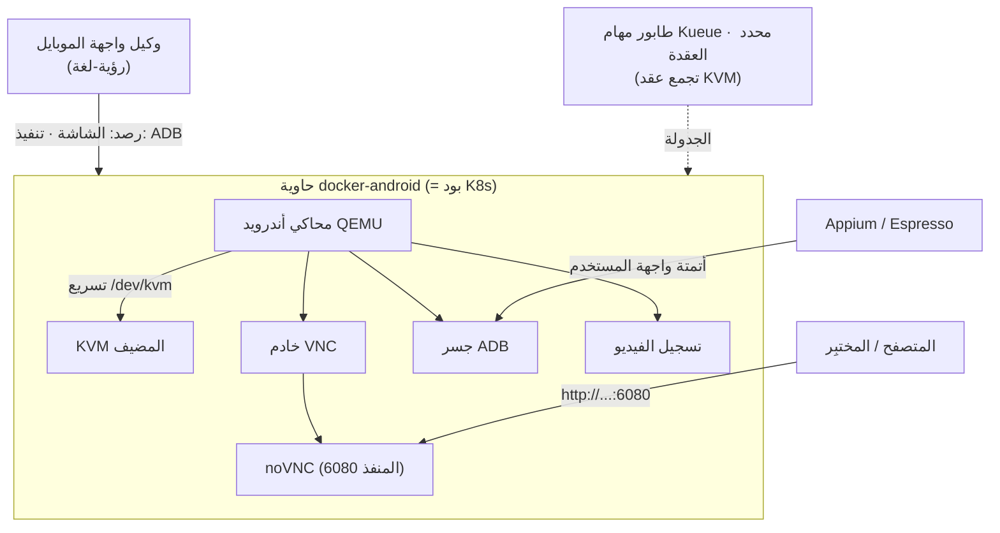

## نظرة عامة

اختبار تطبيقات الموبايل أو تدريب وكلاء الذكاء الاصطناعي على التحكم في واجهات أندرويد يستلزم في نهاية المطاف جهاز أندرويد حقيقياً قابلاً للتكرار. الإشكالية أن إدارة هذه الأجهزة أمر مُضنٍ: تثبيت SDK وصور النظام على الجهاز المحلي يُلوّث بيئة المضيف، ويجعل إعدادات أعضاء الفريق متباينة، فضلاً عن صعوبة رفع جهاز نظيف في كل مرة ضمن خط أنابيب CI. يعالج `budtmo/docker-android` هذه المشكلة عبر الحاويات؛ إذ يحزم محاكي أندرويد بالكامل داخل صورة Docker، فيُشغَّل بأمر واحد، ويُعاين عبر المتصفح، ويُسجَّل فيديو.

سبب إدراج هذا الموضوع في مدونة ThakiCloud المعنية بمنصة AI/ML SaaS المبنية على K8s أن الفكرة تتجاوز كونها أداة اختبار موبايل بسيطة؛ فهي تطرح تصوراً أعمق: **جدولة بيئات أجهزة قابلة للتكرار فوق Kubernetes**. سواء كانت مزرعة أجهزة لـ CI أو بيئة اختبار معزولة لوكلاء رؤية-لغة يتحكمون في شاشة الجوال، فالسؤال الجوهري هو: "هل يمكن معاملة أجهزة أندرويد كموارد K8s، تماماً كأحمال عمل GPU؟" يُحلّل هذا المقال بنية docker-android وطريقة تشغيله الفعلية، ثم يستعرض إمكانيات هذا النهج وحدوده من منظور منصتنا.

## ما هذه الأداة؟

docker-android هو حل يجمع محاكي أندرويد والأدوات المحيطة به في صورة Docker واحدة. عند تشغيل الحاوية، يُقلع محاكٍ قائم على QEMU في داخلها، ويُعرض شاشته عبر VNC. يأتي مع ذلك عميل VNC على الويب هو noVNC، مما يتيح للمستخدم الاتصال بالعنوان `http://localhost:6080` من أي متصفح دون تثبيت أي برنامج إضافي، وتأتيه شاشة أندرويد تعمل بالكامل.

يمكن إجمال الوظائف الرئيسية على النحو الآتي: أولاً، التحكم عن بُعد عبر المتصفح بوساطة noVNC. ثانياً، التسجيل التلقائي لفيديو الجلسة، مما يُبقي وثيقة مرئية لكل جلسة اختبار. ثالثاً، تكامل ADB الذي يُمكّن من الاتصال بالجهاز من المضيف أو من حاويات أخرى عبر جسر تصحيح أندرويد المعياري. رابعاً، دعم أطر اختبار مثل Appium وEspresso لتشغيل اختبارات أتمتة واجهة المستخدم داخل الحاوية. خامساً، إمكانية اختيار إصدارات أندرويد المتعددة وملفات تعريف الأجهزة، كملف Samsung Galaxy S10.

مفتاح الأداء هو تسريع الأجهزة؛ فتشغيل المحاكي بالبرمجيات وحدها بطيء بشكل لا يُطاق. لذا يمرر docker-android وحدة KVM من المضيف (`/dev/kvm`) إلى الحاوية لتفعيل تسريع الأجهزة. وهذا في الوقت ذاته يُشكّل أكبر قيود البنية التحتية، وهو ما سنتناوله لاحقاً.

يوضح المخطط التالي البنية الداخلية للحاوية وتوسعها كبود K8s.




## التثبيت والتشغيل

أبسط أمر تشغيل، وهو الصيغة المعيارية التي توثّقها الوثائق الرسمية، هو التالي:

```bash
docker run -d -p 6080:6080 \
  -e EMULATOR_DEVICE="Samsung Galaxy S10" \
  -e WEB_VNC=true \
  --device /dev/kvm \
  --name android-container \
  budtmo/docker-android:emulator_11.0
```

معنى كل خيار:

- `-d`: تشغيل الحاوية في الخلفية (detached).
- `-p 6080:6080`: تعيين منفذ noVNC للوصول إليه من المضيف. بعد التشغيل يُفتح `http://localhost:6080`.
- `-e EMULATOR_DEVICE="Samsung Galaxy S10"`: تحديد ملف تعريف الجهاز المراد محاكاته.
- `-e WEB_VNC=true`: تفعيل noVNC للسماح بالاتصال من المتصفح.
- `--device /dev/kvm`: تمرير وحدة KVM من المضيف إلى الحاوية لتفعيل تسريع الأجهزة.
- وسم الصورة (`emulator_11.0`): يُحدد إصدار أندرويد.

بعد انطلاق الحاوية، يكفي فتح المتصفح على المنفذ 6080 لرؤية شاشة أندرويد تعمل. للاتصال عبر ADB يُستخدم `adb connect` مع منفذ ADB الذي تُعرضه الحاوية. تستهدف اختبارات Appium الجهاز عبر خادم Appium داخل الحاوية أو عبر حاوية Appium منفصلة. تفاصيل الإعداد الإضافية كمسار تسجيل الفيديو ودقة الشاشة وتعريفات الأجهزة المخصصة موثّقة في ملف الإعدادات المخصصة في المستودع.

> إفصاح صريح: البيئة المعزولة التي كُتب فيها هذا المقال لا تضمن توافر المحاكاة المتداخلة (`/dev/kvm`)، لذا لم يُشغَّل المحاكي فعلياً ولم تُقاس أرقام كوقت الإقلاع أو معدل الإطارات. لهذا لن تجد في ما يلي أرقام أداء مُلفّقة. ما جرى التحقق منه هو أوامر التشغيل من المستودع الرسمي، والمنفذ المكشوف (6080/noVNC)، ومتطلب تسريع KVM، والوظائف المُعلنة من تسجيل فيديو ودعم Appium وتكامل ADB.

## ما جرى التحقق منه وما لم يجرِ

الحقائق التي تم التحقق منها: docker-android يُحوّل محاكي أندرويد إلى حاوية، ويوفر التحكم من المتصفح عبر noVNC، ويدعم تسجيل الفيديو واختبارات Appium وEspresso وتكامل ADB. يستلزم التشغيل تسريع KVM من المضيف. تتوفر صور لإصدارات أندرويد متعددة.

ما لم يجرِ التحقق منه هو أداء الإقلاع الفعلي وكثافة التشغيل المتزامن. عدد المحاكيات التي يمكن تشغيلها بثبات على عقدة واحدة ومدة الإقلاع يعتمدان اعتماداً كبيراً على CPU المضيف وذاكرته ودعمه لـ KVM، ولن نُدرج أرقاماً تقديرية دون قياس مباشر. بعض الميزات المتقدمة كدعم الأجهزة الحقيقية (real device) تتطلب صلاحيات وأجهزة خاصة تخرج عن نطاق هذا المقال.

## التطبيق على منصة ThakiCloud K8s AI/ML SaaS والدلالات

كون docker-android صورة حاوية يعني إمكانية تشغيله كبود Kubernetes، ومن هنا يتفرع اتجاهان من منظور المنصة.

الأول هو مزرعة أجهزة CI للموبايل: رفع جهاز أندرويد نظيف ديناميكياً فوق K8s مع كل بناء، ثم تحرير البود فور انتهاء الاختبار. تثبيت بيئة الجهاز في صورة يُزيل الفوارق البيئية بين أعضاء الفريق ومشغّلات CI، والفيديو المسجَّل يُوثّق الفشل للتحليل. وكما نُدرج أحمال GPU في طابور مهام Kueue، يمكن معاملة بودات المحاكيات كمهام ذات طلبات موارد، وجدولتها على تجمع عقد KVM بمحدد العقدة المناسب.

الثاني، وهو الأكثر إثارة، هو **بيئة تقييم وكلاء واجهة الموبايل**. الوكلاء الذين يرون الشاشة ويتفاعلون مع التطبيقات عبر اللمس والتمرير يحتاجون أثناء التدريب والتقييم إلى بيئة أندرويد قابلة للتكرار. يُقدّم docker-android هذه البيئة بصورة موحّدة. يرصد الوكيل حالة الجهاز من خلال شاشة noVNC أو بث ADB، وينفّذ إجراءاته عبر ADB وAppium. رفع بودات أجهزة معزولة لكل مستأجر فوق K8s متعدد المستأجرين يُتيح تشغيل تجارب وكلاء متعددة بالتوازي بأمان تام.

ما يميز منصة ThakiCloud هنا أن هذا النهج يعيد استخدام البنية التحتية القائمة دون إضافة: الجدولة على K8s، والعزل متعدد المستأجرين، وجدولة المهام عبر Kueue، ومنظومة المراقبة، كلها مكونات أساسية موجودة. إدراج أجهزة أندرويد كأحمال حاويات إضافية يمنح منتجَيْن جديدَيْن في آنٍ واحد دون زيادة في البنية التحتية: "CI للموبايل" و"تقييم وكلاء الموبايل". وإذا أُديرت المنصة داخلياً (on-premises)، فلن تغادر بيانات أجهزة الاختبار إلى خدمات مزارع أجهزة خارجية، وهو ما يُمثّل قيمة مباشرة للعملاء الذين تُعدّ سيادة البيانات أولوية لديهم.

## القيود والاعتراضات

لا يصح التفاؤل المطلق. أبرز قيود هذا النهج هو KVM: تشغيل المحاكي دون تسريع أجهزة بطيء لدرجة تجعله غير عملي. غير أن تمرير `/dev/kvm` إلى الحاوية يستلزم إما خادماً فيزيائياً (bare-metal) يدعم المحاكاة المتداخلة أو نوعاً بعينه من نسخ الحوسبة السحابية، مع منح الحاوية وصولاً مميزاً لوحدة الأجهزة. وهذا يتعارض مع حدود الأمان في البيئات متعددة المستأجرين، إذ لا تكشف كثير من بيئات K8s المُدارة عن KVM. لذا يتطلب هذا النمط تصميماً دقيقاً لتجمعات العقد وسياسات الأمان.

ثانياً، كثافة الموارد: محاكي أندرويد يستهلك CPU وذاكرة بشكل ملحوظ. تكديس عشرات المحاكيات على عقدة واحدة كما يُوزَّع طلبات الاستدلال على بطاقة GPU واحدة هو تصور غير واقعي؛ الكثافة الفعلية تحتاج إلى اختبار حِمل مباشر. كما أن نموذج التكلفة يختلف اختلافاً جوهرياً عن خدمة نماذج GPU.

ثالثاً، المحاكي ليس جهازاً حقيقياً. أجهزة الاستشعار الفيزيائية وسلوك شرائح معينة والبيئات الشبكية الواقعية لا يُعيد المحاكي إنتاجها بالكامل. التحقق النهائي من وكلاء الموبايل أو اختبارات التطبيقات قد يستلزم في النهاية جهازاً حقيقياً، ويبقى docker-android المكان المناسب لبيئة التطوير السريعة القابلة للتكرار في المراحل السابقة.

خلاصة القول، يُجسّد budtmo/docker-android فكرة بسيطة هي "تشغيل أندرويد داخل حاوية" في أداة عملية مكتملة تضم noVNC وتسجيل الفيديو وAppium وADB. متى أُحسنت إدارة قيد KVM، غدا هذا النهج نقطة انطلاق واقعية لرفع حملَيْن من أعباء العمل فوق البنية التحتية ذاتها على منصة K8s: CI للموبايل وتقييم وكلاء الموبايل.

## المصادر

- budtmo/docker-android: [https://github.com/budtmo/docker-android](https://github.com/budtmo/docker-android)
- وثائق الإعدادات المخصصة: [https://github.com/budtmo/docker-android/blob/master/documentations/CUSTOM_CONFIGURATIONS.md](https://github.com/budtmo/docker-android/blob/master/documentations/CUSTOM_CONFIGURATIONS.md)
