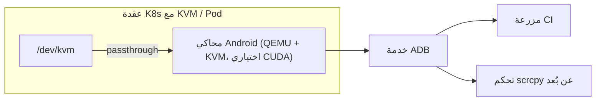

## نظرة عامة

اختبار تطبيق موبايل يستلزم أجهزة أندرويد. إدارة أسطول من الأجهزة الحقيقية عبء صيانة مُضنٍ، وتثبيت محاكٍ ثقيل على كل جهاز مطوّر يُفضي إلى اختلاف البيئات وضعف قابلية التكرار. تتضاعف هذه المشكلة حين تُريد إدراج اختبارات أندرويد في خط CI، إذ يحتاج كل عقدة بناء إلى إعداد محاكٍ متسق.

يحل `docker-android` (إصدار HQarroum) هذه المشكلة بالحاويات. يُغلّف محاكي أندرويد بتهيئة بسيطة، ويُشغّله بلا واجهة رسومية، ويُتيح ADB والتحكم بالشاشة عبر الشبكة. حاوية واحدة توفر بيئة أندرويد نظيفة ومتسقة في ثوانٍ، مما يجعلها مناسبة تماماً لـ CI/CD والاختبارات الآلية.

يتحقق هذا المقال من بنية docker-android ومتطلباته الفعلية وفق التوثيق، ثم يستعرض كيف تتعامل منصة Kubernetes مثل ThakiCloud مع هذا النوع من أحمال عمل الأجهزة. محاكاة أندرويد ليست في صميم منصتنا للذكاء الاصطناعي، لكن السؤال حول عزل الحاويات ذات الامتيازات التي تحتاج KVM passthrough وتسريع GPU يتقاطع مباشرة مع قدرات بنيتنا التحتية.

---

## ما هو docker-android

يجمع docker-android الخاص بـ HQarroum بين محاكي أندرويد ودعم KVM و JRE 11 في صورة مدمجة مبنية على Alpine (الإصدار الحالي 1.1.0). النية التصميمية واضحة: كشف محاكي أندرويد كامل يمكن التحكم به عن بُعد بأقل بصمة برمجية ممكنة. تحتوي الصورة على المحاكي نفسه، وخادم ADB للوصول الخارجي، وQEMU مع libvirt.

الخصائص الرئيسية:

- **بصمة بسيطة**: مبنية على Alpine لتحسين الحجم. البناء بدون SDK أو محاكٍ ينتج صورة أصغر بكثير.
- **قابلية التخصيص**: إصدار أندرويد ونوع الجهاز ونوع الصورة كلها قابلة للاختيار.
- **توجيه المنافذ مدمج**: يُكشف المحاكي و ADB عبر واجهة شبكة الحاوية.
- **بلا واجهة رسومية**: لا تحتاج إلى GUI، مما يجعلها مناسبة لمزارع CI. يمكن الوصول إلى الشاشة عن بُعد عبر [scrcpy](https://github.com/Genymobile/scrcpy).
- **قابلية التكرار**: تُعاد صورة المحاكي إلى حالتها الأصلية عند كل إعادة تشغيل، فكل تشغيل يبدأ من حالة متطابقة.

يُوضح الرسم البياني أعلاه نشراً افتراضياً لهذه الحاوية على ThakiCloud Kubernetes. يعمل المحاكي في pod على عقدة مُفعَّل فيها KVM مع تمرير `/dev/kvm`، ويُستخدم المتغير cuda حين يُحتاج تسريع GPU. يُكشف ADB كـ Service ليصل إليه مزرعة CI و scrcpy.

---

## التثبيت والتكامل

يجمع البناء الافتراضي Android SDK وأدوات المنصة والمحاكي في الصورة. تشغيل كل شيء باستخدام docker-compose:

```bash
# المحاكي الأساسي
docker compose up android-emulator

# تسريع GPU
docker compose up android-emulator-cuda

# تسريع GPU + Google Play Store
docker compose up android-emulator-cuda-store
```

يمكن البناء مباشرة باستخدام Docker:

```bash
docker build -t android-emulator .
```

بعد بناء الصورة، شغّل الحاوية مع تثبيت محرك KVM. استخدام صورة Play Store يستلزم مشاركة المحاكي والعميل لنفس `adbkey`؛ أنشئه بـ `adb keygen adbkey` وضعه في مجلد `./keys`.

يتباين حجم الصورة تبايناً كبيراً حسب متغير البناء. جدول المقارنة من توثيق المستودع:

| متغير البناء | غير مضغوط | مضغوط |
|---|---|---|
| API 33 + المحاكي | 5.84 GB | 1.97 GB |
| API 32 + المحاكي | 5.89 GB | 1.93 GB |
| API 28 + المحاكي | 4.29 GB | 1.46 GB |
| بدون SDK أو محاكٍ | 414 MB | 138 MB |

الصور التي تتضمن المحاكي تتجاوز 1.5 GB حتى بعد الضغط. عند التوزيع على عقد كثيرة، يجب مراعاة عرض نطاق السجل وسعة قرص العقد.

---

## التحقق من السلوك الفعلي

لم يشمل هذا المقال التحقق من إقلاع الحاوية فعلياً. تسجيل أمين: فشل التحقق هنا (لا يوجد Docker daemon على المضيف، وmacOS لا يوفر `/dev/kvm`). يتطلب docker-android تسريع KVM للأجهزة، لذا التشغيل الفعلي ممكن فقط على مضيف Linux أو عقدة KVM تدعم المحاكاة الافتراضية المتداخلة.

ما أمكن التحقق منه استُقي مباشرة من توثيق المستودع. جدول مقارنة أحجام الصور أعلاه يعكس أرقاماً مُصرَّحاً بها في التوثيق؛ متغيرات البناء وأسماء خدمات compose ومتطلبات تثبيت KVM كلها مستندة إلى التوثيق. أرقام كوقت الإقلاع أو معدل معالجة الاختبارات التي لم نقسها لم نُدرجها. عند النشر الفعلي، بعد توفير عقد KVM، الإجراء الصحيح هو قياس وقت إقلاع الحاوية وزمن استجابة ADB والحد الأقصى لعدد المحاكيات المتزامنة مباشرة.

---

## الآثار على منصة ThakiCloud K8s AI/ML SaaS

docker-android ليس أداة ذكاء اصطناعي في حد ذاتها. لكن المتطلبات التشغيلية التي يكشف عنها تتقاطع بدقة مع ما تُتقنه ThakiCloud.

أولاً، **عزل أحمال عمل مرور الأجهزة**. المحاكي حاوية ذات امتيازات في جوهرها تتطلب `/dev/kvm`. تشغيل هذا النوع من أحمال العمل بأمان في بيئة Kubernetes متعددة المستأجرين يستلزم اختيار العقد بعناية والمكوّنات الإضافية للأجهزة وسياقات الأمان. تُجهّز ThakiCloud بالفعل وحدات GPU عبر مكوّنات الأجهزة الإضافية وKueue؛ يمكن التعامل مع KVM passthrough بالنمط ذاته.

ثانياً، **مزارع الاختبار القابلة للتكرار**. تغليف المحاكيات عديمة الواجهة الرسومية كحاويات يتيح توسيع البيئات النظيفة أفقياً عبر عدد العقد المطلوب. تشغيل اختبارات Appium UI متوازية كثيرة من خط CI/CD حالة استخدام نموذجية لجدولة وظائف Kubernetes.

ثالثاً، ونظرة إلى الأمد البعيد، يمتد هذا بشكل طبيعي نحو **التحقق من أداء الذكاء الاصطناعي على الجهاز**. التحقق من سلوك النماذج الخفيفة أو العوامل العاملة على أجهزة الموبايل على نطاق واسع يتطلب مزرعة أجهزة تنشئ بيئات أندرويد معزولة كثيرة وتُشغّل اختبارات الانحدار آلياً. هذا ليس اهتماماً محورياً لمنصتنا اليوم، لكن مع نضج قدرات تنظيم GPU والأجهزة متعددة المستأجرين لدينا، تغدو مزرعة QA للذكاء الاصطناعي على الموبايل من هذا النوع شيئاً يمكن تقديمه على البنية التحتية ذاتها.

باختصار، docker-android ليس منتجاً نبنيه، لكنه دراسة حالة جيدة في ترويض أحمال عمل الحاويات الثقيلة التي تجمع بين الامتياز ومرور الأجهزة وتسريع GPU على Kubernetes. هذه صورة ملموسة لقدرات تنظيم Kubernetes للأغراض العامة التي تُؤكد عليها ThakiCloud.

---

## القيود والاعتراضات

- **اعتماديات ثقيلة**: تسريع KVM للأجهزة غير قابل للتفاوض. في البيئات التي لا تدعم المحاكاة الافتراضية المتداخلة، يتدهور الأداء بشكل حاد أو لا يُقلع المحاكي أصلاً. اختيار عقدة السحابة يصبح قيداً صارماً.
- **تضخم الصورة**: الصور التي تتضمن المحاكي تبلغ عدة GB حتى بعد الضغط. التوزيع عبر عقد كثيرة يُراكم تكاليف السجل والقرص.
- **البُعد عن صلة الذكاء الاصطناعي**: بصراحة، هذه الأداة بعيدة عن أحمال عمل التدريب والاستدلال التي تمثل صميم منصتنا. للمؤسسات التي ليس لديها طلب اختبار موبايل، القيمة المباشرة محدودة. قيمة هذا المقال ليست في "المحاكي بحد ذاته" بل في "أنماط تشغيل حاويات مرور الأجهزة".
- **أمن الحاويات ذات الامتيازات**: الوصول إلى `/dev/kvm` وإعدادات الامتياز تُعقّد حدود أمان المستأجرين المتعددين. الحفاظ على عزل المستأجرين يستلزم مجمّعات عقد مخصصة وسياسات صارمة.

docker-android أداة قوية لأتمتة اختبارات الموبايل، ومرجع مفيد لكيفية التعامل مع أحمال عمل الأجهزة على Kubernetes. حتى قبل اللحظة التي نحتاجها فيها مباشرة، أنماط التشغيل تستحق الإلمام بها مسبقاً.

---

## المصادر

- docker-android (HQarroum): [https://github.com/HQarroum/docker-android](https://github.com/HQarroum/docker-android)
- صورة Docker Hub: `halimqarroum/docker-android`
- scrcpy (التحكم بالشاشة عن بُعد): [https://github.com/Genymobile/scrcpy](https://github.com/Genymobile/scrcpy)
- التغريدة الأصلية: [https://x.com/hjguyhan/status/2069427245295493446](https://x.com/hjguyhan/status/2069427245295493446)
