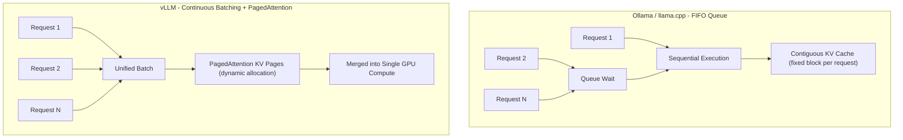

حين تبحث عن كيفية تشغيل نموذج لغوي كبير محلياً، يظهر اسمان في الغالب: Ollama وvLLM. وكثيراً ما تقرأ حججاً قاطعة من قبيل "إن كنت تريد الأداء فلا تستخدم Ollama، استخدم vLLM". هل هذا صحيح؟ الإجابة المختصرة: نصفه فقط. الجهاز المحمول الذي يستخدمه شخص واحد بطلب واحد في كل مرة مشكلة مختلفة تماماً عن خادم يخدم عشرات المستخدمين المتزامنين. يستند هذا المقال إلى أرقام معايير أداء RTX 4090 المنشورة عام 2026 لدراسة أين تتباين الأداتان، وما دلالة ذلك التباين لمنصة ThakiCloud المستندة إلى Kubernetes.

## نظرة عامة

كلتا الأداتين محرك استدلال لتشغيل نماذج لغوية كبيرة محلياً أو على بنية تحتية خاصة، غير أن أهدافهما التصميمية تختلف. Ollama مصنوع ليتيح لشخص واحد سحب نموذج بسرعة وتشغيله بأدنى احتكاك. التثبيت بسيط وإدارة النماذج مدمجة فيه، والخادم الخفيف المكتوب بـGo يبدأ سريعاً. أما vLLM فهو محرك خدمة إنتاجي مصمم من الأساس لإشباع GPU واحد بطلبات متزامنة متعددة وتعظيم الإنتاجية، وأبرز أسلحته PagedAttention والتجميع المستمر (continuous batching).

لماذا يعود هذا التمييز إلى الواجهة الآن؟ خضعت كلتا الأداتين لتغييرات معمارية جوهرية بعد عام 2024. حسّن Ollama تحسينات نواة llama.cpp ومسارات الاستدلال بالتكميم لرفع أداء التدفق الواحد، بينما بسّط vLLM تجربة التثبيت مع مواصلة تطوير PagedAttention والتشفير التخميني. معايير الأداء القديمة لم تعد تعكس الواقع الحالي، لذا يستحق الأمر مراجعة بأرقام حديثة.

تعالج ThakiCloud طلبات استدلال من عملاء متعددين على مجمع GPU مشترك في بيئة متعددة المستأجرين. في هذا السياق، سؤال "هل هو سريع لمستخدم واحد؟" شبه عديم المعنى؛ ما يهم هو "هل يصمد حين يتدفق المستخدمون في آن واحد؟". من هذه الزاوية نستعرض منحنيات التوسع لكلتا الأداتين.

## ماهية كل أداة

الفارق الحاسم بين المحركين يكمن في طريقة إدارة ذاكرة تخزين KV المؤقتة. خلال التوليد، يتراكم في المحول مفاتيح وقيم الرموز السابقة في ذاكرة مؤقتة. هذه الذاكرة هي المستهلك الأكبر لذاكرة GPU. يخصص Ollama وllama.cpp كتلة ذاكرة متجاورة لكل طلب مسبقاً. التنفيذ بسيط، لكن مع تزايد الطلبات المتزامنة يتراكم التشرذم وتصطدم القدرة على المعالجة الموازية بسقف سريع.

يعامل PagedAttention في vLLM ذاكرة KV المؤقتة كصفحات ذاكرة افتراضية في نظام تشغيل. التخصيص في كتل صغيرة غير متجاورة عند الحاجة يعني أن نفس VRAM يستوعب تسلسلات متزامنة أكثر بكثير. يضاف إلى ذلك التجميع المستمر: حين يصل طلب جديد يُدرج في الدفعة النشطة فوراً دون انتظار انتهاء الطلبات السابقة. هذان العاملان معاً يفسران لماذا يرسم vLLM منحنى مختلفاً تحت ضغط التزامن.

يوضح المخطط أدناه الفارق في كيفية معالجة كل محرك للطلبات المتزامنة.



باختصار، Ollama محسّن لمعالجة طلب واحد بشكل نظيف في كل مرة؛ vLLM محسّن لدمج طلبات متعددة في عملية GPU واحدة. هذا الفارق التصميمي يظهر مباشرة في أرقام معايير الأداء.

## التثبيت والتكامل

تشغيل كلتا الأداتين عبر Docker هو الأسلوب الأنظف من حيث قابلية الإعادة. Ollama يبدأ هكذا:

```bash
docker run -d --gpus=all -v ollama:/root/.ollama \
  -p 11434:11434 --name ollama ollama/ollama
docker exec -it ollama ollama run llama3.1:8b
```

يمكن تشغيل vLLM مباشرة من صورة الخادم المتوافقة مع OpenAI:

```bash
docker run --gpus all -p 8000:8000 \
  --ipc=host vllm/vllm-openai:latest \
  --model meta-llama/Llama-3.1-8B-Instruct \
  --dtype auto
```

كلا الخادمين يكشفان واجهة برمجية متوافقة مع OpenAI، فيمكن الإبقاء على كود العميل متطابقاً لكليهما:

```bash
curl http://localhost:8000/v1/completions \
  -H "Content-Type: application/json" \
  -d '{"model":"meta-llama/Llama-3.1-8B-Instruct","prompt":"مرحباً","max_tokens":64}'
```

لضمان قابلية الإعادة، يُنصح بتثبيت digests الصور. توصي معايير الأداء العامة بتسجيل RepoDigest عبر `docker inspect ollama/ollama:<tag>` و`docker inspect vllm/vllm-openai:<tag>`، وحفظ مخرجات `ollama --version` و`pip show vllm` جنباً إلى جنب مع النتائج. حتى تغيير إصدار واحد قد يزعزع الأرقام.

إفصاح ضروري: كُتب هذا المقال على Apple Silicon (macOS, MPS)، لذا لم يكن بالإمكان إعادة إنتاج معايير أداء vLLM المستندة إلى CUDA مباشرة. الأرقام أدناه مستشهد بها من معيار أداء عام على نفس العتاد (SitePoint، مارس 2026، RTX 4090). المصدر مذكور في نهاية المقال. الأرقام المأخوذة من قياسات الآخرين تُبقى متمايزة عن أي ادعاء بأنها قياساتنا.

## نتائج معايير الأداء (استشهاد بمعيار أداء عام)

بيئة معيار الأداء المستشهد به: GPU - NVIDIA RTX 4090 (24GB)، CPU - AMD Ryzen 9 7950X، ذاكرة عشوائية 64GB DDR5، Ubuntu 24.04، CUDA 12.6، Python 3.12. النماذج المقارنة هي Llama 3.1 8B وDeepSeek-R1-Distill-Llama-8B بموجّهات متطابقة.

أولاً، إنتاجية المستخدم الواحد التسلسلية. خلافاً للاعتقاد الشائع، لا يتفوق vLLM تفوقاً ساحقاً. لنموذج Llama 3.1 8B، أنتج Ollama (Q4_K_M) نحو 62 رمزاً/ث، وأنتج vLLM (FP16) نحو 71 رمزاً/ث، وvLLM AWQ نحو 68 رمزاً/ث. الفجوة البالغة نحو 13% تأتي من اختلافات التكميم أكثر مما تأتي من المزايا المعمارية. مع مستخدم واحد، يعوّض انخفاض حمل خادم Ollama وتحسينات نواة التكميم المزايا البنيوية لـvLLM.

تتغير الصورة كلياً تحت ضغط التزامن. الجدول أدناه يُظهر إجمالي إنتاجية الرموز (رمز/ث) بحسب عدد المستخدمين المتزامنين.

| التكوين | Ollama | vLLM FP16 | vLLM AWQ |
|---|---|---|---|
| Llama 3.1 8B، مستخدم واحد | 62 | 71 | 68 |
| Llama 3.1 8B، 10 مستخدمين | 148 | 485 | 452 |
| Llama 3.1 8B، 50 مستخدماً | 155 | 920 | 875 |
| DeepSeek-R1 8B، مستخدم واحد | 58 | 67 | 63 |
| DeepSeek-R1 8B، 10 مستخدمين | 135 | 445 | 418 |
| DeepSeek-R1 8B، 50 مستخدماً | 142 | 840 | 795 |

عند 10 مستخدمين متزامنين يتقدم vLLM بنحو 3.3 أضعاف، وعند 50 مستخدماً يصل التقدم إلى نحو 6 أضعاف. Ollama يعالج عبر قائمة انتظار FIFO - أي بشكل تسلسلي فعلياً - لذا يكاد إجمالي الإنتاجية يبقى ثابتاً مع ازدياد التزامن. في المقابل، يمتص vLLM الطلبات المتزامنة بالتجميع المستمر ويتوسع قريباً من التناسب الخطي.


الكمون يروي القصة ذاتها من زاوية مختلفة. عند مستخدم واحد، يبلغ زمن الاستجابة الأولى (TTFR) نحو 45 مللي ثانية لـOllama ونحو 82 مللي ثانية لـvLLM، أي Ollama أسرع. عند 50 مستخدماً متزامناً تنعكس الأدوار. يقفز TTFR الخاص بـOllama إلى نحو 3200 مللي ثانية مع تكدس الطلبات في الانتظار، بينما يحافظ vLLM على نحو 145 مللي ثانية بفضل التجميع المستمر. الأداة الأسرع في العزل تصبح الأبطأ تحت الحمل.

استهلاك الموارد يجلّي المفاضلة بوضوح. في وضع الخمول مع Llama 3.1 8B، يستخدم Ollama نحو 5.2GB VRAM ويستخدم vLLM FP16 نحو 16.1GB. عند 50 مستخدماً متزامناً يبقى Ollama قرب 5.4GB بينما يرتفع vLLM FP16 إلى نحو 21.8GB بسبب التخصيص الديناميكي للصفحات لذاكرة KV المؤقتة للتسلسلات النشطة. النسخة AWQ أكثر تحفظاً عند نحو 12.4GB تحت نفس الحمل. استهلاك ذاكرة النظام ووحدة المعالجة المركزية أيضاً أقل لـOllama (نحو 1.8GB مقابل 4.6GB في الخمول). الإنتاجية الأعلى لـvLLM ليست مجانية بل تُدفع ثمناً من VRAM وذاكرة نظام أكبر.

## تجربة المطور والنظام البيئي

إلى جانب الأداء، تجربة المطور تحكم التكلفة التشغيلية. Ollama يُثبَّت بأمر واحد، و`ollama run` يشغّل نموذجاً مع إدارة تحميل وتكميم مدمجة. انخفاض حاجز الدخول جعله يبدو أداة هواة في البداية، غير أنه يظهر اليوم على نطاق واسع في خطوط CI لموجّهات مراجعة الكود وعمليات النشر على الحافة كـJetson Orin وسلاسل أدوات المطورين الداخلية.

كان vLLM يستلزم في السابق إلماماً بأدوات ML بـPython، لكن تجربة التثبيت تبسّطت كثيراً في الإصدارات الأخيرة. سحب صورة الخادم المتوافقة مع OpenAI وتشغيلها يتيح ربط كود عميل OpenAI الحالي بتغييرات طفيفة. الميزات الإنتاجية الثرية - التوازي التنسوري، والتشفير التخميني، ومحولات LoRA القابلة للتبادل السريع - تمثّل ميزة بيئية واضحة. وبما أن كلتا الأداتين تتشاركان واجهة OpenAI المتوافقة، يكون الانتقال من Ollama في التطوير إلى vLLM في الإنتاج سلساً نسبياً.

## منصة ThakiCloud K8s AI/ML SaaS - التطبيق والاستخلاصات

هذه المقارنة تشرح بدقة لماذا تعتمد ThakiCloud محركات عائلة vLLM معياراً للخدمة متعددة المستأجرين. منصتنا ليست مستخدماً واحداً يحتكر نموذجاً واحداً. طلبات عملاء متعددين تتدفق بشكل متزامن عبر مجمع GPU مشترك. في هذا السياق، المهم ليس سرعة التدفق الواحد بل منحنى توسع التزامن واستقرار الكمون تحت الحمل. عند 50 مستخدماً متزامناً، 6 أضعاف الإنتاجية وكمون أقل بأكثر من 20 مرة يُترجمان مباشرة إلى عدد المستأجرين الذين يمكن لـGPU واحد خدمتهم، أي تكلفة الوحدة.

تشغيلياً، نشر ThakiCloud حاويات خدمة vLLM على Kubernetes ويُنظّم أحمال عمل GPU بـKueue. حمل عمل الخدمة يبدو تقريباً هكذا:

```yaml
apiVersion: apps/v1
kind: Deployment
metadata:
  name: vllm-llama31-8b
spec:
  replicas: 1
  template:
    spec:
      containers:
        - name: vllm
          image: vllm/vllm-openai:latest
          args:
            - "--model=meta-llama/Llama-3.1-8B-Instruct"
            - "--max-num-seqs=64"
            - "--gpu-memory-utilization=0.90"
          resources:
            limits:
              nvidia.com/gpu: "1"
          ports:
            - containerPort: 8000
```

`--max-num-seqs` و`--gpu-memory-utilization` هما مقبضا الضبط الرئيسيان. التغير الديناميكي في VRAM الخاص بـPagedAttention متغير لا بد من حسابه عند تصميم حدود ذاكرة الحاوية وسياسة تقسيم GPU. كما تُظهر الأرقام أعلاه، ينتقل VRAM من 16GB إلى 22GB مع ارتفاع التزامن، لذا التخصيص الثابت يُوقعك إما في نفاد الذاكرة أو الاستغلال الناقص. لذلك نقيس الحد الأقصى للتسلسلات المتزامنة وسقف ذاكرة KV المؤقتة لكل نموذج ونحدد موارد الحاوية وفقاً لذلك. Kueue يُبقي المهام في الانتظار حتى تتوفر طاقة GPU ويُوزّعها عند الإفراج، مما يمنع الاشتراك الزائد في GPU حتى حين يتدفق مستأجرون كثيرون في آن واحد.

هذا لا يجعل Ollama عديم الجدوى. لاختبار النماذج الأولية محلياً من قِبل المطورين الداخليين، وبيئات العرض التجريبي للمستخدم الواحد، وموجّهات مراجعة الكود الخفيفة في خطوط CI، تُعدّ سرعة بدء Ollama وانخفاض حد موارده ميزة حقيقية. بالنسبة لـThakiCloud الحد واضح: الاستدلال الإنتاجي المتعدد المستأجرين الموجّه للعملاء يستخدم vLLM؛ سير عمل المطور الفردي وعروض الحافة تستخدم Ollama. للعملاء الذين يشترطون الاستضافة الذاتية داخل مقارّهم حيث لا يمكن نقل البيانات خارجها (متطلبات أمنية حكومية وما شابهها)، حقيقة أن كلا المحركين يمكن تشغيلهما على GPU خاص بهم تُعدّ في حد ذاتها جوهر عرض القيمة.

## القيود والتحفظات

بعض النقاط الجديرة بالتوضيح. أولاً، معايير الأداء المستشهد بها مبنية على RTX 4090 واحدة. إعدادات متعددة GPU أو نماذج أكبر من 70B أو تكوينات التوازي التنسوري قد تُنتج منحنيات مختلفة. في تلك السيناريوهات يكاد vLLM يكون الخيار الوحيد العملي، لكن الأرقام الدقيقة تستلزم قياساً على العتاد ذي الصلة.

ثانياً، ضعف Ollama في التزامن يعكس الإصدار المختبر. Ollama يحسّن آليات التجميع بنشاط، وقد تتقلص الفجوة في إصدارات مستقبلية. معاملة "Ollama ضعيف في التزامن" باعتبارها حقيقة دائمة خطأ. الأدوات تتغير بسرعة.

ثالثاً، الإنتاجية العالية لـvLLM لها تكلفة حقيقية: VRAM وذاكرة نظام أكثر، وتعقيد تشغيلي أعلى، وحمل إضافي من وقت تشغيل Python. نشر vLLM لأحمال عمل تكاد لا تحوي طلبات متزامنة هو إفراط في التصميم. اختيار الأداة لا ينبغي أن ينطلق من "أيهما أسرع" بل من "أين يقع ملف تزامن حمل العمل لديّ".

أخيراً، الأرقام الجوهرية في هذا المقال مستشهد بها من معيار أداء عام وليست من قياساتنا. قياسات إعادة الإنتاج في بيئة GPU الفعلية لدينا مخططة في مقال لاحق منفصل. تفضّل بقراءة المقال مع مراعاة أن الأرقام المأخوذة من قياسات جهة أخرى لا ينبغي تعميمها باعتبارها استنتاجاتنا الخاصة.

## المصادر

- SitePoint، "Ollama vs vLLM: Performance Benchmark 2026" (2026-03-05): [https://www.sitepoint.com/ollama-vs-vllm-performance-benchmark-2026/](https://www.sitepoint.com/ollama-vs-vllm-performance-benchmark-2026/)
- التوثيق الرسمي لـvLLM: [https://docs.vllm.ai](https://docs.vllm.ai)
- Ollama: [https://ollama.com](https://ollama.com)
