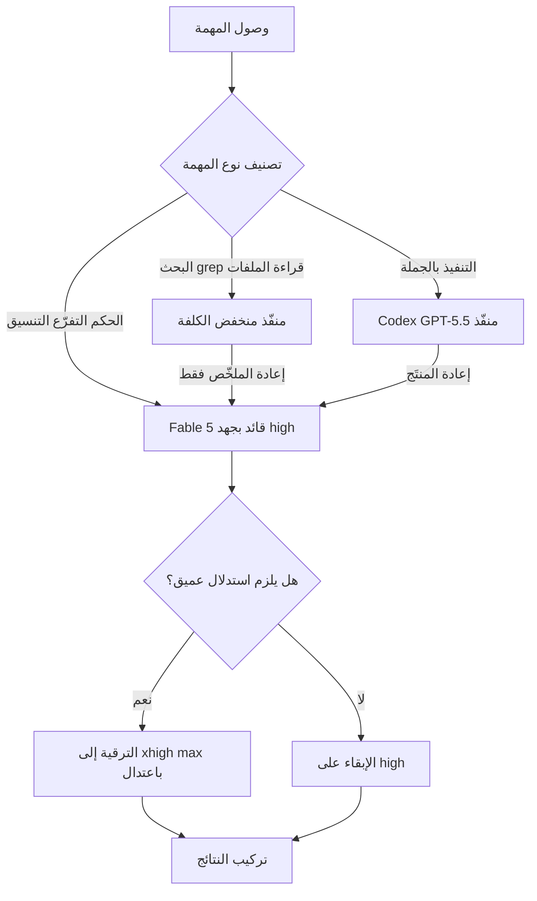

*تصوير للتوجيه، حيث يتدفّق العمل الثقيل والخفيف إلى نماذج مختلفة.*

## نظرة عامة

الإمساك بنموذج برمجة واحد قوي وإلقاء كل مهمة عليه أمر مريح. المشكلة أن هذه الراحة تعود على شكل فاتورة ميزانية رموز وحدود معدّل. إذا استخدمت النموذج الأغلى حتى لأبسط المهام، فستنفد حصتك بحلول الوقت الذي تحتاج فيه فعلاً إلى استدلال صعب.

في أوائل يوليو 2026، شارك Theo مبتكر حزمة T3 كيف يشغّل Claude Fable 5 طوال اليوم دون بلوغ حدود المعدّل. الفكرة بسيطة. بدلاً من تكديس كل شيء على نموذج واحد، قسّم النموذج والجهد بحسب طبيعة العمل. في هذه المقالة نستعرض استراتيجياته الأربع مع اقتباسات حقيقية، ونضعها بجانب انضباط توجيه النماذج الذي تطبّقه ThakiCloud بالفعل في تشغيل Paxis وai-platform.

سبب الأهمية واضح. في عصر تعمل فيه الوكلاء بشكل مستقل لفترة طويلة، فإن كيفية تصميم تدفّق الرموز عبر الجلسة كاملة، لا جودة استدعاء نموذج واحد، هي ما يحدّد الإنتاجية والتكلفة الحقيقية.

## المشكلة: حدود المعدّل مسألة تخصيص لا جودة

المستخدمون الذين يبلغون حدود المعدّل غالباً ما يفعلون ذلك لا لأن النموذج ضعيف بل لأن تخصيصهم أخرق. إذا شغّلت نموذج الطبقة العليا بأعلى جهد حتى لعمل منخفض الصعوبة مثل قراءة ملف واحد أو grep بسيط أو تلخيص سجل، فإن الرموز تحترق لا خطياً بل أسّياً. ورموز التفكير على وجه الخصوص تتراكم بشكل غير مرئي.

الرؤية الأساسية هي هذه. أفضل نموذج مورد محدود، وتحديد أين تنفقه هو بالضبط ما يعنيه التوجيه. نصائح Theo الأربع كلها المبدأ نفسه مطبَّقاً من زوايا مختلفة.

## استراتيجيات Theo الأربع

### 1. اجعل الجهد الافتراضي high واحتفظ بـ xhigh وmax

يقول Theo إنه يستخدم Fable على جهد "high" فقط في الوقت الحالي. بكلماته، xhigh "نهم للرموز"، وmax وextra هما "فرن بمخرجات أسوأ من الخيارات الأدنى".

الدرس هنا أن رفع الجهد لا يرفع الجودة بشكل مطّرد. مع نمو رموز التفكير، قد يصبح المخرج مشتتاً أو يسلك التفافات مفرطة. لمعظم العمل العملي، high هو نقطة التوازن بين الجودة والتكلفة. احتفظ بـ xhigh وmax للمراحل التي تحتاج فعلاً إلى استدلال عميق.

### 2. نسّق Codex كمنفّذ فرعي

الاستراتيجية الثانية هي جعل النماذج طبقات. علّم Theo نظام Claude Code أن يستدعي Codex (GPT-5.5) كمنفّذ فرعي لعمل التنفيذ. وبحسب ملاحظته، فإن GPT-5.5 قابل للتوجيه بدرجة عالية، لذا يستطيع Fable تعلّم كيفية توجيهه.

بعبارة أخرى، يعمل Fable كقائد يتولّى الحكم والتفرّع، بينما يُسنَد التنفيذ المتكرر عالي الحجم إلى منفّذ أرخص. بهذه الطريقة ينفق نموذج القائد الغالي رموزه على الحكم، ويخرج حجم التنفيذ من ميزانية أخرى.

### 3. أعلن أولوية النماذج في CLAUDE.md

الثالثة هي تصليب هذا التوجيه كعقد لا كارتجال. كتب Theo قسماً كبيراً في ملف CLAUDE.md حول أي نموذج يُقدَّم لأي عمل، وكيفية التخصيص عند تنسيق الوكلاء الفرعيين وسير العمل.

هذه النقطة مهمة بخاصة. إذا رسّخت قواعد التوجيه في مستند، فلن تضطر إلى القرار من جديد كل جلسة، ويشترك الفريق كله في انضباط التخصيص نفسه. تحويل موجّه متكرر إلى قاعدة مبدأ أساسي من مبادئ نظافة الموجّهات.

### 4. أسنِد العمل كثيف الرموز واستردّ النتائج فقط

أخيراً، يشغّل Theo المهام كثيفة الرموز (استخدام الحاسوب، تحليل قاعدة الشيفرة الكامل ونحوها) بنماذج أخرى، ثم يجعل النتيجة فقط تُبلَّغ إلى Fable.

هذا يرتبط مباشرة بنظافة السياق الرئيسي. إذا صببت مخرَج استكشاف كبير مباشرة في سياق نموذج القائد، فإن كلفة إعادة قراءة ذلك السياق الكبير في كل دور لاحق تنمو خطياً. إذا تولّى منفّذ فرعي القراءة الثقيلة ومرّر ملخّصاً فقط، بقي سياق نموذج القائد نظيفاً.

مرسومة كتدفّق واحد، تبدو الاستراتيجيات الأربع هكذا.

## دلالات لمنتجات ThakiCloud

تُقرأ نصائح Theo كتأكيد مرحّب به لأن منصة الوكلاء Paxis من ThakiCloud تقف بالفعل على المبدأ نفسه. Paxis هي مستوى تحكّم Agent-Native Cloud يعمل فوق ai-platform، ويتعامل مع المهارات والأدوات والسياسات وسجلات التدقيق كموارد من الدرجة الأولى. وضمنها، توجيه النماذج ليس زينة بل عمود التكلفة الفقري.

انضباط توجيه الوكلاء الفرعيين لدينا يستهدف الغاية نفسها التي تستهدفها استراتيجية Theo الرابعة. يذهب الاستكشاف وقراءة الملفات إلى الطبقة الأرخص، والتنفيذ والمراجعة إلى الطبقة الوسطى، وتذهب فقط الهندسة المعمارية والاستدلال المعقّد متعدد الخطوات إلى الطبقة العليا. لا يدفع الوكلاء الفرعيون المخرجات الكبيرة الخام إلى الأعلى بل يعيدون ملخّصاً ومسارات ملفات فقط. قاعدة إبقاء سياق نموذج القائد نظيفاً هي الممارسة نفسها التي وصفها Theo بـ "بلّغ النتائج فقط".

الاستراتيجية الثانية لفصل القائد عن المنفّذ تلامس أيضاً تصميم Paxis. يختار مِهاز مهارات Paxis من أكثر من 960 مهارة بواسطة BM25 ويشغّلها في صناديق رمل معزولة، حيث تتولّى طبقة التنسيق الحكم الخفيف فقط ويُعزَل التنفيذ الثقيل إلى عمّال منفصلين. استخدام نموذج الحكم الغالي للتوجيه والتركيب فقط، ووضع العمل الثقيل الفعلي على عمّال أرخص، هو الصورة نفسها التي جعل فيها Theo نموذج Fable قائداً وCodex منفّذاً.

الاستراتيجية الثالثة، تصليب التوجيه في مستندات وسياسة، تُنفَّذ في Paxis كبوّابات سياسة وسجلات تدقيق. حين تثبّت أي عمل ينبغي أن يتدفّق إلى أي مورد كقاعدة صريحة لا كحكم ارتجالي، لا يتذبذب انضباط التخصيص حتى مع عمل وكيل مستقل لفترة طويلة.

في طبقة البنية التحتية، تعمل عدسة ai-platform جنباً إلى جنب. عند خدمة النماذج على وحدات معالجة رسومية قائمة على K8s وKueue، فإن تدفّق الطلبات منخفضة الصعوبة إلى نماذج صغيرة بأولوية دفعات منخفضة يوفّر وقت وحدة المعالجة، وهذا التوفير يعود إلى اقتصاديات الوكلاء. الكلفة الأدنى للخدمة تخلق هامشاً يحتمل توجيهاً أكثر جرأة. باختصار، الخدمة منخفضة الكلفة (ai-platform) تسند اقتصاديات تنسيق الوكلاء (Paxis).

## القيود والاعتراضات

لهذا النهج نقاط ضعف أيضاً. أولاً، مع نمو تعقيد التوجيه، تظهر كلفة إدارة. نسج عدة نماذج معاً يعني أن لكل منها نافذة سياق وسعراً وتوافراً مختلفاً، ما يصعّب التنقيح. إذا أساء القائد قراءة مخرَج المنفّذ، تزداد الرحلات ذهاباً وإياباً وينتهي الأمر بإنفاق رموز أكثر.

ثانياً، "high هو الأفضل دائماً" ملاحظة شخصية من Theo وتتفاوت بحسب نوع المهمة. للأحكام المعمارية الصعبة حقاً أو تعقّب العلل الدقيق، يستحق الجهد الأعلى كلفته. القاعدة مجرد افتراضي، والعين للحكم على الاستثناءات ما زالت مطلوبة.

ثالثاً، التنسيق الذي يمزج نماذج من موردين مختلفين يوسّع تدفّق البيانات وحدود الأمان. حين تسلّم تحليل قاعدة الشيفرة إلى منفّذ خارجي، يجب أن تتحكّم بالضبط فيما يدخل سياق ذلك النموذج. لهذا بالضبط تمرّر Paxis كل فعل عبر بوّابات سياسة وسجلات تدقيق.

في الختام، حدود المعدّل ليست مشكلة تُدفَع بخطة أغلى بل تُحلّ بالتخصيص. ابدأ رخيصاً، واستخدم النموذج الغالي للحكم الثقيل فقط، وصلّب تلك القاعدة في مستندات وسياسة. هذا هو الاتجاه الذي تشير إليه نصائح Theo الأربع جميعها، والانضباط الذي تمارسه ThakiCloud كل يوم على Paxis.

## المصادر

- Theo (@theo)، "I've been getting a TON done with Fable today and I'm not hitting rate limits": [x.com/theo/status/2072481845363822914](https://x.com/theo/status/2072481845363822914)
- "T3 Stack creator Theo shares Fable AI workflow"، digg.com: [digg.com/tech/wmowks0x](https://digg.com/tech/wmowks0x)
- "Fable Is Back. Here's How to Actually Code With It"، Wavect: [wavect.io/blog/coding-with-claude-fable-5](https://wavect.io/blog/coding-with-claude-fable-5/)
