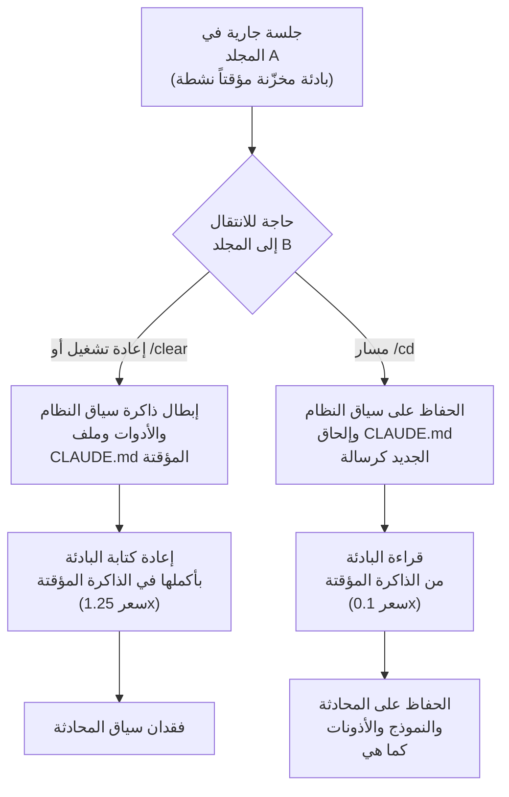

عندما تعمل لفترة طويلة مع وكيل برمجة (coding agent)، تأتي حتماً لحظة تحتاج فيها إلى الانتقال بين المجلدات. المثال النموذجي هو العمل في مستودع أحادي الجذر (monorepo): تعدّل وحدة أساسية في مكتبة مشتركة، ثم تنتقل إلى الخدمة التي تستخدم هذه الوحدة للتحقق من التكامل. حتى الآن كان عليك في هذه الحالة إغلاق الجلسة وفتح جلسة جديدة في المجلد الآخر، أو تفريغ السياق باستخدام /clear. والنتيجة ليست فقط ضياع سياق المحادثة الذي بنيته حتى تلك اللحظة، بل تكلفة خفية إضافية لا تظهر بسهولة للعين: إبطال ذاكرة التخزين المؤقت للـ prompt بالكامل، بحيث يُحاسَب الطلب التالي بسعر كتابة الذاكرة المؤقتة من جديد. أمر /cd الذي أُدرج بهدوء في Claude Code v2.1.169 يمنع هاتين الخسارتين في آن واحد. يوضّح هذا المقال، استناداً إلى الأسعار المُعلنة في الوثائق الرسمية، لماذا لا يُعد هذا السطر الواحد مجرد ميزة راحة، بل مسألة تتعلق بتكلفة تشغيل وكيل البرمجة.


## نظرة عامة

يقوم الأمر `/cd <المسار>` بنقل جلسة Claude Code الجارية إلى مجلد عمل آخر. لا تُعاد الجلسة من الصفر، لذا ينتقل سجل المحادثة، والنموذج المختار، وإعدادات الأذونات، كلها كما هي إلى المجلد الجديد. حتى هذه النقطة، يبدو الأمر ميزة راحة معتادة. لكن الجوهر الحقيقي يكمن فيما بعد: لا يكسر /cd ذاكرة التخزين المؤقت للـ prompt. الرسالة التي تُرسل مباشرة بعد الانتقال إلى المجلد الجديد تُحاسَب بسعر قراءة الذاكرة المؤقتة، وليس بسعر كتابتها.

سبب أهمية هذا الفارق يكمن في سعر الذاكرة المؤقتة نفسه. وفقاً للأسعار التي أعلنتها Anthropic لتخزين الـ prompt مؤقتاً، فإن قراءة الذاكرة المؤقتة تبلغ نحو 10 بالمئة من سعر الإدخال القياسي، أي 0.1x. في المقابل، تُضاف علاوة تبلغ 1.25x عند الكتابة الجديدة في الذاكرة المؤقتة. عند إعادة تشغيل الجلسة، يجب إعادة كتابة سياق النظام (system prompt) وتعريفات الأدوات وملف `CLAUDE.md` الخاص بالمشروع، جميعها من جديد في ذاكرة مؤقتة جديدة. وكلما كان المشروع أكبر، بلغت هذه البادئة (prefix) عشرات الآلاف من الرموز (tokens). أمر /cd لا يعيد كتابة هذه البادئة، بل يقرأها كما هي ويعيد استخدامها.

تشغّل Thaki Cloud في بيئة متعددة المستأجرين وكلاء ومهام دفعية لعملاء متعددين على نفس البنية التحتية. في مثل هذه البيئة، اقتصاديات الرموز تعني مباشرة تكلفة الخدمة. إذا أعاد وكيل البرمجة تخزين البادئة مؤقتاً في كل مرة يتنقل فيها بين المجلدات، فإن هذه التكلفة تتراكم بما يتناسب مع عدد الجلسات وعدد مرات التنقل. إجراء واحد مثل /cd يحافظ على الذاكرة المؤقتة يمكن أن يؤدي في التشغيل واسع النطاق إلى وفورات لا يُستهان بها. لذا فمن الأدق النظر إلى هذه الميزة على أنها مسألة "نظافة تكلفة" وليست مجرد "اختصار مريح".

## ما هي هذه التقنية

لفهم قيمة /cd، لا بد أولاً من فهم كيفية عمل ذاكرة التخزين المؤقت للـ prompt. يقوم Claude Code تلقائياً بتخزين سياق النظام وتعريفات الأدوات وملف `CLAUDE.md` مؤقتاً في كل دورة (turn)، دون الحاجة إلى أي إعداد إضافي. تشغل هذه البادئة المخزّنة مؤقتاً بداية المحادثة، وتُلحَق بعدها كل رسالة جديدة. إذا ظلت الذاكرة المؤقتة حيّة، تُحاسَب هذه البادئة بسعر القراءة فقط. أما إذا انكسرت الذاكرة المؤقتة، فيجب إعادة كتابة البادئة بأكملها.

عند إعادة تشغيل الجلسة أو تفريغ السياق باستخدام /clear، تُبطَل الذاكرة المؤقتة. لكن الفخّ الكامن في عملية الانتقال بين المجلدات هو أن المجلد الجديد يحتوي غالباً على ملف `CLAUDE.md` مختلف. منطقياً، يبدو أن تغيير محتوى `CLAUDE.md` الذي يدخل في سياق النظام يجب أن يكسر الذاكرة المؤقتة. وهنا يكمن الجزء الذكي في /cd. فبدلاً من إعادة كتابة `CLAUDE.md` الخاص بالمجلد الوجهة داخل سياق النظام، يُضيفه كرسالة تالية في المحادثة. وبما أن سياق النظام لا يُعاد كتابته، تبقى البادئة المخزّنة مؤقتاً كما هي، ويُعامَل ملف `CLAUDE.md` الجديد باعتباره مجرد رسالة مستخدم مُلحَقة في النهاية. هذه هي الطريقة التي تحافظ بها الذاكرة المؤقتة على نفسها بينما تعكس قواعد المجلد الجديد في الوقت نفسه.

يوضّح المخطط التالي كيف يتعامل المساران مع الذاكرة المؤقتة بشكل مختلف عند الانتقال بين المجلدات.



جوهر هذا المخطط أن المسار الأيمن لا يمس سياق النظام إطلاقاً. أما المسار الأيسر فيعيد كتابة البادئة وفي الوقت نفسه يفقد كل ما تراكم من محادثة حتى تلك اللحظة. الوجهة واحدة، لكن التكلفة المدفوعة مختلفة تماماً.

سبب بقاء الذاكرة المؤقتة سليمة عند الإلحاق في النهاية هو أن تخزين الـ prompt مؤقتاً يعمل على مستوى البادئة. تعيد الذاكرة المؤقتة استخدام الجزء الذي يظل مطابقاً لبداية المحادثة، أي جزء البادئة. فإذا تغيّر حرف واحد في البادئة، يجب إعادة حساب كل ما يليها من تلك النقطة فصاعداً. لذلك فإن وضع محتوى يتغيّر باستمرار في البداية يقلّل من معدل إصابة الذاكرة المؤقتة (cache hit rate)، بينما وضع محتوى مستقر في البداية وإلحاق ما يتغيّر في النهاية يرفع هذا المعدل. تصميم /cd الذي يُلحق ملف `CLAUDE.md` الجديد كرسالة في نهاية المحادثة بدلاً من سياق النظام هو بالضبط التزام بهذا المبدأ: عدم لمس البادئة المخزّنة مؤقتاً، واستيعاب التغيير خارج حدود الذاكرة المؤقتة.

## التثبيت والدمج

لا يحتاج /cd إلى أي تثبيت منفصل. يمكن استخدامه مباشرة اعتباراً من Claude Code v2.1.169 فما فوق. صدر هذا الأمر في 8 يونيو 2026. طريقة الاستخدام بسيطة.

```bash
# الانتقال إلى مجلد آخر داخل الجلسة
/cd ../consuming-service

# يمكن أيضاً استخدام مسار مطلق
/cd /Users/me/repo/apps/web

# مسار نسبي إلى المجلد الرئيسي
/cd ~/repo/packages/core
```

عند تنفيذ الأمر، يقوم Claude Code بتحديث مجلد العمل، ويقرأ ملف `CLAUDE.md` الموجود في الموقع الجديد ويُلحقه بالمحادثة، ثم يواصل العمل الجاري. وبما أن سجل المحادثة والقرارات المتخذة حتى تلك اللحظة تبقى محفوظة، فإن طلباً مثل "تحقق من أن الواجهة تستخدم الواجهة البرمجية التي عدّلتها للتو في الوحدة الأساسية" ينساب بشكل طبيعي.

لنأخذ مثالاً محدداً. تُجمّع بيئة عمل منصة Thaki Cloud سبعة مستودعات منتجات، منها الواجهة الخلفية بلغة Go، والواجهة الأمامية، ونشر GitOps، وشبكة الوصل متعددة النطاقات (multi-cluster mesh)، وذلك عبر وحدات فرعية (git submodules). إن تعديل مخطط استجابة واجهة برمجية خلفية ثم التحقق من ظهور الشاشة بشكل صحيح في الواجهة الأمامية التي تستهلك هذا المخطط هو عمل يومي في هذا الهيكل. في الطريقة القديمة، كان يجب إغلاق جلسة الواجهة الخلفية وفتح جلسة جديدة في مجلد الواجهة الأمامية، ثم إعادة شرح ما تم تغييره ولماذا في الجلسة الجديدة. مع /cd لا ينقطع سير العمل.

```bash
# جارٍ تعديل المخطط في الوحدة الفرعية الخلفية
# ...

# الانتقال إلى الواجهة الأمامية التي تستهلك هذا المخطط (مع الحفاظ على السياق والذاكرة المؤقتة)
/cd ../ai-suite/apps/web

# السؤال مباشرة: هل تُشير هذه الشاشة إلى اسم الحقل الذي تم تعديله للتو؟
```

فور الانتقال، يُلحَق ملف `CLAUDE.md` الخاص بمجلد الواجهة الأمامية بالمحادثة، فتنعكس فوراً قواعد ذلك المستودع (مثل حدود FSD أو استخدام رموز TDS). وفي الوقت نفسه، يبقى السياق المتراكم من العمل على الواجهة الخلفية، أي أي حقل تم تعديله ولماذا، حياً، مما يسمح بالانتقال مباشرة إلى التحقق.

لفهم اقتصاديات الذاكرة المؤقتة، لا بد من الاطلاع على جدول الأسعار. الجدول التالي يلخّص أسعار تخزين الـ prompt مؤقتاً التي أعلنتها Anthropic.

| البند | السعر مقارنة بالإدخال القياسي | الوصف |
|---|---|---|
| قراءة الذاكرة المؤقتة | 0.1x | إعادة استخدام البادئة المخزّنة مؤقتاً، خصم 90 بالمئة |
| كتابة الذاكرة المؤقتة (مدة صلاحية 5 دقائق) | 1.25x | تسجيل بادئة جديدة في الذاكرة المؤقتة، تُستَرد التكلفة عند أول قراءة |
| كتابة الذاكرة المؤقتة (مدة صلاحية ساعة واحدة) | 2.0x | عند تفعيل `ENABLE_PROMPT_CACHING_1H=1` |
| إدخال دون استخدام ذاكرة مؤقتة | 1.0x | السعر الأساسي |

هناك سياق واحد يستحق الانتباه. خفّضت Anthropic بهدوء في مارس 2026 مدة صلاحية الذاكرة المؤقتة الافتراضية (TTL) من 60 دقيقة إلى 5 دقائق. إذا لم يصل طلب تالٍ خلال 5 دقائق، تنتهي صلاحية الذاكرة المؤقتة وتُدفَع تكلفة الكتابة من جديد. إذا كنت تعمل بفواصل زمنية طويلة، يمكن التفكير في تفعيل خيار الساعة الواحدة، لكن علاوة الكتابة ترتفع إلى 2.0x، لذا يجب موازنة المقايضة. أمر /cd هو ما يحافظ على الذاكرة المؤقتة حيّة عند استمرار الجلسة ضمن هذه المدة، لذا أصبح أكثر أهمية في عصر مدة الصلاحية القصيرة.

## نتائج التجربة الفعلية

بصراحة، /cd أمر تفاعلي يُكتب بالشرطة المائلة، ولذلك لم نتمكن في البيئة غير التفاعلية (headless) التي كُتب فيها هذا المقال من تشغيل جلسة فعلية وإجراء قياس أداء تفاعلي. لذا، بدلاً من اختلاق أرقام قياس، نعرض نموذج تكلفة يمكن حسابه اعتماداً فقط على الأسعار المُعلَنة. الأرقام أدناه ليست قيماً مقيسة، بل حسابات مبنية على الأسعار الرسمية في الوثائق، ونوضّح ذلك بجلاء.

لنقارن المسارين من حيث كيفية احتساب البادئة المخزّنة مؤقتاً في أول طلب مباشرة بعد الانتقال بين المجلدات. في مسار إعادة التشغيل أو /clear، تُسجَّل البادئة من جديد بسعر كتابة الذاكرة المؤقتة (1.25x). أما في مسار /cd، فتُعاد استخدام البادئة نفسها بسعر قراءة الذاكرة المؤقتة (0.1x). إذا افترضنا أن حجم البادئة متساوٍ في الحالتين، فإن نسبة التكلفة المدفوعة مقابل إعادة احتساب البادئة مباشرة بعد الانتقال هي 1.25 مقسومة على 0.1، أي 12.5 مرة. بعبارة أخرى، مسار إعادة التشغيل أغلى بنحو 12.5 مرة من مسار /cd من حيث إعادة احتساب البادئة.


هذه النسبة تصح بغضّ النظر عن العدد المطلق لرموز البادئة. غير أن قيمة الوفورات المطلقة تزداد كلما كانت البادئة أكبر. في المشاريع الكبيرة، من الشائع[تقديري] أن تصل البادئة المكوّنة من سياق النظام وتعريفات الأدوات وملف `CLAUDE.md` الضخم إلى عشرات الآلاف من الرموز، وفي مثل هذه الجلسات، إذا تنقّل المستخدم بين المجلدات عدة مرات يومياً، تتراكم تكلفة إعادة التخزين المؤقت بسرعة. أمر /cd يخفّض علاوة الـ 12.5 مرة التي تُضاف عند كل انتقال إلى سعر القراءة فقط.

نقطة أخرى تستحق الإشارة إليها هي أن ما يحافظ عليه /cd ليس التكلفة فقط. سياق المحادثة الذي يُفقَد في مسار إعادة التشغيل هو تكلفة يصعب ترجمتها إلى رموز. فإذا اضطررت لإعادة شرح نيّة الكود الذي عدّلته للتو، والفرضيات التي وضعتها سابقاً، والمقاربات التي استبعدتها بالفعل، فإن ذلك يستهلك وقتاً بشرياً ورموزاً إضافية معاً. يزيل /cd هذه التكلفة المرتبطة بإعادة الشرح أيضاً.

## دلالات التطبيق في منتجات Thaki Cloud

لهذه الميزة أهمية من منظور منتجَي Thaki Cloud كليهما.

من منظور Paxis، يلامس /cd بدقة مسألة نظافة جلسات وكيل البرمجة. Paxis هو السحابة الأصلية للوكلاء (Agent-Native Cloud) لدى Thaki Cloud، حيث تُعامَل المهارات (skills) والأدوات والسياسات وسجلات التدقيق كموارد أساسية من الدرجة الأولى، ويُشغَّل الوكيل داخل بيئة معزولة (sandbox). التنقل بين مستودعات ووحدات فرعية متعددة أثناء عمل وكيل البرمجة هو سيناريو شائع في Paxis. وإذا أعاد الوكيل تشغيل الجلسة عند كل انتقال، فإن ذلك يعني إعادة احتساب سياق مهارات وسياسات ضخم في كل مرة. الأسلوب الذي يحافظ على البادئة ويُلحق قواعد المجلد كرسالة فقط، كما يفعل /cd، ينسجم جيداً مع نموذج تنسيق (orchestration) Paxis الذي يبدّل مسار العمل فقط مع الحفاظ على اختيار المهارات وبوابات السياسات. فكرة عدم إعادة كتابة سياق النظام وإلحاق السياق في النهاية بدلاً من ذلك هي بعينها المبدأ الذي يُدار به طبقة القواعد المُحمَّلة باستمرار من منظور استقرار الذاكرة المؤقتة.

ومن منظور ai-platform، تُعد اقتصاديات الذاكرة المؤقتة تكلفة الخدمة متعددة المستأجرين مباشرة. تُشغّل منصة ai-platform لدى Thaki Cloud أحمال استدلال (inference) لعملاء متعددين فوق جدولة GPU قائمة على K8s وKueue. تخزين الـ prompt مؤقتاً هو رافعة أساسية لخفض تكلفة الإدخال عبر إعادة استخدام البادئات المتكررة، والمبدأ الذي يُظهره /cd، أي إضافة السياق في نهاية المحادثة وليس في بدايتها كي لا تنكسر الذاكرة المؤقتة، يُطبَّق كما هو في مكدّس الخدمة الخاص بالمنصة. تصميم بنية الـ prompt بحيث تُقلَّل نقاط إبطال الذاكرة المؤقتة يمنح تنافسية عند تكلفة خدمة منخفضة. والعدستان تُكمّلان إحداهما الأخرى: تكلفة الخدمة المنخفضة (ai-platform) تصنع اقتصاديات الوكيل (Paxis)، وسلوك الوكيل الذي يحافظ على الذاكرة المؤقتة (Paxis) يخفّض بدوره حمل البنية التحتية.

## القيود والاعتراضات

/cd ليس حلاً سحرياً. أولاً، الحفاظ على الذاكرة المؤقتة له معنى فقط ضمن مدة الصلاحية البالغة 5 دقائق. إذا تركت المجلد بعد الانتقال إليه لفترة طويلة دون نشاط، تنتهي صلاحية الذاكرة المؤقتة، وسواء استخدمت /cd أم لا، سيُحاسَب الطلب التالي بتكلفة الكتابة. ونظراً لقصر مدة الصلاحية، تكون وفورات /cd في أعلى مستوياتها في سير العمل المتواصل، بينما تتضاءل فائدتها في العمل المتقطّع.

ثانياً، هناك فخّ دقيق في أسلوب إلحاق ملف `CLAUDE.md` كرسالة بدلاً من إدراجه في سياق النظام. إذا عدّلت ملف `CLAUDE.md` الأصلي للمشروع أثناء الجلسة، فإن هذا التعديل لا يكسر الذاكرة المؤقتة، لكنه في المقابل لا يُطبَّق حتى تنفّذ /clear أو /compact أو تُعيد تشغيل الجلسة. أي قد ينشأ وضع تُغيَّر فيه القواعد دون أن تعكسه الجلسة، لذا يجب تحديث الجلسة عمداً بعد تغيير القواعد.

ثالثاً، نسبة توفير الذاكرة المؤقتة البالغة 12.5 مرة هي في نهاية المطاف حساب مبني على الأسعار الرسمية في الوثائق فيما يخص إعادة احتساب البادئة مباشرة بعد الانتقال. أما الوفورات المُحَسّة فعلياً في التكلفة الإجمالية للجلسة، فتختلف بحسب حصة البادئة من التكلفة الكلية، وطول المحادثة، وتكرار الانتقالات. لا ينبغي تفسير نسبة هذا المقال على أنها "تكلفة الجلسة تنخفض 12.5 مرة". الأصح هو أن الوفورات تتمثل تحديداً في "عدم الحاجة إلى إعادة تخزين البادئة مؤقتاً عند لحظة الانتقال".

ومع ذلك، فإن الخلاصة واضحة. إذا كنت تتنقل بين المجلدات بشكل متكرر في مشروع أحادي الجذر أو في مستودعات متعددة، فإن /cd هو أرخص طريقة للحفاظ على سياق المحادثة وذاكرة التخزين المؤقت للـ prompt في آن واحد. إذا كان فريقك يُشغّل وكلاء البرمجة مع مراعاة التكلفة، فهناك ما يكفي من الأسباب لجعل هذا السطر الواحد عادة راسخة.

## المصادر

- [Manage sessions - Claude Code Docs](https://code.claude.com/docs/en/sessions)
- [How Claude Code uses prompt caching - Claude Code Docs](https://code.claude.com/docs/en/prompt-caching)
- [Claude Code /cd: Switch Projects Without Losing Cache](https://claudcod.com/blog/claude-code-cd-command/)
- [التغريدة الأصلية (إعادة تغريد @delba_oliveira)](https://x.com/hjguyhan/status/2074414356058763747)
