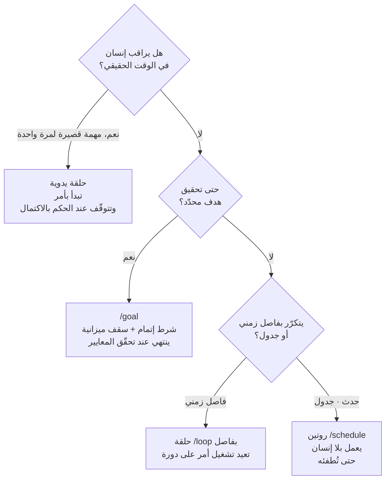

## لمن هذه المقالة

هذه المقالة موجَّهة للمطوّرين ومهندسي المنصّات الذين يريدون تشغيل وكيل الترميز لا كأداة لمرة واحدة بل كنظام أتمتة طويل الأمد. تتناول أسئلة عملية مثل: "ما الذي يجب أن أحدّده كي يكرّر الوكيل من تلقاء نفسه بدلًا من أن أكتب كل أمر؟" و"كيف أمنع الحلقات اللانهائية وانفلات التكلفة؟". نقرأ وثيقة الحلقات الرسمية من Anthropic ونضعها فوق خبرتنا التشغيلية في توصيل هذه الأنماط في خطوط أنابيب غير مراقَبة فعلية.

## نظرة عامة

حتى الآن كان استخدام وكيل الترميز محادثة. يكتب الشخص أمرًا، فيستجيب الوكيل مرة واحدة، ثم يتوقّف. ينتظر التعليمة التالية. هذا رائع للمهام القصيرة، لكنه لا يناسب تدفّق العمل المتكرّر والمحدّد النهاية مثل تطبيق مراجعات PR، وإصلاح CI، وفرز المشكلات، وترقية الاعتماديات، لأن على الإنسان أن يبقى ملتصقًا يوجّه في كل دور.

في السابع من يوليو 2026 نشرت Anthropic وثيقة رسمية بعنوان «Getting started with loops» وسمّت هذا التحوّل: هندسة الحلقات. الجملة الجوهرية في الوثيقة هي: توقّف عن كتابة كل أمر بنفسك، وابدأ بتصميم النظام الذي يوجّه الوكيل نيابةً عنك. تقرأ هذه المقالة أنواع الحلقات وشروط التوقّف التي تعرضها تلك الوثيقة، وتتابع حتى كيفية توصيلنا الفعلي لهذه الأنماط في خطوط أنابيب غير مراقَبة.

## ما هي هندسة الحلقات

هندسة الحلقات هي الخطوة التالية بعد هندسة الأوامر. إذا كانت هندسة الأوامر تتعلّق بصقل "تعليمة تنتزع استجابة جيدة واحدة"، فإن هندسة الحلقات تتعلّق بتصميم البنية المتكرّرة نفسها: رصد، حكم، تنفيذ، ثم رصد من جديد. ما يحدّد جودة الحلقة الجيدة ليس قدرة النموذج فحسب بل جودة التغذية الراجعة التي تتلقّاها الحلقة في كل تمريرة.

أوثق تغذية راجعة تأتي من تحقّق حتمي يعيد النجاح أو الفشل بموضوعية، مثل الاختبارات ومدقّقات الأنواع والمدقّقات اللغوية. تقرير النموذج الذاتي "يبدو أن هذا اكتمل" لا يمكن أن يكون شرط إنهاء الحلقة. متى يجب أن تتوقّف الحلقة يقرّره حكم أداة، لا زعم النموذج.

## أنواع الحلقات الثلاثة و/goal

تقسّم الوثيقة الرسمية الحلقات إلى ثلاثة أنواع. أيها تستخدم ينقسم على "هل يراقب إنسان في الوقت الحقيقي؟" و"هل هناك نهاية محدّدة؟" و"هل تتكرّر على جدول ثابت؟".

الأول هو الحلقة اليدوية. تبدأ بأمر من المستخدم وتتوقّف عندما يحكم Claude باكتمال المهمة أو بحاجته إلى مزيد من السياق. تناسب المهام القصيرة نسبيًّا التي ليست جزءًا من عملية أو جدول منتظم.

الثاني هو حلقة `/loop` بفاصل زمني. تعيد تشغيل أمر واحد على فاصل ثابت. المثال في الوثيقة هو: `/loop 5m check my PR, address review comments, and fix failing CI`، أي فحص الـPR كل خمس دقائق، وتطبيق تعليقات المراجعة، وإصلاح CI الفاشل.

الثالث هو روتين `/schedule`. يُطلَق بحدث أو جدول، دون إنسان يراقب في الوقت الحقيقي. تنتهي كل مهمة عند تحقيق هدفها، لكن الروتين نفسه يظلّ يعمل حتى تطفئه. يناسب تدفّقات العمل المتكرّر المحدّدة جيدًا مثل تقارير الأخطاء، وفرز المشكلات، والترحيلات، وترقية الاعتماديات.

ويجري عبر الثلاثة جميعًا `/goal`. يضبط `/goal` شرط إتمام ويُبقي Claude يعمل نحوه دون أن يوجّهه إنسان في كل خطوة. إنها بنية تحمل هدفًا اتجاهيًّا وتتقارب عبر تغذية الأدوات الراجعة.

## كيف تصمّم معايير نجاح جيدة

يتوقّف نجاح الحلقة على مدى جودة تعريف معايير النجاح. تؤكّد الوثيقة الرسمية ثلاث خصائص لمعيار النجاح الجيد.

الأولى هي القابلية للتحقّق. يجب أن يستطيع Claude تأكيد الاكتمال برمجيًّا أو عبر ملاحظة صريحة. "اجتياز كل اختبارات الوحدة" قابل للتحقّق. أما "تحسين الكود" فليس كذلك.

الثانية هي حدّ النطاق. يجب أن تحدّد ما هو ضمن الحدود وما هو خارجها. "أعد هيكلة خدمة الدفع دون المساس بطبقة قاعدة البيانات" هدف محدّد النطاق وآمن.

الثالثة هي مقياس النجاح. تساعد الأرقام. "اخفض زمن استجابة API لنقطة `/search` دون 200 مللي ثانية" يعطي هدفًا ملموسًا. المعايير المحكوم عليها حتميًّا مثل اجتياز الاختبارات أو درجة Lighthouse أو طابور فارغ تعمل على أفضل نحو.

وهناك صمّام أمان إضافي: سقف الأدوار. من دون حدّ مثل "توقّف بعد خمس محاولات"، قد يحرق هدف غامض وقتًا طويلًا ورموزًا كثيرة بينما يقرّر الوكيل إن كان "قريبًا بما يكفي". تضمين سقف أدوار في شرط الإتمام هو أبسط دفاع.

## بوابات التحقّق والمهارات

المبدأ الذي تعود إليه الوثيقة هو أن جودة التغذية الراجعة تحدّد جودة الحلقة. هنا تدخل المهارات. تحزم المهارة إجراء التحقّق الذي تنفّذه الحلقة في كل تمريرة في صورة قابلة لإعادة الاستخدام، فتمنح الوكيل طريقة للتحقّق من مخرجاته. إذا لم تُصفِّ الحلقة شيئًا ومرّرت دائمًا، فتلك إشارة إلى أن المتحقّق معطّل.

هنا تكمن الأهمية العملية الكبرى. حلقة التوسّع (fan-out) التي تنشر مهام فرعية كثيرة بالتوازي تراكم الهلوسات إذا دمجت النتائج دون مرحلة تحقّق. في عمل الكود، يجب أن يدقّق رمز خروج اختبار؛ وفي عمل البحث أو المحتوى، تصويت دحض عدائي النتائجَ قبل الانتقال للخطوة التالية. القراءة الخاطئة الشائعة عند قصور الجودة هي رفع النموذج إلى فئة أغلى، لكن السبب الأكثر شيوعًا هو غياب مرحلة التحقّق.

## دلالات لمنصّة ThakiCloud

هذه الوثيقة خاصّة بالنسبة لنا لأننا نشغّل بالفعل الأنماط التي تصفها في خطوط أنابيب غير مراقَبة فعلية.

تعمل ثلاث طبقات من الحلقات في مستودعنا. أولًا، pge-loop الذي يستخدم المترجم ومشغّل الاختبارات كإشارات مكافأة لتكرار تحويلات الكود حتى تجتاز الاختبارات. هذا يحقّق "شرط الإتمام القابل للتحقّق" من `/goal` كرمز خروج `make test-short`. ثانيًا، Goal Mode الذي يسعى نحو هدف حتى حالة الإنجاز بشكل ذاتي. بملف حالة، وسقف ميزانية، وبوابة `check_cmd`، يتبع مبادئ سقف الأدوار ومقياس النجاح في الوثيقة مباشرة. ثالثًا، مشغّلات launchd cron التي تتكرّر في أوقات ثابتة بلا إنسان، بما يقابل روتينات `/schedule`. العمل الذي لا يحتاج حكم إنسان في كل نبضة، مثل المراقبة وتوليد المحتوى، يعمل على cron بدلًا من إبقاء Claude مقيمًا، مبقيًا التكلفة عند الصفر.

هذا الانضباط التشغيلي هو تحديدًا فلسفة تصميم Paxis. Paxis هي منصّة تحكّم السحابة الأصلية للوكلاء من ThakiCloud، تعامل المهارات والأدوات والسياسات وسجلات التدقيق كموارد من الدرجة الأولى. من منظور هندسة الحلقات، توفّر Paxis أربعة أشياء: إعلان روتينات الجدولة بلغة طبيعية Cron، وتجميع مراحل التوسّع والتحقّق عبر وكلاء DAG المتعدّدين، واختيار من بين أكثر من 960 مهارة عبر BM25 لتشغيلها في صندوق رمل معزول، وتمرير كل فعل حلقة عبر بوابة سياسة وسجلّ تدقيق. مبدأ الوثيقة القائل إن "التوسّع بلا تحقّق خطر" يصبح في Paxis ميزة بنية تحتية: بوابة السياسة.

وتحتها تعمل عدسة ai-platform أيضًا. الحلقة طويلة الأمد هي في النهاية مسألة تكلفة استدلال. الحفاظ على تكلفة خدمة منخفضة فوق جدولة GPU القائمة على Kubernetes وKueue هو الأساس الاقتصادي الذي يجعل روتينات الجدولة مستدامة. الخدمة منخفضة التكلفة تصنع اقتصاد حلقات الوكلاء، وفوقها تملك Paxis أمان الحلقات وتجميعها.

## القيود والحجج المضادة

اعتبار هندسة الحلقات علاجًا لكل شيء خطر بذاته. القيد الأول هو العمل غير القابل للتحقّق. اجعل مهمة لا يمكن الحكم على نجاحها حتميًّا في حلقة، فيحرق الوكيل الميزانية بلا شرط إنهاء. إذا لم تستطع تعريف البوابة أولًا، فالتشغيل لمرة واحدة، لا الحلقة، هو القرار الصحيح.

القيد الثاني هو التكلفة. حلقة جلسة طويلة تعيد قراءة سياق ضخم في كل نبضة ترى تكلفة قراءة الذاكرة المؤقتة تنمو خطّيًّا. تراكم مراقبة أربع وعشرين ساعة في جلسة واحدة مكلف بوجه خاص. القاعدة أن تستدعي الوكيل فقط عند وجود إنسان أو حدث، وأن تدفع الاستطلاع البسيط إلى cron.

القيد الثالث هو الاستسلام المعرفي. كلما تعمّقت الحلقة، مال المرء إلى الثقة بالنتائج والتوقّف عن المراجعة. الأتمتة أداة تعين التفكير لا تحلّ محلّه. يجب أن يعاين إنسان المخرجات الأساسية دوريًّا بالعيّنة، وإذا لم يصفِّ المتحقّق شيئًا فيجب قراءة ذلك كإشارة فشل.

تختزل هذه القيود الثلاثة جميعًا إلى مبدأ واحد: عرّف بوابة الخروج قبل أن تبدأ الحلقة. بوجود بوابة، تراكم الحلقة الجودة؛ وبغيابها، تراكم الحلقة الهلوسة.

## المصادر

- Anthropic, "Getting started with loops" (2026-07-07): [claude.com/blog/getting-started-with-loops](https://claude.com/blog/getting-started-with-loops)
- Claude Code Docs, "Keep Claude working toward a goal": [code.claude.com/docs/en/goal](https://code.claude.com/docs/en/goal)
