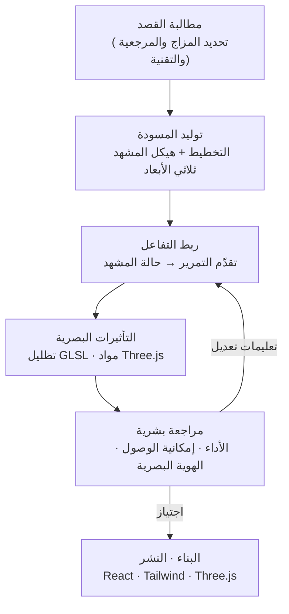

## لمن هذا المقال

يُكتب هذا المقال لمطوري الواجهات الأمامية ومهندسي التصميم الذين يبنون شاشات منتجات حقيقية بأدوات الذكاء الاصطناعي، وكذلك لمهندسي المنصات الذين يسعون إلى دمج وكلاء البرمجة في سير عمل فرقهم. لم تعد فكرة أن الذكاء الاصطناعي يستطيع إخراج نموذج أولي مقنع لصفحة هبوط أمرًا جديدًا. أما السؤال الذي نتعمق فيه هنا فهو أبعد من ذلك بخطوة: إلى أي مدى يستطيع النموذج فعليًا إنتاج تفاعلات كانت تستغرق أيامًا من البرمجة اليدوية، مثل مشهد ثلاثي الأبعاد يستجيب للتمرير أو خلفية معتمدة على التظليل، وكيف يمكن وضع هذه المخرجات ضمن خط إنتاج حقيقي. إن كنت تقف أمام قرار من هذا النوع، فغاية هذا المقال أن يميّز لك، دون مبالغة، بين ما هو ممكن فعلًا اليوم وما يظل بحاجة إلى يد بشرية.

## نظرة عامة

ظل الجدار الذي يواجهه توليد الذكاء الاصطناعي في الواجهة الأمامية "ساكنًا" لفترة طويلة. تخرج الصفحات ذات الأزرار والبطاقات المرتبة بشكل جيد، لكن التفاعلات التي تتشابك فيها الحالة والزمن، كمشهد ثلاثي الأبعاد تتحرك فيه الكاميرا تبعًا لموضع التمرير، أو مادة زجاجية تنكسر مع حركة الفأرة، كانت غالبًا ما تتعثر فيها النماذج. فإما أن الشيفرة تُترجم بنجاح لكن لا يحدث شيء على الشاشة، أو أن الإطارات تتقطع بشكل ملحوظ.

مع منتصف عام 2026، بدأ هذا الجدار يتراجع بشكل ملحوظ، وفي صميم هذا التحول يقف Claude Fable 5 من Anthropic. سجّل المطور Viktor Oddy، في دليل عملي منشور بعنوان "Claude Fable 5 Just Changed Web Design Forever!"، العملية كاملة من البداية إلى النهاية، موضحًا كيف يمكن إنتاج موقع ثلاثي الأبعاد وتفاعلي ومزوّد بالحركة من مطالبة واحدة فقط. ثم ظهر لاحقًا في المجتمع معرض مفتوح المصدر يجمع تجارب واجهات مستخدم مبنية بـ Fable 5. يتتبّع هذا المقال هذه الموجة، ويوضّح ما الذي تغيّر فعليًا، وماذا تعنيه بالنسبة لشركة مثل ThakiCloud التي تتعامل مع الوكلاء كبنية تحتية.



الفيديو أعلاه هو الدليل العملي الذي سجّله Viktor Oddy لعملية بناء موقع ويب تفاعلي ثلاثي الأبعاد باستخدام Fable 5.

## ما الذي يميّز Fable 5

Fable 5 نموذج من سلسلة Claude أطلقته Anthropic، ويُظهر تفوقًا خاصًا في هندسة الواجهة الأمامية وفي المهام الوكيلية متعددة المراحل. عبارة "متعددة المراحل" هنا مهمة. فبناء موقع ويب تفاعلي واحد هو في جوهره حزمة من المهام المتتابعة: ترتيب التخطيط، تحديد الهندسة الثلاثية الأبعاد، ربط أحداث التمرير بالمشهد، إضافة التظليل، تنظيم الملفات، ثم تحسين الأداء. وبينما كانت النماذج السابقة تنجز مرحلة أو اثنتين من هذه السلسلة وتترك الباقي للبشر، يمضي Fable 5 في هذه السلسلة لمسافة أطول بنفسه.

على وجه التحديد، تتكرر السمات التالية في الحالات المنشورة. أولًا، يُترجم الحركات المتحكم بها عبر التمرير إلى شيفرة فعلية، حيث يربط النموذج بنفسه تقدّم التمرير بحالة الكاميرا أو عناصر المشهد، وهو جزء يصعب برمجته يدويًا بسبب تعقيد إدارة الحالة. ثانيًا، يمزج مكتبات ثلاثية الأبعاد مثل Three.js مع تظليل GLSL لإنتاج تأثيرات بصرية كالانكسار والتشويش والجسيمات. ثالثًا، يستقبل لقطة شاشة كمُدخل ويقترح إعادة تصميم تُحسّن التخطيط والتفاعل في موقع قائم. رابعًا، يرتّب بنفسه بنية ملفات المشروع وأصوله، ويدفع بالنتيجة حتى تصبح قابلة للتشغيل من مطالبة واحدة.

القاسم المشترك بين هذه القدرات ليس "توليد ترميز ساكن" بل "توليد شيفرة تتشابك فيها الحالة والزمن". وهذه بالضبط النقطة التي كانت الحلقة الأضعف في الذكاء الاصطناعي الخاص بالواجهة الأمامية، وهي ما رفعه Fable 5 بشكل ملحوظ.

## كيف يُبنى تصميم الويب التفاعلي

بتتبّع الدليل المنشور ونتائج المعرض بشكل عكسي، يتّضح أن سير العمل الفعلي يتّبع في الغالب التسلسل التالي. بدلًا من توقّع نتيجة كاملة من المحاولة الأولى، تُسند إلى النموذج المراحل التي يُجيدها في كتل كبيرة، بينما يراجع الإنسان النتيجة ويضيّق الفجوات تدريجيًا.

جوهر الأمر هو تضمين "ما تريده بالضبط" بقدر كافٍ من التحديد في المطالبة الأولى. فتحديد المزاج المرغوب والمواقع المرجعية والتقنية المستخدمة (مثل React وTailwind وThree.js) يُحدث فرقًا كبيرًا في جودة المسودة الأولى للنموذج. كما أن إرفاق لقطة شاشة يرفع من دقة إعادة التصميم. بعد ظهور المسودة، تعمل تعليمات التعديل على مستوى التفاعل، مثل "اجعل الكاميرا تتحرك بشكل أبطأ عند أسفل التمرير"، بفعالية جيدة. بعبارة أخرى، لا ينتهي الأمر بمطالبة واحدة، بل يُترك الهيكل الكبير للنموذج بينما يضبط الإنسان دقائق التفاعل.

وهناك أيضًا نقاط يجب الانتباه إليها. فالتظليل اللافت والتلات ثلاثية الأبعاد لهما ثمن على صعيد الأداء على الأجهزة المحمولة وإمكانية الوصول. فحتى لو بدت نتيجة النموذج رائعة على سطح المكتب، تبقى معالجة الأجهزة منخفضة الإمكانيات ومستخدمي قارئات الشاشة مسؤولية الإنسان. وإن لم تُدرج مرحلة المراجعة هذه بشكل صريح في سير العمل، فمن السهل أن تتراكم نتائج "جميلة لكن غير قابلة للاستخدام الفعلي".

## أمثلة واقعية ومعرض مفتوح المصدر

الدليل على أن هذه الموجة ليست تباهيًا فرديًا موجود في المصادر المنشورة. سجّل Viktor Oddy المذكور آنفًا العملية بأكملها في دليله، كما أُتيح في المجتمع معرض مفتوح المصدر `pulkitxm/claude-directory` الذي يجمع تجارب واجهات مستخدم مبنية بـ Fable 5. يضم هذا المستودع أمثلة لصفحات هبوط وأقسام رئيسية وتظليل GLSL وأنظمة تصميم وحركات ومشاهد ثلاثية الأبعاد، مُنفّذة فوق React وTailwind وThree.js، ويمكن فتح النتائج مباشرة والاطلاع على الشيفرة كاملة. وبما أنه يمكن معاينة كل تجربة في المتصفح مباشرة، فإن السؤال "هل هذا يعمل فعلًا؟" يمكن التحقق منه بالتشغيل الفعلي لا بمجرد لقطة شاشة، وهذا أمر مهم.

وهناك مثال آخر يجمع بين Fable 5 وHiggsfield MCP لبناء موقع ويب سينمائي متحرك بالتمرير، موثّق بشكل علني أيضًا. ما يستحق الانتباه هنا هو أن النموذج لا يقوم بكل شيء بمفرده، بل يتصل عبر موصّل MCP بأداة خارجية (توليد الأصول البصرية في هذه الحالة) وتُدمج النتيجة في مخرج واحد. وهذا مؤشر على أن توليد الويب التفاعلي يتطور من كونه موهبة نموذج واحد إلى ثمرة خط إنتاج تتشابك فيه النماذج مع الأدوات.

وخلاصة ما يمكن تأكيده حتى الآن هو ما يلي. أولًا، تخرج من مطالبة واحدة مسودة قابلة للتشغيل لموقع ثلاثي الأبعاد تفاعلي. ثانيًا، يتم التحقق من هذه النتيجة عبر شيفرتها الكاملة في مستودعات منشورة. ثالثًا، تتكامل روابط الأدوات كـ MCP مع خط الإنتاج وصولًا إلى توليد الأصول. غير أنه لا توجد في هذه الحالات مقاييس أداء كمية موحّدة ومنشورة (معدل الإطارات، حجم الحزمة، درجة إمكانية الوصول)، وهذا ليس تخمينًا بل حقيقة يُستحسن التعامل معها بجدية عند تقييم الجودة، إذ يبقى الحكم على الجودة رهينًا بمعايير المراجعة الخاصة بكل جهة.

## دلالات على مستوى منتجات ThakiCloud

تتقاطع هذه الموجة تمامًا مع الاتجاه الذي تسير فيه Paxis من ThakiCloud. فـ Paxis هو مستوى التحكم في Agent-Native Cloud الذي يعمل فوق ai-platform، ويتعامل مع المهارات (Skills) والأدوات (Tools) والسياسات (Policies) وسجلات التدقيق (Audit Logs) كموارد من الدرجة الأولى. ما أظهره Fable 5 هو أن وكيل البرمجة تجاوز كونه مستجيبًا لمهمة واحدة ليصبح كيانًا توليديًا يواصل سلسلة من المراحل بنفسه. ولوضع هذا النوع من الوكلاء في سير عمل المنتج، يصبح "أين يُنفَّذ وبأي صلاحية وماذا يُسجَّل" أمرًا لا يقل أهمية عن "ماذا يولّد".

وإذا نظرنا إلى سير العمل أعلاه من منظور Paxis، تتحوّل كل مرحلة إلى مورد ضمن مستوى التحكم. فمهمة متكررة مثل توليد الويب التفاعلي تُسجَّل كمهارة واحدة تُختار عبر BM25 من مجموعة تضم نحو 960 مهارة، بينما يُنفَّذ توليد الشيفرة والبناء الفعلي في بيئة معزولة (sandbox). وكما في حالة Higgsfield MCP، إذا احتاج الأمر إلى أداة خارجية، يتولى موصّل MCP إعادة الاتصال عبر OAuth تلقائيًا. وقبل أن يصل الناتج إلى بيئة الإنتاج، تفرض بوابة السياسات قواعد المراجعة، ويُسجَّل كل إجراء في سجل التدقيق. وباختصار، ما يفعله مستوى التحكم هو الارتقاء بـ"براعة الذكاء الاصطناعي الفردية في إنتاج واجهات جيدة" إلى خط إنتاج قابل للتكرار يمكن للفريق أن يثق به ويراجعه.

وهناك دلالات أيضًا على مستوى البنية التحتية. فالواجهات الأمامية التي تتضمن مشاهد ثلاثية الأبعاد وتظليلًا تتطلب في مرحلة التوليد عمليات معالجة رسومية ثقيلة وبناءً متكررًا. وتعتمد منصة ai-platform لدى ThakiCloud على K8s وKueue لجدولة هذه الأعباء المتقطعة داخل مستأجرين معزولين، وربط الموارد وفصلها عند الحاجة فقط لضبط التكلفة. والقدرة على تشغيل خط الإنتاج هذا ذاتيًا في بيئات محلية وسيادية تكتسب أهمية خاصة للعملاء الذين يصعب عليهم إخراج الشيفرة وأصول التصميم إلى خارج بيئتهم. فوجود بنية تحتية موثوقة ومنخفضة الكلفة للتوليد والبناء (ai-platform) هو الأساس الذي تقوم عليه جدوى اقتصاد الوكلاء (Paxis).

## الحدود والحجج المضادة

الاكتفاء بالتفاؤل يُخلّ بالتوازن. لذا نوضّح هنا بعض النقاط المقابلة بجلاء.

أولًا، لا تزال قابلية صيانة شيفرة التفاعل المولَّدة غير مؤكدة. فمشهد ثلاثي الأبعاد ناتج عن مطالبة واحدة قد يكون مبهرًا، لكن قدرة شخص آخر على فهم منطق إدارة الحالة فيه وتعديله بعد أشهر قضية مختلفة تمامًا. وغالبًا ما يتعارض البهاء مع قابلية الصيانة.

ثانيًا، لا يأتي الأداء وإمكانية الوصول تلقائيًا. فكما أُشير سابقًا، معدل الإطارات على الأجهزة المحمولة، وحجم الحزمة، ودعم قارئات الشاشة، ليست مجالات يتكفّل بها النموذج افتراضيًا، وإن لم تُحدَّد كبوابة مراجعة صريحة، ستتحول إلى دين تقني.

ثالثًا، هناك مسألة أصالة النتائج. فإذا أنتجت مطالبات متشابهة أقسامًا رئيسية ثلاثية الأبعاد متشابهة، قد ينشأ ما يمكن تسميته "توحيد جماليات الذكاء الاصطناعي"، حيث تتقارب كل المواقع نحو مزاج واحد. وكلما ازدادت قوة الأداة، ازدادت أهمية حكم الإنسان في تحديد ما يجب بناؤه.

رابعًا، غياب مقاييس كمية موحّدة في الحالات المنشورة يستدعي الحذر. فرغم كثرة الشهادات الانطباعية التي تصف الفارق بأنه "من مستوى مختلف تمامًا"، لا يزال هذا الادّعاء يفتقر إلى تحقق كافٍ عبر معايير قابلة لإعادة الإنتاج. لذا يُنصح، قبل التبنّي الفعلي، بإجراء تجربة مباشرة على البنية التقنية والمعايير الخاصة بك.

في المحصلة، خفّض Fable 5 بشكل فعلي عتبة الدخول إلى توليد الويب التفاعلي. لكن تحويل هذه النتيجة إلى منتج يمكن الوثوق به يظل مسألة مراجعة وسياسات وبنية تحتية. وكيفية إغلاق تلك المرحلة الأخيرة كنظام متكامل هو ما يفصل بين فريق يستخدم أداة وفريق يبني منتجًا.

## المصادر

- Viktor Oddy، "Claude Fable 5 Just Changed Web Design Forever!" (فيديو ومقال إرشادي)، <https://www.youtube.com/watch?v=_JF_s-ZRTyY>
- pulkitxm/claude-directory، معرض مفتوح المصدر لتجارب واجهات مستخدم مبنية بـ Fable 5 (React·Tailwind·Three.js·GLSL)، <https://github.com/pulkitxm/claude-directory>
- "I Built a Cinematic Scroll Website Using Claude Fable 5 and Higgsfield MCP"، Medium، <https://medium.com/@info.booststash/i-built-a-cinematic-scroll-website-using-claude-fable-5-and-higgsfield-mcp-72fbcebb8ad1>
