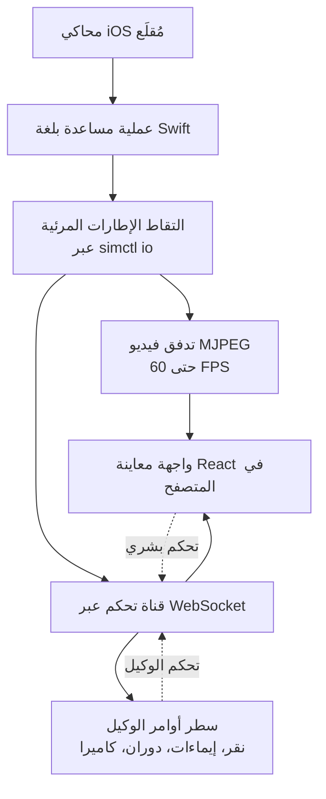

عندما تطلب من وكيل برمجة يعمل بالذكاء الاصطناعي بناء تطبيق iOS، يصطدم بحائط أساسي. يستطيع الوكيل كتابة الكود بل وحتى بناء المشروع، لكنه لا يستطيع رؤية ما يحدث فعلاً على الشاشة. وتتفاقم المشكلة أكثر عندما تكون بيئة التطوير مستضافة على جهاز Mac Mini في السحابة، لأن نافذة محاكي Xcode نفسها لا تظهر أصلاً على خادم بدون واجهة رسومية (headless).

جاء [serve-sim](https://github.com/EvanBacon/serve-sim)، الذي طوره Evan Bacon من فريق نواة Expo، ليواجه هذا الحائط مباشرة. وقد ذاع صيت هذه الأداة فعلياً عندما قدّمها المطور المستقل levelsio قائلاً إنها "تتيح رؤية تطبيق iOS الذي بناه Claude Code على Mac Mini في السحابة مباشرة عبر المتصفح في الوقت الفعلي". وشعار serve-sim بسيط: "أمر `npx serve` الخاص بمحاكيات آبل".

## نظرة عامة

ما يجعل serve-sim مثيراً للاهتمام هو أنه ليس مجرد أداة لعكس الشاشة. فهذه الأداة تفتح قناتين في آن واحد: الأولى هي تدفق فيديو يرسل شاشة المحاكي إلى المتصفح، والثانية قناة تحكم تتيح للمتصفح أو للوكيل التفاعل مع المحاكي. بعبارة أخرى، تجعل "المشاهدة" و"التحكم" ممكنتين عن بُعد في آن معاً.

أهمية هذا المزيج تكمن في أنه يُكمل حلقة التطوير الخاصة بوكلاء البرمجة بالذكاء الاصطناعي. يصبح بإمكان الوكيل تعديل الكود، وبناء المشروع، وتشغيله، ثم رؤية النتيجة على الشاشة، والضغط على الأزرار للانتقال إلى الخطوة التالية، وتكرار هذه الدورة الكاملة دون تدخل بشري. وهذا يتقاطع تماماً مع توجه Paxis، السحابة المخصصة للوكلاء (Agent-Native Cloud) لدى ThakiCloud، القائم على فكرة "أن ينفذ الوكيل عملاً فعلياً في بيئة معزولة"، مما يجعل من المفيد دراسة كيفية تنفيذ أداة مفتوحة المصدر واحدة لهذا النوع من سير العمل.


*تصوير لبنية تحوّل شاشة المحاكي على خادم بدون واجهة رسومية إلى تدفق يصل إلى متصفح بعيد.*

## ما هو serve-sim

آلية عمل serve-sim أبسط وأذكى مما قد يبدو للوهلة الأولى. لا حاجة لتثبيت إضافة (plugin) خاصة في Xcode ولا لزرع كود قياس داخل التطبيق. بدلاً من ذلك، يشغّل serve-sim عملية مساعدة صغيرة مكتوبة بلغة Swift تلتقط الإطارات المرئية لمحاكي iOS المُقلع مسبقاً عبر واجهة `simctl io` التي توفرها آبل.

تُعرض الشاشة الملتقطة عبر مسارين. أولاً، تدفق MJPEG يرسل فيديو إلى المتصفح بمعدل يصل إلى 60 إطاراً في الثانية. ثانياً، تُفتح قناة تحكم عبر WebSocket تتيح للمتصفح إرسال مدخلات مثل النقر والإيماءات إلى المحاكي. وفوق ذلك، تُركّب واجهة معاينة مبنية بـ React تتيح للمستخدم التفاعل مع التطبيق في المتصفح وكأنه جهاز فعلي.



الجوهر هنا هو أن الأداة تعمل مع "أي محاكي مُقلَع" أياً كان. لا حاجة لتعديل التطبيق، فيمكن ربطها مباشرة بمشروع قائم بالفعل. كذلك، تنقل الأداة سجلات المحاكي إلى المتصفح، مما يتيح لأدوات MCP من فئة browser-use قراءة تلك السجلات لتقييم الحالة. وتوجد أيضاً ميزة عملية تتيح إفلات ملفات فيديو أو صور في نافذة المتصفح لتُضاف كملفات إلى جهاز المحاكي.

## التثبيت والاستخدام

عتبة الدخول إلى serve-sim منخفضة. يكفي سطر واحد على جهاز Mac يحتوي على Node.js.

```bash
npx serve-sim
```

بعد التشغيل، يمكن مشاهدة المعاينة محلياً على `http://localhost:3200`. تدعم الأداة ثلاثة أنماط استخدام: محلياً، أو عبر الشبكة المحلية (LAN) من جهاز آخر على نفس الشبكة، أو على جهاز Mac بعيد مع نفق (tunnel) يتيح الوصول من أي مكان. حالة levelsio هي النمط الثالث تحديداً، حيث يعمل serve-sim على Mac Mini سحابي بدون واجهة رسومية بينما تجري المشاهدة عبر متصفح بعيد.

يُقدَّم دمج الوكلاء عبر مهارة وكيل (Agent Skill) منفصلة. هذه المهارة، الموجودة في `skills/serve-sim` ضمن المستودع، تعلّم Claude Code وCursor وCodex CLI وGemini CLI وأي مضيف آخر يطبّق معيار Agent Skills المفتوح كيفية التحكم في المحاكي عبر سطر الأوامر. وتشمل هذه القدرات النقر والإيماءات وأزرار الأجهزة الفعلية ودوران الشاشة وحقن مدخلات الكاميرا، إضافة إلى تمرير التدفق إلى نافذة المعاينة الخاصة بالمضيف.

## ملاحظة حول إعادة الإنتاج

بيئة التنفيذ التي كُتب فيها هذا المقال هي جلسة معالجة دفعية بدون واجهة رسومية، حيث تشغيل Node.js محظور بموجب السياسة المتبعة، لذا لم يتسنَّ تشغيل `npx serve-sim` مباشرة والتقاط الشاشة فعلياً. وعليه، فإن الأوامر ووصف السلوك في هذا المقال مستندة إلى ما ورد في ملف README الخاص بالمستودع والمواد التعريفية الرسمية، دون اختلاق أي أرقام قياس أداء. يُنصح بالتحقق من مشهد بث المحاكي الفعلي وزمن الاستجابة الحقيقي عبر تشغيل الأمر أعلاه مباشرة في بيئة macOS مع محاكي Xcode مُقلَع.

## دلالات على منتجات ThakiCloud

يبدو serve-sim للوهلة الأولى أداة موجهة لمطوري iOS، لكن خلفها يكمن تيار أوسع هو التطوير المصمم أصلاً للوكلاء (agent-native development).

**عدسة Paxis (التطوير المصمم للوكلاء).** Paxis من ThakiCloud هي مستوى تحكم لسحابة مخصصة للوكلاء يشغّل المهارات في صناديق رملية معزولة ويمرر كل سلوك عبر بوابات سياسات وسجلات تدقيق. ومعيار Agent Skills المفتوح الذي يعتمده serve-sim هو نفس نموذج العقد الذي تتعامل معه بنية مهارات Paxis. فكرة أن تقدّم مهارة واحدة قدرة "النقر على المحاكي وتدويره وقراءة شاشته" لعدة مضيفي وكلاء مختلفين تسير في نفس اتجاه بنية Paxis التي تختار أكثر من 960 مهارة عبر خوارزمية BM25 وتنفذها في عزل. وبشكل خاص، فإن أعباء العمل التي يتحكم فيها الوكيل فعلياً في واجهة مستخدم حقيقية، كما في قناة التحكم لدى serve-sim، لا يمكن رفعها بأمان إلى بيئة الإنتاج إلا إذا مرّ ذلك التحكم عبر بوابة سياسات وسُجّل في سجل تدقيق. إذا كان serve-sim يقدّم "القدرة"، فإن Paxis تقدّم طبقة "الضبط الآمن" لتلك القدرة.

**عدسة ai-platform (بنية التنفيذ بدون واجهة رسومية).** تكمن الجاذبية الحقيقية لـ serve-sim في عمله على جهاز Mac بعيد بدون واجهة رسومية. وفكرة البناء والبث على خادم بدون واجهة رسومية تشبه فلسفياً الطريقة التي تجدول بها منصة ai-platform من ThakiCloud أعباء العمل وتنفذها على Kubernetes دون الحاجة إلى واجهة رسومية. وأي خط أنابيب (pipeline) يُلحق فيه مشغّل macOS المطلوب لبناء تطبيقات iOS عند الطلب، يبني الوكيل عليه ويختبر تلقائياً، ثم يُبث النتيجة فقط إلى المستخدم البشري، يمكن أن يمتد إلى ما هو أبعد من التكامل المستمر (CI) نحو "ضمان جودة يقوده الوكيل". وهذه بنية تجعل فيها البنية التحتية للتنفيذ بدون واجهة رسومية منخفضة التكلفة (ai-platform) ركيزة تدعم جدوى أتمتة الوكلاء اقتصادياً (Paxis).

## القيود والحجج المضادة

هناك عدة نقاط ينبغي تناولها بموضوعية.

أولاً، يستهدف serve-sim المحاكي وليس الجهاز الفعلي. وبما أنه محاكٍ لا جهاز مادي حقيقي، تبقى المشكلات التي تظهر فقط على الأجهزة الفعلية، كالكاميرا والحساسات وخصائص الأداء، خارج نطاق الاكتشاف. ويبقى القيد القديم قائماً: نجاح الاختبار على المحاكي لا يضمن نجاحه على الجهاز الفعلي.

ثانياً، بث MJPEG بسيط ومتوافق على نطاق واسع، لكن كفاءة ضغطه ليست عالية. فبث فيديو عالي الجودة بمعدل 60 إطاراً في الثانية باستمرار عبر نفق بعيد قد يجعل عرض النطاق الترددي وزمن الاستجابة عنق زجاجة. وفي اختبارات الإيماءات التي تتطلب سرعة استجابة، ينعكس زمن الرحلة عبر الشبكة مباشرة كتأخير في التحكم.

ثالثاً، إتاحة "الرؤية والتحكم" للوكيل شيء، ودقة قراره شيء آخر تماماً. يظل احتمال أن يُسيء الوكيل تفسير التدفق ويضغط على زر خاطئ قائماً، وهذه بالتحديد هي النقطة التي تحتاج إلى بوابة سياسات ومراجعة بشرية. فكلما فتحت الأداة مزيداً من القدرات، ازدادت أهمية الطبقة التي تضبط تلك القدرات.

مع ذلك، فإن اتجاه serve-sim واضح. لقد أرسى جسراً عملياً حقيقياً للانتقال من "مرحلة يكتفي فيها الوكيل بكتابة الكود" إلى "مرحلة يبني فيها الوكيل ويشغّل ويتحكم مباشرة في الشاشة للتحقق". وأي فريق يريد تطوير تطبيقات جوّال بواسطة وكلاء ذكاء اصطناعي على سحابة بدون واجهة رسومية يمكنه فتح هذا العالم فوراً بسطر واحد هو `npx serve-sim`.

## المصادر

- Evan Bacon. "serve-sim: The `npx serve` of Apple Simulators." GitHub. <https://github.com/EvanBacon/serve-sim>
- @levelsio، تغريدة تعريفية بـ serve-sim. <https://x.com/levelsio/status/2075328941317886210>
