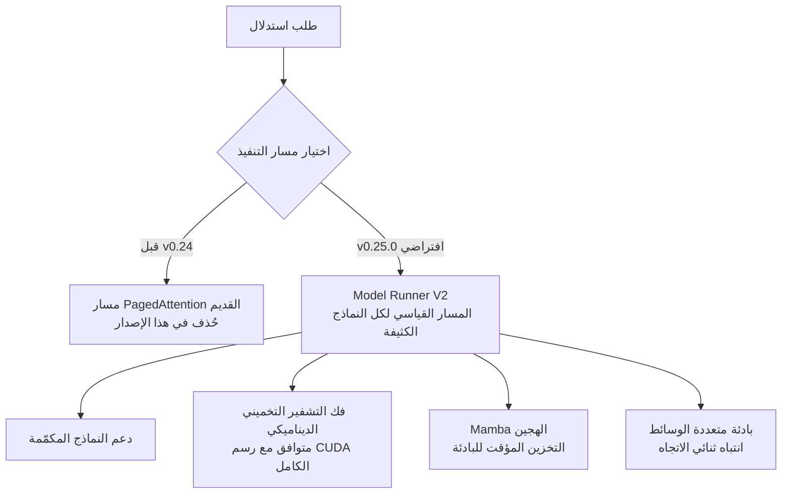

## نظرة عامة

يُعد vLLM محرك الاستدلال المعياري الفعلي لتشغيل نماذج اللغة الكبيرة مفتوحة الأوزان في بيئات الإنتاج. وبفضل إنتاجيته العالية ودعمه الواسع للعتاد، فإن معظم الفرق التي تستضيف نماذجها على وحدات معالجة رسومية خاصة بها تمرّ عبر vLLM. وإصدار جديد لمحرك بهذا الحجم ليس مجرد رفع رقم إصدار، بل حدث يؤثر في طريقة تشغيل حزمة الخدمة بأكملها.

هذا المقال موجّه للمهندسين الذين يشغّلون بنية استدلال تحتية مباشرة أو يتحملون مسؤولية تكاليف الخدمة. صدر vLLM v0.25.0 في عام 2026 ويضم 558 التزامًا من 232 مساهمًا، منهم 64 مساهمًا جديدًا. والحجم يعكس الاتجاه بوضوح: فقد تم في هذا الإصدار ترقية بنية التنفيذ الجديدة التي جرى الإعداد لها عبر عدة إصدارات سابقة لتصبح الافتراضية، وفي هذه العملية تم تنظيف المسارات القديمة.

يمكن تلخيص جوهر الإصدار في نقطتين. أولًا، **أصبح Model Runner V2 (يُختصر MRv2) مسار التنفيذ الافتراضي لجميع النماذج الكثيفة (dense)**. ثانيًا، **أُزيل التنفيذ القديم لـ PagedAttention** الذي جعل vLLM مشهورًا في الأساس. سنتناول ما يعنيه هذان التغييران لمن يشغّل خدمات على نطاق واسع، وما الفائدة العملية لميزات الفيديو وفك التشفير التخميني المرافقة لهما.

## ما الذي غيّره هذا الإصدار

أكبر تغيير بنيوي هو ترقية MRv2. فقد جرى بناء MRv2 على مدى الإصدارات السابقة أثناء تعزيز دعم النماذج المكمّمة (quantized)، وابتداءً من v0.25.0 أصبح المسار القياسي لتنفيذ النماذج الكثيفة. وباتت معظم النماذج تعمل الآن على هذا النواة الجديدة دون الحاجة لأي أعلام (flags) خاصة. ويصف فريق vLLM هذه النواة بأنها أكثر تجزئة وأسرع، وقد ثبّت هذا الإصدار وضعها كمسار افتراضي.

النتيجة الطبيعية لهذا التحول هي حذف التنفيذ القديم لـ PagedAttention. فبعد أن أصبحت الواجهتان الخلفيتان V1 وMRv2 هما المسار القياسي، لم يعد هناك مبرر للاحتفاظ بتنفيذ الانتباه القديم. كان PagedAttention، الذي يدير ذاكرة التخزين المؤقت KV صفحةً بصفحة لتقليل هدر الذاكرة، أشبه بالتقنية الرمزية للأيام الأولى لـ vLLM، لكن الفكرة نفسها امتُصت بالفعل داخل الواجهات الخلفية الجديدة. ما أُزيل هنا ليس المفهوم، بل مسار كود قديم.

يوضّح المخطط التالي التحوّل في مسارات التنفيذ:



## تفاصيل التغييرات الرئيسية

الميزات الجديدة المبنية فوق MRv2 في هذا الإصدار تستهدف بشكل أساسي أحمال العمل متعددة الوسائط وذات السياق الطويل.

أولًا، **أخذ العينات الفعّال من الفيديو (EVS، اختصار لـ Efficient Video Sampling)**. تعاني نماذج الرؤية واللغة التي تتعامل مع الفيديو من انفجار في عدد الرموز (tokens) كلما زاد عدد الإطارات، مما يفاقم استهلاك الذاكرة وزمن الاستجابة بسرعة. تقوم EVS بحذف الرموز من المناطق الزمانية-المكانية شبه الثابتة مع الحفاظ على الهوية الموضعية (positional identity) للرموز المتبقية. ولأن عدد الرموز المحتفظ بها ينمو بمعدل أبطأ من الخطي مقارنة بطول المقطع، يمكن للنماذج التعامل مع سياق زمني أطول بكثير دون تجاوز حدود الذاكرة وزمن الاستجابة.

ثانيًا، **أصبح فك التشفير التخميني الديناميكي متوافقًا مع رسم CUDA الكامل**. يعتمد فك التشفير التخميني على نموذج مصغّر لاقتراح عدة رموز مسبقًا، يقوم النموذج الرئيسي بعدها بالتحقق منها، وهو ما يرفع الإنتاجية. وتوافق هذه الآلية مع التقاط رسم CUDA يعني أن بالإمكان الآن الاستفادة في آن واحد من تقليل عبء تشغيل النواة (kernel) الذي يوفره رسم CUDA، ومن مكاسب فك التشفير التخميني نفسه.

ثالثًا، هناك تعارض مهم يجب معرفته. **تفعيل تقليم EVS يعطّل رسم CUDA الخاص بالفيديو تلقائيًا**. والسبب أن EVS تجعل عدد الرموز متغيّرًا حسب البيانات، وهذا يتعارض مع افتراض الشكل الثابت الذي يعتمد عليه التقاط رسم CUDA. بمعنى آخر، اختيار توفير الرموز في الفيديوهات الطويلة يعني التخلي عن تحسين رسم CUDA في ذلك المسار. وتحديد الجانب الأنسب يعتمد على طبيعة حِمل العمل، وهو قرار يجب أن يتخذه كل فريق بنفسه.

كما تضمّن هذا الإصدار التضمينات (embeddings) في الزمن الحقيقي، والتخزين المؤقت للبادئات لنماذج Mamba الهجينة، ودعم الانتباه ثنائي الاتجاه لبادئات الوسائط المتعددة. ومع تزايد انتشار البنى الهجينة المبنية على Mamba، يشكّل دعم التخزين المؤقت للبادئات لها تحسينًا عمليًا يخفّض تكلفة الطلبات المتكررة.

## التثبيت والتحقق

يُثبَّت vLLM v0.25.0 بالطريقة المعتادة.

```bash
uv pip install vllm==0.25.0
```

وأمر تشغيل نموذج للخدمة بعد التثبيت لم يتغيّر عن السابق.

```bash
vllm serve <model-id>
```

وبما أن MRv2 أصبح المسار الافتراضي، فلا حاجة عادةً لتحديد أعلام منفّذ (runner) منفصلة عند تشغيل النماذج الكثيفة.

بصراحة، فإن البيئة التي كُتب فيها هذا المقال لا تحتوي على وحدة معالجة رسومية، ولذلك لم نستطع قياس الإنتاجية أو زمن الاستجابة الفعليين بأنفسنا. ولهذا السبب لم نُدرج في هذا المقال أي أرقام أداء لم نقسها بأنفسنا. وكل الحقائق المذكورة مستقاة من ملاحظات الإصدار الرسمية: عدد الالتزامات والمساهمين، وترقية MRv2 إلى المسار الافتراضي، وحذف التنفيذ القديم لـ PagedAttention، وخصائص EVS وفك التشفير التخميني الديناميكي، كلها مبنية على معلومات الإصدار المنشورة. ونوصي بإجراء قياسات فعلية على عنقود وحدات معالجة رسومية خاص بكم، باستخدام النماذج المستهدفة وأنماط الحركة المرورية الفعلية لديكم.

## دلالات هذا الإصدار على منتجات ThakiCloud

يرتبط هذا الإصدار مباشرة بتشغيل **ai-platform** لدى ThakiCloud. تعتمد ai-platform على K8s وKueue لجدولة وحدات المعالجة الرسومية، وتستخدم vLLM لخدمة النماذج في بيئات متنوعة لعملائها. وبما أن vLLM هو المحرك الأساسي لحزمة الخدمة لدينا، فإن أي تغيير في بنية تنفيذه هو تغيير في طريقة تشغيلنا نفسها.

كون MRv2 أصبح المسار الافتراضي يعني أن بإمكاننا الآن تركيز جهود التحقق والتحسين على مسار تنفيذ قياسي واحد. فعندما تتعايش عدة مسارات، تتشعب عملية إعادة إنتاج الأخطاء وضبط الأداء بحسب كل مسار، أما عند اعتماد مسار قياسي واحد فإن التعقيد التشغيلي ينخفض. وبالنسبة لمنصة تخدم عشرات النماذج في آن واحد ضمن بيئة متعددة المستأجرين، فإن هذا التبسيط ينعكس مباشرة على الاستقرار.

كما يشكّل الجمع بين فك التشفير التخميني الديناميكي ورسوم CUDA، إلى جانب التخزين المؤقت الهجين لبادئات Mamba، تحسينات تصب في اتجاه خفض تكلفة الخدمة. وانخفاض تكلفة الخدمة يمثّل ميزة تنافسية مباشرة للعملاء الذين يحتاجون إلى بنية تحتية داخلية أو حلول ذكاء اصطناعي سيادية. فجدوى الوكلاء (agents) والتطبيقات التي تعمل فوق هذه البنية لا تتحقق إلا إذا أمكن تقديم الخدمة بتكلفة منخفضة على البنية التحتية الخاصة. من هذا المنطلق، تشكّل الخدمة منخفضة التكلفة التي توفرها ai-platform الأساس الذي يدعم جدوى طبقات الوكلاء الأعلى مثل Paxis.

## القيود ووجهات النظر المضادة

أول ما يجب الإشارة إليه هو أن هذا الإصدار يتضمن تغييرًا كاسرًا (breaking change). فبسبب حذف مسار PagedAttention القديم، قد تتعطل أي إعدادات مخصصة أو تكاملات من أطراف ثالثة كانت تعتمد على هذا المسار عند الترقية إلى v0.25.0. وعند رفع الإصدار في بيئة الإنتاج، ينبغي تشغيل النماذج المستهدفة فعليًا في بيئة اختبارية والتحقق من عدم وجود تراجعات قبل تطبيق الترقية. فرفع إصدار جديد مباشرة إلى الإنتاج لمجرد أنه جديد يُعد تصرفًا محفوفًا بالمخاطر.

ثانيًا، وكما أشرنا سابقًا فيما يخص التعارض بين EVS ورسوم CUDA، فإن الميزات الجديدة لا تحمل فائدة مطلقة دائمًا. يحتاج كل فريق إلى تحديد أي التحسينات يفعّلها أو يعطّلها بناءً على خصائص حِمل العمل الخاص به، وهذا قرار يصعب اتخاذه دون قياس فعلي. وتوقّع أن "تفعيل كل الميزات الجديدة يعني سرعة أكبر" كثيرًا ما يخالف الواقع.

ثالثًا، حجم الإصدار نفسه يمثّل مخاطرة. فإصدار يضم 558 التزامًا دفعة واحدة يترك مجالًا أكبر لتفاعلات غير متوقعة. وقد تظهر مشكلات خاصة ببنى نماذج أو مجموعات عتاد معينة فقط، لذا من الأفضل عدم تخطي خطوة التحقق على مجموعة النموذج ووحدة المعالجة الرسومية الفعلية التي تُستخدم لديكم.

باختصار، يمثّل vLLM v0.25.0 إصدارًا يُثبّت نتائج إعداد طويل كإعداد افتراضي. والتوحّد حول MRv2 وتنظيف المسارات القديمة يسيران في اتجاه جعل حزمة الخدمة أبسط وأسرع على المدى الطويل، وهو ما يفيد بشكل مباشر تشغيل ai-platform لدى ThakiCloud التي تعتمد على vLLM كمحرك أساسي. غير أن الاستفادة الآمنة من هذه المزايا تتطلب الالتزام بالأساسيات: التحقق من التغييرات الكاسرة والقياس الفعلي لكل حِمل عمل على حدة.

## المصادر

- إصدار vLLM v0.25.0: [github.com/vllm-project/vllm/releases/tag/v0.25.0](https://github.com/vllm-project/vllm/releases/tag/v0.25.0)
- مقدمة Model Runner V2: [vllm.ai/blog/2026-03-24-mrv2](https://vllm.ai/blog/2026-03-24-mrv2)
- ورقة أخذ العينات الفعّال من الفيديو (EVS): [arxiv.org/pdf/2510.14624](https://arxiv.org/pdf/2510.14624)
