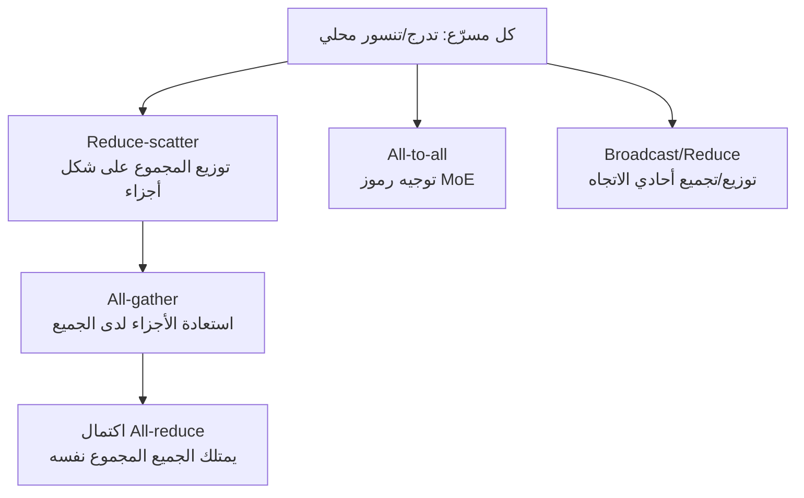

## نظرة عامة

لقد مضى وقت طويل منذ أن كان من الممكن وضع نموذج لغوي كبير على GPU واحد. فالنماذج التي تحتوي على عشرات المليارات إلى تريليونات المعاملات (parameters) تُقسّم على عشرات إلى آلاف المسرّعات (accelerators)، وفي كل خطوة تدريب يجب على هذه المسرّعات أن توائم نتائجها مع بعضها البعض. هذه العملية من "المواءمة المتبادلة" هي بالضبط ما يُعرف بالاتصال الجماعي (collective communication)، والنقطة التي تستهلك الوقت فعلياً في التدريب الموزع الحديث غالباً ما تكون هذا الاتصال وليست عمليات ضرب المصفوفات.

هذا المقال موجّه لمهندسي البنية التحتية الذين يدرّبون أو يقدّمون النماذج على عناقيد GPU أو TPU، ولمن يتحمل مسؤولية تكلفة التقديم (serving) وقابلية التوسع. ننطلق من التحليل المعمّق الشهير الذي كتبه Aleksa Gordić بعنوان "Inside TPU and GPU Clusters: The Anatomy of Collective Communication"، ونعيد التحقق من المفاهيم الأساسية التي يتناولها بالرجوع إلى مراجع قياسية (مثل NCCL وورقة TPU v4).

نبدأ برسالة أساسية موجزة. أولاً، يمكن اختزال أداء التدريب الموزع في عدد قليل من عمليات الاتصال الجماعي. ثانياً، حتى العملية نفسها تختلف تكلفتها اختلافاً جذرياً بحسب البنية الطوبولوجية الفيزيائية التي تعمل عليها (بنية NVIDIA القائمة على المفاتيح switch مقابل بنية Google القائمة على التوروس). ثالثاً، استراتيجية التوازي (parallelism) المُختارة هي التي تحدد أي عملية جماعية تُستدعى ومدى تكرارها. وفهم هذه العناصر الثلاثة يوضح لماذا يؤثر مكان وكيفية توزيع عدد من وحدات GPU تأثيراً كبيراً على الأداء.

## ما هو الاتصال الجماعي؟

العملية الجماعية هي نمط اتصال يشارك فيه عدد من العمليات (غالباً واحدة لكل مسرّع) معاً. فإذا كان الاتصال من نقطة إلى نقطة (P2P) هو أن يرسل طرف واحد بيانات إلى طرف آخر، فإن العملية الجماعية تعني أن المجموعة بأكملها تقسّم البيانات وتجمعها وفق قاعدة محددة. وفيما يلي أبرز العمليات التي تتكرر في التدريب الموزع.

- **All-reduce**: يقوم جميع المشاركين بجمع (أو أخذ متوسط) التنسور (tensor) الذي يملكه كل منهم عنصراً بعنصر، ثم تُعاد النتيجة إلى الجميع. وهذه هي العملية المستخدمة تحديداً لمواءمة التدرجات (gradients) في التدريب الموازي للبيانات (data parallel).
- **Reduce-scatter**: يُحسب المجموع، لكن النتيجة لا يحتفظ بها طرف واحد بالكامل، بل تُقسّم إلى أجزاء يوزَّع كل جزء منها على طرف مختلف.
- **All-gather**: تُجمع الأجزاء التي يملكها كل طرف بحيث يحصل الجميع على النسخة الكاملة. وهي العملية المقابلة لـ reduce-scatter، وعند ضمهما معاً ينتج all-reduce.
- **All-to-all**: يرسل كل مشارك جزءاً مختلفاً من البيانات إلى كل واحد من المشاركين الآخرين. وهو نمط أقرب إلى النقل المقلوب (transpose)، وهو محوري في تمرير الرموز (tokens) إلى الخبراء (experts) في نماذج مزيج الخبراء (Mixture of Experts, MoE).
- **Broadcast / Reduce**: عمليتان أحادّيتا الاتجاه، إما أن يبثّ طرف واحد نفس البيانات للجميع، أو أن تُجمَع بيانات الجميع وتُختزل عند طرف واحد.

هناك ملاحظة مهمة هنا وهي أن all-reduce ليست عملية ذرية (atomic) بحد ذاتها. فهي تتحلل إلى **reduce-scatter يليها all-gather**. وهذا التحلل هو الأساس الذي تُبنى عليه معادلة التكلفة التي سنتناولها لاحقاً.



## البنية الفيزيائية لعناقيد GPU

يسهل فهم عناقيد NVIDIA إذا نظرنا إليها كطبقتين: داخل العقدة (node) الواحدة (scale-up)، وبين العقد (scale-out).

داخل العقدة، تربط **NVLink** و**NVSwitch** وحدات GPU ببعضها بكثافة عالية. فوحدات GPU الثماني مثلاً الموجودة داخل خادم واحد تُربط عبر NVSwitch بشكل شبه متصل بالكامل (fully connected)، بحيث يتواصل أي GPU مع أي GPU آخر بعرض نطاق ترددي (bandwidth) عالٍ وموحّد. وهذا هو سبب حصر الأعمال التي تتطلب اتصالاً متكرراً جداً، مثل التوازي التنسوري (tensor parallelism)، داخل هذا النطاق.

أما بين العقد، فتُستخدم شبكة من نوع ورقة الشجرة السمينة (leaf-spine / fat-tree) مبنية على **InfiniBand** أو **RoCE** (RDMA over Converged Ethernet). وهذه النسيجة الموسّعة (scale-out fabric) تربط وحدات GPU عبر الرفوف (racks) والخوادم. ومن التصاميم الشائعة هنا الطوبولوجيا المحسّنة بالمسارات (rail-optimized)، حيث يُربط منفذ الشبكة (NIC) بنفس الترتيب في كل عقدة بنفس المفتاح ("المسار" أو rail)، بحيث تمر عملية all-reduce بين العقد بأقل قدر ممكن من طبقة العمود الفقري (spine).

وهذه المرونة لها ثمن. فآلاف المفاتيح (switches) اللازمة للتوسع الأفقي (scale-out) تستهلك ما يقارب 5 إلى 10 بالمئة من إجمالي طاقة العنقود [تقديري وقد يختلف بحسب التهيئة]، وتتطلب نفقات رأسمالية كبيرة. أي أن نهج NVIDIA، بدلاً من الاكتفاء بجعل "أي GPU يتواصل جيداً مع أي GPU آخر"، يشتري هذا التجانس عبر مفاتيح تعالج الحزم (packets) بشكل فعّال.

## الخيار المختلف لعناقيد TPU

تسلك Google في وحدات TPU مساراً مختلفاً تماماً. فبدلاً من نسيجة مفاتيح فعّالة، تُربط شرائح TPU مباشرة بجاراتها عبر رابط عالي السرعة مخصص يُسمى **ICI** (Inter-Chip Interconnect). في الجيل الأحدث، تمتد روابط ICI من كل شريحة في ست اتجاهات (X موجب، X سالب، Y موجب، Y سالب، Z موجب، Z سالب) لتشكّل شبكة **توروس ثلاثي الأبعاد (3D torus)** (أما الأجيال الأولى فكانت تستخدم توروس ثنائي الأبعاد لتشكيل "pod" بسعة 256 شريحة). وبما أن الاتصال يتم مباشرة مع الجيران فقط، فإن طبقة المفاتيح تختفي في معظمها.

يبقى سؤال: كيف تُربط الشرائح البعيدة عن بعضها، أو ما هو أكبر من حجم الـ pod؟ هنا يظهر **مفتاح الدارة الضوئية (OCS, Optical Circuit Switch)**. وبحسب ورقة TPU v4 البحثية، يعمل OCS عبر إعادة توجيه ألياف ضوئية باستخدام مرايا MEMS، أي أنه لا يفسّر الإشارة الضوئية بشكل فعّال بل يكتفي بعكسها. وبفضل ذلك يمكن ربط ما يصل إلى 4096 شريحة بطريقة قابلة لإعادة التشكيل، بينما لا يستهلك سوى طاقة قليلة جداً مقارنة بمفاتيح InfiniBand، لأن الطاقة تُستخدم فقط للحفاظ على اتجاه المرايا. كما يمكن لف أحد محاور التوروس ضوئياً، أو إعادة توجيه الطوبولوجيا برمجياً لتجاوز عقدة معطوبة.

باختصار، تستثمر عناقيد GPU في مفاتيح فعّالة من أجل وصول موحّد، بينما تعتمد عناقيد TPU على توروس متصل مباشرة بالجيران مع إعادة تشكيل ضوئية لتوفير الطاقة والتكلفة. ولا يتفوق أي من الخيارين على الآخر بشكل مطلق. فالتوروس مثالي للاتصال مع الجيران لكنه يحتاج قفزات (hops) أكثر للاتصال البعيد العشوائي، بينما نسيجة المفاتيح موحّدة لكنها مكلفة وتستهلك طاقة أكبر.

## كيف تُترجم العمليات الجماعية إلى استراتيجيات التوازي

أي عملية جماعية تُستدعى وبأي وتيرة، يتحدد في النهاية بنوع التوازي المُستخدم.

- **التوازي البياني (Data Parallel, DP)**: تعالج كل نسخة (replica) دفعة (batch) مختلفة، ثم تُوائَم التدرجات عبر **all-reduce**. وحجم الاتصال يتناسب مع حجم النموذج ويحدث مرة واحدة في كل خطوة.
- **التوازي البياني الكامل التشظّي (FSDP/ZeRO)**: تُقسّم المعاملات (parameters) إلى أجزاء توزَّع بين المسرّعات، ثم قبل التمرير الأمامي (forward pass) مباشرة تُجمع المعاملات اللازمة عبر **all-gather**، وبعد التمرير الخلفي (backward pass) تُعاد تشظية التدرجات عبر **reduce-scatter**. توفر هذه الطريقة الذاكرة لكنها تزيد من تكرار الاتصال.
- **التوازي التنسوري (Tensor Parallel, TP)**: تُقسَّم عملية طبقة واحدة على عدة وحدات GPU، وعند حدود كل طبقة تُدمج النتائج عبر **all-reduce** أو من خلال all-gather/reduce-scatter. والاتصال هنا متكرر للغاية، لذا يكاد يكون حصره داخل نطاق NVLink المذكور سابقاً أمراً ضرورياً.
- **التوازي عبر خطوط الأنابيب (Pipeline Parallel, PP)**: يُقسَّم النموذج على مستوى الطبقات وتُوزَّع على وحدات GPU مختلفة، وتُنقل القيم المفعّلة (activations) بين المراحل غالباً عبر اتصال **P2P**. وهنا يسود الاتصال من نقطة إلى نقطة بدلاً من العمليات الجماعية.
- **التوازي على مستوى الخبراء (Expert Parallel, EP/MoE)**: يجب إرسال الرموز (tokens) إلى المسرّع الذي يستضيف الخبير المعني، لذا فإن **all-to-all** هو جوهر هذا النوع. وعدد أزواج الاتصال في all-to-all يزداد تربيعياً مع زيادة عدد المشاركين، ما يجعله حساساً بشكل خاص للطوبولوجيا.

في الممارسة العملية تُستخدم هذه الأنواع مجتمعة. فمثلاً يُصمَّم التوزيع بحيث يُوضع TP داخل نطاق NVLink في العقدة الواحدة، وتُنقل عمليات all-reduce الخاصة بـ DP عبر InfiniBand بين العقد، ويربط PP بين هذه الأجزاء. وإذا أُسيء التوزيع، فقد يتسرب اتصال التوازي التنسوري المتكرر إلى رابط أبطأ بين العقد، مما يبطئ التدريب بأكمله.

## القاعدة التي تحكم الأداء: الحلقة والشجرة

توجد خوارزميات متعددة لتنفيذ العمليات الجماعية فعلياً، لكن الأشهر من منظور عرض النطاق الترددي هي **all-reduce الحلقي (ring all-reduce)**. حيث يُربط المشاركون في شكل دائري واحد، وفي كل خطوة يُرسل كل طرف جزءه إلى الجار التالي، وتُنفَّذ عمليتا reduce-scatter وall-gather كل منهما عبر N-1 خطوة.

ومن المعروف أن إجمالي حجم البيانات التي يحملها كل رابط يُحسب تقريباً على النحو التالي. عند تنفيذ all-reduce لتنسور بحجم S عبر N مشارك، تكون حركة المرور لكل رابط تقريباً

```
2 × (N − 1) / N × S
```

وذلك لأن (N−1)/N × S تتدفق في مرحلة reduce-scatter، ومثلها مرة أخرى في مرحلة all-gather. والخاصية المهمة هنا أن (N−1)/N تقترب من 1 كلما كبر N، أي أن حركة المرور لكل رابط تستقر عند نحو 2S تقريباً. لهذا السبب يُوصف ring all-reduce بأنه أمثل من حيث عرض النطاق الترددي (bandwidth-optimal)، وهو ما استخدمته مكتبات مثل NCCL وGloo لفترة طويلة.

المشكلة تكمن في زمن الوصول (latency). فالحلقة تمر عبر N−1 خطوة بشكل متسلسل، لذا فإن زمن الوصول الثابت (α) المرتبط بكل خطوة يتراكم بما يتناسب مع عدد المشاركين. فإذا نفّذت أعداد كبيرة جداً من العقد عملية all-reduce على تنسور صغير، يتبقى عرض النطاق الترددي فائضاً بينما يصبح زمن الوصول هو عنق الزجاجة. لهذا السبب تختار المكتبات الفعلية تلقائياً بين خوارزميات الحلقة والشجرة (أو الهرمية) بحسب حجم التنسور وعدد العقد. فطريقة الشجرة تقلّل زمن الوصول ليقترب من log(N)، لكنها تتنازل عن جزء من كفاءة عرض النطاق الترددي. وهذا هو سبب اختيار NCCL خوارزميات مختلفة بحسب حجم الرسالة.

والدلالة العملية لهذه القاعدة واضحة: عند تغيير حجم الدفعة (batch)، أو حجم النموذج، أو عدد العقد، ينتقل عنق الزجاجة المهيمن بين عرض النطاق الترددي وزمن الوصول. ولهذا لا يمكن الافتراض، من دون قياس فعلي، أن "مضاعفة عدد العقد يعني مضاعفة السرعة".

## دلالات تطبيقية على منتجات ThakiCloud

هذا الموضوع يلامس جوهر البنية التحتية، وهو ذو أهمية عملية خاصة من منظور **ai-platform** التابعة لـ ThakiCloud (بنية تحتية لـ AI/ML كخدمة SaaS قائمة على K8s).

أولاً، **الجدولة الواعية بالطوبولوجيا (topology-aware scheduling)**. تستخدم ai-platform أداة Kueue لجدولة أعباء عمل GPU، ومبدأ التوزيع الذي يضع مهام التوازي التنسوري داخل نطاق NVLink نفسه (أي العقدة نفسها)، ويوجّه عمليات all-reduce الخاصة بالتوازي البياني عبر روابط بين العقد محسّنة بالمسارات (rail-optimized)، يتطابق تماماً مع خصائص الاتصال الجماعي التي عرضناها في هذا المقال. فمعرفة أي عملية جماعية تسري عبر أي رابط هي ما يجعل توزيع المهام يُترجَم فعلياً إلى أداء.

ثانياً، **التوازي التنسوري في التقديم (serving)**. عند تقديم نموذج كبير عبر عدة وحدات GPU بتوازٍ تنسوري باستخدام محرّك مثل vLLM، تحدث عملية all-reduce في كل طبقة. وإذا وُزِّعت الحاويات (pods) بحيث يبقى هذا الاتصال داخل نطاق NVLink، يسهل الحفاظ على هدف زمن الوصول، أما إذا تجاوز حدود العقدة فإن زمن الوصول لكل رمز (token) يزداد بشكل ملحوظ. وفي بيئة متعددة المستأجرين (multi-tenant)، ينعكس هذا الانضباط في التوزيع مباشرة على تكلفة التقديم واتفاقيات مستوى الخدمة (SLA).

ثالثاً، **جدوى التكلفة في السحابة المحلية والسيادية (on-prem/sovereign cloud)**. حقيقة أن مفاتيح شبكة GPU تستهلك حصة كبيرة من الطاقة تعني أنه عند تصميم عنقود في بيئة داخلية أو سيادية محلية، لا تُعد الشبكة عنصراً ثانوياً، بل متغيراً محورياً في إجمالي تكلفة الملكية (TCO). والاستضافة الذاتية (self-hosting) وكفاءة التكلفة التي تسعى إليها ThakiCloud لا تقوم إلا على قرارات تصميم شبكي من هذا النوع.

وهناك أيضاً نقطة تقاطع مع منتج تنسيق الوكلاء (agent orchestration) **Paxis**. ففي سياق تنسيق مهام التدريب الموزع والاستدلال (inference) الكبير عبر رسم بياني موجّه غير دوري (DAG) وتنفيذها بعزل، فإن فهم البروفايل الاتصالي لكل عملية جماعية تستدعيها كل مرحلة يتيح تصميماً أدق لحجز الموارد وبوابات السياسات. لكن ثقل هذا المقال ينصبّ على طبقة البنية التحتية، لذا يبقى منظور ai-platform هو المحور الرئيسي.

## القيود والاعتراضات

هذا الطرح ليس بلا اعتراضات. أولاً، توفّر أطر العمل تجريداً (abstraction) كبيراً للعمليات الجماعية. فعند استخدام واجهات برمجة عليا مثل PyTorch أو JAX، تتم معظم قرارات التوزيع تلقائياً داخل المكتبة والمجدول (scheduler)، ولا يحتاج مطوّر التطبيق لمعرفة هذه التفاصيل. وعليه، فإن السؤال "هل يجب على كل فريق أن يعرف معادلات التوروس والحلقة؟" يكون جوابه أقرب إلى لا.

غير أن هذا التجريد ينهار في اللحظة التي يصبح فيها الأداء مشكلة. فعندما يكون التدريب أبطأ من المتوقع أو يتذبذب زمن وصول التقديم، فإن إيجاد السبب يتطلب في النهاية معرفة أي عملية جماعية تسري عبر أي رابط. فالتجريد مريح على المسار الطبيعي، لكنه يتحول إلى تجريد "متسرّب" (leaky abstraction) عند تشخيص عنق الزجاجة.

كما أن القواعد التي عرضها هذا المقال تتغير باستمرار مع كل جيل من الأجهزة. فعرض النطاق الترددي لـ NVLink وInfiniBand، وعدد روابط ICI في TPU، وحجم OCS، تختلف من جيل إلى آخر، لذا يجب دائماً التحقق من الأرقام الدقيقة عبر المصادر الرسمية الخاصة بكل جيل. توفر معادلات هذا المقال وبنيته إطاراً للتفكير، لكن القرار الإنتاجي يجب أن يُحسم عبر قياسات فعلية (benchmark). وأخيراً، تبقى الفجوة بين البرمجيات والأجهزة واقعاً قائماً، فحتى الطوبولوجيا المثلى نظرياً تصبح عديمة الجدوى إذا لم تستطع النواة (kernel) ومكتبة الاتصال استغلالها بالكامل.

## المصادر

- Aleksa Gordić، "Inside TPU and GPU Clusters: The Anatomy of Collective Communication": https://www.aleksagordic.com/blog/collective-operations
- وثائق NVIDIA NCCL ونموذج تكلفة اتصال ring all-reduce (reduce-scatter + all-gather، الأمثلية من حيث عرض النطاق الترددي)
- ورقة Google TPU v4 البحثية، "TPU v4: An Optically Reconfigurable Supercomputer for Machine Learning with Hardware Support for Embeddings" (توروس ICI ثلاثي الأبعاد، OCS): https://arxiv.org/abs/2304.01433
