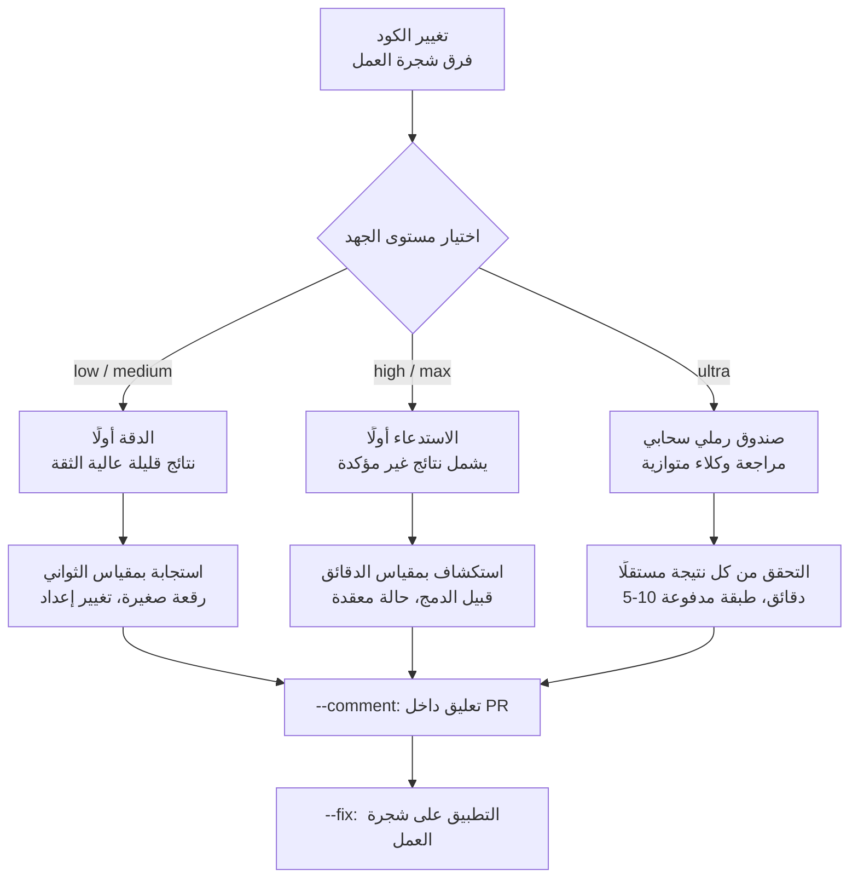

## نظرة عامة

هناك سؤال يتجاهله الناس عند اختيار أداة مراجعة الكود: كم من المراجعة يحتاجها هذا التغيير فعلًا؟ إن تشغيل الشدة نفسها من المراجعة على تصحيح خطأ مطبعي من سطر واحد وعلى إعادة كتابة منطق الدفع يكون إما هدرًا أو نقصًا. معظم أدوات المراجعة الآلية لا تترك هذا الخيار للمستخدم وتعمل بشدة ثابتة واحدة.

عالج Claude Code هذا الأمر مباشرة في الإصدار v2.1.101. ففي إصدار 11 أبريل 2026 أعاد تسمية الأمر `/simplify` إلى `/code-review` وأضاف علامة مستوى الجهد التي تحكم مدى عمق تفكير النموذج قبل الإجابة. هناك خمسة مستويات، هي low وmedium وhigh وmax وultra، وتُعاد كتابة المراجعة نفسها عند كل مستوى. تُرجع المستويات الضحلة نتائج سريعة عالية الثقة، بينما تنفق المستويات العميقة وقتًا أطول وتمسح الحالات الطرفية والانحدارات الدقيقة.

يقرأ هذا المقال ذلك التصميم من منظور ThakiCloud التي تُشغّل وكلاء برمجة بالذكاء الاصطناعي. ننظر في سبب كون مستوى الجهد هو المحور الصحيح لفصل التكلفة عن الجودة في مراجعة الكود، ومتى نختار كل مستوى عمليًا، وكيف تتداخل الفكرة مع حزمة المهارات وحلقة التحقق في Paxis، منصتنا للوكلاء. المُدد والتكاليف المذكورة أدناه كلها قيم مُبلَّغ عنها من وثائق Anthropic العامة وملاحظات الإصدار، وليست أرقامًا قاسها ThakiCloud.

## ما هي هذه الميزة

`/code-review` أمر خط مائل يقرأ الفرق (diff) في شجرة العمل الحالية، ويجد المشكلات ويُبلّغ عنها. التغيير الجوهري أنه بإمكانك إلحاق مستوى بالأمر. تحديد مستوى مثل `/code-review low` يجعل محرك المراجعة يضبط نطاق استكشافه وعمق تفكيره ليطابق ذلك المستوى. حذف المستوى يشغّل القيمة الافتراضية.

المهم أن المستوى ليس مجرد «إطالة المخرجات أو تقصيرها». وفقًا للوثائق، يعيد low وmedium مجموعة صغيرة من النتائج عالية الثقة، بينما يعيد high وmax نتائج غير مؤكدة إلى جانب النتائج الواثقة. بعبارة أخرى، تفضّل المستويات الضحلة الدقة (precision) وتفضّل المستويات العميقة الاستدعاء (recall)؛ فطبيعة المراجعة نفسها تتغير. وهذا يوافق أيضًا نفسية من يتلقى المراجعة. في رقعة صغيرة، حفنة من النتائج المؤكدة أفضل من قائمة طويلة محشوة بالإيجابيات الكاذبة؛ وقبيل الدمج، عدم تفويت أي شيء أفضل.



## متى تستخدم كلًّا من المستويات الخمسة

اختيار المستوى مسألة موازنة بين خطورة التغيير والوقت المتبقي لديك. ترجمةً للطبيعة التي تصفها الوثائق إلى حدس عملي:

يُستخدم low وmedium للفحص السريع للسلامة. استخدمهما قبل دفع تعديل إعداد أو رقعة صغيرة حين تريد فقط تصفية أخطاء الصحة الواضحة. تعود الاستجابات خلال ثوانٍ، فيمكنك تشغيلهما بشكل معتاد قبيل الالتزام دون أن يقطع ذلك انسيابك.

يُستخدم high وmax لمسارات الكود قبيل الدمج أو التي تحمل حالة معقدة. دمج فرع ميزة في main، أو ملامسة مناطق مثل التزامن والمعاملات حيث تختبئ الانحدارات الدقيقة، يقع هنا. تنفق هذه المستويات وقتًا أطول في التحقق من الافتراضات ونبش الحالات الطرفية، فتظهر نتائج موسومة بـ«قد لا تكون مشكلة لكن تحقّق منها» إلى جانب النتائج المؤكدة. سواء عاملت ذلك اللايقين كضجيج أم كشبكة أمان يعتمد على الموقف. قبيل الدمج، تكون شبكة الأمان القراءة الصحيحة.

أما ultra فأداة من نوع مختلف. نتناوله على حدة أدناه.

إذا ضغطت هذا السُّلَّم في جملة واحدة، فهو يقول: طابِق شدة المراجعة مع خطورة التغيير. وهذا بالضبط المبدأ الذي نتبعه عند تشغيل المهارات المجدولة. ابدأ رخيصًا، وارفع فقط المهمة الفاشلة إلى طبقة أغلى. تشغيل كل مراجعة بأقصى شدة يهدر التكلفة، وتشغيل كل مراجعة بأدنى شدة يزرع بذرة حادثة.

## ‏--comment و--fix: وضع المراجعة داخل سير العمل

بمعزل عن مستويات الجهد، تدمج علامتان المراجعة في سير عمل فعلي. تنشر `--comment` النتائج كتعليقات مضمّنة على الـPR، وتطبّق `--fix` النتائج مباشرة على شجرة العمل.

```bash
# مراجعة واسعة قبل الدمج مع تعليقات PR إضافةً إلى التطبيق المحلي
/code-review high --comment --fix

# مراجعة سحابية عميقة، ثم تطبيق النتائج على شجرة العمل
/code-review ultra --fix
```

سير عمل المطوّر الفردي الذي تعرضه الوثائق يجري هكذا. اجمع `--comment --fix` لترك النتائج على الـPR وتطبيقها محليًا، ثم عايِن الفرق وادفع. إنها طريقة لتمرير أول تمريرة مراجعة تلقائيًا دون انتظار مراجِع. مع ذلك، لأن `--fix` تلامس الكود، يجب على إنسان مراجعة الفرق المُطبَّق. التطبيق التلقائي ليس بديلًا عن المراجعة؛ بل هو تحضير لها.

## ‏ultrareview: مراجعة سحابية متعددة الوكلاء

مستوى ultra مختلف عن المستويات الأربعة التي تعمل محليًا. تشغيل `/code-review ultra` يحزم حالة مستودعك، ويرفعها إلى صندوق رملي بعيد، ويترك وكلاء مراجعة متخصصين يحللون الكود بالتوازي هناك. يركّز كل وكيل على صنف مختلف من المشكلات، ويُتحقَّق من النتائج مستقلةً واحدةً تلو الأخرى. وفقًا للوثائق، يستغرق التشغيل من خمس إلى عشر دقائق، وبعد ثلاث تشغيلات مجانية لمشتركي Pro وMax، يكلّف كل تشغيل من خمسة إلى عشرين دولارًا.

يبرز هنا قراران تصميميان. أولًا، تُعالَج المراجعة كتوزّع (fan-out) لعدة وكلاء متخصصين بدل وكيل واحد. وبما أن مراجِعًا واحدًا يصعب عليه التقاط كل صنف من العيوب بالكفاءة نفسها، فإن تقسيم المنظورات حسب نوع المشكلة يوسّع التغطية. ثانيًا، يُتحقَّق من كل نتيجة مستقلةً. التوزّع بذاته يخاطر بتراكم الهلوسات، فلا بد من إغلاقه بمرحلة تحقق قبل الدمج. يُطبّق ultra كلا المبدأين كميزة منتج.

## ماذا يعني هذا لمنتجات ThakiCloud

تتداخل مبادئ تصميم هذه الميزة بشكل لافت مع ما مارسناه في تشغيل منصة وكلاء. نقسّمه على منتجَينا.

**عدسة Paxis.** إن Paxis هي السحابة الأصيلة للوكلاء (Agent-Native Cloud) من ThakiCloud، وتتعامل مع المهارات (Skills) والأدوات (Tools) والسياسات (Policies) وسجلات التدقيق (Audit Logs) كموارد من الدرجة الأولى. السؤال الذي يطرحه `/code-review` هو نفسه الذي تحلّه حزمة مهارات Paxis كل يوم: أي شدة وكيل تُلحقها بأي مهمة؟ تختار Paxis من أكثر من 960 مهارة عبر BM25 وتشغّلها في صناديق رملية معزولة، وتعمل الفكرة نفسها المتمثلة في مستويات الجهد هنا. يذهب العمل الخفيف مثل الاستكشاف والبحث إلى طبقة رخيصة؛ ويذهب العمل الثقيل مثل الحكم المعماري والتحقق إلى طبقة أغلى. تتشارك مراجعة ultra المتوازية متعددة الوكلاء والتحقق المستقل لكل نتيجة البنية نفسها مع طريقة إغلاق Paxis لنتائج التوزّع بمرحلة تحقق. توزّع بلا تحقق يراكم الهلوسات، وبوابة تحقق توقفه. إذا جرت مراجعة الكود كمهارة وكيل معزولة تمرّ نتائجها عبر بوابات السياسة وسجلات التدقيق، فتلك بالضبط نموذج التشغيل الذي تهدف إليه Paxis.

**عدسة ai-platform.** إن كون ultra يحمّل المراجعة إلى صندوق رملي سحابي ويحاسب لكل تشغيل يؤكد مجددًا أن أعباء عمل الوكلاء تعمل في النهاية على بنية تحتية للـGPU والتنفيذ المعزول. توفّر منصة ai-platform من ThakiCloud جدولة GPU قائمة على K8s وKueue، وعزلًا متعدد المستأجرين، وخدمة داخل المؤسسة (on-premises). إن عبء عمل يشغّل أسطولًا من وكلاء المراجعة بالتوازي هو بالضبط نوع العمل الذي تستهدفه هذه البنية. وللمؤسسات المتحفظة على رفع الشيفرة المصدرية إلى سحابة خارجية خصوصًا، يصبح خيار تشغيل نمط المراجعة نفسه متعدد الوكلاء داخل بنيتها التحتية مهمًا. ولأن اقتصاديات الوكلاء لا تصح إلا حين تتوفّر خدمة منخفضة التكلفة وتنفيذ معزول، تُكمّل العدستان إحداهما الأخرى.

## القيود والاعتراضات

مستويات الجهد ليست دواءً لكل داء. بعض الاعتراضات الصادقة.

أولًا، اختيار المستوى نفسه يعتمد على حكم المستخدم. سوء قراءة الخطورة يمرّر تغييرًا مهمًا بمستوى low، أو يهدر ultra على تغيير تافه. توفّر الأداة المحور؛ أما تحديد موقعك الصحيح عليه فيبقى من شأن الإنسان.

ثانيًا، النتائج غير المؤكدة التي ينتجها high وmax سلاح ذو حدين. قد تعمل كشبكة أمان، لكن إن تراكمت الإيجابيات الكاذبة سبّبت إرهاق المراجعة وانتهى بك الأمر إلى تجاهل القائمة. مقدار الثقة في نتيجة غير مُتحقَّق منها يعتمد على انضباط الفريق.

ثالثًا، يرفع ultra المستودع إلى صندوق رملي بعيد. وللمؤسسات ذات المصدر الحساس، يشكّل ذلك وحده عائق تبنٍّ. كما أن تكلفة الخمسة إلى العشرين دولارًا لكل تشغيل ثقيلة للتشغيل المتكرر، فعلى الفريق أن يحسب اقتصادياته الخاصة بعد التشغيلات المجانية الثلاث.

رابعًا، لا يحلّ `--fix` التلقائي محل المراجعة. الدفع دون فحص الفرق المُطبَّق يدع الأتمتة التي تبدو مريحة تدسّ أخطاءً صامتة بدلًا من ذلك. الأتمتة أداة تساعد التفكير، لا أداة تحلّ محله.

مع ذلك، تشير فكرة مستويات الجهد إلى الاتجاه الصحيح. مطابقة شدة المراجعة مع خطورة التغيير هي بالضبط توازن التكلفة والجودة الذي تعلّمناه من تشغيل الوكلاء.

## المصادر

- [Code Review - Claude Code Docs](https://code.claude.com/docs/en/code-review)
- [Claude Code Review: How to Use /code-review and Ultrareview - Fastio](https://fast.io/resources/claude-code-review-guide/)
- [Claude Code Effort Levels Explained - MindStudio](https://www.mindstudio.ai/blog/claude-code-effort-levels-explained)
