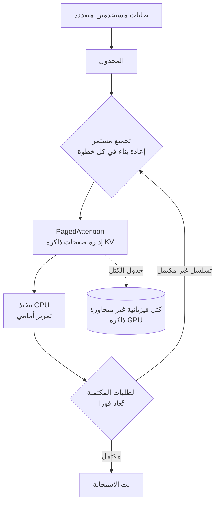

## نظرة عامة

أي فريق قام بنشر نموذج لغوي كبير في خدمة حقيقية يدرك سريعا حقيقة واحدة: ما يحدد سرعة استجابة الخدمة وتكلفتها ليس النموذج الذي اخترته، بل ما تستخدمه لتشغيله. على نفس بطاقة GPU، وبنفس النموذج، يمكن أن تختلف الإنتاجية في الثانية بعدة أضعاف حسب محرك الاستدلال المستخدم. واختلاف الإنتاجية بعدة أضعاف يعني اختلاف عدد وحدات GPU اللازمة لتحمل نفس حجم الحركة بعدة أضعاف أيضا، وهذا ينعكس مباشرة على حجم فاتورة البنية التحتية.

يتناول هذا المقال vLLM، الذي أصبح اليوم المعيار الفعلي لخدمة النماذج اللغوية الكبيرة في بيئة الإنتاج. سنستعرض بالترتيب المشكلة التي ظهر vLLM لحلها، وما تفعله فعليا تقنياته الأساسية PagedAttention والتجميع المستمر (continuous batching)، وما الذي يجب الانتباه إليه لتشغيله بثبات فوق Kubernetes. تدير ThakiCloud هذا المحرك في كل من البيئات المحلية (on-premise) والبيئات المُدارة لعملائها، لذا سنتجاوز الشرح النظري البسيط ونكتب هذا من منظور المشغّل الفعلي.

## ما هو vLLM

vLLM محرك استدلال مفتوح المصدر أطلقه باحثون من جامعة كاليفورنيا بيركلي عام 2023. الهدف بسيط وواضح: جعل استدلال النماذج اللغوية الكبيرة أسرع وأرخص. انتشر بسرعة بعد إطلاقه، وأصبح اليوم الخيار الافتراضي الذي يقوم عليه استدلال الإنتاج لدى منظمات عديدة مثل Meta وMistral وCohere وIBM.

ما يستهدفه vLLM هو نوعان من الهدر المختبئان في أساليب الاستدلال التقليدية. الأول هو تجزؤ الذاكرة (memory fragmentation)، والثاني هو وقت خمول GPU. لا يظهر أي منهما بوضوح على السطح، لكن مجتمعين يتركان جزءا كبيرا من GPU الباهظة الثمن في حالة خمول دون أي عمل. تستهدف التقنيتان الأساسيتان في vLLM، وهما PagedAttention والتجميع المستمر، كل واحدة نوعا من هذين النوعين من الهدر بشكل مباشر.

لنرسم أولا الهيكل العام.



## PagedAttention: القضاء على هدر الذاكرة

أثناء توليد النموذج اللغوي للرموز (tokens) واحدا تلو الآخر، يخزّن المفاتيح والقيم التي حسبها سابقا. يُسمى هذا ذاكرة KV المؤقتة (KV cache)، وكلما طالت الجملة، زاد حجم هذه الذاكرة المؤقتة في ذاكرة GPU. تكمن المشكلة في أن الأسلوب التقليدي يحجز لكل طلب مسبقا مقدارا من الذاكرة يعادل الطول الأقصى المتوقع، وذلك كقطعة كبيرة متجاورة. فإذا كانت الاستجابة الفعلية أقصر من ذلك، يُهدر جزء كبير من الذاكرة المحجوزة ببساطة. وعندما تصل طلبات متعددة في وقت واحد، يتراكم هذا الهدر، حتى تصل الحالة إلى أن GPU لديه ذاكرة فارغة لكنه لا يستطيع استقبال طلب جديد.

استعار PagedAttention فكرته مباشرة من طريقة أنظمة التشغيل في التعامل مع الذاكرة العشوائية (RAM)، أي الذاكرة الافتراضية والترقيم (paging). فبدلا من حجز ذاكرة KV المؤقتة كقطعة واحدة كبيرة، يقسّمها إلى صفحات صغيرة قابلة لإعادة الاستخدام. تُربط الكتل المنطقية لكل تسلسل، عبر جدول كتل (block table)، بكتل فيزيائية غير متجاورة داخل ذاكرة GPU. وبهذا لا يُخصَّص إلا العدد الفعلي اللازم من الصفحات، ما يقلل هدر الذاكرة بشكل كبير. وبحسب مصادر مشروع vLLM نفسه، يمكن لهذا الأسلوب أن يقلل هدر الذاكرة بنسبة تصل إلى 90 بالمئة.

وله أيضا فائدة جانبية كبيرة. ففي عمليات فك ترميز معقدة تتفرع من موجّه (prompt) واحد إلى مسارات متعددة، مثل أخذ العينات المتوازي (parallel sampling) أو بحث الحزمة (beam search)، لا يحتاج vLLM إلى تكرار ذاكرة KV المؤقتة الخاصة بالموجّه. يمكن لكتل منطقية متعددة أن تشير إلى نفس الكتلة الفيزيائية، ولا تُنشأ نسخة إلا عندما تحتاج إحداها إلى تعديل تلك الكتلة، وهو أسلوب النسخ عند الكتابة (copy-on-write). وبذلك تتمكن الطلبات التي تشترك في نفس السياق البادئ من التعايش مع توفير في الذاكرة.

## التجميع المستمر: إبقاء GPU مشغولا دائما

النوع الثاني من الهدر هو هدر الوقت. يجمّع التجميع الثابت التقليدي (static batching) الطلبات في دفعة (batch) ويعالجها معا، ولا يبدأ الدفعة التالية حتى تنتهي جميع الطلبات في الدفعة الحالية. تكمن المشكلة في أن عدد الرموز التي يولّدها كل طلب يختلف من طلب لآخر. فالطلب الذي ينتج إجابة قصيرة ينتهي مبكرا، لكنه يظل بحاجة إلى الانتظار حتى ينتهي أطول طلب في الدفعة. وخلال ذلك، يبقى مكان GPU الذي كان يشغله الطلب المنتهي خاملا.

يزيل التجميع المستمر هذا الانتظار. يتخذ المجدول قراراته على مستوى التكرار (iteration) وليس على مستوى الدفعة، أي في كل تمرير أمامي (forward pass). فبمجرد انتهاء أي طلب في تلك الخطوة، يُملأ مكانه فورا بطلب جديد من قائمة الانتظار. وبما أن الطلبات الجارية والطلبات الجديدة تُمزج ديناميكيا في كل خطوة، فإن GPU لا يخمل تقريبا أبدا. ويُذكر أن هذا الأسلوب يرفع الإنتاجية على نفس العتاد بمقدار 3 إلى 10 أضعاف.

عند تطبيق PagedAttention والتجميع المستمر معا، الملاحظة الشائعة هي أن الإنتاجية تتحسن بمقدار يتراوح تقريبا بين ضعفين وأربعة أضعاف مقارنة بتنفيذ ساذج للخدمة. تكمّل التقنيتان بعضهما البعض. فلكي يتمكن التجميع المستمر من إدراج طلب جديد في كل خطوة، يحتاج إلى مرونة مماثلة في ربط الذاكرة وفصلها، وهذه المرونة هي بالضبط ما يوفره PagedAttention.

> الأرقام أعلاه مأخوذة من مشروع vLLM ومصادر قياس أداء (benchmark) متعددة، والتحسن الفعلي يختلف باختلاف حجم النموذج، وتوزيع أطوال التسلسلات، والعتاد المستخدم. يجب قياس الأرقام الدقيقة الخاصة ببيئتك عبر حمل العمل الفعلي لديك.

## كيف يُستخدم في بيئة الإنتاج

بعد فهم المفاهيم، يصبح التشغيل الفعلي بسيطا بشكل مفاجئ. يوفر vLLM خادما متوافقا مع OpenAI بشكل افتراضي، لذا فإن الشيفرة التي كانت تستدعي واجهة برمجية خارجية غالبا ما تعمل دون تعديل بمجرد تغيير عنوان نقطة النهاية (endpoint) فقط.

أبسط شكل لتشغيل الخادم كالتالي.

```bash
# تثبيت vLLM (بيئة CUDA)
pip install vllm

# تشغيل خادم متوافق مع OpenAI
vllm serve meta-llama/Llama-3.1-8B-Instruct \
  --tensor-parallel-size 1 \
  --max-model-len 8192 \
  --gpu-memory-utilization 0.90
```

الاستدعاء يستخدم عميل OpenAI الحالي كما هو.

```python
from openai import OpenAI

client = OpenAI(base_url="http://localhost:8000/v1", api_key="EMPTY")
resp = client.chat.completions.create(
    model="meta-llama/Llama-3.1-8B-Instruct",
    messages=[{"role": "user", "content": "اشرح vLLM في جملة واحدة"}],
)
print(resp.choices[0].message.content)
```

النقطة التي تتطلب فعليا اهتماما في بيئة الإنتاج ليست أمر تشغيل الخادم نفسه، بل المعاملات التشغيلية المحيطة به. على وجه الخصوص، يجب الانتباه إلى التالي.

- `--gpu-memory-utilization`: نسبة ذاكرة GPU المخصصة لذاكرة KV المؤقتة. رفعها كثيرا يؤدي إلى تجاوز الذاكرة لحظيا، وخفضها كثيرا يقلل عدد الطلبات التي يمكن استقبالها في وقت واحد.
- `--tensor-parallel-size`: حجم التوازي على مستوى المصفوفات (tensor parallel) الذي يوزع النموذج على عدة وحدات GPU. ضروري عند خدمة نموذج كبير لا يتسع في GPU واحدة.
- `--max-model-len`: الطول الأقصى للسياق (context). كلما زاد هذا الرقم، كبرت ذاكرة KV المؤقتة لكل طلب، ما يخلق مفاضلة تقلل الإنتاجية المتزامنة.

عند التشغيل فوق Kubernetes، تُضاف إلى ذلك طبقة الجدولة وإدارة الموارد. GPU مورد باهظ الثمن ومحدود، لذا فبمجرد أن تشترك عدة فرق وعدة نماذج في عنقود (cluster) واحد، ينشأ تنافس على الموارد فورا. وهنا تأتي الحاجة إلى الجدولة الدفعية القائمة على قوائم الانتظار (queue-based batch scheduling). تضع ThakiCloud Kueue في هذه الطبقة لإدارة أي حمل عمل يشغل كم من GPU ومتى، كسياسة واضحة.

## الآثار المترتبة على منتجات ThakiCloud

منصة ai-platform الخاصة بـ ThakiCloud هي بنية تحتية لخدمات الذكاء الاصطناعي وتعلم الآلة كخدمة (SaaS) قائمة على Kubernetes، وتُعد خدمة النماذج في بيئات متنوعة لدى العملاء قدرتها الأساسية. يمثّل vLLM المحرك الافتراضي في طبقة الخدمة هذه. تنعكس مكاسب الإنتاجية التي يحققها PagedAttention والتجميع المستمر مباشرة على خفض تكلفة الخدمة، وهذا ما يمكّننا من تقديم تكلفة خدمة منخفضة لعملائنا.

وتزداد قيمة هذا المزيج بشكل خاص في البيئات المحلية (on-premise) والبيئات ذات السيادة (sovereign). فالعملاء الذين لا يمكنهم إخراج بياناتهم إلى الخارج مضطرون لتشغيل النماذج داخل بنيتهم التحتية الخاصة من GPU، وفي هذه الحالة، يصبح رفع الإنتاجية التي تتحملها كل بطاقة GPU إلى أقصى حد ممكن هو ما يحدد إمكانية التبني نفسها. فإذا استخدم محرك الاستدلال GPU بكفاءة أعلى بمقدار الضعف، فهذا يعني أن نفس الخدمة يمكن تشغيلها بنصف العتاد.

من الناحية التشغيلية، القيمة التي تضيفها ThakiCloud ليست المحرك نفسه، بل الهيكل المحيط به: إدارة قوائم انتظار GPU عبر Kueue، والعزل بين المستأجرين المتعددين (multi-tenant isolation)، والتوسع التلقائي والمراقبة (observability)، وطبقة السياسات التي تتيح لعدة نماذج التعايش بأمان في عنقود واحد. إذا كان vLLM مسؤولا عن كفاءة خادم واحد، فإن المنصة مسؤولة عن جعل عشرات من هذه الخوادم قابلة للمشاركة بثبات عبر المؤسسة بأكملها.

## القيود والحجج المضادة

vLLM ليس حلا سحريا شاملا. لديه بعض القيود الصادقة التي يجب ذكرها.

أولا، تتألق قوة vLLM في الإنتاجية، أي عند استقبال عدد كبير من الطلبات في وقت واحد. وعلى العكس، في حالات الحمل المنخفض حيث تصل الطلبات نادرا وواحدا تلو الآخر، لا تكون ميزة التجميع المستمر كبيرة، وقد يكون نهج آخر متخصص في تحسين زمن الاستجابة (latency) أفضل. يجب أولا فهم نمط حركة المرور الخاص بك، هل هو طلبات متزامنة بكميات كبيرة أم طلبات متفرقة أحادية.

ثانيا، الأرقام التي يقدمها PagedAttention والتجميع المستمر تعتمد بشدة على حمل العمل. ففي حالات أطوال التسلسل الطويلة جدا أو القصيرة جدا، أو على عتاد معين، قد لا تتكرر نسب التحسن المُبلَّغ عنها كما هي. يجب أن يستند قرار التبني إلى اختبار حمل فعلي يمثّل حمل العمل الخاص بك، ولا ينبغي افتراض أن المضاعف الذي أبلغ عنه طرف آخر سيكون هو نفسه لديك.

ثالثا، كلما تحسنت كفاءة المحرك، ينتقل عنق الزجاجة فعليا إلى مستوى أعلى، أي إلى الجدولة والتشغيل متعدد المستأجرين. مهما بلغت درجة تحسين خادم واحد، فإن مشكلة تنافس عدة فرق على GPU يجب حلها في طبقة المنصة وليس في طبقة المحرك. vLLM نقطة انطلاق ممتازة، لكنه ليس نقطة النهاية، والتحديات الحقيقية في بيئة الإنتاج تبدأ بعده مباشرة.

## المصادر

- [vLLM Explained: PagedAttention and Continuous Batching (RunPod)](https://www.runpod.io/articles/guides/vllm-pagedattention-continuous-batching)
- [LLM Serving Optimization: Continuous Batching, PagedAttention, and Chunked Prefill (Spheron)](https://www.spheron.network/blog/llm-serving-optimization-continuous-batching-paged-attention/)
- [vLLM Production Deployment (Introl)](https://introl.com/blog/vllm-production-deployment-inference-serving-architecture-guide)
- [vLLM: Deploying LLMs at Scale (LearnOpenCV)](https://learnopencv.com/vllm-deploy-llms-at-scale-paged-attention/)
