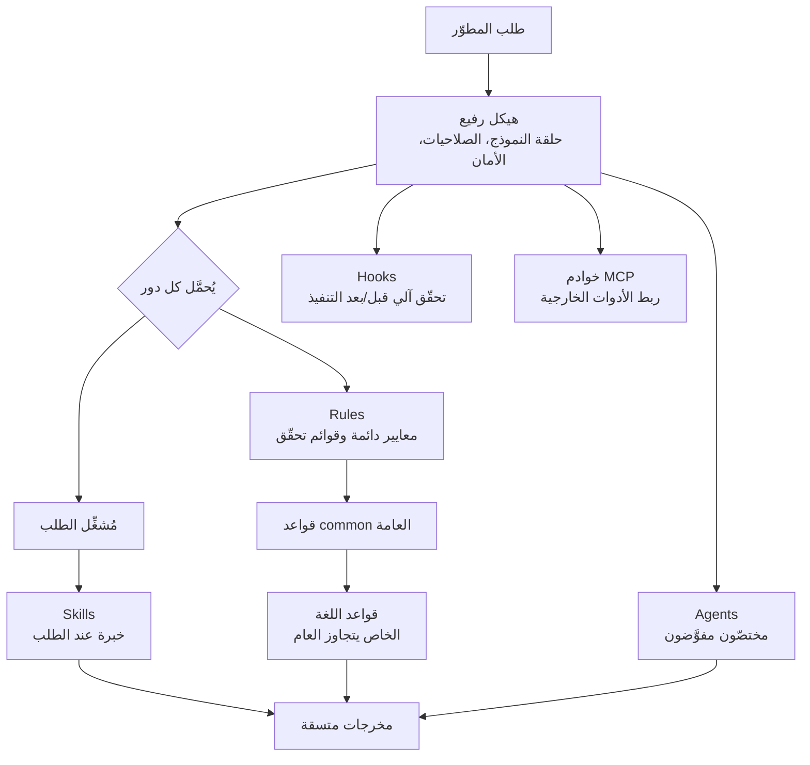

## نظرة عامة

أي مطوّر يستخدم أداة برمجة بالذكاء الاصطناعي بجدية لبضعة أيام يصطدم بالجدار نفسه. بالأمس أخبرتها بوضوح "هذا المشروع يُلتزَم به هكذا، لا تلمس ذلك المجلد، شغّل الاختبارات بهذا الأمر"، ومع ذلك اليوم، عند فتح جلسة جديدة، لا تتذكر الأداة أيًّا من ذلك. تلصق القواعد نفسها من جديد، وتتراجع عن الكود المخالف للأعراف من جديد. وكلما ازداد النموذج ذكاءً، ازدادت هذه الفجوة إحباطًا: القدرة موجودة، لكن لا يوجد هيكل يجعل تلك القدرة تطبّق قواعدك باتساق.

مستودع `everything-claude-code` هو مجموعة إعدادات مفتوحة المصدر تعالج هذا الهيكل تحديدًا. نشر أحد الفائزين بهاكاثون Anthropic كامل إعداداته بمستوى إنتاجي بعد أن صقلها أكثر من ستة أشهر على مشروع خدمة TypeScript مصغّرة حقيقي، وجمع المستودع نجومًا بسرعة بعد الإصدار (نحو 9,700 بحسب التغريدة المصدر، [تقديري]). يستعرض هذا المقال ما يحتويه المستودع، والمبادئ التصميمية التي يقوم عليها، وكيف تتصل تلك المبادئ بمنصة الوكلاء التي تبنيها ThakiCloud. وقد تبنّت ThakiCloud مجموعة قواعد هذا المستودع كمعيار داخلي فعلي، لذا فهذا رأي قائم على التجربة لا مجرد تعريف.

## ما هو everything-claude-code

يعرّف `everything-claude-code` (اختصارًا ECC) نفسه بأنه "نظام تحسين أداء هيكل الوكيل". وهو يجمّع ستة أنواع من أصول الإعداد: وكلاء فرعيون يعالجون المهام المفوّضة (agents)، وحزم معرفة متخصصة تُستدعى عند الطلب (skills)، وخطّافات تتدخّل تلقائيًا قبل تنفيذ الأدوات وبعده (hooks)، وأوامر مائلة تغلّف الأعمال المتكررة (commands)، وقواعد تُطبَّق دائمًا (rules)، وإعدادات خوادم MCP التي تربط الأدوات الخارجية (MCPs).

والأهم أن هذا ليس إعداد مشروع هواية. فقد فاز المؤلف بهاكاثون Anthropic x Forum Ventures في سبتمبر 2025 ببناء منتج باستخدام Claude Code وحده، ثم صقل هذا الإعداد أكثر من عشرة أشهر وهو يشحن منتجات حقيقية يوميًا. ومؤشرات الجودة التي يذكرها المستودع محدّدة: 1,282 اختبارًا، وتغطية 98٪، و102 قاعدة تحليل ساكن. إن كون مجموعة إعدادات تحمل هذا المستوى من الانضباط هو بذاته دليل على أن المؤلف يفصل بين "قواعد تُسلَّم للذكاء الاصطناعي" و"كود يتحقق من الالتزام بتلك القواعد".

سمة أخرى هي حياد الهيكل. صُمِّم ECC ليعمل ليس فقط في Claude Code بل أيضًا في وكلاء برمجة آخرين مثل Codex وOpencode وCursor. وفكرة إعادة استخدام القواعد والمهارات نفسها عبر أدوات متعددة هي نتيجة طبيعية لفلسفة التصميم التي نناقشها أدناه.

## البنية: هيكل رفيع، مهارات ثقيلة

قلب ECC مبدأ واحد: **ابنِ القدرة في المهارات لا في الهيكل.** فالهيكل نفسه، أي الهيكل التنفيذي لحلقة النموذج والوصول إلى الملفات والصلاحيات والأمان، يبقى في حدّه الأدنى، بينما تُكدَّس المعرفة المجالية ومعايير الحكم والقوالب وحالات الفشل بكثافة في المهارات والقواعد. هذا ما يتيح للمهارة نفسها أن تعمل عبر أكثر من هيكل، سواء Claude Code أو Cursor.

تقود هذه الفلسفة مباشرة إلى تمييزين عمليين. الأول هو الفصل بين أدوار القواعد (Rules) والمهارات (Skills). القواعد معايير وقوائم تحقّق واسعة تُطبَّق دائمًا، مثل "تغطية اختبار 80٪ أو أعلى" أو "لا أسرار مكتوبة في الكود". وهي تُحمَّل كل دور. أما المهارات فمعرفة تنفيذية مطلوبة بعمق لمهمة محدّدة، تُحمَّل فقط حين يستدعيها الطلب. القواعد تحدّد *ماذا* تفعل، والمهارات تخبرك *كيف*.

الثاني هو أن القواعد نفسها تُكدَّس في طبقات. يحتوي مجلد `common/` على المبادئ العامة المستقلّة عن اللغة (أسلوب البرمجة، سير عمل git، الاختبار، الأمان، وغيرها)، وفوقه تمدّد المجلدات الخاصة باللغة مثل `typescript/` و`python/` و`golang/` و`web/` القواعدَ العامة أو تتجاوزها. تعمل الأولوية مثل خصوصية CSS أو قواعد `.gitignore`: القاعدة الأكثر تحديدًا تتغلب على الأكثر عمومية. مثلًا توصي القواعد العامة بعدم القابلية للتغيير كمبدأ افتراضي، لكن قواعد Go الخاصة باللغة تنصّ على أن تعديل البنية عبر مستقبِلات المؤشرات أمر اصطلاحي، فتتجاوز تلك النقطة وحدها.

تبدو البنية الكاملة على النحو التالي.



يبدأ اتضاح كيف تحلّ هذه البنية مشكلة "نسيان القواعد كل مرة" السابقة. فالقواعد تُحمَّل تلقائيًا كل جلسة، فلا يحتاج المطوّرون إلى إعادة لصق الأعراف. والمهارات تُحمَّل فقط عند الحاجة، فلا تهدر نافذة السياق. والخطّافات تتحقق على مستوى الكود مما إذا كانت أداة قد خالفت قاعدة. بعبارة أخرى، فحوصات حتمية تفرض الجودة بدل الاعتماد على تقرير النموذج الذاتي.

## كيف تتبنّاه فعليًا

هناك مساران للتبنّي. الأسهل هو تثبيته عبر سوق إضافات Claude Code. والأكثر مباشرة هو استنساخ المستودع ونسخ الأصول التي تحتاجها فقط إلى مجلد إعداد Claude لديك. ولتجنّب كسر البنية الطبقية، انسخ على مستوى المجلد.

```bash
# أنشئ مساحة أسماء قواعد ECC مرة واحدة.
mkdir -p ~/.claude/rules/ecc

# انسخ القواعد العامة (مطلوبة لكل المشاريع).
cp -r rules/common ~/.claude/rules/ecc/

# انسخ القواعد الخاصة باللغة المطابقة لحزمة مشروعك.
cp -r rules/typescript ~/.claude/rules/ecc/
cp -r rules/golang ~/.claude/rules/ecc/
cp -r rules/web ~/.claude/rules/ecc/
```

هنا يحذّر المستودع صراحةً من خطأ شائع. لا تنسخ بالتسطيح عبر نمط بدل مثل `rules/common/*`. فالمجلدات العامة والخاصة باللغة تحتوي على ملفات بالأسماء نفسها (`coding-style.md` و`testing.md` وغيرهما)، فالتسطيح يجعل ملف اللغة يكتب فوق الملف العام ويكسر المرجع النسبي (`../common/`). وللحفاظ على التسلسل الهرمي، يجب نسخ المجلدات كاملة.

تحتاج إعدادات خادم MCP إلى معالجة منفصلة. اسحب فقط إعدادات الخوادم التي تحتاجها من `mcp-configs`، لكن النقطة الأساسية هي **عدم تفعيلها كلها دفعة واحدة**. يحذّر المستودع بقوة هنا، لأن كثرة الأدوات المرتبطة قد تقلّص نافذة سياق سعتها 200k إلى 70k فعليًا. فكل خادم MCP مفعَّل يدفع كلفة مخطّط كل دور، لذا تحتاج إلى انضباط تفعيل الخوادم التي تستخدمها فعلًا فقط.

الخطّافات هي جوهر الأتمتة التي يؤكّد عليها المستودع. مثلًا اربط خطّافًا يشغّل منسّق التنسيق بعد تحرير الملفات، وخطّافًا يفحص حجم الملف قبل الالتزام، وخطّافًا يتحقق من بناء الإنتاج عند انتهاء الجلسة بنقاط دخول أدوات مشروعك الحالية. أما الخطّافات التي تشغّل حِزَمًا بعيدة لمرة واحدة فيُنصح بتجنّبها؛ واستخدام اعتماديات محلية يملكها المستودع هو الأسلوب الموصى به.

## دلالات التطبيق على منتجات ThakiCloud

تتداخل المبادئ التصميمية التي يطرحها ECC بشكل لافت مع ما تبنيه ThakiCloud. دعوني أقسّم ذلك إلى عدستين.

**عدسة Paxis (منصة الوكلاء).** إن Paxis من ThakiCloud هو مستوى تحكّم Agent-Native Cloud يعمل فوق ai-platform، ويتعامل مع Skills وTools وPolicies وAudit Logs بوصفها موارد من الدرجة الأولى. وفلسفة ECC "هيكل رفيع، مهارات ثقيلة" هي بالضبط النموذج الذي يحوّله Paxis إلى منتج. فـ Skill Harness في Paxis يختار من أكثر من 960 مهارة عبر BM25، وينفّذها في صناديق رمل معزولة، ويمرّر كل فعل عبر بوابات السياسات وسجلات التدقيق. بعبارة أخرى، طبقات القواعد والمهارات والخطّافات التي يديرها ECC يدويًا في مجلد `~/.claude` لمطوّر فرد، يرفعها Paxis إلى مستوى سحابة متعددة المستأجرين من الاختيار التلقائي والتنفيذ المعزول وفرض السياسات والتدقيق. ويمكن اعتبار Paxis الصورة التشغيلية بحجم المنصّة للمبادئ التي تحقّق منها ECC في سير عمل فردي. ورؤية ECC بأن "القواعد تُحمَّل كل دور وتدفع إيجارًا" تنتقل مباشرة إلى تصميم Paxis القائم على تحميل المهارات عند الطلب فقط وترشيح الضجيج عبر BM25.

**عدسة ai-platform (البنية التحتية).** تنطبق فكرة القواعد الطبقية أيضًا على توحيد البنية التحتية. فكما يفصل ECC بين القواعد العامة وقواعد اللغة، تفصل ai-platform من ThakiCloud بين الإعدادات الافتراضية على مستوى المؤسسة والتجاوزات لكل عنقود ولكل مستأجر. إن تعريف معايير البنية مثل K8s وجدولة Kueue GPU وخدمة vLLM مرة واحدة وتطبيقها باتساق عبر بيئات عملاء متعددة، مع تجاوز خصوصيات كل بيئة في الطبقات الأدنى، هو الشكل نفسه لنموذج أولوية القواعد في ECC. وكلما اشتدّت متطلبات العميل المتعلقة بالتشغيل داخل المؤسسة والسيادة، ازداد تحوّل انضباط "افرض معيارًا عُرّف مرة، مع تجاوزه بأمان لكل بيئة" إلى موثوقية تشغيلية.

باختصار، ECC هو خلاصة نظافة الهيكل المصنوعة يدويًا من قِبل فرد، وThakiCloud تبني منتجات تحافظ فيها المنصّة على تلك النظافة تلقائيًا. الخدمة منخفضة الكلفة (ai-platform) تصنع اقتصاديات الوكلاء، وفوقها يصنع تنفيذ المهارات بسياسة وتدقيق (Paxis) الثقة.

## الحدود والاعتراضات

من أجل التوازن، دعوني أذكر الجانب الآخر. أولًا، ECC إعداد يعكس بقوة ذوق شخص واحد وسير عمله. فهو نتيجة صقل خدمة TypeScript مصغّرة معيّنة ستة أشهر، لذا فإن نسخه كما هو إلى حزمة مختلفة أو ثقافة فريق مختلفة قد يخلق احتكاكًا بدلًا من ذلك. ولهذا يحذّر المستودع مرارًا من النسخ واللصق كما هو، بل التكييف مع احتياجات مشروعك.

ثانيًا، كلما ازداد الإعداد سماكة، ارتفعت كلفة الصيانة. فتحميل القواعد كل دور يعني استهلاك الرموز كل دور. وبينما تضيف قواعد ومهارات، عليك أن تسأل باستمرار "هل يحتاج هذا فعلًا إلى الوجود في كل جلسة؟"، وإلا تسرّبت ميزانية السياق بهدوء. ويعالج ECC نفسه ذلك بانضباط "كل سطر يجب أن يدفع إيجارًا"، لكن الحفاظ على الانضباط في النهاية مهمة بشرية.

ثالثًا، حياد الهيكل مثالٌ لا ضمان. فالوعد بأن المهارة نفسها تعمل بشكل مطابق في Claude Code وCursor لا يصحّ إلا حين يكون سطح الأدوات ونموذج الصلاحيات في كل هيكل متوافقين فعلًا. فإن اختلفت طريقة تنفيذ الخطّافات أو قواعد الوصول إلى الملفات بين الهياكل، فقد تنحرف مهارة مكتوبة بحياد على هيكل معيّن بهدوء.

ومع ذلك، قيمة ECC واضحة. فمشكلات الجودة في أدوات البرمجة بالذكاء الاصطناعي تنشأ عادةً لا لأن النموذج ضعيف، بل لأنه لا يوجد هيكل قواعد وتحقّق يلفّ النموذج. وقد نشر ECC ذلك الهيكل في صورة مجرَّبة ميدانيًا، وThakiCloud على طريق رفع المبادئ نفسها إلى حجم المنصّة. ولأي فريق يسعى إلى تسليم الكود للذكاء الاصطناعي، تستحق رسالة هذا المستودع، "افحص الهيكل قبل أن تبدّل النموذج"، أن تبقى في البال.

## المصادر

- everything-claude-code (affaan-m/everything-claude-code)، GitHub
- ملف المؤلف المتعلق بـ zenith.chat، الفائز بهاكاثون Anthropic x Forum Ventures
- التغريدة الأصلية: ‎@Ryrenz (RT @hjguyhan)، 2026-07-20
