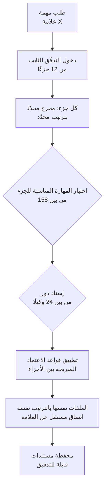

## نظرة عامة

كل من بنى نظام وكلاء جادًّا يصطدم بالمفارقة نفسها. إضافة مزيد من المهارات والوكلاء يبدو أنه سيجعل النظام أذكى، لكنه غالبًا يفعل العكس. فبمجرد تجاوز بضع عشرات من المهارات، يبدأ الوكيل بالحيرة حول أي مهارة يستخدم ومتى، وبمجرد وجود عدة وكلاء، يعالجون المهمة نفسها بطرق مختلفة أو ينحرف ترتيب وصيغة المخرجات في كل تشغيل. ترتفع القدرة بينما تنخفض اتساقية النتائج.

يُعدّ المكوّن الإضافي مفتوح المصدر **Digital Marketing Pro** حالة مثيرة تتصدى لهذه المفارقة مباشرة. فهو يجمع بين 158 مهارة و24 وكيلًا متخصصًا (وثائق المستودع تذكر 25، والتغريدة الأصلية قالت 24) ويحافظ مع ذلك على اتساق إنتاج الملفات نفسها بالترتيب نفسه في كل مرة. السر ليس نموذجًا أذكى بل تدفّق استراتيجية مثبّت في 12 جزءًا، أي هيكل حتمي. يحلّل هذا المقال ليس أداة التسويق نفسها بل تصميم هندسة الوكلاء بداخلها. ما البنية التي تصمد حتى حين تنفجر المهارات عددًا، وكيف يتصل ذلك المبدأ بمنصة الوكلاء التي تبنيها ThakiCloud.

سبب أهمية هذه الحالة للمطوّرين واضح. فهي تُظهر، بشيفرة مفتوحة المصدر ملموسة، لماذا يفشل الأمل الساذج بأن "أنشئ الكثير من المهارات" كثيرًا في الممارسة، وما الذي يوقف ذلك الفشل.

## ما هو هذا المكوّن الإضافي

Digital Marketing Pro مكوّن إضافي تسويقي مفتوح المصدر صادر برخصة MIT. غرضه الظاهري مساعدة الوكالات والفرق التسويقية الداخلية على إنتاج مستندات تسويقية باتساق عبر علامات تجارية عديدة. ووفقًا لوصف المستودع، يستهدف الوكالات التي تتعامل مع ما بين 50 و200 علامة تجارية للعملاء، مُمرّرًا كل علامة عبر التدفّق نفسه المكوّن من 12 جزءًا لإنتاج الملفات نفسها بالترتيب نفسه.

من حيث الأرقام، المكوّن كبير نسبيًا. لديه 158 مهارة و24 وكيلًا متخصصًا، وتدفّق استراتيجية من 12 جزءًا مُوسّع إلى 61 خطوة تفصيلية. وفوق ذلك يقع الاستعداد للمادة 50 من قانون الذكاء الاصطناعي الأوروبي، وميزات AEO/GEO (تحسين محرّكات الإجابة) لست منصّات بما فيها Google AI Mode، ودعم Cowork الذي يحفظ الحالة على مستوى الفريق.

ما يستحق الملاحظة هو هدف التثبيت. فالمكوّن ليس مقيّدًا بـ Claude Code وحده؛ إنه يُثبَّت عبر عدة أوقات تشغيل للوكلاء منها Cowork وCodex وCursor وCopilot CLI وAntigravity. بعبارة أخرى، صُمّمت حزمة واحدة من المهارات والوكلاء لتعمل عبر عدة أطر (harnesses). وهذا قرار تصميمي مهم بما يكفي لتناوله على حدة أدناه.

باختصار، تحت مظهر "أداة تسويق"، يحمل هذا المكوّن إجابة واحدة عن كيفية تنظيم حزمة كبيرة من المهارات والوكلاء وتنفيذها باتساق.

## هيكل حتمي يروّض انفجار المهارات

الفكرة الجوهرية لهذا المكوّن أنه لا يترك المهارات الـ158 والوكلاء الـ24 يتعاونون بحرية. بل يُجبر كل مهمة على المرور عبر تدفّق استراتيجية مثبّت في 12 جزءًا. ينتج كل جزء مخرجًا محدّدًا بترتيب محدّد، وهناك قواعد اعتماد صريحة بين الأجزاء. لا يُشغّل جزء لاحق إلا حين تكون نتيجة الجزء السابق موجودة، وتبقى أسماء ملفات النتائج وترتيبها متطابقة حتى مع تغيّر العلامة التجارية.

تتضح أهمية ذلك إذا تخيّلت العكس. لو اختار 24 وكيلًا بحرية المهارة التي "تبدو الأفضل" وشغّلوا بترتيب حر، لاختلف تكوين وصيغة المخرجات بين علامة وأخرى. قد تحصل علامة على تحليل المنافسين أولًا، وقد تتخطّى أخرى تلك الخطوة كليًا. وإذا كانت الوكالة تدير 200 عميل، يصبح هذا التباين سريعًا فوضى غير قابلة للتدقيق. يقلّل التدفّق المكوّن من 12 جزءًا هذه الحرية عمدًا لرفع متوسط الجودة والاتساق.

يوضّح المخطط أدناه بشكل مبسّط كيف يقيّد هذا الهيكل الحتمي حرية المهارات والوكلاء.

الدرس هنا لا علاقة له بالتسويق. طريقة حماية الجودة مع نمو المهارات والوكلاء ليست جعل النموذج أذكى بل تخفيض التصميم الحر إلى ملء هيكل مُتحقّق منه. يمتلك هيكل حتمي الصيغة والترتيب والاعتماديات، بينما يملأ النموذج المحتوى داخل ذلك الهيكل فقط. سواء كانت 158 مهارة أو 500، فما دام الهيكل يمسك درجات الحرية، تبقى النتيجة قابلة للتنبّؤ.

## ماذا يعني التثبيت عبر ست أوقات تشغيل

تصميم آخر يستحق الملاحظة هو أن هذا المكوّن يُثبَّت عبر عدة أوقات تشغيل للوكلاء. Claude Code وCursor وCodex وCopilot CLI كلٌّ منها إطار مختلف. مُطالبات النظام لديها مختلفة، وأساليب تعريف الأدوات مختلفة، ونماذج الأذونات مختلفة. وأن تُصمَّم حزمة المهارات والوكلاء نفسها لتعمل فوقها جميعًا يعني أن القدرة تراكمت في المهارات، لا في الإطار.

هذا التمييز مهم عمليًا. لو كانت معرفة سير عمل تسويقي محشوّة في ملفات إعداد أداة معيّنة أو مُطالبة نظامها، لعنى تبديل الأداة إعادة بناء كل شيء. وبالعكس، حين تعيش المعرفة في حزمة مهارات قابلة للنقل، يبقى الإطار رفيعًا وتُعاد المهارات عبر الأدوات. تثبيت Digital Marketing Pro عبر أوقات التشغيل ممارسة لمبدأ "إطار رفيع، مهارات سميكة" على نطاق تجاري.

بالطبع لدعم عدة أوقات تشغيل في آن تكلفة. فلأن كل وقت تشغيل يحمّل المهارات ويستدعيها بطريقة مختلفة قليلًا، قد يترك التصميم على القاسم المشترك ميزات فريدة لوقت تشغيل معيّن غير مستغلّة. ومع ذلك، إعطاء الأولوية لقابلية النقل توجّه معقول يحرّر أصول المهارات من الارتباط بأداة ويجعلها تصمد أطول.

## الأثر على منتجات ThakiCloud

ما يجعل هذه الحالة مثيرة أنها تعالج مشكلة تشبه بشكل لافت ما تبنيه ThakiCloud بـ**Paxis**. Paxis هي السحابة الأصلية للوكلاء من ThakiCloud، وتتعامل مع المهارات والأدوات والسياسات وسجلات التدقيق كموارد من الدرجة الأولى. يختار مسخّر المهارات المهارة المناسبة من بين أكثر من 960 مهارة عبر BM25، ويشغّلها في صندوق رمل معزول، ويمرّر كل إجراء عبر بوابات السياسة وسجلات التدقيق.

المشكلة نفسها التي حلّها Digital Marketing Pro بترويض 158 مهارة عبر تدفّق من 12 جزءًا، تحلّها Paxis على نطاق أكبر. فبمجرد تجاوز المهارات 960، يصل سؤال "أي مهارة ومتى" إلى نطاق لا يستطيع إنسان تحديده يدويًا، فيحلّ اختيار المهارات المعتمد على BM25 محلّ ذلك الهيكل. فبدلًا من استدعاء أي مهارة بحرية، تُطرح فقط المهارات الأوثق صلة بالطلب كمرشّحين، ما يقلّل درجات الحرية. هذا المبدأ نفسه الذي منع به التدفّق من 12 جزءًا الترتيب الحر، لكن بدل تدفّق ثابت يتحكم في الحرية عبر اختيار قائم على الاسترجاع.

كذلك، تأكيد المكوّن على الاستعداد للمادة 50 من قانون الذكاء الاصطناعي الأوروبي وإنتاج مستندات قابلة للتدقيق يتوافق مع تعامل Paxis مع سجلات التدقيق وبوابات السياسة كموارد من الدرجة الأولى. ففي بيئات العملاء حيث تهمّ التنظيمات والتدقيق، يجب أن تكون قادرًا على تتبّع "ما الذي أُنتج، وبأي ترتيب، وعلى أي أساس." التدفّق الحتمي وسجلات التدقيق هما المحوران اللذان يصنعان هذه القابلية للتتبّع، وتوفّرهما Paxis على مستوى المنصة. فمهما كدّست من مهارات، ولأن بوابات السياسة وسجلات التدقيق تسجّل كل إجراء، يمكن تشغيل أصل مهارات كبير بأمان حتى في بيئات منظّمة.

أخيرًا، قابلية النقل عبر أوقات التشغيل تتوافق مع الاتجاه الذي تسعى إليه ThakiCloud. فتصميم يعيد استخدام أصل مهارات عبر الأطر بدل ربطه بأداة معيّنة هو السبب نفسه لتعامل Paxis مع المهارات كموارد من الدرجة الأولى. حين تتراكم القدرة في المهارات لا في الإطار، تبقى الأصول التي بنيتها حتى مع تغيّر الأداة.

## القيود والاعتراضات

من المهم عدم المبالغة في قراءة هذه الحالة. التدفّق الثابت من 12 جزءًا يضحّي بالمرونة مقابل الاتساق. فالحاجة الاستثنائية التي تخرج عن التدفّق القياسي، مثل مهمة غير مهيكلة مطلوبة لعلامة معيّنة فقط، قد تُعالج بشكل محرج داخل هذا الهيكل أو لا تُعالج أصلًا. الهيكل الحتمي قوي للعمل المجمّع القابل للتكرار، لكنه يصبح قيدًا للعمل ذي الاستثناءات الإبداعية الكثيرة.

رقم 158 مهارة نفسه يستحق قراءة متأنّية. فكثرة المهارات تعني كثرة أهداف الصيانة، وما إذا كانت كل مهارة متحقَّقًا منها فعلًا ومُحدّثة مسألة منفصلة. الرقم لا يضمن الجودة. وكم عدد المهارات الأساسية التي يستدعيها التدفّق فعلًا، وكم مرة تُستخدم البقية، أمر يصعب تأكيده من وثائق المستودع وحدها [تقدير].

كذلك، يحلّل هذا المقال مبادئ تصميم المكوّن، لا الجودة الفعلية لمخرجاته التسويقية. فإنتاج تدفّق حتمي لمستندات متسقة مسألة مختلفة عمّا إذا كانت تلك المستندات تؤدّي إلى نتائج تسويقية حقيقية. ما نأخذه من هذه الحالة ليس النتيجة التسويقية بل النمط الهندسي في ترويض حزمة كبيرة من المهارات والوكلاء بهيكل حتمي.

## المصادر

- المستودع: [github.com/indranilbanerjee/digital-marketing-pro](https://github.com/indranilbanerjee/digital-marketing-pro)
- المصدر الأصلي: [تغريدة @tom_doerr](https://x.com/hjguyhan/status/2079315207579660557)
