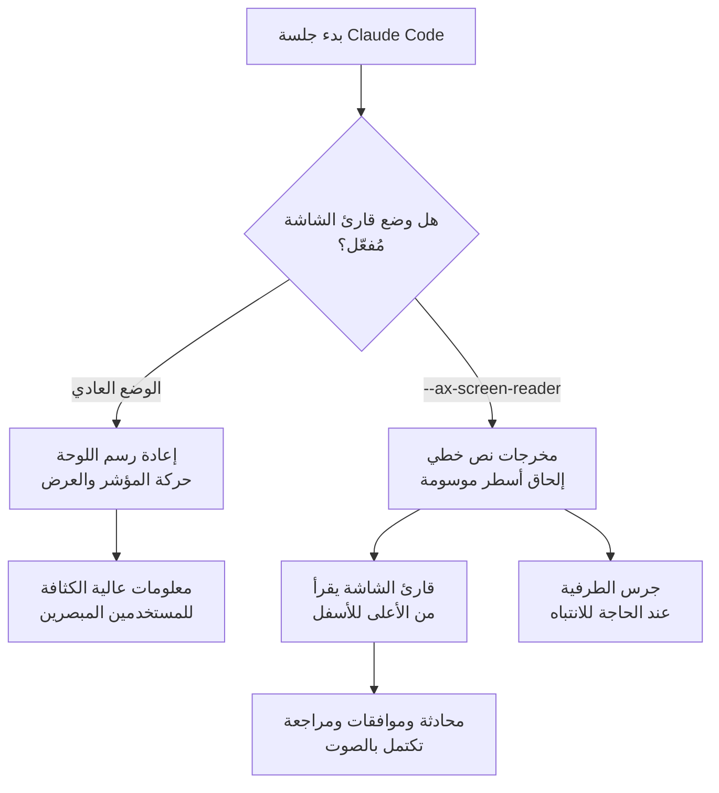

## نظرة عامة

تطورت أدوات البرمجة الطرفية المعتمدة على الذكاء الاصطناعي في معظمها نحو ملء الشاشة بشكل جميل: مؤشرات دوران حية، فروقات ملوّنة، نوافذ أذونات محاطة بإطارات، ومؤشرات تقدّم تُعاد رسمتها مع تحرك المؤشر. بالنسبة للمستخدمين المبصرين، تُعدّ هذه الكثافة البصرية ميزة. أما بالنسبة للمطوّر الذي يقرأ الطرفية بقارئ شاشة بدلًا من عينيه فإنها تعمل بالعكس. الشاشة التي تُعاد رسمتها باستمرار تجعل من الصعب على قارئ الشاشة أن يقرر ما هو الجديد فعلًا، وتُقرأ الإطارات والحركات كضجيج بلا ترتيب.

يتصدى Claude Code الآن لهذه المشكلة مباشرة بوضع قارئ شاشة. سطر واحد، `claude --ax-screen-reader`، يحوّل واجهة الطرفية البصرية إلى نص خطي بسيط. فبدلًا من العرض المزخرف، يطبع أسطرًا موسومة بالترتيب حتى تستطيع قارئات الشاشة مثل VoiceOver وNVDA وJAWS القراءة من الأعلى إلى الأسفل بشكل طبيعي. يستعرض هذا المقال بالضبط ما يغيّره الوضع، وكيف يعمل، ولماذا تُعدّ إمكانية الوصول لواجهات الوكلاء مشكلة يجب أن تتبنّاها منظومة التطوير بأكملها الآن.

يبدو الأمر علمًا صغيرًا، لكن التغيير يوسّع الإجابة عن سؤال حقيقي: من يستطيع فعلًا استخدام وكيل ذكاء اصطناعي طرفي؟ إنه موضوع تصطدم به ThakiCloud باستمرار أثناء بناء سحابة أصلية للوكلاء، لذا نتناوله ليس كملاحظة عن ميزة فحسب، بل من منظور تصميم الواجهة.

## ما هو وضع قارئ الشاشة

تتعامل جلسة Claude Code العادية مع الطرفية كأنها لوحة رسم. تحرّك المؤشر، وتمسح الأسطر التي طبعتها بالفعل وتعيد رسمها، وتُظهر التقدّم كحركة حية. هذا مثالي لمن يمسح الشاشة بعينيه، لكنه أسوأ مُدخل ممكن لقارئ الشاشة. على قارئ الشاشة أن يقرر ما يقرأه في كل مرة تتغير فيها ذاكرة العرض، وحين تُعاد رسم الشاشة في كل إطار فإنه يميل إلى تكرار المحتوى نفسه أو إغفال المخرجات الجديدة المهمة تمامًا.

يغيّر وضع قارئ الشاشة نموذج العرض نفسه. فبدلًا من إعادة رسم الشاشة، يلحق المعلومات الجديدة كأسطر مفردة موسومة بالترتيب. عند تشغيل أداة مثلًا، تأتي علامات صريحة مثل طلب إذن، وإشعار بتشغيل الأداة، ونتيجة، كنص. يقرأ قارئ الشاشة هذا النص الخطي من الأعلى إلى الأسفل، فتكتمل متابعة المحادثة كاملة والموافقة على أذونات الأدوات ومراجعة المخرجات بالصوت وحده.

يوضّح المخطط أدناه بشكل مبسّط كيف يتفرّع مساران للعرض.



الفكرة ليست "إعطاء معلومات أقل" بل "إعطاء المعلومات نفسها كنص مرتّب." فبدلًا من تجريد المعنى، يزيل الزخرفة البصرية ويوفّر تدفّق مخرجات رتيبًا ومتوقّعًا يمكن لقارئ الشاشة الوثوق به.

## كيفية التفعيل وطريقة العمل

هناك طريقتان لتشغيل وضع قارئ الشاشة. لتفعيله لجلسة واحدة، مرّر العلم عند الإطلاق.

```bash
claude --ax-screen-reader
```

هذا العلم موجود فعلًا في Claude Code المثبّت. يُظهره فحص مخرجات المساعدة:

```bash
$ claude --help | grep ax-screen
  --ax-screen-reader                    Render screen-reader friendly output
```

لتطبيقه افتراضيًا على كل جلسة تُبدأ من الصدفة، اضبط متغيّر البيئة.

```bash
export CLAUDE_AX_SCREEN_READER=1
```

الآن تستخدم أي جلسة Claude Code تُفتح في تلك الصدفة مخرجات ملائمة لقارئ الشاشة دون علم منفصل. وفقًا للوثائق الرسمية، يعمل هذا الوضع على Claude Code الإصدار v2.1.181 وما بعده، وترفض الإصدارات الأقدم العلم `--ax-screen-reader` بخطأ.

هناك تفاصيل سلوكية مدروسة أيضًا. في وضع قارئ الشاشة، يقرع Claude Code جرس الطرفية عندما يحتاج انتباه المستخدم. وبالتحديد، يُقرع الجرس عند انتهاء أداة استغرقت أكثر من خمس ثوانٍ، للإشارة إلى انتهاء مهمة طويلة دون الحاجة للنظر إلى الشاشة. لا يستطيع مستخدم قارئ الشاشة التأكد بصريًا من وصول نتيجة بعد إطلاق أمر، لذا تُنشئ هذه الإشارة الصوتية إيقاعًا للتفاعل.

هناك إعداد منفصل للمستخدمين ضعاف البصر الذين يعتمدون على مكبّر شاشة.

```bash
export CLAUDE_CODE_ACCESSIBILITY=1
```

ضبط هذا يُبقي مؤشر الطرفية الأصلي ظاهرًا. تكبّر مكبّرات الشاشة مثل Zoom في macOS الشاشة باتباع موضع المؤشر، فإذا أخفت أداة المؤشر فقد المكبّر تركيزه. يكشف هذا الإعداد عن المؤشر ليتمكّن المكبّر من تتبّع موضع المستخدم بدقة.

إذًا ينقسم دعم إمكانية الوصول إلى ثلاثة مسارات: مخرجات نص خطي لقارئات الشاشة، وجرس طرفية للانتباه، وإبقاء المؤشر ظاهرًا للمكبّرات. يستهدف كل منها تقنية مساعِدة مختلفة ويمكن تفعيله بشكل مستقل عبر متغيّرات البيئة.

## لماذا يهمّ الآن

السبب الأول لأهمية هذه الميزة هو أن وكلاء الذكاء الاصطناعي الطرفيين يصبحون بسرعة أداة أساسية للمطوّرين. تحدث قراءة الشيفرة وإصلاحها وتشغيل الأوامر ومراجعة النتائج داخل هذه الأدوات بشكل متزايد. إذا غابت إمكانية الوصول عن هذا التدفق، فلن يتمكن المطوّرون المكفوفون أو ضعاف البصر من استخدام أدوات الإنتاجية نفسها التي يستخدمها زملاؤهم. مهما كانت الأداة قادرة، فإن ضيق باب الوصول إلى تلك القدرة يجعلها بالنسبة لبعض المطوّرين وكأنها غير موجودة.

السبب الثاني هو أن هذه الميزة انطلقت من طلب المجتمع. رُفعت في المستودع العام قضايا تطلب دعم NVDA وJAWS، وتحوّل ذلك الطلب إلى إصدار فعلي. غالبًا ما تُؤجَّل ميزات إمكانية الوصول إلى "لاحقًا"، لذا فإن حالة رفع طلب مستخدم للأولوية مرجع جيد. إمكانية الوصول ليست حاجة خاصة لفئة ضيقة؛ إنها محور تصميمي يحدّد نطاق الأشخاص الذين يمكنهم استخدام الأداة.

السبب الثالث أن هذا النهج يؤكد حقيقة قديمة: النص الخطي واجهة متينة. فتدفّق النص المرتّب والموسوم والمتوقّع ليس جيدًا لقارئات الشاشة فحسب. إنه سهل التسجيل، وسهل التمرير عبر الأنابيب، وسهل التحليل للأتمتة. ليس من قبيل الصدفة أن يكون وضع مخرجات بُني لإمكانية الوصول مواتيًا أيضًا للبرمجة النصية والتدقيق.

## الأثر على منتجات ThakiCloud

تُشغّل ThakiCloud سحابة أصلية للوكلاء تُسمى **Paxis**. تتعامل Paxis مع المهارات والأدوات والسياسات وسجلات التدقيق كموارد من الدرجة الأولى: يختار مسخّر المهارات المهارة المناسبة من بين العديد ويشغّلها في صندوق رمل معزول، ممرّرًا كل إجراء عبر بوابات السياسة وسجلات التدقيق. وكلما اتسع السطح الذي يتفاعل فيه الوكيل مع الناس، أصبح سؤال ما إذا كان ذلك السطح "متاحًا للجميع" محورًا تصميميًا أساسيًا لا إضافةً.

الدرس من وضع قارئ الشاشة في Claude Code واضح. إمكانية الوصول لواجهة وكيل، بمعزل عن جعل الشاشة جميلة، تعتمد على قدرتك على تقديم المعلومات نفسها كنص خطي موسوم. منصة مثل Paxis تتعامل بالفعل مع سجلات التدقيق وبوابات السياسة كموارد من الدرجة الأولى في موقع بنيوي جيد هنا. فلأن كل إجراء للوكيل مُسجّل بالفعل كحدث موسوم، فإن إعادة تشكيل تدفّق الأحداث ذلك إلى مخرجات خطية يقرأها البشر ليس بناءً لخط عرض جديد كليًا بقدر ما هو إبراز لسجلات مُهيكلة تملكها أصلًا.

تُظهر هذه الحالة أيضًا أن المخرجات القابلة للوصول والمخرجات الملائمة للأتمتة تنبعان من الجذر نفسه. النص الذي يستطيع قارئ الشاشة قراءته هو أيضًا نص يستطيع جامع السجلات تحليله ومسار التدقيق حفظه. وبالنظر إلى مدى تأكيد ThakiCloud على قابلية الملاحظة والتدقيق في منصة الوكلاء لديها، فإن تصميم واجهة خطية قابلة للوصول إلى جانبهما يحقّق الهدفين معًا. فبدلًا من اعتبار الواجهة الغنية والنص القابل للوصول نقيضين، يعرض النهج الأفضل كلا التمثيلين على أساس مشترك هو تدفّق أحداث مُهيكل.

## القيود والاعتراضات

من المهم عدم المبالغة في تقدير هذه الميزة. وضع قارئ الشاشة خط بداية لإمكانية الوصول لا خط نهاية. فإخراج نص خطي لا يجعل كل تفاعل مريحًا تلقائيًا، وفهم كتلة شيفرة طويلة أو فرق معقّد بالصوت وحده يظل مهمة مرهقة إدراكيًا. ويظل استيعاب السياق الكامل لإعادة هيكلة كبيرة دون شاشة صعبًا حتى مع هذا الوضع.

تختلف أيضًا إشارة الانتباه المعتمدة على جرس الطرفية باختلاف البيئة. فبعض محاكيات الطرفية مضبوطة لتحويل الجرس إلى ومضة بصرية أو لإسكاته تمامًا، فقد لا تصل إشارة الجرس كما يُقصد. يحتاج المستخدمون إلى ضبط إعدادات طرفياتهم للحصول على أفضل تجربة.

أخيرًا، وجود وضع لإمكانية الوصول يختلف عن التحقّق منه جيدًا في الممارسة. يحتاج مطوّرون مكفوفون فعليون إلى استخدامه عبر قارئات شاشة وسير عمل متنوعة على مدى طويل، مراكمين ملاحظات قبل أن تظهر الحواف الخشنة وتُصقل. وبالنظر إلى أن هذا الوضع يعمل أول مرة في v2.1.181، فإنه لا يزال في بدايته، مع مجال واسع للتحسين. ومع ذلك، فإن تضمين ميزة كهذه في التوزيع الافتراضي هو بحد ذاته إشارة ذات معنى إلى توجّه للتعامل مع إمكانية الوصول الآن لا لاحقًا.

## المصادر

- وثائق إمكانية الوصول في Claude Code: [code.claude.com/docs/en/accessibility](https://code.claude.com/docs/en/accessibility)
- قضية طلب الميزة (NVDA/JAWS): [anthropics/claude-code #11002](https://github.com/anthropics/claude-code/issues/11002)
- المصدر الأصلي: [تغريدة @ClaudeDevs](https://x.com/hjguyhan/status/2079435394727416168)
