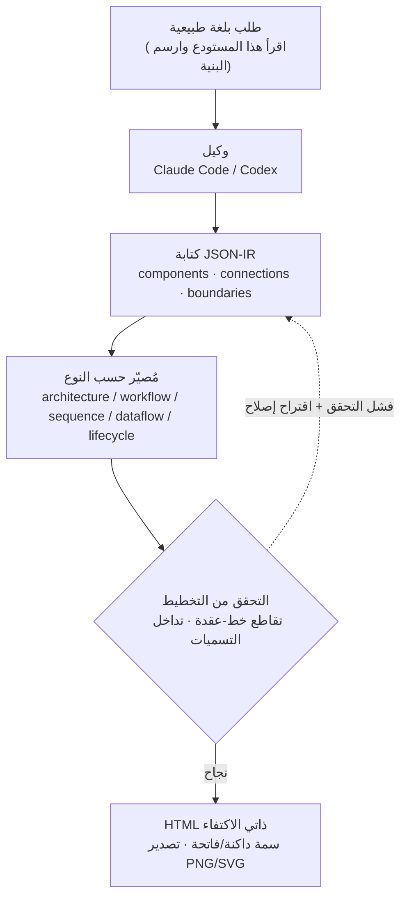

## لماذا تقرأ هذا

هذا المقال موجّه لـ**المطورين ومهندسي المنصات الذين يرسمون مخططات معمارية باستمرار لكنهم يفقدون وقتهم في صيغة Mermaid أو أدوات الرسم بالسحب والإفلات**. إنه مفيد لمن يحتاج أساسًا ملموسًا لاختيار أداة.

لنبدأ بالخلاصة. القيمة الحقيقية لـ Archify ليست في راحة "ارسم لي الصورة بالكلام"، بل في أن **المُصيّر يفرض التحقق من التخطيط الذي ينتجه الوكيل، بحيث يستحيل إنتاج رسم خاطئ من الأساس**. حين شغّلناها فعليًا، رُفضت محاولتنا الأولى للرسم، وكان ذلك الرفض هو ما يجعل هذه الأداة تستحق الاستخدام.

## نظرة عامة

مخططات المعمارية من أكثر المخرجات التي يرسمها المطورون تكرارًا وأكثرها إزعاجًا لهم. Mermaid يتطلب حفظ صيغته، وأدوات الرسم تتطلب سحب الصناديق والخطوط يدويًا لضبطها. وحتى بعد الانتهاء من الرسم، قد لا يتطابق الوضع الداكن، أو يجب إعادة التصدير لإدراجه في عرض تقديمي.

**Archify**، الذي حظي مؤخرًا باهتمام واسع في مجتمع المطورين الصيني، يستهدف هذه النقطة تحديدًا. أعطِ Claude Code أو Codex جملة عادية مثل "اقرأ هذه المستودعات وارسم لي مخططًا مقارنًا لبنياتها"، فتحصل على مخطط HTML ذاتي الاكتفاء يُفتح مباشرة في المتصفح. يمكنك التبديل بين السمتين الداكنة والفاتحة، وتصديره إلى PNG أو SVG.

حتى هذه النقطة، يبدو الكلام كعبارات تسويقية معتادة. لذلك، بدل تصديق العبارات، ثبّتناها فعليًا وشغّلناها، ورسمنا بها بنية ai-platform الخاصة بـ ThakiCloud. كشفت هذه العملية لماذا تختلف هذه الأداة عن "مولّد رسوم بالذكاء الاصطناعي" بسيط. هذا المقال سجل لتلك التجربة، وفي الوقت نفسه محاولة لفهم كيف تتصل بفلسفة تصميم Paxis، منصة الوكلاء التي تبنيها ThakiCloud.

## ما هذه الأداة

Archify مهارة وكيل مفتوحة المصدر أصدرها `tt-a1i` برخصة MIT. عند وقت تجربتنا كان الإصدار 2.11.0، وهي نسخة أُعيدت كتابتها كفرع (fork) من architecture-diagram-generator v1.0 لشركة Cocoon AI، وتنسب لغتها البصرية الأصلية إلى Cocoon AI. تُثبَّت على عدة أوقات تشغيل للوكلاء منها Claude وCodex CLI وopencode.

فهم البنية الجوهرية يوضّح سبب تميّز هذه الأداة. لا يرسم Archify الصورة مباشرة. بدلًا من ذلك، يصف المخطط بصيغة **JSON-IR (تمثيل وسيط)**، ويحوّل مُصيّر مخصص لكل نوع ذلك JSON إلى HTML. هناك خمسة مُصيّرات: architecture وworkflow وsequence وdataflow وlifecycle. بعبارة أخرى، "ماذا نرسم" يعيش في JSON مُهيكَل، و"كيف نرسمه" تملكه شيفرة مُتحقَّق منها.

تتولى المُصيّرات الخمسة كل نوع مختلف من الرسوم. architecture يغطي مكونات النظام وحدوده، وworkflow يغطي إجراءات مثل سلاسل الموافقة أو CI/CD، وsequence يغطي دورة حياة الطلب أو ترتيب استدعاءات API، وdataflow يغطي حركة البيانات مثل خطوط ETL وتدفقات الأحداث، وlifecycle يغطي انتقالات الحالة مثل عمليات النشر أو تنفيذ الوكيل. بمجرد تحديد ما تريد رسمه، يُفعَّل المُصيّر والمخطط (schema) المناظران، وذلك المخطط يفرض شكل JSON المُدخَل.

يخلق هذا التقسيم للعمل الفارق الحاسم مقارنة بـ Mermaid. يحلّل Mermaid الصيغة ويرتّب العناصر تلقائيًا (عبر dagre)، لكنه يرسم بلا مانع حتى لو قطع خط صندوقًا أو تداخلت التسميات. يفعل Archify العكس: يجعلك تحدد إحداثيات التخطيط صراحة، وقبيل الرسم مباشرة **يفحص قواعد التخطيط فرضًا**. إن خُرقت قاعدة، يرفض إنتاج الرسم ويصدر خطأ بدلًا منه.

التدفّق العام كالتالي.



## التثبيت والتكامل

التثبيت أمر npx واحد. التثبيت الشامل (العالمي) كالتالي.

```bash
# تثبيت شامل ثم اختيار وكيل
npx skills add tt-a1i/archify -g

# تجربة لمرة واحدة دون تثبيت دائم
npx skills use tt-a1i/archify@archify --agent codex
```

يمكنك أيضًا استنساخ المستودع مباشرة والتحقق منه عبر CLI لاستخراج الأمثلة. هذه هي الأوامر الفعلية التي شغّلناها ومخرجاتها. كانت بيئة تجربتنا Node.js v24.1.0، ويتطلب Archify Node 18 فأعلى، ولا توجد له فعليًا تبعيات تشغيل (تبعية تطوير واحدة فقط هي ajv، تُستخدم للتحقق من المخطط).

```bash
git clone --depth 1 https://github.com/tt-a1i/archify.git
cd archify/archify

# فحص حالة التثبيت
node bin/archify.mjs doctor
```

هذا هو المخرج الفعلي لأمر `doctor`. تأكّدت جميع المُصيّرات الخمسة والمدقّقات (schema validators) على أنها سليمة.

```text
Archify doctor

[ok] Node.js v24.1.0 (requires >=18)
[ok] Core template
[ok] Standalone schema validators
[ok] architecture renderer, schema, and example
[ok] workflow renderer, schema, and example
[ok] sequence renderer, schema, and example
[ok] dataflow renderer, schema, and example
[ok] lifecycle renderer, schema, and example

Archify is ready.
```

سحب أحد الأمثلة المدمجة ينتج ملف HTML ذاتي الاكتفاء واحدًا بحجم 508 كيلوبايت، يُفتح مباشرة في المتصفح دون أي خادم خارجي.

```bash
node bin/archify.mjs demo ./out
# Demo ready: ./out/archify-demo.html   (نحو 508 كيلوبايت، HTML واحد)
```

## ما وجدناه حين شغّلناها فعليًا

قراءة الوثائق وحدها تجعل الأمر يبدو أن هذا كل شيء. لذلك، بدل استخدام مثال شخص آخر، كتبنا **بنية ai-platform الفعلية لـ ThakiCloud** كـ JSON-IR بأيدينا ورسمناها. أدرجنا تسعة مكونات: جدولة GPU عبر Kueue، تقديم النماذج عبر vLLM، مصادقة متعددة المستأجرين عبر Keycloak، الحالة والأحداث عبر PostgreSQL وNATS، ونشر GitOps عبر ArgoCD.

لم يكن JSON-IR صعب القراءة أو الكتابة على إنسان. المكوّن كائن له نوع وتسمية وموضع وحجم، والاتصال يحمل مصدرًا ووجهة وتسمية. على سبيل المثال، وصفنا البوابة وجزء تقديم GPU كالتالي.

```json
{
  "components": [
    { "id": "gateway", "type": "backend", "label": "API Gateway",
      "sublabel": "Go Fiber :8080", "pos": [280, 300], "size": [140, 60] },
    { "id": "vllm", "type": "backend", "label": "vLLM Server",
      "sublabel": "OpenAI API", "pos": [540, 300], "size": [140, 60] }
  ],
  "connections": [
    { "id": "gw-to-vllm", "from": "gateway", "to": "vllm", "label": "route inference" },
    { "id": "vllm-gpu", "from": "vllm", "to": "gpupool", "label": "CUDA", "variant": "emphasis" }
  ]
}
```

فشلت محاولة الرسم الأولى. **وهذا الفشل هو أهم نقطة في هذا المقال.** بدل رسم أي شيء، أشار المُصيّر إلى ثلاث مشكلات ملموسة.

```text
Error: Architecture layout validation failed:
- [clean-flow/edge-through-node] connection "kueue-gpu" (kueue -> gpupool)
  crosses component "vllm" (unrelated to this relationship)
- [clean-flow/edge-through-node] connection "kueue-gpu" (kueue -> gpupool)
  crosses component "argocd" (unrelated to this relationship)
- Label "publish" overlaps component "gateway"
  Suggested fix: labelDy +24 (below); or labelAt [350, 374]
```

بعبارة أخرى، الاتصال من Kueue إلى مجمّع GPU قطع صندوقي vLLM وArgoCD غير المرتبطين، وتداخلت تسمية "publish" مع صندوق البوابة. اللافت أن المُصيّر لم يكتفِ بالإشارة إلى المشكلة، بل **اقترح أيضًا كيفية إصلاحها**، حتى الإحداثيات الدقيقة لمقدار تحريك التسمية.

اتّبعنا الاقتراح، وأضفنا نقطة توجيه (via) للاتصال وعدّلنا موضع التسمية، ثم أعدنا الرسم. نجح هذه المرة. هذه هي القياسات الفعلية.

| العنصر | القياس |
| --- | --- |
| زمن الرسم | نحو 0.073 ثانية |
| الملف الناتج | 519,709 بايت (نحو 508 كيلوبايت) HTML واحد |
| SVG مضمّن | 1 (الرسم بأكمله SVG واحد) |
| دعم السمات | `data-theme` في 27 موضعًا · `prefers-color-scheme` في 7 مواضع |
| المراجع الخارجية | 1 (خط JetBrains Mono، يتراجع إلى خط النظام) |

خلاصة القول، الرسم نفسه يستغرق 73 ميلي ثانية، أي فوري فعليًا. المخرج ملف HTML ذاتي الاكتفاء لا يعتمد على خادم صور أو CDN، ومرجعه الخارجي الوحيد خط ويب واحد للكود، لذا يُفتح دون كسر حتى دون اتصال، متراجعًا إلى خط النظام. السمتان الداكنة والفاتحة ليستا زخرفة، بل مُنفَّذتان فعليًا عبر متغيرات CSS حقيقية و`prefers-color-scheme`.

الدرس المستفاد هنا واضح. مدقّق Archify ليس أداة لإنتاج "رسم جميل"، بل **بوابة تمنع من الأساس نشر مخطط سيئ، خطوطه متشابكة أو تسمياته متداخلة**. عيب بصري كان سيتجاهله إنسان يرسم يدويًا، أمسكته الشيفرة في كل مرة وبالمعيار نفسه.

## دلالات على منتجات ThakiCloud

تصميم هذه الأداة يتقاطع بدقة مع مبدأ تلتزم به ThakiCloud عبر منتجين.

**عبر عدسة Paxis (الوكلاء والمهارات).** Paxis هي السحابة الأصلية للوكلاء من ThakiCloud، وتتعامل مع المهارات كموارد من الدرجة الأولى. تختار أكثر من 960 مهارة عبر BM25، وتشغّلها في صندوق رمل معزول، وتمرّر كل إجراء عبر بوابات السياسة وسجلات التدقيق. Archify هو تحديدًا شكل الأداة التي يُبنى إطار مهارات كهذا لاختيارها وتشغيلها. والأهم من ذلك هو تصميمها الداخلي. في Archify، **يُنتج النموذج المحتوى (JSON-IR)، بينما تملك الشيفرة الصيغة والتحقق**. هذا يطابق مبدأً تكرّره ThakiCloud في أعمال المخرجات الدفعية: افصل خطوة التوليد الحرة عن خطوة التحقق الحتمية. بدل أن تطلب من النموذج "ارسم شيئًا جميلًا"، تجعله ينتج تمثيلًا مُهيكَلًا، وتفرض الشيفرة ما إذا كان ذلك التمثيل يتبع القواعد. رفض محاولتنا الأولى للرسم كان تحديدًا هذا المبدأ وهو يعمل فعليًا.

**عبر عدسة ai-platform (البنية التحتية والتوثيق).** HTML ذاتي الاكتفاء مفيد بشكل خاص في البيئات المحلية (on-premise) والسيادية. لعميل لا يستطيع رفع بنيته الداخلية إلى SaaS خارجي للرسم، يصبح الرسم محليًا والحصول على ملف واحد قابل للنقل مخرجًا قابلًا للاستخدام مباشرة. وبما أن JSON-IR نص عادي، فهو خاضع لإدارة الإصدارات في Git وقابل للمقارنة (diff). تمامًا كما تدير ArgoCD ملفات manifest، يمكنك إدارة مخططات المعمارية كشيفرة أيضًا، وتتبّع كل تغيير ومراجعته. بدل إعادة رسم وثائق التأهيل أو مخططات النشر للعملاء يدويًا في كل مرة، يكفي تعديل JSON عند تغيّر البنية وإعادة الرسم.

تكمّل العدستان إحداهما الأخرى. مهارة مُتحقَّق منها (Paxis) تنتج مخرجًا قابلًا لإعادة الإنتاج (توثيق ai-platform)، وذلك المخرج بدوره يصبح أصلًا قابلًا للنقل إلى العملاء في البيئات المحلية.

## القيود والاعتراضات

بالطبع، Archify ليست أداة سحرية. لها بعض نقاط الضعف الواضحة.

أولًا، **يجب تحديد إحداثيات التخطيط صراحة.** بخلاف التخطيط التلقائي في Mermaid، يجب إعطاء موضع وحجم كل مكوّن كإحداثيات، ويجب أن يجتاز ذلك التخطيط التحقق. كما أظهرت محاولتنا الأولى الفاشلة، هذه الخطوة ليست مجانية تمامًا. لكن عمليًا، يملأ الوكيل هذه الإحداثيات نيابة عنك ويصلحها بنفسه عند تلقّي خطأ تحقق، فينخفض العبء على الإنسان.

ثانيًا، **المخرج ليس خفيفًا.** المخطط الواحد نحو 508 كيلوبايت من HTML، لأنه يحزم الخطوط والسكربتات في ملف ذاتي الاكتفاء. هذا أثقل من SVG بسيط أو كتلة Mermaid. إن كنت تضع عدة مخططات في صفحة مدونة واحدة، قد يصبح هذا الوزن عبئًا.

ثالثًا، **لم تُوزَّع كمكتبة.** يُعلَّم `package.json` بـ `private: true`، أي أنك تستهلكها كمهارة/CLI من المستودع لا كحزمة npm. ربطها في خط أنابيب كمكتبة يتطلب تفكيرًا إضافيًا.

رابعًا، **إنها لقطة ثابتة.** ليست لوحة تحكم حية تُحدَّث ببيانات لحظية، بل صورة لبنية في لحظة زمنية محددة. إن أردت رسم مسودة سريعة، قد تصبح صرامة قواعد التحقق احتكاكًا. مع ذلك، هذه الصرامة نفسها هي سبب وجود هذه الأداة أصلًا.

## الخلاصة

بعد تثبيت Archify فعليًا ورسم بنية ThakiCloud بها، خلاصتنا كالتالي. جوهر هذه الأداة ليس راحة "ارسم بالكلام"، بل انضباط **جعل المُصيّر يتحقق من كل تخطيط ينتجه الوكيل بالمعيار نفسه في كل مرة، بحيث لا يُنشر مخطط سيئ أبدًا**. كما قلنا في المقدمة، كان رفض محاولتنا الأولى للرسم هو اللحظة التي جعلتنا نثق بهذه الأداة.

لذا فالخطوة التالية واضحة. إن كنت ترسم مخططات معمارية باستمرار، وتريد أن تعيش تلك المخططات في وثائقك أو مستودعك كشيفرة، تستحق Archify تجربة واحدة على الأقل. وإن كنت بالمقابل تريد رسمًا سريعًا أو وضع عدة مخططات في صفحة واحدة، يبقى Mermaid الخيار الأخف. السؤال الفاصل هو: هل تريد إدارة هذا الرسم كأصل قابل لإعادة الإنتاج ومُتحقَّق منه؟ إن كانت الإجابة نعم، فـ Archify، وإطار مهارات Paxis الذي يحوّل المبدأ نفسه إلى منتج، هما الجواب.

> المصادر
> - مستودع Archify: [github.com/tt-a1i/archify](https://github.com/tt-a1i/archify) (MIT، الإصدار 2.11.0)
> - التغريدة الأصلية: [@alin_zone via @hjguyhan](https://x.com/hjguyhan/status/2079683904030777353)
> - سجل التجربة: الأوامر والمخرجات والقياسات في هذا المقال جُمعت من تشغيل محلي في 2026-07-22 (Node v24.1.0).
