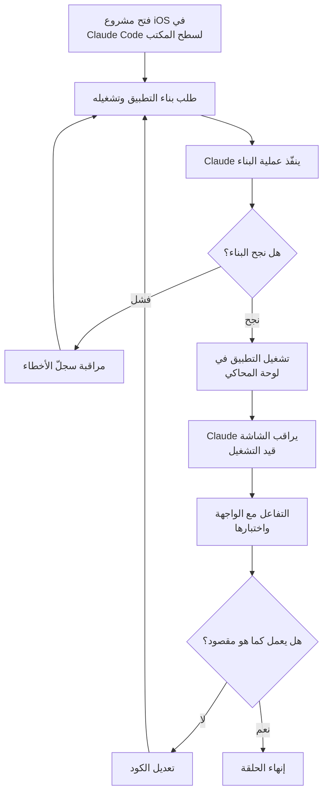

## لماذا تستحق هذه المقالة القراءة

إذا كنت مطوّرًا تبني تطبيقات iOS باستخدام Claude Code على macOS، فخلاصة هذه المقالة واحدة: أصبحت "الحلقة المغلقة" التي يشغّل فيها وكيل البرمجة التطبيق الذي بناه بنفسه ويراقب الشاشة أثناء إصلاحها تعمل الآن داخل تطبيق سطح المكتب مباشرة، دون الحاجة إلى أدوات منفصلة. سنستعرض في ما يلي ما يجب تعلّمه من جديد، ولماذا لا يُعدّ هذا التغيير مجرد ميزة راحة بل مسألة تتعلق بالطريقة التي يُقارب بها الوكيل تقارب جودة الكود من تلقاء نفسه.

## نظرة عامة

اللحظة التي يصبح فيها وكيل البرمجة بالذكاء الاصطناعي مفيدًا حقًا ليست عندما يُخرج الكود مرة واحدة وينتهي الأمر، بل عندما يتأكد بنفسه من أن هذا الكود يعمل فعليًا ثم يعيد إصلاحه. في كود الخلفية (backend)، يمكن تشغيل الاختبارات للحصول على إشارة موضوعية بالنجاح أو الفشل. أما واجهة تطبيقات الجوّال فمختلفة تمامًا؛ فمعرفة ما إذا كانت شاشة الترحيب تظهر كما هو مقصود، أو ما إذا كان الضغط على زر ما ينقل إلى الشاشة التالية، أمرٌ لا يمكن التحقق منه إلا بالعين المجرّدة. حتى الآن كان هذا التحقق من مسؤولية الإنسان، وكان الوكيل يتوقف بعد كتابة الكود إلى أن يشغّل الإنسان المحاكي، يضغط على الأزرار، ثم يمرّر الملاحظات.

في 21 يوليو 2026، طرح تطبيق Claude Code لسطح المكتب ميزة تسدّ هذه الفجوة مباشرة، ضمن نسخة تجريبية عامة. عند بناء تطبيق iOS وتشغيله، يفتح محاكي iOS من Apple في لوحة جانبية بجوار المحادثة مباشرة، ويرى Claude شاشة التطبيق قيد التشغيل بنفسه، فيتفاعل مع الواجهة ويستمر في تعديل الكود حتى يعمل كما هو مطلوب. بذلك تنطوي عملية التنقل ذهابًا وإيابًا التي كانت تتطلب من الإنسان تشغيل المحاكي والتحقق ثم إعادة صياغة النتيجة بالكلمات، ضمن حلقة واحدة.

في ThakiCloud، ونحن نبني سحابة أصيلة للوكلاء (agent-native cloud)، نصطدم باستمرار بسؤال "كيف يراقب الوكيل نتيجة فعله ويقرر خطوته التالية؟". ولأن هذه الميزة تمثّل إجابة ملموسة جدًا على هذا السؤال، سنتناولها هنا من منظور تصميم الحلقة، لا كمجرد عرض لميزة جديدة.

## ما هو تكامل محاكي iOS

الفكرة الأساسية بسيطة. عندما تفتح مشروع iOS في Claude Code لسطح المكتب وتطلب منه بناء التطبيق وتشغيله، تظهر لوحة المحاكي بجانب المحادثة ويجعل Claude من تلك الشاشة موضوع مراقبته. يُفتح محاكٍ مستقل لكل جلسة، بحيث يمكن تنفيذ عدة مهام في آنٍ واحد دون أن تتداخل شاشات كل منها مع الأخرى. وتعمل هذه اللوحة في الجلسات المحلية فقط، لأن المحاكي نفسه برنامج لا يعمل إلا على macOS.

ما يجعل هذه الميزة لافتة ليس أنها مجرد طبقة عرض إضافية، بل أنها فتحت للوكيل "قناة مراقبة" جديدة. حتى الآن، كانت معظم الإشارات التي يمكن لوكيل البرمجة التحقق منها إشارات نصية: أخطاء المُصرّف (compiler)، نتائج الاختبارات، السجلّات. أما كيف يبدو التطبيق فعليًا وكيف يستجيب، فكان لا يصل إلى الوكيل إلا عبر عين الإنسان ولسانه. تكامل المحاكي يحوّل هذه النتيجة البصرية إلى إشارة يمكن للوكيل التحقق منها مباشرة بنفسه.

إذا بسّطنا التدفق الكامل، نحصل على حلقة متكررة على النحو التالي.

كما يتضح من الرسم، يقتصر تدخّل الإنسان على الطلب الأول والتحقق الأخير فقط، بينما تدور عمليات البناء والتشغيل والمراقبة والتعديل في الوسط بالكامل داخل الوكيل. تمامًا كما يُغلق مُشغّل الاختبارات (test runner) الحلقة في تطوير الخلفية عبر إشارة موضوعية بالنجاح أو الفشل، يتولى المحاكي هنا الدور ذاته في مساحة واجهة المستخدم البصرية.

## كيفية تفعيلها واستخدامها

لا تتطلب هذه الميزة إعدادًا معقدًا. لكن شروطها المسبقة واضحة تمامًا. أولًا، يجب أن يكون النظام macOS، إذ لا يعمل محاكي iOS خارج منظومة Apple، وبالتالي لا يمكن استخدام هذه اللوحة على Windows أو Linux. ثانيًا، يجب توفّر Xcode مع تثبيت منصة iOS، لأن البنية التحتية التي يستخدمها Claude فعليًا لتنفيذ البناء وتشغيل المحاكي هي في النهاية أدوات بناء Xcode والمحاكي نفسه. أما من ناحية الاشتراك، فيمكن لمستخدمي خطط Pro وMax وTeam استخدام هذه الميزة.

الاستخدام نفسه حواري بالكامل. تفتح مشروع iOS في Claude Code لسطح المكتب، وتحدّد مجلد المشروع كمساحة عمل الجلسة. يعمل هذا مع أي مشروع يبني تطبيقًا لمحاكي iOS. بعد ذلك، يكفي أن تطلب من Claude تشغيل التطبيق أو اختباره. على سبيل المثال، إذا طلبت بلغة طبيعية "ابنِ التطبيق وشغّله في المحاكي وتحقق من مسار الترحيب"، ينفّذ Claude عملية البناء ويعرض التطبيق في لوحة المحاكي، ثم يراقب الشاشة ويواصل عملية التحقق.

باختصار، لا توجد أوامر أو ملفات إعداد جديدة تحتاج إلى حفظها فعليًا. ما يتغيّر هو نطاق "ما يمكن تكليف الوكيل به". فبعد أن كان الطلب يقتصر سابقًا على "أصلح هذه الشاشة لتظهر بهذا الشكل" ثم يتولى الإنسان تشغيلها والتحقق بنفسه، أصبح بالإمكان الآن تضمين خطوة التحقق ذاتها ضمن التعليمات. ومع أن التفاصيل الدقيقة ستُصقل لاحقًا بما أن الميزة ما زالت في مرحلة النسخة التجريبية العامة، فإن اتجاه نموذج التفاعل واضح فعلًا.

## ما تمنحه الحلقة المغلقة لوكيل البرمجة

المعنى الحقيقي لهذه الميزة لا يكمن في الراحة بقدر ما يكمن في اكتمال الحلقة. لكي يكون الوكيل مفيدًا، يجب أن تتوفر لديه وسيلة للتحقق من مخرجاته بنفسه، وإذا ظلّ هذا التحقق معتمدًا في كل مرة على عين الإنسان ويده، يبقى الوكيل عالقًا في أتمتة منقوصة. وكان العمل على واجهة iOS مثالًا نموذجيًا على هذا النقص؛ فالكود يكتبه الوكيل، لكن التحقق من صحته على الشاشة كان يتطلب دائمًا عين الإنسان.

عندما يُلحق المحاكي بجانب المحادثة ويُتاح للوكيل مراقبة الشاشة قيد التشغيل، تتصل المراقبة والحكم والتعديل ضمن حلقة واحدة. عند فشل البناء، يقرأ الوكيل الخطأ ويصلحه، وعند تشغيل التطبيق، ينظر إلى الشاشة ويكتشف ما يختلف عن المقصود ثم يعيد الإصلاح. المهم هنا أن هذا التكرار يدور دون تنقّل الإنسان ذهابًا وإيابًا. صحيح أن هذه المراقبة تتم عبر التقاط لقطات للشاشة والتحقق منها، ولذلك لا تحلّ محل التفاعلات الدقيقة التي يشعر بها الإنسان بيديه على جهاز حقيقي. ومع ذلك، فإن مجرد اختفاء ذلك الانقطاع الذي كان يحدث عندما "يصلح الوكيل الكود دون أن يعرف كيف تغيّرت الشاشة وينتظر التعليمة التالية" يغيّر طبيعة العمل بشكل ملموس.

تتقاطع هذه البنية مع مبادئ هندسة الحلقات (loop engineering) التي رسّختها ThakiCloud داخليًا: الإشارة الموثوقة هي الإشارة الحتمية التي تُعيد النجاح أو الفشل بشكل موضوعي، ولا يمكن لتقرير الوكيل الذاتي ("يبدو أن الأمر تمّ بنجاح") أن يكون شرط إنهاء للحلقة. المحاكي هنا أداة توسّع تلك الإشارة الحتمية لتشمل المجال البصري. فنجاح البناء كان بالفعل إشارة واضحة، والآن، مع إضافة قناة مراقبة أخرى هي شاشة التنفيذ، تُغلق حلقة العمل على واجهة المستخدم بإحكام أكبر.

## دلالات التطبيق على منتجات ThakiCloud

بما أن هذه الميزة موضوعها الوكلاء، فمن الطبيعي النظر إليها من عدسة Paxis. Paxis هي سحابة ThakiCloud الأصيلة للوكلاء، تُعامل المهارات (skills) والأدوات والسياسات وسجلّات التدقيق كموارد من الدرجة الأولى، وتنفّذ المهارات داخل صناديق رملية (sandboxes) معزولة، وتُمرّر كل فعل عبر بوابات سياسة وسجلّات تدقيق. وما يُظهره تكامل محاكي Claude Code من "حلقة مغلقة تبني وتشغّل وتراقب وتصلح" ينتمي بالضبط إلى نفس فئة نموذج التنفيذ الذي تتطلع إليه Paxis: أن ينفّذ الوكيل شيئًا ما في بيئة معزولة، ويراقب النتيجة ليقرر الخطوة التالية، على أن يجري كل ذلك ضمن حدود محكومة.

من منظور Paxis، تحمل هذه الحالة دلالتين. الأولى، أن فتح قناة يستطيع الوكيل من خلالها مراقبة نتيجة تنفيذه هو ما يحدّد عمق الأتمتة. فتمامًا كما أُغلقت حلقة العمل على واجهة المستخدم التي لم تكن تُغلق بالإشارات النصية وحدها بفضل قناة مراقبة بصرية واحدة، فإن ما يحدّد الجودة في Paxis أيضًا هو امتلاك كل مهارة إشارة تتحقق بها من مخرجاتها الخاصة. الثانية، أن هذا التنفيذ يجري في بيئة معزولة لكل جلسة. فكما يفتح Claude Code محاكيًا مستقلًا لكل جلسة، فإن التنفيذ المعزول داخل الصناديق الرملية في Paxis يضمن، بنفس المبدأ التصميمي، ألا تلوّث مهام الوكلاء المتعددة بعضها بعضًا.

وإذا أردنا إضافة ملاحظة من زاوية البنية التحتية، فإن جعل مثل هذه الحلقات المغلقة عملية يتطلّب القدرة على تشغيل بيئات التنفيذ وإيقافها بسرعة وبتكلفة زهيدة. وقدرة منصّة ai-platform التابعة لـ ThakiCloud على جدولة بيئات تنفيذ معزولة بكفاءة فوق Kubernetes تشكّل الأساس الذي يدعم اقتصاديات تشغيل حلقات الوكلاء على نطاق واسع. فبدون تنفيذ معزول منخفض التكلفة، لا يمكن لحلقة الوكيل التي تكرّر المراقبة والتعديل أن تدور دون عبء مالي.

## الحدود والاعتراضات

لتجنّب المبالغة في تقدير هذه الميزة، لا بدّ من تحديد حدودها بوضوح أيضًا. أولًا، المنصّة مقيّدة بـ macOS. هذا قيد لا مفرّ منه بما أن محاكي iOS لا يعمل خارج منظومة Apple، وهذا يعني أن هذه الحلقة متاحة لمستخدمي Mac فقط. كما أن تثبيت Xcode شرط أساسي، ولا يمكن استخدامها إلا في خطط Pro وMax وTeam، واللوحة تقتصر على الجلسات المحلية. أما توقّع الحصول على التجربة نفسها في الجلسات البعيدة أو بيئات المشاركة الجماعية، فلا يزال أمرًا سابقًا لأوانه.

كذلك، الميزة نفسها ما زالت في نسخة تجريبية عامة. ما أُعلن عنه ونُشر هو طريقة عملها وأسلوب استخدامها، وليس معيارًا (benchmark) يقيس مدى سرعة ودقة تقارب هذه الحلقة فعليًا. وبالتالي لا يمكن الجزم رقميًا بمدى التحسّن المتحقق. علاوة على ذلك، فإن مراقبة الوكيل للشاشة تتم عبر التقاط الشاشة والتحقق منها، ما يعني أنها لا تحلّ محل الاستجابة الدقيقة لإيماءات اللمس التي يشعر بها الإنسان على جهاز حقيقي، ولا الإحساس الفعلي بالأداء. فالرسوم المتحركة المعقّدة، وسلوك إمكانية الوصول (accessibility)، والمشكلات التي لا تظهر إلا على الأجهزة الحقيقية، لا تزال تحتاج إلى تحقّق بشري.

وأخيرًا، ثمة اعتراض جدير بالذكر يتعلق بخطر تحوّل هذه الراحة إلى ثقة غير مُتحقَّق منها. فكلما دارت الحلقة بسلاسة أكبر، سهُل على الإنسان أن يتقبّل النتيجة كما هي دون مراجعة. وكون الوكيل يقول "لقد تحققت من ذلك" لا يعني أن هذا الحكم هو تحقّق فعلي. مراقبة المحاكي إشارة مفيدة، لا موافقة نهائية، وتحديدًا في الجوانب الدقيقة لتجربة المستخدم، لا يزال الإنسان بحاجة إلى الضغط بيده والحكم بنفسه.

## خلاصة

تكامل محاكي iOS مع Claude Code قد يبدو صغيرًا، لكن اتجاهه واضح: الحلقة المغلقة التي يشغّل فيها وكيل البرمجة ما بناه بنفسه ويراقبه ويصلحه، امتدت الآن إلى مجال واجهة المستخدم الذي كان يعتمد على الإنسان طويلًا. بالنسبة لأي مطوّر يبني تطبيقات iOS باستخدام Claude Code على macOS، هذا تغيير يستحق التجربة الآن، وهو يدعو إلى إعادة التفكير في طريقة العمل نفسها، بما أن نطاق ما يمكن تكليف الوكيل به قد اتّسع.

وعلى نطاق أوسع، تُذكّرنا هذه الحالة مجددًا بأن ما يجعل الوكيل مفيدًا ليس حجم النموذج وحده، بل مسألة تتعلق بالبنية التحتية (harness): إلى أي مدى تُغلق الحلقة التي يراقب فيها الوكيل النتيجة ليقرر خطوته التالية. وهذه بالضبط هي المسألة التي تعمل ThakiCloud على حلّها عبر Paxis وai-platform. وخلاصة اليوم في سطر واحد: في المرة القادمة التي تكلّف فيها وكيلًا بمهمة تتعلق بواجهة المستخدم، لا تتوقف عند طلب إصلاح الكود، بل اطلب منه "شغّله وتحقق بنفسك أيضًا". أن تُترك مهمة إغلاق الحلقة للوكيل لا للإنسان، هذا هو التغيير الأكثر عملية الذي تمنحه هذه الميزة.

## المصادر

- [الوثائق الرسمية لـ Claude Code: Test iOS apps in the simulator](https://code.claude.com/docs/en/desktop-ios-simulator)
- [منشور ClaudeDevs (X)](https://x.com/ClaudeDevs/status/2079674432038248611)
- [9to5Mac: Claude Code brings live iOS app testing into its Mac app](https://9to5mac.com/2026/07/21/claude-code-brings-live-ios-app-testing-into-its-mac-app/)
- [MacRumors: Claude Code Can Now Build and Test iOS Apps in Apple's Simulator](https://www.macrumors.com/2026/07/21/claude-code-ios-simulator/)
