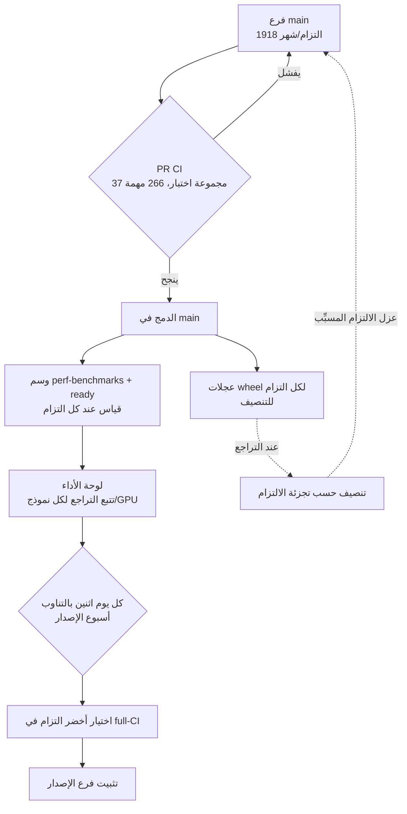

## لماذا تقرأ هذا

هذه المقالة موجهة لمهندسي المنصات وممارسي MLOps الذين يخدمون نماذج LLM عبر vLLM، أو الذين يعتمد إنتاجهم على مصادر مفتوحة سريعة التغير. إنها لمن عليه أن يقرر: "محرك الاستدلال الذي نشغّله يتغير مئات المرات أسبوعياً. أي إصدار نرقّي إليه ومتى، دون أن ينكسر شيء؟"

الخلاصة أولاً. مفتاح الحفاظ على جودة الإنتاج عند 2000 التزام شهرياً ليس زيادة الاختبارات بلا حدود. إنه **ثلاث آليات حتمية: بوابة قياس أداء تمسك تراجعات الأداء، وتثبيت فرع الإصدار على أصح التزام، والتنصيف حسب الالتزام لعزل التراجع عند حدوثه.** وهذه هي الأنماط التشغيلية ذاتها التي يمكن لـ ThakiCloud تبنّيها مباشرة عند خدمة vLLM في بيئة متعددة المستأجرين فوق Kubernetes.

## نظرة عامة

في 16 يوليو 2026، نشر فريق صيانة vLLM مقالة بعنوان "Keeping vLLM Production Quality". الأرقام وحدها مذهلة. خلال يونيو 2026، دمج vLLM **1918 التزاماً** في main. أي نحو 64 يومياً، على قدم المساواة مع مشاريع مفتوحة كبيرة مثل PyTorch أو Kubernetes. في الشهر نفسه، استهلك CI **13 مليون دقيقة تشغيل**، مع **1400 مشغّل متزامن** في الذروة.

لماذا تخلق هذه السرعة مشكلة؟ ذلك نابع من طبيعة محرك الاستدلال. في خدمة ويب اعتيادية تصح فرضية "إذا نجحت الاختبارات فالوضع آمن غالباً". لكن في محرك استدلال LLM، **قد يجتاز تغيير كل الاختبارات ويجعل مع ذلك نموذجاً بعينه أبطأ أو يفسد مخرجاته بشكل خفي.** استبدل نواة (kernel) واحدة وقد ينخفض معدل المعالجة إلى النصف على معمارية GPU معينة، ومثل هذا التراجع لا يظهر أبداً في اختبار وحدة بنجاح/فشل.

بالنسبة لمنظمة مثل ThakiCloud تعتمد على vLLM كتبعية خدمة أساسية، ليست هذه المقالة قصة شخص آخر. كل إصدار vLLM نشحنه يتحكم في زمن الاستجابة ومعدل المعالجة لأحمال العملاء. لذا فإن فهم كيف يحمي vLLM نفسه يخبرنا بما يجب أن نضع عليه بوابات فوقه.

## ما هي هذه التقنية

ينقسم نظام جودة vLLM إلى ثلاث طبقات. كل طبقة توقف نوعاً مختلفاً من الفشل.

**أولاً، CI وظيفي واسع.** تشغّل مجموعة CI في vLLM **37 مجموعة اختبار و266 مهمة**. تغطي المكونات والميزات الرئيسية من نوى مختلفة إلى speculative decoding إلى LoRA. تتحقق هذه الطبقة من "هل يعمل الكود؟".

**ثانياً، القياس المستمر (continuous benchmarking).** تمسك هذه الطبقة تراجعات الأداء التي يفوّتها CI الوظيفي. تقيس الأداء تلقائياً عبر نماذج وأجهزة GPU متعددة، وتتتبعه عبر الزمن لإبراز التراجعات أو التحسينات. تتحقق هذه الطبقة من "هل ما زال الكود سريعاً، وهل ما زال المخرج صحيحاً؟".

**ثالثاً، هندسة الإصدار.** مهما كان CI والقياس جيدين، فإن تقرير أي التزام يُصدَر للمستخدمين قرار منفصل. يوكل vLLM هذا القرار لقواعد قابلة للتكرار لا للحدس البشري.

يبيّن المخطط أدناه كيف تتشابك الطبقات الثلاث. اقرأه من الأعلى للأسفل فيصبح مسار التزام واحد حتى يصل مستخدماً.



## ما الذي انكسر وكيف أُصلح

لم يكن هذا النظام مكتملاً منذ البداية. في مايو 2026، بعد أيام من إصدار v0.20.0، اضطر vLLM لإطلاق رقعتين طارئتين. مشكلتان مرّتا عبر CI مباشرة إلى المستخدمين.

إحداهما **كسرت gpt-oss على معالجات Blackwell عند تقسيمه على عدة GPU**؛ والأخرى **أهبطت معدل معالجة DeepSeek V4 على GB200**. في ذلك الوقت لم يكن لدى vLLM خط قياس أداء. اجتازت المشكلتان الاختبارات الوظيفية بنظافة، لكن لم يكن أحد يقيس تلقائياً الأداء والصحة الفعليين على العتاد الحقيقي.

تلك الحادثة هي السبب المباشر لوجود طبقة القياس المستمر. الدرس واضح. **معادلة "نجاح الاختبارات = الأمان" لا تصح لمحرك استدلال.** الصحة الوظيفية والأداء محوران منفصلان، ويجب وضع بوابة على كل منهما بشكل مستقل.

## الأوامر التي يستخدمها المصلحون فعلاً

هذا النظام مكشوف لا كمفهوم فقط بل كأدوات يمكن للمستخدم تشغيلها. أداتان عمليتان لتتبع تراجعات الأداء مفيدتان بشكل خاص.

تُحدَّث لوحة الأداء تلقائياً على طلبات الدمج ذات وسوم معينة. عند كل التزام يحمل وسمَي `perf-benchmarks` و`ready` معاً، وكلما دُمج طلب دمج في main، يُشغَّل القياس ويُنشَر إلى اللوحة العامة.

```text
# الوسوم التي تُطلق قياسات الأداء (سير عمل PR في vLLM)
perf-benchmarks + ready
# ← تشغيل القياس على نماذج/GPU عديدة لكل التزام ← نشر إلى لوحة الأداء العامة
```

الأكثر إثارة هو **التنصيف حسب الالتزام (bisection)**. ينشر vLLM عجلات wheel للالتزامات السابقة، لذا فإن تحديد تجزئة التزام في رابط التثبيت يثبّت vLLM كما كان بالضبط عند ذلك الالتزام.

```bash
# تثبيت عجلة vLLM عند تجزئة التزام محددة (لتنصيف تراجعات السلوك/الأداء)
pip install https://wheels.vllm.ai/<commit-hash>/vllm-<version>-cp38-abi3-manylinux1_x86_64.whl

# تضييق "متى صار أبطأ؟" بالتنصيف:
#   التزام جيد A ── ؟ ── التزام سيئ B
#   ← ثبّت نقطة وسطى لإعادة الإنتاج ← اقسم النطاق إلى النصف
```

هنا تظهر القيمة الحقيقية لهندسة الإصدار. يبدأ vLLM أسبوع الإصدار كل يوم اثنين بالتناوب. يراجع مدير الإصدار عمليات full-CI الأخيرة على main ذلك اليوم ويختار **أخضر التزام**. هذا يؤمّن أصح نقطة انطلاق قبل إضافة أي تغييرات خاصة بالإصدار. ولقطع فروع الإصدار بشكل متكرر فائدة خفية: **تتبع التراجع أسهل بكثير حين يكون لديك نحو 500 التزام للتنصيف بدل بضعة آلاف.** إيقاع الإصدار نفسه آلية تخفض كلفة تصحيح الأخطاء.

## أرقام الحجم التي نشرها vLLM

فيما يلي الأرقام الفعلية التي نشرتها المقالة اعتباراً من يونيو 2026. هذه ليست إعادة إنتاج منّا؛ إنها قيم أبلغ عنها المصلحون، منقولة حرفياً.

| المؤشر | القيمة | المعنى |
|---|---|---|
| التزامات مدموجة في main | 1918/شهر (~64/يوم) | معدل تغيير بمستوى PyTorch/Kubernetes |
| وقت CI المستهلك | 13 مليون دقيقة/شهر | كلفة تحقق هائلة |
| ذروة المشغّلين المتزامنين | 1400 | حجم التحقق المتوازي |
| مجموعات اختبار CI | 37 | نوى، spec decoding، LoRA، إلخ |
| مهام CI | 266 | تفصيل لكل مكون |
| إيقاع الإصدار | كل اثنين بالتناوب | يبقي نطاق التنصيف عند ~500 التزام |

ما تقوله هذه الأرقام بسيط. للحفاظ على الجودة عند هذه السرعة، **لا يمكن للتحقق أن يعتمد على المراجعة البشرية** ويجب استبداله ببوابات حتمية وقياس آلي.

## دلالات على منتجات ThakiCloud

تخدم **ai-platform** من ThakiCloud النماذج لبيئات عملاء متنوعة فوق Kubernetes وجدولة Kueue لوحدات GPU. vLLM هو المحرك الأساسي على مسار الخدمة هذا، لذا فإن كيفية حفاظ vLLM على الجودة تصبّ مباشرة في تصميم سياسة إصداراتنا.

أولاً، **افصل تثبيت الإصدار عن بوابة القياس.** وفق درس vLLM، لا نرقّي إصداراً جديداً للإنتاج بمجرد نجاح الاختبارات الوظيفية. نشغّل تلقائياً قياسات معدل المعالجة وزمن الاستجابة على أحمال عملاء تمثيلية (تركيبات نموذج/GPU) قبل الطرح، ونضع بوابة تحجب الترقية عند رصد تراجع. هذا ينقل طبقة القياس المستمر في vLLM إلى بوابة في خط النشر لدينا.

ثانياً، **ثبّت إصدار vLLM صراحةً في الطرح المبني على GitOps عبر ArgoCD.** بدل ملاحقة أحدث التزام على main، نعامل وسم الإصدار الذي تحقق منه vLLM وقطعه بنفسه كمرجع، ونثبّت ذلك الوسم في قيم كل عنقود. الطرح أولاً لعدد قليل من المستأجرين كـ canary، ثم التوسع للجميع فقط حين تكون لوحة القياس خضراء، يعيد إنتاج مبدأ vLLM "اختر أصح التزام" على طبقة النشر.

ثالثاً، **استخدم عجلات wheel لكل التزام لتتبع التراجع داخلياً.** حين يشير عميل بعينه إلى أنه "صار أبطأ من الأسبوع الماضي"، يمكننا التنصيف بعجلات vLLM لكل التزام لعزل الالتزام المسبِّب. تضييق مسؤولية التراجع بسرعة في بيئة متعددة المستأجرين محوري لثقة التشغيل.

تتقارب هذه الثلاثة على مبدأ واحد. **لتشغيل الإنتاج فوق تبعية مصدر مفتوح سريعة التغير، عليك تفويض حكم الجودة لبوابات آلية، لا للحدس البشري.**

## الحدود والحجج المضادة

لا يُنقَل نهج vLLM بنظافة إلى كل منظمة. هناك قيود واقعية.

الأكبر هو **الكلفة.** 13 مليون دقيقة CI شهرياً و1400 مشغّل متزامن يفترضان ميزانية بنية تحتية كبيرة. من غير الواقعي لفريق صغير استنساخ مزرعة قياس بهذا الحجم. لذا ما نحتاجه ليس نسخة من الحجم بل **قياس تمثيلي مضيّق على الأحمال الأساسية.** وضع بوابة على أعلى بضع تركيبات فقط من حركة العملاء الفعلية، بدل مصفوفة نموذج/GPU الكاملة، أجدى بكثير لكل دولار.

ثانياً، **تغطية القياس هي حدّه.** التراجعات في نماذج أو أطوال تسلسل أو تركيبات دفعات غير موجودة في القياس ما زالت تتسرب. حادثة مايو في vLLM فاتت تحديداً لعدم وجود قياس، وحتى بعد إضافته تبقى التركيبات الغائبة عن اللوحة نقاطاً عمياء. لا تنسَ أبداً أن البوابة تحمي فقط "ما قِسته".

ثالثاً، إيقاع الإصدار كل أسبوعين هو **مقايضة بين الاستقرار والحداثة.** قطع الإصدارات بشكل متكرر يسهّل التنصيف، لكنه يبطئ سرعة وصول الميزات الجديدة للإنتاج. إن كان لدى عميل حاجة عاجلة لأحدث تحسين نواة، فقد تصبح سياسة الإصرار على الإصدارات المستقرة فقط عنق الزجاجة ذاته. نقطة التوازن هذه تختلف من منظمة لأخرى.

## الخلاصة

عودة إلى مشكلة حماية الإنتاج فوق مصدر مفتوح سريع التغير. لا ينهار vLLM عند 2000 التزام شهرياً ليس لأنه يضيف اختبارات بلا حدود، بل لأنه يملك **ثلاث آليات حتمية: بوابة قياس توقف تراجعات الأداء، وتثبيت فرع الإصدار الذي يختار أصح التزام، والتنصيف حسب الالتزام الذي يضيّق السبب.**

بالنسبة لمنظمة مثل ThakiCloud تشغّل vLLM كنواة خدمة، فإن الإجراء اليوم واضح. حين ترقّي لإصدار vLLM جديد، لا تعتمد على نجاح الاختبارات الوظيفية وحده؛ أقِم قياساً على أحمال عملاء تمثيلية كبوابة طرح. وبدل ملاحقة main، ثبّت وسم الإصدار الذي تحقق منه vLLM في قيم GitOps لديك. وضع هذين فقط في خط نشرك يتيح لك امتصاص سرعة المنبع مع حماية استقرار المصب. الجودة لا تأتي من مزيد من الاختبارات، بل من بوابة موضوعة في المكان الصحيح.

## المصادر

- vLLM Blog, "Keeping vLLM Production Quality: A Look Inside CI, Benchmarking, and the Release Process" (2026-07-16): [https://vllm.ai/blog/2026-07-16-keeping-vllm-production-quality](https://vllm.ai/blog/2026-07-16-keeping-vllm-production-quality)
- vLLM Performance Dashboard (docs): [https://docs.vllm.ai/en/latest/benchmarking/dashboard/](https://docs.vllm.ai/en/latest/benchmarking/dashboard/)
