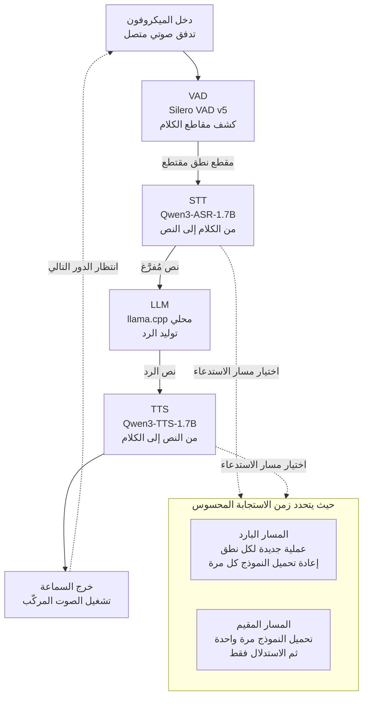

## لماذا تقرأ هذا

هذه المقالة موجّهة إلى المهندسين الذين يجب أن يشغّلوا واجهة صوتية على بنيتهم التحتية أو على الجهاز نفسه، من دون واجهات سحابية. أنت على شبكة معزولة، أو لا يمكن لصوت المكالمات أن يغادر محيطك، أو أن الفوترة لكل مستخدم على واجهات الصوت تدمّر اقتصاديات خدمتك، وعليك أن تقرّر ما إذا كانت الحزمة المحلية قابلة للتطبيق.

الخلاصة أولًا. في الوكيل الصوتي المحلي بالكامل، تنهار المحادثة لا لأن النماذج كبيرة، بل بسبب **بنية استدعاء تعيد تحميل النموذج إلى الذاكرة مع كل نطق**. في قياساتنا على حاسوب MacBook، وبإدخال الصوت نفسه إلى المحرك نفسه مع تغيير مسار الاستدعاء وحده إلى مسار مقيم، انخفض التعرّف على الكلام من 14.42 ثانية لكل نطق إلى 5.92 ثانية. لم نبدّل النماذج ولم نضف وحدات معالجة رسومية. أبقينا العملية حيّة فحسب.

## نظرة عامة

انتشر عرض توضيحي من مجتمع المطوّرين الصيني على منصة X خلال عطلة نهاية الأسبوع. وكيل صوتي يعمل على حاسوب محمول واحد من دون اتصال بالإنترنت ومن دون مفتاح واجهة برمجية، بحزمة معلنة بوضوح: Silero VAD v5 لتقطيع مقاطع الكلام، وWhisper للتعرّف، وllama.cpp المحلي لتوليد الرد، وQwen3-TTS للتركيب الصوتي. وكانت نقطة الجذب أن النماذج الأربعة جميعها حُشرت في جهاز واحد.

هذا التركيب ليس اختراعًا جديدًا. مشروع [speech-to-speech](https://github.com/huggingface/speech-to-speech) من Hugging Face يقدّم المسار الرباعي نفسه مفتوح المصدر، ومستودع whisper.cpp يحمل [طلبًا لدعم Silero VAD مدمجًا](https://github.com/ggml-org/whisper.cpp/issues/3003). كل الأجزاء متاحة علنًا والتجميع ليس صعبًا. لذا فالسؤال المثير ليس «هل يمكن بناؤه» بل **«هل يصل بعد بنائه إلى سرعة المحادثة؟»**

مقطع العرض لا يجيب عن ذلك. المقاطع تُحرَّر، والصمت بين الردود يُقتطع. لذلك أعدنا بناء البنية نفسها فوق الحزمة الصوتية المحلية التي تشغّلها ThakiCloud بالفعل، وقِسنا زمن الساعة الحقيقية لكل مرحلة. جهاز الاختبار حاسوب MacBook بمعمارية Apple Silicon (arm64)، وعمل النموذجان على خلفية PyTorch MPS. كل رقم أدناه مقيس على ذلك الجهاز، ولا يوجد فيه أي تقدير.

## ما هذه الحزمة

الوكيل الصوتي المحلي حلقة مغلقة من أربعة نماذج موصولة على التوالي. كل مرحلة تنتظر مخرجات سابقتها، لذا فإن زمن الاستجابة المحسوس هو مجموع المراحل الأربع.



تختلف إعادة بنائنا عن العرض الأصلي في نقطة واحدة. استخدم الأصل نموذج Whisper للتعرّف، بينما استخدمنا Qwen3-ASR-1.7B وهو معيارنا الداخلي. فقد وحّدت ThakiCloud مسار التفريغ النصي على هذا النموذج، واحتجنا إلى تثبيت أسماء الأعلام الكورية عبر تلميحات. أما التركيب فاستخدم عائلة Qwen3-TTS كما في الأصل. وكلاهما تحت رخصة Apache-2.0، فلا قيد على النشر التجاري، وهو أمر مهم عند اختيار حزمة محلية.

تثبيت أسماء الأعلام يُحدث فرقًا حقيقيًا. من دون تلميحات ينشطر اسم الشركة إلى صيغة مشوّهة، ومع تمرير الاسم الصحيح ضمن السياق يبقى سليمًا. وفي محاضر الاجتماعات الداخلية أو تسجيلات المكالمات المكتظة بالمصطلحات المتخصصة، يحدّد هذا الفارق كلفة المعالجة اللاحقة بأكملها.

## التثبيت والتكامل

المحرّكان موصولان مسبقًا في بيئتين افتراضيتين معزولتين داخل مستودعنا. فمحرّك التعرّف يثبّت إصدارًا محددًا من `transformers`، ووضعه في البيئة نفسها مع محرّك التركيب يكسر كليهما. لذلك نفصل المفسّرين، ويعيد سكربت الغلاف التنفيذ داخل البيئة الصحيحة.

```bash
# التعرّف على الكلام (Qwen3-ASR): بيئة افتراضية مخصّصة بتثبيت معزول لـ transformers
python3 -m venv --system-site-packages ~/.venvs/qwen-asr
~/.venvs/qwen-asr/bin/python -m pip install 'qwen-asr==0.0.6'

# تفريغ نصي مفرد: تحديد اللغة مع تثبيت أسماء الأعلام
python3 scripts/stt/stt_transcribe.py \
  --file scripts/stt/samples/ko_brand_test.wav \
  --language ko \
  --context "다키클라우드, 쿠버네티스" \
  --format json
```

يعيد التنفيذ عقد JSON ثابتًا. ولأن صيغة الخرج يملكها الكود لا النموذج، فإن التحليل في مراحل المسار اللاحقة لا يتذبذب.

```json
{
  "status": "ok",
  "engine": "qwen3-asr",
  "language": "Korean",
  "text": "안녕하세요. 다키클라우드 음성 인식 테스트입니다."
}
```

التركيب الصوتي له البنية نفسها. الاستدعاء المفرد والدُفعي منفصلان، والدُفعي يستقبل قائمة مقاطع دفعة واحدة.

```bash
# تركيب مفرد
python3 scripts/tts/qwen3_tts.py \
  --text "네, 다키클라우드 온프레미스 환경에서도 동일하게 동작합니다." \
  --lang ko --out reply.wav

# تركيب دُفعي: تحميل النموذج مرة واحدة ثم معالجة المقاطع تباعًا
python3 scripts/tts/qwen3_tts.py --spec tts_spec.json --outdir warm_tts/
```

جرت القياسات داخل بيئة معزولة من نوع git worktree، حتى لا تلوّث التجربة شجرة العمل الرئيسية مع بقاء السجلات داخل المستودع.

```bash
bash scripts/blog/impl_sandbox.sh setup local-voice-agent-stack
bash scripts/blog/impl_sandbox.sh run local-voice-agent-stack -- python3 <سكربت التجربة>
bash scripts/blog/impl_sandbox.sh teardown local-voice-agent-stack
```

## نتائج القياس الفعلية

قسّمنا العمل إلى ثلاث جولات. الأولى هي المسار البارد الذي ينشئ عملية جديدة لكل نطق كما يفعل العرض الأصلي، والثانية تجمع الاستدعاءات في دفعات، والثالثة مقارنة مباشرة بين مساري الدفعات.

**ظهر شيء غريب في الجولة الأولى مباشرة.** استغرق تفريغ مقطع مدته 2.72 ثانية زمنًا قدره 14.42 ثانية، بينما استغرق مقطع أطول بأربعة أضعاف تقريبًا (10.52 ثانية) زمنًا قدره 14.26 ثانية. زاد الصوت أربعة أضعاف وانخفض زمن المعالجة قليلًا. وبمعامل الزمن الحقيقي ينزل الرقم من 5.3 أضعاف إلى 1.36 ضعف. هذا الشكل يظهر حين تسيطر **كلفة ثابتة لكل استدعاء** لا كلفة الاستدلال.

وسلك التركيب الصوتي المسلك نفسه. استغرقت جملة من 33 حرفًا زمنًا قدره 77.57 ثانية، وجملة من 39 حرفًا زمنًا قدره 40.40 ثانية. والاستدعاء الأول بطيء على نحو لافت لأن كلفة جلب النموذج وتحميله تُضاف فوقه.

**في الجولة الثانية جمعنا الاستدعاءات في دفعات.** تحسّن التركيب كما هو متوقع. فمعالجة أربع جمل في عملية واحدة خفّضت معامل الزمن الحقيقي من 8.02 أضعاف إلى 4.70 أضعاف، بواقع 18.51 ثانية لكل نطق. أما التعرّف فبلغ 13.49 ثانية لكل نطق حتى في وضع الدفعات، أي ما يعادل تقريبًا 14.42 ثانية للاستدعاء البارد المفرد. لم تصنع الدفعة شيئًا.

عندها فتحنا الكود. كان خيار الدفعات في غلاف التعرّف لدينا ينشئ عملية فرعية جديدة لسكربت المحرّك مع كل عنصر. وفي المقابل كان المحرّك نفسه ينفّذ أصلًا مسارًا يحمّل النموذج مرة واحدة ثم يمرّ على القائمة، وكان الغلاف يلتفّ حول ذلك المسار.

**الجولة الثالثة هي المقارنة التي تختبر تلك الفرضية.** شغّلنا المقاطع الأربعة نفسها تباعًا عبر المسارين على الجهاز نفسه.

| المسار | الزمن الكلي لأربعة مقاطع | لكل نطق | ملاحظة |
|---|---|---|---|
| دفعة الغلاف (إعادة تحميل لكل عنصر) | 45.50 ثانية | 11.38 ثانية | إنشاء 4 عمليات فرعية |
| دفعة المحرّك (تحميل واحد) | 23.66 ثانية | 5.92 ثانية | تحميل النموذج مرة واحدة |

**الفارق 1.92 ضعفًا.** والزمن المهدور على إعادة التحميل بلغ 5.46 ثانية لكل نطق. النموذج والصوت والجهاز كما هي، ولم يتغيّر سوى مسار الاستدعاء.


*إلى اليسار زمن المعالجة لكل نطق في الاستدعاءات الباردة المفردة مقابل استدعاءات المحرّك المقيم، وإلى اليمين الزمن الكلي للمقاطع الأربعة نفسها عبر مساري الدفعات.*

هناك أمران يستحقان تسجيلًا أمينًا. أولًا، **لم نتمكّن من قياس مرحلة توليد الرد.** فلم يكن ollama ولا ملف llama.cpp التنفيذي مثبّتًا على هذا الجهاز، وبدلًا من اختلاق رقم سجّلناها كغير مقيسة. لذا فالأرقام أعلاه تغطي الطرفين الصوتيين للحلقة لا الرحلة الرباعية الكاملة. ثانيًا، تذبذب الزمن الكلي لمسار دفعة الغلاف بين الجولات، إذ بلغ 53.96 ثانية في الجولة الثانية و45.50 ثانية في الثالثة. وهذا تباين ناتج عن حِمل الحاسوب المحمول، وهو تحديدًا سبب وجوب إجراء المقارنة تباعًا داخل تنفيذ واحد.

ومع ذلك تبقى الخلاصة قائمة. فـ5.92 ثانية لكل نطق ليست بعد وتيرة محادثة طبيعية. ولكي يشعر الإنسان بأنها محادثة يجب أن يبدأ الرد خلال ثانية تقريبًا، بينما يلتهم التعرّف وحده ست ثوانٍ، ويبقى التوليد والتركيب بعده. فمقطع العرض السلس وزمن الرحلة الحقيقي أمران مختلفان.

## ماذا يعني هذا لـ ThakiCloud

تمسّ هذه التجربة منتجينا كليهما مباشرة.

**من منظور ai-platform، يجب تصميم أحمال العمل الصوتية كخدمات مقيمة.** تجدول منصتنا موارد وحدات المعالجة الرسومية عبر Kueue فوق Kubernetes وتخدم النماذج بنمط متعدد المستأجرين. وما تؤكده هذه التجربة هو سبب فشل التصميم الذي يشغّل النموذج الصوتي كمهمة منفصلة في كل مرة. فزمن إقلاع الحاوية وتحميل الأوزان يطغى على زمن الاستدلال، ما يعني أن التعرّف والتركيب ينتميان إلى خدمات استدلال مقيمة تحتفظ بأوزانها، لا إلى مهام دُفعية لكل طلب. وللسبب نفسه ينبغي أن تحدّد سياسة التوسّع التلقائي الحدّ الأدنى من النسخ بحسب كلفة البدء البارد لا بحسب عدد الطلبات.

وهناك شريحة عملاء تهمّها هذه الصورة أكثر من غيرها. فالمؤسسات المالية التي تتعامل مع تسجيلات المكالمات، والمستشفيات التي تتعامل مع الصوت السريري، والجهات الحكومية العاملة تحت فصل الشبكات، لا تستطيع إرسال بيانات صوتية إلى واجهة خارجية. الحزمة الصوتية داخل المؤسسة ليست خيارًا لديها بل متطلبًا. وتركيب تلك الحزمة من نماذج برخصة Apache-2.0 يعني تشغيل الخدمة بكلفة العتاد وحدها من دون فوترة قائمة على الاستهلاك.

**ومن منظور Paxis، ما ظهر هنا خلل تصميمي في طبقة استدعاء الأدوات.** فـPaxis هي سحابة ThakiCloud الأصلية للوكلاء، تعمل فوق ai-platform، وتعامل المهارات والأدوات كموارد من الدرجة الأولى، وتنفّذها في بيئات معزولة، وتمرّر كل تنفيذ عبر بوابات سياسة وسجلات تدقيق. وفي هذه البنية تنتقل طريقة إنشاء أداة واحدة للعمليات إلى زمن استجابة الوكيل بأكمله. وفي حالتنا لم تكن حقيقة أن خيار الدفعات يتفرّع داخليًا إلى عمليات فرعية ظاهرة من عقد الغلاف، ولم تنكشف إلا بعد القياس. والدرس العملي أن الأداة التي تغلّف نموذجًا ثقيلًا يجب أن تعلن في عقدها كم مرة تحمّل ذلك النموذج.

## الحدود والاعتراضات

لهذا القياس حدود واضحة.

أولًا، **مرحلة توليد الرد غائبة.** فنموذج اللغة عادةً أثقل مراحل الحلقة الرباعية، ولم نقسه، ولذلك لا ينبغي قراءة أرقام هذه المقالة على أنها زمن الرحلة الكاملة. فالرحلة الحقيقية تضيف زمن التوليد فوقها.

ثانيًا، **العتاد حاسوب محمول واحد.** وخلفية MPS تعود إلى المعالج المركزي في بعض العمليات، لذا فإن وضع النماذج نفسها على وحدة معالجة رسومية في مركز بيانات يغيّر الأرقام المطلقة تغييرًا كبيرًا. وما يقبل التعميم من هذه المقالة ليس الزمن المطلق بل الملاحظة البنيوية بأن كلفة التحميل تطغى على كلفة الاستدلال.

وثمة اعتراض وارد أيضًا. **بالنسبة إلى وكيل محلي شخصي قد لا تكون ست ثوانٍ مشكلة.** فإذا كانت الخصوصية هي الهدف ويستخدم الأداة شخص واحد بمفرده، فبضع ثوانٍ من الصمت محتملة. وسبب جاذبية العرض الأصلي ليس السرعة بل أن شيئًا لا يغادر الجهاز. غير أن هذا المنطق ينهار لحظة التحوّل إلى خدمة تجارية، لأن زمن الاستجابة في أحمال مثل الدعم أو مساعدة الاجتماعات، حيث يستخدمها كثيرون في آن واحد، يعني فقدان المستخدمين.

أخيرًا، **الخلل الذي أمسكنا به مشكلة تنفيذ في مستودعنا لا في المحرّك.** فمحرّك Qwen3-ASR كان يملك مسار التحميل الواحد منذ البداية، وغلاف تسهيلي فوقه هو ما التفّ حوله. ولا ضمان أن يقع فريق آخر يجمّع الحزمة نفسها في الفخ ذاته.

## الخلاصة

الوكيل الصوتي المحلي بالكامل تقنية قابلة للتجميع اليوم. كل الأجزاء متاحة علنًا، ورخصة Apache-2.0 لا تعيق النشر التجاري. المشكلة ليست في التجميع بل في التوصيل.

أكّد القياس بأنفسنا ثلاثة أمور. أولًا، في بنية الاستدعاء البارد تخرج نحو 14 ثانية لكل نطق ككلفة ثابتة بصرف النظر عن طول الصوت. ثانيًا، إبقاء النموذج مقيمًا ينزل بالمحرّك نفسه إلى 5.92 ثانية، أي فارق 1.92 ضعفًا. ثالثًا، تبقى ست ثوانٍ خارج وتيرة المحادثة، فمن يستهدف واجهة صوتية طبيعية يحتاج إضافةً إلى تسريع عتادي ومعالجة تدفقية.

إذا كنت تدرس اعتماد حزمة صوتية محلية، فهناك أمر واحد يسبق اختيار النموذج. **اقرأ الكود وتأكّد ما إذا كان الغلاف الذي تنوي استخدامه يحمّل النموذج مرة واحدة أم يعيد تحميله مع كل طلب.** ففي حالتنا ضاعف هذا الفارق وحده القياس بأكمله، وما كنا لنعثر على السبب لو بدّلنا النماذج.

## المصادر

- [huggingface/speech-to-speech](https://github.com/huggingface/speech-to-speech): مسار وكيل صوتي محلي مفتوح المصدر
- [whisper.cpp: دعم Silero VAD المدمج، الطلب رقم 3003](https://github.com/ggml-org/whisper.cpp/issues/3003)
- سجلات القياس: سجلات تنفيذ البيئة المعزولة الداخلية لدى ThakiCloud (من run-1 إلى run-3)
