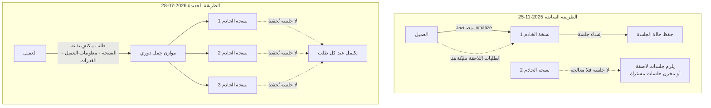

من شغّل خادم MCP فعلياً لا بدّ أنه تردّد مرّة وهو يحاول التوسّع أفقياً. فبمجرّد إضافة نسخة ثانية تصبح الجلسة هي المشكلة، إذ يجب أن يبقى العميل مثبّتاً على النسخة التي اتّصل بها أولاً، ما يعني جلسات لاصقة أو مخزن جلسات مشتركاً. [المواصفة الجديدة](https://blog.modelcontextprotocol.io/posts/2026-07-28/) التي نشرتها Anthropic في 28 يوليو 2026 أزالت هذا الافتراض من أساسه.

## لماذا تقرأ هذا

كُتب هذا المقال لمهندسي الواجهات الخلفية ومسؤولي المنصّات ممّن يشغّلون خوادم MCP بالفعل أو على وشك نشرها. الخلاصة أولاً: جوهر هذا التنقيح ليس إضافة ميزة بل نقل الحالة من البروتوكول إلى الحمولة، والنتيجة أن خادم MCP انتقل من خدمة تحتفظ بالحالة وتحتاج معاملة خاصة إلى خدمة HTTP عديمة الحالة عادية. ولا شيء ينكسر فوراً: الخوادم القائمة تواصل العمل، والبنود الملغاة تحمل مهلة لا تقلّ عن اثني عشر شهراً. لذا فالغرض العملي من هذا المقال ليس استجابة طارئة بل تحديد ما يدخل خارطة طريق الربع القادم.

## نظرة عامة

صُمّم MCP في البداية ليكون أقرب إلى بروتوكول لربط الأدوات المحلّية. وحين تكون الصورة تطبيق سطح مكتب يفتح اتّصالاً واحداً مع عملية محلّية ويتحاور عبره، تصبح الجلسة مفهوماً طبيعياً: يكفي تذكّر ما جرى التفاوض عليه ما دام الاتّصال حيّاً.

ظهرت المشكلة مع انتقال MCP إلى الخدمات البعيدة. ففي بيئة تقف فيها نسخ متعدّدة خلف موازن حِمل، ويزيد المقياس التلقائي النسخ وينقصها، ويشغّل وقت تشغيل Serverless حاويات لكل طلب، تصبح الجلسة كلفة. التوسّع يسهل حين يمكن لأي طلب الذهاب إلى أي نسخة، والجلسة تسلب هذه الحرّية تحديداً. عالج هذا التنقيح النقطة مباشرة، ويصفه عدد من التحليلات بأنه أكبر تنقيح منذ الإطلاق.

## ما الذي تغيّر

أكبر تغيير هو أن نواة البروتوكول صارت عديمة الحالة. وعملياً اختفى شيئان: مصافحة `initialize` التي كانت تُتبادَل عند فتح الاتّصال، ومفهوم الجلسة على مستوى البروتوكول نفسه.

وبدلاً من ذلك صار كل طلب مكتفياً بذاته. فنسخة البروتوكول ومعلومات العميل ونتيجة التفاوض على القدرات، وهي أمور كانت تُتبادَل مرّة واحدة عند الاتّصال، صارت تُرسَل مع كل طلب. يبدو ذلك إسرافاً للوهلة الأولى لكن العائد كبير: فمع غياب معرّف الجلسة يمكن لأي طلب الذهاب إلى أي نسخة. وبذلك يمكن وضع خوادم MCP خلف موازن حِمل دوري عادي بلا إعداد جلسات لاصقة وبلا مخزن جلسات مشترك.

طال التغيير طبقة النقل أيضاً. فنقل Streamable HTTP صار يشترط ترويستَي `Mcp-Method` و`Mcp-Name`. والهدف واضح: تمكين موازنات الحِمل والبوّابات ومحدّدات المعدّل من معرفة نوع العملية والتوجيه بناءً عليها دون فتح جسم الرسالة. ففي بنية تحتاج تحليل JSON لتمييز استدعاء أداة عن استعلام قائمة، لم يكن بوسع طبقة البنية التحتية أن تفعل شيئاً تقريباً.

## ما الذي يملأ الفراغ الذي تركته الجلسة

إزالة الجلسة تعني أن أحداً ما عليه القيام بدورها، وقد أضافت المواصفة آليتين.

الأولى هي Multi Round-Trip Requests. أُدخلت عبر SEP-2322 وتحلّ محلّ تدفّق SSE الطويل. وطريقة عملها كالتالي: حين يحتاج الخادم إلى سؤال العميل أثناء المعالجة، يعيد `InputRequiredResult` بدل الإمساك بالاتّصال. وتحمل هذه الاستجابة البنود المطلوبة `inputRequests` مع رمز غير شفّاف اسمه `requestState`. يجمع العميل الإجابات ثم يعيد إرسال الاستدعاء الأصلي مصحوباً بـ `inputResponses`. ولأن الحالة تعيش داخل الحمولة لا في اتّصال مُمسَك، فإنها تنسجم مع النموذج عديم الحالة.

الثانية هي الاكتشاف والتخزين المؤقّت. فالخادم الذي كان يعتمد على ترويسة الجلسة أو مصافحة `initialize` عليه الآن تنفيذ ميثود `server/discover`. كما تحمل نتائج القوائم والقراءة الحقلَين `ttlMs` و`cacheScope` للإفصاح عن قابليتها للتخزين المؤقّت. فحين يصبح كل طلب مكتفياً بذاته ينتهي بك الأمر إلى إعادة تبادل أشياء مثل قوائم الأدوات مراراً، وتلميحات التخزين المؤقّت تعوّض هذا التكرار. ودخلت إلى جانب ذلك تقوية للتفويض وإطار رسمي للامتدادات، مع تحديث حزم SDK من الفئة الأولى.

## ما الذي أُلغي وبمَ يُستبدَل

وسم SEP-2577 ثلاث ميزات بوصفها ملغاة: Roots وSampling وLogging. ومعها جرى إنهاء نقل HTTP with SSE القديم.

| البند الملغى | البديل الموصى به |
|---|---|
| Roots | معاملات الأدوات أو معرّفات الموارد URI أو الإعدادات |
| Sampling | الاستدعاء المباشر لواجهات مزوّدي النماذج |
| Logging | stderr وOpenTelemetry |
| نقل HTTP with SSE القديم | Streamable HTTP |

ثمّة منطق متّسق في اتّجاهات الاستبدال. فالميزات الثلاث جميعها لم تكن تستقيم إلا إذا استطاع الخادم أن يطلب شيئاً من جهة العميل أو أن يمسك الاتّصال مفتوحاً. وهذا الافتراض لا يصحّ في نموذج عديم الحالة، فنُقلت كل واحدة إلى مسار لا يحتاج حالة. وأوضح الحالات هو تسليم Logging إلى stderr وOpenTelemetry، إذ يُقرأ بوصفه حكماً بأن قابلية الملاحظة ليست مشكلة يحملها البروتوكول ما دامت لها معايير ناضجة أصلاً.

والإلغاء ليس إزالة. فقد جرى في هذا التنقيح تقنين سياسة إلغاء رسمية: يجب مرور اثني عشر شهراً على الأقلّ من صدور التنقيح الذي يَسِم ميزةً بالإلغاء قبل أن تصبح مؤهّلة للإزالة.

## متى ينبغي الترحيل

الجواب المختصر أنه لا شيء يستدعي إصلاحاً عاجلاً الآن.

فإن كنتم تشغّلون خادم v1 في الإنتاج فلا شيء ينكسر في 28 يوليو. الخوادم القائمة تواصل العمل، وللبنود الملغاة مهلة سنة. وتصميم التوافق حذر أيضاً: خادم v2 يستجيب لمصافحة `initialize` القديمة إلى جانب `server/discover`، فترقية الخادم لا تقطع العملاء العاملين بمواصفة 2025-11-25. وعلى الطرف الآخر يجرّب الوضع الافتراضي للعميل `server/discover` أولاً ثم يرتدّ إلى `initialize` عند الفشل. الطرفان مصمّمان لانتقال تدريجي.

لذلك يصبح الترتيب الواقعي كالتالي: تحقّقوا أولاً ممّا إذا كانت قاعدة الشيفرة تستخدم أياً من الميزات الثلاث الملغاة. فإن كنتم تستخدمون Sampling فهذا أكبر عمل، لأن تحويل بنية يستعير فيها الخادم نموذج العميل إلى استدعاء مباشر لواجهة المزوّد يغيّر جهة تحمّل الكلفة وموضع إدارة المفاتيح معاً، وهو أبعد من استبدال بسيط. أما Logging فأسهل نسبياً، وRoots يحتاج قراراً تصميمياً لأن أمامه ثلاثة مسارات بديلة.

## ماذا يعني هذا لمنتجات ThakiCloud

يمسّ هذا التغيير منتجَينا بطريقتين مختلفتين.

Paxis هو الحالة الأكثر مباشرة. فـ Paxis هو مستوى التحكّم Agent-Native Cloud لدى ThakiCloud، يعامل المهارات والأدوات والسياسات وسجلّات التدقيق بوصفها موارد من الدرجة الأولى ويربط الأدوات الخارجية عبر موصّلات MCP. والانتقال إلى انعدام الحالة يخفّض صعوبة تشغيل طبقة الموصّلات هذه: فمع اختفاء الجلسات لا يبقى سبب لتثبيت موصّل على نسخة خادم بعينها، وتقلّ الحالة الواجب استعادتها عند فشل إعادة الاتّصال. والأهمّ هو التوجيه القائم على الترويسات: فكشف `Mcp-Method` و`Mcp-Name` كترويستين يعني أن البوّابة تستطيع معرفة الأداة المُستدعاة دون فتح الجسم. وقلّما يوجد موضع أفضل لتعليق بوّابة سياسة: قرارات السماح والمنع على مستوى اسم الأداة، وحدود المعدّل، وسجلّات التدقيق، كلّها يمكن أن تنتقل من التطبيق إلى طبقة البنية التحتية.

أما ai-platform فتنتقل المسألة عنده إلى طوبولوجيا الخدمة. منصّة ai-platform من ThakiCloud بنية متعدّدة المستأجرين تشغّل النماذج والخدمات فوق Kubernetes، وخادم MCP عديم الحالة حِمل أسهل بكثير في هذه البيئة: فبلا إعداد جلسات لاصقة يمكن استخدام موازنة حِمل الخدمة الافتراضية كما هي، وبلا حالة تُحفَظ بين الطلبات يصبح التوسّع أفقياً وتقليصه حرّاً. ويُفتح خيار خفض النسخ إلى صفر عند انعدام حركة المرور. وفي البيئات الداخلية والسيادية تُضاف دلالة أخرى: إسقاط مخزن الحالة الخارجي الذي كان يُستخدم للجلسات يقلّل مكوّنات النشر، وقلّة المكوّنات تعني سطحاً أقلّ يجب شرحه في مراجعة الإدخال إلى الشبكات المغلقة.

## الحدود والاعتراضات

الانتقال إلى انعدام الحالة ليس مجّانياً.

فكون كل طلب مكتفياً بذاته يعني أيضاً أن كل طلب صار أثقل، إذ تتكرّر نسخة البروتوكول ومعلومات العميل ونتيجة التفاوض على القدرات في كل مرّة. ولهذا أضافت المواصفة تلميحات التخزين المؤقّت، لكن التخزين المؤقّت لا ينفع إلا إذا احترمه العميل فعلاً. والتنفيذ المتراخي يميل إلى زيادة عرض النطاق وزمن الاستجابة.

وإلغاء Sampling ليس استبدالاً بسيطاً. فقد كان لبنية يستعير فيها الخادم نموذج العميل مزايا حقيقية: لم يكن الخادم مضطرّاً لحيازة اعتمادات النموذج، وكان العميل يتحمّل كلفة الاستدلال. والانتقال إلى استدعاء واجهة المزوّد مباشرة يضع المفاتيح على الخادم وينقل الكلفة إليه أيضاً، وقد يكون هذا التغيير كبيراً بحسب نموذج النشر.

ثم تأتي مسألة التوقيت. فحتى لحظة الكتابة مضى على المواصفة أسبوع ونيّف. حُدّثت حزم SDK وأعلنت بوّابة سحابية واحدة على الأقلّ دعمها، لكن مدى سلاسة عبور المنظومة الأوسع مرحلة تدعم فيها المواصفتين معاً يبقى قيد الملاحظة. ولمراحل الانتقال كلفة دعم الطرفين، وهي كلفة تُدفَع موزّعة على اثني عشر شهراً.

## الخلاصة

إن اختصرنا هذا التنقيح في جملة، فهو نقل MCP من بروتوكول لربط الأدوات المحلّية إلى بروتوكول يعمل في البيئات الموزّعة. وهنا تُستعاد الخلاصة التي ذُكرت في المقدّمة: قرار واحد بنقل الحالة من البروتوكول إلى الحمولة أزاح الجلسات اللاصقة ومخازن الجلسات المشتركة وقيود التوسّع التلقائي دفعة واحدة، وثمن ذلك طلبات أثقل وميزات ملغاة تحتاج مسارات بديلة.

وما ينبغي فعله الآن مراجعة لا ترحيل. ابحثوا في قاعدة الشيفرة عن مواضع استخدام Sampling وRoots وLogging وسجّلوها في قائمة. فاثنا عشر شهراً تبدو مدّة طويلة لكنها تضيق حين تختلط بها بنود تحتاج تصميماً بديلاً. وفي المقابل، إن كنتم تصمّمون خادم MCP جديداً الآن فالقرار بسيط: لا تتبنّوا الميزات الثلاث الملغاة، وصمّموا على افتراض انعدام الحالة من البداية.

## المصادر

- [مواصفة 2026-07-28، مدوّنة Model Context Protocol](https://blog.modelcontextprotocol.io/posts/2026-07-28/)
- [حزم SDK التجريبية لمرشّح إصدار مواصفة 2026-07-28](https://blog.modelcontextprotocol.io/posts/sdk-betas-2026-07-28/)
- [مواصفة MCP 2026-07-28: ما تغيّر وما ينكسر، Stacktree](https://stacktr.ee/blog/mcp-2026-spec-changes)
- [Model Context Protocol يستعدّ للقطيعة مع ماضيه القائم على الحالة، The Register](https://www.theregister.com/devops/2026/07/23/model-context-protocol-prepares-to-break-with-its-stateful-past/5276722)
- [كيف يدعم AgentCore Gateway مواصفة MCP 2026-07-28، AWS](https://aws.amazon.com/blogs/machine-learning/how-agentcore-gateway-supports-the-mcp-2026-07-28-spec/)
