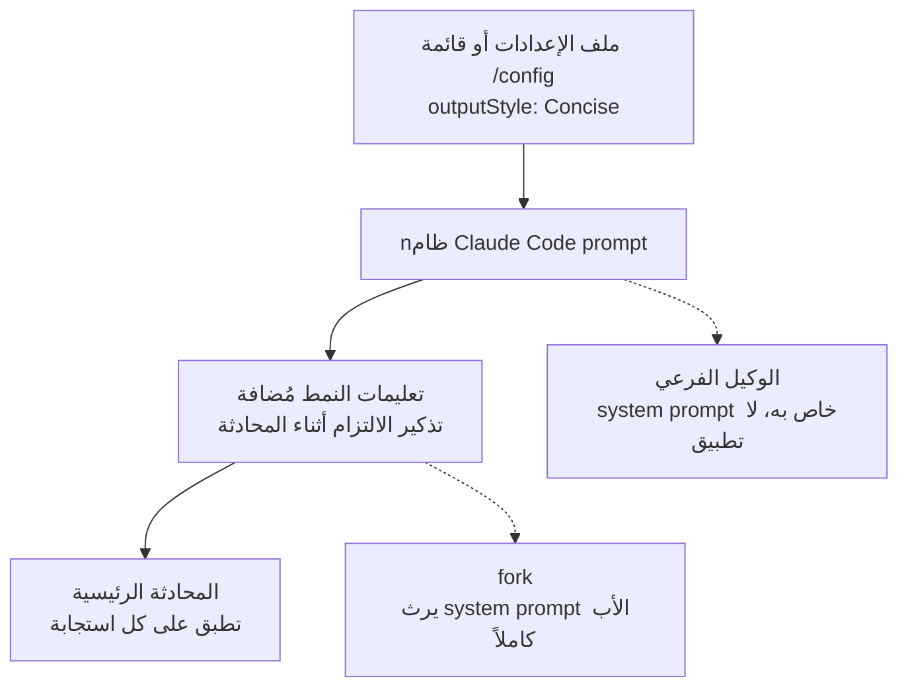

## لماذا تقرأ هذا

إن كنت تستخدم Claude Code يومياً، أو ترفع حلقات وكلاء بدون إشراف فوقه، فهذا هو المرجع لقرار "هل أفعّل Concise، وإلى أي مدى يمتد". في 20 أغسطس أضاف Claude Code v2.1.237 نمط Concise إلى أنماط output المدمجة. النتيجة الجوهرية أمامك: Concise أول ميزة مدمجة تقصّ طول الاستجابة على مستوى system prompt، ومهم في تصميمه ليس "أقصر" بل أين الخط. تقارير الأخطاء والتحذيرات الأمنية وتأكدات العمليات التدميرية تبقى كاملة. ولأنه يطبق على المحادثة الرئيسية فقط ولا يطبق على الوكلاء الفرعيين، قد تجد بيئات كثيرة الفرع أن التوفير يسقط من الحساب.

## نظرة عامة

أنماط output في Claude Code هي آلية تغيير الدور والنبرة والشكل الافتراضي للاستجابة. قبل هذا الإصدار، الأنماط المدمجة أربعة: Default (system prompt الحالية)، Proactive (ينفذ فوراً، ويعمل بفروض معقولة بدل التوقف عند القرارات الروتينية)، Explanatory (يقدم "Insights" تعليمية بين المهام)، و Learning (وضع learn-by-doing يدرج TODO(human) markers لتسهم بنفسك بقطع صغيرة من الكود). Concise النمط المدمج الخامس، والأول الذي يضبط طول الاستجابة كقيمة افتراضية.

صدر الإعلان من حساب @ClaudeDevs في 20 أغسطس بسطر: "يبدأ بالنتيجة، ويبقي الاستجابات قصيرة، ولا يزال يعطي التفاصيل الكاملة عند السؤال". الوثيقة الرسمية تحدد عقد سلوك Concise، وكيف تعمل أنماط output، وكيف تقارن بالميزات ذات الصلة.

## ما الذي يفعله Concise

بحسب تعريف الوثيقة، Concise يوجّه Claude إلى:

- البدء بالنتيجة. المقدمة والشرح (preamble, narration) تُحذف.
- إبقاء الاستجابات قصيرة افتراضياً. العمل المطلوب يُنفذ بنفس دقة نمط Default.
- الإجابة كاملة عند طلب شرح أو تفاصيل أكثر. القصير لا يعني معلومات أقل.
- إبقاء المعلومات الآمنة استثناءً. تقارير الأخطاء والتحذيرات الأمنية وتأكدات العمليات التدمرية تحتفظ بمحتواها كاملاً.
- يتطلب Claude Code v2.1.237 أو أحدث.

ذلك الاستثناء الأخير هو ما يجعل الميزة عملية. لو كان "أقصر" هو التوجيه الوحيد، لكان النموذج مهيأً لقص رسائل الأخطاء والتحذيرات أيضاً، وعند ذلك يصير output style موفراً للرمز يفقد معلومات الأمان. Concise يفصل صراحة ما يُقص (المقدمة، الشرح) عما لا يُقص (الأخطاء، الأمان، التأكدات)، وطلب "تفاصيل أكثر" منتصف المحادثة يستعيد العمق الكامل.

طريقتان للتفعيل. في الطرفية، شغّل `/config` واختر النمط تحت Output style؛ يُحفَظ الاختيار في `.claude/settings.local.json` على مستوى المشروع المحلي. أو اضبط حقل `outputStyle` في ملف الإعدادات مباشرة.

```json
{
  "outputStyle": "Concise"
}
```

تنبيه واحد تذكره الوثيقة صراحة: الإعداد لا يطبق فوراً. يسري بعد `/clear` أو عند بدء الجلسة التالية. أيضاً، الأمر المستقل `/output-style` أُبطل (deprecated) في v2.1.73 وأُزيل في v2.1.91؛ `/config` هو المسار الوحيد الآن.

## كيف يعمل

ميكانيكية output style من أربعة أجزاء.

1. يعدّل system prompt مباشرة. توجيهات النمط تُضاف إلى نهاية system prompt.
2. تذكير بالالتزام (adherence reminder) يصدر أثناء المحادثة. كل output style يدرج إشارة إعادة تأكيد كي يبقى Claude ملتزماً بالتعليمات.
3. أنماط المخصصة تحذف افتراضياً تعليمات هندسة البرمجيات المدمجة في Claude Code (تحديد نطاق التغيير، كتابة التعليقات، التحقق من العمل). اضبط `keep-coding-instructions` إلى true في frontmatter للإبقاء عليها. الأنماط المدمجة لا تعاني من هذا؛ Concise موثق بأنه يقوم بالعمل بنفس الدقة.
4. النطاق هو المحادثة الرئيسية. الوكلاء الفرعيون يعملون بـ system prompt خاص بهم، فلا يغير output style استجابتهم. الاستثناء fork، الذي يرث system prompt الأب كاملاً.



هذا الهيكل هو الإجابة عن "إلى أي مدى يمتد". في جلسة تفاعلية تستمر فيها بالبرمجة والمراجعة في محادثة واحدة، كل دور متأثر. في سير عمل تفرّع فيه وكلاء فرعيين للاستكشاف والتنفيذ والمراجعة، تبقى استجابات الوكلاء الفرعيين بالطول الافتراضي.

### إلى أين يذهب استخدام الرمز

الوثيقة صريحة بشأن الرمز. إضافة تعليمات إلى system prompt يزيد الرموز المدخلة، لكن prompt caching يخفف هذا التكلفة بعد أول طلب في الجلسة. أي أن كلفة output style على جهة الإدخال شبه مرة واحدة لكل جلسة، والفرق على جهة الإخراج. Explanatory و Learning ينتجان استجابات أطول من Default عمداً فيزيّدا الرمز الخارج، و Concise بالعكس. للأنماط المخصصة، الإخراج يعتمد على ما تأمر به النموذج أن ينتجه.

## Concise أم شيء آخر

لدى Claude Code عدة ميزات تغير سلوكه، وتقع على مستويات مختلفة. مقارنة الوثيقة، ملخصة:

| الميزة | طريقة العمل | متى تستخدمها |
|---|---|---|
| Output styles | تعدّل system prompt | تريد دوراً أو نبرة أو شكل استجابة افتراضياً مختلفاً كل دور |
| CLAUDE.md | تضيف رسالة مستخدم بعد system prompt | على Claude أن يعرف دائماً اتفاقيات مشروعك وسياق قاعدة الكود |
| --append-system-prompt | تضيف إلى system prompt دون حذف | إضافة لمرة واحدة لنداء واحد |
| Agents | وكيل فرعي يعمل بـ system prompt ونموذج وأدوات خاصة | تحتاج مساعداً منفصلاً النطاق لمهمة مركزة |
| Skills | تدرج تعليمات مهمة عند الاستدعاء أو الارتباط | لديك سير عمل قابل لإعادة الاستخدام |

خط الفصل هو أين، وبأي نطاق، ولأي مدة. أنماط output تغيّر system prompt ذاته وتطبق على الجلسة كلها. CLAUDE.md تترك system prompt وتضع رسالة مستخدم فوقه؛ ملفات قواعد الأسلوب مثل caveman-mode rule في هذا المستودع تسلك هذا المسار. --append-system-prompt لعملية واحدة، و skills عند الطلب.

النقطة المثيرة: دفع "أجب بإيجاز" عبر CLAUDE.md أو ملف قواعد يضيف نصاً مقيماً دائراً في سياق كل جلسة، وعند تصادم هذا التوجيه مع إصدار النموذج أو تعليمات أسلوب أخرى، لديك رافعة أضعف من مفتاح `/config` الواحد للنمط المدمج. Concise يرفع هذا التوجيه إلى مستوى المنتج ويضمن استثناء الأمان (الأخطاء، الأمان، التأكدات) في الوثيقة الرسمية.

## أين يقف Concise في حلقات الوكلاء

للتشغيل بدون إشراف، output styles مهم في ثلاثة مواضع.

**أولاً، الرمز الخارج هو وحدة الفوترة.** من منظور محرك الخدمة، الإدخال يمتصه التخزين المؤقت جزئياً، لكن كل رمز خارج يُحاسب كما هو. في الجلسات الطويلة، المقدمة والشرح لكل دور يتراكمان مع طول السياق. Concise يقصّ هذا المحور بالضبط.

**ثانياً، في التصاميم متعددة الوكلاء قد يسقط التوفير من الحساب.** لأن الوكلاء الفرعيين يعملون بـ system prompt خاص، جلسة رئيسية بـ Concise تستمر في استقبال استجابات الوكلاء الفرعيين بالطول الافتراضي. في سير عمل تنتج فيه الوكلاء الفرعيون الجزء الأعظم من المخرجات (fan-out للاستكشاف، تفويض التنفيذ)، التوفير الفعلي من "فعّلت Concise" أقل مما تقترح الوثيقة. الـ fork المورّث من الأب هو المسار النادر حيث يُطبق.

**ثالثاً، أرض المعلومات الآمنة تصميم لا رقابة.** في خطوط الأنظمة الآلية، نموذج يقصّ تقارير الأخطاء يصعّب التشخيص، والتحذيرات الأمنية المقصوصة تكسر البوابات. فصل Concise "قصير" عن "يكتمل" على مستوى الـ prompt يضع أرضاً موثقة تحت ميزة توفير الرمز. للمنظمات التي تشغّل أساطيل وكلاء داخلية، تلك الأرض هي المعيار الأول لاختيار output style.

أساطيل الوكلاء الداخلية لدى ThakiCloud كانت تسلك الاتجاه ذاته يدوياً قبل هذا الإصدار: ملف قواعد أسلوب (قواعد تفرض إجابات موجزة، النتيجة أولاً، بلا زينة) بقي مقيماً في طبقة CLAUDE.md. التباين مع Concise المدمج واضح. القواعد اليدوية تعيش في سياق كل جلسة ولا تملك إلا طلب الالتزام باستثناءات الأمان؛ النمط المدمج يطبق على مستوى system prompt مع استثناءات موثقة. Concise هو الهدف ذاته مرفوعاً إلى مستوى المنتج، وملف القواعد يبقى طبقة صالحة عندما تريد المنظمة قيداً أقوى ومقاماً محلياً.

## آثار على منتجات ThakiCloud

Concise ميزة صغيرة، لكنها تقف في موضع معنوي لخطي المنتجات.

**عدسة Paxis.** اقتصادات سير الأعمال المؤتمتة من Paxis تتوقف في النهاية على سعر الرمز. لو أضاف الوكيل المقدمة والشرح إلى كل دور، تلك التكلفة تُفوتر بالرمز لا بالسير. output style يوثّق "لا تقصّ المعلومات الآمنة" يعني أن "التوفير" و"الثقة" يمكن فصلهما في قيمة إعداد موثقة. من منظور تنسيق سير عمل Paxis، عدم التغطية للوكلاء الفرعيين هو القصة ذاتها: نطاق التوفير يحسبه فقط من يعرف هيكل الوكلاء، وجعل ذلك الهيكل مرئياً هو دور Paxis.

**عدسة ai-platform (Metis).** في الرموز التي تخدمها Metis، الرمز الخارج هو المحور النقي للفوترة الذي لا يمتصه التخزين المؤقت. إذا زادت Explanatory و Learning الإخراج ونقصت Concise، فالنموذج ذاته على الإدخال ذاته يفوت عدد رموز مختلفاً لكل طلب بحسب output style. من منظور الخدمة، output style يمكن أن يصير متغير كلفة في مستوى متغير اختيار النموذج. في بنية تخلق فيها الخدمة منخفضة الكلفة اقتصادات سير الوكلاء، تجريد طبقة طول الاستجابة إشارة أن متغيراً آخر في تلك البنية صار قابلاً للإدارة.

## حدود ونظرة معاكسة

- **الوكلاء الفرعيون غير مغطى.** أكبر حد عملي. كما توضح الوثيقة، output styles للمحادثة الرئيسية فقط، وفي سير عمل كثيف الوكلاء الفرعيين "فعّلت Concise" لا تتحول إلى توفير. حتى يتغير ذلك، موازنات الرموز متعددة الوكلاء يجب أن تعامل طول استجابة الوكلاء الفرعيين منفصلة.
- **هي تحكم على مستوى الـ prompt.** Concise يضمن "قصير" بالتوجيه لا بالسقف الصلب. قد تتجاهل بعض الأدوار التعليمات أو تتبعها جزئياً. خطوط الأنظمة التي تحتاج أسقف رقمية للرمز تحتاج max_tokens أو نظيره كطبقة منفصلة.
- **لا أرقام توفير منشورة.** الوثيقة و changelog يحددان الاتجاه (الإخراج ينقص) ولا معدل نقص رمز لالتفاف إلى Concise. "بكم ينقص" رقم تعيد قياسه منظماتك على أعمالها.
- **فخ النمط المخصص.** ميكانيكية output style ذاتها تحذف تعليمات هندسة البرمجيات المدمجة عند كتابة نمط مخصص (`keep-coding-instructions` افتراضه false). نمط "إجابات بسيطة" مخصص قد يسقط تعليمات ذات صلة بالجودة بصمت. هذا الفخ لا يخص Concise المدمج.
- **تأخر التفعيل بـ `/clear`.** تغيير الإعداد يسري بعد `/clear` أو في الجلسة التالية لا منتصف الجلسة. سكريبتات النشر تقلب output style وتتوقع أثراً فورياً ستواجه سلوكاً غير متوقع.

## الخلاصة

Concise هو الإصدار الذي حصلت فيه ميكانيكية output style على أول حالة مدمجة لـ "طول الاستجابة". ثلاثة أشياء تؤخذ.

أولاً، خط القص صريح. المقدمة والشرح تذهب؛ تقارير الأخطاء والتحذيرات الأمنية وتأكدات العمليات التدميرية تبقى كاملة؛ طلب "تفاصيل أكثر" يستعيد الإجابة الكاملة. ثانياً، النطاق المحادثة الرئيسية. الوكلاء الفرعيون مستثنون، والـ fork مورّث. في بيئات الوكلاء المتعددين يجب أن تعرف هذا النطاق قبل أن تحسب شيئاً. ثالثاً، موقعه بين CLAUDE.md و skills: مستوى system prompt لكل دور، لكنه ليس نص اتفاقية مشروع، ما يبقيه بعيداً عن كلفة السياق المقيم وتصادم التعليمات.

الخطوة العملية بسيطة. على Claude Code v2.1.237 أو أحدث، بدّل Output style إلى Concise في `/config`، شغّل `/clear`، واستخدمه لجلسة. تأكد بيدك أن الاستجابات قصرت والأخطاء والتحذيرات بقيت كما هي؛ تلك الجلسة هي طريقة التعريف الصحيحة للميزة. إن كنت تفرّع وكلاء كثيرين، لا تحسب ميزانيتك كلها من توفير الجلسة الرئيسية. ذلك هو الدرس العملي الأعظم الذي يتركه هذا الإصدار.

## المصادر

- [Claude Code changelog v2.1.237](https://github.com/anthropics/claude-code/blob/main/CHANGELOG.md) (إضافة output style "Concise" المدمج)
- [وثيقة Claude Code الرسمية: Output styles](https://code.claude.com/docs/en/output-styles) (الميكانيكية، استخدام الرمز، مقارنة الميزات ذات الصلة)
- منشور الإعلان: [@ClaudeDevs](https://x.com/ClaudeDevs/status/2090245922685063634) (20 أغسطس)