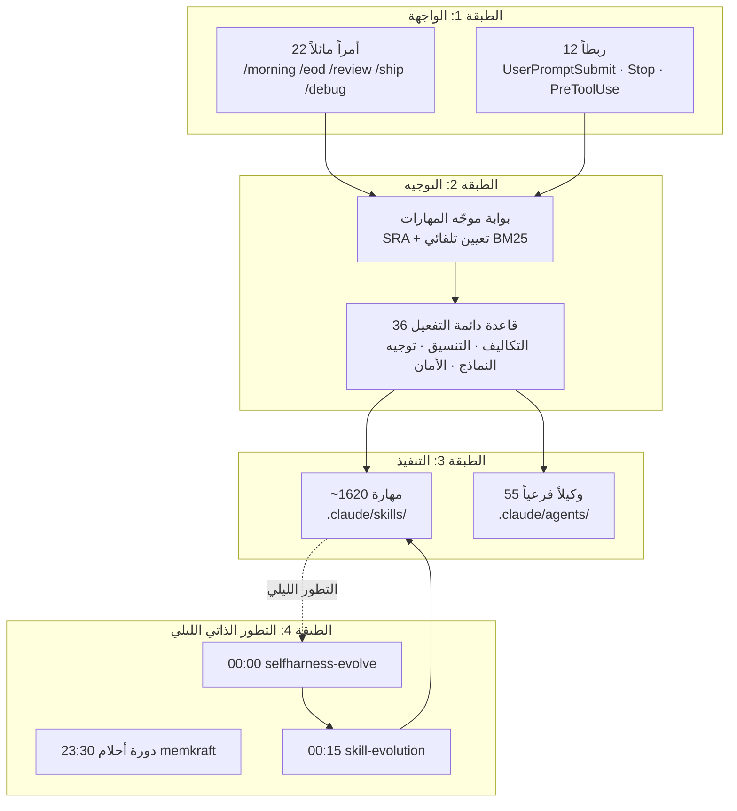

## نظرة عامة: كيف يتمكن شخص واحد من إدارة هذا الحجم؟

يتكرر هذا السؤال كثيراً. نحو 1620 مهارة، 55 وكيلاً فرعياً، 36 قاعدة دائمة التفعيل، 22 أمر مائل (slash command)، و12 ربط (hook). في الليل، تُشغّل وظائف launchd غير المراقبة حلقات تطورها الذاتي. يتزامن جهازان -- جهاز المنزل وجهاز المكتب -- عبر فرع main واحد. مهندس واحد فقط يُدير كل هذا بمفرده.

تبدو الأرقام مستحيلة للوهلة الأولى. لكن هذه الأرقام ليست أشياء تحتاج إلى إدارة؛ فالنظام يستخدم معظمها من تلقاء نفسه. بينما يكتب المهندس الكود، يختار موجّه المهارات المهارة المناسبة؛ وبينما ينام، تُنقّح حلقة التطور المهاراتِ؛ وتحافظ ضوابط التكاليف على الميزانية.

السر ليس في إدارة الحجم، بل في **تصميم الحجم ليُدير نفسه بنفسه**. المهارات تُطور المهارات، والوكلاء يُوجّهون الوكلاء، وحلقات المراجعة تُحسّن اختيار النماذج. مهمة الإنسان هي تحديد الاتجاه، ورصد الإشارات الشاذة، وإصدار الأحكام الرئيسية فحسب.

هذه المقالة هي المرة الأولى التي يُكشف فيها عن منظومة التشغيل الكاملة دفعةً واحدة. وتشرح كيف يتشابك توجيه المهارات والتطور الليلي وضبط التكاليف في نظام تشغيلي واحد -- وكيف أصبحت هذه التجربة المصدر الأصلي لمنتج ThakiCloud Paxis.

---

## لمحة عامة عن المكدس: بنية الأتمتة في 4 طبقات

ينقسم المكدس الكامل إلى أربع طبقات.

**الطبقة 1 (الواجهة)** هي نقطة التواصل المباشر مع الإنسان. تُشكّل الأوامر المائلة مثل `/morning` و`/eod` و`/review` و`/ship` و`/debug` إيقاع اليوم. تعمل الربطات بهدوء في المساحات البينية. ربط `UserPromptSubmit` يُشغَّل قبل كل طلب، أما ربط `Stop` فيتحقق من ملفات العلامات عند انتهاء المهمة.

**الطبقة 2 (التوجيه)** هي دماغ هذا المكدس. من بين 1620 مهارة، يجب إيجاد المهارة المناسبة للطلب الحالي. بوابة موجّه المهارات تُؤتمت هذه المهمة. المبادئ التفصيلية مشروحة في [توجيه المهارات SRA](/ar/dev/skill-ecosystem-routing-sra/).

**الطبقة 3 (التنفيذ)** هي حيث يجري العمل الفعلي. تُغلّف المهارات سير العمل القابلة للتكرار، فيما يتولى الوكلاء الفرعيون التنفيذ المتوازي والفصل بين الأدوار. يتوزع الوكلاء الخمسة والخمسون على 8 فرق بنية محوَر وأطراف: البحث، والمحتوى، والاستخبارات الاستراتيجية، والحوادث، وشحن الكود، والمعرفة، والاجتماعات، والمبيعات. لكل فريق مُنسّق تحته وكلاء فرعيون متخصصون.

**الطبقة 4 (التطور الذاتي الليلي)** هي الميزة التمييزية الجوهرية لهذا النظام. بينما ينام المهندس، يُحسّن المكدس نفسه بنفسه.

---

## التوجيه في كل لحظة: ما تفعله بوابة المهارات

جميع مهارات 1620 موجودة تحت `.claude/skills/`، لكنها لا تُحمَّل كلها في كل دورة. فعل ذلك وحده كفيل بتبديد الميزانية على تكلفة السياق. إذا افترضنا أن وصف المهارة الواحدة يُكلّف 300-500 رمز [تقديري]، فإن تحميلها جميعاً يستهلك مئات الآلاف من الرموز في كل دورة. عوضاً عن ذلك، يُضيّق `skill-router-gate.py` -- المرتبط بربط `UserPromptSubmit` -- المرشحين عبر بحث BM25 ويُدرجهم في السياق.

تؤدي البوابة ثلاثة أدوار.

أولاً، **التصفية المسبقة**. الدورات التي لا تحتاج إلى مهارة -- التحيات، والتأكيدات، والأوامر الصرفة -- تمر فوراً دون أي استهلاك للرموز. تشغيل BM25 على كل طلب سيكون هو نفسه تكلفةً.

ثانياً، **حقن المرشحين**. عند تصنيف دورة ما على أنها تنفيذية، يُضاف كتلة `🧭 مرشحو موجّه المهارات` إلى السياق. يرى النموذج هذا التلميح ويختار المهارة المناسبة. تُقصر المرشحات على 5 مرشحين، وإذا تعادل مرشحان أو أكثر، يُطلب من المستخدم التأكيد.

ثالثاً، **منع التطابق القسري**. لا تُختار مهارة لمجرد أن اسمها يتداخل جزئياً. إذا كانت أعلى درجة دون عتبة التأهل، يُمرَّر التنفيذ إلى المسار الأصلي. في بيئة من 1620 مهارة، أكثر حالات الفشل شيوعاً هي تدخّل مهارة غير ذات صلة كضجيج. مبادئ تصميم هذا الموجّه التفصيلية مشروحة في [توجيه المهارات SRA](/ar/dev/skill-ecosystem-routing-sra/).

تنطبق القواعد الدائمة البالغة 36 قاعدة على جميع المهام بمعزل عن التوجيه. ضبط التكاليف، وحتمية تنسيق Slack، وجدول توجيه النماذج، وانضباط رموز الإخراج -- هذه القواعد لا تُطلب من النموذج بل يُطبّقها الكود.

على سبيل المثال، جاء حقل `quality_gate` في مهارة محتوى مجمّع بثلاثة أشكال مختلفة في مرة من المرات: `"passed"` و`True` و`{...}`. أعطِ النموذج حرية وسيُخرج Sonnet نتائج مختلفة في كل استدعاء. الآن يقيس الكود مباشرةً بـ`len()` ويُجري فحوصات العتبات. لا يُوثق بالأرقام التي يُبلّغ عنها النموذج ذاتياً.

الأوامر المائلة البالغة 22 أمراً هي نوع من الماكروهات تعمل فوق هذا التوجيه. يُشغّل `/morning` مزامنة git لبداية اليوم، ثم إيجاز Google Workspace، ثم خط أنابيب الأسهم بالتسلسل. يجمع `/eod` مزامنة Cursor وإرسال الإصدار وملخص Slack. لا يحتاج الإنسان إلى تذكّر الترتيب في كل مرة.

---

## تطور كل ليلة: حلقة launchd الليلية

هذا هو الجزء الأكثر إثارة للدهشة. بينما ينام المهندس، تعمل ثلاث وظائف launchd بالتسلسل.

**23:30 دورة أحلام memkraft.** تستخلص الأفكار والدروس والأنماط من محادثات اليوم وتعكسها على بنية الذاكرة. دون أن يُسجّل المهندس أي شيء يدوياً، يُحوّل النظام تجربة اليوم إلى سياق الغد.

**00:00 selfharness-evolve.** يُحلّل مقاييس أداء المهارات الحالية ويُقيّم جودة الأوصاف، وتعارضات المشغّلات، وتكرار الاستخدام. يُحدد المهارات التي تحتاج إلى تحسين ويُولّد مقترحات التحسين. تعمل هذه الوظيفة دائماً على launchd المحلي، وليس على routine السحابة أبداً. في صناديق رمل السحابة، لا يمكن لـbash أن يعمل بشكل صحيح وقد تُزوَّر البوابات.

**00:15 skill-evolution.** تُطبّق ما اقترحه selfharness. تُنقّح أوصاف المهارات، وتُولّد مهارات جديدة عند اكتشاف أنماط جديدة، وتُنظّف المحتوى الذي لم يعد صالحاً.

المبادئ التفصيلية لحلقة التطور الذاتي مشروحة بشكل منفصل في [هارنس التطور الذاتي الليلي](/ar/research/self-evolving-harness-nightly/).

ثمة مبدأ تصميم مهم هنا. هذه الوظائف الليلية مبدعة في محتوى المهارات، لكن الكود يمتلك التنسيق. لا يكتب النموذج JSON يدوياً ولا يُبلّغ ذاتياً عن أحكام الجودة. يقيس الكود بـ`len()`، ويتحقق بالتعبيرات النمطية (regex)، ويُعيد إرسال أي شيء يقل عن العتبة. الطريقة الوحيدة لجعل نموذج من مستوى Sonnet يُنتج تنسيقاً متسقاً عبر مهام الدُّفعات المتكررة هي إزالة الحرية منه.

---

## منع تسرب التكاليف: ضوابط أمان من 4 طبقات

كان ثمة يوم وصلت فيه تكاليف الذكاء الاصطناعي اليومية إلى 705 دولارات. جلسة مراقبة واحدة (9.4 ساعات، 1145 دورة) استأثرت بـ54% من الإجمالي. ضوابط الأمان الأربع الطبقات المستخدمة اليوم ظهرت من ذلك الحادث. الأرقام التفصيلية منشورة في [ضوابط توجيه تكاليف LLM](/ar/llmops/llm-cost-routing-guardrails/).

**الطبقة 1: جدول توجيه النماذج.** الاستكشاف وقراءة الملفات وgrep تستخدم haiku (~1x). الترميز والمراجعة وكتابة الاختبارات تستخدم sonnet (~4x). الهندسة المعمارية والاستدلال متعدد الخطوات المعقد يستخدمان opus (~19x). يجب تحديد معامل `model` دائماً عند استدعاء أداة Agent. الإغفال يُشغّل النموذج على النموذج الافتراضي للجلسة (أعلى تكلفة). الوكلاء الفرعيون من نوع haiku لا يُولّدون وكلاء فرعيين إضافيين أبداً. إذا لم تُحلّ مهمة بواسطة haiku، فإن المهمة قد صُنّفت بشكل خاطئ.

**الطبقة 2: قاعدة 2K رمز.** أي استدعاء أداة متوقع أن يُعيد أكثر من 2K رمز يُفوَّض إلى وكيل فرعي. يقرأ الوكيل الفرعي ويعالج ويُعيد الملخص فقط. يحتفظ السياق الرئيسي بالملخص ومسار الملف فحسب. تُضغط مصفوفات JSON الكبيرة بأكثر من 50% باستخدام headroom SmartCrusher قبل إدراجها. استجابات أدوات MCP هي المصدر الخفي الأكبر لتكلفة السياق. قراءات صفحات Playwright، واستجابات GitHub API، وقراءات خيوط Notion يمكنها إفراغ آلاف الرموز دفعةً واحدة. أي شيء يتجاوز 200 سطر يُحفظ في `/tmp/ctx-{task-id}.json`، ولا يصل إلى السياق الرئيسي سوى المخطط والعيّنة.

**الطبقة 3: حظر الاستطلاع الدوري.** تشغيل مراقبة على مدار 24 ساعة كحلقة ساخنة لـClaude محظور. مهام الاستطلاع الدوري كلقطات الأسعار ومقارنات الحالة وفحوصات الصحة تعمل كوظائف cron من launchd وترسل تنبيه Slack فقط عند اكتشاف شذوذات. يحقق ذلك نفس الأثر بتكلفة صفر دولار لـClaude. الجلسة التي استمرت 9.4 ساعات واستهلكت 381 دولاراً أرست هذا المبدأ.

**الطبقة 4: تصعيد المراجعة الراجعة.** تبدأ المهارات المجدولة بـsonnet افتراضياً. يتتبع `skill_model_policy.json` النموذج وسلسلة الفشل لكل مهارة. إذا فشلت مهارة `max_fail_streak` مرات متتالية، تُرقَّى تلك المهارة وحدها تلقائياً إلى opus ويُرسل إشعار إلى Slack `#h-report`. تُعيد دورة العمل النظيفة ضبط السلسلة على الصفر. بدلاً من ترقية كل شيء إلى opus، تُرقَّى فقط المهارات التي ثبت عملياً أن لديها مشكلة في الجودة.

مع تشابك هذه الطبقات الأربع، يبقى يوم العمل النموذجي الآن مسيطراً عليه بـsonnet. يُنتج نفس حجم المخرجات بتكلفة أقل بكثير. الأرقام الكاملة لتصميم ضبط التكاليف منشورة في [ضوابط توجيه تكاليف LLM](/ar/llmops/llm-cost-routing-guardrails/).

تُعدّ نظافة السياق مهمة أيضاً. قراءة نفس الملف مرات عديدة خلال جلسة واحدة يُراكم رموز `cache_read`. إضافة بادئة `cd` غير ضرورية إلى الأوامر ذات المسارات المطلقة يفعل الشيء ذاته. تعمل أوامر `git` مباشرةً على شجرة العمل الحالية، لذا لا تحتاج إلى `cd` أبداً. تتراكم هذه العادات الصغيرة لتخفض تكلفة الجلسة بشكل ملحوظ [تقديري].

---

## هذا هو المنتج: Paxis ومنصة الذكاء الاصطناعي

أسلوب التشغيل المنفرد هذا هو بالضبط ما تُحوّله ThakiCloud إلى منتج تحت اسم Paxis. الهدف جعل وقت تشغيل الوكيل المستقل وبيئة المهارات والتطور الذاتي والحوكمة وضبط التكاليف متاحةً لأي مهندس.

منظومة التشغيل الموصوفة حتى الآن تُثبت شيئين.

الأول هو **أن هذا الأسلوب التشغيلي يعمل فعلاً**. ليس مفهوماً نظرياً أو ورقة بحثية -- بل نظام يستخدمه مهندس منفرد يومياً. حلقة التطور الليلية تعمل، وضوابط التكاليف تُقيّد الإنفاق، والأوامر المائلة تُنشئ إيقاع اليوم.

الثاني هو **أن هذا الأسلوب قابل للتوسع**. المهندس المنفرد الذي يُدير 1620 مهارة لا يفعل ذلك بلمس كل مهارة يدوياً. النظام يتطور بنفسه، والموجّه يجد المهارة الصحيحة، وضوابط الأمان تحمي الميزانية. هذا الهيكل يعمل بالطريقة ذاتها عند التوسع إلى فريق.

Paxis هو عمل تحويل هذه التجربة إلى منصة. يُعرّف المشغلون المهارات، ويُهيّئون الوكلاء، ويضعون سياسات التكاليف -- ثم يتولى وقت التشغيل الباقي. تُضيف منصة الذكاء الاصطناعي فوق ذلك تنسيق أحمال العمل القائم على K8s (Kueue وArgoCD).

---

## القيود والدروس المستفادة

للصراحة التامة.

**1620 مهارة هي أيضاً دين تقني.** المهارات المُتقنة أصول، لكن المهارات المهملة أشباح تستهلك رموز السياق. حين تكون أوصاف المهارات متشابهة جداً، يصاب الموجّه بالارتباك. حلقة التطور الليلية تُنظّف هذا الدين، لكن الأساس يقتضي تحديد intent وboundary واضحين عند إنشاء المهارة.

**التطور الذاتي الليلي بطيء.** يستغرق الأمر أسابيع لتراكم تغييرات ذات معنى خلال ليلة واحدة. التحولات الجذرية في الاتجاه تستلزم تدخلاً بشرياً مباشراً. التطور الذاتي يُحسّن تدريجياً في الاتجاه الحالي -- لا يُغيّر الاتجاه.

**ضوابط التكاليف ليست مثالية أيضاً.** إذا أفرغت أداة MCP آلاف الرموز في استجابة واحدة، يتلوث السياق فوراً في غياب قواعد الصندوق الرملي. لا تتكاثف ضوابط الأمان في لحظة التصميم، بل باستخلاص الدروس بعد وقوع المشكلة وتضمينها.

**المزامنة بين أجهزة متعددة تتطلب انضباطاً.** إذا تفرّق جهاز المنزل وجهاز المكتب على فرع ميزات، فإن تحديثات الأمس على جهاز المنزل لن تظهر في جلسة المكتب اليوم. في الواقع، جرت جلسة على فرع ميزات يتأخر 25 إيداعاً عن origin/main، فلم تنعكس تعليمات الاستراتيجية المطبّقة اليوم السابق مما أفضى إلى أحكام خاطئة. كل العمل يجري على main، وكل مهمة مكتملة يجب رفعها (push) فوراً. بسيط، لكن إهماله يُفضي إلى اتخاذ قرارات بناءً على كود قديم. أصبحت عادةً تشغيل `git log --oneline HEAD..origin/main` قبل بدء أي جلسة.

**من السهل الاستهانة بتكلفة الفرصة للمهارات.** إنشاء مهارة يبدو فوراً كإضافة أصل. لكن المهارة، لحظة دخولها الفهرس، تدفع تكلفة سياق الوصف في كل جلسة. مهارتان متشابهتان تُربكان الموجّه. قبل إنشاء مهارة، يجب أن يكون السؤال الأول: "هل سيُخطئ الوكيل فعلاً بدونها؟" إذا كانت الإجابة لا، فسطر قاعدة واحد يكفي.

---

منظومة التشغيل الموصوفة في هذه المقالة لم تُبنَ في يوم واحد. إنها تراكم مواجهة المشكلة، واستخلاص الدرس، وتضمينه في قاعدة أو مهارة. الدروس المسجّلة بصيغة `2026-XX-XX حادثة:` متناثرة في جميع ملفات القواعد البالغة 36 ملفاً. قراءة رأس أي قاعدة تُخبرك فوراً عن أي عطل نشأت منه.

إذا أردت تشغيل فريق ذكاء اصطناعي منفرد، فأول ما يجب الاستثمار فيه هو جودة المهارات وضوابط التكاليف. ليس الميزات البراقة -- الرافعة الحقيقية هي التوجيه الذي يعمل بصمت وحلقة التطور التي تُحسّن نفسها ليلاً. أرجو أن تكون هذه المقالة مرجعاً مفيداً لمن يفكر في أتمتة بهذا الحجم.

في المقالة التالية، أعتزم تناول مبادئ تصميم بيئة مهارات Paxis -- ولا سيما سبب أهمية التمييز بين الهارنس الرفيع والمهارة السمينة.
