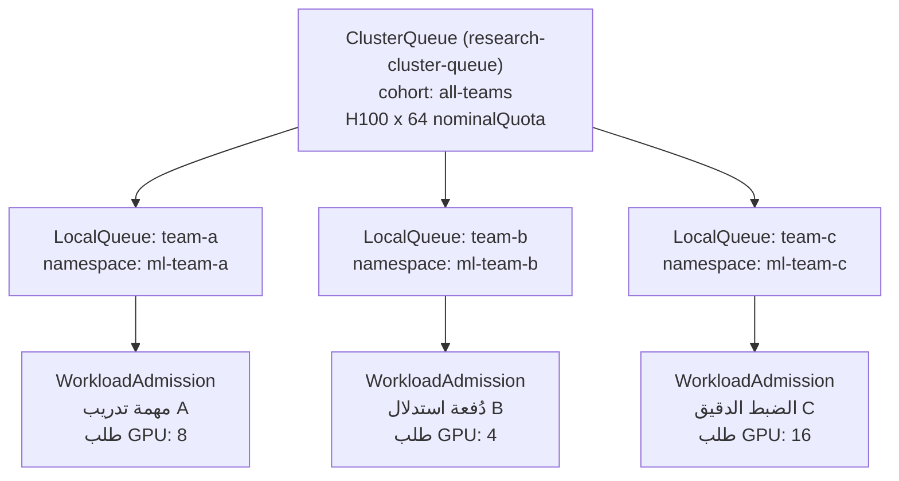

## نظرة عامة

تواجه كل منظمة تُشغِّل مجموعة GPU مؤسسية الحقيقة المُزعجة ذاتها: الفجوة بين حجم الاستثمار في الأجهزة ومعدل الاستخدام الفعلي. عندما تبلغ معدلات توقف GPU نسبة 30-50% في مجموعة مؤلفة من 1000 وحدة، يُترجَم ذلك إلى هدر يبلغ عشرات الملايين من الدولارات سنويًا [تقديري/أرقام وثائق العرض التقديمي]. هذه ليست تكلفة الأجهزة -- بل هي تكلفة دفع فواتير الطاقة والتبريد دون إجراء أي حسابات.

يكمن جوهر المشكلة في عجز الإنسان عن تحسين جدولة أعباء العمل بسرعة الآلة. تُهدر مهام التدريب الموزع الموارد المُقتناة جزئيًا عندما تفشل في تأمين جميع حاويات GPU في آنٍ واحد. يؤدي تنافس الفرق المتعددة على قائمة انتظار المجموعة ذاتها إلى تصادم في الأولويات وتأخر في مهام التدريب الحرجة. تحتجز خدمات الاستدلال وحدات GPU طوال الليل دون أي حركة مرور.

تعالج منصة ThakiCloud AI هذه الاختناقات الثلاثة بمزيج من Kueue والمجدول المخصص KAI، إلى جانب vLLM وKEDA Scale-to-Zero. يشرح هذا المقال كيفية عمل كل آلية فعليًا، وما هي قرارات المعمارية التي تُتيح استرداد التكاليف.

---

## 3 نقاط تتسرب منها تكاليف GPU

### النقطة 1: توقف GPU بلا جدولة

عند مشاركة فرق متعددة لمجموعة K8s دون إدارة قوائم الانتظار، لا تكون العدالة مضمونة. الفريق الذي يُنفِّذ `kubectl apply` أولًا يستحوذ على وحدات GPU، وتظل طلبات الفريق الأحدث في حالة انتظار. عند انتهاء مهمة الفريق الأول، تُحرَّر وحدات GPU -- لكن إذا لم تكن ثمة مهمة تالية في الانتظار فورًا، فإن وحدات GPU تظل خاملة لفترة وجيزة. تتراكم هذه الفجوات عبر المجموعة بأكملها وتُخفِّض معدل الاستخدام الفعلي بشكل ملحوظ.

### النقطة 2: تأخر التدريب الموزع بسبب غياب Gang Scheduling

لا يمكن لمهام التدريب الموزع (DDP وMegatron وDeepSpeed وما شابهها) بدء حساب ذي معنى إلا عند انطلاق جميع حاويات العمل في الوقت ذاته. بغياب Gang Scheduling، تحدث الظاهرة التالية:

- مهمة تتطلب 8 وحدات GPU تُطلق 6 حاويات، لكن حاويتين تظلان معلقتين (Pending) بسبب شح العقد
- تحتجز الحاويات الست المُشغَّلة وحدات GPU انتظارًا للحاويتين المعلقتين دون تنفيذ أي حسابات
- تستمر حالة الاحتلال الجزئي هذه لعشرات الدقائق، وأحيانًا لساعات

عندما تدخل مهمة صغيرة من فريق آخر إلى المجموعة في هذه الحالة، تتشظى الموارد المتبقية أكثر، مما يجعل المهمة الكبرى تنتظر مدة أطول.

### النقطة 3: احتجاز GPU المستمر من قِبَل نقاط نهاية الاستدلال

تُخصِّص نقاط نهاية تقديم النماذج ذاكرة GPU لحظة إقلاعها الأول. تحتجز خدمات الاستدلال المنشورة دون KEDA أو مُوسِّع مشابه وحدات GPU في الساعة الثانية صباحًا دون أي طلبات. قد يبدو احتجاز 1-2 وحدة GPU غير ضروري أمرًا هيِّنًا للمنظمات الصغيرة، لكن لدى المنظمات التي تُشغِّل عشرات نقاط نهاية النماذج يتضاعف هذا الهدر بشكل هندسي.

---

## Kueue Fair-Share + Gang Scheduling

### تسلسل ClusterQueue و LocalQueue

Kueue هو نظام إدارة قوائم انتظار أعباء العمل الأصيل في Kubernetes، ويتكون من طبقتين: `ClusterQueue` و`LocalQueue`. تُحدِّد `ClusterQueue` سياسة تخصيص GPU عبر المجموعة بأكملها؛ أما `LocalQueue` فهي قائمة الانتظار المرئية لكل مساحة أسماء فردية (فريق/مشروع).

```yaml
# مثال مفاهيمي -- ليس التقاطًا تنفيذيًا
apiVersion: kueue.x-k8s.io/v1beta1
kind: ClusterQueue
metadata:
  name: research-cluster-queue
spec:
  namespaceSelector: {}
  resourceGroups:
    - coveredResources: ["cpu", "memory", "nvidia.com/gpu"]
      flavors:
        - name: "h100-flavor"
          resources:
            - name: "nvidia.com/gpu"
              nominalQuota: 64      # الحصة الافتراضية لكل فريق
              borrowingLimit: 32    # حد أقصى لاستعارة الحصة غير المستخدمة من الفرق الأخرى
              lendingLimit: 16      # حد أقصى للإقراض للفرق الأخرى
  cohort: "all-teams"              # مجموعة المشاركة العادلة
```

حقل `cohort` هو جوهر المشاركة العادلة. يمكن لموارد `ClusterQueue` المنتمية إلى المجموعة ذاتها استعارة `nominalQuota` غير المستخدمة من بعضها البعض ضمن حدود `borrowingLimit`. إذا لم يكن الفريق A يستخدم وحدات GPU الخاصة به في الليل، يمكن للفريق B استعارتها مؤقتًا؛ وعند تقديم الفريق A طلبات جديدة تُعاد إليه الأولوية.



في هذا الهيكل، تتتبع Kueue معدل استهلاك `nominalQuota` لكل فريق وتتخذ قرارات القبول (admission) لضمان التوزيع العادل داخل المجموعة. عندما يتجاوز فريق ما `nominalQuota` الخاص به في حالة استعارة ويُقدِّم فريق آخر طلبًا، تنخفض أولوية حِمل العمل المستعار تلقائيًا.

### مُجدِّل KAI و Gang Scheduling

يضع مُجدِّل Kubernetes الافتراضي الحاويات بشكل فردي. يُتطلَّب Gang Scheduling لأعباء العمل مثل التدريب الموزع حيث يجب انطلاق جميع الحاويات في آنٍ واحد. تُنفِّذ ThakiCloud ذلك عبر مكوِّن المُجدِّل المخصص KAI (Kubernetes AI).

المبدأ الأساسي لـ Gang Scheduling هو "الكل أو لا شيء." لن تُوضَع أي حاوية من مهمة التدريب الموزع الطالبة 16 وحدة GPU على أي عقدة حتى يمكن تأمين الـ 16 وحدة في آنٍ واحد. يُلغي ذلك الهدر الناجم عن الاحتلال الجزئي.

```yaml
# مثال مفاهيمي -- ليس التقاطًا تنفيذيًا
apiVersion: batch/v1
kind: Job
metadata:
  name: distributed-training-llama3
spec:
  parallelism: 16   # 16 حاوية عمل تعمل في وقت واحد
  completions: 16
  template:
    metadata:
      annotations:
        kueue.x-k8s.io/queue-name: "team-a-local-queue"
    spec:
      schedulingGates:
        - name: "kueue.x-k8s.io/admission"   # بوابة الجدولة حتى منح Kueue القبول
      containers:
        - name: trainer
          resources:
            limits:
              nvidia.com/gpu: "1"
```

من خلال `schedulingGates`، لا يتعامل مُجدِّل Kubernetes مع حاويات هذه المهمة حتى تمنح Kueue القبول. بمجرد تأكيد Kueue توفر مساحة لـ 16 وحدة GPU في المجموعة وإزالة البوابة، يضع مُجدِّل KAI الحاويات الـ 16 جميعها في آنٍ واحد على العقد المثلى.

يُنفِّذ مُجدِّل KAI أيضًا التوزيع المدرك للطوبولوجيا (topology-aware placement) عند تخصيص وحدات GPU. يُفضِّل اختيار العقد داخل الرف ذاته المرتبط بـ InfiniBand لتقليل تكاليف الاتصال في التدريب الموزع. يؤثر ذلك مباشرةً ليس فقط في معدل استخدام GPU بل في سرعة التدريب أيضًا.

### ResourceFlavor ومعالجة تغاير العقد

تتضمن بيئات الإنتاج الفعلية مزيجًا من أنواع GPU المختلفة -- H100 وA100 ومثيلات MIG وغيرها. تجرِّد `ResourceFlavor` في Kueue هذا التغاير.

```yaml
# مثال مفاهيمي -- ليس التقاطًا تنفيذيًا
apiVersion: kueue.x-k8s.io/v1beta1
kind: ResourceFlavor
metadata:
  name: h100-full
spec:
  nodeLabels:
    nvidia.com/gpu.product: "NVIDIA-H100-80GB-HBM3"
---
apiVersion: kueue.x-k8s.io/v1beta1
kind: ResourceFlavor
metadata:
  name: h100-mig-3g
spec:
  nodeLabels:
    nvidia.com/gpu.product: "NVIDIA-H100-80GB-HBM3"
    nvidia.com/mig.profile: "3g.40gb"
```

تُوجِّه `ClusterQueue` المهام تلقائيًا إلى `ResourceFlavor` المناسبة بحسب خصائص حِمل العمل. تُوجَّه مهام الضبط الدقيق الصغيرة إلى شرائح MIG، بينما تُوضَع مهام التدريب المسبق الكبيرة على وحدات GPU الكاملة. لا حاجة لكتابة قواعد Node Affinity يدويًا في كل مرة.

---

## تكاليف الاستدلال: vLLM Scale-to-Zero

### التوسع التلقائي المبني على HTTP بواسطة KEDA

تمتلك خدمات الاستدلال خصائص مختلفة عن أعباء عمل التدريب. يستهلك التدريب وحدات GPU باستمرار من البداية حتى النهاية، لكن الاستدلال لا يحتاج إلى وحدات GPU في الفترات التي لا توجد فيها طلبات.

تُشغِّل ThakiCloud نقاط نهاية الاستدلال بأسلوب بدون خادم (serverless) باستخدام مزيج vLLM + KEDA. يراقب محوِّل HTTP في KEDA الطلبات الواردة إلى نقطة النهاية ويُعدِّل عدد نسخ vLLM تلقائيًا بحسب حجم الطلبات.

```yaml
# مثال مفاهيمي -- ليس التقاطًا تنفيذيًا
apiVersion: keda.sh/v1alpha1
kind: ScaledObject
metadata:
  name: llm-inference-scaler
spec:
  scaleTargetRef:
    name: vllm-llama3-deployment
  minReplicaCount: 0      # يُسمح بالتوسيع إلى الصفر
  maxReplicaCount: 8
  cooldownPeriod: 300     # انتظار 5 دقائق بعد آخر طلب قبل التقليص إلى 0
  triggers:
    - type: prometheus
      metadata:
        serverAddress: http://victoria-metrics:8428
        metricName: http_requests_per_second
        threshold: "10"   # 10 طلبات في الثانية لكل نسخة
        query: sum(rate(vllm_request_success_total[1m]))
```

`minReplicaCount: 0` هو مفتاح Scale-to-Zero. عند عدم وجود طلبات في الساعة الثانية صباحًا، تُقلَّص حاوية vLLM إلى الصفر وتُعيد وحدة GPU. عند وصول أول طلب مع بدء يوم العمل، تُشغِّل KEDA الحاوية، تُحمِّل vLLM النموذج في ذاكرة GPU، ثم تُعاد الاستجابة.

### مقايضة زمن انتظار البدء البارد

العيب الواضح لـ Scale-to-Zero هو زمن انتظار البدء البارد (cold start latency). قد يستغرق تحميل نموذج بـ 7 مليارات معامل في vLLM عشرات الثواني. يُعالَج ذلك بإحدى الاستراتيجيات الثلاث التالية وفقًا لمتطلبات اتفاقية مستوى الخدمة (SLA).

أولًا، ضبط `minReplicaCount: 1` للإبقاء دائمًا على نسخة واحدة على الأقل. يُقايض ذلك تكلفة احتجاز وحدة GPU واحدة دائمًا باستجابية خالية من البدء البارد.

ثانيًا، إعداد جدول إحماء مسبق (pre-warm) قائم على ساعات العمل. يرفع CronJob أو مُجدِّل خارجي عدد النسخ إلى 1 قبل ثلاثين دقيقة من بدء العمل، ثم يُنفِّذ Scale-to-Zero بعد انتهاء ساعات العمل.

ثالثًا، الاستفادة من الضغط الكمي (quantization) في vLLM لتقليص زمن التحميل ذاته. النماذج بتنسيق AWQ أو GPTQ أوقات تحميلها أقصر بكثير مقارنةً بـ FP16.

للحصول على أقصى توفير في التكاليف مع الحفاظ على الاستجابية، الأسلوب العملي هو التحقق من أنماط حركة المرور الفعلية لنقطة النهاية في VictoriaMetrics، ثم ضبط مزيج `cooldownPeriod` و`minReplicaCount` ليتوافق مع أنماط الاستخدام.

---

## رؤية التكاليف: DCGM/VictoriaMetrics

### هيكل جمع بيانات قياس GPU عن بُعد

لتحسين التكاليف، يجب معرفة ما يُستهلك وبأي قدر بدقة تامة. تستخدم ThakiCloud مصدِّر NVIDIA DCGM لجمع بيانات قياس GPU الدقيقة على مستوى الوحدة، وتخزينها طويل المدى في VictoriaMetrics.

المقاييس الرئيسية التي يكشفها مصدِّر DCGM هي التالية.

| المقياس | الوصف | الاستخدام في تحليل التكاليف |
|---------|--------|------------------------------|
| `DCGM_FI_DEV_GPU_UTIL` | معدل استخدام وحدة الحوسبة في GPU (%) | خط الأساس لمعدل الاستخدام الفعلي |
| `DCGM_FI_DEV_MEM_COPY_UTIL` | معدل استخدام نطاق ذاكرة GPU | تشخيص الاختناقات المحدودة بالذاكرة |
| `DCGM_FI_DEV_FB_USED` | استخدام المخزن المؤقت للإطارات (MiB) | التحقق من حالة تحميل النموذج |
| `DCGM_FI_PROF_PIPE_TENSOR_ACTIVE` | نسبة نشاط أنوية الموتر (Tensor Core) | ما إذا كانت حسابات الذكاء الاصطناعي الفعلية تجري |

عندما يكون `DCGM_FI_DEV_GPU_UTIL` منخفضًا لكن `DCGM_FI_DEV_FB_USED` مرتفعًا، فإن GPU تحتجز الذاكرة دون تنفيذ حسابات. هذا هو الهدف المباشر لـ Scale-to-Zero.

### إسناد تكاليف GPU لكل فريق

يُتيح دمج بيانات القياس المخزنة في VictoriaMetrics مع تسميات Kubernetes تتبع استهلاك GPU حسب الفريق والمشروع. بما أن `LocalQueue` في Kueue تُعيَّن بعلاقة 1:1 مع مساحات الأسماء، فإن تجميع استخدام GPU وفق تسميات مساحات الأسماء يكشف الاستهلاك الفعلي لكل فريق.

```
# مثال على استعلام VictoriaMetrics (MetricsQL)
# متوسط معدل استخدام GPU حسب مساحة الأسماء (آخر 24 ساعة)
avg by (namespace) (
  avg_over_time(DCGM_FI_DEV_GPU_UTIL{kubernetes_namespace!=""}[24h])
)
```

يُمكِّن تصوير هذه البيانات في لوحة معلومات المسؤولين من رؤية أي الفرق تستخدم وحدات GPU المخصصة لها بكفاءة، وأي المهام تحتجز وحدات GPU لفترات طويلة مع معدلات استخدام منخفضة.

---

## دلالات تطبيق ThakiCloud

يفصل مستوى البيانات في منصة ThakiCloud AI منطقيًا بين مجموعات الاستدلال ومجموعات التدريب ومجموعات التطوير، مع نشر مجموعة التقنيات Kueue + KAI + KEDA ذاتها على كل مجموعة. توفر طبقة إدارة المجموعات المتعددة (MCC) رؤية متكاملة لحالة قوائم الانتظار عبر جميع المجموعات من مستوى تحكم واحد.

من خلال ArgoCD GitOps، تُدار سياسات الجدولة مثل `ClusterQueue` و`ResourceFlavor` و`ScaledObject` بشكل إعلاني من مستودع Git. عند تأهيل فريق جديد أو تعديل `nominalQuota`، تُقترَح التغييرات عبر طلب سحب (PR) وتُراجَع قبل تطبيقها على المجموعة -- بدلًا من استخدام `kubectl apply` مباشرةً. يضمن ذلك مسار تدقيق لتغييرات السياسة ويمنع التخصيص الزائد للموارد بسبب الأخطاء مسبقًا.

يمكن أيضًا أتمتة مُشغِّلات توسيع المجموعة بناءً على المقاييس. عند تجاوز أوقات انتظار قوائم Kueue في VictoriaMetrics 30 دقيقة باستمرار، يُولَّد تنبيه ويُستخدَم كإشارة لإضافة عقد GPU جديدة. عند الحفاظ على متوسط استخدام GPU للمجموعة عند 80% لأكثر من 30 يومًا، يُبادَر إلى مراجعة التوسع بوحدة 72 GPU التالية.

---

## القيود والاعتبارات

### نضج Kueue وتبعيات النظام البيئي

Kueue مشروع CNCF لكنه لا يزال حديثًا نسبيًا. أنواع أعباء العمل الرئيسية بما في ذلك Kubeflow وRay والمهام (Jobs) القياسية مدعومة، لكن بعض الأطر المبنية على CRD المخصص قد تحتاج إلى عمل تكامل إضافي. قبل الاعتماد، من المهم التحقق من توافق أطر عمل ML المستخدمة مع Kueue.

### Gang Scheduling وتفتت المجموعة

يحل Gang Scheduling مشكلة التفتت لكنه يخلق في الوقت ذاته مقايضات جديدة. عند توزع 8 وحدات GPU على عقدتين بواقع 4 لكل منهما في المجموعة، قد تنتظر مهمة طالبة الـ 8 وحدات جميعها في آنٍ واحد انتظارًا طويلًا بسبب Gang Scheduling. في مثل هذه الحالات، يلزم الجمع بين سياسات bin-packing وGang Scheduling وضبطها وفق الوضع.

### التعقيد التشغيلي لـ Scale-to-Zero

بتزايد عدد نقاط نهاية الاستدلال، يزداد عدد KEDA ScaledObjects. يُصبح ضبط `cooldownPeriod` و`threshold` و`minReplicaCount` المناسبين لكل نقطة نهاية والحفاظ عليها عبئًا تشغيليًا. للحد من ذلك، الأسلوب العملي هو تصنيف نقاط النهاية حسب درجة SLA وإدارة نماذج قياسية لكل درجة.

### الشرط المسبق لخفض تكاليف GPU: مقاييس دقيقة

قيمة `GPU_UTIL` التي يجمعها مصدِّر DCGM تمثل نسبة نشاط SM (Streaming Multiprocessor). قيمة منخفضة لا تعني بالضرورة حالة خمول. معدل استخدام SM المنخفض بسبب نسخ الذاكرة أو انتظار الاتصالات هو مشكلة تحسين حِمل العمل لا مشكلة جدولة. للحصول على تشخيص دقيق عند تفسير بيانات القياس، يلزم التحليل المركَّب لمعدل استخدام SM ونطاق الذاكرة ومعدل نشاط أنوية الموتر -- لا مقياس واحد.

---

مجموعة GPU هي في حد ذاتها مورد هائل، لكن دون سياسة جدولة لا يتحقق إمكانها الكامل. المزيج الثلاثي من Kueue Fair-Share لحل تنافس قوائم الانتظار، وGang Scheduling للقضاء على وقت انتظار التدريب الموزع، وScale-to-Zero لمنع تكاليف الاستدلال الخامل هو نقطة الانطلاق العملية لتحسين تكاليف GPU الأصيل في Kubernetes.
