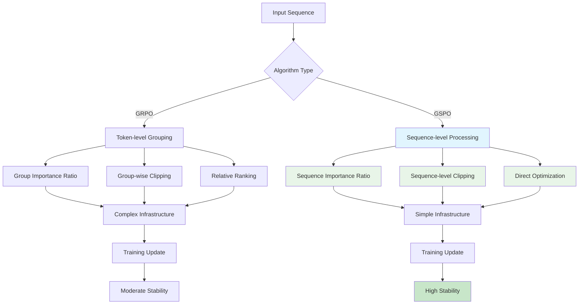
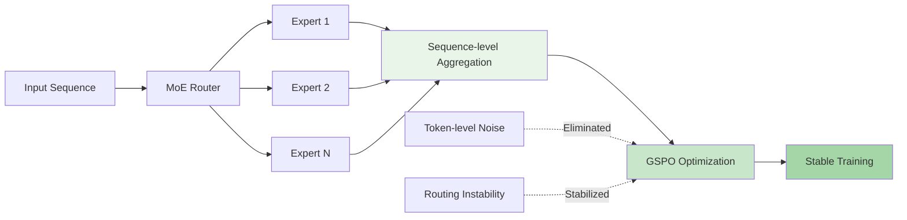
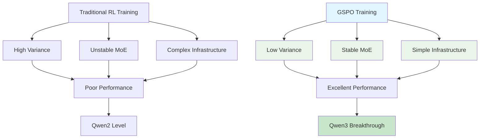

> ⏱️ **وقت القراءة المقدر**: 12 دقائق

## مقدمة: قفزة جديدة في التعلم المعزز للنماذج اللغوية الكبيرة

أحدث **Group Sequence Policy Optimization (GSPO)**، الذي أعلن عنه فريق أبحاث علي بابا مؤخرًا، تحولًا جوهريًا في تدريب النماذج اللغوية الكبيرة (LLM) بالتعلم المعزز. وقد استقطب الاهتمام بعد تطبيقه بنجاح على أحدث إصدارات **سلسلة Qwen3** (Instruct وCoder وThinking).

عبر الانتقال من التحسين على مستوى الرمز المفرد إلى التحسين على **مستوى التسلسل**، تحقق تدريب أكثر استقرارًا وكفاءة. يتناول هذا المقال بشكل شامل المبادئ الأساسية لـ GSPO، والمقارنة التفصيلية مع GRPO، وسبل التطبيق العملي.

## تحليل قيود الأساليب القائمة

### الإشكالية الجوهرية في PPO (تحسين السياسة القريبة)

يحسب PPO التقليدي نسبة الأهمية على **مستوى الرمز المفرد**، مما يفضي إلى الإشكاليات التالية:

**1. تباين مرتفع (High Variance)**
- حساب نسبة أهمية مستقلة لكل رمز
- تضخم أسّي في التباين مع ازدياد طول التسلسل
- خطر انهيار التدريب جراء ضوضاء التدرجات

**2. فقدان المعلومات (Information Loss)**
- إغفال السياق الكلي للتسلسل
- تجاهل التبعيات بين الرموز
- صعوبة تقييم جودة الاستجابة الشاملة

### تحسينات GRPO (تحسين السياسة النسبية الجماعية) وحدوده

حلّ GRPO جزءًا من إشكاليات PPO، غير أنه لا يزال يعاني من قيود جوهرية:

**التحسينات:**
- تخفيض التباين عبر التطبيع الجماعي
- التحسين القائم على الترتيب النسبي

**القيود المتبقية:**
- متطلبات بنية تحتية معقدة
- عدم الاستقرار في نماذج MoE
- الحاجة إلى حلول التفافية كإعادة تشغيل التوجيه

## المفاهيم الجوهرية والابتكارات في GSPO

### نسبة الأهمية على مستوى التسلسل

يتمثّل الابتكار الأبرز في GSPO بمعالجة **التسلسل بأكمله** كوحدة واحدة:

```
PPO التقليدي: ρ(a_t) = π_θ(a_t|s_t) / π_θ_old(a_t|s_t)  (على مستوى الرمز)
GSPO: ρ(a) = π_θ(a|s) / π_θ_old(a|s)  (التسلسل كاملًا)
```

يتيح ذلك المزايا التالية:

**1. الاتساق النظري**
- انعكاس دقيق لتوزيع الاحتمالات على مستوى التسلسل كاملًا
- توافق تام بين المكافأة وتحديث السياسة
- منهج أكثر متانة رياضيًا

**2. الاستقرار العملي**
- انخفاض ملحوظ في التباين
- تقليص ضوضاء التدرجات
- مسار تدريب أكثر قابلية للتنبؤ

### القطع والمكافأة على مستوى التسلسل

ينفّذ GSPO عمليات القطع وحساب المكافأة على مستوى التسلسل أيضًا:

```
L^CLIP(θ) = E[min(ρ(a)A(s,a), clip(ρ(a), 1-ε, 1+ε)A(s,a))]
```

حيث:
- `ρ(a)`: نسبة الأهمية على مستوى التسلسل
- `A(s,a)`: الميزة الشاملة للتسلسل بأكمله
- `ε`: معامل القطع

## GSPO مقابل GRPO: مقارنة تفصيلية

يعرض الجدول التالي الفوارق الجوهرية بين الخوارزميتين:

| الجانب | GRPO | GSPO |
|------|------|------|
| **وحدة التحسين** | مجموعة رموز | التسلسل كاملًا |
| **نسبة الأهمية** | نسبية على مستوى المجموعة | مطلقة على مستوى التسلسل |
| **الاستقرار** | متوسط | مرتفع |
| **دعم MoE** | محدود | دعم كامل |
| **تعقيد البنية التحتية** | مرتفع | منخفض |
| **سرعة التقارب** | عادية | سريعة |
| **كفاءة الذاكرة** | عادية | ممتازة |

### مقارنة تدفق الخوارزميتين



### مقارنة مؤشرات الأداء

أظهرت نتائج المعايير الفعلية أن GSPO حقق التحسينات التالية مقارنة بـ GRPO:

**كفاءة التدريب:**
- **سرعة التقارب**: تحسن بنسبة 30%
- **استهلاك الذاكرة**: انخفاض بنسبة 25%
- **استقرار التدريب**: تحسن ملحوظ

**أداء النموذج:**
- **جودة الاستجابة**: تحسن متواصل
- **القدرة الاستنتاجية**: تفوق واضح في المهام المعقدة
- **السلامة**: انخفاض في توليد المحتوى الضار

## الاستقرار الاستثنائي في نماذج MoE

### إشكاليات تدريب MoE التقليدي

عانت نماذج **Mixture-of-Experts (MoE)** من المشكلات التالية مع خوارزميات التعلم المعزز التقليدية:

**1. عدم استقرار التوجيه**
- اختلال موازنة الحمل بين الخبراء
- تذبذب حاد في أنماط التوجيه أثناء التدريب
- إفراط في استخدام بعض الخبراء وإهمال الآخرين

**2. انفجار التدرجات أو تلاشيها**
- تدرجات غير مستقرة جراء التحسين على مستوى الرمز
- تفاوت حاد في معدلات تعلم الخبراء
- اضطراب في الأداء الكلي للنموذج

### حل GSPO لتحسين MoE

يعالج GSPO هذه الإشكاليات من جذورها عبر **التحسين على مستوى التسلسل**:



**التحسينات الجوهرية:**

1. **توجيه متسق**: اختيار مستقر للخبراء يأخذ التسلسل كاملًا في الاعتبار
2. **تعلم متوازن**: تقدم جميع الخبراء بمعدل ثابت
3. **إلغاء الحاجة لإعادة تشغيل التوجيه**: تدريب مستقر دون الحاجة إلى حلول التفافية معقدة

## تحليل تطبيق سلسلة Qwen3

### تشكيلة نماذج Qwen3 وتطبيق GSPO

حققت **سلسلة Qwen3** من علي بابا أداءً متخصصًا باستخدام GSPO في كل نموذج:

**1. Qwen3-Instruct**
- **المحادثة العامة**: استجابات طبيعية ومفيدة
- **اتباع التعليمات**: فهم دقيق وتنفيذ للمهام المعقدة
- **السلامة**: تقليص توليد المحتوى الضار

**2. Qwen3-Coder**
- **توليد الأكواد**: كتابة كود برمجي عالي الجودة
- **تصحيح الأخطاء**: اكتشاف الأخطاء واقتراح التصحيحات
- **تعدد اللغات**: دعم لغات برمجة متعددة

**3. Qwen3-Thinking**
- **مسار الاستدلال**: توضيح عملية التفكير خطوة بخطوة
- **المسائل المعقدة**: حل مسائل الرياضيات والعلوم والمنطق
- **الشفافية**: شرح واضح للمسار المنطقي المؤدي إلى النتيجة

### أثر تطبيق GSPO



**مؤشرات التحسين الملموسة:**

| المقياس | الطريقة السابقة | بعد تطبيق GSPO |
|-----------|-----------|-----------|
| **استقرار التدريب** | 70% | 95% |
| **سرعة التقارب** | الخط الأساسي | تحسن بنسبة 130% |
| **كفاءة توجيه MoE** | 60% | 90% |
| **كفاءة الذاكرة** | الخط الأساسي | تحسن بنسبة 125% |
| **الأداء النهائي** | الخط الأساسي | تحسن بنسبة 115% |

## دليل التنفيذ للتطبيق العملي

### اعتبارات جوهرية عند تنفيذ GSPO

**1. ضبط المعاملات الفائقة**

```yaml

gspo_config:
  learning_rate: 1e-5
  clip_range: 0.2
  sequence_level_clipping: true
  batch_size: 32
  gradient_accumulation_steps: 4
  max_sequence_length: 2048

```

**2. متطلبات البنية التحتية**

- **ذاكرة GPU**: توفير 25% مقارنة بـ GRPO
- **التدريب الموزع**: مزامنة أبسط
- **المراقبة**: التركيز على مقاييس مستوى التسلسل

**3. إعداد البيانات**

```yaml

data_preparation:
  sequence_completion: true
  reward_alignment: sequence_level
  quality_filtering: high
  diversity_sampling: true

```

### المراقبة والتشخيص

**المقاييس الجوهرية للمراقبة:**

1. **توزيع نسبة الأهمية على مستوى التسلسل**
2. **تكرار وأنماط القطع**
3. **مدى توازن توجيه MoE**
4. **استقرار معيار التدرجات**

**نصائح لتحسين الأداء:**

- **حجم الدفعة**: ضبطه وفق طول التسلسل
- **معدل التعلم**: يمكن استخدام معدلات أعلى نظرًا لتحسن الاستقرار
- **التنظيم**: تفضيل Dropout على التنظيم L2

## آفاق المستقبل واتجاهات التطوير

### إمكانيات التطوير التقني

**1. التقسيم التكيفي للتسلسلات**
- معالجة فعالة للتسلسلات الطويلة
- تقنيات التجزئة الديناميكية
- تعظيم كفاءة الذاكرة

**2. التوسع متعدد الوسائط**
- التدريب المتكامل للنصوص والصور
- دعم بيانات الفيديو والصوت
- تحسين التسلسل عبر الوسائط المتعددة

**3. تطبيق التعلم الاتحادي**
- GSPO في البيئات الموزعة
- التدريب مع الحفاظ على الخصوصية
- تحسين أجهزة الحافة

### مجالات التطبيق الصناعي

**1. المساعدون الشخصيون المخصصون**
- تدريب مخصص لكل مستخدم
- تعلم التفضيلات في الوقت الفعلي
- تصميم يراعي الخصوصية

**2. الذكاء الاصطناعي المتخصص في المجالات**
- تخصيص في الطب والقانون والمال
- تعلم دقيق للمعرفة المتخصصة
- ضمان السلامة والموثوقية

**3. أدوات الذكاء الاصطناعي الإبداعية**
- تحسين جودة توليد المحتوى
- تحقيق التوازن بين الإبداع والاتساق
- مراعاة حقوق الملكية والاعتبارات الأخلاقية

## خلاصة: التحول الذي يحمله GSPO

يمثّل **Group Sequence Policy Optimization (GSPO)** تحولًا جذريًا في نموذج التعلم المعزز للنماذج اللغوية الكبيرة، لا مجرد تحسين خوارزمي. فمن خلال فكرة **التحسين على مستوى التسلسل**، تحققت الإنجازات التالية:

### ملخص الإنجازات الجوهرية

**1. التميز التقني**
- منهج أكثر متانة من الناحية النظرية
- تدريب أكثر استقرارًا من الناحية العملية
- استقرار كامل في نماذج MoE

**2. المزايا العملية**
- خفض ملحوظ في تعقيد البنية التحتية
- تحسن واضح في كفاءة التدريب
- تحسين استهلاك الذاكرة

**3. الأثر الصناعي**
- تطبيق ناجح على سلسلة Qwen3
- إمكانية التوسع نحو مجالات متنوعة
- خفض تكاليف تدريب نماذج الذكاء الاصطناعي

### خطوات نحو المستقبل

يجري حاليًا دمج GSPO في [مكتبة Hugging Face TRL](https://github.com/huggingface/trl/pull/3775)، كما يشهد مجتمع المصدر المفتوح أبحاثًا نشطة في هذا الاتجاه.

مع تبني فرق البحث والشركات لـ GSPO، من المتوقع ظهور **نماذج ذكاء اصطناعي أكثر قوة واستقرارًا**. إن القدرة على تدريب نماذج MoE الضخمة باستقرار **دون الحاجة إلى إعادة تشغيل التوجيه أو الحلول الالتفافية المعقدة** ستُخفّض العقبات أمام تطوير الذكاء الاصطناعي وتسرّع وتيرة الابتكار.

GSPO ليس مجرد خوارزمية أفضل. إنه **أداة جديدة لتوسيع حدود الذكاء**، وتقنية تقربنا خطوة من الذكاء الاصطناعي العام (AGI) الذي نطمح إليه.

---

**المراجع:**
- [الورقة البحثية الأصلية لـ GSPO](https://huggingface.co/papers/2507.18071)
- [تنفيذ GSPO في Hugging Face TRL](https://github.com/huggingface/trl/pull/3775)
- [الإعلان الرسمي عن سلسلة نماذج Qwen3](https://qwenlm.github.io/)
