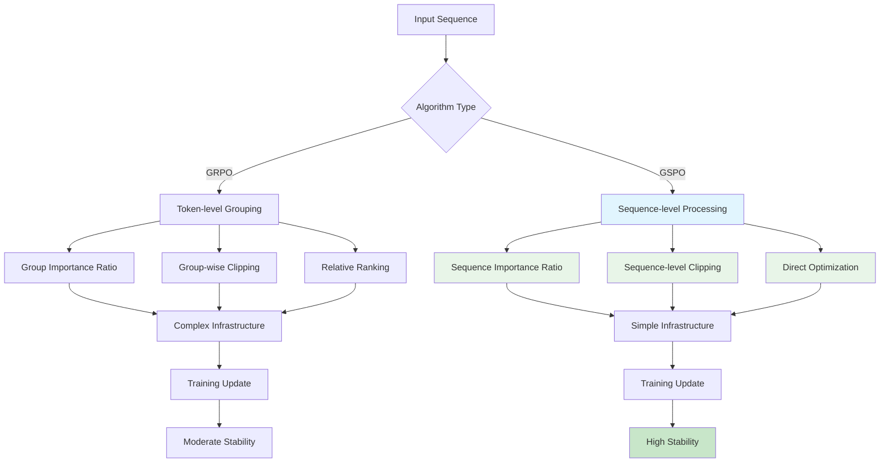

> ⏱️ **وقت القراءة المقدر**: 12 دقائق

## مقدمة: قفزة جديدة في التعلم المعزز للنماذج اللغوية الكبيرة

أحدث **Group Sequence Policy Optimization (GSPO)**، الذي أعلن عنه فريق أبحاث علي بابا مؤخرًا، تحولًا جوهريًا في تدريب النماذج اللغوية الكبيرة (LLM) بالتعلم المعزز. وقد استقطب الاهتمام بعد تطبيقه بنجاح على أحدث إصدارات **سلسلة Qwen3** (Instruct وCoder وThinking).

عبر الانتقال من التحسين على مستوى الرمز المفرد إلى التحسين على **مستوى التسلسل**، تحقق تدريب أكثر استقرارًا وكفاءة. يتناول هذا المقال بشكل شامل المبادئ الأساسية لـ GSPO، والمقارنة التفصيلية مع GRPO، وسبل التطبيق العملي.

## تحليل قيود الأساليب القائمة

### الإشكالية الجوهرية في PPO (تحسين السياسة القريبة)

يحسب PPO التقليدي نسبة الأهمية على **مستوى الرمز المفرد**، مما يفضي إلى الإشكاليات التالية:

**1. تباين مرتفع (High Variance)**
- حساب نسبة أهمية مستقلة لكل رمز
- تضخم أسّي في التباين مع ازدياد طول التسلسل
- خطر انهيار التدريب جراء ضوضاء التدرجات

**2. فقدان المعلومات (Information Loss)**
- إغفال السياق الكلي للتسلسل
- تجاهل التبعيات بين الرموز
- صعوبة تقييم جودة الاستجابة الشاملة

### تحسينات GRPO (تحسين السياسة النسبية الجماعية) وحدوده

حلّ GRPO جزءًا من إشكاليات PPO، غير أنه لا يزال يعاني من قيود جوهرية:

**التحسينات:**
- تخفيض التباين عبر التطبيع الجماعي
- التحسين القائم على الترتيب النسبي

**القيود المتبقية:**
- متطلبات بنية تحتية معقدة
- عدم الاستقرار في نماذج MoE
- الحاجة إلى حلول التفافية كإعادة تشغيل التوجيه

## المفاهيم الجوهرية والابتكارات في GSPO

### نسبة الأهمية على مستوى التسلسل

يتمثّل الابتكار الأبرز في GSPO بمعالجة **التسلسل بأكمله** كوحدة واحدة:

```
PPO التقليدي: ρ(a_t) = π_θ(a_t|s_t) / π_θ_old(a_t|s_t)  (على مستوى الرمز)
GSPO: ρ(a) = π_θ(a|s) / π_θ_old(a|s)  (التسلسل كاملًا)
```

يتيح ذلك المزايا التالية:

**1. الاتساق النظري**
- انعكاس دقيق لتوزيع الاحتمالات على مستوى التسلسل كاملًا
- توافق تام بين المكافأة وتحديث السياسة
- منهج أكثر متانة رياضيًا

**2. الاستقرار العملي**
- انخفاض ملحوظ في التباين
- تقليص ضوضاء التدرجات
- مسار تدريب أكثر قابلية للتنبؤ

### القطع والمكافأة على مستوى التسلسل

ينفّذ GSPO عمليات القطع وحساب المكافأة على مستوى التسلسل أيضًا:

```
L^CLIP(θ) = E[min(ρ(a)A(s,a), clip(ρ(a), 1-ε, 1+ε)A(s,a))]
```

حيث:
- `ρ(a)`: نسبة الأهمية على مستوى التسلسل
- `A(s,a)`: الميزة الشاملة للتسلسل بأكمله
- `ε`: معامل القطع

## GSPO مقابل GRPO: مقارنة تفصيلية

يعرض الجدول التالي الفوارق الجوهرية بين الخوارزميتين:

| الجانب | GRPO | GSPO |
|------|------|------|
| **وحدة التحسين** | مجموعة رموز | التسلسل كاملًا |
| **نسبة الأهمية** | نسبية على مستوى المجموعة | مطلقة على مستوى التسلسل |
| **الاستقرار** | متوسط | مرتفع |
| **دعم MoE** | محدود | دعم كامل |
| **تعقيد البنية التحتية** | مرتفع | منخفض |
| **سرعة التقارب** | عادية | سريعة |
| **كفاءة الذاكرة** | عادية | ممتازة |

### مقارنة تدفق الخوارزميتين


```mermaid
graph TD
    A[Input Sequence] --> B{Algorithm Type}
    
    B -->|GRPO| C[Token-level Grouping]
    B -->|GSPO| D[Sequence-level Processing]
    
    C --> E[Group Importance Ratio]
    C --> F[Group-wise Clipping]
    C --> G[Relative Ranking]
    
    D --> H[Sequence Importance Ratio]
    D --> I[Sequence-level Clipping]
    D --> J[Direct Optimization]
    
    E --> K[Complex Infrastructure]
    F --> K
    G --> K
    K --> L[Training Update]
    
    H --> M[Simple Infrastructure]
    I --> M
    J --> M
    M --> N[Training Update]
    
    L --> O[Moderate Stability]
    N --> P[High Stability]
    
    style D fill:#e1f5fe
    style H fill:#e8f5e8
    style I fill:#e8f5e8
    style J fill:#e8f5e8
    style P fill:#c8e6c9
```

### مقارنة مؤشرات الأداء

أظهرت نتائج المعايير الفعلية أن GSPO حقق التحسينات التالية مقارنة بـ GRPO:

**كفاءة التدريب:**
- **سرعة التقارب**: تحسن بنسبة 30%
- **استهلاك الذاكرة**: انخفاض بنسبة 25%
- **استقرار التدريب**: تحسن ملحوظ

**أداء النموذج:**
- **جودة الاستجابة**: تحسن متواصل
- **القدرة الاستنتاجية**: تفوق واضح في المهام المعقدة
- **السلامة**: انخفاض في توليد المحتوى الضار

## الاستقرار الاستثنائي في نماذج MoE

### إشكاليات تدريب MoE التقليدي

عانت نماذج **Mixture-of-Experts (MoE)** من المشكلات التالية مع خوارزميات التعلم المعزز التقليدية:

**1. عدم استقرار التوجيه**
- اختلال موازنة الحمل بين الخبراء
- تذبذب حاد في أنماط التوجيه أثناء التدريب
- إفراط في استخدام بعض الخبراء وإهمال الآخرين

**2. انفجار التدرجات أو تلاشيها**
- تدرجات غير مستقرة جراء التحسين على مستوى الرمز
- تفاوت حاد في معدلات تعلم الخبراء
- اضطراب في الأداء الكلي للنموذج

### حل GSPO لتحسين MoE

يعالج GSPO هذه الإشكاليات من جذورها عبر **التحسين على مستوى التسلسل**:


<!--
  animated-architecture-diagram — self-contained D3 embed template.
  HuggingFace research-article style: declarative NODES/EDGES/SEQ model,
  data(solid)/event(dashed) edges, hover-trace + tooltip, flow-dot animation
  along edge paths, replay button, scroll-into-view autoplay, reduced-motion +
  light/dark aware. The renderer injects window.__ARCH_SPEC__ at the marker.
  Format (D3 machinery + CSS) is owned by this committed template; the model
  only authors the JSON spec (content). See references/spec-schema.md.
-->
<div class="d3-arch" data-arch-root id="zationcomprehensiveguide-1"></div>
<style>
  /* ---- Theme tokens (standalone; light default + dark override) ---- */
  .d3-arch {
    --page-bg: #ffffff;
    --surface-bg: #f7f8fa;
    --text-color: #1a1d21;
    --muted-color: #6b7280;
    --border-color: #d5d9e0;
    --primary-color: hsl(217 91% 55%); /* brand accent — swap for #1B4F72 etc. */
    position: relative;
    font-family: -apple-system, BlinkMacSystemFont, "Segoe UI", "Noto Sans KR", system-ui, sans-serif;
    color: var(--text-color);
  }
  @media (prefers-color-scheme: dark) {
    .d3-arch {
      --page-bg: #0f1115;
      --surface-bg: #171a21;
      --text-color: #e6e8eb;
      --muted-color: #9aa3af;
      --border-color: #2a2f3a;
      --primary-color: hsl(217 91% 62%);
    }
  }
  .d3-arch[data-theme="light"] { --page-bg:#fff; --surface-bg:#f7f8fa; --text-color:#1a1d21; --muted-color:#6b7280; --border-color:#d5d9e0; --primary-color:hsl(217 91% 55%); }
  .d3-arch[data-theme="dark"]  { --page-bg:#0f1115; --surface-bg:#171a21; --text-color:#e6e8eb; --muted-color:#9aa3af; --border-color:#2a2f3a; --primary-color:hsl(217 91% 62%); }

  .d3-arch .diagram-scroll { overflow-x: auto; }
  .d3-arch svg { display: block; width: 100%; min-width: 760px; height: auto; font-family: inherit; }

  /* Group boxes */
  .d3-arch .group rect { fill: none; stroke: var(--border-color); stroke-dasharray: 3 3; rx: 12px; }
  .d3-arch .group text { font-size: 10px; font-weight: 700; letter-spacing: 0.08em; text-transform: uppercase; fill: var(--muted-color); }

  /* Nodes */
  .d3-arch .node rect { fill: var(--surface-bg); stroke: var(--border-color); stroke-width: 1; transition: stroke 0.15s ease, opacity 0.15s ease; }
  .d3-arch .node .node-title { font-size: 12px; font-weight: 600; fill: var(--text-color); }
  .d3-arch .node .node-sub { font-size: 9.5px; fill: var(--muted-color); }
  .d3-arch .node { cursor: default; transition: opacity 0.15s ease; }

  /* Edges */
  .d3-arch .edge { transition: opacity 0.15s ease; }
  .d3-arch .edge path.main { fill: none; stroke-width: 1.5; }
  .d3-arch .edge.data path.main { stroke: var(--primary-color); }
  .d3-arch .edge.event path.main { stroke: var(--muted-color); stroke-dasharray: 5 4; }
  .d3-arch .edge text { font-size: 9.5px; fill: var(--muted-color); paint-order: stroke; stroke: var(--page-bg); stroke-width: 3px; stroke-linejoin: round; }

  /* Hover highlighting */
  .d3-arch.hovering .edge:not(.hl) { opacity: 0.12; }
  .d3-arch.hovering .node:not(.hl):not(.nb) { opacity: 0.25; }
  .d3-arch .node.hl rect { stroke: var(--primary-color); stroke-width: 1.5; }

  /* Flow animation */
  .d3-arch .flow-dot.data { fill: var(--primary-color); stroke: var(--page-bg); stroke-width: 1.5; }
  .d3-arch .flow-dot.event { fill: var(--page-bg); stroke: var(--muted-color); stroke-width: 1.5; }
  .d3-arch .node.anim-hl rect { stroke: var(--primary-color); stroke-width: 1.5; }
  .d3-arch .replay-btn { font: inherit; font-size: 11px; font-weight: 600; padding: 4px 10px; border: 1px solid var(--border-color); border-radius: 8px; background: var(--surface-bg); color: var(--text-color); cursor: pointer; transition: border-color 0.15s ease, opacity 0.15s ease; }
  .d3-arch .replay-btn:hover:not(:disabled) { border-color: var(--primary-color); }
  .d3-arch .replay-btn:disabled { opacity: 0.45; cursor: default; }
  .d3-arch .replay-btn:focus-visible { outline: 2px solid var(--primary-color); outline-offset: 1px; }

  /* Legend */
  .d3-arch .legend { display: flex; flex-direction: column; align-items: flex-start; gap: 6px; margin-top: 10px; }
  .d3-arch .legend-title { font-size: 12px; font-weight: 700; color: var(--text-color); }
  .d3-arch .legend .items { display: flex; flex-wrap: wrap; gap: 8px 18px; align-items: center; }
  .d3-arch .legend .item { display: inline-flex; align-items: center; gap: 7px; white-space: nowrap; font-size: 12px; color: var(--text-color); }
  .d3-arch .legend .swatch { width: 22px; height: 0; }
  .d3-arch .legend .swatch.data-line { border-top: 2.5px solid var(--primary-color); }
  .d3-arch .legend .swatch.event-line { border-top: 2.5px dashed var(--muted-color); }
  .d3-arch .legend .hint { font-size: 11px; font-style: italic; color: var(--muted-color); }
</style>
<script>
  (() => {
    const SPEC = ({"title": "", "ariaLabel": "", "width": 732, "height": 736, "legendTitle": "Legend", "legend": {"data": "Flow", "event": "Dotted / alternate path"}, "hint": "Hover a node to trace its connections.", "groups": [], "nodes": [{"id": "A", "x": 195, "y": 24, "w": 128, "h": 46, "title": "Input Sequence"}, {"id": "B", "x": 199, "y": 148, "w": 120, "h": 46, "title": "MoE Router"}, {"id": "C", "x": 374, "y": 272, "w": 120, "h": 46, "title": "Expert 1"}, {"id": "D", "x": 199, "y": 272, "w": 120, "h": 46, "title": "Expert 2"}, {"id": "E", "x": 24, "y": 272, "w": 120, "h": 46, "title": "Expert N"}, {"id": "F", "x": 66, "y": 396, "w": 212, "h": 46, "title": "Sequence-level Aggregation"}, {"id": "G", "x": 420, "y": 534, "w": 149, "h": 46, "title": "GSPO Optimization"}, {"id": "H", "x": 427, "y": 658, "w": 135, "h": 46, "title": "Stable Training"}, {"id": "I", "x": 333, "y": 396, "w": 149, "h": 46, "title": "Token-level Noise"}, {"id": "J", "x": 537, "y": 396, "w": 163, "h": 46, "title": "Routing Instability"}], "edges": [{"src": "A", "dst": "B", "kind": "data", "line": [259, 70, 259, 148]}, {"src": "B", "dst": "C", "kind": "data", "curve": [[319, 192], [434, 233], [434, 233], [434, 272]]}, {"src": "B", "dst": "D", "kind": "data", "line": [259, 194, 259, 272]}, {"src": "B", "dst": "E", "kind": "data", "curve": [[199, 192], [84, 233], [84, 233], [84, 272]]}, {"src": "C", "dst": "F", "kind": "data", "curve": [[434, 318], [434, 357], [434, 357], [269, 396]]}, {"src": "D", "dst": "F", "kind": "data", "curve": [[259, 318], [259, 357], [259, 357], [204, 396]]}, {"src": "E", "dst": "F", "kind": "data", "curve": [[84, 318], [84, 357], [84, 357], [139, 396]]}, {"src": "F", "dst": "G", "kind": "data", "curve": [[172, 442], [172, 488], [172, 488], [420, 541]]}, {"src": "G", "dst": "H", "kind": "data", "line": [495, 580, 495, 658]}, {"src": "I", "dst": "G", "kind": "event", "label": "Eliminated", "curve": [[407, 442], [407, 488], [407, 488], [465, 534]], "off": "50%"}, {"src": "J", "dst": "G", "kind": "event", "label": "Stabilized", "curve": [[618, 442], [618, 488], [618, 488], [536, 534]], "off": "50%"}]});
    const ensureD3 = (cb) => {
      if (window.d3 && typeof window.d3.select === 'function') return cb();
      let s = document.getElementById('d3-cdn-script');
      if (!s) {
        s = document.createElement('script');
        s.id = 'd3-cdn-script';
        s.src = 'https://cdn.jsdelivr.net/npm/d3@7/dist/d3.min.js';
        document.head.appendChild(s);
      }
      const onReady = () => { if (window.d3 && typeof window.d3.select === 'function') cb(); };
      s.addEventListener('load', onReady, { once: true });
      if (window.d3) onReady();
    };

    const bootstrap = () => {
      const container = document.getElementById('zationcomprehensiveguide-1')
        || document.querySelector('.d3-arch[data-arch-root]:not([data-mounted])');
      if (!container || (container.dataset && container.dataset.mounted === 'true')) return;
      if (container.dataset) container.dataset.mounted = 'true';

      try {
        const uid = 'zationcomprehensiveguide-1';
        const NODES = SPEC.nodes || [];
        const EDGES = SPEC.edges || [];
        const GROUPS = SPEC.groups || [];
        const HOP = SPEC.hop || 800;
        const legendCfg = SPEC.legend || {};
        const dataLabel = legendCfg.data || 'Data path';
        const eventLabel = legendCfg.event || 'Event side-channel';

        const byId = Object.fromEntries(NODES.map((n) => [n.id, n]));
        const cx = (n) => n.x + n.w / 2;
        const asTitle = (t) => Array.isArray(t) ? t : [t];

        // Canvas: explicit, else auto from node/group extents + padding
        let W = SPEC.width, H = SPEC.height;
        if (!W || !H) {
          const xs = [], ys = [];
          NODES.forEach((n) => { xs.push(n.x + n.w); ys.push(n.y + n.h); });
          GROUPS.forEach((g) => { xs.push(g.x + g.w); ys.push(g.y + g.h); });
          W = W || Math.max(760, Math.ceil(Math.max(...xs, 0) + 24));
          H = H || Math.ceil(Math.max(...ys, 0) + 20);
        }

        // Tooltip
        container.style.position = container.style.position || 'relative';
        const tip = document.createElement('div');
        Object.assign(tip.style, {
          position: 'absolute', top: '0px', left: '0px',
          transform: 'translate(-9999px, -9999px)', pointerEvents: 'none',
          padding: '8px 10px', borderRadius: '8px', fontSize: '12px', lineHeight: '1.4',
          border: '1px solid var(--border-color)', background: 'var(--surface-bg)',
          color: 'var(--text-color)', boxShadow: '0 4px 24px rgba(0,0,0,.18)',
          opacity: '0', transition: 'opacity .12s ease', maxWidth: '260px', zIndex: '3'
        });
        const tipInner = document.createElement('div');
        tip.appendChild(tipInner);

        const scroll = document.createElement('div');
        scroll.className = 'diagram-scroll';
        container.appendChild(scroll);

        const svg = d3.select(scroll).append('svg')
          .attr('viewBox', `0 0 ${W} ${H}`)
          .attr('preserveAspectRatio', 'xMidYMid meet')
          .attr('role', 'img')
          .attr('aria-label', SPEC.ariaLabel || SPEC.title || 'Architecture diagram');

        const defs = svg.append('defs');
        const mkMarker = (id, color) => {
          defs.append('marker')
            .attr('id', id).attr('viewBox', '0 0 10 10')
            .attr('refX', 9).attr('refY', 5)
            .attr('markerWidth', 6.5).attr('markerHeight', 6.5)
            .attr('orient', 'auto-start-reverse')
            .append('path').attr('d', 'M 0 0 L 10 5 L 0 10 z').style('fill', color);
        };
        mkMarker(`${uid}-arrow-data`, 'var(--primary-color)');
        mkMarker(`${uid}-arrow-event`, 'var(--muted-color)');

        // Groups
        const groups = svg.append('g');
        GROUPS.forEach((gr) => {
          const g = groups.append('g').attr('class', 'group');
          g.append('rect').attr('x', gr.x).attr('y', gr.y).attr('width', gr.w).attr('height', gr.h).attr('rx', 12);
          if (gr.label) g.append('text').attr('x', gr.lx != null ? gr.lx : gr.x + 12).attr('y', gr.ly != null ? gr.ly : gr.y + 18).text(gr.label);
        });

        // Edges (under nodes)
        const edgeLayer = svg.append('g');
        const curvePath = (p) => `M ${p[0][0]} ${p[0][1]} C ${p[1][0]} ${p[1][1]}, ${p[2][0]} ${p[2][1]}, ${p[3][0]} ${p[3][1]}`;
        EDGES.forEach((e, i) => {
          const kind = e.kind === 'event' ? 'event' : 'data';
          const g = edgeLayer.append('g').attr('class', `edge ${kind}`).attr('data-src', e.src).attr('data-dst', e.dst);
          const marker = `url(#${uid}-arrow-${kind})`;
          if (e.line) {
            const [x1, y1, x2, y2] = e.line;
            e.pathEl = g.append('path').attr('class', 'main').attr('d', `M ${x1} ${y1} L ${x2} ${y2}`).attr('marker-end', marker).node();
            if (e.label) g.append('text').attr('x', e.lx != null ? e.lx : (x1 + x2) / 2).attr('y', e.ly != null ? e.ly : (y1 + y2) / 2 - 6).attr('text-anchor', e.anchor || 'middle').text(e.label);
          } else if (e.curve) {
            e.pathEl = g.append('path').attr('class', 'main').attr('d', curvePath(e.curve)).attr('marker-end', marker).node();
            if (e.label && e.off) {
              const p = e.curve;
              const lp = p[3][0] < p[0][0] ? [p[3], p[2], p[1], p[0]] : p;
              const lpId = `${uid}-lbl-${i}`;
              g.append('path').attr('id', lpId).attr('d', curvePath(lp)).attr('fill', 'none').attr('stroke', 'none');
              g.append('text').attr('dy', -5).append('textPath').attr('href', `#${lpId}`).attr('startOffset', e.off).attr('text-anchor', 'middle').text(e.label);
            } else if (e.label) {
              g.append('text').attr('x', e.lx).attr('y', e.ly).attr('text-anchor', e.anchor || 'start').text(e.label);
            }
          }
        });

        // Nodes (over edges)
        const nodeLayer = svg.append('g');
        NODES.forEach((n) => {
          const g = nodeLayer.append('g').attr('class', 'node').attr('data-id', n.id);
          g.append('rect').attr('x', n.x).attr('y', n.y).attr('width', n.w).attr('height', n.h).attr('rx', 9);
          const title = asTitle(n.title);
          const lines = title.length;
          const baseY = n.y + n.h / 2 - (lines - 1) * 7 - (n.sub ? 5 : -4);
          title.forEach((t, li) => {
            g.append('text').attr('class', 'node-title').attr('x', cx(n)).attr('y', baseY + li * 14).attr('text-anchor', 'middle').text(t);
          });
          if (n.sub) g.append('text').attr('class', 'node-sub').attr('x', cx(n)).attr('y', baseY + (lines - 1) * 14 + 15).attr('text-anchor', 'middle').text(n.sub);
        });

        // Hover highlighting
        const edgeSel = svg.selectAll('.edge');
        const nodeSel = svg.selectAll('.node');
        nodeSel
          .on('mouseenter', function () {
            const id = this.getAttribute('data-id');
            const n = byId[id];
            container.classList.add('hovering');
            const nb = new Set([id]);
            edgeSel.classed('hl', function () {
              const hit = this.getAttribute('data-src') === id || this.getAttribute('data-dst') === id;
              if (hit) { nb.add(this.getAttribute('data-src')); nb.add(this.getAttribute('data-dst')); }
              return hit;
            });
            nodeSel.classed('hl', function () { return this.getAttribute('data-id') === id; })
                   .classed('nb', function () { return nb.has(this.getAttribute('data-id')); });
            if (n && n.desc) { tipInner.innerHTML = `<strong>${asTitle(n.title).join('')}</strong><br>${n.desc}`; tip.style.opacity = '1'; }
          })
          .on('mousemove', function (event) {
            const [mx, my] = d3.pointer(event, container);
            const flip = mx > container.clientWidth - 280;
            tip.style.transform = `translate(${flip ? mx - 270 : mx + 14}px, ${my + 14}px)`;
          })
          .on('mouseleave', function () {
            container.classList.remove('hovering');
            edgeSel.classed('hl', false);
            nodeSel.classed('hl', false).classed('nb', false);
            tip.style.opacity = '0';
            tip.style.transform = 'translate(-9999px, -9999px)';
          });

        // Flow animation sequence: explicit SEQ, else auto forward-cascade of data edges
        const resolveEdge = (s) => {
          if (typeof s.e === 'number') return s.e;
          if (s.from && s.to) return EDGES.findIndex((e) => e.src === s.from && e.dst === s.to);
          return -1;
        };
        let SEQ = (SPEC.seq || []).map((s) => ({ e: resolveEdge(s), t0: s.t0 })).filter((s) => s.e >= 0);
        if (!SEQ.length) {
          let t = 0;
          EDGES.forEach((e, i) => { if ((e.kind || 'data') === 'data') { SEQ.push({ e: i, t0: t }); t += HOP; } });
        }
        const TOTAL = SPEC.total || (Math.max(0, ...SEQ.map((s) => s.t0)) + HOP + 800);

        let playing = false, replayBtn = null;
        const pulseNode = (id) => {
          const sel = nodeSel.filter(function () { return this.getAttribute('data-id') === id; });
          sel.classed('anim-hl', true);
          setTimeout(() => sel.classed('anim-hl', false), 550);
        };
        const play = () => {
          if (playing) return;
          playing = true;
          if (replayBtn) replayBtn.disabled = true;
          const layer = svg.append('g');
          const steps = SEQ.map((s) => {
            const edge = EDGES[s.e];
            return { ...s, edge, len: edge.pathEl.getTotalLength(), dot: null, arrived: false };
          });
          const start = performance.now();
          const frame = (now) => {
            const t = now - start;
            steps.forEach((s) => {
              if (t < s.t0) return;
              const f = Math.min(1, (t - s.t0) / HOP);
              if (f >= 1) { if (s.dot) { s.dot.remove(); s.dot = null; } if (!s.arrived) { s.arrived = true; pulseNode(s.edge.dst); } return; }
              if (!s.dot) s.dot = layer.append('circle').attr('class', `flow-dot ${s.edge.kind || 'data'}`).attr('r', (s.edge.kind === 'event') ? 4 : 5);
              const p = s.edge.pathEl.getPointAtLength(d3.easeCubicInOut(f) * s.len);
              s.dot.attr('cx', p.x).attr('cy', p.y);
            });
            if (t < TOTAL) requestAnimationFrame(frame);
            else { layer.remove(); playing = false; if (replayBtn) replayBtn.disabled = false; }
          };
          requestAnimationFrame(frame);
        };

        // Legend
        const legend = document.createElement('div');
        legend.className = 'legend';
        legend.innerHTML = `
          <div class="legend-title">${SPEC.legendTitle || 'Legend'}</div>
          <div class="items">
            <span class="item"><span class="swatch data-line"></span><span>${dataLabel}</span></span>
            <span class="item"><span class="swatch event-line"></span><span>${eventLabel}</span></span>
            <button class="replay-btn" type="button" aria-label="Replay the flow animation">&#9654; Replay</button>
            <span class="hint">${SPEC.hint || 'Hover a component to trace its connections.'}</span>
          </div>`;
        container.appendChild(legend);
        container.appendChild(tip);
        replayBtn = legend.querySelector('.replay-btn');
        replayBtn.addEventListener('click', play);

        const prefersReduced = window.matchMedia && window.matchMedia('(prefers-reduced-motion: reduce)').matches;
        if (!prefersReduced && window.IntersectionObserver) {
          const io = new IntersectionObserver((entries) => {
            entries.forEach((en) => { if (en.isIntersecting) { io.disconnect(); play(); } });
          }, { threshold: 0.5 });
          io.observe(container);
        }
      } catch (err) {
        const pre = document.createElement('pre');
        pre.style.color = '#c0392b';
        pre.style.fontSize = '12px';
        pre.textContent = 'Failed to render architecture diagram: ' + (err && err.message ? err.message : err);
        container.appendChild(pre);
      }
    };

    if (document.readyState === 'loading') document.addEventListener('DOMContentLoaded', () => ensureD3(bootstrap), { once: true });
    else ensureD3(bootstrap);
  })();
</script>


**التحسينات الجوهرية:**

1. **توجيه متسق**: اختيار مستقر للخبراء يأخذ التسلسل كاملًا في الاعتبار
2. **تعلم متوازن**: تقدم جميع الخبراء بمعدل ثابت
3. **إلغاء الحاجة لإعادة تشغيل التوجيه**: تدريب مستقر دون الحاجة إلى حلول التفافية معقدة

## تحليل تطبيق سلسلة Qwen3

### تشكيلة نماذج Qwen3 وتطبيق GSPO

حققت **سلسلة Qwen3** من علي بابا أداءً متخصصًا باستخدام GSPO في كل نموذج:

**1. Qwen3-Instruct**
- **المحادثة العامة**: استجابات طبيعية ومفيدة
- **اتباع التعليمات**: فهم دقيق وتنفيذ للمهام المعقدة
- **السلامة**: تقليص توليد المحتوى الضار

**2. Qwen3-Coder**
- **توليد الأكواد**: كتابة كود برمجي عالي الجودة
- **تصحيح الأخطاء**: اكتشاف الأخطاء واقتراح التصحيحات
- **تعدد اللغات**: دعم لغات برمجة متعددة

**3. Qwen3-Thinking**
- **مسار الاستدلال**: توضيح عملية التفكير خطوة بخطوة
- **المسائل المعقدة**: حل مسائل الرياضيات والعلوم والمنطق
- **الشفافية**: شرح واضح للمسار المنطقي المؤدي إلى النتيجة

### أثر تطبيق GSPO


<!--
  animated-architecture-diagram — self-contained D3 embed template.
  HuggingFace research-article style: declarative NODES/EDGES/SEQ model,
  data(solid)/event(dashed) edges, hover-trace + tooltip, flow-dot animation
  along edge paths, replay button, scroll-into-view autoplay, reduced-motion +
  light/dark aware. The renderer injects window.__ARCH_SPEC__ at the marker.
  Format (D3 machinery + CSS) is owned by this committed template; the model
  only authors the JSON spec (content). See references/spec-schema.md.
-->
<div class="d3-arch" data-arch-root id="zationcomprehensiveguide-2"></div>
<style>
  /* ---- Theme tokens (standalone; light default + dark override) ---- */
  .d3-arch {
    --page-bg: #ffffff;
    --surface-bg: #f7f8fa;
    --text-color: #1a1d21;
    --muted-color: #6b7280;
    --border-color: #d5d9e0;
    --primary-color: hsl(217 91% 55%); /* brand accent — swap for #1B4F72 etc. */
    position: relative;
    font-family: -apple-system, BlinkMacSystemFont, "Segoe UI", "Noto Sans KR", system-ui, sans-serif;
    color: var(--text-color);
  }
  @media (prefers-color-scheme: dark) {
    .d3-arch {
      --page-bg: #0f1115;
      --surface-bg: #171a21;
      --text-color: #e6e8eb;
      --muted-color: #9aa3af;
      --border-color: #2a2f3a;
      --primary-color: hsl(217 91% 62%);
    }
  }
  .d3-arch[data-theme="light"] { --page-bg:#fff; --surface-bg:#f7f8fa; --text-color:#1a1d21; --muted-color:#6b7280; --border-color:#d5d9e0; --primary-color:hsl(217 91% 55%); }
  .d3-arch[data-theme="dark"]  { --page-bg:#0f1115; --surface-bg:#171a21; --text-color:#e6e8eb; --muted-color:#9aa3af; --border-color:#2a2f3a; --primary-color:hsl(217 91% 62%); }

  .d3-arch .diagram-scroll { overflow-x: auto; }
  .d3-arch svg { display: block; width: 100%; min-width: 760px; height: auto; font-family: inherit; }

  /* Group boxes */
  .d3-arch .group rect { fill: none; stroke: var(--border-color); stroke-dasharray: 3 3; rx: 12px; }
  .d3-arch .group text { font-size: 10px; font-weight: 700; letter-spacing: 0.08em; text-transform: uppercase; fill: var(--muted-color); }

  /* Nodes */
  .d3-arch .node rect { fill: var(--surface-bg); stroke: var(--border-color); stroke-width: 1; transition: stroke 0.15s ease, opacity 0.15s ease; }
  .d3-arch .node .node-title { font-size: 12px; font-weight: 600; fill: var(--text-color); }
  .d3-arch .node .node-sub { font-size: 9.5px; fill: var(--muted-color); }
  .d3-arch .node { cursor: default; transition: opacity 0.15s ease; }

  /* Edges */
  .d3-arch .edge { transition: opacity 0.15s ease; }
  .d3-arch .edge path.main { fill: none; stroke-width: 1.5; }
  .d3-arch .edge.data path.main { stroke: var(--primary-color); }
  .d3-arch .edge.event path.main { stroke: var(--muted-color); stroke-dasharray: 5 4; }
  .d3-arch .edge text { font-size: 9.5px; fill: var(--muted-color); paint-order: stroke; stroke: var(--page-bg); stroke-width: 3px; stroke-linejoin: round; }

  /* Hover highlighting */
  .d3-arch.hovering .edge:not(.hl) { opacity: 0.12; }
  .d3-arch.hovering .node:not(.hl):not(.nb) { opacity: 0.25; }
  .d3-arch .node.hl rect { stroke: var(--primary-color); stroke-width: 1.5; }

  /* Flow animation */
  .d3-arch .flow-dot.data { fill: var(--primary-color); stroke: var(--page-bg); stroke-width: 1.5; }
  .d3-arch .flow-dot.event { fill: var(--page-bg); stroke: var(--muted-color); stroke-width: 1.5; }
  .d3-arch .node.anim-hl rect { stroke: var(--primary-color); stroke-width: 1.5; }
  .d3-arch .replay-btn { font: inherit; font-size: 11px; font-weight: 600; padding: 4px 10px; border: 1px solid var(--border-color); border-radius: 8px; background: var(--surface-bg); color: var(--text-color); cursor: pointer; transition: border-color 0.15s ease, opacity 0.15s ease; }
  .d3-arch .replay-btn:hover:not(:disabled) { border-color: var(--primary-color); }
  .d3-arch .replay-btn:disabled { opacity: 0.45; cursor: default; }
  .d3-arch .replay-btn:focus-visible { outline: 2px solid var(--primary-color); outline-offset: 1px; }

  /* Legend */
  .d3-arch .legend { display: flex; flex-direction: column; align-items: flex-start; gap: 6px; margin-top: 10px; }
  .d3-arch .legend-title { font-size: 12px; font-weight: 700; color: var(--text-color); }
  .d3-arch .legend .items { display: flex; flex-wrap: wrap; gap: 8px 18px; align-items: center; }
  .d3-arch .legend .item { display: inline-flex; align-items: center; gap: 7px; white-space: nowrap; font-size: 12px; color: var(--text-color); }
  .d3-arch .legend .swatch { width: 22px; height: 0; }
  .d3-arch .legend .swatch.data-line { border-top: 2.5px solid var(--primary-color); }
  .d3-arch .legend .swatch.event-line { border-top: 2.5px dashed var(--muted-color); }
  .d3-arch .legend .hint { font-size: 11px; font-style: italic; color: var(--muted-color); }
</style>
<script>
  (() => {
    const SPEC = ({"title": "", "ariaLabel": "", "width": 1173, "height": 474, "legendTitle": "Legend", "hint": "Hover a node to trace its connections.", "groups": [], "nodes": [{"id": "A", "x": 228, "y": 24, "w": 191, "h": 46, "title": "Traditional RL Training"}, {"id": "B", "x": 438, "y": 148, "w": 121, "h": 46, "title": "High Variance"}, {"id": "C", "x": 263, "y": 148, "w": 120, "h": 46, "title": "Unstable MoE"}, {"id": "D", "x": 24, "y": 148, "w": 184, "h": 46, "title": "Complex Infrastructure"}, {"id": "E", "x": 846, "y": 24, "w": 121, "h": 46, "title": "GSPO Training"}, {"id": "F", "x": 1021, "y": 148, "w": 120, "h": 46, "title": "Low Variance"}, {"id": "G", "x": 846, "y": 148, "w": 120, "h": 46, "title": "Stable MoE"}, {"id": "H", "x": 614, "y": 148, "w": 177, "h": 46, "title": "Simple Infrastructure"}, {"id": "I", "x": 252, "y": 272, "w": 142, "h": 46, "title": "Poor Performance"}, {"id": "J", "x": 818, "y": 272, "w": 177, "h": 46, "title": "Excellent Performance"}, {"id": "K", "x": 263, "y": 396, "w": 120, "h": 46, "title": "Qwen2 Level"}, {"id": "L", "x": 828, "y": 396, "w": 156, "h": 46, "title": "Qwen3 Breakthrough"}], "edges": [{"src": "A", "dst": "B", "kind": "data", "curve": [[388, 70], [499, 109], [499, 109], [499, 148]]}, {"src": "A", "dst": "C", "kind": "data", "line": [323, 70, 323, 148]}, {"src": "A", "dst": "D", "kind": "data", "curve": [[246, 70], [116, 109], [116, 109], [116, 148]]}, {"src": "E", "dst": "F", "kind": "data", "curve": [[967, 68], [1081, 109], [1081, 109], [1081, 148]]}, {"src": "E", "dst": "G", "kind": "data", "line": [906, 70, 906, 148]}, {"src": "E", "dst": "H", "kind": "data", "curve": [[846, 65], [703, 109], [703, 109], [703, 148]]}, {"src": "B", "dst": "I", "kind": "data", "curve": [[499, 194], [499, 233], [499, 233], [388, 272]]}, {"src": "C", "dst": "I", "kind": "data", "line": [323, 194, 323, 272]}, {"src": "D", "dst": "I", "kind": "data", "curve": [[116, 194], [116, 233], [116, 233], [252, 274]]}, {"src": "F", "dst": "J", "kind": "data", "curve": [[1081, 194], [1081, 233], [1081, 233], [971, 272]]}, {"src": "G", "dst": "J", "kind": "data", "line": [906, 194, 906, 272]}, {"src": "H", "dst": "J", "kind": "data", "curve": [[703, 194], [703, 233], [703, 233], [831, 272]]}, {"src": "I", "dst": "K", "kind": "data", "line": [323, 318, 323, 396]}, {"src": "J", "dst": "L", "kind": "data", "line": [906, 318, 906, 396]}]});
    const ensureD3 = (cb) => {
      if (window.d3 && typeof window.d3.select === 'function') return cb();
      let s = document.getElementById('d3-cdn-script');
      if (!s) {
        s = document.createElement('script');
        s.id = 'd3-cdn-script';
        s.src = 'https://cdn.jsdelivr.net/npm/d3@7/dist/d3.min.js';
        document.head.appendChild(s);
      }
      const onReady = () => { if (window.d3 && typeof window.d3.select === 'function') cb(); };
      s.addEventListener('load', onReady, { once: true });
      if (window.d3) onReady();
    };

    const bootstrap = () => {
      const container = document.getElementById('zationcomprehensiveguide-2')
        || document.querySelector('.d3-arch[data-arch-root]:not([data-mounted])');
      if (!container || (container.dataset && container.dataset.mounted === 'true')) return;
      if (container.dataset) container.dataset.mounted = 'true';

      try {
        const uid = 'zationcomprehensiveguide-2';
        const NODES = SPEC.nodes || [];
        const EDGES = SPEC.edges || [];
        const GROUPS = SPEC.groups || [];
        const HOP = SPEC.hop || 800;
        const legendCfg = SPEC.legend || {};
        const dataLabel = legendCfg.data || 'Data path';
        const eventLabel = legendCfg.event || 'Event side-channel';

        const byId = Object.fromEntries(NODES.map((n) => [n.id, n]));
        const cx = (n) => n.x + n.w / 2;
        const asTitle = (t) => Array.isArray(t) ? t : [t];

        // Canvas: explicit, else auto from node/group extents + padding
        let W = SPEC.width, H = SPEC.height;
        if (!W || !H) {
          const xs = [], ys = [];
          NODES.forEach((n) => { xs.push(n.x + n.w); ys.push(n.y + n.h); });
          GROUPS.forEach((g) => { xs.push(g.x + g.w); ys.push(g.y + g.h); });
          W = W || Math.max(760, Math.ceil(Math.max(...xs, 0) + 24));
          H = H || Math.ceil(Math.max(...ys, 0) + 20);
        }

        // Tooltip
        container.style.position = container.style.position || 'relative';
        const tip = document.createElement('div');
        Object.assign(tip.style, {
          position: 'absolute', top: '0px', left: '0px',
          transform: 'translate(-9999px, -9999px)', pointerEvents: 'none',
          padding: '8px 10px', borderRadius: '8px', fontSize: '12px', lineHeight: '1.4',
          border: '1px solid var(--border-color)', background: 'var(--surface-bg)',
          color: 'var(--text-color)', boxShadow: '0 4px 24px rgba(0,0,0,.18)',
          opacity: '0', transition: 'opacity .12s ease', maxWidth: '260px', zIndex: '3'
        });
        const tipInner = document.createElement('div');
        tip.appendChild(tipInner);

        const scroll = document.createElement('div');
        scroll.className = 'diagram-scroll';
        container.appendChild(scroll);

        const svg = d3.select(scroll).append('svg')
          .attr('viewBox', `0 0 ${W} ${H}`)
          .attr('preserveAspectRatio', 'xMidYMid meet')
          .attr('role', 'img')
          .attr('aria-label', SPEC.ariaLabel || SPEC.title || 'Architecture diagram');

        const defs = svg.append('defs');
        const mkMarker = (id, color) => {
          defs.append('marker')
            .attr('id', id).attr('viewBox', '0 0 10 10')
            .attr('refX', 9).attr('refY', 5)
            .attr('markerWidth', 6.5).attr('markerHeight', 6.5)
            .attr('orient', 'auto-start-reverse')
            .append('path').attr('d', 'M 0 0 L 10 5 L 0 10 z').style('fill', color);
        };
        mkMarker(`${uid}-arrow-data`, 'var(--primary-color)');
        mkMarker(`${uid}-arrow-event`, 'var(--muted-color)');

        // Groups
        const groups = svg.append('g');
        GROUPS.forEach((gr) => {
          const g = groups.append('g').attr('class', 'group');
          g.append('rect').attr('x', gr.x).attr('y', gr.y).attr('width', gr.w).attr('height', gr.h).attr('rx', 12);
          if (gr.label) g.append('text').attr('x', gr.lx != null ? gr.lx : gr.x + 12).attr('y', gr.ly != null ? gr.ly : gr.y + 18).text(gr.label);
        });

        // Edges (under nodes)
        const edgeLayer = svg.append('g');
        const curvePath = (p) => `M ${p[0][0]} ${p[0][1]} C ${p[1][0]} ${p[1][1]}, ${p[2][0]} ${p[2][1]}, ${p[3][0]} ${p[3][1]}`;
        EDGES.forEach((e, i) => {
          const kind = e.kind === 'event' ? 'event' : 'data';
          const g = edgeLayer.append('g').attr('class', `edge ${kind}`).attr('data-src', e.src).attr('data-dst', e.dst);
          const marker = `url(#${uid}-arrow-${kind})`;
          if (e.line) {
            const [x1, y1, x2, y2] = e.line;
            e.pathEl = g.append('path').attr('class', 'main').attr('d', `M ${x1} ${y1} L ${x2} ${y2}`).attr('marker-end', marker).node();
            if (e.label) g.append('text').attr('x', e.lx != null ? e.lx : (x1 + x2) / 2).attr('y', e.ly != null ? e.ly : (y1 + y2) / 2 - 6).attr('text-anchor', e.anchor || 'middle').text(e.label);
          } else if (e.curve) {
            e.pathEl = g.append('path').attr('class', 'main').attr('d', curvePath(e.curve)).attr('marker-end', marker).node();
            if (e.label && e.off) {
              const p = e.curve;
              const lp = p[3][0] < p[0][0] ? [p[3], p[2], p[1], p[0]] : p;
              const lpId = `${uid}-lbl-${i}`;
              g.append('path').attr('id', lpId).attr('d', curvePath(lp)).attr('fill', 'none').attr('stroke', 'none');
              g.append('text').attr('dy', -5).append('textPath').attr('href', `#${lpId}`).attr('startOffset', e.off).attr('text-anchor', 'middle').text(e.label);
            } else if (e.label) {
              g.append('text').attr('x', e.lx).attr('y', e.ly).attr('text-anchor', e.anchor || 'start').text(e.label);
            }
          }
        });

        // Nodes (over edges)
        const nodeLayer = svg.append('g');
        NODES.forEach((n) => {
          const g = nodeLayer.append('g').attr('class', 'node').attr('data-id', n.id);
          g.append('rect').attr('x', n.x).attr('y', n.y).attr('width', n.w).attr('height', n.h).attr('rx', 9);
          const title = asTitle(n.title);
          const lines = title.length;
          const baseY = n.y + n.h / 2 - (lines - 1) * 7 - (n.sub ? 5 : -4);
          title.forEach((t, li) => {
            g.append('text').attr('class', 'node-title').attr('x', cx(n)).attr('y', baseY + li * 14).attr('text-anchor', 'middle').text(t);
          });
          if (n.sub) g.append('text').attr('class', 'node-sub').attr('x', cx(n)).attr('y', baseY + (lines - 1) * 14 + 15).attr('text-anchor', 'middle').text(n.sub);
        });

        // Hover highlighting
        const edgeSel = svg.selectAll('.edge');
        const nodeSel = svg.selectAll('.node');
        nodeSel
          .on('mouseenter', function () {
            const id = this.getAttribute('data-id');
            const n = byId[id];
            container.classList.add('hovering');
            const nb = new Set([id]);
            edgeSel.classed('hl', function () {
              const hit = this.getAttribute('data-src') === id || this.getAttribute('data-dst') === id;
              if (hit) { nb.add(this.getAttribute('data-src')); nb.add(this.getAttribute('data-dst')); }
              return hit;
            });
            nodeSel.classed('hl', function () { return this.getAttribute('data-id') === id; })
                   .classed('nb', function () { return nb.has(this.getAttribute('data-id')); });
            if (n && n.desc) { tipInner.innerHTML = `<strong>${asTitle(n.title).join('')}</strong><br>${n.desc}`; tip.style.opacity = '1'; }
          })
          .on('mousemove', function (event) {
            const [mx, my] = d3.pointer(event, container);
            const flip = mx > container.clientWidth - 280;
            tip.style.transform = `translate(${flip ? mx - 270 : mx + 14}px, ${my + 14}px)`;
          })
          .on('mouseleave', function () {
            container.classList.remove('hovering');
            edgeSel.classed('hl', false);
            nodeSel.classed('hl', false).classed('nb', false);
            tip.style.opacity = '0';
            tip.style.transform = 'translate(-9999px, -9999px)';
          });

        // Flow animation sequence: explicit SEQ, else auto forward-cascade of data edges
        const resolveEdge = (s) => {
          if (typeof s.e === 'number') return s.e;
          if (s.from && s.to) return EDGES.findIndex((e) => e.src === s.from && e.dst === s.to);
          return -1;
        };
        let SEQ = (SPEC.seq || []).map((s) => ({ e: resolveEdge(s), t0: s.t0 })).filter((s) => s.e >= 0);
        if (!SEQ.length) {
          let t = 0;
          EDGES.forEach((e, i) => { if ((e.kind || 'data') === 'data') { SEQ.push({ e: i, t0: t }); t += HOP; } });
        }
        const TOTAL = SPEC.total || (Math.max(0, ...SEQ.map((s) => s.t0)) + HOP + 800);

        let playing = false, replayBtn = null;
        const pulseNode = (id) => {
          const sel = nodeSel.filter(function () { return this.getAttribute('data-id') === id; });
          sel.classed('anim-hl', true);
          setTimeout(() => sel.classed('anim-hl', false), 550);
        };
        const play = () => {
          if (playing) return;
          playing = true;
          if (replayBtn) replayBtn.disabled = true;
          const layer = svg.append('g');
          const steps = SEQ.map((s) => {
            const edge = EDGES[s.e];
            return { ...s, edge, len: edge.pathEl.getTotalLength(), dot: null, arrived: false };
          });
          const start = performance.now();
          const frame = (now) => {
            const t = now - start;
            steps.forEach((s) => {
              if (t < s.t0) return;
              const f = Math.min(1, (t - s.t0) / HOP);
              if (f >= 1) { if (s.dot) { s.dot.remove(); s.dot = null; } if (!s.arrived) { s.arrived = true; pulseNode(s.edge.dst); } return; }
              if (!s.dot) s.dot = layer.append('circle').attr('class', `flow-dot ${s.edge.kind || 'data'}`).attr('r', (s.edge.kind === 'event') ? 4 : 5);
              const p = s.edge.pathEl.getPointAtLength(d3.easeCubicInOut(f) * s.len);
              s.dot.attr('cx', p.x).attr('cy', p.y);
            });
            if (t < TOTAL) requestAnimationFrame(frame);
            else { layer.remove(); playing = false; if (replayBtn) replayBtn.disabled = false; }
          };
          requestAnimationFrame(frame);
        };

        // Legend
        const legend = document.createElement('div');
        legend.className = 'legend';
        legend.innerHTML = `
          <div class="legend-title">${SPEC.legendTitle || 'Legend'}</div>
          <div class="items">
            <span class="item"><span class="swatch data-line"></span><span>${dataLabel}</span></span>
            <span class="item"><span class="swatch event-line"></span><span>${eventLabel}</span></span>
            <button class="replay-btn" type="button" aria-label="Replay the flow animation">&#9654; Replay</button>
            <span class="hint">${SPEC.hint || 'Hover a component to trace its connections.'}</span>
          </div>`;
        container.appendChild(legend);
        container.appendChild(tip);
        replayBtn = legend.querySelector('.replay-btn');
        replayBtn.addEventListener('click', play);

        const prefersReduced = window.matchMedia && window.matchMedia('(prefers-reduced-motion: reduce)').matches;
        if (!prefersReduced && window.IntersectionObserver) {
          const io = new IntersectionObserver((entries) => {
            entries.forEach((en) => { if (en.isIntersecting) { io.disconnect(); play(); } });
          }, { threshold: 0.5 });
          io.observe(container);
        }
      } catch (err) {
        const pre = document.createElement('pre');
        pre.style.color = '#c0392b';
        pre.style.fontSize = '12px';
        pre.textContent = 'Failed to render architecture diagram: ' + (err && err.message ? err.message : err);
        container.appendChild(pre);
      }
    };

    if (document.readyState === 'loading') document.addEventListener('DOMContentLoaded', () => ensureD3(bootstrap), { once: true });
    else ensureD3(bootstrap);
  })();
</script>


**مؤشرات التحسين الملموسة:**

| المقياس | الطريقة السابقة | بعد تطبيق GSPO |
|-----------|-----------|-----------|
| **استقرار التدريب** | 70% | 95% |
| **سرعة التقارب** | الخط الأساسي | تحسن بنسبة 130% |
| **كفاءة توجيه MoE** | 60% | 90% |
| **كفاءة الذاكرة** | الخط الأساسي | تحسن بنسبة 125% |
| **الأداء النهائي** | الخط الأساسي | تحسن بنسبة 115% |

## دليل التنفيذ للتطبيق العملي

### اعتبارات جوهرية عند تنفيذ GSPO

**1. ضبط المعاملات الفائقة**

```yaml

gspo_config:
  learning_rate: 1e-5
  clip_range: 0.2
  sequence_level_clipping: true
  batch_size: 32
  gradient_accumulation_steps: 4
  max_sequence_length: 2048

```

**2. متطلبات البنية التحتية**

- **ذاكرة GPU**: توفير 25% مقارنة بـ GRPO
- **التدريب الموزع**: مزامنة أبسط
- **المراقبة**: التركيز على مقاييس مستوى التسلسل

**3. إعداد البيانات**

```yaml

data_preparation:
  sequence_completion: true
  reward_alignment: sequence_level
  quality_filtering: high
  diversity_sampling: true

```

### المراقبة والتشخيص

**المقاييس الجوهرية للمراقبة:**

1. **توزيع نسبة الأهمية على مستوى التسلسل**
2. **تكرار وأنماط القطع**
3. **مدى توازن توجيه MoE**
4. **استقرار معيار التدرجات**

**نصائح لتحسين الأداء:**

- **حجم الدفعة**: ضبطه وفق طول التسلسل
- **معدل التعلم**: يمكن استخدام معدلات أعلى نظرًا لتحسن الاستقرار
- **التنظيم**: تفضيل Dropout على التنظيم L2

## آفاق المستقبل واتجاهات التطوير

### إمكانيات التطوير التقني

**1. التقسيم التكيفي للتسلسلات**
- معالجة فعالة للتسلسلات الطويلة
- تقنيات التجزئة الديناميكية
- تعظيم كفاءة الذاكرة

**2. التوسع متعدد الوسائط**
- التدريب المتكامل للنصوص والصور
- دعم بيانات الفيديو والصوت
- تحسين التسلسل عبر الوسائط المتعددة

**3. تطبيق التعلم الاتحادي**
- GSPO في البيئات الموزعة
- التدريب مع الحفاظ على الخصوصية
- تحسين أجهزة الحافة

### مجالات التطبيق الصناعي

**1. المساعدون الشخصيون المخصصون**
- تدريب مخصص لكل مستخدم
- تعلم التفضيلات في الوقت الفعلي
- تصميم يراعي الخصوصية

**2. الذكاء الاصطناعي المتخصص في المجالات**
- تخصيص في الطب والقانون والمال
- تعلم دقيق للمعرفة المتخصصة
- ضمان السلامة والموثوقية

**3. أدوات الذكاء الاصطناعي الإبداعية**
- تحسين جودة توليد المحتوى
- تحقيق التوازن بين الإبداع والاتساق
- مراعاة حقوق الملكية والاعتبارات الأخلاقية

## خلاصة: التحول الذي يحمله GSPO

يمثّل **Group Sequence Policy Optimization (GSPO)** تحولًا جذريًا في نموذج التعلم المعزز للنماذج اللغوية الكبيرة، لا مجرد تحسين خوارزمي. فمن خلال فكرة **التحسين على مستوى التسلسل**، تحققت الإنجازات التالية:

### ملخص الإنجازات الجوهرية

**1. التميز التقني**
- منهج أكثر متانة من الناحية النظرية
- تدريب أكثر استقرارًا من الناحية العملية
- استقرار كامل في نماذج MoE

**2. المزايا العملية**
- خفض ملحوظ في تعقيد البنية التحتية
- تحسن واضح في كفاءة التدريب
- تحسين استهلاك الذاكرة

**3. الأثر الصناعي**
- تطبيق ناجح على سلسلة Qwen3
- إمكانية التوسع نحو مجالات متنوعة
- خفض تكاليف تدريب نماذج الذكاء الاصطناعي

### خطوات نحو المستقبل

يجري حاليًا دمج GSPO في [مكتبة Hugging Face TRL](https://github.com/huggingface/trl/pull/3775)، كما يشهد مجتمع المصدر المفتوح أبحاثًا نشطة في هذا الاتجاه.

مع تبني فرق البحث والشركات لـ GSPO، من المتوقع ظهور **نماذج ذكاء اصطناعي أكثر قوة واستقرارًا**. إن القدرة على تدريب نماذج MoE الضخمة باستقرار **دون الحاجة إلى إعادة تشغيل التوجيه أو الحلول الالتفافية المعقدة** ستُخفّض العقبات أمام تطوير الذكاء الاصطناعي وتسرّع وتيرة الابتكار.

GSPO ليس مجرد خوارزمية أفضل. إنه **أداة جديدة لتوسيع حدود الذكاء**، وتقنية تقربنا خطوة من الذكاء الاصطناعي العام (AGI) الذي نطمح إليه.

---

**المراجع:**
- [الورقة البحثية الأصلية لـ GSPO](https://huggingface.co/papers/2507.18071)
- [تنفيذ GSPO في Hugging Face TRL](https://github.com/huggingface/trl/pull/3775)
- [الإعلان الرسمي عن سلسلة نماذج Qwen3](https://qwenlm.github.io/)
