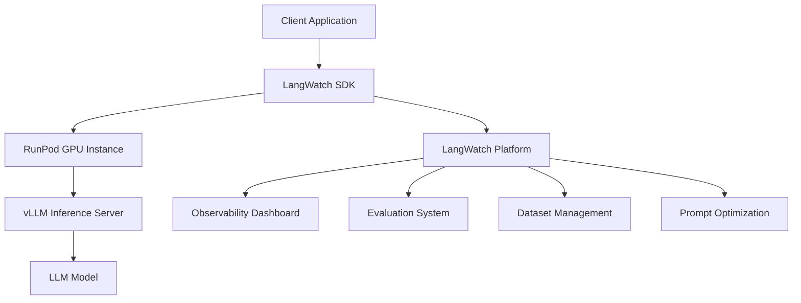

⏱️ **وقت القراءة المقدر**: 12 دقائق

## مقدمة

لكي تعمل التطبيقات المبنية على النماذج اللغوية الكبيرة (LLM) بشكل موثوق في بيئات الإنتاج، تُعدّ أنظمة الملاحظة والتقييم والتحسين المنهجية ضرورة لا غنى عنها. [LangWatch](https://github.com/langwatch/langwatch) هي منصة مفتوحة المصدر تلبي متطلبات LLMOps هذه، وتعتمد على معيار OpenTelemetry لإتاحة إدارة دورة حياة تطبيقات النماذج اللغوية الكبيرة بالكامل.

### القيمة الجوهرية لـ LangWatch

**قيود أدوات المراقبة التقليدية**:
- تفتقر أدوات APM العامة إلى مقاييس مخصصة للنماذج اللغوية الكبيرة
- تتبع جودة النصوص التوجيهية ودقة الاستجابات أمر صعب
- تحسين التكاليف وتحليل الأداء عمليتان معقدتان

**ما تقدمه LangWatch**:
- إمكانية ملاحظة وتتبع مصممة خصيصاً للنماذج اللغوية الكبيرة
- أطر تقييم في الوقت الفعلي وغير متصل بالإنترنت
- أدوات لإدارة إصدارات النصوص التوجيهية وتحسينها
- تكامل أصيل مع أطر عمل النماذج اللغوية الكبيرة المتنوعة

## تحليل الميزات الجوهرية لـ LangWatch

### 1. الملاحظة (Observability)

تتتبع LangWatch جميع التفاعلات في تطبيق النموذج اللغوي الكبير باستخدام معيار OpenTelemetry.

**عناصر التتبع الرئيسية**:
- **تتبع الطلب/الاستجابة**: التدفق الكامل للنصوص التوجيهية المُدخلة واستجابات النموذج
- **تحليل زمن الاستجابة**: سرعة توليد الرموز والوقت حتى أول رمز (TTFT)
- **تتبع التكلفة**: استخدام الرموز وحساب التكلفة لكل استدعاء API
- **مراقبة الأخطاء**: تحليل الطلبات الفاشلة وحالات الاستثناء

```python
import langwatch
from openai import OpenAI

client = OpenAI()

@langwatch.trace()
def chat_completion(messages):
    """OpenAI API call tracked by LangWatch"""
    langwatch.get_current_trace().autotrack_openai_calls(client)
    
    response = client.chat.completions.create(
        model="gpt-4",
        messages=messages,
        temperature=0.7
    )
    
    return response.choices[0].message.content
```

### 2. نظام التقييم (Evaluation System)

**التقييم في الوقت الفعلي**:
- مراقبة جودة الاستجابات في بيئة الإنتاج لحظياً
- الجمع بين تغذية المستخدمين الراجعة ومقاييس التقييم الآلي
- الكشف المبكر عن تدهور الأداء

**التقييم غير المتصل بالإنترنت**:
- التقييم المجمّع القائم على مجموعات البيانات
- مقارنة أداء النماذج من خلال اختبارات A/B
- تحليل تأثير تغييرات النصوص التوجيهية

**مقاييس التقييم**:
- **الصلة (Relevance)**: درجة الارتباط بين السؤال والجواب
- **الدقة (Accuracy)**: التحقق من الحقائق وصحة المعلومات
- **الاتساق (Consistency)**: انتظام الاستجابات للأسئلة المتطابقة
- **السلامة (Safety)**: الكشف عن المحتوى الضار وتصفيته

### 3. إدارة مجموعات البيانات

**الإنشاء التلقائي لمجموعات البيانات**:
- إنشاء مجموعات بيانات تلقائياً من الرسائل المتتبعة
- تحليل أنماط تفاعل المستخدمين
- استخراج حالات اختبار تستند إلى الاستخدام الفعلي

**رفع مجموعات البيانات يدوياً**:
- رفع مجموعات بيانات مخصصة للتقييم
- إدارة حالات الاختبار الخاصة بالنطاق
- بناء مجموعات بيانات ذهبية للتقييم المستمر

### 4. تحسين النصوص التوجيهية

**التحكم في الإصدارات**:
- تتبع تغييرات النصوص التوجيهية
- تحليل تأثير الأداء
- دعم التراجع واختبارات A/B

**التحسين التلقائي**:
- يستخدم خوارزمية MIPROv2 من DSPy
- الإنشاء التلقائي لأمثلة قليلة التعلم (few-shot)
- تحسين قوالب النصوص التوجيهية

```python
# Prompt version control example
from langwatch import prompt_manager

# Register a prompt version
prompt_v1 = prompt_manager.create_prompt(
    name="customer_support",
    version="1.0",
    template="You are a customer support agent. Question: {question}",
    parameters=["question"]
)

# Test new version alongside performance evaluation
prompt_v2 = prompt_manager.test_prompt(
    base_prompt=prompt_v1,
    modifications={"add_examples": True, "tone": "friendly"},
    evaluation_dataset="customer_queries_100"
)
```

## الاستخدام التكاملي مع منصات الذكاء الاصطناعي

### التكامل مع RunPod

RunPod منصة توفر بنية تحتية للحوسبة السحابية بوحدات معالجة الرسوميات (GPU). يُمكّن استخدامها مع LangWatch من بناء بيئة LLMOps قوية.

**معمارية التكامل**:



**إعداد RunPod + LangWatch**:

```python
# Running a vLLM server on RunPod
import requests
import langwatch

# RunPod endpoint configuration
RUNPOD_ENDPOINT = "https://api.runpod.ai/v2/your-endpoint-id"
RUNPOD_API_KEY = "your-runpod-api-key"

@langwatch.trace()
def call_runpod_llm(prompt, model="meta-llama/Llama-2-7b-chat-hf"):
    """Call an LLM hosted on RunPod"""
    
    headers = {
        "Authorization": f"Bearer {RUNPOD_API_KEY}",
        "Content-Type": "application/json"
    }
    
    payload = {
        "input": {
            "prompt": prompt,
            "model": model,
            "max_tokens": 512,
            "temperature": 0.7
        }
    }
    
    # Track the request in LangWatch
    with langwatch.trace_span("runpod_inference") as span:
        span.set_attribute("model", model)
        span.set_attribute("prompt_length", len(prompt))
        
        response = requests.post(
            f"{RUNPOD_ENDPOINT}/run",
            headers=headers,
            json=payload
        )
        
        result = response.json()
        
        # Record response metrics
        span.set_attribute("response_length", len(result.get("output", "")))
        span.set_attribute("inference_time", result.get("execution_time", 0))
        
        return result["output"]
```

### التكامل مع vLLM للتحسين

vLLM مكتبة استدلال للنماذج اللغوية الكبيرة توفر إنتاجية عالية واستخداماً فعالاً للذاكرة.

**تكامل vLLM + LangWatch**:

```python
from vllm import LLM, SamplingParams
import langwatch

class OptimizedLLMService:
    def __init__(self, model_name="meta-llama/Llama-2-7b-chat-hf"):
        self.llm = LLM(
            model=model_name,
            tensor_parallel_size=2,  # GPU parallel processing
            max_model_len=4096,
            trust_remote_code=True
        )
        
        self.sampling_params = SamplingParams(
            temperature=0.7,
            top_p=0.95,
            max_tokens=512
        )
    
    @langwatch.trace()
    def generate(self, prompts, batch_size=8):
        """Batch-optimized generation"""
        
        with langwatch.trace_span("vllm_batch_inference") as span:
            span.set_attribute("batch_size", len(prompts))
            span.set_attribute("model", self.llm.llm_engine.model_config.model)
            
            # vLLM batch inference
            outputs = self.llm.generate(prompts, self.sampling_params)
            
            # Calculate throughput metrics
            total_tokens = sum(len(output.outputs[0].token_ids) for output in outputs)
            span.set_attribute("total_output_tokens", total_tokens)
            span.set_attribute("throughput_tokens_per_second", 
                             total_tokens / span.duration if span.duration > 0 else 0)
            
            return [output.outputs[0].text for output in outputs]

# Usage example
llm_service = OptimizedLLMService()

prompts = [
    "Explain the future of AI.",
    "What are solutions to climate change?",
    "Briefly explain the principles of quantum computing."
]

responses = llm_service.generate(prompts)
```

### تسريع TensorRT-LLM

يمكن استخدام NVIDIA TensorRT-LLM لتعظيم أداء الاستدلال.

```python
import tensorrt_llm
import langwatch

class TensorRTLLMService:
    def __init__(self, engine_path):
        self.engine = tensorrt_llm.LLMEngine(engine_path)
        
    @langwatch.trace()
    def optimized_inference(self, prompt):
        """TensorRT-optimized inference"""
        
        with langwatch.trace_span("tensorrt_inference") as span:
            # Collect inference performance metrics
            start_time = time.time()
            
            result = self.engine.generate(
                prompt,
                max_new_tokens=512,
                temperature=0.7
            )
            
            inference_time = time.time() - start_time
            
            # Record performance data in LangWatch
            span.set_attribute("inference_time_ms", inference_time * 1000)
            span.set_attribute("tokens_per_second", 
                             len(result.split()) / inference_time)
            
            return result
```

## سير العمل العملي لـ LLMOps

### 1. مرحلة التطوير

```python
# LangWatch configuration in the development environment
import langwatch

# Development mode configuration
langwatch.init(
    api_key="your-dev-api-key",
    endpoint="http://localhost:5560",  # Local LangWatch instance
    environment="development"
)

@langwatch.trace()
def prototype_chatbot(user_input):
    """Prototype chatbot function"""
    
    # Testing a prompt template
    system_prompt = """You are a helpful AI assistant.
    Please answer user questions accurately and kindly."""
    
    response = call_llm(system_prompt, user_input)
    
    # Immediate evaluation during development
    evaluation_score = langwatch.evaluate_response(
        prompt=user_input,
        response=response,
        criteria=["relevance", "helpfulness", "safety"]
    )
    
    return response, evaluation_score
```

### 2. مرحلة التدريج (Staging)

```python
# Automatic evaluation configuration in the staging environment
@langwatch.trace()
def staging_deployment():
    """Comprehensive testing in the staging environment"""
    
    # Load test dataset
    test_dataset = langwatch.load_dataset("customer_support_test_100")
    
    results = []
    for test_case in test_dataset:
        response = production_chatbot(test_case.input)
        
        # Run automatic evaluation
        evaluation = langwatch.auto_evaluate(
            input=test_case.input,
            output=response,
            expected=test_case.expected,
            metrics=["accuracy", "relevance", "safety"]
        )
        
        results.append({
            "input": test_case.input,
            "output": response,
            "scores": evaluation.scores,
            "passed": evaluation.overall_score > 0.8
        })
    
    # Staging results report
    langwatch.create_evaluation_report(
        results=results,
        environment="staging",
        deployment_version="v1.2.0"
    )
    
    return results
```

### 3. مرحلة الإنتاج

```python
# Real-time monitoring in the production environment
@langwatch.trace()
def production_chatbot(user_input, user_id=None):
    """Production chatbot with real-time monitoring"""
    
    with langwatch.trace_span("production_inference") as span:
        # Add user context
        span.set_attribute("user_id", user_id)
        span.set_attribute("input_length", len(user_input))
        
        # Safety pre-check
        safety_check = langwatch.safety_filter(user_input)
        if not safety_check.is_safe:
            span.set_attribute("safety_blocked", True)
            return "عذراً، لا يمكننا معالجة هذا الطلب."
        
        # LLM inference
        response = optimized_llm_call(user_input)
        
        # Real-time quality evaluation
        quality_score = langwatch.real_time_evaluate(
            input=user_input,
            output=response,
            metrics=["relevance", "coherence"]
        )
        
        span.set_attribute("quality_score", quality_score.overall)
        span.set_attribute("response_length", len(response))
        
        # Alert on detection of low-quality responses
        if quality_score.overall < 0.7:
            langwatch.alert(
                type="low_quality_response",
                severity="warning",
                details={
                    "user_id": user_id,
                    "score": quality_score.overall,
                    "input": user_input[:100] + "..."
                }
            )
        
        return response

# Production metrics dashboard configuration
langwatch.setup_dashboard(
    metrics=[
        "requests_per_minute",
        "average_response_time",
        "quality_score_distribution",
        "error_rate",
        "cost_per_token"
    ],
    alerts=[
        {"metric": "error_rate", "threshold": 0.05, "action": "email"},
        {"metric": "avg_quality_score", "threshold": 0.8, "action": "slack"},
        {"metric": "cost_per_hour", "threshold": 100, "action": "email"}
    ]
)
```

## إعداد بيئة التطوير المحلية على macOS

### إعداد Docker Compose

لنشغّل LangWatch محلياً لبناء بيئة التطوير.

```bash
# Clone and run LangWatch
git clone https://github.com/langwatch/langwatch.git
cd langwatch

# Copy environment configuration file
cp langwatch/.env.example langwatch/.env

# Run with Docker Compose (for ARM Mac)
docker compose -f compose.yml -f docker-compose.arm64.override.yml up -d --wait --build

# Open in browser
open http://localhost:5560
```

### إعداد SDK لبيئة التطوير

```bash
# Create Python virtual environment
python3 -m venv langwatch-dev
source langwatch-dev/bin/activate

# Install LangWatch SDK
pip install langwatch

# Install development dependencies
pip install openai python-dotenv jupyter
```

### إعداد متغيرات البيئة

```bash
# Add to ~/.zshrc
export LANGWATCH_API_KEY="lw-your-local-dev-key"
export LANGWATCH_ENDPOINT="http://localhost:5560"
export OPENAI_API_KEY="your-openai-api-key"

# Add aliases
alias langwatch-local="docker compose -f ~/langwatch/compose.yml up -d"
alias langwatch-stop="docker compose -f ~/langwatch/compose.yml down"
alias langwatch-logs="docker compose -f ~/langwatch/compose.yml logs -f"

# Apply changes
source ~/.zshrc
```

### كتابة نص اختبار

```python
# test_langwatch_integration.py
import os
import langwatch
from openai import OpenAI

# Initialize LangWatch
langwatch.init(
    api_key=os.getenv("LANGWATCH_API_KEY"),
    endpoint=os.getenv("LANGWATCH_ENDPOINT")
)

client = OpenAI()

@langwatch.trace()
def test_basic_integration():
    """Basic integration test"""
    
    # Configure automatic OpenAI tracking
    langwatch.get_current_trace().autotrack_openai_calls(client)
    
    # Test request
    response = client.chat.completions.create(
        model="gpt-3.5-turbo",
        messages=[
            {"role": "system", "content": "You are a helpful AI assistant."},
            {"role": "user", "content": "List three advantages of Python."}
        ],
        temperature=0.7,
        max_tokens=200
    )
    
    result = response.choices[0].message.content
    print(f"Response: {result}")
    
    # Run evaluation
    evaluation = langwatch.evaluate_response(
        prompt="List three advantages of Python.",
        response=result,
        criteria=["relevance", "accuracy", "completeness"]
    )
    
    print(f"Evaluation score: {evaluation}")
    
    return result, evaluation

if __name__ == "__main__":
    result, evaluation = test_basic_integration()
    print("\n اكتمل اختبار تكامل LangWatch!")
    print(f"LangWatch dashboard: http://localhost:5560")
```

### التشغيل والتحقق

```bash
# Run test
python test_langwatch_integration.py

# View results in browser
open http://localhost:5560

# Check logs
langwatch-logs
```

## حالات الاستخدام المتقدمة

### 1. اختبار A/B متعدد النماذج

```python
import random
import langwatch

@langwatch.trace()
def multi_model_ab_test(user_input):
    """Test multiple models simultaneously"""
    
    models = [
        {"name": "gpt-4", "weight": 0.3},
        {"name": "gpt-3.5-turbo", "weight": 0.5},
        {"name": "claude-3-sonnet", "weight": 0.2}
    ]
    
    # Select model based on weights
    selected_model = random.choices(
        models, 
        weights=[m["weight"] for m in models]
    )[0]
    
    with langwatch.trace_span("model_selection") as span:
        span.set_attribute("selected_model", selected_model["name"])
        span.set_attribute("selection_weight", selected_model["weight"])
        
        response = call_model(selected_model["name"], user_input)
        
        # Collect per-model performance metrics
        langwatch.record_metric(
            name=f"response_quality_{selected_model['name']}",
            value=evaluate_response_quality(response),
            tags={"model": selected_model["name"]}
        )
        
        return response
```

### 2. التحسين التلقائي للنصوص التوجيهية

```python
from langwatch.optimization import DSPyOptimizer

class AutoPromptOptimizer:
    def __init__(self):
        self.optimizer = DSPyOptimizer()
        
    def optimize_prompt(self, base_prompt, training_data, metrics):
        """Automatic prompt optimization"""
        
        optimization_run = langwatch.start_optimization(
            name="customer_support_prompt_v2",
            base_prompt=base_prompt,
            training_data=training_data
        )
        
        # Optimization using DSPy MIPROv2
        optimized_prompt = self.optimizer.optimize(
            prompt_template=base_prompt,
            training_examples=training_data,
            eval_metrics=metrics,
            iterations=50
        )
        
        # Evaluate optimization results
        evaluation_results = langwatch.evaluate_prompt(
            original_prompt=base_prompt,
            optimized_prompt=optimized_prompt,
            test_dataset=training_data,
            metrics=metrics
        )
        
        langwatch.complete_optimization(
            run_id=optimization_run.id,
            results=evaluation_results,
            optimized_prompt=optimized_prompt
        )
        
        return optimized_prompt, evaluation_results

# Usage example
optimizer = AutoPromptOptimizer()

base_prompt = """You are a customer support agent.
Please respond to customer inquiries kindly and accurately.

Customer inquiry: {question}
Response:"""

training_data = [
    {"question": "What is the refund policy?", "expected": "Full refund within 14 days..."},
    {"question": "How long does shipping take?", "expected": "Standard shipping is 2-3 days..."},
    # ... more examples
]

optimized_prompt, results = optimizer.optimize_prompt(
    base_prompt=base_prompt,
    training_data=training_data,
    metrics=["accuracy", "helpfulness", "response_time"]
)
```

### 3. مراقبة تحسين التكاليف

```python
class CostOptimizedLLMService:
    def __init__(self):
        self.cost_thresholds = {
            "hourly": 50,    # $50/hour
            "daily": 500,    # $500/day
            "monthly": 10000 # $10,000/month
        }
        
    @langwatch.trace()
    def cost_aware_inference(self, prompt, priority="normal"):
        """Inference execution with cost awareness"""
        
        # Check current cost usage
        current_costs = langwatch.get_cost_metrics()
        
        with langwatch.trace_span("cost_check") as span:
            span.set_attribute("hourly_cost", current_costs.hourly)
            span.set_attribute("daily_cost", current_costs.daily)
            span.set_attribute("priority", priority)
            
            # Check cost thresholds
            if current_costs.hourly > self.cost_thresholds["hourly"]:
                if priority == "low":
                    span.set_attribute("cost_limited", True)
                    return "الخدمة محدودة مؤقتاً."
                elif priority == "normal":
                    # Fall back to a cheaper model
                    model = "gpt-3.5-turbo"  # instead of gpt-4
                else:
                    model = "gpt-4"  # high priority uses high-performance model
            else:
                model = "gpt-4"
            
            span.set_attribute("selected_model", model)
            
            response = call_model(model, prompt)
            
            # Calculate cost of this request
            estimated_cost = estimate_request_cost(prompt, response, model)
            span.set_attribute("request_cost", estimated_cost)
            
            # Check cost alerts
            if current_costs.daily + estimated_cost > self.cost_thresholds["daily"]:
                langwatch.alert(
                    type="cost_threshold_approached",
                    severity="warning",
                    details={"daily_cost": current_costs.daily + estimated_cost}
                )
            
            return response
```

## خاتمة

LangWatch منصة شاملة تلبي متطلبات LLMOps الحديثة. من خلال ميزات كإمكانية الملاحظة القائمة على OpenTelemetry وأنظمة التقييم في الوقت الفعلي وغير المتصلة بالإنترنت والتحسين التلقائي للنصوص التوجيهية، تُمكّن من الإدارة الفعالة لدورة حياة تطبيقات النماذج اللغوية الكبيرة بالكامل.

### ملخص المزايا الرئيسية

1. **إمكانية ملاحظة موحدة**: متوافقة مع أطر عمل النماذج اللغوية الكبيرة المتنوعة عبر OpenTelemetry
2. **تقييم شامل**: الجمع بين المراقبة في الوقت الفعلي والتقييم غير المتصل بالإنترنت
3. **تحسين آلي**: التحسين التلقائي للنصوص التوجيهية باستخدام DSPy MIPROv2
4. **كفاءة التكلفة**: تتبع مفصل للتكاليف وميزات التحسين
5. **قابلية التوسع**: التكامل مع بنى تحتية متنوعة مثل RunPod وvLLM

### الخطوات التالية الموصى بها

1. **إعداد البيئة المحلية**: ضبط بيئة التطوير باستخدام Docker Compose
2. **التبني التدريجي**: التطبيق بالترتيب التالي: التطوير ثم التدريج ثم الإنتاج
3. **تعريف المقاييس**: تحديد مؤشرات التقييم المنسجمة مع أهداف العمل
4. **بناء الأتمتة**: دمج عملية التقييم في بنية CI/CD
5. **التعاون الجماعي**: بناء عملية تعاون بين خبراء النطاق وفريق التطوير

يُحسّن إطار عمل LLMOps المبني باستخدام LangWatch جودة تطبيقات الذكاء الاصطناعي واستقرارها بشكل ملحوظ، ويُمكّن من التحسين والتطوير المستمرين. ويُتيح دمجه مع البنية التحتية الحديثة للذكاء الاصطناعي كـ RunPod وvLLM بناء بيئة تشغيل نماذج لغوية كبيرة أكثر قوة وكفاءة.
