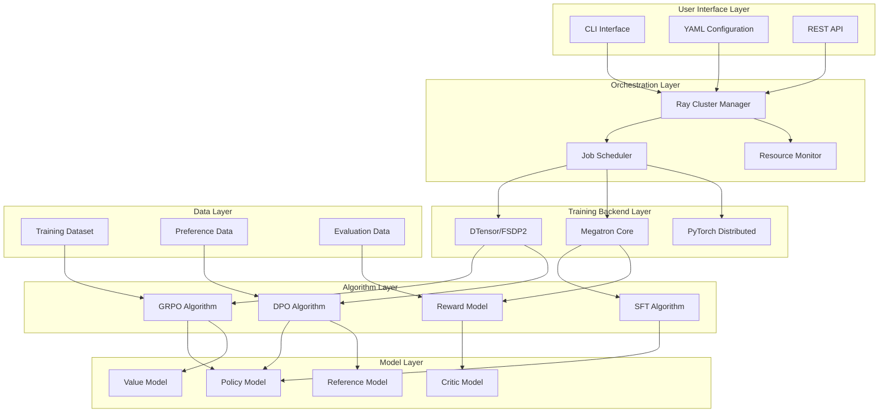
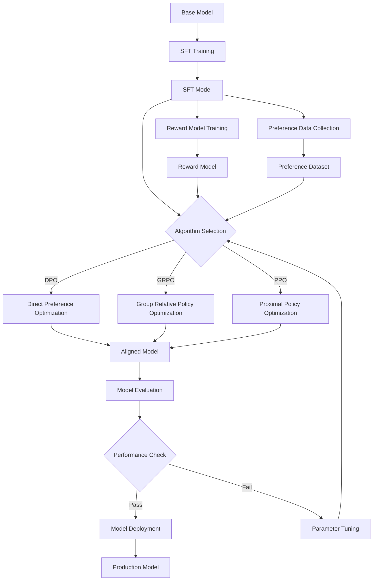

⏱️ **وقت القراءة المقدر**: 15 دقائق

## مقدمة

يُعدّ التدريب اللاحق (Post-Training) حجر الأساس لتعظيم أداء النماذج اللغوية الكبيرة (LLMs). يقدّم NVIDIA NeMo RL إطار عمل للتعلم المعزز يتبنى منهجية هندسية متقنة في مجال التدريب اللاحق، ويوفر معمارية قابلة للتوسع من وحدة معالجة رسومية (GPU) واحدة وصولاً إلى آلاف منها.

سجّل [مستودع NVIDIA NeMo RL على GitHub](https://github.com/NVIDIA-NeMo/RL) ما يزيد على 662 نجمة و104 تفرعات، مما يعكس نشاطاً تطويرياً مستمراً. يقدم هذا المقال تحليلاً شاملاً لـ NeMo RL يغطي معماريته والخوارزميات الرئيسية وإرشادات النشر العملي.

## نظرة عامة على NVIDIA NeMo RL

### الخصائص الجوهرية

يُعرَّف NVIDIA NeMo RL بوصفه **"حزمة أدوات قابلة للتوسع لتعزيز النماذج بكفاءة"** (Scalable toolkit for efficient model reinforcement)، ويتميز بالخصائص التالية:

- **قابلية التوسع**: توسع خطي من وحدة GPU واحدة إلى آلاف وحدات GPU
- **النمطية**: معمارية مكونات قائمة على المكونات الإضافية (Plugin-based)
- **الكفاءة**: معالجة موزعة محسّنة لاستخدام الذاكرة
- **التعددية**: دعم مجموعة واسعة من خوارزميات التعلم المعزز

### الاختلافات عن NeMo Aligner

يمثّل NeMo RL تطوراً على NeMo Aligner السابق، ويشمل التحسينات التالية:

| الجانب | NeMo Aligner | NeMo RL |
|--------|-------------|---------|
| **المعمارية** | بنية متجانسة (Monolithic) | خدمات مصغرة نمطية |
| **قابلية التوسع** | توسع محدود | توسع أفقي غير محدود |
| **الواجهة الخلفية** | تمحور حول Megatron | DTensor + Megatron متعدد الواجهات الخلفية |
| **الخوارزميات** | RLHF وDPO | GRPO وDPO وSFT وRM + إضافات |

## تحليل معمق للمعمارية

### معمارية النظام الكاملة

تُصمَّم معمارية NeMo RL بنية طبقية تتمتع فيها كل طبقة بأدوار ومسؤوليات محددة بوضوح:

#### الطبقات المعمارية الرئيسية

1. **طبقة واجهة المستخدم**
   - CLI Interface: واجهة التنفيذ عبر سطر الأوامر
   - YAML Configuration: إدارة الإعدادات بأسلوب تصريحي
   - REST API: واجهة برمجية للوصول البرمجي

2. **طبقة التنسيق**
   - Ray Cluster Manager: إدارة موارد الحوسبة الموزعة
   - Job Scheduler: جدولة مهام التدريب وإدارتها
   - Resource Monitor: مراقبة الموارد في الوقت الفعلي

3. **طبقة واجهة التدريب الخلفية**
   - DTensor/FSDP2: تقنية التدريب الموزع من الجيل التالي في PyTorch
   - Megatron Core: محرك المعالجة المتوازية من NVIDIA للنماذج ذات الحجم الكبير
   - PyTorch Distributed: واجهة التدريب الموزع الأساسية

### تحليل المكونات الجوهرية

#### معمارية المعالجة الموزعة المبنية على Ray

يحقق NeMo RL قابلية التوسع من خلال نظام معالجة موزع مبني على Ray:

- **الإدارة التلقائية للموارد**: يدير Ray تلقائياً موارد GPU وCPU والذاكرة
- **التوسع الديناميكي**: توسع وتقليص تلقائي بحسب عبء العمل
- **مقاومة الأعطال**: آليات استرداد تلقائي عند فشل العقد
- **دعم متعدد المجموعات**: توافق مع Kubernetes وSlurm وبيئات مجموعات أخرى

#### نظام التدريب متعدد الواجهات الخلفية

من أبرز خصائص NeMo RL دعمه لواجهات تدريب خلفية متعددة:

| الواجهة الخلفية | حالة الاستخدام المثلى | كفاءة الذاكرة | قابلية التوسع |
|----------------|---------------------|---------------|---------------|
| **DTensor/FSDP2** | نماذج صغيرة إلى متوسطة الحجم (أقل من 100B) | مرتفعة جداً | معتدلة |
| **Megatron Core** | نماذج كبيرة الحجم (أكثر من 100B) | مرتفعة | مرتفعة جداً |
| **PyTorch Distributed** | النمذجة الأولية والتجارب الصغيرة | معتدلة | منخفضة |

#### آلية الاختيار التلقائي للواجهة الخلفية

يختار NeMo RL تلقائياً الواجهة الخلفية المثلى استناداً إلى إعدادات YAML:

- **استناداً إلى حجم النموذج**: اختيار تلقائي للواجهة الخلفية وفق عدد المعاملات
- **استناداً إلى تكوين الأجهزة**: تحسين وفق عدد وحدات GPU والذاكرة المتاحة
- **استناداً إلى نوع المهمة**: تحسين مخصص لكل خوارزمية (SFT وDPO وGRPO وغيرها)

## مكدس التقنيات ونظام بيئة المكتبات

### مكدس التقنيات الجوهري

يُبنى مكدس تقنيات NeMo RL على التقنيات الحديثة التالية:

#### اللغات والأطر

- **Python 95.1%**: لغة التطوير الرئيسية
- **Shell Scripts 4.7%**: نصوص الأتمتة والنشر
- **Docker 0.2%**: الحاويات والنشر

#### أطر التعلم العميق

- **PyTorch**: إطار التعلم العميق الجوهري
- **PyTorch Lightning**: تجريد تدريب عالي المستوى
- **Hugging Face Transformers**: نظام بيئي للنماذج مسبقة التدريب

#### المعالجة الموزعة والتوازي

- **Ray**: تنسيق الحوسبة الموزعة
- **NVIDIA Megatron**: المعالجة المتوازية للنماذج ذات الحجم الكبير
- **PyTorch FSDP2**: تقسيم البيانات الموزع الكامل من الجيل التالي

#### إدارة الحزم وأدوات التطوير

- **UV**: مدير حزم Python عالي الأداء
- **Pre-commit**: إدارة جودة الكود
- **Docker**: بيئة الحاويات والنشر

### تبعيات المكتبات الخارجية

يتكامل NeMo RL مع المكتبات الخارجية الرئيسية التالية:

- **vLLM**: محرك استدلال عالي الأداء
- **TensorBoard/WandB**: تتبع التجارب ومراقبتها
- **Hydra**: إطار إدارة الإعدادات
- **APEX**: مكتبة NVIDIA للتدريب بدقة مختلطة

## تحليل معمق لخوارزميات التعلم المعزز

### GRPO (تحسين السياسة النسبي للمجموعة)

تُعدّ GRPO إحدى الخوارزميات الجوهرية في NeMo RL، وهي مصممة لتحسين قدرات الاستدلال الرياضي:

#### الخصائص الرئيسية لـ GRPO

- **التحسين القائم على المجموعات**: تجميع استجابات متعددة للمقارنة النسبية للأداء
- **استقرار محسّن**: ثبات أفضل في التدريب مقارنةً بـ PPO التقليدي
- **الكفاءة**: استخدام محسّن للذاكرة
- **الاستدلال الرياضي**: يستفيد من مجموعة بيانات OpenInstructMath2

### DPO (التحسين المباشر للتفضيلات)

DPO خوارزمية تُنمذج تفضيلات البشر بصورة مباشرة:

#### مزايا DPO

- **البساطة**: تعقيد تنفيذي أقل مقارنةً بـ PPO
- **الاستقرار**: تحسين مباشر دون الحاجة إلى نموذج مكافأة
- **الكفاءة**: وقت تدريب أقصر
- **قابلية التوسع**: قابل للتطبيق على النماذج ذات الحجم الكبير

### SFT (الضبط الدقيق الخاضع للإشراف)

SFT منهجية ضبط دقيق قائمة على التعلم الخاضع للإشراف:

#### خصائص SFT

- **الضبط الدقيق الأساسي**: مرحلة الضبط الأولي التي تسبق RLHF
- **دعم مجموعات بيانات متنوعة**: تكامل سهل لمجموعات البيانات المخصصة
- **تدريب فعّال**: دعم من وحدة GPU واحدة حتى الإعدادات متعددة العقد

### RM (نموذج المكافأة)

نموذج المكافأة مكوّن جوهري يتعلم تفضيلات البشر:

#### دور نموذج المكافأة

- **نمذجة التفضيلات**: تعلم دالة مكافأة من التغذية الراجعة البشرية
- **تقييم الجودة**: تقييم جودة الاستجابات المولّدة
- **إشارة التعلم المعزز**: توفير إشارات المكافأة لـ RLHF

## سير عمل التدريب والخط الأنبوبي

### خط أنبوبي شامل للتدريب

يتبع خط أنبوبي التدريب في NeMo RL منهجاً منظماً ونمطياً:

#### وصف مراحل الخط الأنبوبي

1. **النموذج الأساسي (Base Model)**: النموذج التأسيسي مسبق التدريب (Llama وMistral وغيرهما)
2. **تدريب SFT**: الضبط الدقيق الأولي الخاضع للإشراف
3. **تدريب نموذج المكافأة**: تدريب نموذج مكافأة على بيانات تفضيلات بشرية
4. **اختيار الخوارزمية**: اختيار الخوارزمية المثلى من DPO وGRPO وPPO
5. **تقييم النموذج**: تقييم الأداء عبر معايير قياسية متنوعة
6. **النشر الإنتاجي**: النشر في بيئة الإنتاج

### سير عمل التدريب الموزع متعدد العقد

يدعم NeMo RL التدريب الموزع الفعّال في بيئات المجموعات الكبيرة:

#### دعم بيئات المجموعات

- **Slurm**: جدولة المهام في بيئات الحوسبة عالية الأداء (HPC)
- **Kubernetes**: تنسيق قائم على الحاويات
- **Ray Cluster**: إدارة تلقائية للموارد والتوسع

#### تحسينات التدريب الموزع

- **تراكم التدرجات (Gradient Accumulation)**: تحديثات تدرجية موفّرة للذاكرة
- **الدقة المختلطة (Mixed Precision)**: تحسين الذاكرة والسرعة عبر FP16/BF16
- **التوازي الأنبوبي (Pipeline Parallelism)**: معالجة متوازية على مستوى طبقات النموذج
- **التوازي الموترى (Tensor Parallelism)**: حسابات موزعة على مستوى الموتر

## إرشادات النشر في البيئات المؤسسية

### استراتيجية التبني

#### المرحلة الأولى: إعداد البيئة والتحقق منها

- **تحليل متطلبات الأجهزة**: تقييم ذاكرة GPU وعرض النطاق الترددي للشبكة
- **تكوين مكدس البرامج**: إعداد بيئات CUDA وPyTorch وRay
- **تجربة صغيرة النطاق**: إثبات المفهوم على وحدة GPU واحدة

#### المرحلة الثانية: مشروع تجريبي

- **إعداد مجموعة البيانات**: جمع البيانات الخاصة بالمجال ومعالجتها مسبقاً
- **اختيار النموذج**: اختيار النموذج الأساسي المتوافق مع متطلبات المؤسسة
- **الضبط الدقيق الأولي**: تحقيق أداء قاعدي عبر SFT

#### المرحلة الثالثة: التوسع الإنتاجي

- **التوسع متعدد العقد**: التوسع نحو بيئات المجموعات الكبيرة
- **إعداد المراقبة**: تتبع التجارب عبر WandB وTensorBoard
- **خط أنبوبي CI/CD**: خطوط أنابيب آلية للتدريب والنشر

### استراتيجيات تحسين التكاليف

#### تحسين الموارد

- **التوسع الديناميكي**: ضبط تلقائي للموارد بحسب عبء العمل
- **استخدام حالات Spot**: تخفيض التكاليف في البيئات السحابية
- **نقاط التفتيش (Checkpointing)**: تقليل تكاليف إعادة التشغيل عند انقطاع التدريب

#### تحسينات الكفاءة

- **تقنيات PEFT**: تعظيم كفاءة المعاملات عبر LoRA وAdaLoRA وما شابهها
- **التوازي في البيانات**: تحميل البيانات ومعالجتها مسبقاً بكفاءة
- **تحسين الذاكرة**: توظيف Gradient Checkpointing وActivation Checkpointing

### الأمان والحوكمة

#### أمان البيانات

- **تشفير البيانات**: تشفير بيانات التدريب وأوزان النماذج
- **التحكم في الوصول**: تطبيق التحكم في الوصول القائم على الأدوار (RBAC)
- **سجلات التدقيق**: ضمان إمكانية تتبع جميع أنشطة التدريب

#### حوكمة النماذج

- **إدارة الإصدارات**: الإدارة المنهجية لإصدارات النماذج والتجارب
- **مراقبة الأداء**: التتبع المستمر لأداء النموذج
- **الذكاء الاصطناعي المسؤول**: الكشف عن التحيز وتقييم النزاهة

## المعايير القياسية للأداء والتقييم

### مقاييس التقييم

يقيس NeMo RL أداء النماذج عبر مجموعة متنوعة من مؤشرات التقييم:

#### مقاييس الأداء العامة

- **MATH-500**: تقييم قدرة الاستدلال الرياضي
- **HumanEval**: تقييم قدرة البرمجة
- **HellaSwag**: تقييم الاستدلال بالحس السليم
- **MMLU**: تقييم الفهم اللغوي متعدد التخصصات

#### مقاييس أداء المحاذاة

- **دقة نموذج المكافأة (Reward Model Accuracy)**: دقة نموذج المكافأة في التنبؤ بتفضيلات البشر
- **معدل الفوز (Win Rate)**: معدل الفوز مقابل المقيّمين البشريين
- **درجة السلامة (Safety Score)**: تقييم السلامة وعدم الإضرار

### استراتيجيات تحسين الأداء

#### ضبط المعاملات الفائقة

- **جدولة معدل التعلم (Learning Rate Scheduling)**: ضبط تكيفي لمعدل التعلم
- **تحسين حجم الدفعة (Batch Size Optimization)**: إيجاد التوازن بين الذاكرة والأداء
- **التنظيم (Regularization)**: تقنيات منع الإفراط في التكيف

#### دليل اختيار الخوارزمية

- **GRPO**: المهام التي يكون فيها الاستدلال الرياضي والتفكير المنطقي أمراً جوهرياً
- **DPO**: تحسين الأداء الحواري العام أو عند الحاجة إلى تدريب سريع
- **SFT**: عندما يكون الهدف الأساسي الضبط الدقيق الأولي أو التكيف مع المجال

## التوقعات المستقبلية وخارطة الطريق

### اتجاهات التطوير التقني

#### تقدم الخوارزميات

- **خوارزميات RL جديدة**: تطوير خوارزميات تعلم معزز أكثر كفاءة
- **التدريب متعدد الوكلاء (Multi-Agent Training)**: تعلم تعاوني بين وكلاء متعددين
- **التعلم المستمر (Continual Learning)**: قدرات تعلم مستمر وتكيف

#### توسع المنصة

- **النشر على الحافة (Edge Deployment)**: تحسين الاستدلال على أجهزة الحافة
- **التعلم الفيدرالي (Federated Learning)**: دعم بيئات التعلم الموزع
- **تكامل AutoML**: تحسين تلقائي للمعاملات الفائقة

### نمو النظام البيئي

#### مساهمات المجتمع

- **النظام البيئي مفتوح المصدر**: مساهمات وتوسعات مجتمعية فاعلة
- **التعاون البحثي**: شراكات بحثية معززة مع الأوساط الأكاديمية
- **تكاملات الأدوات**: تكامل مع مجموعة متنوعة من أدوات MLOps

#### التطبيقات التجارية

- **حلول مؤسسية (Enterprise Solutions)**: عروض حلول على مستوى المؤسسات
- **تكامل سحابي (Cloud Integration)**: تكامل عميق مع منصات السحابة الرئيسية
- **خدمات مدارة (Managed Services)**: عروض خدمات مدارة

## خاتمة

يقدم NVIDIA NeMo RL حلاً عملياً للتدريب اللاحق القائم على التعلم المعزز للنماذج اللغوية الكبيرة. تُرسّخ معماريته القابلة للتوسع المبنية على Ray، ودعمه لواجهات تدريب خلفية متعددة، وخوارزمياته الحديثة كـ GRPO وDPO، مكانتَه بوصفه إطار عمل قابلاً للنشر فعلياً في البيئات المؤسسية.

### ملخص نقاط القوة الجوهرية

1. **قابلية التوسع**: توسع خطي من وحدة GPU واحدة إلى آلاف وحدات GPU
2. **النمطية**: معمارية مرنة قائمة على المكونات الإضافية
3. **الكفاءة**: معالجة موزعة محسّنة لاستخدام الذاكرة
4. **التعددية**: دعم مجموعة واسعة من خوارزميات التعلم المعزز
5. **الإنتاجية**: سلسلة أدوات محسّنة للبيئات المؤسسية

### توصيات التبني

- **المؤسسات البحثية**: التجريب والبحث مع أحدث خوارزميات التعلم المعزز
- **الشركات الكبرى**: الضبط الدقيق المتخصص بالمجال للنماذج اللغوية ذات الحجم الكبير
- **الشركات الناشئة**: محاذاة النماذج بكفاءة وتحسين الأداء
- **مزودو الخدمات السحابية**: بناء منصات خدمات الذكاء الاصطناعي المدارة

يُرسي NVIDIA NeMo RL مرجعاً جديداً في مجال LLMOps، وهو في موضع يُمكّنه من تسريع التبني الصناعي للنماذج اللغوية الكبيرة مستقبلاً. ومن خلال المساهمات المجتمعية المستمرة والتقدم التقني، يسير نحو أن يصبح مكوناً بنية تحتية جوهرياً في النظام البيئي للذكاء الاصطناعي.
