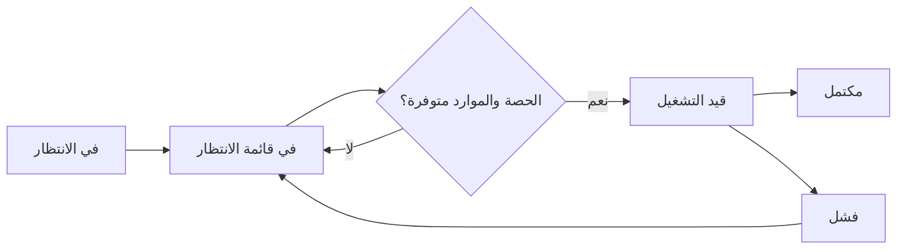
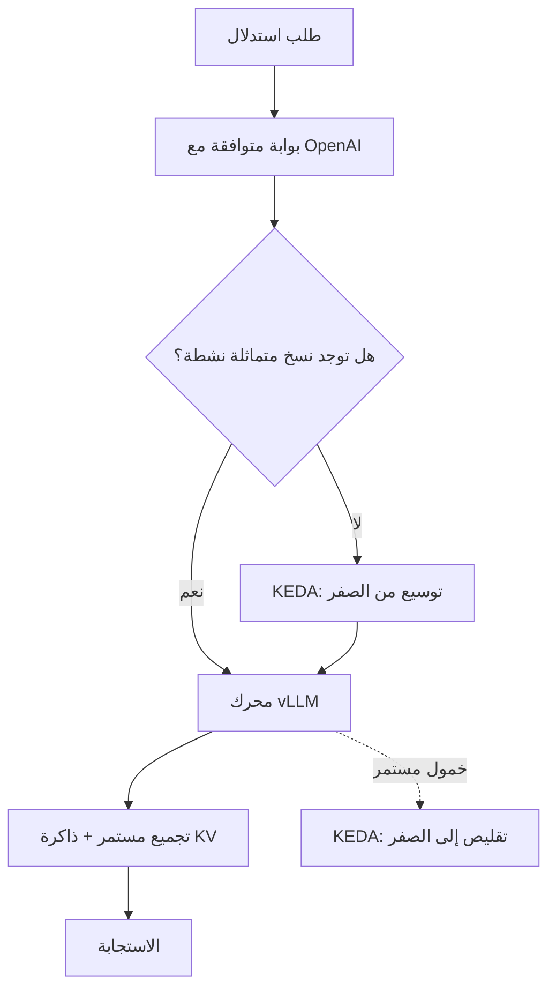
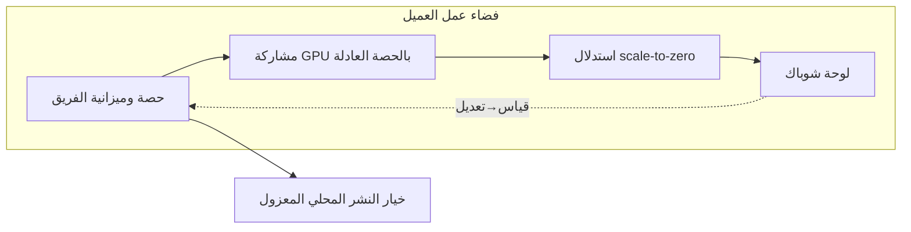

## لا يمكن تخفيض ما لا تستطيع قياسه

يبدأ تخفيض تكاليف استدلال الذكاء الاصطناعي عادةً بفكرة "لنشترِ GPU أرخص"، غير أن هذه نقطة انطلاق خاطئة في معظم الأحيان. فحتى مع GPU H100 واحدة، تتباين تكلفة الرمز المميز (token) بمقدار أضعاف مضاعفة تبعاً لأسلوب الجدولة، ومحرك الاستدلال المستخدم، وطبقة النموذج التي يُوجَّه إليها الطلب. الأجهزة ليست سوى الحد الأدنى للتكاليف، أما الهدر الحقيقي فيتسرب بصمت من طبقة التشغيل الموجودة فوقها.

تواجه ThakiCloud هذه المشكلة يومياً في تشغيل منصة AI/ML المبنية على Kubernetes. هذه المقالة توضح بالتفصيل كيف نخفّض تكاليف الاستدلال داخلياً، وكيف يمكن للعملاء تشغيل ذات الآليات عبر منتجنا، مع الصيغ الرياضية والإعدادات الفعلية — لا شرائح تسويقية، بل المعادلات والأنماط التي نعتمدها فعلاً.

الادعاء الجوهري واحد: **التكاليف لا تنخفض إلا بعد تثبيتها في وحدات قابلة للقياس.** لذا نبدأ بتثبيت تكلفة GPU في الساعة كمعادلة رياضية.

## 1. تثبيت تكلفة GPU في الساعة كمعادلة

السؤال "كم تكلّف وحدة H100 الواحدة؟" لا يكتمل إلا بنصفه. سعر الشراء هو نفقة رأسمالية (CapEx)، بينما الكهرباء وإيجار مركز البيانات والكوادر البشرية تُمثّل نفقات تشغيلية شهرية (OpEx). يجب دمج الاثنين في رقم واحد لكل ساعة لكي نتمكن من احتساب تكلفة الرمز المميز.

آلة حساب التكاليف الداخلية لدينا (`scripts/gen_model_token_cost_xlsx.py`) تُرسّخ هذه المعادلة في الكود:

```text
الاستهلاك الشهري = سعر الشراء / 48 شهراً
تكلفة GPU في الساعة = (الاستهلاك الشهري + OpEx الشهري) / 730 ساعة
تكلفة الرمز المميز ($/1K) = تكلفة GPU في الساعة / (معدل المعالجة tok/s × 3.6)
```

الاستهلاك على 48 شهراً (4 سنوات) افتراض محافظ لعمر GPU مركز البيانات. أما 730 فهو متوسط ساعات الشهر (24 × 365 / 12). الأهم هنا هو **تفكيك OpEx بدقة بدلاً من تجميعه**:

| بند OpEx | التكلفة الشهرية (USD) | أساس الاحتساب |
|---|---|---|
| الطاقة الكهربائية | $58 | TDP × PUE 1.3 × $0.08/kWh × 730h |
| إيجار مركز البيانات | $312 | مساحة الرف والتبريد |
| الشبكة | $150 | عرض النطاق والعبور |
| حصة الكوادر | $100 | توزيع تكاليف التشغيل |
| تراخيص البرمجيات | $52 | المراقبة والتنسيق |
| **الإجمالي** | **$672/شهر** | ثابت بصرف النظر عن نوع GPU |

لافت أن تكلفة إيجار مركز البيانات ($312) تفوق تكلفة الكهرباء ($58). الاعتقاد الشائع بأن "GPU مكلفة لأنها تستهلك طاقة كهربائية كبيرة" مضلّل — في الواقع، الطاقة الكهربائية ليست سوى جزء من OpEx، والإيجار والشبكة أكبر منها. هذا يفسّر لماذا تقتصر بعض عمليات التحسين على فاتورة الكهرباء دون أن تُجدي نفعاً.

يُضاف إلى ذلك واقع السوق الكورية: يُضاف على سعر شراء GPU **علاوة تبلغ نحو 30%** تشمل الجمارك والشحن وهوامش التوزيع. تعكس آلة حسابنا ذلك صراحةً — السعر الأساسي H100 بـ$32,500 يصبح $42,250 في كوريا، وB200 بـ$20,000 يصبح $26,000.

حين تُطبّق هذه المعادلة فعلياً، تحصل على رقم واحد لتكلفة GPU في الساعة، ومن فوقه يصبح حساب "كم تكلّف خدمة هذا النموذج بهذا معدل معالجة لكل رمز مميز" ممكناً. حين تتثبّت التكلفة كمعادلة، يتحوّل التحسين من تخمين إلى حسابيات.


## 2. الاستضافة الذاتية مقابل واجهات برمجة التطبيقات: تشريح الفجوة

بعد تثبيت التكلفة كمعادلة، يصبح السؤال التالي واضحاً: أيهما أرخص — شراء ذات الرموز المميزة عبر API خارجية أم إنتاجها بالاستضافة الذاتية؟

تُظهر ورقة مقارنة API في آلة حسابنا أن الفجوة بين تكلفة الرمز المميز في API التجارية والاستضافة الذاتية تبلغ **50 إلى 100 ضعف**. بطبيعة الحال، هذه الفجوة لا تتحقق إلا حين يكون معدل استغلال GPU مرتفعاً بما فيه الكفاية. فإن استُخدم نصف طاقة GPU فقط، تتضاعف تكلفة الاستضافة الذاتية للرمز المميز. لذا فإن الجدوى الاقتصادية للاستضافة الذاتية تعتمد كلياً على القدرة في "إبقاء GPU مشغولة"، أي على كفاءة الجدولة والاستدلال.

للإشارة، تُخزّن أسعار API الخارجية في سكريبت مراجعة التكاليف اليومية لدينا (`scripts/cost_audit.py`):

```python
# جدول الأسعار في scripts/cost_audit.py (USD / MTok، إدخال/إخراج)
PRICING = {
    "opus":   {"in": 15.0, "out": 75.0},
    "sonnet": {"in": 3.0,  "out": 15.0},
    "haiku":  {"in": 0.80, "out": 4.0},
}
```

رمز إخراج Opus أغلى بنحو 19 مرة من Haiku. استيعاب هذا الجدول وحده يشرح "لماذا تتضخم التكاليف عند تشغيل نفس المهمة بـOpus". سواء أكانت استضافة ذاتية أم API، فإن نصف تحسين التكاليف يكمن في **توجيه كل مهمة إلى النموذج الصحيح**. سنتناول هذا التوجيه لاحقاً.

> للمشاركة برقم داخلي واحد: مررنا بمرحلة أدرنا فيها جزءاً كبيراً من أحمال عمل الوكلاء عبر Claude API الخارجية، بتكلفة شهرية تجاوزت ₩40M (نحو $30K). [تقديري] كان Opus يمثّل ما يقارب نصف هذا الإنفاق، وكان هذا الرصد الدافع المباشر للتحوّل إلى الاستضافة الذاتية وتطبيق توجيه طبقات النماذج.

## 3. الجدولة: إبقاء GPU في حالة عمل دائمة

إذا كانت الجدوى الاقتصادية للاستضافة الذاتية رهينةً بمعدل الاستغلال، فإن المُجدوِل هو قلب تحسين التكاليف. تعتمد ThakiCloud **Kueue + KAI Scheduler** لإدارة قوائم انتظار أحمال عمل GPU على Kubernetes.

تقوم على ثلاثة آليات جوهرية:

**أولاً: جدولة العصابات (Gang Scheduling).** تبدأ مهام التدريب الموزّع فقط حين تُحجز جميع وحدات GPU المطلوبة في آنٍ واحد. يمنع هذا الهدر الناجم عن الاستيلاء على نصف الطاقة وانتظار النصف الآخر.

**ثانياً: قوائم حصص عادلة (Fair-Share) لكل فريق.** حين تتشارك فرق متعددة مجموعة عناقيد (cluster)، يُوزَّع الجدول بعدالة لمنع فريق واحد من احتكار الموارد. الحصص الفائضة يستعيرها فريق آخر، ويُعيدها حين يطلبها صاحبها.

**ثالثاً: حصص LocalQueue + ClusterQueue.** تُطبّق حدوداً قصوى لاستخدام GPU على مستوى كل فضاء عمل. وهذا هو الأساس الذي تقوم عليه آليات التحكم بالميزانية المُقدّمة للعملاء.

تسير أحمال العمل وفق دورة حياة واضحة:



جوهر هذا البناء هو **التحزيم الكثيف (Bin Packing)**. حشر المهام الصغيرة في وحدات GPU بإحكام يُقلّل التجزؤ، ويُتيح تنفيذ عمل أكبر بالأجهزة ذاتها، مما يُخفّض تكلفة الرمز المميز. كلما أحسن المُجدوِل الحشوَ، كلما أصبحت ميزة الاستضافة الذاتية البالغة 50 ضعفاً واقعاً ملموساً.


## 4. استخلاص المزيد من طبقة الاستدلال

إذا كانت الجدولة تمنع GPU من الخمول، فإن محرك الاستدلال يُعظّم إنتاج الرموز المميزة من وحدات GPU الفعّالة. نعتمد مزيج **vLLM + KEDA** لخدمة الاستدلال.



ثمة ثلاثة محاور للتخفيض هنا:

**التقليص إلى الصفر (Scale-to-Zero).** يخفّض KEDA نقاط النهاية للنماذج التي لا يصلها حركة مرور إلى صفر نسخ متماثلة، ويُعيد تشغيلها عند وصول طلب. يُلغي ذلك كلياً تكلفة "تشغيل GPU خاملة" في ساعات الليل أو للنماذج نادرة الاستخدام — وهو أكبر أشكال الهدر في الاستضافة الذاتية يُزال من الجذور.

**التجميع المستمر (Continuous Batching).** يجمع vLLM الطلبات الواردة ديناميكياً لتشغيل GPU دون انقطاع. حين يرتفع معدل معالجة كل طلب، يكبر المقام في معادلة القسم 1 (معدل المعالجة tok/s)، فتنخفض تكلفة الرمز المميز بالقدر ذاته.

**إعادة استخدام ذاكرة KV والكمّ (Quantization).** الطلبات التي تتشارك بادئة الموجّه (prompt prefix) ذاتها تُعيد استخدام ذاكرة KV لتفادي الحسابات المكررة. أما الكمّ فيُتيح نماذج أكبر أو معدل معالجة أعلى على GPU ذاتها. (مقاييس الكمّ هي البند التالي في خارطة طريقنا.)

يُضاف طبقة أخرى لتقليل استدعاءات API الخارجية. **بوابة أدوات الوكلاء (ATG)** الخاصة بنا تُطبّق التخزين المؤقت وإلغاء التكرار والضغط على استدعاءات الأدوات الخارجية. حين يُكرّر وكيل ما استدعاء خارجياً، تُعاد النتيجة المخزّنة، مما يخفّض فواتير API الخارجية، لا الرموز المميزة وحدها.


## 5. التوجيه والرصد: آخر 30% من تكاليف التشغيل

حتى لو أحكمنا الأجهزة والاستدلال، فإن توجيه المهام إلى نموذج خاطئ يُعيد التسرب. القاعدة الداخلية في ThakiCloud هي **توجيه طبقة النموذج بحسب طبيعة المهمة**، وهي مُرسَّخة في قواعد تشغيل وكلائنا:

| نوع المهمة | طبقة النموذج | التكلفة النسبية |
|---|---|---|
| استكشاف · قراءة ملفات · بحث · grep | haiku | ~1x |
| تنفيذ · مراجعة · اختبار · تلخيص | sonnet | ~4x |
| هندسة معمارية · استدلال متعدد الخطوات | opus | ~19x |

المبدأ بسيط: **العمّال بنماذج رخيصة، والبوابات وحدها بنماذج مكلفة.** الاستكشاف يذهب إلى haiku، ولا يُستخدم opus إلا في الخطوات التي تتطلب حكماً استدلالياً حقاً. حين تقصر الجودة، غالباً ما يكون إضافة خطوة تحقق أرخص وأدق من ترقية النموذج مباشرة.

كل هذا **يُقاس يومياً**. يُحلّل `cost_audit.py` نصوص الجلسات ويُجمّع التكاليف بحسب طبقة النموذج ومعدل إصابة الذاكرة المؤقتة واستخدام الأدوات والأوامر.

```python
# معدل إصابة الذاكرة المؤقتة = مقدار تجنّب إعادة المعالجة المكلفة
cache_hit_ratio = cache_read / (cache_read + cache_write + input_tokens)
```

قدّمت لنا هذه المراجعة أغلى درس تعلمناه: اكتشفنا أن غالبية تكاليف اليوم الواحد كانت تنشأ من جلسة مراقبة ضخمة واحدة، مع أسعار opus علاوة على ذلك. لو لم نكن نقيس، لظلّ هذا التسرب خفياً إلى الأبد. **تحسين التكاليف ليس لوحة تحكم، بل عادة** — وتبدأ بمراجعة يومية.

## 6. كيف يُشغّل العملاء الآليات ذاتها

إن كان ما سبق يصف "ما نفعله نحن"، فإن الآليات ذاتها تتحوّل إلى ميزات منتج متاحة للعملاء. على منصة ThakiCloud، يستطيع العملاء تشغيل هذه الآليات دون الحاجة إلى فريق بنية تحتية مستقل:

**حصص فضاء العمل والميزانيات.** ما يبدو في القسم 3 كـClusterQueue/LocalQueue يظهر للعميل كـ"ميزانية GPU لكل فريق". تُحدَّد سقوف لكل قسم، والحصص الفائضة يستعيرها فريق آخر تلقائياً. تجاوز الميزانية يصبح مستحيلاً هيكلياً.

**مشاركة GPU والحصص العادلة.** تتشارك مهام الاستدلال الصغيرة وحدة GPU واحدة بعدالة. يُلغي ذلك نموذج "GPU واحدة لكل فريق" المُسرف، ويُتيح تشغيل أحمال عمل أكثر بالأجهزة ذاتها.

**استدلال بالتقليص إلى الصفر.** نقاط نهاية نماذج العملاء تنخفض إلى الصفر عند غياب حركة المرور. لا يدفع العميل تكلفة إبقاء نماذج العرض التوضيحي الداخلي أو النماذج نادرة الاستخدام مُشغَّلة على مدار الساعة — بل يدفع بقدر ما يستهلك.

**شفافية الشوباك/الشارجباك (Showback/Chargeback).** تجمع واجهات برمجة تطبيقات الفوترة وتنسيق الوظائف في الواجهة الخلفية (`ai-platform-backend`) استخدام كل فضاء عمل. حين يصبح مرئياً أي فريق استخدم أي نموذج وبأي تكلفة، يصبح التخفيض ممكناً. مبدأ "القياس أولاً" الذي ذكرناه في القسم 5 ينطبق على العملاء بالقدر ذاته.

**النشر المحلي (On-Premises).** عملاء القطاعات المنظَّمة يمكنهم نشر المنصة كاملة في بيئة معزولة (air-gap) مبنية على k0s. بدلاً من إرسال الرموز المميزة عبر API خارجية، يُنتجونها من وحدات GPU الخاصة بهم — مع الحصول على سيادة البيانات وميزة التكلفة في آنٍ واحد.



## منظور ThakiCloud: هيكل تكلفة ينخفض كلما زاد الاستخدام

في الختام، دعونا نستعرض الصورة الإجمالية حين تتضافر كل هذه الآليات معاً.

هيكل تكاليف APIs التجارية متغيّر — كل رمز مميز يُضاف إلى الفاتورة بشكل خطي، والأكثر استخداماً يعني الأكثر دفعاً. حين تنتقل إلى الاستضافة الذاتية أو النشر المحلي، تتحوّل التكاليف إلى **تكاليف ثابتة (CapEx + تكلفة كهرباء هامشية)**. بمجرد شراء GPU، تكاد تقتصر التكلفة الهامشية لكل رمز مميز إضافي على فاتورة الكهرباء. ينشأ بذلك هيكل تنخفض فيه **التكلفة المتوسطة كلما زاد الاستخدام** — وهو جوهر ما نسميه الخندق التكلفوي (cost moat).

نضيف فوق ذلك حلقة التعلم الذاتي. الضبط الدقيق (fine-tuning) لنماذج الأوزان المفتوحة (مثل سلسلة Kimi K2.5) على بيانات العملاء لبناء وكلاء متخصصة بالمجال يُقلّص الاعتماد على API الخارجية ومخاطر تسريب البيانات في آنٍ واحد. حين تُدرَّب خلفاء الوكيل على وحدات GPU الخاصة بنا، تنخفض تكلفة الرمز المميز بتنامي الحجم.

من حيث مسار الأهداف الداخلية، نستهدف خفض تكلفة المهمة الواحدة بنحو **83% من المستوى الحالي، من $0.041 إلى $0.007/مهمة** خلال 12 شهراً. [تقديري] هذا الرقم هو هدف تراكم تحسينات الجدولة والاستدلال والتوجيه، ولا يتحقق بآلية واحدة بل بمجموع المنظومة التي استعرضناها هنا.

يتلاءم هذا مع المتطلبات الواقعية للسوق الكورية أيضاً. النشر المحلي وفي البيئات المعزولة لعملاء القطاع العام والمالي يجب أن يستوفي متطلبات اعتماد مثل N²SF (إطار أمن الشبكات الوطنية) وشهادات التحقق من الوظائف الأمنية الصادرة عن الأجهزة الحكومية المعنية، وهذا هدف محوري في إصدار 2026. كفاءة التكاليف والامتثال التنظيمي ليسا منفصلَين — كلاهما يُحلّ في المعمارية المحلية ذاتها.

## خلاصة

تحسين تكاليف الاستدلال ليس حلاً سحرياً واحداً، بل هو سدّ التسرب في كل طبقة. تُثبَّت تكلفة GPU كمعادلة، يُبقيها المُجدوِل مشغولة، يستخلص منها محرك الاستدلال أقصى إنتاج، يُطابق التوجيه كل مهمة مع النموذج الملائم، ويُرصد كل ذلك يومياً لرصد التسرب. ThakiCloud تُشغّل هذه المنظومة داخلياً، وتفتح الآليات ذاتها للعملاء كميزات في المنتج.

التكاليف تنخفض بمقدار ما تراه. لذا نبدأ دائماً بالقياس.

---

*ThakiCloud منصة AI/ML مبنية على Kubernetes توفّر جدولة GPU واستدلالاً فعّالاً ونشراً محلياً لتحسين التكاليف. إن أثارك منتجنا أو فرص العمل لدينا، زر [ThakiCloud](https://thakicloud.github.io).*
