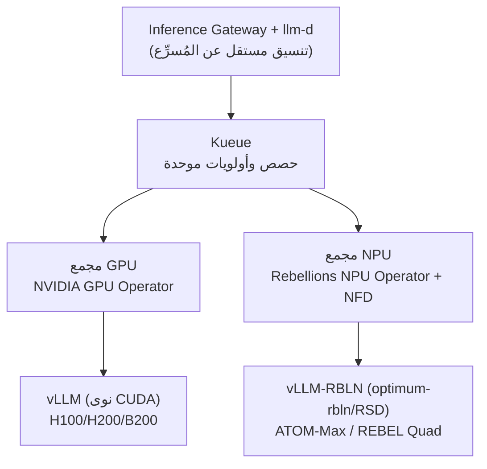

## شراء المزيد من GPU لا يُسرّع الاستدلال

يصطدم كل من يُشغّل الاستدلال على نماذج اللغات الكبيرة (LLM) بجدار غير حدسي: إضافة المزيد من وحدات GPU لا تزيد الإنتاجية بالقدر ذاته. السبب الجذري هو أن الاستدلال ينقسم إلى مرحلتين بخصائص متضادة تماماً.

مرحلة prefill التي تعالج الطلب الكامل في مرور واحد تعتمد على الحوسبة (compute-bound) وتُبقي استخدام GPU فوق 90%. أما مرحلة decode التي تولد رمزاً واحداً في كل خطوة فتعتمد على الذاكرة (memory-bound) وتُهبط الاستخدام إلى ما دون 30%. حين تتولى وحدة GPU واحدة كلتا المرحلتين يتذبذب الاستخدام بشدة، ولا تستطيع الطلبات ذات البادئات المشتركة أو نفس system prompt مشاركة إدخالات KV-cache. التوسع الأفقي بتكرار وحدات GPU مكلف وغير فعّال. ما نحتاجه فعلاً هو جدولة أفضل تستخرج المزيد من الطلبات من وحدات GPU ذاتها.

هذه هي الفكرة المحورية لـ llm-d: جدولة استدلال تحل مشكلة لا يحلها شراء المزيد من GPU. نُقدّم هنا مبادئ عمل llm-d التي جمعناها في ندوات داخلية وتقارير معمارية، إلى جانب تصميمنا للمعمارية غير المتجانسة التي تضيف NPU محلية بجانب GPU. هذا ليس عرضاً تسويقياً، بل تصميم مرجعي نعتزم التحقق منه.

## ما هو llm-d: يقف على ثلاثة أسس مُثبتة

llm-d هو إطار استدلال موزع عالي الأداء لنماذج LLM أصيل لـ Kubernetes. النقطة الجوهرية هي أنه لا يبني من الصفر بل يجمع ثلاثة مكونات مُثبتة مسبقاً.

أولها vLLM، محرك الاستدلال الفعلي الذي يوفر PagedAttention والدُفعات المستمرة (continuous batching) والفك التكهني (speculative decoding). ثانيها Kubernetes، الأساس للنشر والجدولة والتوسع التلقائي واستعادة الأخطاء. ثالثها Inference Gateway (GAIE)، امتداد Gateway API يتيح التوجيه بمعرفة الحالة.

فوق هذه الأسس يُضيف llm-d قدرتين رئيسيتيتن: توجيه KV-cache aware والفصل بين prefill وdecode. من ناحية الحوكمة حصل llm-d على ثقة مؤسسية، إذ انضم إلى CNCF Sandbox في 2026 ويتلقى دعماً من IBM وRed Hat وGoogle وCoreWeave وNVIDIA.

## السلاح الأول: توجيه KV-Cache Aware

القدرة الأولى هي عدم إرسال الطلبات إلى أي Pod عشوائياً. بدلاً من ذلك تُوجَّه الطلبات إلى الـ Pod الذي يحمل مسبقاً KV-cache لبادئة ذلك الطلب في ذاكرة GPU. ينطبق هذا حتى على الطلبات من مستخدمين مختلفين.

الأثر هو إلغاء حسابات prefill المتكررة، وهو أكبر في حالات العمل ذات البادئات المتداخلة: المحادثات المتعددة الأدوار، وأنابيب RAG، وsystem prompt المشترك. تنخفض زمن الاستجابة وترتفع الإنتاجية.

يتوفر وضعان: الوضع التقريبي (approximate) يُقدّر موقع KV-cache من أنماط حركة المرور، وهو خفيف لكن غير دقيق. الوضع الدقيق (precise) يشترك مباشرة في KV-Events الخاصة بـ vLLM ليقرأ حالة كتل KV الفعلية وهو دقيق. كلاهما مدعوم بـ KV-Cache Indexer، مكتبة عالية الأداء تحتفظ بعرض عالمي شبه آني لموقع كتل KV عبر جميع Pods الخاصة بـ vLLM.

## السلاح الثاني: الفصل بين Prefill وDecode

القدرة الثانية هي الفصل المادي للمرحلتين ذواتي الخصائص المتضادة. تُقسَّم مجمعات prefill ودecode إلى مجمعات Pods منفصلة ويُضبط كل منها بشكل مستقل، مما يُزيل تذبذبات الاستخدام الناجمة عن تنقل GPU واحدة بين المرحلتين.

الآلية الحاسمة هي نقل KV-cache. تُنقل كتل KV مباشرة من VRAM في محرك prefill إلى VRAM في محرك decode عبر NIXL، وهذا النقل غير محجوب (non-blocking) فيواصل GPU معالجة طلبات أخرى أثناء النقل. يتيح ذلك تحسين زمن أول رمز (TTFT) وزمن التأخر بين الرموز (ITL) بشكل مستقل دون تداخل.

تحذير صريح: في البيئات صغيرة النطاق ومنخفضة التزامن، يمكن أن تتسبب تكلفة نقل KV في تباطؤ بمقدار 20~30%. الفصل لا يُجدي إلا حين يكون الحجم كافياً.

## المكونات وأدلة الأداء

مسار البيانات الكامل مُقسَّماً إلى مكونات كالتالي.

| المكوّن | الدور |
|---|---|
| Inference Gateway (GAIE) + EPP | تُقيّم EPP معدل إصابة KV-cache لكل Pod وتوجّه إلى الـ Pod الأمثل |
| KV-Cache Indexer | تحتفظ بعرض عالمي لـ KV locality عبر جميع Pods الخاصة بـ vLLM (تقريبي / دقيق) |
| فصل Prefill/Decode | مجمعات منفصلة لـ prefill المعتمد على الحوسبة ودecode المعتمد على الذاكرة؛ KV يُنقل عبر NIXL مباشرة |
| vLLM (الخلفية) | محرك الاستدلال الفعلي: PagedAttention، continuous batching |
| K8s Operator / CRD | نشر إعلاني وتوسع تلقائي؛ إدارة الإصدارات عبر ArgoCD GitOps |

الأدلة على الأداء متاحة من أرقام منشورة. في تضاريس 16×16 B200 تم الإبلاغ عن إنتاجية تبلغ نحو 50,000 output tok/s وانخفاض في TTFT بمقدار رتبة من الحجم. في الجانب الخاص بـ AMD، عند تقديم Llama-3.1-70B على 4×MI300X مع توجيه prefix-cache aware، تحسنت إنتاجية الإخراج بمقدار 3x وتحسن TTFT بمقدار 2x.

غير أن هذه الأرقام تعتمد بشكل كبير على التضاريس والنموذج والدقة. نفس رقم "N tok/s" يمكن أن يعني عشرة أضعاف مختلفة تبعاً لما إذا كان إنتاجية طلب واحد أم إجمالي، وما هي طول الإدخال وحجم الدفعة والدقة. نُعامل أرقام المعيار غير الموسومة بوضح كأرقام غير موثوقة.

العلاقة بالبدائل تستحق التوضيح أيضاً. إذا كان النموذج يتسع لعقدة واحدة فـ vLLM منفرداً هو الجواب الأبسط والأصح. حين نتجاوز العقدة الواحدة ونحتاج تقديم نماذج متعددة على مقياس Kubernetes يدخل llm-d في الصورة. يستهدف NVIDIA Dynamo التنسيق على مقياس مراكز البيانات، ويستهدف SGLang أداء MoE-EP وأحدث أداء لفصل PD. llm-d وDynamo ليسا حصريين: يمكن لـ Dynamo أن يكون طبقة التنسيق بينما يتولى vLLM وllm-d طبقة المحرك.

## غير متجانس: إضافة NPU المحلية فوق GPU

هنا يكمن جوهر تقرير معمارياتنا. طبقة تنسيق llm-d وvLLM مستقلة عن نوع المُسرِّع. يعني ذلك إمكانية الإبقاء على منطق التوجيه والفصل كما هو وتبديل مجمع المُسرِّعات من GPU إلى NPU.

تتصل وحدات NPU من Rebellions، شركة أشباه الموصلات الذكاء الاصطناعي المحلية، مباشرة بنظام بيئي vLLM عبر إضافة vLLM-RBLN. تُصرَّف النماذج باستخدام optimum-rbln ثم يرجع إليها vLLM-RBLN، الذي يُرحّل FlashAttention وPagedAttention وSliding Window Attention إلى تسلسل ذاكرة NPU ويجمعها في رسم بياني تنفيذي واحد. للتوسع الأفقي يتولى RSD (Rebellions Scalable Design) الفصل بين prefill ودecode والتشغيل متعدد العقد وتوجيه MoE. أي أن RSD يوفر محلياً جزءاً مما يفعله llm-d على مستوى NPU.

| الشريحة | التكوين | الذاكرة | حالة الاستخدام |
|---|---|---|---|
| ATOM+ (RBLN-CA22) | NPU واحدة | 16GB on-chip | الاستدلال، دعم vLLM-RBLN |
| ATOM-Max (RBLN-CA25) | 8 NPU في خادمين | 128GB إجمالي | قادرة على تشغيل نماذج 70B |
| REBEL / Rebel100 | 4 chiplets + HBM3E | سعة HBM3E كبيرة | PetaFLOPS-class، محسّنة لـ MoE |
| REBEL Quad | 4 REBEL مجتمعة | HBM3E | الإنتاج الجماعي مجدول H1 2026 |

تكامل Kubernetes متماثل مع تكامل GPU. وفق مرجع Red Hat AI، على OpenShift يكتشف NFD وحدة ATOM عبر PCI vendor ID 1eff، ويدير Rebellions NPU Operator برنامج التشغيل وddevice-plugin والرصد لتسجيل NPU كموارد قابلة للتخصيص. يتحكم في إعداد vLLM عبر متغيرات البيئة `VLLM_TARGET_DEVICE=rbln` و`VLLM_USE_V1=1` و`RBLN_KERNEL_MODE=triton`، مع كشف مقاييس الطاقة ودرجة الحرارة والذاكرة عبر Prometheus.

مقارنة المجمعَين في كتلة واحدة تكشف أدوارهما المتمايزة.

| الجانب | مجمع GPU | مجمع Rebellions NPU |
|---|---|---|
| الأجهزة الممثِّلة | H100/H200/B200 + NVLink | ATOM-Max (8 NPU, 128GB) / REBEL Quad |
| محرك التقديم | vLLM (نوى CUDA) | vLLM-RBLN (optimum-rbln/RSD) |
| الفصل / MoE | ناضج عبر llm-d | RSD يوفره محلياً؛ التكامل مع llm-d قيد التحقق |
| نقاط القوة | نضج النظام البيئي والنوى، أعلى إنتاجية | كفاءة الطاقة، سيادي (محلي)، تحسين MoE مُدّعى |
| تحفظات | الطاقة والإمداد والتكلفة | الفصل الموزع / توجيه KV، مراجع نماذج كبيرة قليلة |

## تطبيق ThakiCloud وخارطة طريق التبني

أكبر ميزة لهذه المعمارية بالنسبة لنا هي أنها تُثبَّت مباشرة على بنيتنا التحتية الحالية دون بنية تحتية جديدة. تعمل على Kubernetes وKueue وArgoCD التي نستخدمها بالفعل. تُجدول Kueue مجمعات العمل prefill ودecode بجدولة العصابة (gang-scheduling) وإدارة الحصص، وتدير ArgoCD الـ CRDs عبر GitOps. تشمل المراقبة TTFT وITL وtok/s ومعدل إصابة KV عبر Prometheus وGrafana، مع SLOs لكل فئة نموذج كقواعد SRE.

يسير التبني بمراحل عبر بوابات كمية. في Phase 0 نُنشئ خط أساس llm-d على مجمع GPU ونقيس أثر توجيه KV وفصل PD. في Phase 1 نُضبط توجيه prefix-cache ونُعدّ تقديم نماذج متعددة ونُثبّت SLOs. في Phase 2 نُدخل عقدة Rebellions ATOM-Max واحدة في كتلة Kubernetes ونقيس أداء النموذج ذاته على NPU. في Phase 3 نُحدد سياسات التوجيه غير المتجانس ونُعيد تقييم أعمال MoE بما يتوافق مع جدول إنتاج REBEL Quad. قبل كل مرحلة نُثبّت تعريفات القياس أولاً: الإنتاجية الفردية مقابل الإجمالية، وطول الإدخال وحجم الدفعة والدقة.

## المخاطر والاستنتاج المعاكس

يجب على وثيقة التصميم الجيدة أن تُهاجم ادعاءاتها بنفسها. نُدوّن هنا بصدق نقاط ضعف هذه المعمارية.

نضج مسار NPU هو المجهول الأكبر. vLLM-RBLN صلب لتقديم عقدة واحدة، لكن ما إذا كان الفصل الموزع الدقيق لـ llm-d وتوجيه KV الدقيق يعملان على NPU لم يُتحقق منه بعد. نظراً لأن RSD يوفر فصله الخاص، قد يكون تكوين "RSD منفرداً" دون llm-d أكثر واقعية من "NPU تحت llm-d". المراجع الخاصة بالنماذج الكبيرة أيضاً أقل مقارنة بـ GPU. يستطيع ATOM-Max بـ 128GB تشغيل نماذج 70B، لكن نماذج MoE بحجم 744B تتطلب عقداً متعددة ونطاقاً واسعاً من RSD، والمراجع العامة شحيحة. كون PoC خاصتنا ستصبح مرجعاً قريباً هو فرصة ومخاطرة في آنٍ واحد.

والاستنتاج المعاكس: إذا كان الهدف الوحيد هو أعلى إنتاجية في أقصر وقت، فإن إضافة NPU لا تزيد إلا التعقيد. في هذه الحالة GPU مع llm-d يكفي. قيمة NPU لا تتحقق إلا حين توجد أهداف استراتيجية مستقلة تتعلق بكفاءة الطاقة والتوريد المحلي وتنويع سلسلة الإمداد. وبالمثل، إذا كان النموذج يتسع لعقدة واحدة والحركة خفيفة، فإن llm-d نفسه يكون استثماراً مفرطاً، ويكون vLLM منفرداً هو الجواب الصحيح.

## منظور ThakiCloud: استدلال غير مقيّد بمُسرِّع

سبب اهتمامنا بهذه المعمارية بسيط. الخاصية الوحيدة المتمثلة في استقلالية تنسيق llm-d عن المُسرِّع تجعل من الممكن معمارياً تشغيل مجمع GPU ومجمع NPU محلي معاً في كتلة واحدة للاستدلال السيادي بالذكاء الاصطناعي.

هذا مهم استراتيجياً بالنسبة لنا كموفر منصات ذكاء اصطناعي على الأماكن (on-premises). يحتاج العملاء إلى اختيار مُسرِّعاتهم بناءً على ميزانية الطاقة وقيود سلسلة الإمداد ومتطلبات التوريد المحلي، ويجب ألا يُجبر ذلك الاختيار على إعادة بناء مكدس الاستدلال بأكمله. تجريد vLLM واستقلالية مُسرِّع llm-d تُلغيان هذه التكلفة. يمكن تنفيذ سياسة غير متجانسة، توجيه الأعمال الكبيرة وذات الكمون المنخفض إلى GPU والأعمال المتوسطة وكفاءة الطاقة إلى NPU، على منطق التوجيه ذاته.

بالطبع كل هذا تصميم مرجعي ولم يُتحقق منه عبر PoC بعد. ولذلك بالضبط نُثبّت تعريفات القياس أولاً ونتبع مساراً مرحلياً يبدأ من خط الأساس GPU الذي يُجتاز بوابات كمية قبل التوسع إلى NPU.

## الخاتمة

الدرس المستفاد من llm-d هو أن كفاءة الاستدلال مسألة جدولة، لا مسألة شراء أجهزة. بإزالة الحسابات المتكررة عبر توجيه KV-cache aware وتحقيق استقرار الاستخدام عبر الفصل بين prefill ودecode، يمكننا تقديم المزيد من الطلبات عبر نفس وحدات GPU. ولأن ذلك التنسيق مستقل عن المُسرِّع، يتفتح الطريق للتوسع نحو الاستدلال السيادي بإضافة NPU المحلية فوق GPU.

ThakiCloud تُحقق من هذه المعمارية غير المتجانسة للاستدلال على Kubernetes وKueue وArgoCD. مزيد من التفاصيل متاح على موقعنا الإلكتروني.

## المصادر

- Red Hat Developer, Master KV cache aware routing with llm-d: [https://developers.redhat.com/articles/2025/10/07/master-kv-cache-aware-routing-llm-d-efficient-ai-inference](https://developers.redhat.com/articles/2025/10/07/master-kv-cache-aware-routing-llm-d-efficient-ai-inference)
- الموقع الرسمي لـ llm-d: [https://llm-d.ai/](https://llm-d.ai/)
- llm-d + KServe + vLLM في الإنتاج: [https://llm-d.ai/blog/production-grade-llm-inference-at-scale-kserve-llm-d-vllm](https://llm-d.ai/blog/production-grade-llm-inference-at-scale-kserve-llm-d-vllm)
- llm-d GitHub: [https://github.com/llm-d/llm-d](https://github.com/llm-d/llm-d)
- Rebellions, LLM Serving with NPU: [https://rebellions.ai/llm-serving-with-npu/](https://rebellions.ai/llm-serving-with-npu/)
- Red Hat Developer, Running AI inference on Rebellions ATOM NPU: [https://developers.redhat.com/articles/2026/05/27/running-ai-inference-rebellions-atom-npu-red-hat-ai](https://developers.redhat.com/articles/2026/05/27/running-ai-inference-rebellions-atom-npu-red-hat-ai)
- إضافة vLLM-RBLN: [https://github.com/rebellions-sw/vllm-rbln](https://github.com/rebellions-sw/vllm-rbln)

ملاحظة: مخططات المعمارية هي تصاميم مرجعية تستند إلى المواد المتاحة للعموم. بعض مواصفات الشرائح محذوفة لعدم نشرها في الأوراق البيضاء العامة. تكامل NPU من Rebellions تحت llm-d هو فرضية تصميمية مبنية على vLLM-RBLN ولم يُتحقق منها بعد عبر PoC. أرقام الأداء تعتمد على البيئة؛ يجب تفسير إنتاجية الطلب الواحد وإنتاجية الإجمالي بصورة منفصلة.
