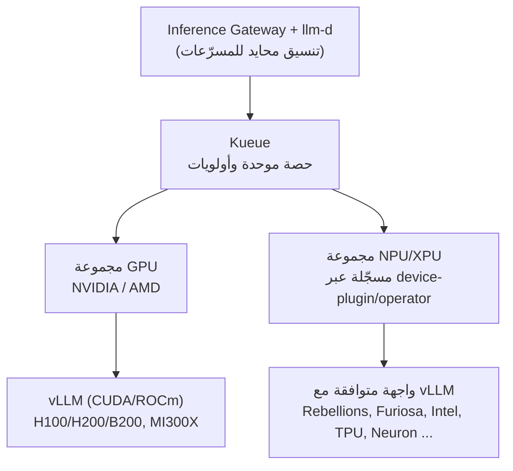

## شراء المزيد من GPU لن يسرّع الاستدلال

عند تشغيل استدلال نماذج اللغة الكبيرة في بيئة إنتاجية، تصطدم بجدار يبدو غير منطقي: إضافة المزيد من GPU لا تزيد معدل المعالجة بنفس القدر. السبب الجذري هو أن الاستدلال ينقسم إلى مرحلتين ذواتَي خصائص متعاكسة تماماً.

مرحلة prefill، التي تحسب المطالبة الكاملة دفعة واحدة، مقيّدة بالحوسبة وترفع استخدام GPU إلى أكثر من 90%. أما مرحلة decode، التي تولّد رمزاً واحداً في كل مرة، فهي مقيّدة بالذاكرة وقد تنخفض إلى أقل من 30%. عندما تتولى GPU واحدة كلتا المرحلتين، يتذبذب الاستخدام بشدة، ولا تستطيع الطلبات التي تشترك في system prompt أو بادئة مشتركة إعادة استخدام حالة KV المخزّنة. لذا، فإن التوسع الأفقي بمضاعفة GPU مكلف وغير كفء. ما تحتاجه فعلاً هو جدولة تستخرج طلبات أكثر من نفس الـ GPU.

هذا هو ملخص llm-d في جملة واحدة: جدول زمني للاستدلال يحل ما لا يحله شراء المزيد من GPU. تشارك هذه المقالة المبادئ التشغيلية لـ llm-d كما استعرضناها في ندواتنا الداخلية وتقاريرنا المعمارية، إلى جانب التصميم غير المتجانس الذي نبنيه فوقه، جامعاً GPU و NPU في كلستر واحد. هذا تصميم مرجعي نعتزم التحقق منه، وليس شرائح تسويقية.

## ما هو llm-d: مبني على ثلاثة أسس موثوقة

llm-d إطار عمل للاستدلال الموزع عالي الأداء يعمل على Kubernetes بطريقة أصيلة. والمهم أنه لا يبدأ من الصفر، بل يجمع ثلاثة مكونات موثوقة مسبقاً.

الأول هو vLLM، محرك الاستدلال الفعلي الذي يوفر PagedAttention والدُّفعات المستمرة والترميز التخميني. الثاني هو Kubernetes، الأساس للنشر والجدولة والتوسع التلقائي والتعافي من الأعطال. الثالث هو Inference Gateway (GAIE)، وهو امتداد Gateway API للتوجيه الواعي بالحالة.

فوق هذه الأسس، يضيف llm-d قدرتين أساسيتين: توجيه KV-cache الواعي وفصل prefill/decode. وعلى صعيد الحوكمة، اكتسب ثقة مؤسسية: اعتُمد llm-d في CNCF Sandbox عام 2026، بدعم من IBM و Red Hat و Google و CoreWeave و NVIDIA.

## السلاح الأول: توجيه KV-cache الواعي

الرافعة الأولى هي عدم إرسال الطلبات إلى pod عشوائي. بدلاً من ذلك، تُوجَّه الطلبات إلى الـ pod الذي يحتفظ بالفعل بذاكرة KV cache لبادئة المطالبة الواردة في ذاكرة GPU، حتى عندما تأتي الطلبات من مستخدمين مختلفين.

العائد هو إلغاء عمليات prefill المتكررة. الفوائد أكبر بشكل خاص في أحمال العمل ذات البادئات المتداخلة: المحادثات المتعددة الأدوار وخطوط RAG و system prompts المشتركة. تنخفض زمن الاستجابة ويرتفع معدل المعالجة.

يتوفر وضعان للتوجيه: الوضع التقريبي يستنتج موضع الذاكرة المؤقتة من أنماط حركة المرور، خفيف الوزن لكنه غير دقيق. الوضع الدقيق يشترك مباشرة في KV-Events الخاص بـ vLLM لقراءة حالة كتل KV الفعلية، وهو دقيق. كلا الوضعين مدعومان بـ KV-Cache Indexer، وهو مكتبة عالية الأداء تحافظ على رؤية عالمية شبه فورية لموضع كتل KV عبر جميع pods الخاصة بـ vLLM.

## السلاح الثاني: فصل Prefill / Decode

الرافعة الثانية هي الفصل الفيزيائي للمرحلتين ذواتَي الخصائص المتعاكسة. تُقسَّم مراحل prefill و decode إلى مجموعات pods منفصلة، مما يسمح بضبط كل مرحلة بشكل مستقل. تختفي التذبذبات في الاستخدام الناجمة عن تبادل GPU واحدة بين المرحلتين.

المفتاح هو كيفية نقل KV cache. تنتقل مباشرة من VRAM محرك prefill إلى VRAM محرك decode عبر NIXL، وبما أن النقل غير محجوب، تستمر GPU في معالجة طلبات أخرى أثناء النقل. هذا يتيح لنا تحسين زمن أول رمز (TTFT) ووقت الانتظار بين الرموز (ITL) بشكل مستقل، دون تداخل.

تحذير صادق: في البيئات الصغيرة ذات التزامن المنخفض، يمكن أن تؤدي تكاليف نقل KV إلى إبطاء بنسبة 20 إلى 30%. الفصل يؤتي ثماره فقط عندما يدعمه حجم حركة المرور.

## المكونات وأدلة الأداء

مسار البيانات الكامل، مقسّماً حسب المكون، يبدو كالآتي.

| المكون | الدور |
|---|---|
| Inference Gateway (GAIE) + EPP | يسجّل EPP معدلات إصابة الذاكرة المؤقتة لكل pod ويوجّه إلى الـ pod الأمثل |
| KV-Cache Indexer | يحافظ على رؤية عالمية لموضع كتل KV عبر جميع pods الخاصة بـ vLLM (تقريبي / دقيق) |
| فصل Prefill/Decode | مجموعات منفصلة للـ prefill المقيّد بالحوسبة والـ decode المقيّد بالذاكرة؛ نقل KV عبر NIXL |
| vLLM (الواجهة الخلفية) | محرك الاستدلال الفعلي: PagedAttention، الدفعات المستمرة |
| K8s Operator / CRD | نشر تصريحي وتوسع تلقائي؛ إدارة الإصدارات عبر ArgoCD GitOps |

تدعم الأرقام المنشورة ادعاءات الأداء. على طوبولوجيا 16×16 B200، أُفيد بحوالي 50,000 output tok/s وانخفاض في TTFT بمقدار رتبة ضخامة. على جانب AMD، أظهرت منصة 4×MI300X تقدّم Llama-3.1-70B بزيادة 3 أضعاف في معدل الإخراج وتحسن مضاعف في TTFT بعد تفعيل توجيه prefix-cache الواعي.

غير أن هذه الأرقام تعتمد بشدة على الطوبولوجيا والنموذج والدقة. سواء كانت "N tok/s" تشير إلى معدل تدفق مفرد أم مجمّع، وما هو طول الإدخال وحجم الدفعة والدقة المستخدمة، قد يغير المعنى بمقدار رتبة ضخامة. نعامل أرقام المعيار غير المكتملة التسميات بوصفها غير جديرة بالثقة.

العلاقة بالبدائل واضحة أيضاً. إذا اندرج النموذج في GPU عقدة واحدة، فإن vLLM المستقل هو الإجابة الأبسط. يدخل llm-d عندما تحتاج إلى تجاوز عقدة واحدة وتشغيل نماذج متعددة على مقياس Kubernetes. يستهدف NVIDIA Dynamo التنسيق على نطاق مركز البيانات؛ ويستهدف SGLang أداء MoE-EP وأحدث تقنيات فصل PD. llm-d و Dynamo ليسا متعارضين: يمكن لـ Dynamo التعامل مع التنسيق بينما يعمل vLLM و llm-d كطبقة المحرك.

## غير المتجانس: إضافة أي NPU/XPU فوق GPU

هذا هو جوهر تقرير بنيتنا المعمارية. والنقطة الأولى التي يجب تثبيتها هي أن هذا التصميم غير مقيّد بمورد مسرّعات محدد. طبقة تنسيق llm-d و vLLM مستقلة عن نوع المسرّع. يمكنك استبدال مجموعة المسرّعات مع إبقاء منطق التوجيه والفصل دون تغيير.

هذا ليس فرضية: يدعم vLLM بالفعل رسمياً مجموعة واسعة من الواجهات الخلفية. بالإضافة إلى GPU من NVIDIA و AMD، يغطي Intel CPU/XPU/Gaudi (HPU) و Google TPU و AWS Neuron، وعبر الإضافات، IBM Spyre و Huawei Ascend و NPUs المحلية بما فيها Rebellions و Furiosa، كلها خلف نفس واجهة vLLM. بعبارة أخرى، موقع NPU/XPU في تكوين "مجموعة GPU + مجموعة NPU/XPU" يقبل أي مسرّع متوافق مع vLLM.

| المسرّع | واجهة vLLM الخلفية | ملاحظات |
|---|---|---|
| NVIDIA GPU | CUDA (أصلي) | أعلى نضج في النظام البيئي والنوى |
| AMD GPU | ROCm | MI300X وغيرها؛ مدعوم رسمياً |
| Intel Gaudi / XPU | واجهة HPU / XPU | مسرّعات مراكز البيانات |
| Google TPU / AWS Neuron | واجهات خلفية مخصصة | مسرّعات سحابية |
| Rebellions NPU | vLLM-RBLN (إضافة) | محلي؛ optimum-rbln / RSD |
| Furiosa NPU | Furiosa-LLM (متوافق مع vLLM) | محلي؛ RNGD / TCP |

نذكر كلا الـ NPU المحليين معاً لتوضيح نقطة واحدة: يوجد أكثر من خيار واحد. المفتاح هو أن تجريد vLLM يتيح لك تبديل الموردين بدلاً من الارتباط بأحدهم.

يتصل Rebellions عبر إضافة vLLM-RBLN. يُجمَّع النموذج باستخدام optimum-rbln ثم يُشار إليه بواسطة vLLM-RBLN، الذي ينقل FlashAttention و PagedAttention إلى تسلسل ذاكرة NPU ويجمعهما في رسم بياني تنفيذي واحد. يعتمد التوسع الأفقي على RSD (Rebellions Scalable Design)، الذي يتولى فصل prefill/decode وتوجيه MoE. في Kubernetes، يكتشف NFD الـ NPU عبر معرف بائع PCI، ويسجّله Rebellions NPU Operator كـ device-plugin، وتتحكم فيه متغيرات بيئية مثل `VLLM_TARGET_DEVICE=rbln`. تشمل التشكيلة الحالية ATOM-Max بخادمين مزدوجين مع 8 NPUs و 128GB للنماذج بحجم 70B، مع REBEL Quad الذي يستهدف تحسين MoE.

يتصل Furiosa عبر Furiosa-LLM، إطار عمل متوافق مع vLLM. تستخدم الشريحة الرئيسية RNGD بنية TCP (Tensor Contraction Processor) مع 48GB HBM3 بعرض نطاق ترددي 1.5TB/s و 180W TDP، محققةً 512 TFLOPS عند FP8. يحزم خادم NXT RNGD ثماني بطاقات لتوفير 384GB HBM3 و 4 petaFLOPS (FP8) بظرف حراري 3kW TDP، مع بدء الإنتاج الضخم في يناير 2026. ميزتها التنافسية الأولى هي كفاءة الطاقة، مما يضعها في فئة مختلفة عن GPU.

القاسم المشترك بين الـ NPU الاثنين هو المبدأ العام: طالما يوفر كل مورد device-plugin/operator وواجهة خلفية لـ vLLM، فإن طبقة تنسيق llm-d الفوقية لا تحتاج إلى تغيير، تضيف ببساطة مجموعة مسرّعات.

مقارنة نوعَي المجموعات جنباً إلى جنب في كلستر واحد تكشف عن أدوارهما التكاملية. لاحظ أن العمود الأيمن يمثل NPUs و XPUs بشكل عام، وليس أي مورد بعينه.

| | مجموعة GPU | مجموعة NPU/XPU (مثال: Rebellions, Furiosa, Intel, TPU) |
|---|---|---|
| محرك التقديم | vLLM (CUDA/ROCm) | واجهة متوافقة مع vLLM (vLLM-RBLN, Furiosa-LLM, HPU/XPU, إلخ) |
| الكشف في K8s | NVIDIA/AMD GPU Operator | مورد NPU Operator + NFD / device-plugin |
| Disagg/MoE | ناضج عبر llm-d | خاص بالمورد (مثل RSD) + تكامل llm-d قيد التحقق |
| نقاط القوة | نضج النظام البيئي والنوى، أعلى معدل معالجة | كفاءة الطاقة، تنويع سلسلة التوريد السيادية، ادعاءات تفوق MoE |
| تحفظات | الطاقة، التوريد، التكلفة | نضج disagg الموزع / توجيه KV؛ مراجع نماذج كبيرة أقل |

## تطبيق ThakiCloud وخارطة طريق النشر

أكبر ميزة لهذه البنية بالنسبة لنا هي أنها تعمل فوق مكدّسنا الحالي دون بنية تحتية جديدة. تعمل فوق Kubernetes و Kueue و ArgoCD التي نستخدمها بالفعل. يجدول Kueue مجموعات عمال prefill و decode بجدولة gang مع إدارة الحصص؛ يدير ArgoCD الـ CRDs عبر GitOps. تغطي قابلية المراقبة TTFT و ITL و tok/s ومعدل إصابة KV عبر Prometheus و Grafana، مع تتبع SLOs لكل طبقة نماذج عبر قواعد SRE.

يسير التبني عبر مراحل مسوّرة بقياسات كمية. تُنشئ المرحلة 0 خط أساس llm-d على مجموعة GPU وتقيس تأثير توجيه KV وفصل PD. تضبط المرحلة 1 توجيه prefix-cache وتُنشئ تقديم نماذج متعددة وتحدد SLOs. تضيف المرحلة 2 عقدة واحدة من مرشح NPU (Rebellions أو Furiosa أو غيرها) إلى Kubernetes وتقارن بنفس النموذج تحت شروط مطابقة. سيُقيَّم اختيار المسرّع بناءً على كفاءة الطاقة وسلسلة التوريد وملاءمة النموذج، دون التزام مسبق بمورد محدد. تُنشئ المرحلة 3 سياسة التوجيه غير المتجانس وتعيد تقييم أحمال عمل MoE مع وصول كل مورد إلى الإنتاج الضخم. قبل كل مرحلة، نُثبّت تعريفات القياس: معدل تدفق مفرد مقابل مجمّع، طول الإدخال، حجم الدفعة، والدقة.

## المخاطر والنتيجة المعاكسة

الوثيقة المعمارية الجيدة يجب أن تهاجم حججها بنفسها. إليك نقاط ضعف هذه البنية بصراحة.

نضج مسار NPU/XPU هو أكبر مجهول. يتحسّن التقديم أحادي العقدة للمورد أياً كان، لكن ما إذا كان disaggregation الموزع لـ llm-d وتوجيه KV الدقيق يعملان على أجهزة NPU/XPU هو أمر لا يزال قيد التحقق. يوفر بعض الموردين فصلهم الخاص (مثل Rebellions RSD)، لذا قد يكون تكوين "مكدّس مورد مستقل" أكثر واقعية من "NPU فوق llm-d". كذلك مراجع النماذج الكبيرة أقل مقارنة بـ GPU. ذاكرة خادم واحد كافية للنماذج بحجم 70B، لكن نماذج MoE بحجم 744B تحتاج عقداً متعددة والمراجع العامة شحيحة. هذه القيود تعكس الحالة الراهنة لنظام NPU/XPU البيئي بأكمله، وليس أي مورد بعينه؛ كون مشروعنا التجريبي سيصبح مرجعاً هو فرصة ومخاطرة في آن واحد.

النتيجة المعاكسة: إذا كان الهدف حصراً هو أعلى معدل معالجة في أقصر وقت، فإن إضافة NPU/XPU لا تزيد إلا التعقيد. في هذه الحالة، GPU و llm-d كافيان. قيمة المسرّعات البديلة لا تتحقق إلا عندما توجد أهداف استراتيجية منفصلة: كفاءة الطاقة وتنويع سلسلة التوريد والسيادة. وبالمثل، إذا كان النموذج يندرج في عقدة واحدة وحجم حركة المرور منخفض، فإن llm-d نفسه استثمار مفرط و vLLM المستقل هو الإجابة الصحيحة.

## منظور ThakiCloud: استدلال غير مقيّد بالمسرّعات

السبب الذي يجعلنا نركز على هذه البنية بسيط. الخاصية الوحيدة التي تجعل تنسيق llm-d مستقلاً عن المسرّع هي ما يجعل تشغيل مجموعات GPU ومجموعات NPU/XPU المتنوعة في نفس الكلستر دون ارتباط بمورد معين ممكناً بالتصميم، مما يُنشئ إعداداً للاستدلال بذكاء اصطناعي سيادي.

هذا مهم استراتيجياً بالنسبة لنا كمزود لمنصات الذكاء الاصطناعي المحلية. يجب أن يتمكن العملاء من اختيار المسرّعات بحرية بناءً على ميزانية الطاقة وسلسلة التوريد ومتطلبات التصنيع المحلي، وألا يُترجم هذا الاختيار إلى تكلفة إعادة هندسة مكدّس الاستدلال بالكامل. الارتباط بـ NPU واحد محدد لا يفعل سوى استبدال ارتباط GPU بارتباط آخر. يُزيل تجريد vLLM واستقلالية llm-d عن المسرّع كلاً من هذه التكلفة وهذا الارتباط معاً. سياسة غير متجانسة ترسل أحمال العمل الكبيرة أو ذات الكمون المنخفض إلى GPU والأحمال المتوسطة أو الحساسة للطاقة إلى NPU/XPU يمكن تطبيقها على نفس منطق التوجيه بغض النظر عن مجموعة الموردين المختارة.

بالطبع، كل هذا تصميم مرجعي وما زال قبيل التحقق التجريبي. لذلك نُثبّت تعريفات القياس أولاً ونسلك المسار المرحلي: خط أساس GPU، بوابات كمية، ثم توسع إلى NPU.

## الخاتمة

الدرس من llm-d هو أن كفاءة الاستدلال مسألة جدولة، وليست مسألة شراء أجهزة. إلغاء العمليات المتكررة بتوجيه KV-cache الواعي وتثبيت الاستخدام بفصل prefill عن decode يسمح بمعالجة طلبات أكثر من نفس GPU. وبما أن هذا التنسيق مستقل عن المسرّع، تنفتح الطريق لتوسيعه بأي NPU/XPU فوق GPU (Rebellions و Furiosa وأي مسرّع متوافق مع vLLM) لبناء استدلال سيادي غير مرتبط بأي مورد.

تُحقَّق ThakiCloud من هذه البنية غير المتجانسة للاستدلال على Kubernetes و Kueue و ArgoCD. تعرّف على المزيد عبر موقعنا الإلكتروني.

## المصادر

- Red Hat Developer, Master KV cache aware routing with llm-d: [https://developers.redhat.com/articles/2025/10/07/master-kv-cache-aware-routing-llm-d-efficient-ai-inference](https://developers.redhat.com/articles/2025/10/07/master-kv-cache-aware-routing-llm-d-efficient-ai-inference)
- الموقع الرسمي لـ llm-d: [https://llm-d.ai/](https://llm-d.ai/)
- llm-d + KServe + vLLM في الإنتاج: [https://llm-d.ai/blog/production-grade-llm-inference-at-scale-kserve-llm-d-vllm](https://llm-d.ai/blog/production-grade-llm-inference-at-scale-kserve-llm-d-vllm)
- llm-d على GitHub: [https://github.com/llm-d/llm-d](https://github.com/llm-d/llm-d)
- Rebellions, LLM Serving with NPU: [https://rebellions.ai/llm-serving-with-npu/](https://rebellions.ai/llm-serving-with-npu/)
- Red Hat Developer, Running AI inference on Rebellions ATOM NPU: [https://developers.redhat.com/articles/2026/05/27/running-ai-inference-rebellions-atom-npu-red-hat-ai](https://developers.redhat.com/articles/2026/05/27/running-ai-inference-rebellions-atom-npu-red-hat-ai)
- إضافة vLLM-RBLN: [https://github.com/rebellions-sw/vllm-rbln](https://github.com/rebellions-sw/vllm-rbln)
- مواصفات FuriosaAI RNGD وخادم NXT RNGD: [https://furiosa.ai/rngd](https://furiosa.ai/rngd)
- مركز مطوري FuriosaAI (Furiosa-LLM، متوافق مع vLLM): [https://developer.furiosa.ai/](https://developer.furiosa.ai/)
- الأجهزة المدعومة في vLLM (مصفوفة الواجهات الخلفية): [https://docs.vllm.ai/](https://docs.vllm.ai/)
- مؤسسة PyTorch، واجهات خلفية متعددة لـ vLLM: [https://pytorch.org/blog/pytorch-foundation-welcomes-vllm/](https://pytorch.org/blog/pytorch-foundation-welcomes-vllm/)

ملاحظة: مخططات البنية تصاميم مرجعية مبنية على مصادر عامة ولا تُشكّل توصية بأي مورد مسرّعات محدد. Rebellions و Furiosa مثالان على NPUs المتوافقة مع vLLM؛ تنطبق نفس المبادئ على NPUs/XPUs الأخرى المدعومة من vLLM (Intel Gaudi/XPU و Google TPU و AWS Neuron و IBM Spyre و Huawei Ascend وغيرها). بعض مواصفات الشرائح غائبة من أوراق البيانات العامة وتُركت فارغة. تكامل NPU/XPU فوق llm-d فرضية تصميمية مشروطة بالواجهة الخلفية لـ vLLM لدى كل مورد ولم يُتحقق منها تجريبياً بعد. أرقام الأداء تعتمد على البيئة؛ دائماً ميّز بين معدل التدفق المفرد والمجمّع عند تفسيرها.
