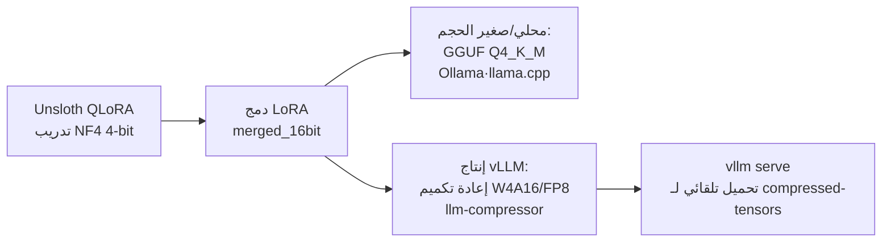

## لماذا الضغط الكمّي مرّة أخرى

يأتي الجزء الأكبر من تكلفة الخدمة من ذاكرة GPU والإنتاجية. ضغط النموذج إلى 4 بت يتيح لك تحميل نموذج أكبر على نفس البطاقة، وخدمة النموذج ذاته لعدد أكبر من المستخدمين المتزامنين. السؤال هو: أيّ أسلوب ضغط كمّي يعمل فعلًا بكفاءة مع vLLM في بيئة الإنتاج؟

[ضغط NVFP4](https://github.com/ThakiCloud/praxis) الذي تناولناه سابقًا هو المسار المتقدّم لتشغيل W4A4 على أنوية Blackwell (B200) tensor cores. لكن أنوية NVFP4 موجودة في Blackwell فقط. بالنسبة للأجيال السابقة كـ H100 وA100، أو للمجموعات المختلطة من الأجهزة، تحتاج إلى تقنيات مختلفة. هذا المقال يستبعد NVFP4 ويرصد الأساليب التي يمكنك استخدامها الآن مع الأجهزة التي تمتلكها -- بما فيها Unsloth Dynamic 2.0 -- مع وصفات عمليّة كاملة.

## خريطة الضغط الكمّي في vLLM

| الأسلوب | عرض البت | تحميل vLLM | GPU | ملاحظات |
|---|---|---|---|---|
| AWQ + Marlin | W4A16 | `--quantization awq` (Marlin تلقائي) | Turing+ | معيار 4 بت في الإنتاج |
| GPTQ / GPTQModel | W4A16, W3 | `--quantization gptq` | Volta+ | الأوسع توافقًا |
| compressed-tensors | W4A16 / W8A8 / FP8 | اكتشاف تلقائي (لا حاجة لعلم) | Turing+ ~ Blackwell | الصيغة الرسمية لـ llm-compressor |
| FP8 (E4M3) | W8A8 FP8 | `--quantization fp8` أو تلقائي | Ada (cc>=8.9)، Hopper، Blackwell | الخيار الأول لنماذج MoE |
| INT8 W8A8 | W8A8 INT8 | compressed-tensors تلقائي | Turing+ | عائلة SmoothQuant |
| AutoRound | W4A16, INT2-4 | compressed-tensors تلقائي | CUDA، CPU، Intel | دقّة ممتازة عند بتّات منخفضة جدًا |
| bitsandbytes NF4 | W4A16 | `--quantization bitsandbytes` | Volta-Hopper | مُحسَّن للذاكرة، إنتاجية منخفضة |
| GGUF | Q4-Q8 | `repo:quant` (إضافة) | تجريبي | للنظام البيئي llama.cpp |

نقطتان جوهريّتان: أولًا، معيار 4 بت في إنتاج vLLM هو W4A16 عبر AWQ أو GPTQ مع **نواة Marlin**. في معايير JarvisLabs على Qwen2.5-32B، بلغ Marlin-AWQ 741 tok/s مقابل 68 tok/s لنواة AWQ الأساسية -- فرق جوهري ([المصدر](https://jarvislabs.ai/blog/vllm-quantization-complete-guide-benchmarks)). ثانيًا، صيغة **compressed-tensors** -- التي طوّرتها neuralmagic (Red Hat) ومشروع vLLM معًا -- تخزّن بيانات الضغط الكمّي في `quantization_config`، ويقرؤها vLLM ويحمّلها تلقائيًا دون أي أعلام إضافية.

## compressed-tensors وllm-compressor: المسار الموصى به

الضغط باستخدام `llm-compressor` يُنتج مخرجات بصيغة compressed-tensors، يكتشفها vLLM تلقائيًا. تُعالَج W4A16 وW8A8-INT8 وFP8 جميعها بأداة واحدة ([llm-compressor](https://github.com/vllm-project/llm-compressor)).

```python
# W4A16 (AWQ 스타일) llm-compressor 레시피
from llmcompressor.transformers import oneshot
from llmcompressor.modifiers.quantization import GPTQModifier

recipe = GPTQModifier(scheme="W4A16", targets="Linear", ignore=["lm_head"])
oneshot(
    model="Qwen/Qwen3-30B-A3B",
    dataset="open_platypus",   # 보정(calibration) 셋
    recipe=recipe,
    output_dir="Qwen3-30B-A3B-W4A16",
    max_seq_length=2048, num_calibration_samples=512,
)
```

لا تحتاج الخدمة إلى أعلام تكاد تُذكر.

```bash
# compressed-tensors는 자동 감지, --quantization 생략 가능
vllm serve ./Qwen3-30B-A3B-W4A16 --served-model-name qwen3-w4a16
# AWQ 체크포인트를 직접 서빙할 때
vllm serve TheBloke/...-AWQ --quantization awq
```

يمكن إنشاء FP8 ديناميكيًا دون بيانات معايرة، مما يجعله الخيار الأقل جهدًا.

```python
from llmcompressor.modifiers.quantization import QuantizationModifier
recipe = QuantizationModifier(targets="Linear", scheme="FP8_DYNAMIC", ignore=["lm_head"])
```

## نماذج MoE (Qwen3-MoE): FP8 Block-Wise أولًا

أهداف الخدمة الأساسية لدينا هي نماذج عائلة Qwen3-MoE. معماريات MoE صعبة التعامل معها في الضغط الكمّي. الخلاصة المباشرة: على وحدات GPU بـ cc>=8.9 (Ada وHopper وBlackwell)، **FP8 block-wise** هو الخيار الأول. لا يحتاج إلى بيانات معايرة ويحظى بدعم رسمي في vLLM. إذا كانت الذاكرة أضيق، تراجع إلى W4A16. لاحظ أن FP8 per-tensor يعاني من خطأ عدم تطابق الأبعاد في Qwen3-MoE، لذا block-wise هو الأكثر أمانًا ([المشكلة](https://github.com/vllm-project/llm-compressor/issues/2043)).

## Unsloth: الضبط الدقيق وضغط Dynamic 2.0

لـ Unsloth فائدتان: الضبط الدقيق بـ QLoRA، وضغط Dynamic 2.0.

**Dynamic 2.0 (UD)** لا يطبّق عرض بت موحدًا على جميع الطبقات. بدلًا من ذلك، يقيّم حساسية كل طبقة ويُخصّص دقة أعلى للطبقات الحرجة بينما يضغط الطبقات الأقل أهمية أكثر. والنتيجة خريطة ضغط كمّي مخصّصة لكل نموذج. في المعايير التي نشرها Unsloth، سجّل Gemma 3 27B مع Dynamic Q4_K_XL نسبة 71.47% في MMLU 5-shot، متجاوزًا خط الأساس Google QAT البالغ 70.64%، فيما بلغ حجم الملف 15.64GB فقط (أرقام Unsloth، [المدوّنة](https://unsloth.ai/blog/dynamic-v2)). على عكس النسخة الأولى التي عملت بشكل رئيسي مع MoE، توسّعت النسخة 2.0 لتشمل النماذج الكثيفة (dense) أيضًا.

نقاط تفتيش `unsloth/...-bnb-4bit` هي نقاط تفتيش مُضغوطة مسبقًا بـ NF4 4-bit، وتُستخدم أساسًا كنقطة انطلاق للضبط الدقيق بـ QLoRA. بعد التدريب، تُنتج استدعاءٌ واحد لـ `save_pretrained_gguf()` ملفًا بصيغة GGUF لـ llama.cpp.

### المسار العملي من Unsloth إلى خدمة vLLM

الصراحة مطلوبة هنا. من الصيغ التي يُنتجها Unsloth، قليل منها يصلح مباشرةً لخدمة vLLM في الإنتاج. يمكن تحميل bitsandbytes NF4 في vLLM لكن إنتاجيّته منخفضة (وثمّة تقارير عن أخطاء في الأشكال shape لبعض النماذج). أما Dynamic UD-GGUF فهو صيغة خاصة بـ llama.cpp غير مذكورة في الوثائق الرسمية لـ vLLM، وإن دعم vLLM للـ GGUF نفسه مُصنَّف صراحةً بأنه "highly experimental" ([vLLM GGUF](https://docs.vllm.ai/en/latest/features/quantization/gguf/)).

المسار العملي في الإنتاج إذن هو: **الضبط الدقيق مع Unsloth، وإعادة الضغط الكمّي للخدمة**.



```python
# Unsloth: QLoRA 학습 후 16bit 병합
model.save_pretrained_merged("merged_model", tokenizer, save_method="merged_16bit")
# 이어서 위 llm-compressor W4A16/FP8 레시피로 재양자화 → vLLM 서빙
```

للخدمة المحلية أو التجريبية، استخدام Dynamic GGUF من Unsloth مع Ollama أو llama.cpp خيار معقول تمامًا من حيث الدقة والراحة. أما لخدمة الإنتاج متعددة المستخدمين، فالدمج أولًا ثم إعادة الضغط إلى W4A16 أو FP8 يمنحك إنتاجية أفضل مع vLLM.

## التكلفة والمراقبة

الضغط الكمّي يُقلّل التكلفة لكنه ليس مجانيًا. ثلاثة أشياء يجب تتبّعها معًا: وفر الذاكرة (تحميل نموذج أكبر أو سياق أطول على نفس البطاقة)، والإنتاجية (وجود نواة Marlin من عدمه يحدّد الرموز في الثانية)، والدقة (يجب قياس الانحدار في كل مهمة). بعد النشر، راقب إنتاجية الرموز وزمن أول رمز (TTFT) واستخدام الذاكرة لكل بطاقة عبر مقاييس vLLM، وشغّل مجموعات التقييم الأساسية قبل الضغط وبعده لرصد أي انحدار.

## منظور ThakiCloud: لماذا كان هذا الملخّص ضروريًا

منصة الذكاء الاصطناعي في ThakiCloud تعمل على Kubernetes، وتجدول أعباء عمل GPU بـ Kueue، وتخدم النماذج بـ vLLM. منصة الوكلاء Paxis لدينا تستدعي backend مستضاف ذاتيًا بـ vLLM (اسم الشفرة Metis) عبر واجهة برمجية متوافقة مع OpenAI. اختيارات الضغط الكمّي تؤثر مباشرةً على تكلفة الخدمة لكل رمز لدينا.

الواقع التشغيلي هو أسطول أجهزة متنوّع. NVFP4 هو الأمثل على Blackwell (B200)، لكن هذا المسار مغلق على عُقد Hopper وAmpere. لذا نُوجّه الضغط الكمّي حسب طبقة الأجهزة: Blackwell يحصل على NVFP4 أو FP8 block-wise؛ Hopper يحصل على FP8 وW4A16؛ Ampere يحصل على AWQ/GPTQ W4A16. توحيد كل شيء تحت compressed-tensors يعني أن vLLM يكتشف الصيغة تلقائيًا، فيكاد كود الخدمة لا يتغيّر عبر الطبقات. الضبط الدقيق للمجال يُنجز بتكلفة منخفضة مع Unsloth، ثم يُدمج ويُعاد ضغطه إلى W4A16 أو FP8 للخدمة في الإنتاج -- هذا هو مسارنا المعياري.

الميزة واضحة: في بيئات on-premises والاستضافة الذاتية، لا تغادر البيانات الحاوية أبدًا، ويمكننا استخراج أقل تكلفة ممكنة للخدمة مهما كان جيل GPU الذي يمتلكه العميل. الضغط الكمّي ليس مجرّد ضغط -- إنه الرافعة المحورية لكفاءة التكلفة التي نقدّمها.

## الخلاصة

- معيار 4 بت في إنتاج vLLM هو W4A16 (AWQ/GPTQ) مع نواة Marlin.
- للحصول على سلسلة أدوات موحّدة، llm-compressor + compressed-tensors هو الأسلس (اكتشاف تلقائي).
- لنماذج MoE، FP8 block-wise هو الخيار الأول؛ تراجع إلى W4A16 إذا كانت الذاكرة ضيّقة.
- Unsloth متميّز في الضبط الدقيق وضغط Dynamic عالي الدقة، لكن المسار العملي للخدمة في إنتاج vLLM هو الدمج أولًا ثم إعادة الضغط إلى W4A16 أو FP8.

## للاستزادة

- وثائق الضغط الكمّي في vLLM: [docs.vllm.ai](https://docs.vllm.ai/en/latest/features/quantization/)
- llm-compressor: [github.com/vllm-project/llm-compressor](https://github.com/vllm-project/llm-compressor)
- Unsloth Dynamic 2.0: [unsloth.ai/blog/dynamic-v2](https://unsloth.ai/blog/dynamic-v2)
- ThakiCloud Paxis: [github.com/ThakiCloud/praxis](https://github.com/ThakiCloud/praxis)
