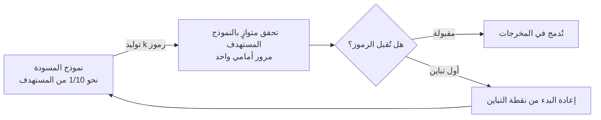

⏱️ **وقت القراءة المقدر**: 9 دقائق


*تجسيد تجريدي للفك الترميز التخميني، حيث يولّد نموذج المسودة الرموز مسبقاً ويتحقق منها النموذج المستهدف بشكل متوازٍ.*

يُقلص الفك الترميز التخميني (speculative decoding) زمن الاستجابة عبر نموذج مسودة يُولّد رموزاً مسبقاً بسرعة، فيما يتحقق النموذج المستهدف من صحتها بشكل متوازٍ. النظرية متاحة منذ 2022، لكن ثمة أسباب جعلت التبني الإنتاجي مترددًا: تكلفة إدارة نموذج المسودة، تضاؤل الفائدة مع تزايد حجم الدُفعة، وعدم اكتمال دعم أطر العمل. تغير الوضع في مايو 2026 حين اندمج EAGLE 3.1 في الفرع الرئيسي لـ vLLM.

## لماذا يعود الاهتمام بالفك الترميز التخميني

في الفك الترميزي الاعتيادي ذاتي الانحدار، تُولَّد الرموز واحداً تلو الآخر. عرض ذاكرة GPU هو عنق الزجاجة، مما يعني انخفاض معدل استخدام GPU كلما صغرت الدفعة. يستهدف الفك التخميني هذه الفجوة بالتحديد.

نموذج المسودة (بحجم عادةً 1/10 من المستهدف) يُولّد k رمزاً مسبقاً، ثم يتحقق النموذج المستهدف منها بمرور أمامي واحد. الرموز التي تجتاز التحقق تُضاف إلى المخرجات، وتبدأ العملية من جديد عند أول تباين. رياضياً، يبقى التوزيع في المخرجات مطابقاً للنموذج المستهدف، أي أن الجودة لا تتراجع مع تحسن السرعة.



يرفع EAGLE (Extrapolation Algorithm for Greater Language-model Efficiency) جودة المسودة بشكل كبير. بدلاً من نموذج لغوي صغير مستقل، يستخدم رأس مسودة ذاتي الانحدار يستعين بطبقة ميزات النموذج المستهدف للتنبؤ بالرمز التالي.

## EAGLE 3.1: الدمج الرسمي في vLLM، مايو 2026

وفقاً لتدوينة نشرها فريق vLLM في 26 مايو 2026، يحمل EAGLE 3.1 تحسينات إضافية مقارنةً بـ EAGLE-3. الأرقام الرئيسية: إنتاجية المخرجات بمستخدم واحد متزامن أعلى بمقدار 2.03 أضعاف، وبتزامن 4 تصبح 1.71 ضعفاً، وبتزامن 16 تصل إلى 1.66 ضعف. الاحتفاظ بالفائدة حتى عند حجوم الدفعات الكبيرة يُميّزه عن الجيل السابق.

P-EAGLE الذي قدمته AWS اندمج أيضاً في الفرع الرئيسي في الوقت ذاته، مُحققاً تحسناً إضافياً بنسبة 20 إلى 30% على مهام البرمجة مقارنةً بـ EAGLE-3 منفرداً.

## الإعداد: تفعيل EAGLE 3.1 في vLLM

في vLLM v0.22.0 أو أحدث (أو nightly بعد مايو 2026):

```bash
vllm serve meta-llama/Llama-3.1-70B-Instruct \
  --speculative-model lmsys/eagle3-llama3.1-instruct-70b \
  --num-speculative-tokens 5 \
  --speculative-disable-by-batch-size 8 \
  --gpu-memory-utilization 0.92
```

`--speculative-disable-by-batch-size 8` يعطّل الفك التخميني تلقائياً حين تتجاوز الطلبات المتزامنة 8. تكلفة المسودة تتجاوز فائدتها عند الدفعات الكبيرة، لذا يجب ضبط هذا المعامل دائماً.

رأس مسودة EAGLE يشارك نفس وحدة GPU مع النموذج المستهدف فلا حاجة لخادم مستقل. يتراوح الحمل الإضافي على الذاكرة بين 2 و4 جيجابايت تقريباً لنموذج مستهدف بحجم 70B تبعاً لحجم رأس المسودة.

## استراتيجية التطبيق في بيئة K8s متعددة المستأجرين

في بيئات تُدار فيها أعباء GPU بـ Kueue كما في ThakiCloud، ثمة اعتبارات عدة:

**فصل أعباء العمل**: الفك التخميني أكثر فاعلية في التفاعل أحادي المستخدم (دفعة صغيرة). أعباء العمل ذات الطلبات المتزامنة العالية كـ RAG pipelines أو الاستدلال الدُفعي تستفيد من مسار الفك الاعتيادي. استخدام LocalQueue في Kueue لفصل طابور التقديم التفاعلي عن طابور الاستدلال الدُفعي، مع تفعيل EAGLE فقط على نسخ vLLM في الطابور التفاعلي.

**إدارة النشر عبر ArgoCD**: رأس مسودة EAGLE يعتمد على إصدار النموذج المستهدف. الترقية إلى Llama-3.1-70B تستلزم استبدال eagle3-llama3.1-70b في آنٍ واحد. تحديد إصدار كلا النموذجين معاً في Helm values، وإعداد ArgoCD ApplicationSet لنشر الزوج مستهدف-مسودة بشكل ذري يمنع التضارب في الإصدارات.

```yaml
# مثال values.yaml
serving:
  targetModel: "meta-llama/Llama-3.1-70B-Instruct"
  targetModelVersion: "v3.1"
  speculativeModel: "lmsys/eagle3-llama3.1-instruct-70b"
  speculativeModelVersion: "v3.1"
  numSpeculativeTokens: 5
  disableBatchSize: 8
```

**التوافق مع تجزئة MIG**: عند استخدام تجزئة MIG على A100/H100، يعمل EAGLE داخل نسخة MIG الواحدة. رأس المسودة والنموذج المستهدف يتشاركان ذاكرة GPU ذاتها، لذا يجب احتساب ذاكرة إضافية عند تخطيط حجم شريحة MIG.

## رصد المقاييس الرئيسية

تكشف vLLM مقاييس Prometheus عبر نقطة `/metrics`. المؤشرات التي ينبغي متابعتها عند تشغيل EAGLE:

```
# معدل قبول الفك التخميني (أعلى = جودة مسودة أفضل)
vllm:spec_decode_accepted_tokens_total
vllm:spec_decode_draft_tokens_total

# معدل استخدام KV cache (رموز المسودة قد ترفع الضغط على الذاكرة المؤقتة)
vllm:gpu_cache_usage_perc

# الإنتاجية لكل دفعة
vllm:generation_tokens_total
```

انخفاض معدل القبول دون 60% يُشير إلى عدم تطابق نموذج المسودة أو تغير توزيع المدخلات. نسبة 70% فأكثر تعني أن الفك التخميني يعمل بفاعلية.

## متى تستخدمه ومتى تتجاهله

السيناريوهات التي يُفيد فيها الفك التخميني واضحة: الدردشة التفاعلية ذات الدفعة الصغيرة (1 إلى 4 طلبات متزامنة)، المهام ذات التوزيع الإخراجي القابل للتنبؤ كمساعدي البرمجة، والحالات التي يتوفر فيها هامش ذاكرة GPU كافٍ لرأس المسودة.

في المقابل: الاستدلال الدُفعي الكبير، خطوط أنابيب متعددة الوسائط ذات توزيعات مدخلات متباينة جداً، وأعباء العمل التي تُعطي الأولوية لأقصى إنتاجية على حساب TTFT، تُفضّل الفك الاعتيادي.

دمج EAGLE 3.1 في vLLM خفّض تكلفة إدارة نموذج المسودة بشكل ملحوظ. إن كان تحسين زمن استجابة التقديم هدفاً في حالات استخدام تفاعلية، فهذا هو الوقت المناسب لتقييم التبني.

## المصادر

- vLLM Blog, "EAGLE 3.1: Advancing Speculative Decoding Through Collaboration Between the EAGLE Team, vLLM, and TorchSpec" (2026-05-26): <https://vllm.ai/blog/2026-05-26-eagle-3-1>
- Li et al., "EAGLE-3: Scaling up Inference Acceleration of Large Language Models via Training-Time Test" (arXiv:2503.01840): <https://arxiv.org/abs/2503.01840>
- AWS Machine Learning Blog, "P-EAGLE: Faster LLM inference with Parallel Speculative Decoding in vLLM": <https://aws.amazon.com/blogs/machine-learning/p-eagle-faster-llm-inference-with-parallel-speculative-decoding-in-vllm/>
- Red Hat Developer, "Fly Eagle(3) fly: Faster inference with vLLM & speculative decoding" (2025-07-01): <https://developers.redhat.com/articles/2025/07/01/fly-eagle3-fly-faster-inference-vllm-speculative-decoding>
