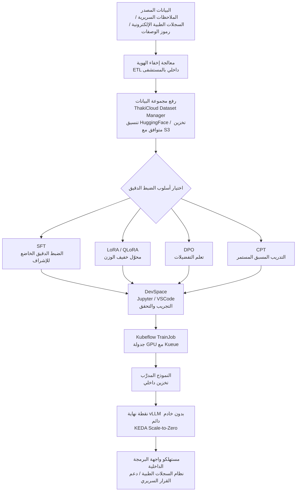

## نظرة عامة

يتسارع اعتماد النماذج اللغوية الكبيرة في قطاع الرعاية الصحية والعلوم الحيوية بوتيرة متصاعدة. مع توسّع نطاق تطبيقاتها -- من تلخيص الملاحظات السريرية، ومساعدة التشخيص، وتحليل أدبيات الأدوية، إلى أتمتة رموز الوصفات الطبية -- بدأت المستشفيات وشركات الأدوية والمؤسسات البحثية في تقييم بناء نماذج متخصصة في مجالاتها.

بيد أن أكبر عائق أمام الذكاء الاصطناعي في الرعاية الصحية ليس التقنية، بل حوكمة البيانات. إذ تحظر القوانين المحلية كقانون الخدمات الطبية وأنظمة حماية البيانات الشخصية وتشريعات الأخلاقيات الحيوية وضوابط الأمن الوطني نقل معلومات المرضى إلى خوادم خارجية أو تُقيّده تقييدًا شديدًا. في هذا السياق، يغدو نهج "رفع البيانات إلى واجهة برمجة تطبيقات سحابية للضبط الدقيق" غير مجدٍ لا قانونيًا ولا عمليًا.

تستعرض هذه المقالة، من خلال حالتين افتراضيتين لمستشفى عام كبير ومعهد أبحاث دوائية، سير العمل الكامل للضبط الدقيق للنموذج اللغوي المتخصص بالمجال وتشغيله داخل مجموعة Kubernetes في المنشأة دون تصدير البيانات. يعتمد سير العمل على منصة ThakiCloud AI Platform مع تفصيل المكوّنات العاملة في كل مرحلة.

---

## لماذا لا يمكن نقل بيانات الرعاية الصحية إلى السحابة

### البيئة التنظيمية

تخضع بيانات الرعاية الصحية المحلية لطبقات متعددة من الأنظمة والتشريعات.

**المادة الحادية والعشرون من قانون الخدمات الطبية** تحظر تزويد السجلات الطبية لأطراف خارجية دون موافقة المريض. **قانون حماية المعلومات الشخصية** يُلزم بالحصول على موافقة صريحة وباتخاذ تدابير أمنية عند نقل المعلومات الحساسة (كالتشخيصات وسجلات الوصفات والمعلومات الجينية) إلى أطراف ثالثة. **قانون الأخلاقيات الحيوية والسلامة** يُعامل النقل خارج الحدود للمواد المشتقة من الإنسان والمعلومات الجينية باعتباره مسألة تستلزم موافقة مستقلة. فضلًا عن ذلك، تخضع المؤسسات الصحية العامة والمعاهد البحثية المرتبطة بالدفاع لمراجعات الصلاحية الأمنية من الجهات المعنية، وكثيرًا ما تعمل في بيئات معزولة تمامًا عن الشبكات الخارجية.

### المخاطر العملية

إلى جانب التنظيمات، ثمة مخاطر عملية واقعية. وُثّقت حالات في الخارج رُفعت فيها دعاوى انتهاك الخصوصية بسبب إرسال ملاحظات سريرية إلى واجهات برمجة تطبيقات AI خارجية دون إخفاء الهوية. حتى الادعاء بأن "إخفاء الهوية يجعل الأمر مقبولًا" يظل هشًا قانونيًا نظرًا لإمكانية إعادة التعريف من خلال ربط المعرّفات شبه-المباشرة.

الخلاصة واضحة: يجب تدريب نماذج الذكاء الاصطناعي الصحية وخدمتها حيث توجد البيانات، أي داخل المجموعة المحلية للمنشأة.

---

## سير عمل الضبط الدقيق الداخلي

صُمّمت منصة ThakiCloud AI Platform على Kubernetes، وتُنجز جميع عمليات التدريب والاستدلال داخل المجموعة المحلية كليًا دون خروج البيانات إلى الشبكة الخارجية. يستعرض المخطط التالي كل مرحلة بالتفصيل.



*يُمثّل المخطط أعلاه تدفقًا مفاهيميًا؛ قد تختلف معاملات الإعداد الفعلية بحسب البيئة.*

### المرحلة الأولى: إعداد مجموعة البيانات ورفعها

لا يمكن استخدام البيانات الطبية في الضبط الدقيق بشكلها الخام. يجب أن تمر عبر خط أنابيب ETL الداخلي بالمستشفى لإخفاء الهوية (إزالة الأسماء وأرقام الهوية الوطنية وأرقام تسجيل المستشفى)، وتحويل التنسيق (تحويل FHIR JSON أو النص الحر إلى أزواج تعليمات-استجابة)، وتصفية الجودة (إزالة التكرارات والسجلات ذات الأحجام الشاذة).

تُرفع البيانات المعالجة بعد ذلك إلى التخزين الداخلي عبر مدير مجموعات البيانات في ThakiCloud. نظرًا لدعم المنصة لتنسيق مجموعات بيانات HuggingFace والتخزين المتوافق مع S3، يكون التكامل مع خطوط بيانات قائمة سهلًا. تتيح ميزات وحدات التخزين والنسخ الاحتياطية إدارة إصدارات مجموعات البيانات والتراجع إلى إصدارات سابقة عند الحاجة.

```python
# مثال مفاهيمي - عنصر نائب، وليس مواصفة API الفعلية
dataset_config = {
    "name": "clinical-notes-sft-v1",
    "format": "jsonl",
    "schema": {
        "instruction": "string",   # مثال: "لخّص الملاحظة السريرية التالية."
        "input": "string",         # نص الملاحظة السريرية
        "output": "string"         # ملخص يكتبه الأخصائي
    },
    "storage": "s3://internal-bucket/datasets/clinical-notes/",
    "privacy_level": "restricted"  # تقييد الوصول عبر RBAC
}
```

يتحكم RBAC المبني على Keycloak في أذونات الوصول إلى مجموعات البيانات على مستوى المؤسسة والمشروع والدور الوظيفي. لا يتمكن أعضاء فريق البحث إلا من رؤية مجموعات البيانات الخاصة بمشاريعهم، ويُحظر خلط بيانات المؤسسات على مستوى النظام.

### المرحلة الثانية: اختيار أسلوب الضبط الدقيق

تدعم منصة ThakiCloud AI Platform ستة أساليب للضبط الدقيق، ويُختار من بينها وفقًا لخصائص المجال الصحي.

**SFT (الضبط الدقيق الخاضع للإشراف)**: الأسلوب الأكثر وضوحًا وبداهة، ويناسب الحالات التي تتوفر فيها بيانات أزواج تعليمات-استجابة كافية. مناسب للمهام ذات الإجابات الصحيحة الواضحة كتلخيص الملاحظات السريرية وتصنيف رموز الوصفات وتفسير نتائج الفحوصات. تُعدّ جودة البيانات أمرًا بالغ الأهمية؛ إذ كثيرًا ما تتفوق مجموعة بيانات صغيرة عالية الجودة مُراجَعة من متخصصين على كميات ضخمة من البيانات غير المدققة.

**LoRA / QLoRA (التكيّف منخفض الرتبة)**: يُتيح الضبط الدقيق الكفؤ للنماذج الأساسية الكبيرة في بيئات محدودة ذاكرة GPU. نظرًا لتدريب طبقات المحوّل فحسب، يُحدَّث [تقديري] 1-5% فقط من المعاملات مقارنةً بإجمالي المعاملات. وهو خيار واقعي للمستشفيات الصغيرة والمتوسطة أو المعاهد البحثية التي تمتلك عددًا محدودًا من وحدات GPU من طراز A100 وتحتاج إلى ضبط نماذج بحجم Llama-3 70B أو Qwen-2.5 72B.

**DPO (التحسين المباشر للتفضيلات)**: يتدرب على بيانات التفضيلات حيث يُختار الرد الأفضل من بين خيارين. يلائم هذا الأسلوب تضمين متطلبات المجال الصحي كـ"يجب أن يُقدّم نظام مساعدة التشخيص إجابات أكثر أمانًا وتحفظًا". ويُستخدم أساسًا كمرحلة توافق تلي SFT.

**CPT (التدريب المسبق المستمر)**: يُستخدم لحقن المعرفة المتخصصة في النموذج الأساسي باستخدام كميات كبيرة من النصوص غير المنظمة كالأوراق الطبية والكتب الدراسية في الصيدلة والإرشادات السريرية. تكون كميات البيانات كبيرة ووقت التدريب طويلًا، غير أن النموذج يكتسب فهمًا أعمق للمصطلحات والمفاهيم الطبية.

**GKD (التقطير المعرفي المعمَّم)**: ينقل المعرفة من نموذج معلّم أكبر (تم التحقق منه داخليًا) إلى نموذج طالب أصغر. يفيد هذا الأسلوب حين يجب تخفيض تكاليف الاستدلال مع الحفاظ على الجودة، وهو مناسب حين يجب أن يكون نموذج الخدمة الفعلي صغيرًا وسريعًا مع الاستفادة القصوى من خبرة النموذج المعلّم.

**GRPO (تحسين السياسة النسبي للمجموعات)**: نهج قائم على التعلم المعزز يستخدم مكافآت نسبية للمجموعات. يُطبَّق على مهام التشخيص الطبي التي تستلزم استدلالًا معقدًا أو لتعزيز إرشادات أمان بعينها.

### المرحلة الثالثة: التجريب والتحقق في DevSpace

قبل إطلاق عملية الضبط الدقيق الكاملة، تُجرى تجارب على نطاق صغير في DevSpace. DevSpace هي بيئة Jupyter Notebook أو VS Code تعمل على Kubernetes Pod مع وصول مباشر إلى وحدات GPU في المجموعة الداخلية.

يتصل الباحثون ببيئة DevSpace عبر Pod SSH ويختبرون نصوص التدريب على مجموعة فرعية صغيرة من البيانات. يُتيح إتمام ضبط المعاملات الفائقة (معدل التعلم وحجم الدفعة ورتبة LoRA وما إلى ذلك) والتحقق من تنسيق البيانات في هذه المرحلة تقليل وقت GPU المُهدَر في مهام التدريب الكاملة لاحقًا.

```bash
# مثال على الاتصال بـ DevSpace Pod (عنصر نائب - تعتمد الأوامر الفعلية على إعدادات المنصة)
# ssh <devspace-pod-name>.<namespace>.svc.cluster.local

# مثال تجربة LoRA على نطاق صغير
python train.py \
  --model_name_or_path /mnt/models/llama3-8b \
  --data_path /mnt/datasets/clinical-notes-sample \
  --method lora \
  --lora_r 16 \
  --lora_alpha 32 \
  --num_train_epochs 3 \
  --per_device_train_batch_size 4 \
  --output_dir /mnt/checkpoints/exp-001
```

### المرحلة الرابعة: التدريب الكامل باستخدام Kubeflow TrainJob

حين تكون نتائج التجارب مُرضية، يُطلق تدريب كامل على مجموعة البيانات الكاملة عبر Kubeflow TrainJob. يتشارك Kueue ومُجدوِل KAI موارد GPU مع أعباء العمل الأخرى في المستشفى مع تخصيص وحدات GPU اللازمة لمهام التدريب وفق الأولويات.

يمكن أيضًا الإعلان عن التدريب الموزع متعدد GPU (مثل PyTorch DDP أو DeepSpeed ZeRO) بصورة تصريحية في مواصفات Kubeflow TrainJob.

```yaml
# مثال مفاهيمي على TrainJob - عنصر نائب
apiVersion: kubeflow.org/v1
kind: PyTorchJob
metadata:
  name: clinical-notes-sft-run1
  namespace: hospital-ai
spec:
  pytorchReplicaSpecs:
    Master:
      replicas: 1
      template:
        spec:
          containers:
          - name: trainer
            image: registry.internal/thakicloud/trainer:v1.2
            args:
            - "--method=sft"
            - "--data=/mnt/datasets/clinical-notes-v1"
            - "--model=/mnt/models/qwen2.5-7b"
            - "--output=/mnt/checkpoints/clinical-qwen-v1"
            resources:
              limits:
                nvidia.com/gpu: "4"
    Worker:
      replicas: 3
      # ...
```

توفر قياسات DCGM لـ GPU مراقبة فورية لمعدل استخدام GPU واستهلاك الذاكرة ودرجات الحرارة أثناء التدريب. تُولَّد تنبيهات عند ظهور شذوذات، ويمكن إعادة التشغيل بأمان بالاستناد إلى نقاط التحقق.

تُخزَّن النماذج المدرَّبة في التخزين الداخلي (بما يشمل إدارة وحدات التخزين والنسخ الاحتياطية). لا تغادر البيانات المجموعة الداخلية من البداية حتى النهاية.

---

## الخدمة والتشغيل

### نقطة نهاية vLLM بدون خادم دائم

تُقدَّم النماذج المتخصصة المدرَّبة عبر نقطة نهاية استدلال بدون خادم دائم مبنية على vLLM. تستخدم vLLM تقنية PagedAttention لإدارة ذاكرة GPU بكفاءة، وتحقق إنتاجية عالية من خلال المعالجة الدفعية المستمرة (continuous batching).

يُنفَّذ التكامل مع KEDA (التحجيم التلقائي المدفوع بالأحداث في Kubernetes) لتحقيق وظيفة Scale-to-Zero. حين لا توجد طلبات، يتقلص خادم الاستدلال إلى صفر، ثم يتوسع تلقائيًا عند وصول الطلبات. نظرًا لتركّز أنماط استخدام LLM في المستشفيات في ساعات النهار عادةً، لا داعي لإبقاء وحدات GPU في حالة خمول طوال الليل.

```yaml
# مثال مفاهيمي على KEDA ScaledObject - عنصر نائب
apiVersion: keda.sh/v1alpha1
kind: ScaledObject
metadata:
  name: clinical-llm-endpoint
  namespace: hospital-ai
spec:
  scaleTargetRef:
    name: clinical-llm-deployment
  minReplicaCount: 0      # Scale-to-Zero
  maxReplicaCount: 4
  triggers:
  - type: prometheus
    metadata:
      serverAddress: http://prometheus:9090
      metricName: vllm_requests_pending
      threshold: "5"      # التوسع عند وجود 5 طلبات معلّقة أو أكثر
```

### هيكل تكاليف الاستدلال

تعتمد واجهات برمجة تطبيقات LLM الخارجية (كـ GPT-4 API) نموذج الفوترة بالرمز المميز. بالنسبة للمهام ذات النوافذ السياقية الطويلة كتلخيص الملاحظات السريرية، يمكن أن يتصاعد الفاتورة الشهرية بسرعة. علاوة على ذلك، يُشكّل إرسال البيانات السريرية عبر واجهة برمجة التطبيقات المخاطر التنظيمية المذكورة آنفًا.

تستلزم نقطة نهاية vLLM الداخلية استثمارًا أوليًا في بنية تحتية لـ GPU، لكن لا تتكبّد بعدها تكاليف إضافية لكل رمز مميز. إذا أمكن إعادة استخدام خوادم GPU التي يمتلكها المستشفى فعلًا أو البنية التحتية HPC المخصصة للأبحاث السريرية، فإن التكاليف الهامشية تنخفض إلى مستوى استهلاك الكهرباء ونفقات العمالة التشغيلية.

### RBAC وعزل المستأجرين المتعددين

تحتاج المؤسسات الصحية الكبيرة إلى أقسام سريرية وفرق بحثية وإدارية مختلفة تصل إلى بيانات ونماذج متباينة. تُدير RBAC المبنية على Keycloak في ThakiCloud الأذونات على مستوى المؤسسة والمشروع والدور الوظيفي (مدير / مطوّر / مشاهد). تُضمَّن معلومات المجموعة في رموز JWT للتحقق الفوري من الوصول.

يمكن تقييد نطاق نموذج مساعدة تشخيص السكري الذي ضبطه فريق أمراض الغدد الصماء بمشروعه حتى لا يتمكن فريق أمراض القلب من الوصول إليه. هذا يُقلّص ليس فحسب عزل البيانات الداخلي، بل أيضًا مخاطر سوء استخدام النموذج (النموذج الخاطئ في السياق الخاطئ).

### قياس الأداء مع lm-eval

لقياس جودة النموذج كميًا قبل الخدمة، تُستخدم ميزة قياس الأداء lm-eval. تُسجَّل مجموعات تقييم متخصصة في المجال الصحي مبنية داخليًا (مجموعات QA مُدقَّقة من متخصصين)، ويُقاس حجم التحسن الذي حققه النموذج المدرَّب مقارنةً بالنموذج الأساسي.

---

## رؤى التطبيق في ThakiCloud

### حالة افتراضية: تلخيص الملاحظات السريرية في مستشفى عام من الدرجة الثالثة

لنأخذ مستشفى (أ) الافتراضي مثالًا. كانت تواجه مشكلة أن كتابة ملخصات الخروج للمرضى المقيمين تستغرق وقتًا طبيًا مقدّرًا. وكان إدخال واجهة برمجة تطبيقات AI الخارجية صعبًا بسبب إجراءات معقدة تشمل عقود الاستعانة بمعالجة البيانات الشخصية ومراجعات أمنية وموافقات لجان حماية المعلومات.

لو اختارت نهجًا داخليًا، فقد كان يسير على النحو التالي:

1. تعالج بيانات ملخصات الخروج التاريخية مجهولة الهوية (أزواج الملاحظات السريرية الأصلية والملخصات التي يكتبها المتخصصون) عبر خط ETL الداخلي.
2. تُرفع البيانات إلى مدير مجموعات بيانات ThakiCloud وتُمنح أذونات الوصول لمشروع فريق المعلومات السريرية.
3. تُجرى تجارب SFT على نطاق صغير في DevSpace لاستكشاف النموذج الأساسي المناسب (مثل Llama-3 8B أو Qwen2.5 7B) والمعاملات الفائقة.
4. يُطلق التدريب الكامل عبر Kubeflow TrainJob مع استخدام التدريب الموزع عبر 8 عقد GPU داخل المستشفى.
5. حين تستوفي درجات ROUGE و QA للمجال المقيسة بـ lm-eval معايير الجودة، يُنشر النموذج كنقطة نهاية vLLM.
6. يستدعي نظام السجلات الطبية الإلكترونية واجهة البرمجة الداخلية لتلقّي نتائج التلخيص وتقديم مسودات للأطباء.

لا تغادر البيانات مركز بيانات مستشفى (أ) قط.

### حالة افتراضية: تحليل أدبيات التجارب السريرية في معهد أبحاث دوائية

سعى معهد (ب) الافتراضي إلى أتمتة استخراج إشارات السلامة من وثائق بروتوكولات التجارب السريرية وتقارير الآثار الجانبية للأدوية. كانت هذه البيانات تحتوي على معلومات المشاركين في الأبحاث ونتائج سريرية غير منشورة مما جعل تصديرها الخارجي مستحيلًا.

نهج من مرحلتين يبدو فعّالًا هنا: استخدام CPT على مئات الآلاف من الأدبيات الطبية المتاحة داخليًا لتعزيز معرفة النموذج الأساسي بالمجال، ثم استخدام SFT لتخصيصه لمهمة استخراج إشارات السلامة. مع إعداد Scale-to-Zero، لا تُخصَّص وحدات GPU إلا حين يستخدمها فريق البحث، ويمكن لأعباء العمل الحسابية الأخرى الاستفادة من وحدات GPU في الليل وعطلات نهاية الأسبوع.

---

## القيود والاعتبارات

### متطلبات القدرات التشغيلية

تستلزم منصة LLM الداخلية، خلافًا لـ SaaS الخارجي، قدرات تشغيلية داخلية. يحتاج الأمر إلى مهندسي MLOps يتولّون إدارة مجموعات Kubernetes وصيانة تعريفات برامج تشغيل GPU وإدارة إصدارات النماذج وتطبيق تحديثات الأمان. بالنسبة للمستشفيات أو المعاهد البحثية الصغيرة، قد يكون تبنّي هذه القدرات داخليًا أمرًا عسيرًا.

### جودة البيانات تحدد الأداء

تعتمد نتائج الضبط الدقيق اعتمادًا مطلقًا على جودة البيانات. إجراء SFT على ملاحظات سريرية غير مُدقَّقة من متخصصين قد يُفضي إلى تعلّم أخطاء. يجب التخطيط مسبقًا لوقت الأطباء المتخصصين وتكاليف عملية التعليق (annotation) اللازمة لإنتاج بيانات مُصنَّفة عالية الجودة.

### التحقق من تراخيص النماذج الأساسية

حتى عند تطبيق LoRA أو SFT، يجب التحقق حتمًا من شروط ترخيص النموذج الأساسي. تتباين صلاحيات الاستخدام التجاري وبنود تقييد الاستخدام لأغراض طبية من نموذج لآخر. حتى النماذج مفتوحة المصدر الرئيسية كـ Llama-3 وQwen وGemma لكل منها شروط استخدام مختلفة، لذا يجب أن تسبق مراجعة الفريق القانوني أي نشر.

### إدارة زمن استجابة الاستدلال

مع إعداد Scale-to-Zero، يحدث زمن تحميل النموذج (البدء البارد) عند أول طلب. حتى نموذج بحجم 7B يمكن أن يستغرق عشرات الثواني للتحميل على GPU. بالنسبة للتطبيقات الحساسة لزمن الاستجابة كدعم القرار السريري الفوري، يجب إبقاء الحد الأدنى لعدد النسخ عند 1، أو تطبيق استراتيجية تسخين مسبق مختلفة.

### التحقق من النماذج والامتثال التنظيمي

قد تخضع أنظمة دعم القرار الطبي المعتمدة على الذكاء الاصطناعي لإجراءات اعتماد الأجهزة الطبية من قِبَل الجهات التنظيمية المختصة. إذا استُخدم النموذج بطريقة تُصدر "تشخيصات"، يجب مراجعة لوائح البرمجيات بوصفها أجهزة طبية (SaMD). تُعدّ نتائج قياس الأداء lm-eval وبيانات التحقق الداخلي أدلة داعمة في هذه العملية. غير أن الامتثال التنظيمي يتجاوز نطاق ميزات المنصة ويستلزم استشارة تنظيمية متخصصة.

---

في اعتماد النماذج اللغوية الكبيرة في قطاع الرعاية الصحية والعلوم الحيوية، يسبق السؤال "كيف نوظّف الذكاء الاصطناعي مع حماية البيانات" كونه مسألة تقنية ليكون مسألة حوكمة. منصة الضبط الدقيق الداخلية إجابة عملية على هذا السؤال. لقد نضج نهج الإبقاء على البيانات داخل المنشأة دون التفريط في جودة النموذج ليصبح قابلًا للتشغيل الفعلي في بيئة Kubernetes.

*الحالات الافتراضية الواردة في هذه الوثيقة مكتوبة لأغراض توضيحية ولا تشير إلى مؤسسات فعلية. يُوصى بمراجعة الفريق القانوني والخبراء التنظيميين قبل بناء نظام ذكاء اصطناعي للرعاية الصحية.*
