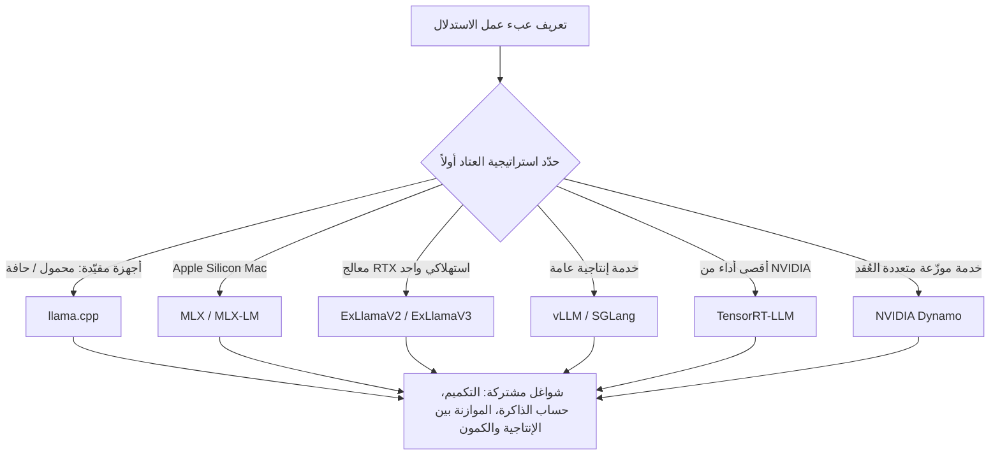

أول سؤال يواجه من يبدأ بالاستدلال المحلي لنماذج LLM هو "أي محرّك يجب أن أستخدم؟" تنهمر أسماء مثل llama.cpp وvLLM وSGLang وTensorRT-LLM، لكن لا يوجد توجيه واضح حول الأساس الذي يُبنى عليه الاختيار. نشر Ahmad Osman (@TheAhmadOsman)، مشرف GPU في r/LocalLLaMA، مؤخراً دليلاً شاملاً مجانياً يسدّ هذه الفجوة.

في ThakiCloud نتعامل مع خدمة النماذج على منصة AI/ML SaaS قائمة على K8s. وفيما يلي ما تعنيه الرسالة الجوهرية لهذا الدليل لمزوّدي سحابة GPU والذكاء الاصطناعي داخل المؤسسة مثلنا.

## ما هو هذا الدليل

دليل Ahmad Osman ليس درساً بسيطاً للتثبيت. إنه أشبه بكتاب مرجعي ينظّم الاستدلال المحلي من البداية إلى النهاية. ورسالته الجوهرية واضحة. أنت لا تختار محرّك الاستدلال أولاً، بل تحدّد استراتيجية العتاد أولاً، ثم يتبعها المحرّك المناسب.

تهمّ هذه الزاوية لأن اختيار المحرّك أولاً يدفعك إلى تجاهل قيود العتاد الذي تملكه فعلاً. فالنموذج الذي تشغّله على حاسوب محمول واحد والنموذج الذي تشغّله على خادم بأربعة معالجات رسومية هما خياران مختلفان منذ البداية. يقرّ الدليل بهذا ويقسّم النقاش عبر بيئات تشغيل متعددة: الأجهزة المقيّدة كالحواسيب المحمولة والحافة، تدفقات العمل المتمحورة حول Mac، معالج RTX رسومي واحد، تكوينات NVIDIA CUDA متعددة المعالجات من اثنين إلى أربعة أو أكثر، الخدمة الإنتاجية العامة، السياق الطويل وتوجيه MoE، استخراج أقصى أداء من NVIDIA، وأخيراً تنسيق العناقيد. ولكل سيناريو يشير إلى الأدوات المناسبة.

يلخّص المخطط أدناه المنطق الجوهري للدليل بوصفه ربطاً بين سيناريوهات العتاد ومحركات الاستدلال.

تختلف المحركات حسب السيناريو، لكن الشواغل العملية المتمثلة في التكميم وحساب الذاكرة والموازنة بين الإنتاجية والكمون تواجهك بالطريقة نفسها أياً كان المسار الذي تسلكه. وكون الدليل يشرح هذه الشواغل المشتركة يزيد من قيمته كمرجع.

## مشهد محركات الاستدلال

على صعيد البرمجيات، يغطي الدليل تقريباً كل المنظومات الرئيسية في بيئة الاستدلال المحلي اليوم. ويتميّز كل محرّك في شيء مختلف.

- **llama.cpp**: قوته في تعدد الاستخدامات، إذ يعمل على المعالج المركزي والرسومي معاً حين تكون ذاكرة VRAM ضيقة وذاكرة RAM وافرة. وهو نقطة الانطلاق الأقل حاجزاً.
- **MLX وMLX-LM**: منظومات مُحسّنة لمعالجات Apple Silicon. تناسب من يريد تشغيل الاستدلال على MacBook أو Mac Studio باستخدام الذاكرة الموحّدة.
- **ExLlamaV2 وExLlamaV3**: يهدفان إلى استدلال مُكمَّم سريع على معالجات الرسوميات الاستهلاكية، ويناسبان حالات الرغبة في أقصى سرعة من بطاقة RTX واحدة.
- **vLLM وSGLang**: المعيار الفعلي للخدمة الإنتاجية. يرفع كلٌّ من PagedAttention والدفعات المستمرة إنتاجية الطلبات المتعددة.
- **TensorRT-LLM**: محرّك يستخرج أداءً أقصى من عتاد NVIDIA. يخفض التحسين على مستوى النواة الكمون، لكن صعوبة البناء والتشغيل أعلى.
- **NVIDIA Dynamo**: يستهدف الخدمة الموزّعة عبر عُقد متعددة، ويُستخدم حين توزّع الاستدلال خارج خادم واحد.

يتضح أمر واحد من هذه القائمة. لا وجود لشيء اسمه "أفضل محرّك استدلال". قد يكون llama.cpp هو الجواب الصحيح على جهاز مقيّد، بينما قد يكون vLLM أو TensorRT-LLM هو الجواب الصحيح لخدمة تتلقى آلاف الطلبات المتزامنة. المعيار ليس تفوّق المحرّك بل تركيبة عبء العمل والعتاد.

## لماذا الاستدلال المحلي الآن

أسباب تنامي الاهتمام بالاستدلال المحلي واضحة. ويذكر الدليل ونقاشات المجتمع أربعة دوافع مشتركة.

أولاً، سيادة البيانات والخصوصية. الطلب على معالجة البيانات الحساسة داخلياً بدلاً من إرسالها إلى واجهات برمجية خارجية قوي بشكل خاص في الرعاية الصحية والتمويل والقطاع العام. ثانياً، بنية التكلفة. الانتقال من التسعير حسب الرمز إلى تكاليف عتاد ثابتة يقلب الاقتصاديات لصالح المؤسسات كثيفة الاستخدام. ثالثاً، الكمون. الاستدلال المحلي الذي لا يعبر الشبكة يمكن أن يقلّل كمون الاستجابة. رابعاً، التحكّم. الإمساك المباشر بالنموذج والبنية التحتية يتيح ضبط الإصدار والتكميم والتوجيه وفق احتياجات مؤسستك.

مع انتقال مركز الثقل من الاعتماد الكلّي على واجهات السحابة نحو داخل المؤسسة والحافة، يستمر تنامي الطلب على مادة تتيح مقارنة أي محرّك يُوضع على أي عتاد دفعة واحدة. هذه هي خلفية الاهتمام الذي ناله دليل Ahmad Osman.

## تطبيق ذلك على منصة ThakiCloud K8s AI/ML SaaS

تقع الخدمة المحلية وداخل المؤسسة لنماذج LLM التي يغطّيها هذا الدليل في قلب أعمال ThakiCloud تماماً. فموقعنا كمنصة AI/ML SaaS قائمة على K8s، وذكاء اصطناعي سيادي وداخل المؤسسة، وسحابة GPU، وMSP، وذكاء اصطناعي للمؤسسات، هو بالضبط عمل حلّ المشكلات التي تصفها هذه المادة.

منطق الدليل الجوهري، "استراتيجية العتاد أولاً ثم يتبعها المحرّك"، إطار يمكننا استخدامه مباشرة عند اقتراح موارد GPU ومنظومات الاستدلال للعملاء. الطيف الممتد من بطاقة RTX واحدة إلى تعدد المعالجات وتنسيق العناقيد يتداخل تماماً مع المجال الذي تغطّيه فعلاً جدولة أعباء العمل القائمة على Kueue وإدارة دورة حياة GPU لدينا. تحديد مستوى عتاد العميل أولاً ومطابقة تكوين الخدمة المناسب له هو ما نفعله كل يوم.

على صعيد الفرص، إذا جمعنا منظومات الخدمة الإنتاجية مثل vLLM وSGLang وTensorRT-LLM وNVIDIA Dynamo في عروض مُدارة على K8s، يمكننا استيعاب عبء اختيار العملاء للمحركات وضبطها بأنفسهم. قراءة دليل واحد وبناء محرّك يدوياً يختلف تشغيلياً اختلافاً كبيراً عن تلقّي منظومة خدمة مُتحقَّق منها مع اتفاقية مستوى خدمة. وللمؤسسات وعملاء القطاع العام الراغبين في سيادة البيانات والتحكّم في التكلفة، يمكن لهذا الدليل أن يكون أيضاً دليلاً لعرض ميزة التكلفة الإجمالية للملكية للاستدلال داخل المؤسسة مقابل واجهات السحابة بشكل كمّي.

التحدّي الحقيقي الذي نتعامل معه هو تنمية عرض توضيحي على جهاز واحد إلى خدمة إنتاجية متعددة المستأجرين. وتنسيق العناقيد، الذي يضعه الدليل في نهاية سيناريوهاته، هو بالضبط تلك النقطة، ومنها يصبح الأمر مسألة عزل للموارد وكفاءة GPU وأتمتة تشغيل تتجاوز اختيار المحرّك.

## القيود والحجج المضادة

ومع ذلك، علينا أيضاً النظر إلى التهديد. الأدلة المجانية بمستوى "الإنجيل" مثل هذا ونضج أدوات مثل llama.cpp وMLX تخفض حاجز الدخول، ما يسهّل على العملاء الذهاب مباشرة إلى الاستضافة الذاتية. وحين يكون محرّك الاستدلال نفسه مفتوح المصدر والمادة التي تنظّم كيفية تثبيته منشورة مجاناً، فإن مجرد تقديم "سنثبّت لك المحرّك" لا يشكّل أي تمايز.

لذا يجب أن يكمن تمايزنا لا في المحرّك نفسه بل في عزل المستأجرين المتعددين، وتعظيم كفاءة GPU، وأتمتة التشغيل، واتفاقية مستوى الخدمة. علينا إثبات القيمة لا بما تشغّله بل بمدى استقرار تشغيلنا له نيابةً عنك. ما يعلّمه الدليل يصل إلى "أي محرّك يناسب أي عتاد"، أما "ما الذي تحتاجه أكثر لخدمته باستقرار لمستأجرين كثر على مدار الساعة" فهو الأرض التي تتجاوز الدليل. تلك الأرض هي حيث نتحمّل المسؤولية.

نقطة أخرى جديرة بالذكر هي أن أرقام الإنتاجية والأداء التي يقدّمها الدليل تأتي من بيئة العتاد الخاصة بالمؤلف. في النشر الفعلي، عليك إعادة قياس مفاضلات حجم النموذج والعتاد والإنتاجية مقابل عبء عملك. الدليل خريطة، لا ضمان.

## الخاتمة

يقدّم دليل Ahmad Osman للاستدلال المحلي إطاراً بسيطاً لكنه عملي: "العتاد قبل المحرّك". وبعرضه المشهد من llama.cpp إلى NVIDIA Dynamo دفعة واحدة، يصبح نقطة انطلاق جيدة لكل من يبدأ بالاستدلال المحلي. ولمزوّدي الخدمة مثلنا، هذه المادة إطار لمقترحات العملاء وتذكير في الوقت نفسه بالضغط التنافسي للاستضافة الذاتية. وللمهندسين المهتمين بإثبات القيمة عبر التشغيل بما يتجاوز المحرّك، هذا مكان تكون فيه مثل هذه المشكلات هي المهمة اليومية.

---

المصادر: الدليل الشامل للاستدلال المحلي لنماذج LLM بقلم Ahmad Osman (@TheAhmadOsman، مشرف GPU في r/LocalLLaMA). موقع المؤلف [ahmadosman.com](https://ahmadosman.com)، [التغريدة](https://x.com/hjguyhan/status/2068706994480115949) الأصلية، ومرجع مقارنة محركات الاستدلال [مقارنة محركات الاستدلال المحلي 2026](https://www.local-llm.net/compare/inference-engines-2026/). أرقام الأداء مبنية على بيئة المؤلف وتتطلب إعادة تحقّق في الواقع.
