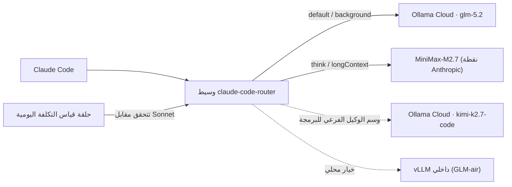

## نظرة عامة

‏Claude Code أداة برمجة وكيلية تعمل في الطرفية. افتراضياً تُرسِل الطلبات إلى واجهة Anthropic، لكن ليست كل الطلبات بالوزن نفسه. فالتلخيص الخلفي، والإكمال القصير، وتحليل السياق الطويل، والاستدلال العميق لإعادة الهيكلة تتطلب جميعها مستويات نماذج مختلفة. إذا أرسلت كل شيء إلى أغلى نموذج تتراكم التكلفة، وإذا أرسلت كل شيء إلى أرخصها تنهار الجودة.

يحل `claude-code-router` (واختصاراً CCR) هذه المشكلة عبر طبقة توجيه. يقف كوسيط بين Claude Code وخلفيات النماذج ويفرّع الحركة حسب نوع الطلب. هذا المقال ليس مجرد جولة مفاهيمية، بل سجل لاستدعاء ثلاثة نماذج خارجية للتحقق من سلوكها، وإصلاح المشكلات المكتشفة في الطريق (مفتاح API ميت، وتسرّب وسوم التفكير)، وأخيراً إرفاق حلقة تقيس باستمرار ما إذا كان التوجيه أرخص فعلاً من Sonnet.

المبدأ الحاكم، نذكره مقدّماً: **كل نموذج يُوجَّه عبر CCR لا قيمة له إلا إذا كان أكثر كفاءة في التكلفة من Claude Sonnet.** وإلا فإنك تخفض الجودة بينما يستمر صرف المال. لذلك لا نؤكّد، بل نقيس.

---

## ما هو claude-code-router

‏CCR وسيط يتلقى طلبات بصيغة Anthropic، ويحوّلها إلى صيغة متوافقة مع OpenAI (أو غيرها)، ثم يمرّرها إلى المزوّد المُعَدّ. لا يعدّل عميل Claude Code. شغّل جلسة بـ `ccr code` فتُوجَّه حركة تلك الجلسة عبر الوسيط على `localhost:3456`.

أبرز الميزات:

- **التوجيه حسب نوع الطلب**: `default` و`background` و`think` و`longContext` و`webSearch`، لكلٍّ نموذج مختلف.
- **تعدّد المزوّدين**: أي نقطة متوافقة مع OpenAI يمكن تسجيلها. نستخدم هنا Ollama Cloud وMiniMax.
- **المحوّلات (transformers)**: يمتص المحوّل خصوصيات كل مزوّد. ومحوّل التمرير `Anthropic` لنقاط Anthropic الأصلية هو الأداة المحورية في هذا المقال.
- **التبديل الديناميكي**: غيّر النموذج أثناء الجلسة بـ `/model provider,model`.

إصدار CCR المُتحقَّق منه هو `1.0.62`. يقع الإعداد في `~/.claude-code-router/config.json`، ومحوره مصفوفة `Providers` وكائن `Router`.

---

## ماذا يُوجَّه — مثبَّت على ثلاثة نماذج

مجموعة النماذج ثلاثة بالضبط. فزيادة النماذج تعقّد جدول التوجيه وترفع كلفة التحقق، لذا ضيّقناها عمداً.

| الدور | النموذج | المزوّد | ملاحظة |
|------|---------|---------|--------|
| الأساسي (default/background) | `glm-5.2` | Ollama Cloud | برمجة يومية، قوي ورخيص |
| الاستدلال (think/longContext) | `MiniMax-M2.7` | MiniMax | تفكير منفصل، كلفة منخفضة جداً لكل رمز |
| الوكيل الفرعي للبرمجة | `kimi-k2.7-code` | Ollama Cloud | للأدوار البرمجية الصعبة فقط |

‏`glm-5.2` هو حصان العمل؛ والاستدلال العميق والسياق الطويل فقط يذهبان إلى MiniMax، والدور البرمجي الصعب إلى Kimi.

---

## التحقق — استدعينا ولم نفترض

قبل كتابة أي إعداد، استدعينا النماذج الثلاثة مباشرةً. ولتجنّب اختلاق الأرقام فحصنا الاستجابات الفعلية، فظهرت ثلاث حقائق.

**أولاً، مفتاح Ollama Cloud واحد يغطي GLM وKimi معاً.** أرجع كلٌّ من `glm-5.2` و`kimi-k2.7-code` رمز HTTP 200 من `https://ollama.com/v1`. فـ Ollama Cloud يجمع عائلات GLM وKimi وDeepSeek وQwen خلف مفتاح واحد.

**ثانياً، مفتاح Kimi المنفرد كان ميتاً.** أرجع مفتاح Moonshot المنفرد في `.env` رمز 401 (مصادقة غير صالحة) على moonshot.ai وmoonshot.cn ونقطة Anthropic المتوافقة على حدٍّ سواء. لحسن الحظ يمكن الوصول إلى Kimi K2 عبر `kimi-k2.7-code` في Ollama Cloud، فلم يكن المفتاح الميت طريقاً مسدوداً.

**ثالثاً، اختيار نقطة MiniMax يحسم الجودة.** عند الاستدعاء عبر النقطة المتوافقة مع OpenAI (`/v1/chat/completions`) يضمّن النموذج استدلاله داخل المتن بوسوم `<think>...</think>`، وتعجز طبقة التحويل في CCR عن إزالتها فتتسرب إلى المستخدم (musistudio/claude-code-router#964). أما عند الاستدعاء عبر نقطة Anthropic الأصلية (`/anthropic/v1/messages`) فيُرجع النموذج نفسه كتلتي `thinking` و`text` نظيفتين.

البند الأخير علّة وجب إصلاحها لا سبباً لإسقاط MiniMax. والإصلاح مُضمَّن في الإعداد أدناه.

---

## الإعداد — الأسرار خارج المستودع، والإعداد كشيفرة

لا تُكتب المفاتيح مباشرةً في ملف الإعداد. سكربت مولِّد يقرأ `.env` في المستودع ويكتب `~/.claude-code-router/config.json`. فلا تبقى مفاتيح في المستودع، وتدوير المفتاح يعني فقط إعادة تشغيل السكربت.

الإعداد المُولَّد الأساسي:

```json
{
  "LOG": true,
  "HOST": "127.0.0.1",
  "PORT": 3456,
  "API_TIMEOUT_MS": 1800000,
  "Providers": [
    {
      "name": "ollama",
      "api_base_url": "https://ollama.com/v1/chat/completions",
      "api_key": "<OLLAMA_GLM_API_KEY>",
      "models": ["glm-5.2", "kimi-k2.7-code"],
      "transformer": { "use": [["maxtoken", { "max_tokens": 16000 }]] }
    },
    {
      "name": "minimax",
      "api_base_url": "https://api.minimax.io/anthropic/v1/messages",
      "api_key": "<MINIMAX_API_KEY>",
      "models": ["MiniMax-M2.7"],
      "transformer": { "use": ["Anthropic"] }
    }
  ],
  "Router": {
    "default": "ollama,glm-5.2",
    "background": "ollama,glm-5.2",
    "think": "minimax,MiniMax-M2.7",
    "longContext": "minimax,MiniMax-M2.7",
    "longContextThreshold": 60000,
    "webSearch": "ollama,glm-5.2"
  }
}
```

السطران في مزوّد MiniMax هما ما يُصلِح تسرّب التفكير. وجِّه `api_base_url` إلى مسار Anthropic الأصلي واستخدم محوّل التمرير `Anthropic`، فيستجيب MiniMax بصيغة رسائل Anthropic (كتلتا `thinking` و`text`) منذ البداية. وعند إعادة الفحص عبر الوسيط كانت كتل الاستجابة `["thinking", "text"]` بلا أي تسرّب لـ `<think>`.

نماذج الاستدلال بطيئة الإخراج، لذا جُعِلت المهلة سخية (`1800000ms`)، ويحجز `maxtoken` مساحة إخراج كي لا تستنفد نماذج مثل GLM وKimi — التي تُخرِج الاستدلال أولاً — الميزانية قبل الإجابة.

تُوجَّه الوكلاء الفرعيون لا بالإعداد بل بوسم في مقدمة المُوجّه. لتفويض مهمة برمجية صعبة، أضِف في مقدمة المُوجّه `<CCR-SUBAGENT-MODEL>ollama,kimi-k2.7-code</CCR-SUBAGENT-MODEL>`.

---

## أين وكيف تتصل

نقطة الاتصال واحدة. ابدأ جلسة بـ `ccr code` في مستودع عملك، فتُوجَّه حركة تلك الجلسة الرئيسية والفرعية كلها عبر الوسيط وفق الجدول أعلاه. أما `claude` الأصلي فيتصل مباشرةً بـ Anthropic، فلا يتأثر.

```bash
# توليد الإعداد ثم تشغيل الموجِّه
python3 scripts/ccr/gen_ccr_config.py && ccr restart

# بدء جلسة موجَّهة للتكلفة (هذه هي نقطة الاتصال)
ccr code

# بدّل النماذج حسب المهمة داخل الجلسة
/model ollama,kimi-k2.7-code     # دور برمجي صعب
/model minimax,MiniMax-M2.7      # دور استدلال عميق
/model ollama,glm-5.2            # برمجة يومية
```

من حيث كفاءة التكلفة، النمط المُوصى به هجين. شغّل الأعمال الكثيفة والمتكررة وغير التفاعلية (توليد الاختبارات، إعادة الهيكلة الجماعية، تحليل السجلات، الترجمة، استكشاف الكود) تحت `ccr code` لخفض التكلفة، وأبقِ الأعمال التي تتطلب حكماً (قرارات معمارية، تصحيح دقيق) على جلسة `claude` الاشتراكية الأصلية. فنقل كل شيء إلى الجلسة الموجَّهة يجعل GLM حلقتك الرئيسية، وقد يخفض الجودة في المهام الصعبة.

---

## كفاءة التكلفة — قياس مستمر مقابل Sonnet

سبب وجود هذا الإعداد هو التكلفة. لذا بدل أن ندّعي أنه "أرخص"، نقيس.

الأسعار المُتحقَّق منها في 2026-06-24 (بالدولار لكل مليون رمز):

| النموذج | الإدخال | الإخراج | نمط الفوترة | مقابل Sonnet |
|--------|---------|---------|-------------|--------------|
| Claude Sonnet 4.6 (المرجع) | $3.00 | $15.00 | لكل رمز | 1.0× |
| MiniMax-M2.7 | $0.24 | $0.96 | لكل رمز | ~0.07× |
| glm-5.2 / kimi-k2.7-code | — | — | اشتراك $20/شهر (Pro) | يعتمد على الاستخدام |

‏MiniMax-M2.7 نحو 7-8% من سعر Sonnet لكل رمز، فهو دوماً أرخص بفارق كبير. أما Ollama Cloud فاشتراك شهري ثابت لا تسعير لكل رمز. سعره الفعلي = `الرسم الشهري ÷ الرموز المستخدمة شهرياً`، وعند الاستخدام المنخفض يكون الرسم الثابت $20 خسارة. وبمعدل مخلوط $9/M، عليك تجاوز **نحو 2.2 مليون رمز شهرياً** قبل أن يتفوق على Sonnet.

نقطة التعادل هذه هدف قياس لا تخمين. تسجّل سجلات CCR النموذج المُوجَّه ورموز الإدخال/الإخراج لكل طلب. وسكربت قياس يجمعها، فيحسب نسبة التكلفة الفعلية إلى تكلفة Sonnet المكافئة للنماذج بالرمز، والتكلفة الشهرية المتوقّعة لـ Sonnet مقابل رسم الاشتراك للنماذج بالاشتراك. وتتراكم النتائج في ملف تاريخي لتتبّع الاتجاه، والتحسّن يعني انخفاض النسبة مع الوقت.

تعمل الحلقة مرة يومياً عبر launchd. ولا يكون Claude داخل الحلقة؛ بل يعمل سكربت بسيط فقط على cron، فتكون كلفة القياس نفسها صفراً. وإذا وُجِد نموذج بالرمز أغلى من Sonnet يُطلَق تنبيه إلى Slack. أما النموذج بالاشتراك دون نقطة التعادل (استخدام ناقص) فيُسجَّل دون تنبيه، تفادياً للضجيج في مرحلة الانطلاق.

قواعد الإجراء مرتبطة بالقياس. إذا بلغت نسبة نموذج بالرمز 1.0 أو أكثر (أغلى من Sonnet) يُزال فوراً من التوجيه. وإذا بقي نموذج بالاشتراك دون الاستخدام أشهراً، خفّض الخطة أو انقل ذلك المسار إلى نموذج رخيص بالرمز. وعند تغيّر الأسعار يكفي تحديث ملف جدول الأسعار لينعكس في التشغيل التالي.

---

## منظور منصة ThakiCloud

ينسجم نموذج التوجيه هذا طبيعياً مع البنية التي تشغّلها ThakiCloud فعلاً.

**أمن الكود.** في البيئات التي لا يمكن أن يغادر فيها الكود المصدري (المالية، القطاع العام، الرعاية الصحية)، يكفي تبديل `default` في الإعداد أعلاه إلى نقطة vLLM داخلية. فتحتفظ بقابلية استخدام Claude Code بينما لا تغادر المُوجّهات والكود قط. وإعداد النماذج الخارجية هنا للتحقق من التكلفة؛ ضع خدمة GPU الداخلية في الهيكل نفسه فتحصل على النسخة المحلية.

**التحكم في التكلفة.** التوجيه حسب المهمة هو توجيه حسب التكلفة. أرسِل الطلبات عالية التكرار منخفضة الصعوبة إلى نماذج رخيصة واحتفظ بالنماذج العليا للاستدلال الصعب، فتضيّق الاستخدام المكلف إلى حيث يلزم فعلاً، وتثبت حلقة القياس الأثر بالأرقام.

**السياسة كشيفرة.** المزوّدون وقواعد التوجيه وجدول الأسعار ومعايير القياس كلها مُدارة كملفات نصية مُودَعة في المستودع. وتبقى المفاتيح وحدها في `.env` ويُعاد إنتاج الإعداد بمولِّد، فيُستعاد الإعداد نفسه على أي جهاز.

---

## الحدود والاعتراضات

الموجِّه لا يحل كل شيء. عدة نقاط تستحق نظرة باردة.

- **فجوة الجودة**: قيمة التوجيه تتبع جودة النموذج الخلفي. فالنماذج المفتوحة لا تجاري دوماً النماذج المغلقة العليا في إعادة الهيكلة المعقدة متعددة الخطوات أو التصحيح الدقيق. ومن هنا توصية النمط الهجين.
- **موثوقية استدعاء الأدوات**: يعتمد Claude Code كثيراً على استدعاء الأدوات. وقد تهتز صيغ استدعاء الأدوات عبر طبقة التحويل المتوافقة مع OpenAI، فهي آمنة لوكلاء الاستكشاف/التلخيص لكنها تستدعي توسعاً تدريجياً لوكلاء التحرير/التنفيذ.
- **فخ الاشتراك**: Ollama Cloud بسعر ثابت، فالاستخدام المنخفض خسارة. ودون نقطة التعادل يكون Sonnet أرخص ببساطة. وحلقة القياس تراقب هذه النقطة بالضبط.
- **الوسيط نقطة فشل واحدة**: تمر الحركة الرئيسية أيضاً عبر CCR، فإذا مات الوسيط تتوقف الجلسة. والبديل هو `claude` الأصلي.
- **فخ تأطير "المجاني"**: تروّج بعض النسخ المعدّلة لإزالة القياس عن بُعد أو حواجز الأمان بوصفها "مجانية". وهذا اتجاه لا تستطيع شركة تأييده. والقيمة التي نأخذها ليست المجانية بل التحكم — نحن من يقرّر أي طلب يذهب إلى أي نموذج، ونحن من يقيس التكلفة.

في الخلاصة، CCR ليس حيلة سحرية لخفض التكلفة بل أداة تحكم في التوجيه. وحين يُدمَج مع مجموعة نماذج مُتحقَّق منها، وإصلاحات لعلل حقيقية مثل تسرّب التفكير، وقياس مستمر مقابل Sonnet، يصبح مكسباً حقيقياً على محوري الأمان والتكلفة.

---

## المصادر

- claude-code-router (musistudio): [https://github.com/musistudio/claude-code-router](https://github.com/musistudio/claude-code-router)
- مشكلة تسرّب تفكير MiniMax: [claude-code-router#964](https://github.com/musistudio/claude-code-router/issues/964)
- سعر MiniMax M2.7: [openrouter.ai/minimax/minimax-m2.7](https://openrouter.ai/minimax/minimax-m2.7)
- أسعار Ollama Cloud: [ollama.com/pricing](https://ollama.com/pricing)
- أسعار Claude API: [platform.claude.com/docs pricing](https://platform.claude.com/docs/en/about-claude/pricing)
