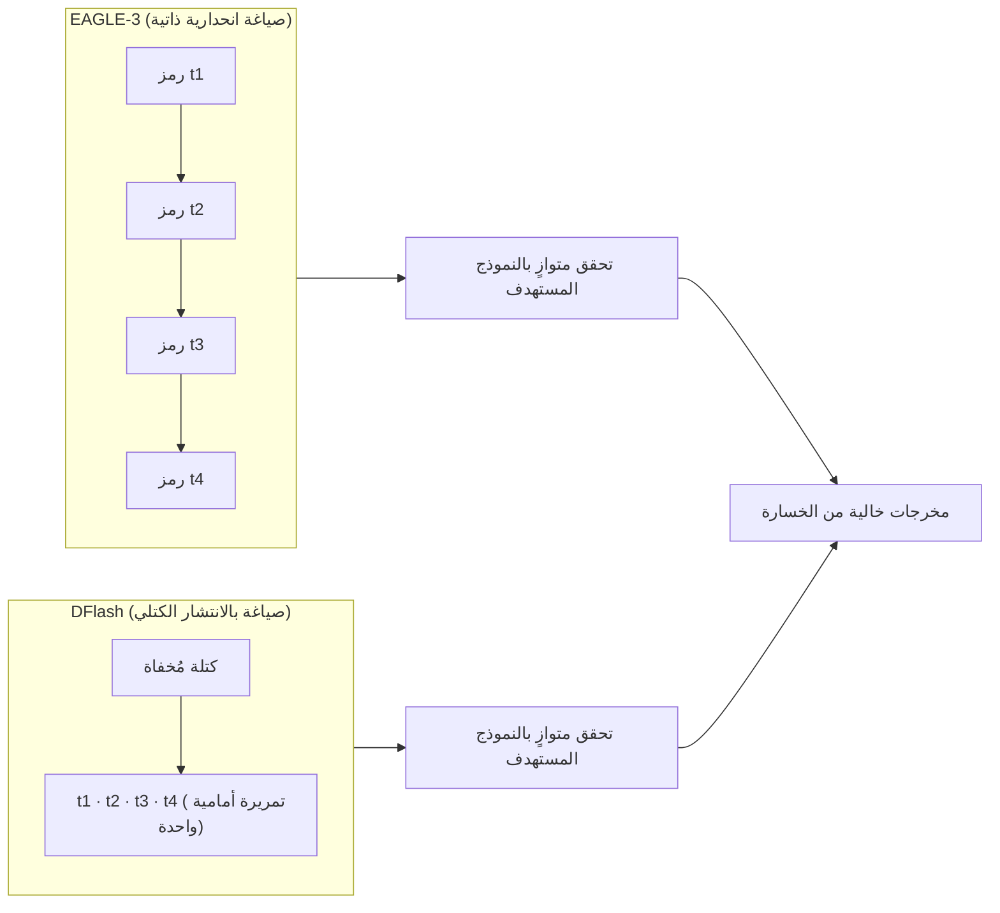

صورة تجسّد مفهوم DFlash: تحويل مرحلة الصياغة في الفك التخميني من نهج تسلسلي إلى نهج متوازي.

## نظرة عامة

في خدمة نماذج اللغة الكبيرة، يُحدَّد التكلفة وسرعة الاستجابة المحسوسة للمستخدم في آنٍ واحد من خلال إنتاجية فك التشفير. طالما أن النموذج يولّد الرموز واحداً تلو الآخر بالنهج الانحداري الذاتي (autoregressive)، فسيظل القيد البنيوي قائماً: يجب إجراء تمريرة كاملة عبر النموذج لكل رمز، بصرف النظر عن سرعة وحدة معالجة الرسومات. لقد أصبح الفك التخميني (speculative decoding) الأسلوب الأكثر عملية لتجاوز هذا الاختناق، غير أن المسودّات التقليدية أيضاً كانت تُولّد الرموز تسلسلياً، مما جعل معاملات التسريع تتوقف في الغالب عند نطاق 2-3×.

في 23 يونيو 2026، نشرت NVIDIA في مدونتها التقنية دراسة حول DFlash من باحثي جامعة كاليفورنيا سان دييغو. يُدخل DFlash نموذج انتشار كتلي (block diffusion) في مرحلة الصياغة من الفك التخميني، إذ يقترح الرموز المستقبلية ككتلة في تمريرة أمامية واحدة بدلاً من اقتراحها رمزاً رمزاً. وفقاً للأرقام المنشورة، يبلغ التسريع الخالي من الخسارة في التدفق المفرد ما يصل إلى 6×، فيما تصل الإنتاجية على NVIDIA Blackwell إلى 15× مقارنةً بنفس هدف الاستجابة.

والميزة التشغيلية الأكثر أهمية هي **التكامل المباشر (drop-in)**. يدعم DFlash كلاً من vLLM وSGLang وTensorRT-LLM؛ وفي vLLM يكفي استبدال إعداد الصياغة من EAGLE-3 بإعداد DFlash دون أي تعديل في كود التطبيق. تستعرض هذه المقالة آلية عمل DFlash، وما تكشفه المعايير المنشورة، والتداعيات من منظور ThakiCloud في تشغيل منصة AI/ML متعددة المستأجرين مبنية على Kubernetes. جميع الأرقام الواردة هنا هي قياسات رسمية منشورة من NVIDIA وUCSD، ونتناول موضوع إعادة الإنتاج على معداتنا الخاصة بصدق في القسم المناسب.

## ما هي هذه التقنية؟

ينقسم الفك التخميني إلى مرحلتين: يقترح نموذج مسودة صغير الرموز المستقبلية، ثم يتحقق النموذج المستهدف الكبير من هذه الرموز بالتوازي ويقبل الصيغة الصحيحة الأطول. إذا كانت المسودة صحيحة، تُؤكَّد رموز متعددة بتمريرة تحقق واحدة من النموذج المستهدف. المشكلة أن المسودّات التقليدية تعتمد النهج الانحداري الذاتي، فترتفع تكلفة الصياغة خطياً مع زيادة عدد الرموز التخمينية، مما يُصعّب رفع الإنتاجية أكثر.

يستبدل DFlash هذا المسودّ الانحداري بمسودّ انتشار كتلي خفيف. يُزيل نموذج الانتشار الكتلي التشويش عن كتلة رموز مُخفاة دفعةً واحدة، جامعاً بين التوليد المتوازي والبنية الكتلية الانحدارية. يُطبّق DFlash هذه الفكرة على مرحلة الصياغة فحسب، بينما يتولى النموذج المستهدف الانحداري الموثوق التحقق. هذا الفصل هو مفتاح الحفاظ على الجودة: كثيراً ما تفتقر نماذج الانتشار المنفردة إلى دقة النماذج الانحدارية وتتطلب مراحل إزالة تشويش متعددة، لكن في DFlash يكفي أن تكون المسودة "جيدة بما يكفي لتجتاز التحقق"، وتكفل تمريرة التحقق المتوازية من النموذج المستهدف التزام توزيع المخرجات بالنموذج المستهدف. أي أن العملية خالية من الخسارة (lossless).



الميزة الثانية تكمن في بنية تكلفة الصياغة. ترتفع تكلفة المسودّ الانحداري خطياً مع عدد الرموز التخمينية، بينما يُولّد مسودّ الانتشار جميع الرموز في تمريرة متوازية واحدة، فيظل تأخر الصياغة شبه ثابت بتوسع الكتلة. هذا يُتيح لـDFlash استخدام نماذج صياغة أعمق وأكثر تعبيراً دون زيادة التأخر. يستخدم DFlash فعلياً مسودّاً صغيراً بـ5 طبقات (8 طبقات في حالة Qwen3-Coder)، وهو تباين واضح مع أبحاث مسودّات الانتشار السابقة (DiffuSpec، SpecDiff-2) التي استخدمت مسودّات ضخمة بمليارات المعاملات فأبقت التسريع عند 3-4×.

التقنيات الثلاث التي يجمعها DFlash هي: أولاً **الصياغة بالانتشار الكتلي** للتنبؤ المتوازي بالرموز المستقبلية، وثانياً **التكييف بالحالات الخفية للنموذج المستهدف (target hidden-state conditioning)** لتمرير ميزات السياق من النموذج المستهدف إلى المسودّ عبر حقن KV، وثالثاً التدريب الصديق للتحقق لرفع معدل قبول الكتل المُسوَّدة. هذا المزيج يُحقق توازن "مسودّ صغير + اقتراح كتلي متوازٍ + تحقق خالٍ من الخسارة".

## التثبيت والتكامل

يُوزَّع DFlash مع نقاط التفتيش ودعم الأطر معاً، مما يجعل التبني يتطلب حداً أدنى من الكود. نقاط التفتيش العامة متاحة من مجموعة `z-lab/dflash` على Hugging Face، وفي وقت الإعلان تتضمن 20 نقطة تفتيش. في vLLM، يكفي استبدال إعداد EAGLE-3 بإعداد DFlash دون إعادة هيكلة التطبيق. المثال التالي من التوثيق الرسمي:

```bash
vllm serve Qwen/Qwen3.5-27B \
  --speculative-config '{"method": "dflash", "model": "z-lab/Qwen3.5-27B-DFlash", "num_speculative_tokens": 15}' \
  --attention-backend flash_attn \
  --max-num-batched-tokens 32768
```

المفتاح هو تحديد `"method": "dflash"` في `--speculative-config` مع تمرير مسار نقطة تفتيش المسودّ. تظل بنية الأعلام مطابقة تقريباً لما كان يُستخدم في خدمة EAGLE-3، مما يجعل التحويل مجرد استبدال نهج الفك التخميني في نشر vLLM القائم. يقبل SGLang وTensorRT-LLM بالمثل نقطة تفتيش مسودّ DFlash عبر واجهة API الخاصة بالفك التخميني.

يدعم خلفية Transformers سلسلتَي Qwen3 وLLaMA-3.1، ويوفر واجهة `spec_generate` تستدعي نموذج المسودّ والنموذج المستهدف معاً:

```python
from transformers import AutoModel, AutoModelForCausalLM, AutoTokenizer

draft = AutoModel.from_pretrained(
    "z-lab/Qwen3-8B-DFlash-b16", trust_remote_code=True,
    dtype="auto", device_map="cuda:0").eval()
target = AutoModelForCausalLM.from_pretrained(
    "Qwen/Qwen3-8B", dtype="auto", device_map="cuda:0").eval()
tokenizer = AutoTokenizer.from_pretrained("Qwen/Qwen3-8B")

messages = [{"role": "user", "content": "196의 양의 약수는 몇 개인가?"}]
input_ids = tokenizer.apply_chat_template(
    messages, return_tensors="pt", add_generation_prompt=True,
    enable_thinking=False).to(draft.device)

output = draft.spec_generate(
    input_ids=input_ids, max_new_tokens=2048, temperature=0.0, target=target)
```

كتل الكود أعلاه مستشهد بها من الأمثلة الرسمية الواردة في مدونة NVIDIA التقنية وMarkTechPost، وليست نتائج التقاط مباشر من بيئة ThakiCloud. قياسات إنتاجية DFlash أُجريت على بيئة NVIDIA Blackwell (DGX B300، 8 وحدات GPU)، ولا تتوفر في بيئة كتابة هذا المقال المُعجِّلات ونقاط التفتيش المطلوبة لإعادة إنتاج نفس الظروف. وبناءً على ذلك، فإن جميع النتائج المذكورة أدناه أرقام منشورة من مصادر موثّقة، ولا تشمل قياسات محققة ذاتياً.

## نتائج التجارب الفعلية (وفق الأرقام المنشورة)

تنقسم أرقام تسريع DFlash إلى فئتين تختلف طرق قياسهما، لذا ينبغي قراءتهما بتمييز:

أولاً، **التسريع الخالي من الخسارة في التدفق المفرد**. يُرجع بحث UCSD متوسط 4.86× لـQwen3-8B بالفك الجشع (Transformers backend)، وأعلى قيمة 6.08× على MATH-500. في نفس الظروف، يُحقق EAGLE-3 متوسط 1.76× بحجم شجرة 16، و2.02× بحجم 60. أرقام كل مهمة موضحة في الرسم البياني أدناه.


الرسم البياني أعلاه يُمثّل بيانياً الأرقام الرسمية من ورقة UCSD حول DFlash، وليس قياسات مباشرة من ThakiCloud. GSM8K: 5.15×، MATH-500: 6.08×، AIME25: 5.62×، HumanEval: 5.14×، LiveCodeBench: 5.51×، وهي قيم مرتفعة بشكل خاص في مهام الاستدلال الرياضي والبرمجي. في المقابل، تبلغ قيمة MT-Bench للمحادثات المفتوحة 2.75× فقط، وهو أمر متوقع لأن مكاسب الفك التخميني تتناسب مع إمكانية التنبؤ بالمخرجات (معدل القبول).

ثانياً، **الإنتاجية عند هدف استجابة ثابت**. الرقم 15× الذي تُرجعه NVIDIA يعني أن خدمة gpt-oss-120b عبر TensorRT-LLM على DGX B300 (8 وحدات Blackwell GPU) تُنتج إنتاجية أعلى بأكثر من 15× مقارنة بالفك التشفيري الانحداري، في النطاق الذي يتراوح فيه 500-600 رمز/ثانية للمستخدم. وفي نفس النقطة، يبلغ التسريع مقارنة بـEAGLE-3 نحو 1.5×. في اختبار Speed-Bench المنفصل من NVIDIA (تسريع الاستجابة عند نفس التزامن)، حقق gpt-oss-120b: DFlash 2.3× مقابل EAGLE-3 1.7×، وحقق Llama 3.1 8B Instruct: DFlash 2.8× مقابل EAGLE-3 2.2×. عبر المهام، تصل الأرقام إلى Gemma 4 31B: 5.8× (vLLM)، Qwen3 8B: 5.1× (SGLang).

خلاصة القول، "6×" هو تسريع خالٍ من الخسارة لطلب منفرد، أما "15×" فهو إنتاجية الخدمة عند تقييد عدد كبير من المستخدمين بنفس هدف الاستجابة. الرقمان يُجيبان على سؤالين مختلفين؛ لذا عند تقدير التأثير المتوقع في بيئة الإنتاج، حدد أولاً نسبة التزامن وهدف الاستجابة لديك ثم ارجع إلى الأرقام المقابلة لذلك النطاق.

## التداعيات على منصة ThakiCloud AI/ML SaaS على Kubernetes

تُشغّل ThakiCloud بنية تُجدول فيها GPU عبر Kueue على Kubernetes وتخدم نماذج مستأجرين متعددين عبر vLLM. DFlash نوع من التحسين يتناسب بشكل خاص مع هذه البنية، لثلاثة أسباب:

أولاً، **التكامل المباشر يُخفض مخاطر التشغيل**. إذا كنت تستخدم الفك التخميني مع EAGLE-3، يمكنك تبديل method ونقطة تفتيش المسودّ إلى DFlash والتحقق من النتائج بنشر كناري. بما أنها تقنية خالية من الخسارة لا تُغير عقد التطبيق (مخطط API، توزيع المخرجات)، تبقى الاستجابات المُدرَكة من المستأجرين متطابقة وتتحسن الإنتاجية والتأخر فقط. التحسينات التي لا تكسر اتساق المخرجات في SaaS متعدد المستأجرين نادرة القيمة.

ثانياً، **كفاءة GPU تساوي تكلفة الوحدة**. القدرة على معالجة طلبات متزامنة أكثر بنفس وحدة GPU وعند نفس مستوى الاستجابة تعني انخفاض تكلفة الخدمة لكل مستأجر. يتضاعف هذا التأثير في بيئات GPU يصعب فيها التوسع مثل GPU محلية أو في مناطق إقليمية. هذا يتوافق تماماً مع رسالة ThakiCloud المتعلقة بالخدمة الذاتية وكفاءة التكلفة. غير أن الـ15× من NVIDIA هو الحد الأعلى لمزيج Blackwell + TensorRT-LLM، وينبغي معايرة التوقعات وفق جيل GPU والخلفية لديك.

ثالثاً، **مكاسب أكبر في أحمال عمل الرياضيات والبرمجة**. عوامل الكود الداخلية وخطوط معالجة البيانات وأعباء عمل الوكلاء الغنية بالأدوات تُنتج مخرجات منظمة نسبياً تُحقق معدلات قبول عالية. المستأجرون الذين يخدمون هذه الأحمال بكثافة يُرجَّح أن يحققوا مكاسب DFlash فوق المتوسط. لما كانت ThakiCloud تستهدف منصة وكلاء متعددي المستأجرين، فإن تطبيق ملف تعريف خدمة DFlash أولاً على المستأجرين المتمحورين حول الكود والاستدلال استراتيجية تستحق الدراسة.

على صعيد خارطة طريق النضج، المسار الطبيعي هو الكشف عن نهج الفك التخميني في مخطط خدمة vLLM كملف تعريف لكل مستأجر، مع تشغيل حلقة قياس تكلفة في الخلفية لتتبع "هل انخفض سعر الرمز الواحد فعلاً بعد تطبيق DFlash؟" في الزمن الفعلي. مبدأ القياس لا الجزم ينطبق على تحسين الاستدلال بنفس القدر.

## القيود والاعتراضات

DFlash ليس الحل الشامل لكل شيء. أولاً، أقصى الأرقام المُرجَعة مقيّدة بأجهزة وخلفيات بعينها. الـ15× نتيجة مزيج Blackwell + TensorRT-LLM، وستنخفض عوامل التسريع مع GPU أقدم أو مكدسات خدمة مختلفة. الـ6× الخالية من الخسارة هي أيضاً للفك الجشع في تدفق مفرد؛ في أعباء عمل المحادثة عالية الحرارة أو المتنوعة، تنخفض معدلات القبول وتتضاءل المكاسب (2.75× لـMT-Bench يُوضح ذلك).

ثانياً، الفك التخميني نفسه يتطلب ذاكرة إضافية. يشغل نموذج المسودّ وذاكرة KV الخاصة به مساحة GPU، مما قد يُحدث مقايضة مع الحد الأقصى للتزامن في بيئات متعددة المستأجرين ذات الذاكرة الضيقة. صغر حجم المسودّ يُخفف هذا العبء لكنه لا يُلغيه.

ثالثاً، مسؤولية التحقق التشغيلي تقع على عاتق المُطبِّق. الأرقام المنشورة من مصادر موثّقة، لكن لا يوجد ضمان بإعادة إنتاجها على نموذجك وحركة مرورك ومستوى تزامنك. في هذا المقال لم نتمكن من إعادة الإنتاج في بيئة ThakiCloud، لذا قبل أي تبني فعلي ينبغي قياس تكلفة الرمز وتأخر p50/p99 مباشرةً عبر نشر كناري. أخيراً، مسودّات الانتشار الكتلي نهج جديد نسبياً قد لا تتوفر له نقاط تفتيش لجميع بنى النماذج، لذا تحقق أولاً من وجود نقطة تفتيش مسودّ مناسبة للنموذج المستهدف الذي تخدمه.

## المصادر

- [Boost Inference Performance up to 15x on NVIDIA Blackwell Using DFlash Speculative Decoding (NVIDIA Technical Blog, 2026-06-23)](https://developer.nvidia.com/blog/boost-inference-performance-up-to-15x-on-nvidia-blackwell-using-dflash-speculative-decoding)
- [DFlash Speculative Decoding Drafts Whole Token Blocks in Parallel (MarkTechPost, 2026-06-24)](https://www.marktechpost.com/2026/06/24/dflash-speculative-decoding-drafts-whole-token-blocks-in-parallel-for-up-to-15x-higher-throughput-on-nvidia-blackwell/)
- [مجموعة نقاط تفتيش DFlash العامة (Hugging Face, z-lab/dflash)](https://huggingface.co/collections/z-lab/dflash)
- [توثيق الفك التخميني في vLLM](https://docs.vllm.ai/en/latest/features/speculative_decoding/)
