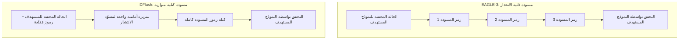

## نظرة عامة

أغلى مورد في خدمة نماذج اللغة الكبيرة هو وقت وحدة معالجة الرسومات، وأشد مراحل الاستدلال استنزافاً لهذا الوقت هي مرحلة فك الترميز التي تُخرج الرموز رمزاً بعد رمز في تسلسل صارم. يهاجم فك الترميز التخميني هذه الاختناقة مباشرةً: يقترح نموذج مسوّد صغير عدة رموز مسبقاً، ثم يتحقق نموذج مستهدف كبير من هذه الاقتراحات دفعةً واحدة، متجاوزاً بذلك قيد الإنتاج التسلسلي.

DFlash هو أحدث تنويع على هذا المبدأ، وقد لفت الأنظار عندما نشر حساب مشروع vLLM في الرابع والعشرين من يونيو إعلان فريق NVIDIA AI بدعم DFlash. الرسالة الجوهرية مباشرة: في vLLM، يكفي استبدال مسوّد EAGLE-3 بنقطة تفتيش DFlash للحصول على تسريع أكبر دون أي تغيير إضافي في الشفرة.

تشرح هذه المقالة ما يميز DFlash عن EAGLE-3، وكيفية تفعيله في vLLM، ولماذا يهم هذا الأسلوب منظمات مثل ThakiCloud التي تستضيف النماذج على بنيتها التحتية الخاصة. تُستشهد بأرقام الأداء من إعلانات NVIDIA وRed Hat مع الإشارة الصريحة إلى المصدر، وتُوسم الأرقام التي لم نعيد إنتاجها بوضوح.

## ما هو DFlash

يتوقف أداء فك الترميز التخميني على عاملين: عدد الرموز التي يقترحها المسوّد دفعةً واحدة (طول المسودة)، ومعدل قبول هذه الاقتراحات من قِبَل النموذج المستهدف (معدل القبول). تعمل عائلة EAGLE بأن يستقبل المسوّد الحالة المخفية للنموذج المستهدف ثم يُنتج الرموز التالية بصورة ذاتية الانحدار، رمزاً في كل مرة. دقيقة في تنبؤاتها، لكنها تُنتج المسودة عبر تمريرات أمامية متعددة وصغيرة.

يغيّر DFlash هذا المنطق: مسوّد الانتشار الصغير يُنتج كتلة الرموز كاملةً في تمريرة أمامية واحدة. يستقبل الحالة المخفية للنموذج المستهدف شرطاً، لكنه يستخدم قناع انتباه غير سببي (non-causal) بدلاً من القناع السببي (causal) الذي يعتمده EAGLE-3، مما يجعل كل استعلام ينظر في آنٍ واحد إلى الحالات المخفية للمُتحقق وإلى تضمينات الرموز المُقنَّعة. النتيجة: توليد رموز المسودة ضمن الكتلة كلها في آنٍ واحد.

هذا النهج الكتلي المتوازي هو جوهر الفكرة. إزالة الاعتماد التسلسلي في المسودة يتيح وفق تفسير NVIDIA وvLLM تسريعاً يبلغ 2-3 أضعاف مقارنةً بـ EAGLE-3 في الطلبات المتزامنة (synchronous). يمكن إطالة كتلة المسودة دون رفع تأخير توليد المسودة نفسها، مما يجعل البنية أكثر وفاءً بالهدف الأصلي لفك الترميز التخميني: اقتراح رموز كثيرة في وقت قصير.

يوضح المخطط التالي الفرق بين الأسلوبين على نحو مبسّط:



## تفعيل DFlash في vLLM

بوابة دمج DFlash مع vLLM هي مكتبة Speculators، المكتبة الرسمية لـ vLLM المخصصة لبناء خوارزميات فك الترميز التخميني وتقييمها وتخزينها. تتولى هذه المكتبة ربط المسوّد بمسار استدلال النموذج المستهدف من خلال الحالات المخفية. وفق مدونة مطوري Red Hat، أضافت Speculators v0.5.0 دعم DFlash والتدريب الإضافي أثناء الخدمة (online training).

النقطة العملية الأساسية هي أن الأمر لا يعدو استبدال نقطة التفتيش. تُفيد NVIDIA بأن إحلال نقطة تفتيش DFlash محل EAGLE-3 في vLLM لا يستلزم تغيير شفرة خارج الإعداد. ضمن أساليب فك الترميز التخميني التي يدعمها vLLM توجد بالفعل: n-gram وsuffix وEAGLE وDFlash.

يُفعَّل فك الترميز التخميني في vLLM عبر `--speculative-config` (أو المعامل المكافئ في Python). الشكل العام لتحديد نقطة تفتيش DFlash كمسوّد هو كالآتي؛ نقطة التفتيش مخزّنة بتنسيق Speculators فيتعرف vLLM على نوع الخوارزمية تلقائياً:

```bash
# خدمة نموذج مستهدف مع مسوّد DFlash (شكل تمثيلي)
# تحقق من معرّف المستودع الدقيق في مجموعة RedHatAI / NVIDIA speculator على HF
vllm serve <target-model> \
  --speculative-config '{"model": "<dflash-speculator-checkpoint>", "num_speculative_tokens": 8}'
```

عند الدخول في التدريب أو بناء نقاط تفتيش مخصصة، تعرض Speculators معاملات خاصة بـ DFlash منها: `--speculator-type dflash` و`--draft-vocab-size` و`--block-size` و`--max-anchors` و`--num-layers` و`--target-layer-ids`. حجم الكتلة (`--block-size`) هو المفتاح الرئيسي الذي يحدد عدد الرموز المقترحة في كل تمريرة.

أعلنت NVIDIA عن إتاحة 20 نقطة تفتيش DFlash على Hugging Face مرفقاً بها وصفات لمعالجات Blackwell وHopper على حد سواء. بمعنى آخر: يمكن تنزيل مسوّد مدرَّب مسبقاً وتوصيله بـ vLLM مباشرةً، مع إمكانية التدريب الإضافي على بيانات المجال الخاص إن دعت الحاجة.

> ملاحظة: أمثلة الإعداد في هذه المقالة هي أشكال تمثيلية مبنية على مخطط `--speculative-config` في vLLM. راجع وثائق vLLM Speculators الرسمية للاطلاع على معرّفات المستودعات الدقيقة وأحدث أسماء المعاملات. لم نُعِد إنتاج الأرقام التالية في بيئتنا (Apple Silicon / MPS) نظراً لاعتماديات Blackwell وHopper، وجميع الأرقام أدناه هي قيم معلنة.

## أرقام الأداء المُعلنة

نُصرّح ابتداءً بأن هذه أرقام أعلنتها NVIDIA وvLLM وليست قيماً أعدنا قياسها.

- عند خدمة gpt-oss-120b على NVIDIA Blackwell، بلغ تحسّن أداء الاستدلال حتى 15 ضعفاً عند مستوى تفاعلية (interactivity) مكافئ. [وفق NVIDIA]
- في حالة Llama 3.1 8B، ارتفعت التفاعلية إلى ما يقارب الضعفين مقارنةً بأحدث إصدار من فك الترميز التخميني EAGLE-3 عند التزامن ذاته. [وفق NVIDIA]
- قُدِّر التسريع الإجمالي مقارنةً بـ EAGLE-3 في الطلبات المتزامنة بـ 2-3 أضعاف. [وفق vLLM]

رقم "15 ضعفاً" هو قيمة قصوى قيست على نموذج بعينه (gpt-oss-120b) وعتاد بعينه (Blackwell) وظروف تشغيل بعينها (تفاعلية ثابتة). يتقلص الكسب مع صغر حجم النموذج أو اختلاف العتاد أو ارتفاع التزامن. عدد "ما يقارب الضعفين" المحافظ المُعلن لـ Llama 3.1 8B يؤكد هذه النقطة. قراءة عنوان التسويق وحده وتوقع 15 ضعفاً لكل حمل عمل ستؤدي إلى تقديرات مضلّلة.

## انعكاسات على منصة ThakiCloud AI/ML SaaS على Kubernetes

تدير ThakiCloud منصة AI/ML متعددة المستأجرين تعمل على Kubernetes وتُجدوِل موارد GPU باستخدام Kueue وتخدم النماذج عبر vLLM. فك الترميز التخميني هو التحسين الذي يلامس تكلفة التشغيل مباشرةً أكثر من غيره ضمن هذه البنية: استخراج رموز أكثر من GPU ذاته يخفض التكلفة لكل مستأجر أو يرفع التزامن المتاح بالميزانية نفسها.

ثمة ثلاثة أسباب تجعل DFlash جذاباً من منظور ThakiCloud.

**أولاً: تكلفة التبني منخفضة.** من كان يستخدم vLLM وSpeculators ويشغّل مسوّد EAGLE-3 بالفعل، فإن التحوّل إلى DFlash يقتصر عملياً على استبدال نقطة التفتيش وتعديل الإعداد. لا حاجة لاستبدال مكدّس الخدمة. في بيئة Kubernetes تبدو المقاربة الطبيعية هي رفع نشر (deployment) جديد يحمل صورة الحاوية بنقطة تفتيش المسوّد وقيمة `--speculative-config` المحدّثة، والتحقق منه بأسلوب الكناري.

**ثانياً: البنية الكتلية المتوازية تتألق في أحمال العمل التفاعلية.** في أحمال مساعدات الكتابة البرمجية والمحادثة وحلقات الوكلاء حيث يحدد التأخير (latency) تجربة المستخدم مباشرةً، فإن التسريع بالتفاعلية الثابتة يترجم إلى تدني ملموس في P50/P99. في البيئة متعددة المستأجرين، ارتفاع إنتاجية رموز أحد المستأجرين يُفرز مرونة GPU لخدمة الآخرين.

**ثالثاً: ينسجم تماماً مع ميزتنا في الاستضافة الداخلية وكفاءة التكلفة.** العملاء ذوو متطلبات الأمان المرتفعة يريدون إبقاء النماذج داخل بنيتهم التحتية. تخفيض تكلفة الرمز الواحد بفك الترميز التخميني يقوّي الحجة بأن الخدمة الداخلية قابلة للتطبيق اقتصادياً دون الاعتماد على واجهات برمجية سحابية. توافر وصفات DFlash لمعالجات Hopper بالإضافة إلى Blackwell يعني إمكانية التطبيق في بيئات داخلية لا تمتلك أحدث جيل من العتاد.

لكن لا بد من خطوة قياس الحمل الفعلي قبل التطبيق. الـ 15 ضعفاً المُعلنة هي أرقام NVIDIA وليست أرقامنا. الخطوة المسؤولة هي قياس معدل القبول والتسريع الفعليين بتوزيع حمل العمل الخاص بـ ThakiCloud (أحجام النماذج الشائعة وأنماط التزامن) في اختبار كناري، ثم تحديث نموذج تسعير المستأجرين استناداً إلى تلك النتائج.

## القيود والاعتراضات

DFlash ليس حلاً شاملاً. ثمة نقاط ضعف واضحة يجب أخذها في الحسبان.

كسب فك الترميز التخميني حسّاس للتزامن. في ظروف الحمل المرتفع عندما تكون الدُفعات ممتلئة، تكون وحدة GPU مشغولة باستيعاب العمليات الحسابية للتحقق وحدها، فلا تُستغل إمكانية التوازي الإضافية التي يولّدها المسوّد بالكامل. اشتراط "التفاعلية الثابتة" أو "التزامن الثابت" في الأرقام المُعلنة يعكس هذا تحديداً؛ لا ينبغي قراءتها باعتبارها تحسيناً غير مشروط في الإنتاجية الكلية.

الاعتماد على جودة المسوّد عامل حاسم أيضاً. إذا لم يُقرّب مسوّد الانتشار توزيع النموذج المستهدف بدقة كافية، انخفض معدل القبول وأكلت تكلفة إعادة رسم الرموز المرفوضة الكسبَ. كلما كان المجال أكثر تخصصاً، كلما احتمل انخفاض معدل قبول نقطة التفتيش العامة المدرّبة مسبقاً، مما قد يستلزم تدريباً إضافياً على البيانات الخاصة.

نضج المنظومة متغير آخر. DFlash أسلوب حديث العهد، ودعمه أُضيف حديثاً في Speculators v0.5.0. نقاط التفتيش المتاحة لا تغطي بالضرورة جميع النماذج التي تخدمها البيئات المختلفة، وارتباط جانب كبير من التسريع بـ Blackwell يرفع درجة الاعتماد على العتاد. يستلزم التطبيق الإنتاجي الموثوق مزيداً من التحقق في البيئة الفعلية وتراكم الخبرة التشغيلية.

مع ذلك، الاتجاه واضح: فك الترميز التخميني لم يعد تحسيناً اختيارياً بل تحوّل إلى طبقة أساسية في خدمة نماذج اللغة الكبيرة، وDFlash يرفع سقف المنافسة في هذه الطبقة. المنظمات التي تشغّل vLLM وSpeculators لديها ما يكفي من الأسباب لتجربته بتكلفة محدودة. [تفسير تقديري]

## المصادر

- [Boost Inference Performance up to 15x on NVIDIA Blackwell Using DFlash Speculative Decoding - NVIDIA Technical Blog](https://developer.nvidia.com/blog/boost-inference-performance-up-to-15x-on-nvidia-blackwell-using-dflash-speculative-decoding)
- [Dflash - Speculators Docs (vLLM)](https://docs.vllm.ai/projects/speculators/en/latest/user_guide/algorithms/dflash/)
- [Speculators v0.5.0: DFlash support and online training - Red Hat Developer](https://developers.redhat.com/articles/2026/06/04/speculators-v050-dflash-support-and-online-training)
- [Speculative Decoding - vLLM Documentation](https://docs.vllm.ai/en/stable/features/speculative_decoding/)
- [vllm-project/speculators - GitHub](https://github.com/vllm-project/speculators)
