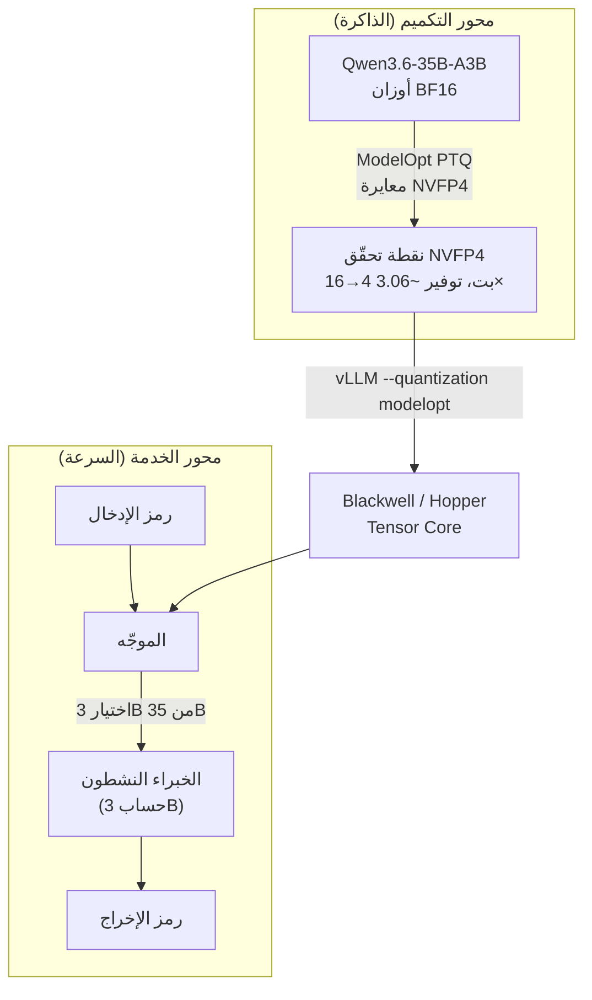

بالنسبة لأي فريق يحاول خدمة النماذج الكبيرة على بنيته التحتية الخاصة، فإن أكبر عائق هو ذاكرة GPU. إن وضع نموذج أكبر على نفس وحدة GPU، أو نفس النموذج على وحدة GPU أرخص، ينعكس مباشرة على تكلفة الخدمة. النموذج `nvidia/Qwen3.6-35B-A3B-NVFP4` الذي نشرته NVIDIA على Hugging Face في 28 مايو 2026 هو محاولة لخفض هذا العائق عبر التكميم بأربع بتات. كل رقم في هذه المقالة هو قياس رسمي من بطاقة نموذج NVIDIA، أما إمكانية إعادة إنتاجه على عتاد ThakiCloud الخاص فنتناولها بصدق في قسم منفصل.

## نظرة عامة

`nvidia/Qwen3.6-35B-A3B-NVFP4` هو نموذج `Qwen/Qwen3.6-35B-A3B` من Alibaba بعد تكميمه باستخدام NVIDIA Model Optimizer (ModelOpt). النموذج الأساسي بنية خليط الخبراء (MoE) بإجمالي 35B معامل و3B فقط نشطة، وطول سياق يصل إلى 262K، ورخصة Apache-2.0 تتيح الاستخدام التجاري وغير التجاري. وتوضّح NVIDIA صراحةً في بطاقة النموذج أن هذا ليس نموذجاً أساسياً من بناء NVIDIA بل نسخة مكمَّمة من نموذج طرف ثالث.

تتلخّص القيمة الجوهرية في فكرتين. **بنية MoE تتكفّل بالسرعة، وتكميم NVFP4 يتكفّل بالذاكرة.** بفضل بنية MoE، فإن توليد رمز واحد يشغّل فقط 3B من الخبراء النشطين بدلاً من كامل الـ35B، فيعمل نموذج 35B بحِمل حسابي قريب من نموذج كثيف بحجم 3B. أضف إلى ذلك تكميم NVFP4 الذي يخفض الأوزان من 16 بت إلى 4 بت، فتنخفض متطلبات القرص وذاكرة GPU بنحو 3.06 ضعف وفق بطاقة النموذج. هذا المزيج يشغّل "ذكاء بمستوى 35B بسرعة 3B وبذاكرة أقل بكثير."

تدير ThakiCloud منصة SaaS متعددة المستأجرين للذكاء الاصطناعي والتعلم الآلي مبنية على Kubernetes، وتخدم النماذج عبر بيئات عملاء متنوعة. القدرة على أخذ نقطة تحقّق مكمَّمة مسبقاً وتحميلها مباشرة في vLLM تعني خفض تكلفة الخدمة دون إعادة تشغيل خط تكميم في كل مرة. وفي الواقع، تشغّل ThakiCloud بالفعل خط أنابيب داخلياً يكمّم العائلة نفسها Qwen3-MoE إلى NVFP4، ونشارك هذه التجربة لاحقاً في المقالة.

## ما هذه التقنية

NVFP4 صيغة فاصلة عائمة بأربع بتات عرّفتها NVIDIA. وهي لا تسحق كل قيمة إلى 4 بتات ببساطة، بل تطبّق التكميم تحديداً على **أوزان وتنشيطات** المعاملات الخطية داخل كتل محوّل MoE. ونقتبس من بطاقة النموذج مباشرةً: "تم الحصول على هذا النموذج بتكميم أوزان Qwen3.6-35B-A3B إلى صيغة بيانات NVFP4. تُكمَّم فقط أوزان وتنشيطات المعاملات الخطية داخل كتل المحوّل في MoE. يخفض هذا التحسين عدد البتات لكل معامل من 16 إلى 4، ما يقلّل حجم القرص ومتطلبات ذاكرة GPU بنحو 3.06 ضعف."

المفتاح هو إدراك أن MoE والتكميم يعملان على محورين مختلفين. ويوضّح المخطط أدناه كلا المحورين.



على محور التكميم، تُحوَّل أوزان BF16 إلى نقطة تحقّق NVFP4 عبر التكميم بعد التدريب (PTQ) في ModelOpt. وعلى محور الخدمة، يختار الموجّه لكل رمز إدخال مجموعة فرعية فقط من خبراء الـ35B ويجري نحو 3B من الحساب. يلتقي المحوران عند عملية Tensor Core فوق vLLM، وهنا بالضبط تظهر تبعية NVFP4 للعتاد. تُسرَّع عمليات NVFP4 فقط على معماريتي NVIDIA Hopper وBlackwell. وتُدرج بطاقة النموذج NVIDIA GB300 كعتاد اختبار.

سرّ تقليل فقدان الدقة هو التكميم "بانتقائية لا شمولية." تُترك المسارات الحساسة بما فيها الانتباه دون مساس، ويتركّز الجهد على الأوزان الخطية لـMoE التي تستهلك أكبر قدر من الذاكرة، فيبقى توفير الذاكرة كبيراً ويبقى تدهور الجودة صغيراً.

## التثبيت والتكامل

أمر الخدمة الأساسي في vLLM الذي توفّره NVIDIA في بطاقة النموذج أدناه. تشغّل صورة دوكر `vllm/vllm-openai:nightly` ثم تنفّذه.

```sh
vllm serve nvidia/Qwen3.6-35B-A3B-NVFP4 \
  --port 8000 \
  --quantization modelopt \
  --max-model-len 262144 \
  --reasoning-parser qwen3
```

الراية `--quantization modelopt` هي ما يجعل المحرّك يتعرّف على نقطة تحقّق NVFP4. إذا كانت ذاكرة GPU ضيقة، فإن خفض `--max-model-len` أولاً ثم رفعه تدريجياً نهج آمن، لأن الحفاظ على كامل سياق 262K يتطلّب ذاكرة كبيرة لمخبأ KV.

للبيئات محدودة الذاكرة مثل NVIDIA DGX Spark، توفّر بطاقة النموذج أمراً موصى به منفصلاً.

```sh
vllm serve nvidia/Qwen3.6-35B-A3B-NVFP4 \
  --host 0.0.0.0 \
  --port 8000 \
  --tensor-parallel-size 1 \
  --trust-remote-code \
  --kv-cache-dtype fp8 \
  --attention-backend flashinfer \
  --moe-backend marlin \
  --gpu-memory-utilization 0.4 \
  --max-model-len 262144 \
  --max-num-seqs 4 \
  --max-num-batched-tokens 8192 \
  --enable-chunked-prefill \
  --async-scheduling \
  --enable-prefix-caching \
  --speculative-config '{"method":"mtp","num_speculative_tokens":3,"moe_backend":"triton"}' \
  --load-format fastsafetensors \
  --reasoning-parser qwen3 \
  --tool-call-parser qwen3_xml \
  --enable-auto-tool-choice
```

يحتوي هذا الأمر على عدة خيارات مفيدة تشغيلياً. تُصغّر `--kv-cache-dtype fp8` حتى مخبأ KV إلى 8 بت، وتُبقي `--gpu-memory-utilization 0.4` بصمة الذاكرة منخفضة، وتفعّل `--speculative-config` الفك التخميني القائم على MTP (التنبؤ متعدد الرموز). وتجعل `--tool-call-parser qwen3_xml` و`--enable-auto-tool-choice` استدعاء الأدوات قابلاً للاستخدام فوراً في سيناريوهات الوكلاء وRAG. وحالة الاستخدام التي تذكرها NVIDIA هي بالضبط "المطوّرون الباحثون عن نماذج جاهزة مكمَّمة مسبقاً للنشر في أنظمة وكلاء الذكاء الاصطناعي وروبوتات المحادثة وأنظمة RAG"، وتعكس مجموعة الخيارات هذه ذلك الغرض مباشرةً.

## نتائج تجريبية حقيقية

دعوني أوضّح أمراً بصدق منذ البداية. تُسرَّع عمليات NVFP4 فقط على Tensor Core من Blackwell/Hopper، لذا لم تتمكّن بيئة Apple Silicon المستخدمة في كتابة هذه المقالة من إعادة إنتاج الاستدلال مباشرةً. لذلك فإن الأرقام أدناه هي **نتائج التقييم الرسمية من NVIDIA المنشورة في بطاقة النموذج**، ولم تُختلق أي أرقام قياس ذاتية.

قارنت NVIDIA النسخة المكمَّمة NVFP4 بالنموذج الأساسي `Qwen3.6-35B-A3B` (BF16) على معايير الاستدلال النصي والبرمجة.

| المعيار | BF16 (الأساس) | NVFP4 | Δ |
|---|---|---|---|
| MMLU Pro | 85.6 | 85.0 | -0.6 |
| GPQA Diamond | 84.9 | 84.8 | -0.1 |
| τ²-Bench Telecom | 95.5 | 94.7 | -0.8 |
| SciCode | 40.8 | 40.6 | -0.2 |
| AIME 2025 | 89.2 | 88.8 | -0.4 |
| AA-LCR | 62.0 | 62.0 | 0.0 |
| IFBench | 62.3 | 62.8 | +0.5 |
| MMMU PRO | 74.1 | 74.5 | +0.4 |


تمثيل بصري للأرقام المنشورة في بطاقة النموذج (تسميات المحاور بالكورية). حتى بعد التكميم بأربع بتات، تبقى معظم فروق الدقة دون نقطة واحدة.

مفتاح قراءة الجدول هو حجم الخسارة. أكبر انخفاض عبر المعايير الثمانية هو -0.8 على τ²-Bench Telecom، أما GPQA Diamond فهو -0.1، وAA-LCR متعادل. بل إن IFBench وMMMU PRO يتقدّم فيهما NVFP4 قليلاً على BF16. حدث التحوّل الطفيف في التوزيع الناتج عن التكميم بشكل مواتٍ في بعض المهام مصادفةً، لكن لا ينبغي تعميم ذلك إلى "التكميم يحسّن الأداء." إجمالاً، رسالة الجدول أن خفض 16 بت إلى الربع عند 4 بتات حافظ على قدرات الاستدلال والرياضيات والبرمجة واستخدام أدوات الوكلاء بشكل شبه كامل. وكانت شروط التقييم لـSciCode عند temperature=0.6 وtop_p=0.95 وبحد أقصى 131072 رمزاً، والبقية عند temperature=1.0 وtop_p=0.95 وبحد أقصى 131072 رمزاً.

أما من ناحية الذاكرة، فتذكر بطاقة النموذج توفيراً بنحو 3.06 ضعف. ووفق مستودع Hugging Face، يُبلَّغ عن حجم المعاملات المحزومة لنقطة تحقّق NVFP4 بنحو 18.7B، وهو شكل مخفّض كثيراً للنموذج 35B مقارنةً بـ BF16 الأصلي. ويجب التحقق من حجم الملف الدقيق مباشرةً في الشريط الجانبي للمستودع، وتحذّر بطاقة النموذج من الخلط بين إحصاءات ملفات الشريط الجانبي ومعاملات بنية النموذج الأساسي.

## التطبيق والدلالات لمنصة ThakiCloud للذكاء الاصطناعي والتعلم الآلي على Kubernetes

من منظور منصة ThakiCloud، جاذبية هذا النموذج واضحة. في بيئة متعددة المستأجرين، تكون GPU أغلى مورد مشترك، وكلما تمكّنّا من تحميل مزيد من نماذج المستأجرين على نفس GPU في آنٍ واحد، انخفضت تكلفة الاستدلال للوحدة. خفض NVFP4 للذاكرة بنحو 3.06 ضعف يعني، بصيغة مبسّطة، مساحة لاستيعاب نموذج أكبر أو جلسات متزامنة أكثر في نفس ذاكرة GPU. أضف خاصية MoE المتمثّلة في تشغيل MoE بحجم 35B بحساب نحو 3B، فتصبح قيمة "نماذج عالية الجودة بتكلفة خدمة منخفضة" المحلية أكثر تجسيداً بكثير.

تعكس ThakiCloud هذا بالفعل في التشغيل. نحافظ على خط أنابيب داخلي يكمّم `Qwen/Qwen3-30B-A3B`، من عائلة Qwen3-MoE نفسها، إلى NVFP4 (W4A4، group_size=16) على RunPod B200 (Blackwell SM100). وفي تشغيل تحقّق في 1 مايو 2026، **أنتج نقطة تحقّق بحجم 17.1GB بـ137 ثانية من حساب PTQ.** بلغ إجمالي الوقت الفعلي نحو 25 دقيقة، والتكلفة نحو 3.48 دولار على B200 عند الطلب. يترتّب على هذه التجربة أمران. أولاً، تكميم NVFP4 نفسه مهمة لمرة واحدة تنتهي في وقت قصير بتكلفة منخفضة. ثانياً، عند نشر نقطة تحقّق مكمَّمة مسبقاً كما فعلت NVIDIA هنا، يمكنك تخطّي حتى تلك المهمة لمرة واحدة والانتقال مباشرةً إلى الخدمة. بعبارة أخرى، نقطة تحقّق NVIDIA العامة مدخل أشمل لخط أنابيبنا.

أما من ناحية تشغيل K8s، فيتوافق كما يلي. تُصفّ أحمال GPU وتُجدول عبر Kueue، وتُشغّل الخدمة كحُجيرات vLLM مع الراية `--quantization modelopt` للتعرّف على نقطة تحقّق NVFP4، ويُعالَج عزل المستأجرين بمساحات الأسماء وتقسيم GPU، مع تعديل التخصيص لكل مستأجر بقدر الذاكرة الموفَّرة. لكن يرافق ذلك شرط عتاد واحد. تسريع NVFP4 يعمل فقط على Blackwell وHopper، لذا لا يمكن لمجمّعات العقد القائمة على A100 التمتّع بفائدة الأربع بتات لهذا النموذج كما هي. وهذا قرار تشغيلي مرتبط مباشرةً بتكوين مجمّع العقد، ونشير إليه كقيد في القسم التالي.

## القيود والحجج المضادة

أولاً، **تبعية العتاد قوية.** توجد نوى Tensor Core الخاصة بـNVFP4 فقط على Blackwell وHopper. على وحدات GPU من الأجيال السابقة مثل A100 أو V100، لا يُسرَّع NVFP4، فلا يمكن توقّع نفس توفير الذاكرة ويجب سلوك مسار آخر مثل INT8 أو FP8. وإذا كانت أصول GPU الحالية لعميل محلي من جيل سابق، فإن جني فائدة هذا النموذج يستلزم تكلفة إضافية لاستبدال العقد.

ثانياً، **توفير الذاكرة ومكاسب الإنتاجية أمران مختلفان.** تذكر بطاقة النموذج توفيراً للقرص والذاكرة بنحو 3.06 ضعف، لكنها لا تقدّم مباشرةً أرقام إنتاجية مثل الرموز/الثانية أو زمن الاستجابة. ومع أن الأوزان بأربع بتات تساعد عادةً في فك التشفير بتخفيف ضغط عرض النطاق للذاكرة، فإن الإنتاجية الفعلية تعتمد على حجم الدفعة وطول السياق وإعدادات مخبأ KV. والجزم بأنه "أسرع بـN ضعفاً" دون معيار خدمة خاص بـThakiCloud سيكون غير دقيق. وإلى أن نقيسه مباشرةً في بيئتنا، يكون الاعتماد على جدول الدقة وحده أكثر أماناً.

ثالثاً، **يرث التكميم قيود النموذج الأساسي كما هي.** كما تذكر بطاقة النموذج مباشرةً، دُرّب النموذج الأساسي على بيانات مسحوبة من الإنترنت تحتوي على لغة سامّة وتحيّزات مجتمعية، وقد يولّد إجابات غير دقيقة أو يحذف معلومات أساسية أو ينتج نصاً غير ذي صلة. التكميم يحسّن الذاكرة والسرعة فقط، ولا يحلّ مشكلات الأمان والدقة هذه. ولا تزال الخدمة متعددة المستأجرين تتطلّب ترشيحاً ومراقبةً منفصلين للمخرجات.

رابعاً، **فقدان الدقة لا يتقارب إلى الصفر.** رغم أن معظم المعايير تُظهر خسارة دون نقطة واحدة، فإن السيناريوهات التي يكون فيها استخدام أدوات الوكلاء والالتزام بالسياسات محورياً، مثل -0.8 في τ²-Bench Telecom، تُظهر خسارة أكبر نسبياً. وفي مجالات مثل المالية والرعاية الصحية حيث تنعكس فروق الدقة الصغيرة مباشرةً على التكلفة، تحتاج إلى سياسة توازن بين اقتصاديات توفير الأربع بتات وفقدان الدقة لكل مستأجر، وتختار بين BF16 وFP8 وNVFP4.

إجمالاً، `nvidia/Qwen3.6-35B-A3B-NVFP4` خيار عملي للغاية للفرق التي تمتلك بنية تحتية قائمة على Blackwell/Hopper لـ"خفض الذاكرة إلى الربع تقريباً دون خسارة تُذكر." لكن هذه الفائدة لا تصمد إلا فوق شرط العتاد والتحقق من الدقة الخاص بكل مجال، وتعتزم ThakiCloud تأكيد الإنتاجية وملاءمة كل مستأجر بمعيار خدمة خاص بها قبل عكسه في سياسة مجمّع العقد.

## المصادر

- بطاقة النموذج: [nvidia/Qwen3.6-35B-A3B-NVFP4 · Hugging Face](https://huggingface.co/nvidia/Qwen3.6-35B-A3B-NVFP4)
- النموذج الأساسي: [Qwen/Qwen3.6-35B-A3B · Hugging Face](https://huggingface.co/Qwen/Qwen3.6-35B-A3B)
- أداة التكميم: [NVIDIA Model Optimizer (GitHub)](https://github.com/NVIDIA/Model-Optimizer)
- محرّك الاستدلال: [vLLM (GitHub)](https://github.com/vllm-project/vllm)
