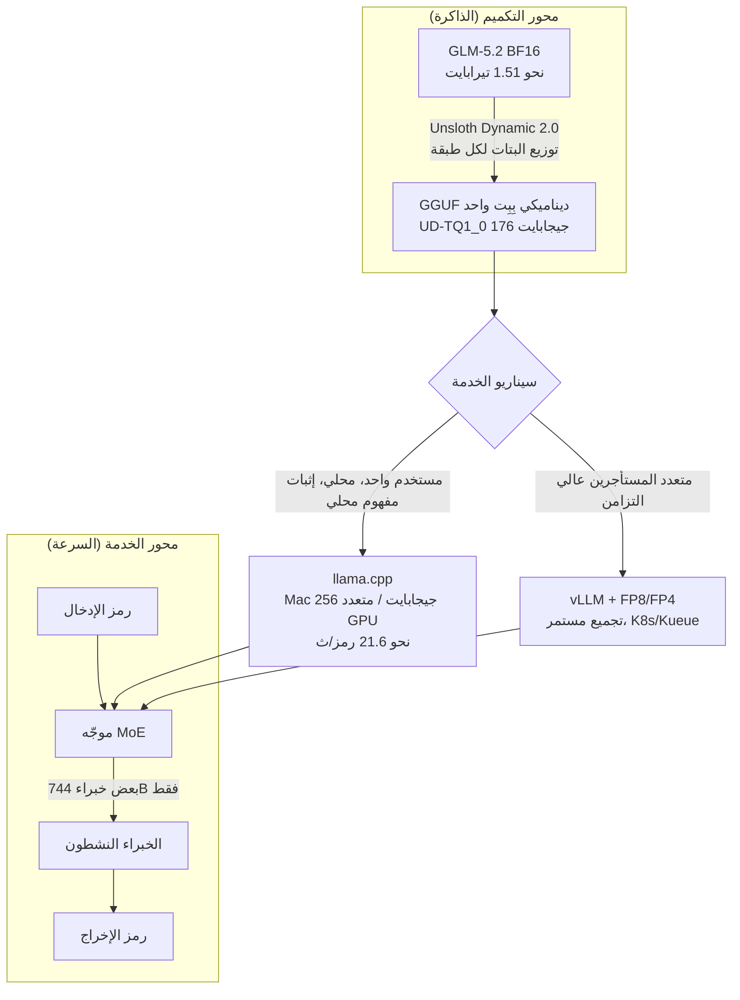

أول جدار يصطدم به أي فريق يخدم نموذجًا كبيرًا على بنيته الخاصة هو الذاكرة دائمًا. استدعاء نموذج رائد عبر واجهة برمجية خارجية يُخرج بياناتك من الشركة، واستضافته داخليًا تعني وضع مئات الجيجابايت — وغالبًا أكثر من تيرابايت — من الأوزان في مكانٍ ما. يمثّل `unsloth/GLM-5.2-GGUF` الذي أصدره Unsloth في يونيو 2026 دراسة حالة لخفض هذا الجدار عبر التكميم. فهو يأخذ GLM-5.2، وهو نموذج MoE مفتوح بنحو 744 مليار معامل، ويضغط أوزانه البالغة 1.51 تيرابايت بدقة BF16 إلى 176 جيجابايت عبر GGUF ديناميكي بِبِت واحد. كل رقم في هذه المقالة هو رقم منشور من Unsloth أو Hugging Face. لا يمكن استضافة نموذج 744B في بيئة التحليل هذه، لذا بدلًا من إعادة إنتاج القياسات ذاتيًا نستشهد بالأرقام العامة ونوضّح حدودها بصراحة.

## نظرة عامة

‏GLM-5.2 نموذج لغوي كبير مفتوح الأوزان من Z.ai (Zhipu). وهو نموذج Mixture-of-Experts (MoE) بنحو 744 مليار معامل إجمالي مع نافذة سياق تصل إلى مليون رمز. ووفق وثائق Unsloth وتقارير متعددة، يسجّل نتائج موازية لـ Claude 4.8 Opus و GPT-5.5 و Gemini 3.1 Pro عبر القياسات المجمّعة بما فيها Artificial Analysis — ولهذا يوصَف بأنه أقوى نموذج مفتوح حتى الآن.

المشكلة هي الحجم. نقطة التحقق الأصلية بدقة BF16 تبلغ نحو 1.51 تيرابايت، يصعب وضعها على خادم واحد. ما فعله Unsloth هو تكميم هذه الأوزان بطريقة Dynamic 2.0 GGUF، منتجًا نسخًا من بِت واحد حتى أربعة بتات. وتنزل نسخة البِت الواحد إلى 176 جيجابايت — صغيرة بما يكفي لتحميلها على جهاز Mac Studio واحد بذاكرة موحّدة سعتها 256 جيجابايت، أو صندوق GPU واحد متعدد البطاقات. نموذج مصنّف من الفئة الرائدة بات يعمل على عتاد مكتبي بدلًا من خزانة مركز بيانات.

تشغّل ThakiCloud منصة SaaS متعددة المستأجرين للذكاء الاصطناعي وتعلّم الآلة على Kubernetes، وتتعامل مع الخدمة المحلية وداخل VPC ليستخدم العملاء نماذج قوية دون إخراج البيانات. لذا فإن سؤال «إلى أي حجم صغير يمكن تشغيل نموذج مفتوح من الفئة الرائدة» يرتبط مباشرة بتكلفة الخدمة وسيادة البيانات لدى عملائنا. لكن الخلاصة مقدمًا: تكميم GGUF قوي في السيناريوهات المحلية وأحادية المستخدم، لكنه يتصرّف بشكل مختلف تحت الخدمة متعددة المستأجرين عالية التزامن. هذه المقالة تتناول هذا الحد.

## ما هذه التقنية

‏GGUF هي صيغة ملف النموذج المستخدمة في منظومة llama.cpp، والتكميم يمثّل أوزان الفاصلة العائمة 16 بت بعدد أقل من البتات لتقليل الحجم والذاكرة. والمفتاح هنا هو طريقة **Dynamic 2.0** من Unsloth. فبدلًا من تقليص كل طبقة إلى بِت واحد بشكل موحّد، تحافظ على الطبقات الأكثر حساسية لفقدان المعلومات بعرض بتات أعلى وتضغط الطبقات غير الحساسة بقوة فقط. حتى عندما تُسمّى «بِت واحد»، فإن عرض البت فعليًا مختلط لكل طبقة، ولهذا تفقد دقة أقل من التكميم الساذج عند المتوسط نفسه من البتات.

كون GLM-5.2 نموذج MoE يجعل هذا المزج ذا معنى خاص. فـ MoE يفعّل فقط الخبراء الذين يختارهم الموجّه لكل رمز، وليس كامل الـ 744B، فيتناسب الحساب مع عدد المعاملات النشطة. بعبارة أخرى، **‏MoE يتولّى الحساب، و Dynamic GGUF يتولّى الذاكرة.** يوضّح المخطط أدناه المحورين ومسارات الخدمة المتفرّعة من منظور ThakiCloud.



على محور التكميم، تمر أوزان BF16 عبر معايرة Unsloth Dynamic 2.0 لتصبح GGUF بِبِت واحد. وعلى محور الخدمة، يفعّل موجّه MoE بعض الخبراء فقط لكل رمز. وحيث يلتقي المحوران يتفرّع السيناريو: llama.cpp + GGUF للتحقق المحلي أحادي المستخدم؛ و vLLM + تكميم GPU للخدمة عالية التزامن. نعود إلى هذا التفرّع لاحقًا.

## التثبيت والتكامل

ميزة GGUF هي انخفاض حاجز الدخول — تحتاج فقط إلى llama.cpp أو غلاف له. المسار القياسي من وثائق Unsloth كالتالي.

نزّل فقط المستوى الذي تريده من Hugging Face. لنسخة البِت الواحد `UD-TQ1_0`:

```bash
# تنزيل شظايا GGUF بِبِت واحد فقط عبر huggingface_hub
pip install -U huggingface_hub hf_transfer
HF_HUB_ENABLE_HF_TRANSFER=1 \
huggingface-cli download unsloth/GLM-5.2-GGUF \
  --include "*UD-TQ1_0*" \
  --local-dir GLM-5.2-GGUF
```

ثم شغّل خادمًا بـ llama.cpp. وبما أنه نموذج MoE، اضبط `--n-gpu-layers` وطول السياق وفق بيئتك.

```bash
# خادم llama.cpp (نقطة نهاية متوافقة مع OpenAI)
./llama-server \
  --model GLM-5.2-GGUF/GLM-5.2-UD-TQ1_0-00001-of-*.gguf \
  --ctx-size 16384 \
  --n-gpu-layers 999 \
  --jinja \
  --host 0.0.0.0 --port 8080
```

على جهاز Mac Studio (M3 Ultra) بذاكرة موحّدة 256 جيجابايت، يستطيع خلفية Metal الاحتفاظ بكل الطبقات في الذاكرة؛ وعلى إعدادات x86 متعددة الـ GPU توزّع الطبقات بين GPU و CPU/RAM. كلما ارتفع مستوى التكميم زادت حاجته للذاكرة، فتصبح سعة عتادك عمليًا السقف لاختيار مستوى التكميم.

## النتائج الفعلية

من هنا فصاعدًا هذه أرقام منشورة من Unsloth و Hugging Face. لا يمكن استضافة نموذج 744B في بيئة التحليل هذه، فهذه أرقام عامة موثّقة وليست مُعاد إنتاجها ذاتيًا. أدناه جدول حجم الملف لكل مستوى تكميم.

| التكميم | النسخة الممثِّلة | حجم الملف | مقابل BF16 (1.51 تيرابايت) |
|---|---|---|---|
| بِت واحد | UD-TQ1_0 | 176 جيجابايت | أصغر بنحو 88% |
| بِت واحد | UD-IQ1_S | 204 جيجابايت | أصغر بنحو 86% |
| بِتان | UD-IQ2_M | 255 جيجابايت | أصغر بنحو 83% |
| ثلاثة بتات | UD-Q3_K_XL | 332 جيجابايت | أصغر بنحو 78% |
| أربعة بتات | Q4_K_M | 456 جيجابايت | أصغر بنحو 70% |


أما الدقة، فيذكر Unsloth أن التكميم الديناميكي يفقد أقل من التكميم الساذج عند المتوسط نفسه من البتات. وتشير المواد العامة إلى أن نسخة البِت الواحد الديناميكية تحتفظ بنحو 76% [تقديري] على مقياس دقتها الداخلي، ونسخة البِتين بنحو 82%، مع كونها أصغر بأكثر من 80% من الأصل. يختلف المقياس الدقيق ومجموعة البيانات حسب النسخة ومجموعة التقييم، لذا اقرأ هذه الأرقام كاتجاه أكثر من كونها قيمًا مطلقة: يزداد الفقد تدريجيًا مع انخفاض البتات، لكن حتى البِت الواحد يبقى في نطاق قابل للاستخدام. كما ينشر Unsloth نتائج GGUF الديناميكي على معيار Aider Polyglot للبرمجة، ما يتيح التحقق المتقاطع لجودة كل مستوى في مهام البرمجة.

تعتمد السرعة بشدة على العتاد. وفق التقارير العامة، عملت نسخة البِت الواحد بنحو 21.6 رمز/ث على جهاز Mac Studio بذاكرة 256 جيجابايت (M3 Ultra). هذا كافٍ لمستخدم واحد في الاستخدام الحواري، لكن الصورة تتغيّر تحت حمل الخادم مع عشرات الطلبات المتزامنة. هذا الفرق هو جوهر القسم التالي.

## التطبيق على منصة ThakiCloud للذكاء الاصطناعي على Kubernetes

تخدم ThakiCloud النماذج عبر بيئات عملاء متنوعة، وعدد لا بأس به منها يحمل قيد «لا يمكن إخراج البيانات». ففي القطاعات المالية والعامة والصحية، حيث سيادة البيانات أساسية، يكون استدعاء نموذج رائد عبر واجهة خارجية ببساطة خارج الطاولة. وهنا يصبح GLM-5.2 Dynamic GGUF ورقة قوية: فهو يحوّل نموذجًا مفتوحًا من الفئة الرائدة بحجم 1.51 تيرابايت إلى شيء قابل للتشغيل على عقدة واحدة بسعة 256 جيجابايت تقريبًا.

هناك ثلاث زوايا ملموسة. أولًا، **إثبات المفهوم والتقييم محليًا**. قبل الدخول إلى مركز بيانات العميل، يكون تشغيل GGUF محليًا أرخص طريقة للتحقق مما إذا كان النموذج جيدًا بما يكفي في ذلك المجال — على جهاز واحد، دون حجز عنقود GPU. ثانيًا، **الأحمال منخفضة التكرار وعالية الحساسية**. للتحليل الداخلي ومعالجة المستندات حيث المستخدمون المتزامنون قليلون لكن البيانات يجب ألا تخرج أبدًا، تحقّق الخدمة أحادية العقدة بصيغة GGUF التكلفة والأمان معًا. ثالثًا، **استيعاب تنوّع العتاد**. يدعم llama.cpp واجهة Metal على Mac، وبطاقات x86 GPU، وإزاحة الحساب إلى CPU، ما يمنح مرونة لاستخدام أي عتاد مختلط يملكه العميل أصلًا.

تصفّ منصة ThakiCloud القياسية وحدات GPU عبر Kueue على Kubernetes وتشغّل النماذج على vLLM. وإضافة مسار GGUF تتيح تقديم قائمة خدمة من مستويين تتناسب مع وضع العميل: «vLLM + FP8/FP4 للخدمة متعددة المستأجرين عالية التزامن، و llama.cpp + Dynamic GGUF للخدمة المحلية أحادية العقدة». ضمن عائلة GLM-5.2 نفسها، نبدّل طريقة التكميم وزمن التشغيل حسب طبيعة الحمل. والفرق بين مزوّد يملك هذا الخيار وآخر لا يملكه يظهر لحظة يقول العميل «هذا لن ينجح في بيئتنا».

## القيود والاعتراضات

لتجنّب المبالغة في تقدير هذه التقنية، يجب توضيح بضعة أمور.

أولًا، **البِت الواحد ليس مجانيًا.** حتى مع تقليل التكميم الديناميكي للفقد، فإن نسخة البِت الواحد أقل دقة بوضوح من الأصل. في الاستدلال المعقّد والبرمجة الطويلة حيث تتراكم الأخطاء، تُلمَس الفجوة مقابل نسخ البِتين إلى الأربعة بتات. عبارة «نموذج رائد بِبِت واحد» جذّابة، لكن التبنّي الفعلي يتطلب قياس نقطة التعادل في الجودة لكل مهمة على حدة.

ثانيًا، **‏GGUF ليست صيغة للخدمة متعددة المستأجرين.** رقم 21.6 رمز/ث أحادي التدفّق. يجمّع التجميع المستمر في vLLM الطلبات المتزامنة لرفع الإنتاجية، و llama.cpp ضعيف في هذا المجال. للخدمة متعددة المستأجرين بنمط SaaS مع عشرات إلى مئات المستخدمين المتزامنين، عادةً ما يتفوّق تكميم GPU بصيغة FP8/FP4 + vLLM على GGUF بِبِت واحد في الإنتاجية لكل وحدة تكلفة. مكان GGUF هو «بأمان في بيئة واحدة»، لا «لكثيرين في آن واحد».

ثالثًا، **العتاد لم يصبح رخيصًا.** جهاز Mac Studio بذاكرة موحّدة 256 جيجابايت أرخص بكثير من وحدات GPU لمراكز البيانات مثل 8×H100، لكنه ليس جهازًا اقتصاديًا بأي حال. «يعمل على المكتب» لا تعني «في متناول الجميع».

رابعًا، **معظم الأرقام العامة هي تقارير Unsloth الذاتية.** تتغيّر الدقة والسرعة لكل مستوى حسب مجموعة التقييم والعتاد وإعدادات التشغيل. وينبغي أن ترتكز قرارات التبنّي على نتائج مُعاد إنتاجها ببياناتك، لا على إعلانات المزوّد. ولهذا بالضبط تستشهد هذه المقالة بالمصادر بدلًا من إعادة الإنتاج الذاتي.

باختصار، يُقيَّم Unsloth GLM-5.2 Dynamic GGUF على أفضل وجه بأنه «أداة تخفض حاجز الدخول المحلي لنموذج مفتوح من الفئة الرائدة بدرجة واحدة». ليس حلًا سحريًا يستبدل كل الخدمة، بل خيار قوي في السيناريوهات التي تهمّ فيها سيادة البيانات وتكلفة العقدة الواحدة. ولمنصة مثل ThakiCloud قادرة على تبديل أزمنة التشغيل حسب الحمل، إنها ورقة إضافية لتحويل «لا نستطيع» لدى العميل إلى «إليك الطريقة».

## المصادر

- [unsloth/GLM-5.2-GGUF · Hugging Face](https://huggingface.co/unsloth/GLM-5.2-GGUF)
- [GLM-5.2 - How to Run Locally | Unsloth Documentation](https://unsloth.ai/docs/models/glm-5.2)
- [Unsloth Dynamic 2.0 GGUFs | Unsloth Documentation](https://unsloth.ai/docs/basics/unsloth-dynamic-2.0-ggufs)
- [unsloth/GLM-5.2-GGUF · GLM-5.2 GGUF Benchmarks! (Discussion)](https://huggingface.co/unsloth/GLM-5.2-GGUF/discussions/3)
- [Unsloth Quantizes GLM-5.2's 1.51TB to 217GB for Local Inference | AI Weekly](https://aiweekly.co/alerts/unsloth-quantizes-glm-52s-151tb-to-217gb-for-local-inference)
