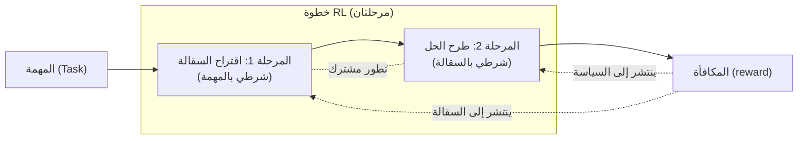

*صورة تجسّد التعلم المعزز بالتسقيل الذاتي حين يبني النموذج سقالات تدريبه بنفسه.*

بات التنافس بين نماذج البرمجة مفتوحة الأوزان يتجاوز سؤال "كم تبلغ درجة المعيار؟" إلى سؤال أعمق: "بأي منهجية تدريب تحققت تلك الدرجة؟" `Ornith-1.0` الذي أصدرته DeepReinforce في 25 يونيو 2026 هو نموذج تصدّر فيه المنهجية ذاتها العناوين. صُمّم التعلم المعزز فيه ليجعل النموذج يولّد الحلول ويكتب في الوقت ذاته **سقالات التدريب (scaffold)** التي تقود تلك الحلول.

هذا المقال لا يعرض نتائج إعادة تشغيل المعايير بشكل مستقل. تشغيل نموذج بحجم 397B على معايير البرمجة يستلزم عقد GPU متعددة وساعات استدلال، لذا لم يُجرَ ذلك في هذا التحليل الآني. وعليه، فجميع الأرقام الواردة هنا **أرقام أعلنتها DeepReinforce في مواد مفتوحة**، وما يتضارب بين المصادر مُشار إليه بـ`[تقديري]`. لم تُخترع أي أرقام.

## نظرة عامة

`Ornith-1.0` ليس نموذجاً واحداً، بل عائلة نماذج مفتوحة المصدر متخصصة في البرمجة. تنقسم إلى أربعة أحجام: 9B كثيف، و31B كثيف، و35B Mixture-of-Experts (MoE)، و397B MoE الرائد، وجميعها بترخيص MIT منشور على نطاق `deepreinforce-ai` في Hugging Face وجاهز للتنزيل الفوري. إلى جانبها نسخ مكمّمة: 9B و35B بصيغة GGUF، و35B و397B بصيغة FP8، مما يدل على أن طيف النشر (من GPU فردي على الحافة إلى عقد متعددة في مراكز البيانات) كان مقصوداً منذ البداية.

من منظور ThakiCloud، يبرز أمران فوراً: الترخيص وإمكانية الاستضافة الذاتية. MIT لا يفرق بين التجاري وغير التجاري، ولا يحمل أي عبء قانوني من الشروط الفيروسية أو البنود غير التجارية. للمؤسسات الراغبة في تشغيل عوامل برمجة على بنيتها التحتية الخاصة دون إرسال الكود إلى واجهات برمجة خارجية، هذا الترخيص هو الجواب الأكثر وضوحاً بـ"نعم".

يمكن تلخيص جوهر النموذج في جملة واحدة: **لا تتعلم Ornith-1.0 في مرحلة التعلم المعزز الحلولَ وحسب، بل تتعلم أيضاً السقالات المهمية التي تقود تلك الحلول.** ومعالجة السقالة بوصفها هدفاً يتطور عوضاً عن كونها أداة ثابتة هي الفارق عن نماذج RL البرمجية الأخرى.

وصف التغريدة الأصلية للنموذج بأنه "أول نموذج مفتوح المصدر من مختبر أمريكي يبرمج على مستوى الحدود." غير أن مقر DeepReinforce لم يتحقق بشكل مستقل من المصادر المفتوحة، لذا يُركز هذا المقال على الآليات القابلة للتحقق والأرقام المعلنة، لا على أُطر الجنسية.

## ما هذا النموذج؟

`Ornith-1.0` مبني على تدريب ما بعد التدريب المسبق (post-training) فوق نماذج أساس مدرّبة مسبقاً. أعلنت DeepReinforce أنها استخدمت Gemma 4 وعائلة Qwen 3.5 كأساس، أي أن الأمر لا يتعلق بتدريب مسبق من الصفر، بل بتطبيق **تعلم معزز مخصص** على قواعد مفتوحة قوية لرفع قدرات البرمجة. يتشابه هذا مع ما تفعله NVIDIA حين تعيد توزيع نماذج جهات خارجية مكمّمة، أي مبدأ "القاعدة أصل مشترك، والتمييز في ما بعد التدريب"، وهو نمط تقسيم عمل بارز في المنظومة المفتوحة الراهنة.

النموذج في جوهره نموذج استدلال (reasoning). يفتح استجاباته بكتلة `<think> … </think>` ليطوّر عملية التفكير أولاً قبل إعطاء الإجابة النهائية. وصفة الخدمة المعلنة توجّه إلى تفعيل محلل reasoning يفصل عملية التفكير في حقل `reasoning_content` مستقل، ومحلل tool-call يعرض كتل استدعاء الأدوات بصيغة `tool_calls` متوافقة مع OpenAI. القصد التصميمي واضح: يُوصل مباشرة في حلقات العوامل. أقصى طول للسياق هو 262,144 رمز، وهو طول يستهدف مهام البرمجة ذات الأفق الطويل التي تدفع فيها مستودعات كاملة دفعة واحدة.

DeepReinforce ليست وافداً جديداً على التعلم المعزز. `CUDA-L1` الصادر عام 2025 استخدم التعلم المعزز لتحسين نواة CUDA تلقائياً، وأفاد بتسارع متوسط 3.12× وتسارع ذروة يبلغ عشرات الأضعاف على مهام GPU متعددة. الخط البحثي المتواصل القائل "اجعل الكود/النواة تحسّن نفسها بالتعلم المعزز" يمتد الآن إلى هذا النموذج البرمجي.

## الجوهر: تعلم معزز بتسقيل ذاتي

في معظم تدريب RL العاملاتي، يُثبّت البشر السقالة (بنية التوجيه، واتفاقيات استخدام الأدوات، وإطار تحليل المهمة) ثم تتعلم السياسة ضمنها فحسب. إن كانت السقالة جيدة ارتفعت الدرجات، وإن كانت رديئة صطدمت السياسة بسقف بمعزل عن جودتها. والمشكلة أن السقالة المثالية تختلف من مهمة إلى أخرى. تتجاوز Ornith-1.0 ذلك بأن ترفع السقالة من **ثابت** إلى **متغيّر قابل للتعلم**.

وفق وصف DeepReinforce، تسير كل خطوة RL في مرحلتين: أولاً يقترح النموذج **سقالة مكيّفة** شرطياً بالمهمة المعطاة، ثم يولّد **طرح حل (rollout)** شرطياً بتلك السقالة. يُنشر مكسب المكافأة على كلتا المرحلتين، أي أن "أي سقالة بُنيت؟" و"ماذا حُلّ فوقها؟" كلاهما يُقيَّم ويُحسَّن معاً. السقالة تصبح هدفاً يتطور بالتزامن مع السياسة.



أهمية هذا التصميم تتجلى في وجهين: أولاً يزول عنق الزجاجة المتمثل في ضبط السقالات يدوياً من قِبل البشر، فحتى لو تغيّر توزيع المهام يعيد النموذج بناء سقالاته. ثانياً لأن السقالة معرّضة مباشرة لإشارة المكافأة، يمكن تصحيح نمط الفشل الشائع "السياسة سليمة لكن السقالة رديئة فتضيع الدرجات" داخل حلقة التعلم ذاتها. يتشابه هذا مع فكرة [نمط Loop Engineering](https://thakicloud.github.io/ar/llmops/) حين تُستخدم أدوات خارجية (مترجمات، اختبارات) إشارةً للمكافأة، مع خطوة إضافية: **السقالة ذاتها** أصبحت هدفاً تلقى المكافأة.

## المعايير المعلنة

الأرقام الرائدة التي أعلنتها DeepReinforce لنموذجها الأكبر هي كالتالي. جميعها بحسب إعلان الشركة ولم تُعاد نسخها في بيئتنا.

| المعيار | Ornith-1.0-397B | للمقارنة |
|---|---|---|
| SWE-Bench Verified | 82.4 | Claude Opus 4.8: 87.6 (الوحيد الذي يتفوق في القائمة) |
| Terminal-Bench 2.1 | 77.5 | الأعلى بين نماذج مفتوحة المصدر من حجم مماثل وفق الإعلان |
| SWE-Bench Pro | 62.2 `[تقديري]` | تباين بين المصادر |

تدّعي DeepReinforce تحقيق أعلى أداء بين النماذج مفتوحة المصدر من الحجم ذاته على Terminal-Bench 2.1 وSWE-Bench وNL2Repo وOpenClaw. ويبرز تحديداً أن 35B MoE يتفوق على بعض النماذج الأكبر حجماً، ما يُفسَّر بأن ندرة MoE مقترنة بما بعد التدريب التسقيلي الذاتي ترفع الكفاءة نسبةً إلى عدد المعاملات النشطة. بيد أن معايير SWE-Bench تتفاوت تفاوتاً كبيراً بين نسخها (Verified/Pro/الأصلية)، والمقارنة المباشرة دون التحقق من النسخة المستخدمة ضربٌ من المجازفة، ولهذا وُضعت قيمة SWE-Bench Pro بعلامة `[تقديري]`.

أهم ما يلفت انتباه المشغّل ليس الأرقام ذاتها، بل أن **مصدرها آلية مُعلنة**. أرقام النماذج المغلقة لا يمكن إعادة إنتاجها، أما الأوزان المُرخّصة بـMIT والوصف التدريبي المنشور فإنهما يفتحان باب التحقق المستقل.

## التثبيت والخدمة

صُمّمت Ornith-1.0 لتعمل مباشرة على مكدسات الاستدلال القياسية. منطق تدرّج التحقق ينطبق هنا: ابدأ بالأصغر. صُمّم 9B للعمل على GPU فردي، وهو نقطة انطلاق مناسبة لاختبار تكامل أنابيب العمل.

```bash
# تنزيل الأوزان من Hugging Face (مثال: 9B)
huggingface-cli download deepreinforce-ai/Ornith-1.0-9B \
  --local-dir ./ornith-1.0-9b
```

بما أنه نموذج استدلال واستدعاء أدوات في آن، يلزم عند الخدمة تفعيل محلل reasoning ومحلل tool-call معاً ليُفصلا عملية التفكير واستدعاءات الأدوات في حقول منظّمة. الشكل النموذجي لتشغيل vLLM هو الآتي، وأسماء المحللات الدقيقة تُرجع إلى بطاقة النموذج.

```bash
# خدمة vLLM (شكل نموذجي، أسماء المحللات تتبع بطاقة النموذج)
vllm serve deepreinforce-ai/Ornith-1.0-9B \
  --max-model-len 262144 \
  --enable-auto-tool-choice \
  --tool-call-parser <محدد في بطاقة النموذج> \
  --reasoning-parser <محدد في بطاقة النموذج>
```

عند تشغيل 397B MoE الرائد، الذاكرة هي العائق الأول. لذا نُشرت نسخة FP8 (`Ornith-1.0-397B-FP8`) منذ البداية: تخفّض ذاكرة الأوزان بنسبة النصف مقارنة بـBF16، مما يقلص عدد العقد ودرجة التوازي الموتّري. أما 35B MoE فهو نقطة التوازن المثلى التي يمثّل فيها MoE ميزته الجوهرية "معاملات نشطة أقل، طاقة معرفية أكبر"، وهو مرشح واقعي للخدمة على عقدة واحدة بـGPU متعدد.

```bash
# 397B: نسخة FP8 مع توازي موتّري للتعامل مع جدار الذاكرة (هيكل إرشادي)
vllm serve deepreinforce-ai/Ornith-1.0-397B-FP8 \
  --tensor-parallel-size 8 \
  --max-model-len 262144 \
  --enable-auto-tool-choice
```

## التطبيق والدلالات على منصة ThakiCloud لـK8s AI/ML SaaS

تُجدوِل منصة ThakiCloud للذكاء الاصطناعي أحمال GPU عبر Kueue فوق K8s، وتخدم الاستدلال متعدد المستأجرين عبر vLLM، وتُشغّل عوامل متعددة المستأجرين. نموذج كـOrnith-1.0 ذو صلة بهذا المكدس في ثلاثة محاور:

أولاً **السيادة على نموذج عوامل البرمجة الداخلية**. الكود من أكثر الأصول حساسية. الطلب على تشغيل عوامل برمجة داخل البنية التحتية الخاصة أو المستأجر المخصص دون إرسال الكود إلى واجهات برمجة مغلقة حاجةٌ كبرى في البيئات المقيّدة بمتطلبات تداول البيانات كالقطاع المالي والحكومي والدفاعي. رخصة MIT مع أوزان قابلة للاستضافة الذاتية هي الإجابة الدقيقة على هذا الطلب. سياق 262K والإخراج بصيغة `tool_calls` المتوافقة مع OpenAI تتيح استبدال النموذج الأساسي في حلقات عوامل قائمة دون إعادة هندسة.

ثانياً **طيف الأحجام يتوافق مع حسابات التكلفة متعددة المستأجرين**. يمكن توزيع الأدوار: 9B للمهام المساعدة الخفيفة أو مستويات المستأجرين المنخفضة التكلفة، و35B MoE كنموذج الخدمة الرئيسي بكفاءة عالية للمعاملات النشطة، و397B لأحواض المهام الصعبة حصراً. في بيئة تجدوِل GPU عبر Kueue، تحويل "أي حجم لأي مستأجر بأي أولوية" مباشرةً إلى تكلفة وحدة. امتلاك خيار الحجم في عائلة واحدة يعني المرونة التشغيلية وتحسين التكلفة في آنٍ.

ثالثاً **المنهجية التسقيلية الذاتية تطرح دلالة أعمق لنا**. تُشغّل ThakiCloud عوامل متخصصة بالنطاق لعملاء متعددين. تكلفة ضبط السقالات يدوياً لكل مهمة ترتفع خطياً مع تضاعف النطاقات. فكرة "رفع السقالة إلى هدف قابل للتعلم" هي نمط يمكن اقتباسه مباشرة حين تصمّم أنابيب عمل داخلية لتحسين توجيهات عوامل النطاق واتفاقيات الأدوات تلقائياً بإشارة المكافأة، بدلاً من الاعتماد على ضبط بشري في كل مرة. حتى لو لم تُعتمد الأوزان ذاتها، الآلية قابلة للزرع في محرك سير عمل داخلي.

## القيود والاعتراضات

أبرز القيود هو **التناظر اللامتكافئ في التحقق**. الأوزان والوصف التدريبي منشوران، لكن أرقام المعايير المعلنة قياسات داخلية لم تُعاد نسخها هنا. معايير SWE-Bench تتفاوت تفاوتاً كبيراً بحسب النسخة والتهيئة، والنموذج ذاته يُعطي نتائج مختلفة بحسب درجة الحرارة وإعدادات إعادة المحاولة والبيئة. الانتقال المباشر من هذه الأرقام إلى استنتاج "تجاوز النماذج الحدودية" استنتاجٌ متسرع. قرار التبنّي الفعلي يحتاج تقييماً مستقلاً على عيّنة من قواعد الكود الداخلية.

ثانياً **التكلفة التشغيلية**. 397B MoE جذاب بأرقامه، لكن ذاكرة GPU وعدد العقد المطلوبان حاجزان واقعيان عند الاستضافة الذاتية. نسخة FP8 تخفّف ذلك، لكن المقايضة "مفتوح المصدر إذاً مجاني" لا تصح، والأدق هو "مفتوح المصدر إذاً تكلفة البنية التحتية علينا". مقارنة تكلفة رمز واجهة البرمجة المغلقة بتكلفة عقدة الاستضافة الذاتية يستلزم تحليلاً بنمط الحمل الفعلي.

ثالثاً **تساؤل التعميم في التسقيل الذاتي**. التصميم القائل بأن النموذج يبني سقالته بنفسه أنيقٌ من حيث المفهوم، لكن ليس هناك تحقق خارجي حتى الآن من أن جودة السقالة لا تتدهور على مهام بعيدة عن توزيع التدريب. لا يمكن استبعاد احتمال أن تكون السقالة قد انحدرت نحو التخصص المفرط في أشكال معايير محددة. هذا مما سيتضح حين تُنشر إعادة إنتاج مستقلة بالأوزان المفتوحة.

خلاصة القول: Ornith-1.0 نموذج يستحق الاهتمام لمنهجيته قبل درجاته. كونه مرخّصاً بـMIT يجعله مرشحاً واقعياً لعوامل البرمجة ذاتية الاستضافة، وآلية التسقيل الذاتي فكرة يستحق اقتباسها في تصميم أنابيب تدريب العوامل سواء اعتُمدت الأوزان أم لا. لكن جميع أرقام المعايير تبقى "أرقاماً مُعلنة" ريثما تخضع للتقييم الذاتي.

## المصادر

- DeepReinforce، "Ornith-1.0: Self-Scaffolding LLMs for Agentic Coding" (يونيو 2026): <https://deep-reinforce.com/ornith_1_0.html>
- بطاقات النموذج على Hugging Face: <https://huggingface.co/deepreinforce-ai/Ornith-1.0-397B>، <https://huggingface.co/deepreinforce-ai/Ornith-1.0-9B>
- GitHub: <https://github.com/deepreinforce-ai/Ornith-1>
- MarkTechPost، "DeepReinforce Releases Ornith-1.0" (2026-06-25): <https://www.marktechpost.com/2026/06/25/deepreinforce-releases-ornith-1-0-an-open-source-coding-model-family-that-learns-its-own-rl-scaffolds/>
- Tech Times (2026-06-26): <https://www.techtimes.com/articles/319122/20260626/open-source-coding-model-ornith-10-writes-its-own-training-scaffold-reinforcement-learning.htm>
- DeepReinforce، CUDA-L1 (بحث سابق): <https://deepreinforce-ai.github.io/cudal1_blog/>
