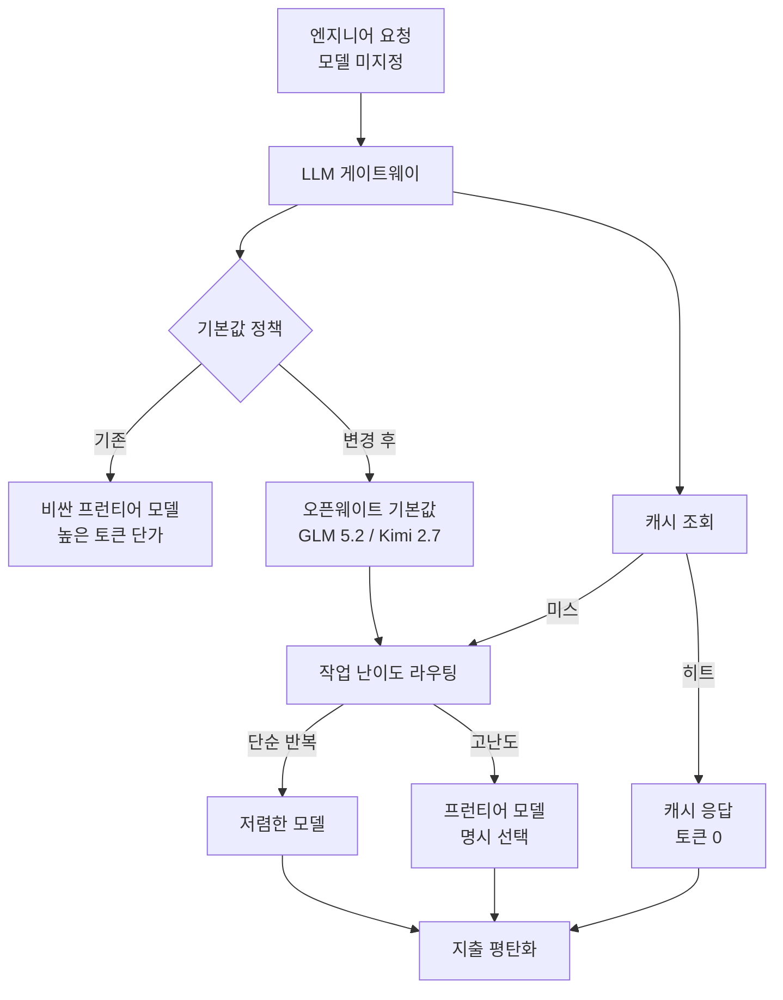

## نظرة عامة

أي مؤسسة تستخدم الذكاء الاصطناعي بجدية تصطدم بالمعضلة نفسها في مرحلة ما. كلما زاد استخدام الموظفين لنماذج اللغة، ارتفعت الإنتاجية، لكن فاتورة الرموز ترتفع أسياً معها. الاستجابة الشائعة هي وضع حدّ للاستخدام، وإرسال تنبيهات عند تجاوزه، وجعل استخدام النماذج باهظة الثمن مرهقاً. غير أن هذا النهج، بدل كبح الكلفة، يضيف احتكاكاً لإنتاجية الموظف كأثر جانبي.

في يونيو 2026، شارك الرئيس التنفيذي لـ Coinbase بريان أرمسترونغ حلّ شركته المختلف. بعبارته، إنه «كيف تبقي الإنفاق على الذكاء الاصطناعي ثابتاً بينما ينمو استخدام الرموز أسياً»، والخلاصة واضحة: حُلّها بإعدادات افتراضية أفضل وتوجيه وتخزين مؤقت، لا بالاحتكاك وتنبيهات الإنفاق. تقول Coinbase إنها خفّضت الإنفاق على الذكاء الاصطناعي إلى النصف تقريباً بينما انفجر استخدام الرموز.

تشغّل ThakiCloud منصة ai-platform التي تخدم النماذج عبر بيئات عملاء متنوعة، لذا فإن كيفية التحكم في كلفة الاستدلال ليست قصة الآخرين. استراتيجية Coinbase سياسة داخلية لشركة واحدة، لكن في داخلها مبادئ LLMOps تنطبق على كل من يشغّل بنية خدمة النماذج. يعرض هذا المقال تلك الاستراتيجية كما هي، ويحلل ما تعنيه من منظور منصة الخدمة.

## الجوهر: الإعدادات الافتراضية لا الاحتكاك

نقطة انطلاق نهج Coinbase هي البيانات. أثناء محاولة إحكام حدود الاستخدام، اكتشفوا أن 91% من الموظفين لا يبلغون حدود استخدامهم أصلاً. بعبارة أخرى، لم يكن مُحرّك ارتفاع الكلفة «حفنة من المستخدمين الكثيفين يستنفدون حدودهم»، بل مشكلة بنيوية: السلوك الافتراضي للاستخدام العام كان موجّهاً نحو النماذج باهظة الثمن.

من هنا جاء الشعار «إعدادات افتراضية أفضل، لا حدود استخدام». لا يزال بإمكان المهندسين اختيار أي نموذج يريدونه بحرية. التغيير هو في النموذج الافتراضي الذي يصلون إليه حين لا يحدّدون شيئاً، بتبديله من نموذج حدودي باهظ إلى نموذج مفتوح الأوزان أرخص. تقول Coinbase إنها تجرّب جعل نماذج مفتوحة الأوزان مثل GLM 5.2 وKimi 2.7 هي الافتراضية في بوابة LLM الخاصة بها.

قوة هذه الفكرة أنها لا تحارب أنماط السلوك البشري. معظم المستخدمين يأخذون الإعداد الافتراضي ببساطة. غيّر الافتراضي ودون إجبار أي شيء، ينتقل سلوك الأغلبية طبيعياً. إنه عكس خفض الحدود وإضافة التنبيهات الذي يخلق احتكاكاً بين المستخدمين والنظام. ويبدو المسار الكامل كالتالي.

## ثلاث تقنيات

يتلخص ضبط الكلفة الذي طرحه أرمسترونغ في ثلاثة محاور. لا أحد منها اختراع جديد، لكن المفتاح هو جمع الثلاثة في مكان واحد، البوابة.

أولاً، **توجيه أذكى للنماذج**. بدل معالجة كل مهمة بالنموذج نفسه، تُرسل كل مهمة إلى أرخص نموذج قادر على إنجازها. المهام البسيطة المتكررة مثل التلخيص أو التصنيف تكفيها نماذج صغيرة، ولا يُرفع إلى نموذج حدودي إلا المهام التي تحتاج استدلالاً معقداً. الفكرة الجوهرية أن النموذج الأعلى أداءً ليس ضرورياً دائماً. لا داعي لاستخدام نموذج باهظ في مهام روتينية لا يصنع فيها أداء النماذج الحدودية أي فرق في النتيجة.

ثانياً، **التخزين المؤقت الفعّال**. تُزال المخرجات المكرّرة للاستعلامات المتكررة. حين يَرِد السؤال نفسه عدة مرات، يُعاد رد مخزّن بدل استدعاء النموذج في كل مرة. إصابة الذاكرة المؤقتة لا تستهلك رموزاً إطلاقاً، لذا كلما زاد تكرار عبء العمل، كبر التوفير. في بيئات تتكرر فيها أسئلة متشابهة، مثل مساعدي الشيفرة أو استعلامات الوثائق الداخلية، يكون التخزين المؤقت رافعة بسيطة لكن قوية.

ثالثاً، **التحوّل إلى نماذج أرخص مفتوحة الأوزان**. في الأعمال الروتينية التي لا يضيف فيها أداء النماذج الحدودية قيمة، ينتقل العمل إلى نماذج مفتوحة الأوزان. وبالاقتران مع استراتيجية الإعدادات الافتراضية السابقة، تُضبط الوجهة الافتراضية للتوجيه نفسها على مفتوح الأوزان. ومضى أرمسترونغ أبعد، متوقعاً أن 80% من أعباء عمل الذكاء الاصطناعي ستنتقل خلال 18 شهراً إلى نماذج أرخص بنسبة 99%، وأن ما يحدّد سقف نمو الذكاء الاصطناعي سيكون بنية الطاقة والحوسبة، لا جودة النماذج.

التقنيات الثلاث يعزّز بعضها بعضاً. التوجيه يوزّع المهام على النموذج المناسب، والتخزين المؤقت يزيل الاستدعاءات المكرّرة، والإعدادات الافتراضية مفتوحة الأوزان تنقل مركز ثقل ذلك التوزيع نحو الكلفة المنخفضة. هذا المزيج هو سرّ تحقّق الاستخدام المنفجر والإنفاق الثابت في آن واحد.

## دلالات على منتجات ThakiCloud

استراتيجية Coinbase قصة شركة واحدة لها بوابة LLM داخلية، لكن مبادئها تتداخل تماماً مع عرض القيمة لخدمة النماذج متعددة المستأجرين التي تقدّمها منصة **ai-platform** من ThakiCloud. تخدم ai-platform النماذج بـ vLLM وأمثاله فوق جدولة موارد GPU القائمة على Kubernetes وKueue، وما فعلته Coinbase عند بوابة واحدة يمكننا تقديمه بعمق أكبر على مستوى منصة الخدمة.

أولاً، **التوجيه كميزة منصة**. وزّعت Coinbase المهام على النماذج عند البوابة. ولأن ai-platform من ThakiCloud تخدم نماذج كثيرة في آن واحد في بيئة متعددة المستأجرين، يمكنها ضبط سياسات التوجيه على مستوى البنية لكل مستأجر: «نموذج صغير للمهام البسيطة، ونموذج كبير للصعبة فقط». ولأننا نستضيف النماذج مباشرة، فإن حرية قرارات التوجيه وشفافية الكلفة أكبر مما هي عليه عند الاعتماد على واجهات برمجة خارجية.

ثانياً، **اقتصاديات خدمة مفتوحة الأوزان**. السبب الجوهري لجعل Coinbase نماذج مثل GLM 5.2 وKimi 2.7 افتراضية هو الكلفة المنخفضة. تتخصص ai-platform في خدمة هذه النماذج مفتوحة الأوزان مباشرة في بيئات داخل المؤسسة أو سيادية. عبر الخدمة المُكمّمة على وحدات GPU استهلاكية، والاستدلال عالي الإنتاجية القائم على vLLM، وعزل الموارد متعدد المستأجرين، يكون خفض كلفة الخدمة لكل رمز ميزتنا التنافسية. وبالتحرّر من تسعير الرموز لواجهات النماذج الحدودية الخارجية، كلما شغّلت النماذج مفتوحة الأوزان بكفاءة أكبر على بنيتك، اقتربت فعلاً من منطقة «الأرخص بنسبة 99%» التي وصفتها Coinbase.

ثالثاً، **الرؤية بأن الطاقة والحوسبة هما السقف**. رأى أرمسترونغ أن ما يحدّد سقف نمو الذكاء الاصطناعي هو بنية الطاقة والحوسبة، لا جودة النماذج. وهذا يشير إلى المكان نفسه الذي يشير إليه اتجاه ThakiCloud في جدولة موارد GPU بكفاءة عبر Kueue والتأكيد على كفاءة الكلفة داخل المؤسسة. في عصر تحدّد فيه كلفة الاستدلال أعباء العمل، تصبح بنية الخدمة نفسها، التي تشغّل النموذج نفسه أرخص وأكثر، عامل التمايز.

وعلى صعيد السياسة والتدقيق، تبرز أيضاً **Paxis**، السحابة الأصيلة للوكلاء من ThakiCloud. «سياسة الإعداد الافتراضي» لدى Coinbase هي في جوهرها بوابة سياسة تُطبَّق على كل طلب يمرّ عبر البوابة. ولأن Paxis تمرّر كل إجراء وكيل عبر بوابات السياسة وسجلات التدقيق، يمكنها ترك سجلّ قابل للتتبّع لأي نموذج استُخدم افتراضياً لأي مهمة وأين نشأت الكلفة. ضبط الكلفة يبدأ في النهاية من الوضوح، والوضوح يتحقق حين يُسجَّل كل استدعاء.

## القيود والاعتراضات

لهذه الاستراتيجية قيود واضحة أيضاً. أولاً، مشكلة دقة التوجيه. إن كان حكم «هذه المهمة تكفيها نماذج صغيرة» خاطئاً، تنخفض الجودة، وقد تتجاوز تلك الخسارة توفير الرموز. حين تتطلب مهمة تبدو بسيطة استدلالاً دقيقاً في الواقع، يعود ثمن توجيهها إلى نموذج رخيص نتيجةً خاطئة. سياسة التوجيه ليست شيئاً تكتبه مرة وتنتهي؛ تحتاج إلى تقييم وتصحيح مستمرين.

ثانياً، نطاق التخزين المؤقت. التخزين المؤقت قوي للاستعلامات المتكررة، لكن في الأعمال الإبداعية أو المخصّصة التي يَرِد فيها سياق مختلف ومدخل مختلف كل مرة، تكون نسب الإصابة منخفضة. لا يستفيد كل عبء عمل بالقدر نفسه من التخزين المؤقت، لذا يعتمد التوفير بشدة على طبيعة عبء العمل.

ثالثاً، فجوة جودة النماذج مفتوحة الأوزان. توقّع أن «80% ستنتقل خلال 18 شهراً إلى نماذج أرخص بنسبة 99%» توقّع جريء. صحيح أن النماذج مفتوحة الأوزان تلحق بسرعة، لكن الفجوة مع النماذج الحدودية لا تزال قائمة في المجالات التي يهمّ فيها الاستدلال العالي الصعوبة أو السياق الطويل أو الاستقرار. اضبط الافتراضي على مفتوح الأوزان، لكن إن رسمت حدّ متى تَرفع إلى الحدودي خطأً، تتدهور تجربة المستخدم. هذا التوقّع أأمن قراءةً بوصفه اتجاهاً لا يقيناً.

ومع ذلك، الدرس الجوهري من حالة Coinbase متين. ينبغي حلّ ضبط الكلفة بتغيير الإعدادات الافتراضية والبنية، لا بإضافة احتكاك للمستخدمين. وكلما امتلكت تلك البنية، أي كلما خدمت النماذج بنفسك، اتسع نطاق تحكّمك. والخدمة متعددة المستأجرين منخفضة الكلفة التي تنشدها منصة ai-platform من ThakiCloud هي بالضبط ذلك الأساس للتحكّم.

## المصادر

- [تغريدة بريان أرمسترونغ](https://x.com/brian_armstrong/status/2070670644577280109): "How to keep AI spend flat while token usage grows exponentially" (2026-06-27)
- [Coinbase Says AI Costs Are Staying Flat As Token Usage Explodes (CryptoAdventure)](https://cryptoadventure.com/coinbase-says-ai-costs-are-staying-flat-as-token-usage-explodes/)
- [Coinbase CEO Halved AI Costs (Yahoo Finance)](https://finance.yahoo.com/markets/crypto/articles/coinbase-ceo-halved-ai-costs-130000536.html)
