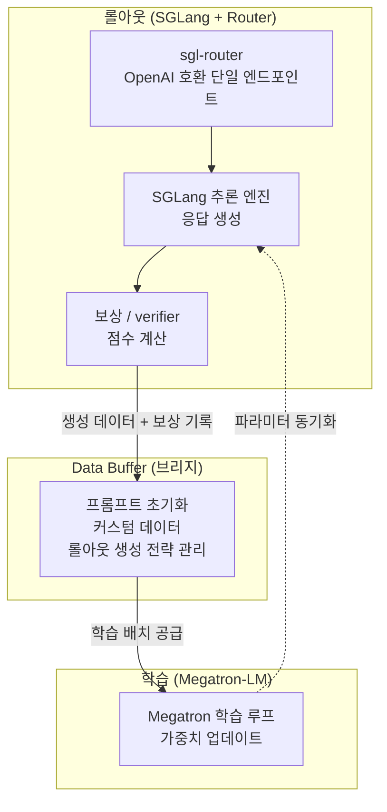

*صورة تجسّد تصميم slime للتعلّم المعزّز غير المتزامن، الذي يفصل التوليد عن التدريب لرفع الإنتاجية.*

## نظرة عامة

GLM-5.2، الذي أصدرته Z.ai (المعروفة سابقًا باسم Zhipu AI) في يونيو 2026، نموذج مفتوح الأوزان بسياق يبلغ مليون رمز وبرخصة MIT. لفت الانتباه لمنافسته النماذج التجارية المغلقة في مهام البرمجة ومهام الوكلاء طويلة المدى. لكنّ هذا الإصدار يأتي بشيء يكاد يضاهي أهمية أوزان النموذج نفسها: فقد تم فتح مصدر **slime**، البنية التحتية للتعلّم المعزّز التي شغّلت مرحلة التدريب اللاحق للنموذج، إلى جانبه.

تطلق معظم النماذج الرائدة أوزانها المدرَّبة مسبقًا، لكنها تُبقي خط أنابيب التعلّم المعزّز الذي يحوّل تلك الأوزان إلى وكيل مفيد فعلًا سرّيًا. فالبنية التحتية التي تربط تصميم المكافأة وتوليد الـ rollout وحلقة التدريب هي بالضبط الخبرة الخاصة التي تحدّد جودة النموذج. يفتح slime هذا المجال بأكمله. تذكر Z.ai أن GLM-5.2، بل أيضًا GLM-5.1 وGLM-5 وGLM-4.7 وGLM-4.6 وGLM-4.5، خضعت جميعها للتدريب اللاحق على الإطار نفسه. ومرور إطار واحد عبر عدة إصدارات من فئة الأحدث عالميًا يعني أن هذه بنية تحتية مُثبَتة في الإنتاج، لا شيفرة مختبرية.

تشغّل ThakiCloud منصة SaaS متعددة المستأجرين للذكاء الاصطناعي والتعلّم الآلي قائمة على K8s، فتخدم النماذج وتشغّل الوكلاء عبر بيئات عملاء متنوعة. لذا فإن السؤال "أي نموذج جيد" يهمّنا بقدر السؤال "أي بنية تحتية بنته وتشغّله". وبوصفه مرجعًا عامًا للجانب الثاني، يستحق slime التمعّن. في هذه التدوينة نعرض بنية slime وفلسفته التصميمية، ونتأمّل دلالاته لجدولة GPU عبر Kueue ولمنظومة الخدمة SGLang/vLLM في منصتنا.

## ما هو slime

slime إطار **للتدريب اللاحق لنماذج اللغة الكبيرة من أجل توسيع التعلّم المعزّز**، بناه فريق THUDM (من سلالة جامعة تسينغهوا / Z.ai). الفكرة الجوهرية بسيطة: Megatron-LM بارع في التدريب، وSGLang بارع في الاستدلال عالي الإنتاجية (الـ rollout)، فلنربط الاثنين في تدفّق بيانات واحد. يكرّر التدريب اللاحق للتعلّم المعزّز بلا نهاية حلقةً قوامها "يولّد النموذج إجابة (rollout)، ثم تُقيَّم الإجابة، ثم تُحدِّث تلك المكافأة النموذج"، ولذا فإن مدى سلاسة ربط محرّك التوليد بمحرّك التدريب هو ما يحدّد الإنتاجية الإجمالية.

يفكّك slime هذه الحلقة إلى ثلاثة مكوّنات.

- **التدريب (Megatron-LM)**: يتولّى عملية التدريب الرئيسية. يقرأ البيانات من Data Buffer لتحديث النموذج، ويزامن المعاملات مع وحدة الـ rollout بعد اكتمال التدريب.
- **الـ Rollout (SGLang + Router)**: يولّد بيانات جديدة، تشمل المكافآت ومخرجات الـ verifier، ويكتبها إلى Data Buffer. وهنا يوفّر sgl-router واجهة برمجية متوافقة مع OpenAI لتتفاعل بيئات الوكلاء المعقّدة مع النموذج عبر نقطة وصول HTTP واحدة.
- **Data Buffer**: الجسر بين العالمين. يدير تهيئة الموجِّهات (prompts) والبيانات المخصّصة واستراتيجية توليد الـ rollout.

تتولّى Ray إدارة الموارد. ونتيجةً لذلك، يمكن التبديل بعَلَم واحد بين وضع تتشارك فيه عمليتا التدريب والـ rollout وحدات GPU نفسها، ووضع يفصلهما على وحدات GPU منفصلة.

## وضعا التشغيل: colocated وdisaggregated

أكثر قرارات slime التصميمية عمليةً هو أن الشيفرة نفسها تدعم وضعَي نشر اثنين.

**الوضع المتشارك (colocated) / المتزامن** يضع التدريب والـ rollout على مجمّع GPU نفسه. يُفعَّل بعَلَم واحد `--colocate`. وهو مناسب لاستخلاص أقصى استفادة من بيئات GPU المحدودة، حيث يتقاسم التوليد والتدريب الموارد نفسها زمنيًا.

**الوضع المفصول (disaggregated) / غير المتزامن** يفصل وحدات GPU الخاصة بالتدريب عن تلك الخاصة بالـ rollout. فيمكن للتوليد أن يستمر دون انتظار التدريب، مما يرفع الإنتاجية. و"التعلّم المعزّز غير المتزامن للوكلاء" الذي أبرزه GLM-5.2 يعمل فوق هذا الوضع تحديدًا. ففصل التوليد عن التدريب يقلّص بشدّة زمن خمول GPU في الأحمال التي تكون فيها كل حلقة طويلة وغير منتظمة، مثل التفاعلات متعددة الأدوار ومتعددة الأدوات.

هذا الخيار مهمّ للمشغّلين. فبالإطار نفسه يمكنك تشغيل تجارب صغيرة بتكلفة زهيدة في الوضع المتشارك، ودفع الإنتاجية في الوضع المفصول للتدريب الإنتاجي واسع النطاق، بما يتيح التوسّع التدريجي.

## التصميم من أجل التعلّم المعزّز للوكلاء

ثمّة سبب لاستخدام slime في تدريب نماذج الوكلاء مثل GLM-5.x: فهو يتضمّن ميزات موجَّهة مباشرةً لأحمال الوكلاء متعددة الأدوار.

- **PD Disaggregation**: يفصل مرحلتَي prefill وdecode لأحمال الوكلاء متعددة الأدوار حيث تختلف احتياجات الموارد بين المرحلتين.
- **انتماء الجلسة في الـ Router**: يوفّر سياسة توجيه تُبقي الوكيل متعدد الأدوار على الجلسة نفسها، فتستمرّ أدوار الوكيل الواحد المتعدّدة في حالة متّسقة.
- **Delta Weight Sync**: في بيئة مفصولة بين التدريب والاستدلال، يُزامَن فرق الأوزان فقط، مما يخفض كلفة الاتصال.
- **نقطة وصول واحدة متوافقة مع OpenAI**: بفضل sgl-router، تتفاعل بيئات الوكلاء المعقّدة مع النموذج عبر طلبات HTTP بسيطة. فلا حاجة لحشر شيفرة البيئة داخل إطار التعلّم المعزّز.

البند الأخير عمليّ على نحو خاص. فإذا جرّدت بيئة المهام طويلة المدى مثل تحرير الشيفرة واستخدام الأدوات وحلّ المشكلات متعدد الخطوات إلى استدعاءات لواجهة OpenAI، أمكنك ربط بيئات الوكلاء القائمة بحلقة تدريب التعلّم المعزّز كما هي تقريبًا. وتضيف Z.ai آلية "مكافحة الالتفاف" (anti-hacking) فوق ذلك لكبح اختراق المكافأة، حيث يستغلّ النموذج المكافأة بطرق التفافية في المهام طويلة المدى.

## نظرة عامة على التثبيت والاستخدام

slime متاح على GitHub ([THUDM/slime](https://github.com/THUDM/slime))، ولكونه أصيلًا لـ SGLang فهو يفترض منظومة استدلال SGLang ومنظومة تدريب Megatron-LM. كما نُشر دعم اليوم الأول (Day-0) لوحدات AMD Instinct GPU عبر مدوّنة ROCm، مما يؤكد عمله على مسرّعات خارج NVIDIA.

لكن بصدق، يتطلّب إعادة إنتاج حلقة التدريب اللاحق للتعلّم المعزّز في slime بشكل ذي معنى عنقود GPU متعدّد (عادةً ثمانية مسرّعات من فئة مراكز البيانات أو أكثر) وبيئة تُهيَّأ فيها Megatron وSGLang وRay معًا. لم تُشغّل هذه التدوينة تدريبًا كاملًا للتعلّم المعزّز في صندوق رمل أحادي العقدة لالتقاط الأرقام. لذا لا نقدّم أي أرقام قياس مثل إنتاجية التدريب أو سرعة التقارب، وحالات التحقق الإنتاجية أدناه مبنيّة على مصادر أوّلية منشورة. وعدم اختلاق أرقام أداء اعتباطية مبدأ من مبادئ مدوّنتنا.

من الناحية البنيوية، الأسطح التي يلمسها المشغّل واضحة. فأنت تحدّد أسلوب النشر بعَلَم وضعٍ مثل `--colocate`، وتركّب استراتيجية الـ rollout الخاصة بمجالك عبر واجهة توليد البيانات المخصّصة في Data Buffer، وتربط بيئات الوكلاء بنقطة وصول sgl-router. ولهذا يؤكّد الإطار على المرونة: فلأن واجهة الـ rollout قابلة للتخصيص بالكامل، يمكن تهيئة كل شيء على الهيكل نفسه، من خوارزميات التعلّم المعزّز العامة إلى تدريب الوكلاء المتخصّص بمجال بعينه.

## التحقق عبر GLM-5.x

يُعدّ slime من أكثر أطر التدريب اللاحق المفتوحة للتعلّم المعزّز اختبارًا في الميدان. فقد مرّت عدة إصدارات من فئة الأحدث عالميًا (GLM-5.2 وGLM-5.1 وGLM-5 وGLM-4.7 وGLM-4.6 وGLM-4.5) عبر حلقة تدريبه الكاملة. وذكر GLM-5.2 أنه دُرِّب لاحقًا بخوارزمية جديدة للتعلّم المعزّز غير المتزامن للوكلاء تتعلّم من التفاعلات طويلة المدى متعددة الأدوات، فوق بنية تحتية تفصل التوليد عن التدريب. وقد ذُكر أن التدريب اللاحق الكامل لـ GLM-5.2 اكتمل في نحو يومين، لكننا نُبقي رقم المدّة هذا بوصفه [تقديريًا] لأننا لم نتمكّن من التحقق المتقاطع منه عبر وثائق رسمية أوّلية.

الجوهر ليس الرقم بل قابلية إعادة الإنتاج. فبفتح أوزان النموذج (MIT) وإطار التدريب معًا، تستطيع مؤسسة تملك حوسبة كافية أن تعيد تتبّع وصفة التدريب اللاحق لـ GLM-5.2 على بيانات مجالها. وهذه رافعة تنفرد بها المنظومة المفتوحة، يستحيل بلوغها بالنماذج المغلقة.

## ما الذي يعنيه هذا لمنتجات ThakiCloud

يمسّ تصميم slime للتعلّم المعزّز غير المتزامن طبقتَي منتج متمايزتين في ThakiCloud.

من منظور ai-platform، يتطلّب تدريب التعلّم المعزّز حملين متزامنين مختلفَي الطبيعة تمامًا: الـ rollout (حمل استدلال) والتدريب (حمل انتشار عكسي). تتوافق الطريقة التي يبدّل بها slime بين colocated وdisaggregated عبر Ray توافقًا جيدًا مع نموذج طابور GPU في Kueue. ففي الوضع المفصول، يتيح تقسيم الـ rollout والتدريب إلى مهامّ منفصلة لـ Kueue جدولة كلٍّ منهما عبر طابوره الخاص، مما يرفع استغلال GPU عبر العنقود متعدد المستأجرين ويُبقي تكاليف الحوسبة في حدودها. وبما أن منظومة الخدمة لدينا تستخدم vLLM أصلًا، فإن الخبرة المكتسبة حول التجميع المستمر وإدارة ذاكرة KV المؤقتة تنتقل مباشرةً إلى جانب الـ rollout في خط أنابيب التعلّم المعزّز. والنتيجة العملية هي خط أنابيب RL داخلي يعمل دون تصدير البيانات خارج العنقود، مما يحوّل التدريب اللاحق الذاتي الاستضافة من هدف مبهم إلى منتج ملموس.

من منظور Paxis، يكون الاتصال أكثر مباشرةً. فـ Paxis هو طائرة تحكّم الوكلاء من ThakiCloud، تعمل فوق ai-platform. يشمل جوهره Skill Harness الذي يختار من أكثر من 960 مهارة عبر BM25، وحلقة مهارات ذاتية التطوّر، وتنفيذًا معزولًا، ومحرّك معرفة HKE. يصبح إطار مثل slime هو المحرّك التعليمي لحلقة التطوّر الذاتي تلك. فبتوليد الـ rollouts من بيانات مجال العميل وتقييمها بإشارة مكافأة وتحديث المهارات عبر التعلّم المعزّز، تتحسّن وكلاء مجال Paxis باستمرار مع الاستخدام. وتعمل نقطة وصول sgl-router المتوافقة مع OpenAI كعنصر ربط يصل موصّلات MCP في Paxis وبيئات الأدوات القائمة بحلقة التعلّم المعزّز بأدنى احتكاك. وهكذا يتكامل المنتجان: تزوّد ai-platform طوابير GPU وخط أنابيب RL الداخلي، بينما تستهلك Paxis ذلك الخط بوصفه محرّكًا لتطوّر المهارات.

هذا أقرب إلى خارطة طريق منه إلى ميزة مُشحونة. غير أن التوافق البنيوي بين منظومة ai-platform (K8s وKueue وvLLM) ومعمارية المهارات ذاتية التطوّر في Paxis من جهة، وما يفترضه slime فعلًا من جهة أخرى، يُظهر أن هذا الاتجاه ليس توفيقًا متكلَّفًا.

## القيود والاعتراضات

slime ليس حلًّا سحريًا. لنذكر بضعة قيود واقعية بوضوح.

أكبر عائق للدخول هو **الحوسبة والتعقيد التشغيلي**. فإقامة Megatron + SGLang + Ray في آنٍ واحد وتنسيق التدريب/الـ rollout عبر وحدات GPU متعددة ليس أمرًا هيّنًا البتّة. وليست هذه أداةً يستطيع GPU واحد أو فريق صغير تشغيلها باستهتار، والتدريب اللاحق للتعلّم المعزّز نفسه يتطلّب استثمارًا في البنية التحتية يضاهي التدريب المسبق. وثمّة فجوة كبيرة بين "الإطار مفتوح" و"نستطيع تشغيل التدريب اللاحق للتعلّم المعزّز".

ثانيًا، **صعوبة التدريب اللاحق للتعلّم المعزّز**. فتصميم المكافأة، ومنع اختراق المكافأة، واستقرار التدريب، مصاعب جوهرية لا يحلّها الإطار نيابةً عنك. يوفّر slime البنية التحتية فقط؛ أما دالة المكافأة الجيدة ووصفة التدريب المستقرّة فتبقيان مسؤولية المستخدم. وكون Z.ai أبرزت آلية مكافحة الالتفاف على نحو منفصل هو بذاته دليل على مدى صعوبة هذا المجال.

ثالثًا، **حدود نطاق تحقّقنا**. فقد حلّلت هذه التدوينة البنية اعتمادًا على وثائق slime العامة وما نُشر عنها؛ ولم نُعِد مباشرةً إنتاج حلقة التدريب الكاملة للتعلّم المعزّز لقياس الإنتاجية. لذا فإن مزاعم مثل "تدريب من فئة GLM-5.2 في أيام معدودة" ليست حقائق أكّدناها باستقلال. وعلى من يدرس التبنّي أن يجرّب أولًا بنموذج صغير ومهمة صغيرة في الوضع المتشارك لقياس الكلفة الفعلية في بيئته الخاصة.

ومع ذلك، فإن حدثًا تُفتح فيه أوزان النموذج وإطار التدريب معًا يمثّل شفافية نادرة في منظومة نماذج اللغة المفتوحة. وبالنسبة لمنصة مثل ThakiCloud تشغّل البنية التحتية مباشرةً، فقد اتّسعت مجموعة الخيارات التي تمنح التحكّم حتى مرحلة التدريب اللاحق، بما يتجاوز مجرّد استخدام نموذج صنعه آخرون.

## المصادر

- [THUDM/slime - GitHub](https://github.com/THUDM/slime)
- [slime: An SGLang-Native Post-Training Framework for RL Scaling - LMSYS Org](https://www.lmsys.org/blog/2025-07-09-slime/)
- [GLM-5.2: Built for Long-Horizon Tasks - Hugging Face Blog](https://huggingface.co/blog/zai-org/glm-52-blog)
- [Day-0 Support for the SGLang-Native RL Framework slime on AMD Instinct GPUs - ROCm Blogs](https://rocm.blogs.amd.com/artificial-intelligence/slime/README.html)
