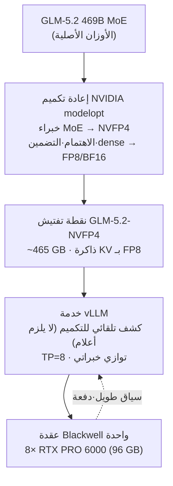

## نظرة عامة

تقديم نموذج MoE بحجم 469B على بنية تحتية خاصة كان يعني، حتى وقت قريب، امتلاك مجموعة GPU موزعة على عقد متعددة. لكن [مشروع vLLM](https://recipes.vllm.ai/zai-org/GLM-5.2) ونقطة التفتيش [GLM-5.2-NVFP4](https://huggingface.co/nvidia/GLM-5.2-NVFP4) التي أصدرتها NVIDIA يغيّران هذه المعادلة تماماً: يكفي الآن تحميل نموذج 469B على ثماني بطاقات Blackwell في عقدة واحدة وتقديمه مباشرةً عبر vLLM.

تحلّل هذه المقالة تلك الوصفة. أما خلفية تنسيق NVFP4 نفسه فقد تناولناها في مقالة سابقة بعنوان [تقليص تكاليف تقديم النماذج اللغوية الكبيرة إلى النصف على Blackwell GPU باستخدام NVFP4](https://thakicloud.github.io/ko/llmops/nvfp4-blackwell-llm-serving-quantization/)، لذا نركّز هنا على سؤال محدد: كيف تُشغّل نموذجاً حدودياً بعينه فعلياً؟ نستعرض بنية التكميم والأمر الرسمي لـ vLLM وحسابات حجم الذاكرة المشتقة من الأرقام المعلنة، ثم نستخلص ما يمكن تطبيقه في سياق تشغيل ThakiCloud ai-platform.

نوضّح منذ البداية: لا تشمل هذه المقالة تجارب مباشرة على أجهزة Blackwell فعلية؛ إذ لم تكن هذه الأجهزة متاحة خلال هذه الجلسة، فلم يُنفَّذ تقديم النموذج بالفعل. بدلاً من ذلك، اعتمدنا على الأرقام الموثّقة من بطاقة النموذج الرسمية وأجرينا حسابات حجم الذاكرة بصورة حتمية. لم نخترع أي أرقام معيارية.

## ما هو GLM-5.2-NVFP4

GLM-5.2-NVFP4 هو نقطة تفتيش لنموذج GLM-5.2 بعد تكميم أوزانه وتنشيطاته بنوع البيانات NVFP4، ليصبح جاهزاً للاستدلال المباشر عبر vLLM وSGLang. النقطة الجوهرية هنا أن البنية تعتمد **دقة مختلطة** لا "أربعة بتات لكل شيء".

في منهجية إعادة التكميم الخاصة بـ NVIDIA modelopt، تنزل إلى NVFP4 الطبقات الخطية الخاصة بخبراء MoE فحسب، بينما تبقى الخبراء المشتركون والانتباه والتضمينات والطبقات الكثيفة الأولية على FP8 أو BF16. أما ذاكرة التخزين المؤقت للمفتاح-القيمة (KV cache) فتستخدم FP8. الهدف هو الحفاظ على الدقة في المواضع الحساسة مع ضغط قوي على خبراء MoE الذين يمثّلون الجزء الأكبر من المعاملات.

يمكن تصوّر منظومة التقديم الكاملة على النحو التالي:



علاوةً على ذلك، يتداول المجتمع نسخة معدّلة باسم `GLM-5.2-NVFP4-REAP-469B`، تستهدف سياقات تتجاوز 250K رمز باستخدام DeepSeek Sparse Attention مع فك التشفير التخميني عبر MTP. وقد نُشرت تكوينات متعددة، من بينها نسخة تعمل على 4× RTX PRO 6000 (SM120) وأخرى على 3× DGX Spark بالتوازي الأنبوبي.

## التثبيت والتكامل

الأمر الرسمي لتقديم النموذج عبر vLLM كما يظهر في بطاقة نموذج NVIDIA:

```bash
vllm serve nvidia/GLM-5.2-NVFP4 \
  --tensor-parallel-size 8 \
  --enable-expert-parallel \
  --reasoning-parser glm45 \
  --tool-call-parser glm47 \
  --enable-auto-tool-choice \
  --kv-cache-dtype fp8_e4m3 \
  --served-model-name glm-5.2-nvfp4
```

ثمة ملاحظات لافتة هنا:

- **غياب علم `--quantization`**: يكشف vLLM آلية التكميم تلقائياً من نقطة التفتيش، فلا حاجة للمشغّل إلى تحديد التنسيق يدوياً.
- **`--enable-expert-parallel`**: يوزّع خبراء MoE على بطاقات GPU باستخدام التوازي الخبراتي. يعمل جنباً إلى جنب مع TP لنشر نموذج 469B على الثماني بطاقات.
- **`--kv-cache-dtype fp8_e4m3`**: يُبقي ذاكرة KV cache بتنسيق FP8 للحفاظ على هامش للسياقات الطويلة والدفعات الكبيرة.
- **`--reasoning-parser glm45` / `--tool-call-parser glm47`**: يُوزّع رموز الاستدلال وتنسيق استدعاءات الأدوات الخاصة بسلسلة GLM. وضع التفكير مفعّل بصورة افتراضية.

للتحقق من الحد الأدنى لإصدار vLLM المطلوب، يُنصح بمراجعة خيط النقاش في بطاقة النموذج، إذ استُقر الكشف التلقائي عن NVFP4 ومسار التوازي الخبراتي في إصدارات حديثة نسبياً من vLLM.

## نتائج التجربة

كما أشرنا، لم يُنفَّذ تقديم النموذج بشكل مباشر لعدم توفر GPU Blackwell. لذلك **أجرينا حسابات حجم الذاكرة بصورة حتمية استناداً إلى الأرقام المعلنة فحسب**. المدخلات ثلاثة حقائق موثّقة: 469B معامل، حجم نقطة التفتيش المختلطة المُعلن وهو نحو 465 GB، وتكوين العقدة 8× 96 GB.


نتائج الحسابات:

- بتنسيق BF16، تحتاج 469B معامل إلى نحو 938 GB، وبـ FP8 نحو 469 GB.
- نقطة التفتيش المختلطة NVFP4 المُعلنة تبلغ نحو 465 GB، **وهي قريبة جداً من نقطة تفتيش FP8 نقية (469 GB)**. لو كانت أربعة بتات خالصة لنظرياً انخفضت إلى نحو 234 GB، لكن بما أن التكميم رباعي البت يقتصر على خبراء MoE، فالبصمة لا تنخفض إلى ذلك المستوى.
- تحميل 465 GB من الأوزان على عقدة بإجمالي 768 GB (8× 96 GB) يترك نحو 303 GB للـ KV cache والتنشيطات. نسبة استخدام VRAM تبلغ نحو 60.5%.

نقطة تستحق التوضيح الصريح: **الميزة الحقيقية لـ NVFP4 المختلط ليست "تقليص التخزين إلى النصف"**. إذا نظرت إلى بصمة الأوزان وحدها ستجدها مشابهة لـ FP8. الفائدة الفعلية تأتي من مصدرين: قدرة معالجة حسابات NVFP4 في نوى Blackwell، وهامش السياق والدفعات الذي يتيحه FP8 KV cache. بعبارة أخرى، قيمة نقطة التفتيش هذه ليست في كونها "أصغر" بل في كونها "أسرع وأقدر على السياقات الطويلة في عقدة واحدة". تطبيق عبارة "تقليص الذاكرة إلى النصف بأربعة بتات" على هذه الحالة مباشرةً غير دقيق.

## الانعكاسات على منتجات ThakiCloud

تحمل هذه الوصفة دلالات مباشرة لـ **ai-platform** الخاص بـ ThakiCloud - البنية التحتية للذكاء الاصطناعي والتعلم الآلي المبنية على Kubernetes وجدولة GPU عبر Kueue والتي توفر تقديم vLLM وعزل المستأجرين المتعددين.

- **التقديم الحدودي على عقدة واحدة يُبسّط الجدولة.** حين يتسع نموذج 469B في عقدة واحدة (TP=8)، تختفي تعقيدات التواصل بين العقد وتنظيم الدفعات في التقديم الموزع متعدد العقد. من منظور Kueue، يصبح الأمر وحدة موارد نظيفة "عقدة بثماني GPU"، مما يُيسّر تخصيص GPU واسترداده في بيئة متعددة المستأجرين.
- **يناسب سيناريوهات النشر المحلي والسيادي.** في بيئات العملاء الخاضعة لمتطلبات أمنية حكومية أو حظر تصدير البيانات، تُعدّ إمكانية الاستضافة الذاتية لنموذج بمستوى حدودي على عقدة محلية واحدة ميزة تمييزية جوهرية. يمكن تشغيل نموذج 469B على بنيتك التحتية الخاصة دون الاعتماد على أي API خارجي.
- **هامش VRAM يُعزز إنتاجية المستأجرين المتعددين.** الـ 303 GB المحسوبة المتبقية للـ KV cache والتنشيطات تُترجم إلى سياقات أطول أو دفعات أكبر. هذا يعني استيعاب طلبات متزامنة أكثر من نفس العقدة، مما ينعكس مباشرةً على تنافسية التكلفة لكل GPU في خدمة SaaS متعددة المستأجرين.
- **الكشف التلقائي عن التكميم يُوحّد العمليات.** بما أن vLLM يكشف التنسيق تلقائياً، يمكن نشر نقاط تفتيش مُكمَّمة متنوعة عبر نفس قالب التقديم. لا حاجة إلى تفريع بيان تقديم ai-platform بحسب كل نموذج.

انخفاض تكلفة التقديم ليس فضيلة بنية تحتية فحسب، بل هو قدرة تنافسية للمنتج. تكوين يحمّل نموذجاً حدودياً على عقدة واحدة ويُبقي 40% من VRAM حرة للإنتاجية يُخفّض مباشرةً التكلفة الإجمالية للملكية لكل GPU المقدَّمة للعملاء.

## القيود والتحفظات

أكبر القيود ينبع من المقالة نفسها: لا توجد قياسات معيارية فعلية. أرقام إنتاجية الرموز والكمون وانحدار الدقة تستلزم عقدة Blackwell حقيقية للحصول عليها. الأرقام الواردة هنا حسابات حجم مستندة إلى حجم نقطة تفتيش معلنة، لا قياسات زمن تشغيل.

ثانياً، التأثير على الجودة الناتج عن التكميم المختلط الدقة يستلزم تحققاً منفصلاً. إنزال خبراء MoE إلى أربعة بتات قد يُدخل انحداراً في الدقة على بعض المهام. بدلاً من الثقة بأرقام التقييم في بطاقة النموذج على وجه القيمة، الأجدر إجراء اختبارات انحدار في مجال تطبيقك الفعلي.

ثالثاً، ثمة اعتمادية على الأجهزة. هذه الوصفة تشترط Blackwell. على جيل Hopper (H100) الذي يفتقر إلى نوى NVFP4، لا تتحقق مزايا نقطة التفتيش ذاتها. بالتالي هذا التكوين خيار عملي فقط للمؤسسات التي تبنّت Blackwell أو تعتزم تبنّيه. في البيئات التي تمتلك قاعدة كبيرة من H100، يظل مسار FP8 هو الخط الأساسي الواقعي.

## المصادر

- [بطاقة نموذج nvidia/GLM-5.2-NVFP4 (Hugging Face)](https://huggingface.co/nvidia/GLM-5.2-NVFP4)
- [وصفة GLM-5.2 على vLLM](https://recipes.vllm.ai/zai-org/GLM-5.2)
- [وصفة تقديم GLM-5.2-NVFP4-REAP-469B على SM120 (0xSero/glm-5.2-sm120)](https://github.com/0xSero/glm-5.2-sm120)
- [تقديم GLM-5.2 469B بالتوازي الأنبوبي على DGX Spark (bird/GLM-spark)](https://github.com/bird/GLM-spark)
