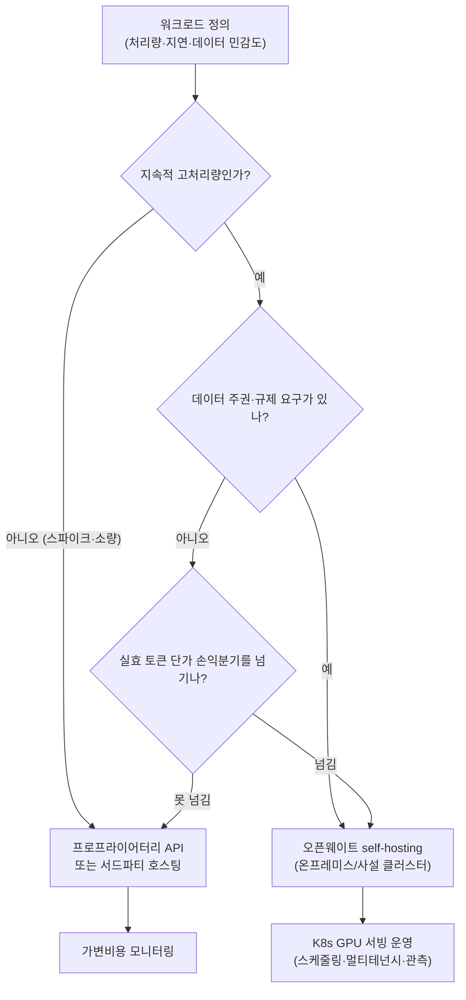

يمكن تلخيص مشهد النماذج مفتوحة الأوزان في منتصف 2026 بجملة واحدة: **الفجوة ضاقت، ولم تتسع من جديد.** يرى التقرير الذي أصدره OpenRouter في يونيو أن النماذج مفتوحة الأوزان باتت تحافظ على فجوة قدرة لا تتجاوز ثلاثة إلى ستة أشهر عن مختبرات الحدود الأمامية، دون أن تتسع. إذا صح هذا الافتراض، فالقرار الحقيقي الذي يجب على المؤسسات اتخاذه لم يعد "أي النماذج أذكى؟"، بل أصبح "أين نشغّل هذا الحِمل، وبأي تكلفة؟"

نحن في ThakiCloud نتعامل مع خدمة النماذج عبر منصة AI/ML SaaS المبنية على K8s. لذا نقرأ هذا التحول من زاوية **اقتصاديات self-hosting** لا من قائمة النماذج. حين يرتقي مفتوح الأوزان إلى مستوى الحدود الأمامية، لا يعود self-hosting مثالية رومانسية، بل يصير مسألة حساب تكلفة. في هذا المقال نستعرض أبرز النماذج مفتوحة الأوزان في منتصف 2026 لتحديد أين تتشكل نقطة التعادل في التكلفة، وكيف تجعل K8s هذا القرار قابلا للتشغيل.

## الفجوة لا تتسع: مشهد النماذج مفتوحة الأوزان في منتصف 2026

نبدأ بالحقائق. النماذج الأربعة أدناه مستخلصة من مصادر مستقلة متعددة (Artificial Analysis، بطاقات نماذج Hugging Face، إعلانات المختبرات)، ولم نعتمد على مرجع معياري واحد.

| النموذج | الحجم (إجمالي/نشط) | الرخصة | مؤشر AA الذكائي | ملاحظات |
|---|---|---|---|---|
| DeepSeek V4 Flash | 284B / 13B (MoE) | MIT | ~40 | SWE-bench Verified 79.0%، سياق 1M |
| GLM-5.2 (Z AI) | 753B | MIT | 51 | الأول بين مفتوحة الأوزان، ضمن المراتب الأربع الأولى عالميا |
| MiniMax M3 | 428B / 23B (MoE) | رخصة مجتمعية | 44 | متعدد الوسائط أصيل، سياق 1M |
| NVIDIA Nemotron 3 Ultra | 550B / 55B (MoE) | OpenMDW | 48 | نموذج أمريكي مفتوح، أكثر من 300 tok/s |

تبرز عدة نقاط. **GLM-5.2** حقق 51 نقطة في مؤشر Artificial Analysis الذكائي ليتصدر قائمة النماذج مفتوحة الأوزان، ويحتل موقعا بين المراتب العليا حتى عند إدراج النماذج المغلقة. ما يلفت الانتباه أن النماذج المغلقة الأعلى مرتبة (Fable 5 وOpus 4.8 وGPT-5.5) لا تزال تتصدر القائمة. بمعنى أن القول بأن "مفتوح الأوزان تجاوز الحدود الأمامية" مبالغة لا تصح. العبارة الدقيقة هي أن **الحدود الأمامية لم تستطع الفرار**، أي أن المُطارِد اقترب كفاية دون أن يكون المُطارَد قد توقف.

**DeepSeek V4 Flash** يُعدّ أول نموذج مفتوح الأوزان يصلح للتضمين المباشر في أنابيب عوامل البرمجة. SWE-bench Verified 79.0% يقل عن النسخة Pro من نفس العائلة بفارق 1.6 نقطة فحسب، فيما يبلغ سعره نحو 0.14 دولار إدخالا و0.28 دولار إخراجا لكل مليون رمز. **MiniMax M3** هو النموذج الوحيد في هذه المجموعة الذي يوفر دعما أصيلا متعدد الوسائط (صورة وفيديو)، مما يمنحه ميزة في أحمال عمل مثل أتمتة واجهة المستخدم وتحويل لقطات الشاشة إلى كود. **Nemotron 3 Ultra** هو النموذج الأمريكي المفتوح الذي أعلنت عنه NVIDIA في Computex 2026، ويتميز بمعدل أكثر من 300 tok/s ورخصة صديقة للمؤسسات.

ملاحظة ضرورية: تضمّن المصدر الأصلي لـ OpenRouter ادعاءا جيوسياسيا مفاده أن GLM-5.2 برز بسبب تعطّل بعض النماذج المغلقة جراء قيود تصدير أمريكية. غير أن تصنيفات المعايير المستقلة المتاحة للعموم في الفترة ذاتها تُظهر تلك النماذج في المراتب العليا، مما يجعل هذه العلاقة السببية غير مؤكدة. لذا نكتفي في هذا المقال بالحقائق الموثقة المتعلقة بالنماذج والأداء والتسعير، ونتجنب تفسيرات الأسباب والنتائج غير المثبتة.

## إعادة حساب التكلفة: ليست سعر الرمز، بل التكلفة الإجمالية للتشغيل

حين يرتقي مفتوح الأوزان إلى مستوى الحدود الأمامية، يتبدل محور نقاش التكلفة. كان السؤال سابقا: "كم من الأداء نتنازل عنه لتوفير التكلفة؟"، أما الآن فصار: **"من أين نحصل على الذكاء ذاته بأقل سعر؟"** وإجابة هذا السؤال لا تنبثق من جدول أسعار الرموز وحده.

ثمة ثلاثة أنماط تكلفة ينبغي التمييز بينها.

أولا، **واجهة برمجة التطبيقات المغلقة**. لا تكاليف تشغيلية، وإمكانية وصول فورية لأعلى أداء، لكن التكلفة المتغيرة تتناسب طرديا مع الاستخدام وتخرج البيانات إلى الخارج. هذا النمط مناسب لأحمال العمل ذات الحجم المنخفض أو غير المنتظم أو التي تستلزم الأداء الأقصى.

ثانيا، **مفتوح الأوزان مع استضافة طرف ثالث**. الأوزان متاحة للعموم لكن التشغيل يتم عبر مزود استدلال خارجي. سعر الرمز أقل بكثير من النماذج المغلقة، وهو ما تُبرزه تقارير النماذج مفتوحة الأوزان، غير أن الفوترة لا تزال قائمة على الاستخدام وحوكمة البيانات رهينة بالمزود.

ثالثا، **مفتوح الأوزان مع self-hosting**. يُنزَّل الأوزان ويُشغَّل على معدات GPU الخاصة بالمؤسسة أو على بنيتها التحتية الداخلية. يتحول هيكل التكلفة من متغير إلى **ثابت (إهلاك GPU + تشغيل)**. الجوهر هنا نقطة التعادل: حين يكفل معدل المعالجة المستمر قسمة التكلفة الثابتة على عدد كافٍ من الرموز، يصبح سعر الرمز الفعلي أدنى من أي خيار API. وعدم خروج البيانات خارج الحدود يُعدّ، في البيئات ذات المتطلبات التنظيمية والسيادية، شرطا أساسيا لا عاملا تكلفة.

أكثر الأخطاء شيوعا في هذا المسار القراري هو **الحكم على المرحلتين الثانية والثالثة بسطر واحد من جدول أسعار الرموز**. التكلفة الحقيقية لـ self-hosting ليست في الأوزان (متاحة مجانا)، بل في توفير GPU وحزمة الخدمة والجدولة والمراقبة وكوادر التشغيل. لذا فإن عبارة "مفتوح الأوزان مجاني" صحيحة إلى النصف فحسب: النموذج مجاني، **أما التشغيل فليس كذلك.** مدى كفاءة هذا التشغيل وثباته هو ما تدور حوله اقتصاديات self-hosting في جوهرها.

## دلالات تطبيقية لمنتجات ThakiCloud

اقتصاديات self-hosting للنماذج مفتوحة الأوزان هي بالضبط المسألة التي تعالجها ThakiCloud بمنتجين اثنين.

**منظور ai-platform (البنية التحتية والخدمة).** منصة ai-platform من ThakiCloud تُشغّل خدمة النماذج على K8s. ما يُقرّب نقطة التعادل في self-hosting فعليا هو كفاءة البنية التحتية. جدولة مهام GPU المبنية على Kueue تُقلّل تعطّل المعجّلات الباهظة، ومحركات الخدمة عالية الإنتاجية كـ vLLM مع التكميم (FP8 وNVFP4) تستخرج رموزا أكثر من نفس المعدات، مما يخفض نقطة التعادل حتى في مستويات معالجة أقل. البنية متعددة المستأجرين تُتيح توزيع أحمال العمل على مجموعة GPU مشتركة، مما يوزع التكاليف الثابتة. أما نشر النماذج داخليا أو في بيئات سيادية فيُلبّي متطلبات سيادة البيانات دون عقوبة تكلفة، وهو أمر بالغ الأهمية في السياقات ذات المتطلبات التنظيمية والأمنية الصارمة. باختصار، ai-platform يُسوّق المرحلة الأخيرة من المخطط أعلاه، وهي **تشغيل خدمة GPU على K8s**.

**منظور Paxis (اقتصادية العوامل).** الخدمة منخفضة التكلفة لا تنتهي عند ذاتها، بل تُوجد اقتصادية عوامل. حين يتاح الأداء الحدودي في البرمجة كـ DeepSeek V4 Flash بعشرات السنتات لكل مليون رمز، تصبح تكلفة الرموز في سير عمل العوامل متعددة الخطوات قابلة للاحتمال. Paxis من ThakiCloud هو مستوى تحكم Agent-Native Cloud يعمل فوق ai-platform، يختار من أكثر من 960 مهارة عبر BM25 وينفذها في بيئات معزولة، مع تمرير كل إجراء عبر بوابات سياسية وسجلات تدقيق. حين تخفض الخدمة الرخيصة من ai-platform تكلفة استدعاء العوامل، يتسع هامش تصميم تنسيق العوامل متعددة المراحل في نفس الميزانية. بمعنى أن اقتصاديات self-hosting لا تنحصر في توفير البنية التحتية، بل تُوسّع هامش التصميم لطبقة العوامل التي تعمل فوقها مباشرة.

## القيود والاعتراضات المضادة

دعونا نُفنّد تفاؤل هذا المقال من الداخل.

أولا، self-hosting ليس دائما الأرخص. نقطة التعادل تفترض معدل معالجة مرتفعا ومستمرا. إن كان حجم المرور منخفضا أو غير منتظم، لن تُستهلك التكاليف الثابتة وتبقى API الخيار الأوفر. إغفال إهلاك GPU والطاقة والتبريد وكوادر التشغيل يجعل self-hosting يبدو أرخص مما هو عليه.

ثانيا، أرقام المعايير لها فترات ثقة. مؤشر AA الذكائي ودرجات SWE-bench المستشهد بها هي قياسات في بيئات تقييم محددة، ولا تطابق بالضرورة أداء أحمال العمل الحقيقية. بعض المعايير لنماذج حديثة العهد قد لا تتوفر إعادة إنتاج مستقلة كافية في المراحل الأولى من الإطلاق، مما يستوجب التقييم المباشر على أحمال عمل المؤسسة قبل الاعتماد.

ثالثا، الرخصة والمصدر يستحقان التدقيق. "مفتوح الأوزان" ليس مصطلحا متجانسا. MIT (DeepSeek وGLM) والرخصة المجتمعية (MiniMax) وOpenMDW (Nemotron) تختلف في حقوق إعادة التوزيع التجاري والضبط الدقيق. كذلك قد يُحدّد بلد منشأ النموذج وسياسات بياناته مدى إمكانية اعتماده في ظل بيئات تنظيمية بعينها.

رابعا، مشهد النماذج يتقادم بسرعة. الجدول أعلاه لقطة من منتصف 2026 وقابل للتغيير خلال أشهر. لذا فإن الجوهر ليس في أسماء النماذج، بل في المبدأ الثابت: **ما إن تبلغ النماذج مفتوحة الأوزان مستوى الحدود الأمامية، كلما كانت متطلبات التكلفة والسيادة لحِمل العمل أكبر، كلما صارت نقطة التعادل في self-hosting أكثر ملاءمة.** النماذج تتغير، لكن هذا الاتجاه لن يتغير.

## المصادر

- [The Open Weight Models that Matter: June 2026 · OpenRouter Blog](https://openrouter.ai/blog/insights/the-open-weight-models-that-matter-june-2026/)
- [GLM-5.2 is the new leading open weights model on the Artificial Analysis Intelligence Index](https://artificialanalysis.ai/articles/glm-5-2-is-the-new-leading-open-weights-model-on-the-artificial-analysis-intelligence-index)
- [NVIDIA Nemotron 3 Ultra released · Artificial Analysis](https://artificialanalysis.ai/articles/nvidia-nemotron-3-ultra-released)
- [DeepSeek V4 Flash · OpenRouter](https://openrouter.ai/deepseek/deepseek-v4-flash)
- [GLM-5.2 is probably the most powerful text-only open weights LLM · Simon Willison](https://simonwillison.net/2026/jun/17/glm-52/)
