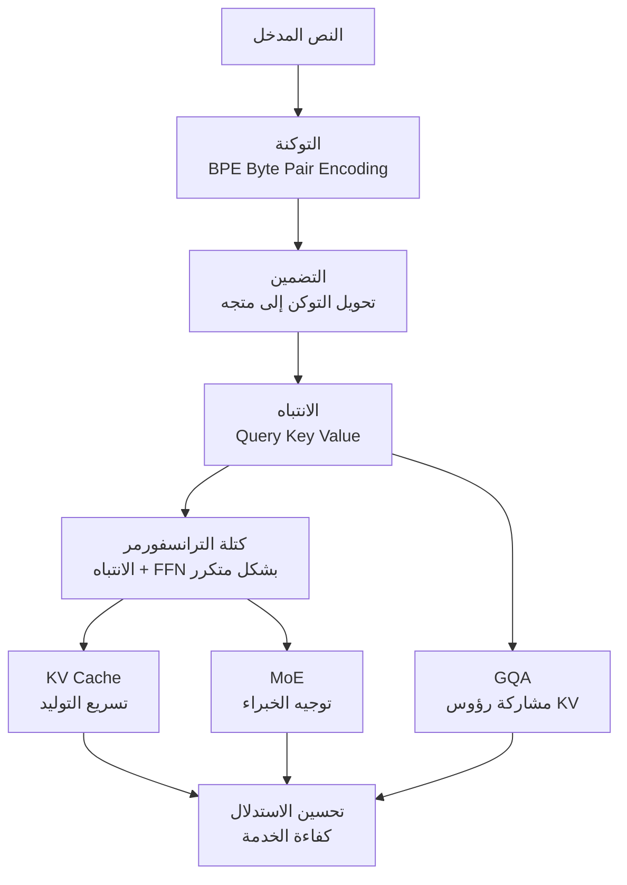

## نظرة عامة

عندما تشغّل خدمة LLM لفترة طويلة، تصل إلى نقطة غريبة. تنشر vLLM، وتراقب استخدام GPU، وتضبط حجم الدفعات (batch size)، لكنك في لحظة ما لا تستطيع أن تشرح بجملة واحدة "لماذا يستهلك هذا الطلب هذا القدر من KV Cache"، أو "ما الذي يقلّصه GQA بالضبط ليوفّر عرض النطاق الترددي للذاكرة". تعرف كيف تستخدم الأدوات، لكن المبادئ التي تقوم عليها تبقى ضبابية. هذه الفجوة تجعل التحسين يعتمد على الحدس، وتمنعك من استنتاج السبب الجذري عندما يحدث عطل.

المصدر التعليمي [amitshekhariitbhu/llm-internals](https://github.com/amitshekhariitbhu/llm-internals) يستهدف هذه المشكلة مباشرة. إنه مستودع تعلّم متدرج يجمع مقالات ومقاطع فيديو بترتيب يبدأ من التوكنة ويمر بالانتباه وبنية الترانسفورمر وKV Cache وصولاً إلى تحسين الاستدلال. المؤلف الأصلي هو Amit Shekhar، وقد رتّب المواضيع بحيث تبني نموذجاً ذهنياً واحداً متماسكاً بدلاً من مجموعة دروس متفرقة وعابرة.

تشغّل ThakiCloud منصة **ai-platform** لتقديم النماذج لعملاء متنوعين فوق Kubernetes. معظم العوامل التي تحدد تكلفة الخدمة وزمن الاستجابة تنبع من هذه البنية الداخلية التي يتناولها هذا المستودع. لذلك، هذا المقال ليس مجرد تعريف بمصدر تعليمي، بل محاولة لتوضيح لماذا يشكّل كل موضوع منها سلاحاً مباشراً لمهندس البنية التحتية.

## ما هو هذا المصدر

llm-internals ليس إطار عمل لتشغيل الكود، بل هو **مسار تعلّم (learning path)**. يتتبع خط الأنابيب الذي يمر به LLM من استقبال المدخل حتى إنتاج التوكن التالي، ويعرض المفاهيم اللازمة في كل مرحلة بترتيب مدعوم بمصادر خارجية. جوهر المستودع هو تصميم المنهج نفسه: "ما الذي يجب فهمه، وبأي ترتيب، حتى تكتمل الصورة الكاملة".

المواضيع الرئيسية التي يغطيها المستودع تتبع التدفق التالي.



أهمية هذا الترتيب تكمن في أن المواضيع اللاحقة لا يمكن فهمها دون المواضيع السابقة. فـ KV Cache لا يكتسب معناه إلا بعد فهم ما هما Key وValue في الانتباه، وGQA لا يظهر معناه إلا بعد فهم بنية الرؤوس في الانتباه متعدد الرؤوس، أي "ما الذي يتم مشاركته بالضبط". قيمة هذا المستودع لا تكمن في عمق كل مصدر على حدة، بل في هذا الترتيب الذي لا يكسر سلسلة الاعتماد بين المفاهيم.

## استعراض المواضيع الأساسية

### التوكنة: نقطة البداية لكل شيء

لا يتعامل LLM مباشرة مع الحروف أو الكلمات، بل يعالج النص على شكل توكنات. تستخدم معظم النماذج الحديثة عائلة BPE (Byte Pair Encoding)، وهي طريقة تدمج بشكل متكرر أزواج البايتات الأكثر تكرراً معاً لبناء المفردات. قد تبدو التوكنة أمراً بسيطاً، لكنها من منظور الخدمة عامل تكلفة مباشر. نفس الجملة يمكن أن يختلف عدد توكناتها اختلافاً كبيراً باختلاف اللغة والمُرمِّز (tokenizer)، وعدد التوكنات ينعكس مباشرة على استهلاك KV Cache وحجم العمليات الحسابية. ظاهرة استهلاك اللغات غير الإنجليزية مثل الكورية والعربية عدداً أكبر من التوكنات مقارنة بالإنجليزية هي نقطة يجب مراعاتها بالضرورة عند احتساب تكلفة الخدمة.

### الانتباه: Query وKey وValue

قلب الترانسفورمر هو الانتباه الذاتي (self-attention). يُسقَط كل توكن إلى ثلاثة متجهات. Query يمثل "ما الذي أبحث عنه"، وKey يمثل "ما الذي أقدّمه"، وValue يمثل "المحتوى الفعلي الذي سيُنقل". يُحسب مقياس الانتباه عبر الضرب الداخلي بين Query وKey، ثم يمرّ عبر عملية القياس (scaling) والدالة softmax لإنتاج مجموع مرجّح لـ Value.

```
Attention(Q, K, V) = softmax( (Q · Kᵀ) / √d_k ) · V
```

هذه المعادلة بسيطة في ظاهرها، لكن حقيقة أن عملية الانتباه تنمو بمعدل O(n²) بالنسبة لطول التسلسل n هي ما ينتج عنه كل عمليات التحسين اللاحقة. من هنا تبدأ الإجابة عن سبب ارتفاع تكلفة السياقات الطويلة، وسبب حساسية بنية الخدمة لطول السياق.

### كتلة الترانسفورمر وKV Cache

الترانسفورمر هو بنية من طبقات متعددة، تجمع كل طبقة منها الانتباه مع شبكة تغذية أمامية (FFN). في التوليد ذاتي الانحدار (autoregressive)، يُنتج التوكن واحداً تلو الآخر، وإعادة حساب Key وValue لكل التوكنات السابقة في كل خطوة يمثل هدراً كبيراً. **KV Cache** يخزّن قيم Key وValue التي حُسبت سابقاً ويعيد استخدامها، مما يرفع سرعة التوليد.

المشكلة هي أن هذه الذاكرة المؤقتة تستهلك ذاكرة كبيرة. يتناسب حجم الذاكرة المؤقتة تقريباً مع `2 × عدد الطبقات × عدد رؤوس KV × أبعاد الرأس × طول التسلسل × حجم الدفعة`. السياقات الطويلة وكثرة الطلبات المتزامنة تضخّم هذه القيمة بشكل انفجاري. هذا هو بالضبط الضغط البنيوي الذي يجعل تقنية PagedAttention في vLLM تدير KV Cache على شكل صفحات لتقليل التجزئة.

### MoE وGQA: تغييرات بنيوية لأجل الكفاءة

**مزيج الخبراء (Mixture of Experts، MoE)** يقسّم شبكة FFN إلى عدة "خبراء"، ويقوم موجّه (router) بتفعيل جزء فقط من الخبراء لكل توكن. إجمالي عدد المعاملات كبير، لكن حجم العمليات الحسابية الفعلي لكل توكن يصبح صغيراً. في المقابل، يفرض هذا على الخدمة تحديات جديدة: التوازي بين الخبراء، وعدم توازن التوجيه، وتوزيع الذاكرة.

**الانتباه المُجمَّع الاستعلام (Grouped-Query Attention، GQA)** هو حل وسط بين الانتباه متعدد الرؤوس (MHA) والانتباه متعدد الاستعلامات (MQA). في MHA، يملك كل رأس Key وValue خاصين به، بينما في MQA تشترك جميع الرؤوس في Key وValue واحد. أما GQA فيجمّع الرؤوس في عدد قليل من المجموعات، وتشترك كل مجموعة في KV خاص بها. والنتيجة أن **حجم KV Cache وعرض النطاق الترددي للذاكرة ينخفضان** بينما يبقى فقدان الجودة عند حدّه الأدنى. فهم GQA يوضّح لماذا تعتمد النماذج مفتوحة الأوزان الحديثة هذه البنية، ولماذا تختلف موازنة الذاكرة عند الخدمة تبعاً لذلك.

## لماذا تهم هذه المعرفة مهندس البنية التحتية

المواضيع أعلاه ليست موضع فضول أكاديمي، بل هي السبب المباشر لتكلفة الخدمة. فهم معادلة حجم KV Cache يتيح توقّع كيف يصطدم عدد الطلبات المتزامنة وطول السياق بذاكرة GPU. وفهم GQA يفسّر لماذا يستطيع بعض النماذج معالجة عدد أكبر من الطلبات على نفس GPU. وفهم MoE يسمح بالاستعداد لسبب تعقيد الجدولة الناتج عن التوزيع المتوازي للخبراء.

على النقيض، غياب هذه المعرفة يعني أنك ستكتفي، عند حدوث عطل، بملاحظة عرض "نفدت الذاكرة" فقط، وتكرر الاستجابة المكلفة المتمثلة في تقليل حجم الدفعة عشوائياً أو إضافة المزيد من وحدات GPU. المهندس الذي يعرف البنية الداخلية يملك رافعات أدق: ترقيم KV Cache، وسقف طول السياق، والتكميم (quantization)، واختيار نماذج تعتمد GQA.

## تطبيقات على منتجات ThakiCloud

تقدّم منصة **ai-platform** من ThakiCloud استدلالاً قائماً على vLLM لعدة مستأجرين فوق Kubernetes وجدولة GPU عبر Kueue. تنعكس البنية الداخلية التي استعرضناها في هذا المقال مباشرة على رافعات التشغيل الفعلية.

- **KV Cache**: استناداً إلى PagedAttention ومعادلة حجم KV Cache، نحدّد سقف طول السياق وميزانية التزامن لكل مستأجر. توقّع استهلاك الذاكرة المؤقتة يتيح رفع الإنتاجية دون الإفراط في حجز ذاكرة GPU.
- **GQA والتكميم**: من أجل استيعاب عدد أكبر من الطلبات على نفس العتاد، نُعطي الأولوية في المراجعة للنماذج مفتوحة الأوزان التي تعتمد GQA، وندمج ذلك مع التكميم بهدف تحقيق تكلفة خدمة منخفضة في البيئات المحلية (on-premise) والسيادية.
- **خدمة MoE**: نراعي مسبقاً أن نماذج MoE التي تحتاج توازياً بين الخبراء تتطلب معاملة خاصة في تصميم طوابير Kueue وتوزيع العُقد.

من منظور الوكلاء الذكيين (agents)، فإن **Paxis**، السحابة الأصيلة للوكلاء (Agent-Native Cloud) من ThakiCloud، توفّر بيئة مواتية لتراكم هذه المعرفة الداخلية كأصل جماعي للفريق. بما أن Paxis تتعامل مع المهارات (skills) كموارد من الدرجة الأولى، يمكن تحويل قرارات متكررة مثل "حساب ميزانية KV Cache" إلى مهارة موثّقة يُعاد استخدامها داخل بيئة معزولة (sandbox) وتُتبَّع عبر سجل تدقيق. هذا يوفّر قناة لتحويل خبرة الخدمة، التي غالباً ما تظل معرفة ضمنية لدى مهندس بعينه، إلى معرفة إجرائية على مستوى المؤسسة.

## القيود ووجهات النظر المضادة

أكبر نقطة ضعف في هذا المصدر هي القدر المشترك بين جميع المستودعات المُنسَّقة (curation repos). بما أنه يعتمد على ربط مدونات ومقاطع فيديو خارجية، فإن الروابط قد تصبح قديمة أو تختفي، كما توجد فوارق في المستوى والعمق بين المصادر المختلفة. ولا يوجد ضمان بأن التغيرات المعمارية الأحدث (مثل أشكال جديدة من الانتباه) ستنعكس فوراً في المستودع.

كذلك، لا تزال هناك فجوة بين فهم المفهوم والتشغيل الفعلي. حفظ معادلة حجم KV Cache عن ظهر قلب لا يعني بالضرورة الحصول فوراً على الإنتاجية الفعلية على GPU معين. القياس الفعلي، وتحليل الأداء (profiling)، والضبط الخاص بكل حمل عمل تتطلب خبرة تشغيلية منفصلة. هذا المسار التعليمي ذو قيمة كبيرة كنقطة انطلاق لبناء نموذج ذهني دقيق، لكنه ليس بحد ذاته خط النهاية لتحسين الخدمة. لا بد أن تتبعه بالضرورة مرحلة التحقق فوق حركة مرور فعلية بعد استيعاب المبادئ.

## المصادر

- [amitshekhariitbhu/llm-internals (GitHub)](https://github.com/amitshekhariitbhu/llm-internals)
- التغريدة الأصلية المُوصية: Dan Kornas, "Stop learning LLM internals from random one-off tutorials"
