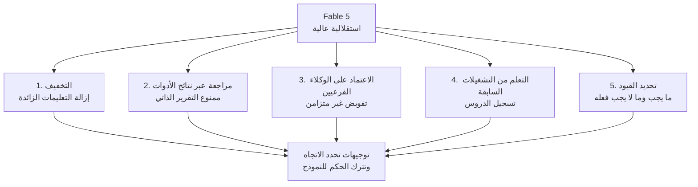

## نظرة عامة

في كل مرة يصدر فيها نموذج جديد، نميل إلى نقل التعليمات ذاتها التي بنيناها للنموذج القديم. لكن دليل التوجيه الرسمي الذي نشرته Anthropic لنموذج Claude Fable 5 يوصي بعكس ذلك تماماً. فالتعليمات التي كانت تجعل النماذج السابقة تتصرف بشكل جيد قد تُضعف فعلياً جودة مخرجات Fable 5. وبكلمات الدليل نفسه، فإن المهارات المبنية للنماذج السابقة تكون غالباً "مُفصّلة أكثر من اللازم بالنسبة لـ Claude Fable 5، ما قد يُضعف جودة المخرجات".

هذه الجملة الواحدة تلخص روح الدليل بأكمله. النموذج الأذكى يحتاج إلى قواعد أقل، لا أكثر. وبالنسبة لمؤسسة مثل ThakiCloud تُشغّل الوكلاء فعلياً في بيئة الإنتاج، هذا التحول ليس مشكلة الآخرين. إنه تحذير من أن مئات المهارات والقواعد التي نستخدمها للتحكم في الوكلاء قد تتحول إلى عبء أمام نموذج أحدث. لنستعرض معاً المبادئ الخمسة التي يطرحها الدليل واحداً تلو الآخر، ولنلاحظ كم منها يتقاطع مع الانضباط الذي نمارسه بالفعل.

## ما الذي تغيّر

يتمتع Fable 5 باستقلالية أعلى من الجيل السابق. فهو يُطلق الوكلاء الفرعيين بمبادرة منه بشكل أكثر جرأة، ويدفع المهام الطويلة إلى الأمام من تلقاء نفسه، بل ويقوم أحياناً بأفعال لم يطلبها أحد. وكلما ارتفعت القدرة، وجب أن تتغير طريقة التحكم أيضاً. فالتعليمات التي تُمسك بيد النموذج وتوجّهه خطوة بخطوة تشبه توجيه موظف جديد كفء في كل حركة، وهي تُعيق حكمه بدلاً من أن تساعده. المبادئ الخمسة في الدليل لا تهدف إلى كبح هذه الاستقلالية، بل إلى توجيهها في الاتجاه الصحيح.



## المبدأ الأول: خفّف التعليمات

أول ما يشدد عليه الدليل هو الحذف. فالتعليمات المكتوبة بإحكام للنماذج القديمة تنهك أداء Fable 5. الحدس القائل بأن القواعد الأكثر أفضل ينقلب رأساً على عقب مع هذا النموذج. عند الانتقال إلى نموذج جديد، لا تكون الخطوة الأولى إضافة المزيد إلى التوجيه، بل تحديد أي التعليمات لم تعد ضرورية والتخلص منها.

هذا المبدأ يتقاطع تماماً مع فكرة "غلاف رقيق، مهارات ثقيلة" التي حافظ عليها مستودعنا طويلاً: نُبقي القدرة في المهارات والبيانات لا في الغلاف نفسه، ونُبقي التعليمات التي نُثقل بها كل جولة عند حدها الأدنى. وحين نستقبل نموذجاً جديداً، فإن أول ما نفعله ليس زيادة القواعد والمهارات، بل تنقية أي تعليمة لا تجتاز السؤال: "هل سيُخطئ الوكيل من دون هذه الجملة؟"

## المبدأ الثاني: راجع التقدم عبر نتائج الأدوات

خلال التشغيلات الطويلة المستقلة، ينبغي توجيه Fable 5 لمراجعة تقدمه بنفسه بالاستناد إلى نتائج الأدوات الفعلية. التوجيه المثال الذي يقدمه الدليل هو التالي.

```text
Before reporting progress, audit each claim against a tool result
from this session. Only report work you can point to evidence for.
```

بحسب اختبارات Anthropic، ألغت هذه الجملة الواحدة تقارير التقدم المُختلَقة تقريباً بالكامل. فبدلاً من أن يقول النموذج "أعتقد أنني أنهيت هذا"، تُجبره الجملة على الإبلاغ فقط عن العمل الذي يستطيع الإشارة إلى دليل عليه من بين نتائج أدوات هذه الجلسة.

هذا يطابق مبدأً كررناه في العديد من قواعدنا الخاصة: لا يمكن أبداً أن يكون التقرير الذاتي للنموذج شرط إنهاء لحلقة تكرارية. أوثق تغذية راجعة هي التحقق الحتمي الذي يُعيد نتيجة نجاح أو فشل بموضوعية، تماماً كما تفعل الاختبارات ومدققات الأنواع والمترجمات. لهذا بالضبط تبت بواباتنا الخاصة بالتحقق حكمها بناءً على رمز الخروج، ولهذا تُغلق نتائج التوزيع المتوازي بتصويت لا برواية. وكون Anthropic قد دوّنت هذا المبدأ الآن في دليل رسمي يُظهر أن عدم الثقة بالتقارير الذاتية بات يتحول إلى الافتراضي في تشغيل الوكلاء، لا إلى ذوق فريق بعينه.

## المبدأ الثالث: اعتمد بثقة على الوكلاء الفرعيين

يُطلق Fable 5 الوكلاء الفرعيين المتوازيين بمبادرة أكبر من النماذج السابقة. يوصي الدليل بعدم كبح هذا الميل بل الاستفادة منه، مع توجيه واضح لتحديد متى يكون التفويض مناسباً، وتفضيل التواصل غير المتزامن بين المنسّق والوكلاء الفرعيين. الهدف من التفويض ليس التفويض بحد ذاته، بل دفع العمل المستقل بشكل متوازٍ لرفع الإنتاجية الإجمالية.

هذا بالضبط ما يتناوله انضباط توجيه النماذج في مستودعنا. نُسند الاستكشاف وقراءة الملفات إلى نماذج منخفضة الكلفة، والتنفيذ إلى مستوى متوسط، ونحجز النماذج عالية الكلفة للاستدلال المعقد والتحقق فقط، ونحرص دائماً على تحديد معامل النموذج عند إطلاق أي وكيل فرعي. وكون Fable 5 يتعامل مع الوكلاء الفرعيين بشكل أفضل يعني أن هذا النوع من التوجيه سيُحقق مردوداً أكبر مستقبلاً. فإبقاء المنسّق خفيفاً وعزل العمل الثقيل فقط في وكلاء فرعيين متخصصين نمط يتماشى طبيعياً مع سلوك النموذج.

## المبدأ الرابع: تعلّم من التشغيلات السابقة

يعمل Fable 5 بشكل جيد بوجه خاص عندما يستطيع تسجيل الدروس المستفادة من التشغيلات السابقة والرجوع إليها. يوصي الدليل بتوفير مساحة تخزين بسيطة قدر ملف ماركداون واحد، ويقدّم هذا المثال.

```text
Store one lesson per file with a one-line summary at the top.
Record corrections and confirmed approaches alike, including why
they mattered.
```

خزّن درساً واحداً في كل ملف، وضع ملخصاً بسطر واحد في الأعلى، وسجّل التصحيحات والمقاربات المؤكدة معاً مع سبب أهميتها. هذا التوجيه يشبه إلى حد لافت بنية الذاكرة الخاصة بالنظام نفسه الذي يكتب هذا المقال. تعمل ذاكرة وكلاء ThakiCloud تماماً على هذا النمط: حقيقة واحدة في كل ملف، وملخص بسطر واحد في بيانات الترويسة، وتصحيحات وأنماط مؤكدة مُسجّلة مع أسبابها. وحلقة الذاكرة الساخنة التي تقرأ كل ما تعلمناه حتى الجلسة الأخيرة كموجز دائم عند بداية كل جلسة جديدة تقوم على الفكرة ذاتها. هذا التطابق بين توصية Anthropic وانضباطنا الخاص بالذاكرة إشارة إلى أن عدم ترك الوكيل يبدأ من صفحة بيضاء في كل مرة يقترب من أن يصبح إجابة عالمية، لا عادة محلية.

## المبدأ الخامس: حدّد القيود بوضوح

ثمن الاستقلالية العالية أن Fable 5 يقوم أحياناً بأفعال لم يطلبها أحد. لمنع ذلك، يوصي الدليل بتعريف قيود صريحة على ما يجب على النموذج فعله وما لا يجب فعله. اترك الاتجاه مفتوحاً، لكن ارسم بوضوح الخط الذي لا ينبغي تجاوزه.

في عملياتنا الخاصة، يُنفَّذ هذا الخط عبر بوابات الموافقة وشبكات الأمان حول التغييرات التي لا يمكن التراجع عنها. فأي عمل غير قابل للتراجع، كتعديل المخطط أو النشر، يتطلب خطة مسبقة وموافقة صريحة، وأي فعل عالي المخاطر مثل تنفيذ الصفقات يحصل على حارس صارم. كلما ازدادت كفاءة النموذج، ازدادت أهمية توضيح ما لا يجوز له فعله، أكثر من توضيح ما يستطيع فعله. استقلالية Fable 5 تصبح أصلاً حين تُرسم القيود جيداً، وتصبح خطراً حين لا تُرسم كذلك.

## دلالات التطبيق على منتجات ThakiCloud

تنطبق هذه المبادئ الخمسة مباشرة على فلسفة تصميم Paxis، المنتج الذي تبنيه ThakiCloud. Paxis هو مستوى تحكم Agent-Native Cloud يعمل فوق ai-platform، ويعامل المهارات والأدوات والسياسات وسجلات التدقيق كموارد من الدرجة الأولى. ما يسميه الدليل "التخفيف" هو طريقتنا في إبقاء غلاف المهارات رقيقاً وتكديس القدرة في المهارات بدلاً منه. و"المراجعة عبر نتائج الأدوات" هي طريقتنا في إغلاق التوزيع المتوازي ببوابات تحقق حتمية. و"الاعتماد بثقة على الوكلاء الفرعيين" يتجسد عبر تنسيق متعدد الوكلاء بنمط DAG وتوجيه النماذج. و"التعلم من التشغيلات السابقة" هو محرك ذاكرتنا وحلقة الذاكرة الساخنة. و"تحديد القيود" هو بوابات السياسات وسجلات التدقيق.

بعبارة أخرى، دليل Anthropic للتوجيه يمنح أساساً رسمياً لانضباط نمارسه بالفعل. وكلما ازدادت قوة النماذج الجديدة، ازدادت قيمة هذا الانضباط. فبدلاً من ترك نموذج كفء يبدأ من صفحة بيضاء، أو تصديق تقاريره الذاتية كما هي، أو إعاقة حكمه بتعليمات مفرطة، من الأفضل تغليفه بغلاف رقيق وبوابات تحقق وذاكرة مستمرة. وهذا التغليف بالذات هو ما يبيعه Paxis.

## الحدود والحجج المضادة

لا ينبغي التعامل مع هذا الدليل باعتباره عقيدة مطلقة. مبدأ "خفّف التعليمات" جذاب، لكن تحديد ما الذي يجب حذفه يبقى مسألة حكم. فتعليمة واحدة حُذفت خطأً قد تُسبب انتكاسة، ورصد تلك الانتكاسة يتطلب أصلاً المبدأين السابقين: التحقق الحتمي وسجل التشغيلات السابقة. المبادئ يُسند بعضها بعضاً، لذا فإن تطبيق واحد منها فقط يُنصّف فاعليتها.

كما أن هذا الدليل يستهدف نموذجاً بعينه هو Fable 5. النصائح الواردة فيه لا تنتقل بالكامل إلى كل نموذج، لا سيما النماذج الصغيرة الأقل استقلالية. فالنماذج الصغيرة تحتاج بالأحرى إلى تعليمات أكثر إحكاماً وهيكل ثابت للحفاظ على الجودة. تطبيق "قلّل التعليمات" بشكل موحّد على جميع المستويات سيُزعزع مخرجات العمال منخفضي الكلفة. الانضباط في التوجيه يحتاج إلى معايرة بحسب مستوى النموذج.

وأخيراً، هناك مفارقة: كلما ازدادت استقلالية النموذج، ازدادت صعوبة فرض القيود عليه. لإجبار نموذج يُطلق وكلاءه الفرعيين بنفسه ويقوم بأفعال لم تُطلب على التوقف، لا تكفي التوجيهات وحدها، بل لا بد من دعمها بخطافات حتمية وبوابات موافقة. الدليل يتناول لغة التوجيه، لكن شبكة الأمان الحقيقية يجب أن يمتلكها الكود.

## المصادر

- Prompting Claude Fable 5، الوثائق الرسمية لشركة Anthropic (platform.claude.com)
- Redeploying Claude Fable 5، أخبار Anthropic
