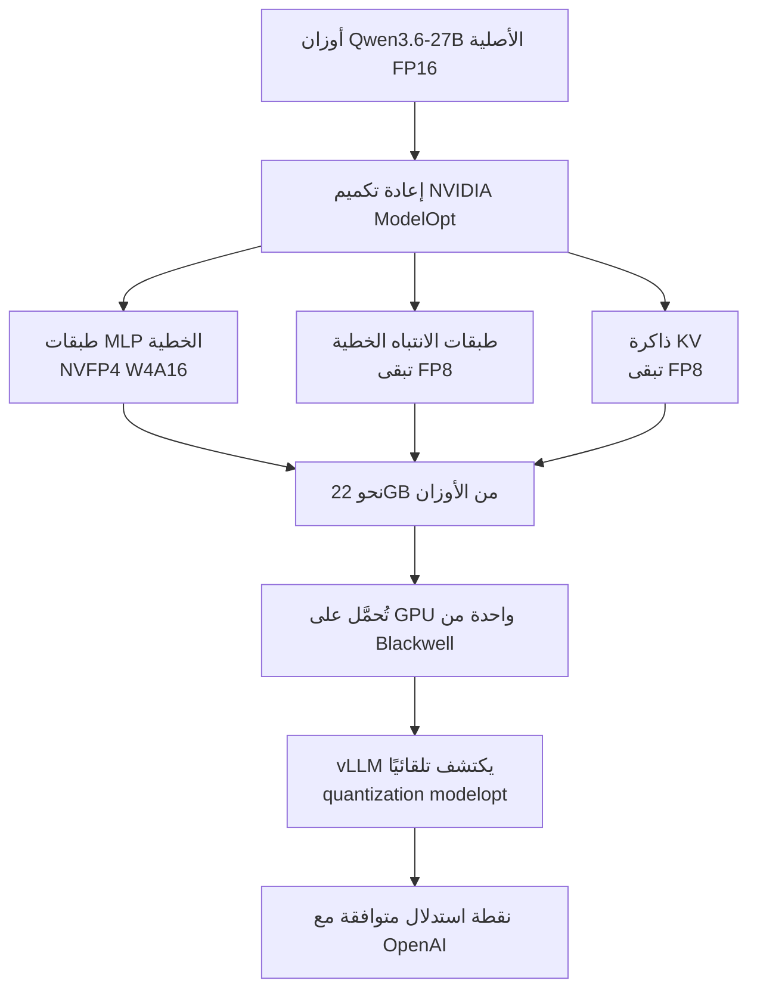

## نظرة عامة

إذا أمكنك خدمة نموذج من فئة 27B على GPU واحدة وبدقة شبه خالية من الخسارة، يتغير اقتصاد الاستدلال في البيئات المحلية. تعيد نقطة التحقق nvidia/Qwen3.6-27B-NVFP4 تكميم Qwen3.6-27B إلى نوع بيانات NVFP4 ليعمل على vLLM حديث دون أي إعداد إضافي. هذه هي خلفية إعلان مشروع vLLM أن نقطة التحقق هذه جاهزة للاستدلال على وحدات Blackwell.

الجوهر ليس مجرد "التخفيض إلى 4 بت" بل **ما الذي خُفّض وما الذي بقي**. يشرّح هذا المقال تصميم الدقة المختلطة في إعادة تكميم NVFP4، ويعرض كيفية خدمته فعليًا عبر vLLM، ثم يستعرض ماذا يعني ذلك لبنية تكلفة خدمة GPU متعددة المستأجرين في ThakiCloud ai-platform. وحيثما يلزم القياس، نُشير إليه بصدق.

## ما هذا

NVFP4 صيغة عائمة بأربع بتات تخفض عدد البتات لكل معامِل من 16 إلى 4، فتقلّص متطلبات القرص وذاكرة GPU بنحو 2.5 مرة. لكن التصميم الفعلي لـ nvidia/Qwen3.6-27B-NVFP4 لا يسحق كل شيء إلى 4 بت. فإعادة تكميم NVIDIA ModelOpt **تخفض طبقات MLP الخطية فقط إلى NVFP4 (W4A16)، مع إبقاء طبقات الانتباه الخطية وذاكرة KV بصيغة FP8.** ونتيجة لذلك تتّسع نحو 22GB من الأوزان على GPU واحدة من Blackwell. وتُبلّغ NVIDIA بأن هذا التكوين شبه خالٍ من الخسارة في الدقة مقارنةً بخط أساس FP8.

لهذا الاختيار المختلط سبب. فطبقات MLP تحمل الحصة الطاغية من المعامِلات، فوفر الذاكرة فيها كبير وتتحمّل التخفيض إلى 4 بت نسبيًّا. أما الانتباه وذاكرة KV فحساسان للجودة في السياقات الطويلة، فيبقيان بصيغة FP8 حفاظًا على الدقة. المبدأ: "خفّض الجزء الأثقل بأشد قدر، وأبقِ الجزء الأكثر حساسية بتحفّظ".



مقارنةً بتكميم موحّد إلى 4 بت (مثل W4 عبر كل الطبقات)، يلتقط هذا النهج معظم وفر الذاكرة مع الدفاع عن الجودة بإبقاء الطبقات الحساسة بصيغة FP8. وضبط مقايضة الوفر مقابل الدقة لكل طبقة هو الميزة الفارقة لإعادة تكميم NVFP4.

## التثبيت والخدمة

يكتشف vLLM تكميم ModelOpt تلقائيًّا من نقطة التحقق، فلا حاجة صارمة لتمرير راية تكميم. لكنك تحتاج vLLM حديثًا يدعم NVFP4/W4A16، وتوصي NVIDIA بإصدار nightly أو بناء من المصدر يتضمن دعم ModelOpt. شغّل صورة nightly عبر Docker وقدّم الخدمة كالتالي.

```bash
# vLLM حديث بدعم NVFP4/ModelOpt (صورة nightly)
docker run --gpus all -p 8000:8000 \
  vllm/vllm-openai:nightly \
  vllm serve nvidia/Qwen3.6-27B-NVFP4 \
    --port 8000 \
    --quantization modelopt \
    --max-model-len 262144 \
    --reasoning-parser qwen3
```

تستخدم `--max-model-len 262144` السياق الطويل لعائلة Qwen3.6 كما هو، وتتولى `--reasoning-parser qwen3` تحليل رموز الاستدلال. والنقطة متوافقة مع OpenAI، فتتصل بها العملاء القائمة دون تغيير.

## نتائج التجربة

بصراحة: تفترض نقطة التحقق هذه GPU من فئة Blackwell، والبيئة التي كُتب فيها هذا المقال لا تملك هذا العتاد، لذا **لم نتمكن من إعادة إنتاجها محليًّا.** ومن ثم فالأرقام أدناه ليست قياساتنا بل أرقام أبلغت بها مصادر عامة، مقتبسة كما هي مع الإسناد.

- تُبلّغ NVIDIA بأن تكوين NVFP4 المُعاد تكميمه **شبه خالٍ من الخسارة** في الدقة مقارنةً بخط أساس FP8 (بحسب بطاقة النموذج).
- حجم الأوزان نحو **22GB**، يتّسع على GPU واحدة من Blackwell (بحسب بطاقة النموذج).
- يُبلّغ أحد المعايير الخارجية (loFT LLC) بنحو **190 tok/s من إنتاجية التوليد** بتكوين NVFP4+MTP على RTX PRO 6000 Blackwell Max-Q مزدوجة. وهذا قياس خارجي بدرجة [تقديري]، لا قيمة بيئتنا.

ما أمكننا التحقق منه هو حقائق مسار الخدمة. فكون vLLM يكتشف تكميم ModelOpt تلقائيًّا، وأن التكوين مختلط الدقة (MLP بصيغة NVFP4 والانتباه وKV بصيغة FP8)، وأن نحو 22GB من الأوزان تتّسع على GPU واحدة من Blackwell، كلها مؤكدة في بطاقة النموذج العامة ووصفة vLLM. أما الإنتاجية والكمون الفعليان فيبقيان مسألة تُقاس حين يتوفر العتاد.

## الأثر على منتجات ThakiCloud

ما يجعل نقطة التحقق هذه مثيرة للاهتمام ليس أرقام المعايير نفسها بل **تحول اقتصاد الخدمة**. تُخدِّم ThakiCloud ai-platform النماذج عبر بيئات عملاء متنوعة على K8s وKueue، وGPU دومًا أغلى مورد. فإذا أمكن لنموذج من فئة 27B أن يتّسع على GPU واحدة، وبشكل شبه خالٍ من الخسارة، فأنت تخفض إشغال GPU لكل مستأجر وتستطيع استضافة مزيد من النماذج أو مزيد من المستأجرين على العتاد نفسه.

من منظور تعدد المستأجرين، يتضاعف هذا الوفر. فحين ينزل نموذج من GPU إلى واحدة، تكاد فتحات الخدمة المتزامنة في العنقود تتضاعف. وضمن تخصيص GPU المستند إلى Kueue، يُترجم ذلك مباشرةً إلى طوابير انتظار أقصر وتقاسم عادل أسهل بين المستأجرين. ويهم ذلك خاصةً العملاء ذوي المتطلبات المحلية والسيادية القوية، لأن عدد وحدات GPU الواجب شراؤها يقل، فينخفض حاجز الاستثمار الأولي وتكلفة التشغيل.

كما يتوافق تصميم الدقة المختلطة مع فلسفتنا التشغيلية. فبدل خفض الدقة عشوائيًّا، يتماشى نهج إبقاء الأجزاء الحساسة للجودة وخفض الأجزاء الثقيلة فقط بقوة مع هدف "كفاءة التكلفة والجودة معًا". ولهذا، عند تبني نقطة تحقق مكمَّمة جديدة على ai-platform، نراجع لا درجة المعيار فحسب بل أي طبقات عُوملت بأي دقة. وإعادة تكميم NVFP4 حالة مرجعية جيدة لتلك المراجعة، وحالما نؤمّن إنتاجية مقاسة نخطط لمقال متابعة عن ملف تكلفتها وجودتها في مكدس الخدمة لدينا.

## الحدود والاعتراضات

أولًا، الاعتماد على العتاد صارخ. فمنفعة NVFP4 تبلغ ذروتها على وحدات GPU من جيل Blackwell، ولا ينبغي للأجيال الأسبق توقع الكفاءة نفسها. وجاذبية الخدمة على GPU واحدة لا تصمد إلا على فرض تأمين Blackwell. وفي بيئة يكون فيها توريد GPU نفسه هو عنق الزجاجة، لا تتحول "GPU واحدة تكفي" فورًا إلى وفر في التكلفة.

ثانيًا، "شبه خالٍ من الخسارة" حكاية عن متوسطات المعايير. ففي مجالات محددة أو سياقات طويلة أو مهام حساسة للدقة كالأرقام والشيفرة، قد يظهر انخفاض جودة طفيف مقابل خط أساس FP8. وينبغي تأكيد قرار تبني NVFP4 بتقييم على عبء العمل الفعلي الذي ستخدمه، لا بأرقام بطاقة النموذج الموجزة.

ثالثًا، رقم الإنتاجية في هذا المقال ليس قياسنا. فالمعايير الخارجية تعتمد بشدة على تكوين العتاد (RTX PRO 6000 مزدوجة، واستخدام MTP من عدمه) وعلى حجم الدفعة وطول السياق، لذا تبقى قيمة عنقودنا الفعلية غير محددة حتى نقيسها مباشرةً. وتبلغ خلاصة هذا المقال فقط "الخدمة على GPU واحدة بصيغة NVFP4 تملك إمكان تحويل اقتصاد الخدمة"؛ أما "كم tok/s في بيئتنا" فمسألة تُقال بعد تحقق منفصل.

## المصادر

- nvidia/Qwen3.6-27B-NVFP4 بطاقة النموذج، Hugging Face (<https://huggingface.co/nvidia/Qwen3.6-27B-NVFP4>)
- Qwen/Qwen3.6-27B، vLLM Recipes (<https://recipes.vllm.ai/Qwen/Qwen3.6-27B>)
- Measuring Qwen3.6-27B NVFP4+MTP on vLLM، loFT LLC (<https://loftllc.dev/en/docs/tech/llm-research/qwen3-6-27b-nvfp4-mtp-vllm-benchmark/>)
